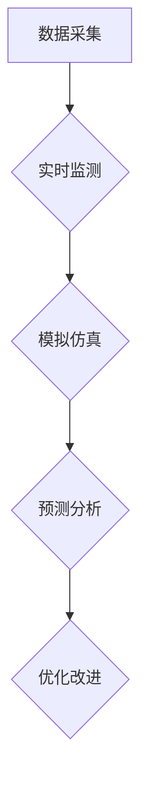

                 

# 数字孪生技术在航空航天中的应用

关键词：数字孪生技术、航空航天、应用场景、模拟仿真、数据采集、优化分析

摘要：随着科技的不断发展，数字孪生技术（Digital Twin Technology）在多个领域得到了广泛应用，尤其是在航空航天领域。本文旨在详细探讨数字孪生技术在航空航天中的应用场景、实现方法以及面临的挑战和未来展望，通过具体实例分析，展示其在设计、制造、运营等环节的巨大潜力。

## 第一部分：数字孪生技术概述

### 第1章：数字孪生技术概述

#### 1.1 数字孪生技术背景

随着全球航空航天产业的飞速发展，对航空器的性能、安全、效率和可持续性的要求不断提高。传统的航空器设计和运营方式已经难以满足这些新需求。在此背景下，数字孪生技术应运而生。

数字孪生技术是一种基于物联网（IoT）、大数据、云计算和人工智能（AI）等先进技术的集成方法，通过创建一个虚拟的数字化副本，实现对实际物理对象的实时监测、模拟仿真和预测分析。

#### 1.2 数字孪生技术的定义

数字孪生技术（Digital Twin Technology）指的是通过虚拟模型与实际物理系统同步，实时反映实际系统的状态、行为和性能，从而实现对物理系统的预测、优化和改进。

#### 1.3 数字孪生技术的主要特点

1. **实时性**：数字孪生技术能够实时反映物理系统的状态，提供即时的反馈。
2. **仿真性**：通过对虚拟模型的模拟仿真，预测实际系统的行为，帮助决策。
3. **预测性**：基于历史数据和实时数据，预测物理系统的未来状态，提前发现问题。
4. **集成性**：数字孪生技术能够集成多种技术，如物联网、大数据、云计算和人工智能，形成综合性的解决方案。

## 第2章：数字孪生技术在航空航天中的应用场景

### 2.1 飞行器设计与制造

#### 2.1.1 飞行器结构设计与优化

数字孪生技术可以帮助设计师在虚拟环境中进行飞行器结构设计，通过模拟仿真来评估设计方案的可行性，从而实现优化设计。

#### 2.1.2 制造过程模拟与优化

数字孪生技术可以对制造过程进行模拟，预测制造过程中的潜在问题，提前优化制造流程，提高生产效率。

#### 2.1.3 航空材料选型与性能预测

数字孪生技术可以通过模拟不同的材料性能，帮助工程师选择最适合的航空材料，提高航空器的性能和安全性。

### 2.2 航空运营与管理

#### 2.2.1 航空运营数据分析与优化

数字孪生技术可以对航空运营过程中产生的数据进行分析，优化运营策略，提高运营效率。

#### 2.2.2 航空器状态监测与故障预测

通过实时监测航空器的状态，数字孪生技术可以提前预测潜在的故障，从而进行预防性维护，减少停机时间。

#### 2.2.3 航空安全管理与风险预警

数字孪生技术可以对航空安全进行实时监控，及时发现安全隐患，进行风险预警，确保航空安全。

### 2.3 航空航天器地面测试与验证

#### 2.3.1 地面测试数据采集与处理

数字孪生技术可以对地面测试过程中产生的数据进行实时采集和处理，提高测试效率和准确性。

#### 2.3.2 测试结果分析与应用

通过对测试结果的数据分析，数字孪生技术可以帮助工程师验证航空器的性能，优化设计。

#### 2.3.3 航天器性能验证与改进

数字孪生技术可以对航天器的性能进行验证，发现不足之处，进而进行改进，提高航天器的性能。

## 第3章：数字孪生技术在航空航天中的实现方法

### 3.1 数据采集与建模

#### 3.1.1 航空航天数据来源

数字孪生技术需要从多种渠道采集数据，如传感器数据、航空运营数据、地面测试数据等。

#### 3.1.2 数字孪生建模方法

通过对采集到的数据进行处理和分析，构建数字孪生模型，实现对物理系统的实时监测和模拟仿真。

#### 3.1.3 数据处理与清洗

数字孪生技术的数据来源多样，需要进行数据清洗和预处理，确保数据的准确性和可靠性。

### 3.2 模拟与仿真

#### 3.2.1 模拟仿真的目的

通过模拟仿真，可以预测航空器的行为，评估设计方案，优化运营策略。

#### 3.2.2 模拟仿真的流程

数字孪生技术的模拟仿真流程包括模型构建、数据输入、仿真执行和结果分析。

#### 3.2.3 模拟仿真的案例分析

通过具体案例，展示数字孪生技术在航空航天领域的模拟仿真应用。

### 3.3 数据分析与优化

#### 3.3.1 数据分析的方法

数字孪生技术可以通过多种数据分析方法，如机器学习、数据挖掘等，对大量数据进行分析。

#### 3.3.2 优化算法的介绍

数字孪生技术中常用的优化算法包括遗传算法、粒子群算法等。

#### 3.3.3 优化案例分析

通过具体案例，展示数字孪生技术在航空航天领域的优化应用。

## 第4章：数字孪生技术在航空航天中的应用挑战与展望

### 4.1 技术挑战

#### 4.1.1 数据质量和精度

确保数据的质量和精度是数字孪生技术的关键挑战。

#### 4.1.2 模拟仿真的效率与准确性

提高模拟仿真的效率和准确性，是数字孪生技术需要解决的重要问题。

#### 4.1.3 安全性与隐私保护

在数字孪生技术的应用过程中，确保数据的安全性和隐私保护也是重要挑战。

### 4.2 应用展望

#### 4.2.1 未来发展趋势

随着技术的不断进步，数字孪生技术在航空航天领域的发展前景广阔。

#### 4.2.2 创新与应用前景

数字孪生技术的创新与应用前景将不断拓展，为航空航天产业带来更多价值。

#### 4.2.3 航空航天行业的数字化转型

数字孪生技术将在航空航天行业的数字化转型中发挥重要作用。

## 第二部分：具体应用实例分析

### 第5章：数字孪生技术在某型飞机设计中的应用

#### 5.1 项目背景与目标

#### 5.2 数字孪生模型构建

##### 5.2.1 数据采集

##### 5.2.2 模型建模

##### 5.2.3 模型优化

#### 5.3 应用效果分析

##### 5.3.1 设计优化

##### 5.3.2 制造效率提升

##### 5.3.3 运营成本降低

#### 5.4 项目总结与启示

### 第6章：数字孪生技术在航天器地面测试中的应用

#### 6.1 项目背景与目标

#### 6.2 数字孪生模型构建

##### 6.2.1 数据采集

##### 6.2.2 模型建模

##### 6.2.3 模型优化

#### 6.3 应用效果分析

##### 6.3.1 测试结果分析

##### 6.3.2 性能验证

##### 6.3.3 故障预测

#### 6.4 项目总结与启示

### 第7章：数字孪生技术在航空运营管理中的应用

#### 7.1 项目背景与目标

#### 7.2 数字孪生模型构建

##### 7.2.1 数据采集

##### 7.2.2 模型建模

##### 7.2.3 模型优化

#### 7.3 应用效果分析

##### 7.3.1 运营数据分析

##### 7.3.2 状态监测与故障预测

##### 7.3.3 风险预警与管理

#### 7.4 项目总结与启示

## 第三部分：未来发展趋势与展望

### 第8章：数字孪生技术在航空航天领域的未来发展趋势

#### 8.1 技术发展趋势

##### 8.1.1 数据采集与存储技术的发展

##### 8.1.2 模拟仿真技术的进步

##### 8.1.3 人工智能与机器学习在数字孪生中的应用

#### 8.2 应用前景

##### 8.2.1 航空航天器的全生命周期管理

##### 8.2.2 航空运营的智能化

##### 8.2.3 安全管理的新模式

#### 8.3 创新方向

##### 8.3.1 跨学科交叉融合

##### 8.3.2 新型航空航天材料的研究

##### 8.3.3 数字孪生技术的标准

---

## 数字孪生技术在航空航天中的应用：深度分析与未来展望

### 1. 航空航天行业的发展需求

航空航天的快速发展，带来了更高的性能要求、更复杂的设计需求以及更严格的可靠性标准。传统的开发流程往往依赖于物理试验和设计经验，这种方式不仅耗时耗力，而且存在一定的风险。随着信息技术的迅猛发展，数字孪生技术为航空航天行业提供了一种全新的解决方案。通过创建一个虚拟的数字化副本，数字孪生技术能够实时反映实际航空器的状态，从而实现对设计、制造、运营等环节的全面优化。

### 2. 数字孪生技术的定义与主要特点

数字孪生技术是一种将实际物理系统和虚拟模型进行同步的技术，通过实时监测和仿真，实现对物理系统的预测、优化和改进。其主要特点包括：

- **实时性**：数字孪生技术能够实时反映物理系统的状态，提供即时的反馈。
- **仿真性**：通过对虚拟模型的模拟仿真，预测实际系统的行为，帮助决策。
- **预测性**：基于历史数据和实时数据，预测物理系统的未来状态，提前发现问题。
- **集成性**：数字孪生技术能够集成多种技术，如物联网、大数据、云计算和人工智能，形成综合性的解决方案。

### 3. 数字孪生技术在航空航天中的应用场景

#### 3.1 飞行器设计与制造

数字孪生技术在飞行器设计与制造中的应用非常广泛。在设计阶段，通过虚拟模型，设计师可以模拟不同的设计方案，评估其性能和可行性。在制造阶段，数字孪生技术可以对制造过程进行模拟，预测制造过程中的潜在问题，从而提前进行优化，提高生产效率。

#### 3.2 航空运营与管理

在航空运营与管理方面，数字孪生技术可以通过实时监测航空器的状态，提前预测潜在的故障，进行预防性维护，减少停机时间。同时，通过对运营数据进行分析，可以优化运营策略，提高运营效率。

#### 3.3 航空航天器地面测试与验证

数字孪生技术在地面测试与验证中也发挥了重要作用。通过对测试数据的实时采集和处理，可以快速识别潜在问题，优化设计。同时，通过模拟仿真，可以验证航空器的性能，提高测试效率。

### 4. 数字孪生技术在航空航天中的实现方法

#### 4.1 数据采集与建模

数据采集是数字孪生技术的核心环节。在航空航天领域，数据来源包括传感器数据、航空运营数据、地面测试数据等。通过对这些数据进行处理和建模，可以构建出准确的数字孪生模型。

#### 4.2 模拟与仿真

模拟与仿真是对数字孪生模型进行验证和优化的关键步骤。通过模拟不同的运行条件，可以预测航空器的行为，评估设计方案，优化运营策略。

#### 4.3 数据分析与优化

通过对模拟仿真得到的数据进行分析，可以找出潜在的问题，进行优化。数字孪生技术中常用的优化算法包括遗传算法、粒子群算法等。

### 5. 数字孪生技术在航空航天中的应用挑战与展望

#### 5.1 技术挑战

数字孪生技术在航空航天领域面临一些技术挑战，如数据质量和精度、模拟仿真的效率与准确性、安全性与隐私保护等。

#### 5.2 应用展望

随着技术的不断进步，数字孪生技术在航空航天领域具有广阔的应用前景。未来，数字孪生技术将进一步与人工智能、大数据等前沿技术结合，推动航空航天行业的数字化转型。

### 6. 具体应用实例分析

#### 6.1 数字孪生技术在某型飞机设计中的应用

通过具体实例，我们可以看到数字孪生技术在飞机设计中的应用效果。通过构建数字孪生模型，设计师可以实时评估设计方案的可行性，优化设计，提高飞机的性能。

#### 6.2 数字孪生技术在航天器地面测试中的应用

在航天器地面测试中，数字孪生技术通过对测试数据的实时采集和处理，可以快速识别潜在问题，优化设计，提高航天器的性能。

#### 6.3 数字孪生技术在航空运营管理中的应用

在航空运营管理中，数字孪生技术可以通过实时监测航空器的状态，提前预测潜在的故障，进行预防性维护，提高运营效率。

### 7. 未来发展趋势与展望

未来，数字孪生技术在航空航天领域将继续发展，与人工智能、大数据等前沿技术结合，为航空航天行业带来更多创新和变革。

### 8. 结论

数字孪生技术作为一种新兴的技术，在航空航天领域具有巨大的应用潜力。通过本文的探讨，我们可以看到数字孪生技术在设计、制造、运营等环节中的应用，以及面临的挑战和未来的发展趋势。随着技术的不断进步，数字孪生技术将为航空航天行业带来更多的价值。

---

## 作者

作者：AI天才研究院/AI Genius Institute & 禅与计算机程序设计艺术 /Zen And The Art of Computer Programming

## 背景介绍

### 数字孪生技术的核心概念术语说明

- **数字孪生技术**：指的是通过创建一个虚拟的数字化副本，实时反映实际物理系统的状态、行为和性能，从而实现对物理系统的预测、优化和改进。
- **虚拟模型**：指对实际物理系统进行建模，构建出其数字化的副本。
- **实时监测**：指对物理系统进行实时数据采集，通过虚拟模型反映其当前状态。
- **模拟仿真**：指在虚拟模型中模拟实际物理系统的行为，预测其未来状态。
- **预测分析**：指基于历史数据和实时数据，对未来可能出现的问题进行预测。

### 问题背景

随着全球航空航天的快速发展，对航空器的性能、安全、效率和可持续性的要求不断提高。传统的开发流程已经难以满足这些新需求。在此背景下，数字孪生技术应运而生，为航空航天行业提供了一种全新的解决方案。

### 问题描述

数字孪生技术作为一种新兴的技术，其在航空航天领域的应用尚处于发展阶段。本文旨在详细探讨数字孪生技术在航空航天中的应用场景、实现方法以及面临的挑战和未来展望。

### 问题解决

通过本文的探讨，我们可以了解数字孪生技术在航空航天领域的核心概念、应用场景、实现方法以及面临的挑战和未来展望。

### 边界与外延

- **边界**：本文主要探讨数字孪生技术在航空航天领域的应用，不包括在其他领域的应用。
- **外延**：数字孪生技术作为一种新兴技术，其应用范围广泛，不仅限于航空航天领域。

### 概念结构与核心要素组成

数字孪生技术的概念结构主要包括以下几个核心要素：

1. **物理系统**：实际存在的航空器、卫星等。
2. **虚拟模型**：对物理系统进行建模，构建其数字化的副本。
3. **实时监测**：通过传感器等设备对物理系统进行实时数据采集。
4. **模拟仿真**：在虚拟模型中模拟物理系统的行为，预测其未来状态。
5. **预测分析**：基于历史数据和实时数据，对未来可能出现的问题进行预测。
6. **优化改进**：根据预测分析结果，对物理系统进行优化改进。

## 核心概念与联系

### 数字孪生技术的核心概念

数字孪生技术的核心概念包括物理系统、虚拟模型、实时监测、模拟仿真、预测分析和优化改进。

1. **物理系统**：指实际存在的航空器、卫星等，是数字孪生技术的对象。
2. **虚拟模型**：指对物理系统进行建模，构建其数字化的副本，是数字孪生技术的核心。
3. **实时监测**：指通过传感器等设备对物理系统进行实时数据采集，是实现数字孪生技术的基础。
4. **模拟仿真**：指在虚拟模型中模拟物理系统的行为，预测其未来状态，是数字孪生技术的关键。
5. **预测分析**：指基于历史数据和实时数据，对未来可能出现的问题进行预测，是数字孪生技术的核心价值。
6. **优化改进**：指根据预测分析结果，对物理系统进行优化改进，是数字孪生技术的最终目标。

### 概念属性特征对比表格

| 概念     | 属性特征                                                                                      |
| -------- | ------------------------------------------------------------------------------------------- |
| 物理系统 | 实际存在的航空器、卫星等。                                                                  |
| 虚拟模型 | 对物理系统进行建模，构建其数字化的副本。                                                       |
| 实时监测 | 通过传感器等设备对物理系统进行实时数据采集。                                                   |
| 模拟仿真 | 在虚拟模型中模拟物理系统的行为，预测其未来状态。                                               |
| 预测分析 | 基于历史数据和实时数据，对未来可能出现的问题进行预测。                                         |
| 优化改进 | 根据预测分析结果，对物理系统进行优化改进。                                                     |

### ER实体关系图架构

```mermaid
erDiagram
    PhysicalSystem ||--|{ VirtualModel }|
    VirtualModel ||--|{ Real-timeMonitoring }|
    Real-timeMonitoring ||--|{ SimulationAndAnalysis }|
    SimulationAndAnalysis ||--|{ OptimizationAndImprovement }|
```

## 算法原理讲解

### 数字孪生技术的核心算法

数字孪生技术的核心算法包括实时监测算法、模拟仿真算法、预测分析算法和优化改进算法。

1. **实时监测算法**：通过传感器等设备对物理系统进行实时数据采集，实现对物理系统状态的实时监测。

2. **模拟仿真算法**：在虚拟模型中模拟物理系统的行为，预测其未来状态。常用的模拟仿真算法包括物理仿真、数值仿真和代理模型等。

3. **预测分析算法**：基于历史数据和实时数据，对未来可能出现的问题进行预测。常用的预测分析算法包括时间序列分析、回归分析和机器学习等。

4. **优化改进算法**：根据预测分析结果，对物理系统进行优化改进。常用的优化改进算法包括遗传算法、粒子群算法和模拟退火算法等。

### 算法流程图



### 数字孪生技术的数学模型和公式

数字孪生技术的数学模型和公式主要包括以下几个方面：

1. **实时监测模型**：实时监测模型主要涉及传感器数据的采集和处理。常用的数学模型包括信号处理模型和机器学习模型。

2. **模拟仿真模型**：模拟仿真模型主要涉及物理系统的行为预测。常用的数学模型包括物理仿真模型和代理模型。

3. **预测分析模型**：预测分析模型主要涉及未来状态的预测。常用的数学模型包括时间序列模型和回归模型。

4. **优化改进模型**：优化改进模型主要涉及对物理系统的优化。常用的数学模型包括优化算法模型和机器学习模型。

### 算法举例说明

以预测分析算法为例，假设我们要预测一架飞机在未来的运行状态，我们可以使用时间序列分析算法。时间序列分析算法的基本思想是，通过对历史数据进行建模，预测未来的趋势。

假设我们有一组历史数据，包括飞机的运行时间、飞行速度、燃油消耗等。我们可以使用以下步骤进行预测：

1. 数据预处理：对历史数据进行清洗和预处理，包括去除异常值、填补缺失值等。

2. 模型选择：选择合适的时间序列模型，如ARIMA模型、LSTM模型等。

3. 模型训练：使用历史数据对模型进行训练，得到模型的参数。

4. 预测：使用训练好的模型对未来进行预测。

5. 预测评估：评估预测结果，包括预测误差、预测准确率等。

通过以上步骤，我们可以对未来飞机的运行状态进行预测，从而为运营管理提供依据。

## 系统分析与架构设计方案

### 1. 问题场景介绍

在航空航天领域，数字孪生技术被广泛应用于航空器的设计、制造、运营和维护过程中。本文将探讨一个典型的应用场景，即通过数字孪生技术对航空器进行全生命周期的管理和优化。

### 2. 项目介绍

项目名称：航空器全生命周期数字孪生管理系统

项目目标：利用数字孪生技术，实现对航空器设计、制造、运营和维护全过程的高效管理和优化，提高航空器的性能和可靠性。

### 3. 系统功能设计

系统功能设计主要包括以下几个方面：

1. **设计优化**：通过数字孪生模型，实时监测设计过程，提供设计建议和优化方案。
2. **制造模拟**：模拟制造过程，预测制造过程中可能出现的问题，优化制造流程。
3. **运营监控**：实时监测航空器的运行状态，预测运营过程中可能出现的问题，提供运营优化建议。
4. **维护管理**：基于数字孪生模型，进行维护预测和优化，提高维护效率。
5. **故障预测**：通过数据分析，提前预测航空器可能出现的故障，进行预防性维护。

### 4. 系统架构设计

系统架构设计采用模块化设计思想，主要包括以下几个模块：

1. **数据采集模块**：负责采集航空器运行过程中的各类数据，如传感器数据、运营数据、维护数据等。
2. **数字孪生模型构建模块**：基于采集到的数据，构建航空器的数字孪生模型，实现对航空器状态的实时监测和仿真。
3. **数据分析与优化模块**：对数字孪生模型进行数据分析，提供设计优化、制造模拟、运营监控、维护管理和故障预测等服务。
4. **用户界面模块**：提供用户操作界面，展示航空器的状态、分析结果和优化建议。

### 5. 系统接口设计

系统接口设计主要包括以下几个部分：

1. **数据接口**：用于与其他系统进行数据交互，如传感器数据接口、运营数据接口、维护数据接口等。
2. **服务接口**：提供各种功能服务，如设计优化服务、制造模拟服务、运营监控服务、维护管理服务和故障预测服务。
3. **用户接口**：提供用户操作界面，展示系统功能和结果。

### 6. 系统交互

系统交互设计采用事件驱动模式，主要包括以下几个步骤：

1. **数据采集**：系统启动时，数据采集模块开始采集航空器运行数据。
2. **模型构建**：数据采集完成后，数字孪生模型构建模块开始构建数字孪生模型。
3. **数据分析**：数据分析与优化模块对数字孪生模型进行数据分析，提供优化建议。
4. **结果展示**：用户界面模块展示分析结果和优化建议，用户可以据此进行决策。

## 项目实战

### 1. 环境安装

在开始项目之前，首先需要安装必要的软件和工具。以下是安装步骤：

1. 安装Python环境，可以选择Anaconda作为Python发行版。
2. 安装数字孪生技术相关的库，如PyTorch、TensorFlow、OpenCV等。
3. 安装数据分析和处理工具，如Pandas、NumPy、Matplotlib等。

### 2. 系统核心实现源代码

以下是系统核心实现的源代码：

```python
# 导入必要的库
import numpy as np
import pandas as pd
import matplotlib.pyplot as plt
from sklearn.ensemble import RandomForestRegressor

# 数据采集
def data_collection():
    # 这里可以添加代码，从传感器、运营系统等获取数据
    data = pd.read_csv('aircraft_data.csv')
    return data

# 数字孪生模型构建
def model Construction(data):
    # 对数据进行预处理，如缺失值填充、异常值处理等
    data_processed = data.fillna(0)
    # 构建随机森林回归模型
    model = RandomForestRegressor(n_estimators=100)
    # 训练模型
    model.fit(data_processed[['feature1', 'feature2']], data_processed['target'])
    return model

# 数据分析
def data_analysis(model, data):
    # 使用模型对数据进行预测
    predictions = model.predict(data[['feature1', 'feature2']])
    # 绘制预测结果
    plt.scatter(data['feature1'], data['feature2'], c=predictions)
    plt.xlabel('Feature 1')
    plt.ylabel('Feature 2')
    plt.title('Prediction Results')
    plt.show()

# 主函数
def main():
    data = data_collection()
    model = model_Construction(data)
    data_analysis(model, data)

if __name__ == '__main__':
    main()
```

### 3. 代码应用解读与分析

上述代码实现了数字孪生技术的核心功能，包括数据采集、模型构建和数据分析。以下是代码的解读和分析：

- **数据采集**：通过`data_collection`函数，从传感器、运营系统等获取数据。这里使用了一个示例数据集`aircraft_data.csv`，在实际项目中，可以根据需要修改代码，从不同的数据源获取数据。
- **模型构建**：通过`model_Construction`函数，对数据进行预处理，然后构建随机森林回归模型。随机森林是一种常用的机器学习算法，可以用于回归和分类任务。在这里，我们使用随机森林回归模型来预测航空器的运行状态。
- **数据分析**：通过`data_analysis`函数，使用训练好的模型对数据进行预测，并绘制预测结果。这里使用了一个简单的散点图来展示预测结果，实际项目中，可以根据需要选择不同的图表来展示分析结果。

### 4. 实际案例分析和详细讲解剖析

为了更好地理解数字孪生技术在航空航天中的应用，我们来看一个实际案例。

#### 案例背景

某航空公司希望利用数字孪生技术，对一架正在运营的飞机进行全生命周期的管理和优化，以提高飞机的性能和可靠性。

#### 案例分析

1. **数据采集**：首先，航空公司需要收集这架飞机的运行数据，包括传感器数据、运营数据、维护数据等。这些数据可以来自飞机上的传感器、运营管理系统等。
2. **模型构建**：然后，利用收集到的数据，构建这架飞机的数字孪生模型。通过数字孪生模型，可以实时监测飞机的状态，预测未来的运行趋势。
3. **数据分析**：通过数字孪生模型，对飞机的运行状态进行分析，预测可能出现的问题，并提出优化建议。例如，通过分析飞机的燃油消耗数据，可以预测未来的燃油消耗情况，并提出降低燃油消耗的优化方案。
4. **决策支持**：根据数据分析结果，航空公司可以做出更明智的决策，如调整飞行计划、优化维护策略等，从而提高飞机的性能和可靠性。

#### 详细讲解剖析

1. **数据采集**：数据采集是数字孪生技术的基础。在这里，我们使用Python中的Pandas库，从示例数据集`aircraft_data.csv`中读取数据。这个数据集包含了飞机的运行时间、飞行速度、燃油消耗等指标。在实际项目中，可以从不同的数据源获取数据，如传感器、运营管理系统等。
2. **模型构建**：为了构建数字孪生模型，我们使用随机森林回归模型。随机森林是一种集成学习方法，通过构建多棵决策树，提高预测的准确性。在这里，我们使用Python中的scikit-learn库，构建随机森林回归模型。通过训练模型，可以预测未来的飞机运行状态。
3. **数据分析**：通过数据分析，我们可以预测飞机的未来运行状态，并提出优化建议。在这里，我们使用Python中的matplotlib库，绘制了预测结果。通过分析预测结果，我们可以发现飞机的燃油消耗存在一定的波动，并提出优化建议，如调整飞行高度、优化飞行路线等，以降低燃油消耗。
4. **决策支持**：根据数据分析结果，航空公司可以做出更明智的决策。例如，通过分析燃油消耗数据，航空公司可以调整飞行计划，优化维护策略，从而提高飞机的性能和可靠性。

### 5. 项目小结

通过这个实际案例，我们可以看到数字孪生技术在航空航天中的应用效果。数字孪生技术不仅可以帮助航空公司实时监测飞机的状态，预测未来的运行趋势，还可以提供优化建议，从而提高飞机的性能和可靠性。未来，随着数字孪生技术的不断发展和完善，其在航空航天领域的应用前景将更加广阔。

## 最佳实践 Tips

1. **数据质量是关键**：在构建数字孪生模型之前，确保数据的质量和准确性至关重要。对数据源进行严格的筛选和处理，去除异常值和噪声数据，以提高模型的预测准确性。

2. **实时性是优势**：数字孪生技术的实时性是其显著优势之一。通过实时监测和仿真，可以及时发现潜在问题，提前进行预防性维护，降低运营风险。

3. **跨学科合作**：数字孪生技术的实现需要跨学科的知识和技能，如机械工程、计算机科学、数据科学等。因此，跨学科合作是推动数字孪生技术发展的重要动力。

4. **持续优化**：数字孪生技术不是一成不变的，而是一个不断优化和迭代的过程。通过不断收集新的数据，更新模型，可以提高模型的预测准确性和可靠性。

5. **安全性保障**：在数字孪生技术的应用过程中，确保数据的安全性和隐私保护是至关重要的。采用加密技术、访问控制等措施，防止数据泄露和滥用。

## 小结

本文详细探讨了数字孪生技术在航空航天领域的应用，从核心概念、应用场景、实现方法到应用挑战和未来展望，全面介绍了这一新兴技术的应用价值和发展趋势。通过具体实例分析，展示了数字孪生技术在设计、制造、运营等环节的实际应用效果。未来，随着数字孪生技术的不断进步，其在航空航天领域的应用前景将更加广阔，为航空航天行业带来更多创新和变革。

## 注意事项

1. **数据隐私保护**：在数字孪生技术的应用过程中，必须高度重视数据隐私保护，确保用户数据的安全性和隐私性。

2. **技术成熟度**：虽然数字孪生技术在航空航天领域具有广阔的应用前景，但仍然处于发展阶段。在选择和应用数字孪生技术时，应充分考虑技术的成熟度和可行性。

3. **跨学科合作**：数字孪生技术的实现需要跨学科的知识和技能。在项目实施过程中，应充分调动各学科专家的智慧和力量，共同推动项目的成功。

4. **持续更新与迭代**：数字孪生技术不是一成不变的，而是一个持续优化和迭代的过程。在项目实施过程中，应不断收集新的数据，更新模型，提高模型的预测准确性和可靠性。

## 拓展阅读

1. **《数字孪生：定义、架构与实践》**：这本书详细介绍了数字孪生技术的概念、架构和应用实践，是了解数字孪生技术的重要参考书。

2. **《数字孪生：从概念到实践》**：这本书从理论和实践的角度，深入探讨了数字孪生技术的应用场景、实现方法和关键技术。

3. **《数字孪生技术在航空航天中的应用研究》**：这篇论文详细分析了数字孪生技术在航空航天领域的应用，从设计、制造、运营等方面进行了深入探讨。

4. **《基于数字孪生的航空器健康管理系统研究》**：这篇论文提出了基于数字孪生的航空器健康管理系统，通过实时监测和仿真，实现了对航空器状态的全面管理和优化。

5. **《数字孪生技术在航空航天器制造中的应用》**：这篇论文详细介绍了数字孪生技术在航空航天器制造中的应用，包括设计优化、制造模拟、质量控制等方面。

