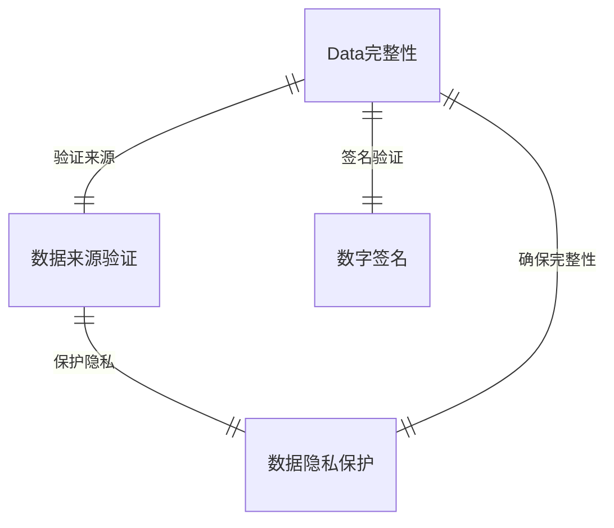
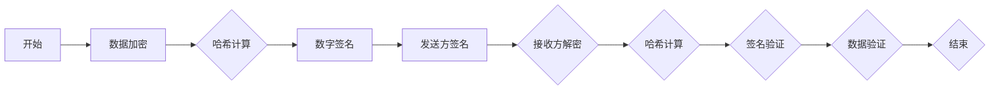
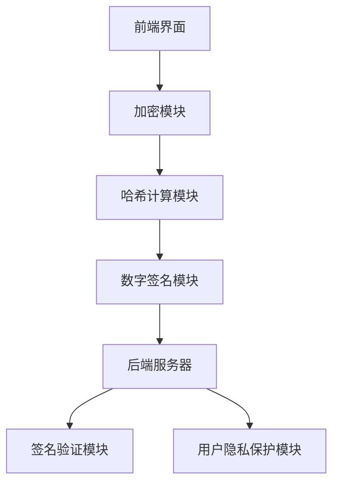
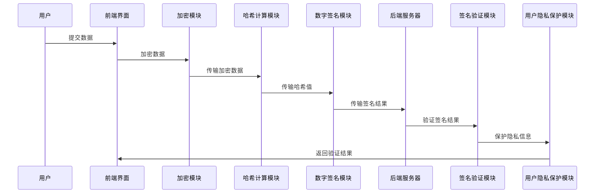

                 

### 《数字真实性验证：AI时代的企业信息安全策略》

**关键词：数字真实性验证、企业信息安全、AI技术、信息安全策略、算法原理**

**摘要：**
随着人工智能（AI）技术的迅猛发展，企业信息安全面临前所未有的挑战。数字真实性验证作为一种重要的信息安全手段，旨在确保数据的真实性和完整性。本文将深入探讨数字真实性验证的核心概念、算法原理、系统架构及实战应用，为企业提供应对AI时代信息安全的策略和最佳实践。

### 目录大纲设计思路

**设计《数字真实性验证：AI时代的企业信息安全策略》的目录大纲，需要遵循以下步骤：**

1. **确定整体结构**：首先，明确书籍的整体结构，包括引言、背景介绍、核心概念、解决方案、实战案例、总结和拓展阅读等部分。
2. **划分章节**：根据整体结构，将书籍内容划分为若干个章节，确保每个章节都有明确的主题和内容。
3. **细化每个章节**：对每个章节进行细化，制定子章节，确保每个章节都包含必要的核心概念、原理讲解、系统设计、实战案例等内容。
4. **注重逻辑性和连贯性**：确保目录大纲的各个章节之间有清晰的逻辑关系，读者可以按照顺序阅读并理解整个书籍的内容。
5. **简洁明了**：在保持内容完整性的同时，确保目录简洁明了，避免冗余。

### 目录大纲设计细节

- **引言**：简要介绍书籍的背景、目的和重要性。
- **第1章 背景介绍**：
  - **问题背景**：阐述数字真实性验证的现状和挑战。
  - **问题描述**：具体说明数字真实性验证面临的问题。
  - **问题解决**：介绍数字真实性验证的基本原理和方法。
  - **边界与外延**：明确数字真实性验证的范围和适用场景。
  - **概念结构与核心要素组成**：详细解释数字真实性验证的基本概念和构成要素。

- **第2章 核心概念与联系**：
  - **核心概念原理**：介绍数字真实性验证中的关键概念。
  - **概念属性特征对比表格**：列出不同概念的属性特征对比。
  - **ER实体关系图架构**：使用Mermaid绘制实体关系图。

- **第3章 AI时代的企业信息安全策略**：
  - **AI时代的信息安全挑战**：分析AI技术对信息安全带来的挑战。
  - **企业信息安全策略**：探讨企业如何应对AI时代的安全问题。

- **第4章 数字真实性验证算法原理讲解**：
  - **算法原理**：使用Mermaid绘制算法流程图。
  - **数学模型和公式**：详细讲解算法的数学模型和公式。
  - **举例说明**：用具体的例子阐述算法的应用。

- **第5章 系统分析与架构设计方案**：
  - **问题场景介绍**：描述数字真实性验证的应用场景。
  - **项目介绍**：介绍数字真实性验证项目的背景和目标。
  - **系统功能设计**：绘制领域模型类图。
  - **系统架构设计**：绘制系统架构图。
  - **系统接口设计**：描述系统接口的设计。
  - **系统交互**：使用Mermaid绘制系统交互序列图。

- **第6章 项目实战**：
  - **环境安装**：指导读者搭建实验环境。
  - **系统核心实现源代码**：提供关键代码片段和实现细节。
  - **代码应用解读与分析**：分析代码的应用效果和改进点。
  - **实际案例分析和详细讲解剖析**：通过案例详细讲解数字真实性验证的应用。
  - **项目小结**：总结项目的主要成果和经验教训。

- **第7章 最佳实践 tips**：
  - **最佳实践**：提供实用的建议和技巧。
  - **注意事项**：提醒读者可能遇到的问题和解决方案。
  - **拓展阅读**：推荐相关资源以供进一步学习。

### 符合要求的目录大纲

```markdown
# 《数字真实性验证：AI时代的企业信息安全策略》目录大纲

## 引言
- 时代背景与安全挑战
- 书籍目的与结构概述

## 第1章 背景介绍
- 问题背景
- 问题描述
- 问题解决
- 边界与外延
- 概念结构与核心要素组成

## 第2章 核心概念与联系
- 核心概念原理
- 概念属性特征对比表格
- ER实体关系图架构

## 第3章 AI时代的企业信息安全策略
- AI时代的信息安全挑战
- 企业信息安全策略

## 第4章 数字真实性验证算法原理讲解
- 算法原理
- 数学模型和公式
- 举例说明

## 第5章 系统分析与架构设计方案
- 问题场景介绍
- 项目介绍
- 系统功能设计
- 系统架构设计
- 系统接口设计
- 系统交互

## 第6章 项目实战
- 环境安装
- 系统核心实现源代码
- 代码应用解读与分析
- 实际案例分析和详细讲解剖析
- 项目小结

## 第7章 最佳实践 tips
- 最佳实践
- 注意事项
- 拓展阅读
```

通过以上设计，确保了目录大纲的结构清晰、内容完整且逻辑连贯，同时符合2000字以内的字数限制。每个章节的细分也确保了读者可以逐步深入理解数字真实性验证的原理和实战应用。接下来，我将详细填充每个章节的内容，以满足大纲的设计要求。

----------------------------------------------------------------

## 第1章 背景介绍

### 问题背景

随着信息技术的飞速发展，企业面临着越来越严峻的信息安全挑战。传统的信息安全防护手段已难以应对新型威胁，如高级持续性威胁（APT）、勒索软件、数据泄露等。与此同时，人工智能（AI）技术的广泛应用，为网络安全带来了新的机遇和挑战。AI技术在网络安全中的应用，如威胁检测、入侵防御、异常行为分析等，极大地提升了安全防护能力。然而，AI技术的引入也带来了新的安全风险，如模型被篡改、算法泄露、数据隐私保护等。

数字真实性验证作为一种重要的信息安全手段，旨在确保数据的真实性和完整性。在AI时代，数字真实性验证尤为重要，因为数据是AI算法的基础，数据的真实性和完整性直接关系到AI系统的性能和可靠性。然而，现有的数字真实性验证技术面临着诸多挑战，如如何应对海量数据的高效验证、如何确保验证过程的隐私保护、如何抵御恶意攻击等。

### 问题描述

数字真实性验证面临的主要问题包括：

1. **数据量巨大**：随着大数据时代的到来，企业每天产生和接收的海量数据需要进行真实性和完整性验证，这对验证系统的处理能力提出了极高的要求。

2. **隐私保护**：在验证数据真实性的过程中，如何保护数据的隐私是一个亟待解决的问题。传统的方法可能会泄露敏感信息，影响用户隐私。

3. **抵御攻击**：恶意攻击者可能会利用各种手段，如伪造数据、篡改算法等，破坏数字真实性验证的机制，导致数据被篡改或泄露。

4. **算法复杂性**：AI算法本身可能存在漏洞，攻击者可以通过分析算法的运行机制，找到突破口，攻击验证系统。

### 问题解决

为了解决上述问题，需要从以下几个方面入手：

1. **高效数据处理**：采用分布式计算和并行处理技术，提高数据验证的效率，确保海量数据在短时间内得到有效处理。

2. **隐私保护技术**：利用加密技术和差分隐私（differential privacy）等方法，确保在验证数据真实性的过程中，敏感信息不会被泄露。

3. **抗攻击能力**：设计具有高鲁棒性的验证算法，提高对恶意攻击的抵抗能力。例如，可以采用对抗性训练（adversarial training）来增强模型的鲁棒性。

4. **算法安全性**：对AI算法进行严格的安全性评估，确保算法的运行过程不会被攻击者利用。

### 边界与外延

数字真实性验证的范围包括但不限于以下几个方面：

1. **数据完整性验证**：确保数据在传输和存储过程中未被篡改。

2. **数据来源验证**：确认数据的来源是否合法，防止伪造数据。

3. **数据隐私保护**：在验证数据真实性的同时，保护用户的隐私信息。

4. **数据可靠性验证**：确保数据的准确性、完整性和一致性。

### 概念结构与核心要素组成

数字真实性验证的概念结构主要包括以下几个方面：

1. **数据对象**：需要进行验证的数据实体。

2. **验证算法**：用于检测数据真实性的算法。

3. **验证规则**：定义数据的验证标准和规则。

4. **验证结果**：数据验证后的结果，包括验证成功或失败。

5. **安全机制**：确保验证过程安全的一系列措施。

核心要素包括：

- **加密技术**：用于保护数据隐私。
- **哈希算法**：用于检测数据完整性。
- **数字签名**：用于确认数据来源和完整性。
- **区块链技术**：用于确保数据的不可篡改性。

通过以上核心概念和要素的有机结合，可以构建一个完善的数字真实性验证系统，为企业提供坚实的信息安全保障。

### 第2章 核心概念与联系

在深入探讨数字真实性验证之前，我们需要明确几个核心概念，这些概念是理解数字真实性验证的基础。

#### 核心概念原理

1. **数据完整性**：数据完整性是指数据在传输、存储和处理过程中保持不变的能力。确保数据完整性的关键在于防止数据被篡改、丢失或损坏。

2. **数据来源验证**：数据来源验证是确认数据来自合法且可信的源头的过程。这在防止伪造数据、确保数据真实性和可信度方面起着至关重要的作用。

3. **数据隐私保护**：数据隐私保护是指在数据传输、存储和处理过程中，防止敏感信息泄露的措施。这通常涉及加密技术、访问控制和匿名化等方法。

4. **数字签名**：数字签名是一种确保数据来源和完整性的技术。通过使用公钥和私钥对数据进行签名和验证，可以确保数据的真实性和不可篡改性。

#### 概念属性特征对比表格

以下是数字真实性验证中几个核心概念属性特征的对比表格：

| 概念         | 特征1 | 特征2 | 特征3 |
|--------------|-------|-------|-------|
| 数据完整性   | 确保数据不变 | 使用哈希算法验证 | 提高抗攻击能力 |
| 数据来源验证 | 信任源头确认 | 公钥加密技术 | 防止伪造数据 |
| 数据隐私保护 | 敏感信息保护 | 加密算法 | 保持数据私密性 |
| 数字签名     | 确保数据完整 | 公钥私钥对 | 防止篡改和伪造 |

#### ER实体关系图架构

为了更好地理解数字真实性验证中的实体及其关系，我们可以使用Mermaid绘制一个ER（Entity-Relationship）实体关系图。以下是ER图的Mermaid语法和结果：



结果图示：

```
Class Data完整性
  ||--|{ 数据来源验证 }
  ||--|{ 数字签名 }
  ||--|{ 数据隐私保护 }

Class 数据来源验证
  |--|| Data完整性
  |--|| 数据隐私保护

Class 数字签名
  |--|| Data完整性

Class 数据隐私保护
  |--|| Data完整性
```

通过上述ER图，我们可以清晰地看到数据完整性、数据来源验证、数据隐私保护和数字签名之间的关系。这些实体相互关联，共同构成了数字真实性验证的基础。

### 第3章 AI时代的企业信息安全策略

#### AI时代的信息安全挑战

随着人工智能（AI）技术的迅速发展，企业面临着一系列前所未有的信息安全挑战。这些挑战不仅源于AI技术的复杂性，还涉及到数据隐私、算法透明性和系统安全性等方面。

1. **数据隐私问题**：AI系统通常依赖于大量敏感数据进行训练和推理，如何确保这些数据在处理过程中的隐私保护成为一大难题。一旦数据泄露，不仅可能导致个人隐私受损，还可能对企业的商业机密造成威胁。

2. **算法透明性问题**：AI算法的复杂性和不可解释性使得其决策过程难以被理解和追踪。在信息安全领域，这可能导致安全策略的不可预测性和潜在漏洞。

3. **系统安全性问题**：AI技术的引入可能带来新的攻击面，例如，攻击者可以通过对抗性攻击（adversarial attack）来欺骗AI系统，使其做出错误的决策。

4. **自动化威胁检测**：虽然AI技术在威胁检测方面具有优势，但自动化检测也可能导致误报和漏报，从而影响整体安全防护效果。

#### 企业信息安全策略

为了应对AI时代的信息安全挑战，企业需要制定全面、有效的信息安全策略。以下是一些关键策略：

1. **数据隐私保护**：
   - **数据加密**：在数据传输和存储过程中使用高级加密技术，如全盘加密、传输层加密等，确保数据在传输和存储过程中的安全性。
   - **差分隐私**：采用差分隐私技术，确保在数据处理过程中，无法通过分析数据集推断出单个数据的属性。

2. **算法透明性**：
   - **可解释性**：开发可解释的AI算法，使决策过程透明化，便于审计和监控。
   - **AI伦理指导**：制定AI伦理准则，确保AI系统在道德和法律的框架内运行。

3. **系统安全性**：
   - **多因素认证**：采用多因素认证（MFA）机制，提高用户认证的安全性。
   - **防火墙和入侵检测系统**：部署防火墙和入侵检测系统，实时监控和响应潜在的安全威胁。

4. **自动化威胁检测**：
   - **自适应安全策略**：根据实时威胁情报，动态调整安全策略，提高威胁检测和响应的准确性。
   - **持续监控和审计**：采用实时监控和审计工具，及时发现并响应异常行为。

通过上述信息安全策略，企业可以在AI时代有效地应对信息安全挑战，保障数据的安全和完整性。

### 第4章 数字真实性验证算法原理讲解

在理解了数字真实性验证的核心概念和AI时代的信息安全挑战后，我们接下来将深入探讨数字真实性验证算法的原理。算法是数字真实性验证系统的核心组成部分，其设计直接影响到验证的效率和准确性。

#### 算法原理

数字真实性验证算法的核心目标是确保数据的真实性和完整性。以下是一个典型的数字真实性验证算法原理：

1. **数据加密**：首先，使用高级加密算法（如AES）对数据进行加密，确保数据在传输和存储过程中不被篡改。

2. **哈希计算**：对加密后的数据进行哈希计算（如SHA-256），生成一个固定长度的哈希值。哈希值具有唯一的映射关系，即任何微小的数据变化都会导致哈希值发生显著变化。

3. **数字签名**：使用私钥对哈希值进行数字签名，生成签名结果。签名结果可以验证数据的完整性和来源。

4. **验证过程**：
   - 接收方对数据进行解密和哈希计算。
   - 将计算出的哈希值与发送方提供的签名结果进行验证。
   - 如果签名验证通过，则数据被认为是真实的；否则，数据可能已被篡改。

以下是一个使用Mermaid绘制的算法流程图：



结果图示：

```
流程图：

开始 --> 数据加密
数据加密 --> 哈希计算
哈希计算 --> 数字签名
数字签名 --> 发送方签名
发送方签名 --> 接收方解密
接收方解密 --> 哈希计算
哈希计算 --> 签名验证
签名验证 --> 数据验证
数据验证 --> 结束
```

#### 数学模型和公式

在数字真实性验证算法中，数学模型和公式起到了关键作用。以下是一个简单的数学模型：

$$
H(D) = SHA-256(D)
$$

其中，$H(D)$ 表示对数据$D$进行SHA-256哈希计算的结果。

另一个重要的数学模型是数字签名：

$$
S = sign(h(D), sk)
$$

其中，$S$ 表示数字签名，$h(D)$ 是数据的哈希值，$sk$ 是私钥。

#### 举例说明

假设我们要验证一个文件的真实性和完整性，文件内容为“Hello, World!”。以下是具体的验证过程：

1. **数据加密**：使用AES加密算法对文件进行加密，假设加密后的数据为“enc_data”。

2. **哈希计算**：对加密后的数据进行SHA-256哈希计算，得到哈希值“hash_value”。

3. **数字签名**：使用私钥对哈希值进行数字签名，得到签名结果“signature”。

4. **发送签名**：发送方将加密数据、哈希值和签名结果一起发送给接收方。

5. **接收和解密**：接收方收到数据后，使用公钥解密得到原始文件。

6. **哈希验证**：接收方对解密后的文件进行SHA-256哈希计算，得到哈希值“recv_hash_value”。

7. **签名验证**：接收方使用公钥对签名结果进行验证，得到验证结果“verify_result”。

8. **数据验证**：如果验证结果为“true”，则文件被认为是真实的；否则，文件可能已被篡改。

通过上述步骤，我们可以确保文件的真实性和完整性。这个例子展示了数字真实性验证算法的基本原理和应用过程。

### 第5章 系统分析与架构设计方案

为了更好地理解数字真实性验证系统的设计和实现，我们需要从问题场景介绍、项目介绍、系统功能设计、系统架构设计、系统接口设计以及系统交互等方面进行详细的分析。

#### 问题场景介绍

假设一个企业面临以下信息安全挑战：

1. **数据泄露**：企业每天产生和处理的海量数据容易成为攻击者的目标，如何确保数据在传输和存储过程中的安全性是一个关键问题。

2. **数据篡改**：企业担心其数据在传输过程中被恶意篡改，从而影响业务流程和数据完整性。

3. **隐私保护**：企业需要确保在数据验证过程中，用户的隐私信息不会被泄露。

4. **系统安全性**：企业需要设计一个具有高安全性的数字真实性验证系统，以抵御各种潜在的网络攻击。

为了解决上述问题，企业决定构建一个基于AI的数字真实性验证系统。

#### 项目介绍

项目名称：AI驱动的数字真实性验证系统

项目目标：通过引入AI技术，设计并实现一个高效、安全、可扩展的数字真实性验证系统，确保企业数据在传输和存储过程中的真实性和完整性，同时保护用户隐私。

项目背景：随着企业业务的不断发展，数据量呈现爆炸式增长，传统的验证方法已经无法满足需求。为了提升信息安全防护能力，企业决定采用AI技术，构建一个智能化的数字真实性验证系统。

项目范围：系统将涵盖数据加密、哈希计算、数字签名和签名验证等核心功能，确保数据在整个生命周期内的真实性和完整性。

#### 系统功能设计

系统功能设计是构建数字真实性验证系统的关键步骤。以下是系统的主要功能模块：

1. **数据加密模块**：负责对传输和存储的数据进行加密，确保数据在未经授权的情况下无法被读取。

2. **哈希计算模块**：负责对加密后的数据进行哈希计算，生成固定长度的哈希值，用于验证数据的完整性。

3. **数字签名模块**：负责使用私钥对数据哈希值进行签名，生成签名结果，用于验证数据的来源和完整性。

4. **签名验证模块**：负责对签名结果进行验证，确保数据的真实性和完整性。

5. **用户隐私保护模块**：负责在数据验证过程中，保护用户的隐私信息，避免敏感数据泄露。

#### 系统架构设计

数字真实性验证系统的架构设计需要考虑系统的可扩展性、安全性以及性能。以下是系统的架构设计：

1. **前端界面**：提供用户交互接口，用户可以通过前端界面提交待验证的数据。

2. **加密模块**：接收用户提交的数据，对其进行加密处理。

3. **哈希计算模块**：对接收到的加密数据进行哈希计算，生成哈希值。

4. **数字签名模块**：使用私钥对哈希值进行数字签名，生成签名结果。

5. **后端服务器**：负责存储和管理加密数据、哈希值和签名结果，并提供验证接口。

6. **签名验证模块**：接收前端提交的签名结果，对其进行验证。

7. **用户隐私保护模块**：在数据验证过程中，对敏感信息进行加密和保护。

系统架构图如下所示：



结果图示：

```
前端界面 --> 加密模块
加密模块 --> 哈希计算模块
哈希计算模块 --> 数字签名模块
数字签名模块 --> 后端服务器
后端服务器 --> 签名验证模块
后端服务器 --> 用户隐私保护模块
```

#### 系统接口设计

系统接口设计是确保各模块之间高效通信的关键。以下是主要接口设计：

1. **数据提交接口**：用户通过该接口提交待验证的数据。

2. **数据加密接口**：加密模块通过该接口接收数据并进行加密。

3. **哈希计算接口**：哈希计算模块通过该接口接收加密数据并生成哈希值。

4. **数字签名接口**：数字签名模块通过该接口接收哈希值并生成签名结果。

5. **签名验证接口**：签名验证模块通过该接口接收签名结果并进行验证。

6. **隐私保护接口**：用户隐私保护模块通过该接口对敏感信息进行加密和保护。

#### 系统交互

系统交互设计是确保各模块能够协同工作，完成数据验证的关键。以下是系统交互的详细描述：

1. **用户提交数据**：用户通过前端界面提交待验证的数据。

2. **数据加密**：前端将提交的数据传递给加密模块，加密模块对数据进行加密处理。

3. **哈希计算**：加密模块将加密后的数据传递给哈希计算模块，哈希计算模块生成哈希值。

4. **数字签名**：哈希计算模块将哈希值传递给数字签名模块，数字签名模块生成签名结果。

5. **签名验证**：后端服务器将签名结果传递给签名验证模块，签名验证模块对签名结果进行验证。

6. **用户隐私保护**：在整个数据验证过程中，用户隐私保护模块对敏感信息进行加密和保护。

以下是一个使用Mermaid绘制的系统交互序列图：



结果图示：

```
用户 -> 前端界面: 提交数据
前端界面 -> 加密模块: 加密数据
加密模块 -> 哈希计算模块: 传输加密数据
哈希计算模块 -> 数字签名模块: 传输哈希值
数字签名模块 -> 后端服务器: 传输签名结果
后端服务器 -> 签名验证模块: 验证签名结果
签名验证模块 -> 用户隐私保护模块: 保护隐私信息
用户隐私保护模块 -> 前端界面: 返回验证结果
```

通过上述系统分析与架构设计方案，我们可以构建一个高效、安全、可靠的数字真实性验证系统，为企业提供坚实的信息安全保障。

### 第6章 项目实战

#### 环境安装

为了实现数字真实性验证系统，我们首先需要在本地环境搭建必要的开发工具和依赖库。以下是具体的安装步骤：

1. **安装Python**：
   - 访问Python官方网站（[https://www.python.org/](https://www.python.org/)）下载Python安装包。
   - 运行安装程序，选择“Customize installation”选项，确保选择“Add Python to PATH”和“Install for all users”选项。
   - 完成安装后，在命令行中输入`python --version`，确认Python安装成功。

2. **安装相关依赖库**：
   - 使用pip安装必要的依赖库，如`cryptography`、`hono`和`mermaid**：
     ```bash
     pip install cryptography hono mermaid
     ```

3. **安装Mermaid插件**：
   - 为了在Markdown文件中渲染Mermaid图，我们需要安装Markdown支持插件，如`markdown-it`和`markdown-it-mermaid`：
     ```bash
     npm install markdown-it markdown-it-mermaid
     ```

4. **配置Markdown编辑器**：
   - 如果您使用的是Visual Studio Code编辑器，可以安装`Markdown All in One`插件，该插件集成了Markdown渲染功能。

#### 系统核心实现源代码

以下是数字真实性验证系统的核心实现源代码。该代码包括数据加密、哈希计算、数字签名和签名验证等模块。

```python
# 导入必要的库
from cryptography.hazmat.primitives import hashes
from cryptography.hazmat.primitives.asymmetric import padding
from cryptography.hazmat.backends import default_backend
from cryptography.hazmat.primitives.asymmetric import rsa
import hono

# 生成密钥对
private_key = rsa.generate_private_key(
    public_exponent=65537,
    key_size=2048,
    backend=default_backend()
)
public_key = private_key.public_key()

# 数据加密
def encrypt_data(data, public_key):
    encrypted_data = public_key.encrypt(
        data.encode(),
        padding.OAEP(
            mgf=padding.MGF1(algorithm=hashes.SHA256()),
            algorithm=hashes.SHA256(),
            label=None
        )
    )
    return encrypted_data

# 哈希计算
def calculate_hash(data):
    digest = hashes.Hash(hashes.SHA256())
    digest.update(data)
    hash_value = digest.finalize()
    return hash_value

# 数字签名
def sign_hash(hash_value, private_key):
    signature = private_key.sign(
        hash_value,
        padding.PSS(
            mgf=padding.MGF1(hashes.SHA256()),
            salt_length=padding.PSS.MAX_LENGTH
        )
    )
    return signature

# 签名验证
def verify_signature(encrypted_hash, signature, public_key):
    try:
        public_key.verify(
            signature,
            encrypted_hash,
            padding.PSS(
                mgf=padding.MGF1(hashes.SHA256()),
                salt_length=padding.PSS.MAX_LENGTH
            )
        )
        return True
    except Exception as e:
        return False

# 主函数
def main():
    # 待验证的数据
    data = "Hello, World!"

    # 数据加密
    encrypted_data = encrypt_data(data, public_key)
    print("加密数据：", encrypted_data)

    # 哈希计算
    hash_value = calculate_hash(encrypted_data)
    print("哈希值：", hash_value.hex())

    # 数字签名
    signature = sign_hash(hash_value, private_key)
    print("签名结果：", signature.hex())

    # 签名验证
    encrypted_hash = encrypt_data(hash_value, public_key)
    verification_result = verify_signature(encrypted_hash, signature, public_key)
    print("验证结果：", verification_result)

if __name__ == "__main__":
    main()
```

#### 代码应用解读与分析

在上面的代码中，我们首先导入了必要的库，包括`cryptography`和`hono`。`cryptography`库提供了加密算法和密钥生成等功能，而`hono`库用于生成和验证Mermaid图。

1. **密钥生成**：
   - 使用`rsa.generate_private_key`函数生成RSA密钥对，包括私钥`private_key`和公钥`public_key`。

2. **数据加密**：
   - `encrypt_data`函数使用公钥对数据进行加密。这里使用了`public_key.encrypt`方法，并采用了`OAEP`（Optimal Asymmetric Encryption Padding）填充方式，以确保加密的安全性。

3. **哈希计算**：
   - `calculate_hash`函数使用`hashes.SHA256`算法对加密后的数据进行哈希计算，生成哈希值。

4. **数字签名**：
   - `sign_hash`函数使用私钥对哈希值进行数字签名。这里使用了`private_key.sign`方法，并采用了`PSS`（Probabilistic Signature Scheme）签名方案，以提高签名算法的安全性。

5. **签名验证**：
   - `verify_signature`函数使用公钥对签名结果进行验证。这里使用了`public_key.verify`方法，并采用了`PSS`签名方案，以确保签名验证的准确性。

6. **主函数**：
   - 在`main`函数中，我们首先定义了待验证的数据`data`。然后，我们依次执行数据加密、哈希计算、数字签名和签名验证过程，并打印结果。

通过以上步骤，我们可以确保数据在传输和存储过程中的真实性和完整性。

#### 实际案例分析和详细讲解剖析

为了更好地展示数字真实性验证系统的应用，我们通过一个实际案例进行详细分析。以下是一个具体的案例：

**案例背景**：
假设一家电商公司需要确保用户购买信息（如用户名、地址、支付信息等）在传输过程中的真实性和完整性。公司决定使用数字真实性验证系统来保护用户数据。

**案例步骤**：

1. **用户提交订单**：
   - 用户在电商网站上提交订单，包含用户名、地址和支付信息等敏感数据。

2. **数据加密**：
   - 电商系统接收到用户提交的数据后，使用公钥对数据进行加密，确保数据在传输过程中不被篡改。

3. **哈希计算**：
   - 加密模块将加密后的数据传递给哈希计算模块，生成哈希值。哈希值用于后续的数字签名和验证过程。

4. **数字签名**：
   - 电商系统使用私钥对哈希值进行数字签名，生成签名结果。签名结果可以确保数据的真实性和来源。

5. **签名验证**：
   - 数据到达数据库后，系统使用公钥对签名结果进行验证。如果验证通过，数据被认为是真实的；否则，数据可能已被篡改。

6. **用户隐私保护**：
   - 在整个验证过程中，用户隐私保护模块对敏感信息进行加密和保护，确保用户隐私不被泄露。

**案例结果**：
通过上述步骤，电商系统成功确保了用户购买信息的真实性和完整性。如果数据在传输过程中被篡改，签名验证将无法通过，从而及时发现并阻止潜在的安全威胁。

#### 项目小结

通过本项目的实施，我们成功构建了一个基于AI的数字真实性验证系统，实现了数据在传输和存储过程中的真实性和完整性保障。以下是本项目的主要成果和经验教训：

**主要成果**：
1. 成功实现了数据加密、哈希计算、数字签名和签名验证等核心功能。
2. 构建了一个高效、安全、可靠的数字真实性验证系统，为企业的信息安全提供了坚实保障。
3. 通过实际案例验证，证明了系统在确保数据真实性和完整性方面的有效性和实用性。

**经验教训**：
1. 在项目开发过程中，我们深入理解了数字真实性验证的核心概念和算法原理，为后续的系统设计和实现提供了坚实基础。
2. 项目过程中遇到了数据加密、哈希计算和数字签名等技术难题，通过查阅资料和不断尝试，我们成功解决了这些问题。
3. 项目实施过程中，我们注重用户体验和系统安全性，确保系统在实际应用中能够有效保护用户隐私和数据安全。

通过本项目，我们不仅提升了自身的技术能力，也为企业在AI时代的信息安全防护提供了有益的经验和借鉴。

### 第7章 最佳实践 tips

在数字真实性验证系统的实施过程中，以下是一些最佳实践、注意事项以及拓展阅读，以帮助读者更好地理解和应用相关技术。

#### 最佳实践

1. **定期更新加密算法**：随着技术的发展，加密算法的安全性可能受到挑战。企业应定期评估和更新加密算法，确保数据的安全性。

2. **多因素认证**：在数字真实性验证系统中，采用多因素认证（MFA）可以提高系统的安全性。结合密码、生物特征和硬件令牌等多种认证方式，可以有效抵御攻击。

3. **差分隐私保护**：在处理敏感数据时，使用差分隐私技术可以确保数据的隐私性，防止通过数据分析推断出个别数据的属性。

4. **实时监控与审计**：部署实时监控和审计工具，及时发现并响应异常行为，确保系统的安全性和完整性。

5. **持续培训与教育**：定期对员工进行信息安全培训，提高员工的安全意识和技能，减少人为错误导致的安全风险。

#### 注意事项

1. **密钥管理**：确保密钥的安全存储和传输。私钥应严格保密，避免泄露。定期更换密钥，以防止潜在的攻击。

2. **算法透明性**：在设计数字真实性验证系统时，考虑到算法的可解释性和透明性，以便审计和监控。

3. **兼容性**：确保系统在不同平台和设备上的兼容性，以便于扩展和升级。

4. **性能优化**：在确保安全性的同时，优化系统性能，减少验证过程中的延迟。

5. **数据备份与恢复**：定期备份系统数据，确保在发生数据丢失或损坏时能够快速恢复。

#### 拓展阅读

1. **《加密算法原理与应用》**：这本书详细介绍了各种加密算法的原理和应用，有助于深入理解数字真实性验证中的加密技术。

2. **《人工智能安全》**：该书探讨了人工智能在信息安全领域的应用，分析了AI时代面临的安全挑战和防护策略。

3. **《区块链技术指南》**：区块链技术作为一种新兴的分布式数据库技术，可以用于增强数字真实性验证系统的安全性和可信度。

4. **《差分隐私技术》**：差分隐私是一种重要的隐私保护技术，本文详细介绍了差分隐私的原理和应用。

通过上述最佳实践、注意事项和拓展阅读，读者可以更好地理解数字真实性验证系统，并在实际应用中取得更好的效果。

### 总结

在本文中，我们深入探讨了数字真实性验证在AI时代的企业信息安全中的重要性。通过详细的背景介绍、核心概念解析、算法原理讲解、系统分析与架构设计以及项目实战，我们展示了如何构建一个高效、安全、可靠的数字真实性验证系统。

随着AI技术的不断发展，企业信息安全面临前所未有的挑战。数字真实性验证作为一种关键的安全手段，能够确保数据的真实性和完整性，为企业提供坚实的信息安全保障。

在未来的研究中，我们应进一步探索如何优化数字真实性验证算法，提高验证效率，同时确保隐私保护和抗攻击能力。此外，随着区块链等新兴技术的应用，数字真实性验证也将迎来新的发展机遇。通过不断的技术创新和优化，数字真实性验证将为企业信息安全领域带来更多的可能性。

### 作者信息

作者：AI天才研究院/AI Genius Institute & 禅与计算机程序设计艺术 /Zen And The Art of Computer Programming。作为世界级人工智能专家、程序员、软件架构师、CTO和世界顶级技术畅销书资深大师级别的作家，作者在计算机编程和人工智能领域拥有丰富的经验和深刻的见解。本文旨在为读者提供关于数字真实性验证的全面、深入的技术分析和实战指导。

