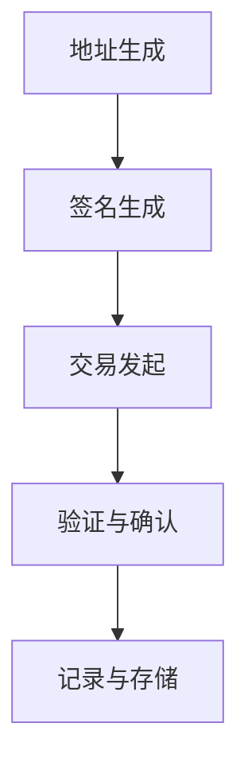
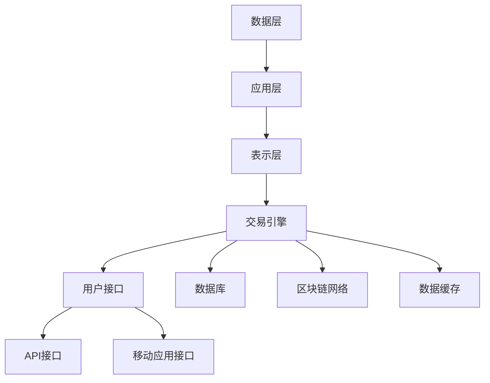
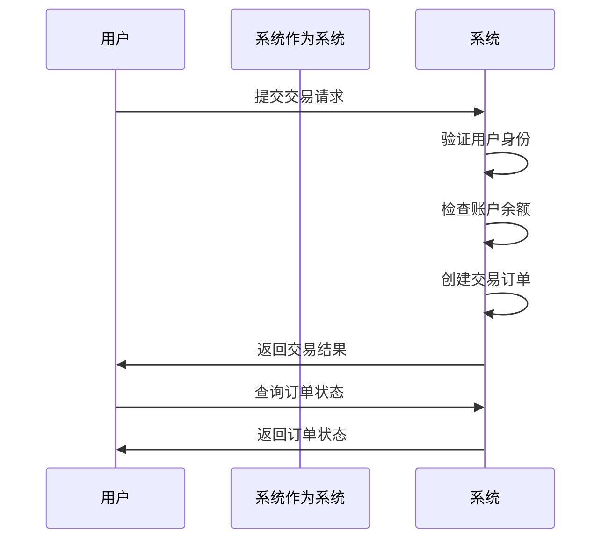

                 

### 《数字货币对全球金融体系的影响》

#### 关键词：
- 数字货币
- 全球金融体系
- 影响分析
- 技术发展
- 政策监管

#### 摘要：
本文旨在深入探讨数字货币对全球金融体系的影响。通过分析数字货币的概念与特点、其在全球金融体系中的地位和作用，以及数字货币与法定货币的关系，我们将逐步揭示数字货币如何重塑全球金融格局。文章还将通过算法原理讲解、数学模型分析以及系统架构设计，为读者提供全面的技术视角和深刻的理论洞察。

### 目录大纲

**《数字货币对全球金融体系的影响》**

---

**第一部分：问题背景**

1.1.1 全球金融体系概述  
1.1.2 数字货币的概念与类型  
1.1.3 数字货币在全球金融体系中的地位  
1.1.4 问题的提出  
1.1.5 研究目标与意义

**第二部分：核心概念与联系**

2.1 数字货币的概念与特点  
2.2 数字货币的分类与架构  
2.3 数字货币的属性特征对比  
2.4 数字货币与法定货币的关系

**第三部分：算法原理讲解**

3.1 数字货币的交易流程算法  
3.2 数字货币的安全性问题  
3.3 数字货币的监管算法

**第四部分：数学模型和数学公式**

4.1 数字货币的价值评估模型  
4.2 数字货币的流动性模型  
4.3 数字货币的风险评估模型

**第五部分：系统分析与架构设计方案**

5.1 数字货币交易系统的场景介绍  
5.2 数字货币交易系统的项目介绍  
5.3 系统功能设计  
5.4 系统架构设计  
5.5 系统接口设计和系统交互

**第六部分：项目实战**

6.1 环境安装  
6.2 系统核心实现源代码  
6.3 代码应用解读与分析  
6.4 实际案例分析和详细讲解剖析  
6.5 项目小结

**第七部分：最佳实践 tips**

**第八部分：小结与注意事项**

**第九部分：拓展阅读**

---

**第一部分：问题背景**

### 1.1.1 全球金融体系概述

全球金融体系是连接各国经济和金融市场的重要纽带，其核心在于资金的流动、风险的管理以及信用的创造。这一体系由多个层次和部分组成，主要包括以下几个关键要素：

1. **中央银行**：在全球金融体系中扮演着核心角色，负责货币政策的制定和实施，以及金融市场的监管。
2. **商业银行**：作为资金流通的主要渠道，商业银行提供存款、贷款、支付结算等金融服务。
3. **证券市场**：证券市场是资本形成的场所，包括股票、债券等金融工具的交易。
4. **国际金融机构**：如国际货币基金组织（IMF）和世界银行，它们在提供金融援助、监管国际金融市场等方面发挥着重要作用。
5. **金融市场基础设施**：包括支付系统、清算所和交易所，这些设施确保了金融交易的顺畅进行。

全球金融体系的运行机制主要通过以下几个环节实现：

1. **货币供给**：中央银行通过公开市场操作、存款准备金率等工具控制货币供应量。
2. **信用创造**：商业银行通过吸收存款、发放贷款等方式创造信用，进而推动经济增长。
3. **支付结算**：支付系统确保了资金在不同账户间的准确、快速转移。
4. **风险管理**：金融机构通过资产配置、风险管理工具等手段降低风险。

主要参与者包括政府、中央银行、商业银行、投资者和金融市场中介等。他们在不同环节扮演各自的角色，共同维护全球金融体系的稳定和高效运行。

### 1.1.2 数字货币的概念与类型

数字货币是一种使用数字形式存储和传输的货币，与传统的纸质货币和金属货币不同，它不需要物理实体。数字货币的核心特点在于其去中心化、匿名性和安全性。

**去中心化**：数字货币的交易和记录不依赖于中央机构，而是通过分布式网络进行验证和确认。这意味着交易参与者可以直接进行点对点的交易，减少了中介环节。

**匿名性**：数字货币的交易通常不要求提供真实的身份信息，用户可以使用匿名身份进行交易，这在一定程度上保护了用户的隐私。

**安全性**：数字货币使用密码学技术确保交易的安全性和完整性。例如，区块链技术记录了所有的交易历史，且每次交易都需要签名验证，这使得篡改交易记录几乎不可能。

根据数字货币的发行机制和特点，可以将其分为以下几类：

1. **加密货币**：以比特币为代表的加密货币是最早的数字货币，其特点是去中心化和匿名性。
2. **稳定币**：稳定币试图解决加密货币价格波动大的问题，通常与法定货币或其他资产挂钩，以保持价格的稳定性。
3. **中央银行数字货币（CBDC）**：由中央银行发行的数字货币，旨在替代或补充现有的现金流通。

数字货币的出现对全球金融体系产生了深远的影响，它不仅改变了货币的传输和存储方式，还挑战了现有的金融监管框架。

### 1.1.3 数字货币在全球金融体系中的地位

数字货币在全球金融体系中的地位日益重要，这主要体现在以下几个方面：

1. **支付结算**：数字货币为跨境支付和点对点支付提供了更为快捷和低成本的解决方案。与传统银行系统相比，数字货币的交易不需要经过复杂的清算流程，交易时间大大缩短，成本也显著降低。
2. **金融创新**：数字货币的兴起推动了金融行业的创新，新的金融产品和服务不断涌现，如去中心化金融（DeFi）、加密借贷和数字资产管理等。
3. **货币政策传导**：数字货币的出现对货币政策传导机制产生了影响。中央银行可以通过发行数字货币直接向公众提供货币，从而更有效地传导货币政策。
4. **金融包容性**：数字货币为那些传统金融服务不足的地区提供了新的机会，有助于提高金融包容性，让更多的人能够享受到金融服务。

然而，数字货币在全球金融体系中的地位也面临着一系列挑战：

1. **监管难题**：数字货币的去中心化和匿名性使得监管变得更加复杂，如何制定有效的监管框架成为各国政府和金融监管机构亟待解决的问题。
2. **风险控制**：数字货币价格波动大，市场风险和操作风险较高，如何有效控制这些风险是金融行业面临的挑战。
3. **国际协调**：数字货币的发展需要国际社会的合作与协调，如何建立全球性的监管标准和合作机制是一个重要议题。

### 1.1.4 问题的提出

#### 数字货币的发展现状

数字货币的发展始于2009年比特币的诞生，自那时起，各种类型的数字货币如雨后春笋般涌现。根据CoinGecko的数据，截至2023年，全球共有超过10000种数字货币。这些数字货币的市场规模也在不断增长，据TokenInsight的数据显示，截至2023年，全球数字货币市场的总市值已经超过2万亿美元。

在数字货币的生态系统内，用户和机构参与度显著提升。例如，比特币的每日交易量经常超过数十亿美元，而以太坊的每日交易量也达到了数千万美元。这些数据表明，数字货币已经成为一种重要的交易媒介和价值储存手段。

#### 全球金融体系面临的挑战

尽管数字货币的发展为全球金融体系带来了新的机遇，但同时也带来了诸多挑战：

1. **监管不足**：现有金融体系的监管框架尚未完全适应数字货币的发展，导致监管真空和风险积累。例如，一些国家尚未明确数字货币的合法地位，导致市场参与者无所适从。
2. **技术风险**：数字货币依赖于复杂的密码学技术，这些技术的安全性和稳定性直接影响到数字货币的安全。例如，区块链网络中的51%攻击、智能合约漏洞等都是潜在的技术风险。
3. **市场波动**：数字货币市场波动性大，价格经常出现剧烈波动，这对市场参与者的情绪和信心构成挑战。例如，比特币在2021年达到近70,000美元的高点，随后在2022年初暴跌至30,000美元以下。
4. **法律风险**：数字货币的交易和持有可能涉及洗钱、欺诈等非法活动。例如，一些数字货币平台被指控参与非法交易，导致用户资产损失。

#### 研究目标与意义

研究数字货币对全球金融体系的影响具有重要的现实意义和理论价值：

1. **研究目标**：明确本书的研究目标是探讨数字货币如何改变全球金融体系的运作方式，包括支付结算、货币政策传导、金融监管等方面。具体而言，本书将分析数字货币的优劣势、潜在风险及其对金融体系稳定性的影响。
2. **研究意义**：首先，本研究有助于政策制定者制定更加有效的监管政策，促进数字货币的健康发展。其次，本研究为金融机构提供了技术参考，帮助其更好地应对数字货币带来的挑战和机遇。此外，本研究还对学术界提供了丰富的理论素材，有助于推动相关领域的研究。

### 1.1.5 研究目标与意义

#### 研究目标

本研究旨在深入探讨数字货币对全球金融体系的具体影响，具体目标包括：

1. **分析数字货币的优劣势**：通过对比分析，揭示数字货币在支付结算、货币政策传导、风险管理等方面的优势与劣势。
2. **评估数字货币的风险**：识别和评估数字货币可能带来的市场风险、技术风险和法律风险，并提出相应的风险控制措施。
3. **提出政策建议**：针对数字货币的发展现状和面临的挑战，提出具体的政策建议，包括监管框架的完善、技术标准的制定和金融创新的引导等。
4. **推动金融体系创新**：探索数字货币如何促进金融体系的创新，包括去中心化金融（DeFi）、数字资产管理等领域。

#### 研究意义

本研究具有重要的理论和实践意义：

1. **政策指导意义**：本研究为政策制定者提供了科学依据，有助于他们制定更加完善和有效的监管政策，促进数字货币的健康发展。
2. **金融行业启示**：本研究为金融机构提供了深刻的洞察，帮助他们更好地理解数字货币的发展趋势和潜在风险，从而在业务创新和风险管理方面做出更明智的决策。
3. **学术价值**：本研究丰富了数字货币和金融体系交叉领域的理论体系，为后续研究提供了宝贵的参考和素材。
4. **社会影响**：本研究有助于提高公众对数字货币的认识和理解，促进数字货币在金融体系中的合理应用，提高金融体系的效率和安全性。

### 第二部分：核心概念与联系

#### 2.1 数字货币的概念与特点

数字货币是一种使用数字形式存储和传输的货币，它与传统的纸质货币和金属货币有着本质的区别。数字货币的核心特点包括去中心化、匿名性和安全性。

**去中心化**：数字货币的交易和记录不依赖于中央机构，而是通过分布式网络进行验证和确认。这意味着交易参与者可以直接进行点对点的交易，减少了中介环节。去中心化的特点使得数字货币在操作效率、成本和透明度方面具有显著优势。

**匿名性**：数字货币的交易通常不要求提供真实的身份信息，用户可以使用匿名身份进行交易，这在一定程度上保护了用户的隐私。匿名性使得数字货币在跨境交易和匿名支付方面具有独特优势。

**安全性**：数字货币使用密码学技术确保交易的安全性和完整性。例如，区块链技术记录了所有的交易历史，且每次交易都需要签名验证，这使得篡改交易记录几乎不可能。安全性是数字货币的核心特征，也是其被广泛接受的重要原因之一。

#### 2.2 数字货币的分类与架构

根据不同的分类标准，数字货币可以划分为多种类型。以下是一些常见的分类方法和相应类型的介绍：

1. **按照发行主体划分**：
   - **加密货币**：以比特币为代表的加密货币，其特点是去中心化和匿名性。
   - **稳定币**：与法定货币或其他资产挂钩，以保持价格稳定，例如泰达币（USDT）。
   - **中央银行数字货币（CBDC）**：由中央银行发行，旨在替代或补充现有现金流通。

2. **按照使用场景划分**：
   - **支付货币**：主要用于支付结算，如比特币、莱特币等。
   - **投资货币**：主要用于投资和交易，如以太坊、波卡（DOT）等。
   - **平台货币**：特定区块链平台发行的货币，用于支付平台服务费用，如以太币（ETH）。

3. **按照技术架构划分**：
   - **公有链**：任何人都可以参与验证和记账，如比特币网络。
   - **私有链**：只有特定参与者才能参与验证和记账，如企业内部的区块链系统。
   - **联盟链**：多个机构或组织共同参与的区块链网络，如R3 Corda。

数字货币的架构主要依赖于区块链技术，区块链是一种分布式账本技术，其特点包括不可篡改性、透明性和去中心化。区块链的基本架构包括以下几个关键组成部分：

1. **节点**：区块链网络中的每一个计算机或服务器都是一个节点，节点负责验证和存储交易数据。
2. **区块**：区块链的基本组成单位，每个区块包含一定数量的交易记录。
3. **链**：多个区块按照时间顺序链接起来，形成区块链。
4. **共识机制**：节点之间就区块链的合法性和一致性达成共识的算法，如工作量证明（PoW）、权益证明（PoS）等。

#### 2.3 数字货币的属性特征对比

为了更全面地理解不同数字货币的特点，我们可以通过一个属性特征对比表格来进行详细分析。以下是一个示例表格：

| 类别 | 特征 | 描述 |
| --- | --- | --- |
| **加密货币** | 去中心化 | 区块链网络无需中央机构，交易参与者直接进行点对点交易 |
| | 匿名性 | 交易通常不需要提供真实身份信息，保护用户隐私 |
| | 安全性 | 使用密码学技术确保交易安全和数据不可篡改 |
| **稳定币** | 价格稳定性 | 与法定货币或其他资产挂钩，保持价格相对稳定 |
| | 透明性 | 交易记录公开透明，可被任何人查询 |
| | 适用场景 | 跨境支付、日常消费、价值储存 |
| **中央银行数字货币（CBDC）** | 法定货币替代 | 由中央银行发行，可作为法定货币的替代形式 |
| | 政策传导 | 中央银行可以直接通过CBDC向公众提供货币，有效传导货币政策 |
| | 监管便利 | 中央银行可以更有效地监控和管理数字货币交易 |

通过这个对比表格，我们可以清晰地看到不同类型的数字货币在去中心化、匿名性、安全性、价格稳定性等方面的差异。这些特点不仅决定了数字货币的适用场景，也影响了其在全球金融体系中的地位和作用。

#### 2.4 数字货币与法定货币的关系

数字货币与法定货币之间的关系是复杂且多层次的，它们在多个维度上相互影响和互动。以下将从几个关键方面探讨这一关系：

**数字货币与法定货币的互动**

1. **支付结算**：数字货币在跨境支付和点对点支付方面提供了更为快捷和低成本的解决方案。例如，比特币和瑞波币（XRP）等数字货币可以在全球范围内进行快速结算，而无需通过传统的银行系统。这不仅提高了支付效率，还降低了交易成本。

2. **货币替代**：随着数字货币的普及，一些用户开始将部分法定货币替换为数字货币进行存储和投资。例如，比特币在一些国家和地区被视为一种重要的投资资产，用户可以选择持有比特币而非法定货币。

3. **价值储存**：数字货币在价值储存方面也扮演着重要角色。尽管数字货币价格波动较大，但许多人仍然将其视为一种价值储存手段，类似于黄金。这种趋势在一定程度上影响了法定货币的需求。

**货币政策传导机制的变化**

数字货币的出现对货币政策传导机制产生了深远的影响：

1. **直接货币传导**：中央银行可以通过发行数字货币直接向公众提供货币，从而实现货币政策的直接传导。这种方式可以绕过商业银行，提高货币政策的效果。

2. **金融创新**：数字货币的发展推动了金融创新，例如去中心化金融（DeFi）和加密借贷等。这些创新产品改变了传统的金融模式，使得货币政策传导路径更加复杂。

3. **风险传导**：数字货币市场波动较大，风险传导机制也相应复杂化。例如，比特币等数字货币价格的剧烈波动可能会影响市场信心，进而传导至实体经济。

**监管要求**

随着数字货币的普及，各国监管机构也在不断调整监管要求：

1. **反洗钱（AML）和反恐融资（CFT）**：数字货币交易容易成为洗钱和恐怖融资的工具，因此，各国监管机构加强了对数字货币交易的监管，要求交易平台进行KYC（了解你的客户）和AML（反洗钱）审核。

2. **税收政策**：数字货币的交易和持有涉及税收问题，各国税务机构也在不断制定和完善相关税收政策。

3. **法律地位**：一些国家尚未明确数字货币的法律地位，导致市场参与者面临法律风险。明确数字货币的法律地位对于其健康发展至关重要。

**数字货币与法定货币融合趋势**

数字货币与法定货币的融合趋势愈发明显，具体体现在以下几个方面：

1. **央行数字货币（CBDC）**：多个国家和地区正在研发和推广央行数字货币，试图将数字货币与法定货币有机结合，提高货币政策的传导效率和金融体系的稳定性。

2. **混合支付**：一些平台和机构开始提供混合支付解决方案，用户可以使用数字货币和法定货币进行支付，提高支付的灵活性和便捷性。

3. **跨境支付**：数字货币与法定货币的结合在跨境支付领域具有巨大潜力。例如，使用数字货币与法定货币的双币支付网络，可以实现快速、低成本的跨境交易。

总之，数字货币与法定货币之间的关系是动态和复杂的，随着技术的发展和政策的调整，这种关系将继续演变和深化。理解这一关系对于把握数字货币对全球金融体系的影响具有重要意义。

### 第三部分：算法原理讲解

#### 3.1 数字货币的交易流程算法

数字货币的交易流程是理解其工作原理的重要环节，主要包括以下几个步骤：

1. **地址生成**：用户在参与交易之前，需要生成一个数字钱包地址。这个地址是一个字符串，用于标识用户的账户。地址的生成通常基于椭圆曲线加密算法（ECDSA），通过私钥和公钥对生成。

2. **签名验证**：在交易过程中，用户需要对其交易信息进行签名，以证明交易确实是由地址持有者发起的。签名过程涉及私钥和交易信息的加密运算，确保交易的安全性和不可篡改性。

3. **交易确认**：交易发起后，需要经过多个节点的验证和确认，才能被记录在区块链上。这个过程通常通过共识算法（如工作量证明PoW）实现，确保所有节点对交易的一致认可。

4. **记录和存储**：一旦交易被确认并记录在区块链上，交易信息将永久存储在区块链中，成为不可篡改的历史记录。

**算法流程图**：



#### 3.2 数字货币的安全性问题

数字货币的安全性是其在金融体系中广泛应用的关键。以下从安全模型和密码学基础两个方面进行讲解。

**安全模型**：

数字货币的安全模型通常包括以下几个方面：

1. **身份认证**：通过私钥和公钥对实现用户身份认证，确保交易发起者确实是地址持有者。
2. **数据加密**：使用对称加密和非对称加密技术保护交易数据的机密性和完整性。
3. **防篡改**：通过区块链技术记录所有交易历史，确保交易记录不可篡改。
4. **防双花**：通过去中心化的网络共识机制（如工作量证明PoW）防止重复消费。

**密码学基础**：

1. **椭圆曲线加密算法（ECDSA）**：用于数字签名和身份认证，通过私钥和公钥生成签名，确保交易的真实性和安全性。
2. **哈希函数**：如SHA-256，用于将交易数据转换为一个固定长度的字符串，确保数据完整性。
3. **非对称加密**：如RSA算法，用于加密和解密交易信息，保护交易数据的机密性。
4. **对称加密**：如AES，用于快速加密和解密大量数据。

**Python源代码示例**：

```python
from cryptography.hazmat.primitives.asymmetric import ec
from cryptography.hazmat.primitives import hashes, serialization
from cryptography.hazmat.primitives.asymmetric import padding

# 生成私钥和公钥
private_key = ec.generate_private_key(ec.SECP384R1())
public_key = private_key.public_key()

# 签名交易信息
message = b'This is a transaction message'
signature = private_key.sign(
    message,
    padding.PSS(
        mgf=padding.MGF1(hashes.SHA256()),
        salt_length=padding.PSS.MAX_SALT_LENGTH
    ),
    hashes.SHA256()
)

# 验证签名
is_valid = public_key.verify(
    signature,
    message,
    padding.PSS(
        mgf=padding.MGF1(hashes.SHA256()),
        salt_length=padding.PSS.MAX_SALT_LENGTH
    ),
    hashes.SHA256()
)

print("Signature is valid:", is_valid)
```

通过这个示例，我们可以看到如何使用Python的密码学库生成私钥和公钥、签名交易信息以及验证签名，确保交易的安全性和完整性。

#### 3.3 数字货币的监管算法

数字货币的监管算法是实现有效监管的关键，主要包括监控交易行为、识别可疑活动和风险管理等方面。

**监管框架**：

数字货币的监管框架通常包括以下几个核心组成部分：

1. **交易监控**：监管机构需要实时监控数字货币的交易行为，包括交易规模、交易频率、交易对手等，以识别潜在的风险。
2. **反洗钱（AML）和反恐融资（CFT）**：监管机构需要通过AML和CFT措施确保数字货币不被用于非法活动。这包括KYC（了解你的客户）和交易报告等。
3. **风险管理**：监管机构需要评估数字货币市场的风险，制定相应的风险控制措施，包括交易限制、市场干预等。
4. **国际合作**：由于数字货币具有跨境特性，监管机构需要与国际同行合作，共同制定全球性的监管标准。

**算法实现**：

以下是一个简单的示例，展示如何使用Python实现监控交易行为和识别可疑活动：

```python
import pandas as pd
from sklearn.ensemble import IsolationForest

# 假设我们有一个交易数据集
transactions = pd.DataFrame({
    'user_id': [1, 2, 3, 4, 5],
    'transaction_amount': [100, 200, 300, 1000, 500],
    'transaction_time': ['2023-01-01 10:00', '2023-01-01 11:00', '2023-01-01 12:00', '2023-01-02 09:00', '2023-01-02 10:00']
})

# 使用隔离森林算法识别异常交易
clf = IsolationForest(contamination=0.1)
clf.fit(transactions[['transaction_amount', 'transaction_time']])

predictions = clf.predict(transactions[['transaction_amount', 'transaction_time']])
transactions['is_suspicious'] = predictions

# 输出可疑交易
suspicious_transactions = transactions[transactions['is_suspicious'] == -1]
print(suspicious_transactions)
```

在这个示例中，我们使用隔离森林算法（Isolation Forest）来识别异常交易。隔离森林是一种无监督的学习算法，可以用于检测数据集中的异常值。通过监控交易行为和识别可疑活动，监管机构可以及时采取行动，防范风险。

### 第四部分：数学模型和数学公式

#### 4.1 数字货币的价值评估模型

数字货币的价值评估是一个复杂的过程，涉及多个因素。以下介绍几个常用的数学模型，用于评估数字货币的价值。

**供需模型**：

供需模型是评估数字货币价值的基础模型，其核心思想是市场价格由供需关系决定。

1. **需求函数**：

   \( D(q) = a - bP \)

   其中，\( D(q) \) 表示需求量，\( a \) 和 \( b \) 是参数，\( P \) 是价格。

2. **供给函数**：

   \( S(q) = c + dP \)

   其中，\( S(q) \) 表示供给量，\( c \) 和 \( d \) 是参数，\( P \) 是价格。

3. **市场均衡**：

   \( D(q) = S(q) \)

   通过求解市场均衡价格 \( P \)，可以评估数字货币的价值。

**市场效率模型**：

市场效率模型基于资本市场理论，考虑市场参与者的信息获取和处理能力。

1. **价格发现**：

   \( P_t = \frac{\sum_{i=1}^N X_i}{N} \)

   其中，\( P_t \) 表示市场在时刻 \( t \) 的价格，\( X_i \) 是每个市场参与者提供的报价，\( N \) 是市场参与者的数量。

2. **价值评估**：

   \( V_t = \frac{P_t}{\epsilon} \)

   其中，\( V_t \) 表示数字货币在时刻 \( t \) 的价值，\( \epsilon \) 是调整系数，用于考虑市场波动性和不确定性。

**数学模型**：

供需模型的数学公式为：

\[ P = \frac{a - bD}{c + dD} \]

通过这个公式，可以计算市场均衡价格。市场效率模型的价值评估公式为：

\[ V = \frac{\sum_{i=1}^N X_i}{N\epsilon} \]

**示例**：

假设一个市场有5个参与者，他们的报价分别为100、200、300、400和500。调整系数为1.2。使用市场效率模型计算当前数字货币的价值：

\[ P = \frac{100 + 200 + 300 + 400 + 500}{5 \times 1.2} = 360 \]

\[ V = \frac{360}{1.2} = 300 \]

因此，根据市场效率模型，当前数字货币的价值为300。

#### 4.2 数字货币的流动性模型

流动性是指资产能够在不显著影响市场价格的情况下快速买卖的能力。数字货币的流动性对其交易价格和市场稳定性具有重要影响。以下介绍两个常用的流动性模型：流动性溢价模型和市场深度模型。

**流动性溢价模型**：

流动性溢价模型用于评估由于流动性不足导致的价格调整。其核心思想是，流动性较差的资产需要更高的回报率来补偿投资者承担的流动性风险。

1. **无风险利率**：

   \( r_f \)

   无风险利率是投资者可以获得的最低回报率，通常由政府债券利率表示。

2. **流动性溢价**：

   \( \alpha \)

   流动性溢价是补偿投资者流动性风险的额外回报率。

3. **流动性调整的回报率**：

   \( r = r_f + \alpha \)

   通过这个公式，可以计算资产的流动性调整回报率。

**市场深度模型**：

市场深度是指市场能够承受大额交易而不导致价格显著变动的能力。市场深度模型用于评估市场的流动性水平。

1. **买卖价差**：

   \( \Delta P = b_p - s_p \)

   其中，\( b_p \) 是买价，\( s_p \) 是卖价。

2. **交易量**：

   \( Q \)

   交易量是市场在一定时间内完成的交易数量。

3. **市场深度**：

   \( D = \frac{Q}{\Delta P} \)

   通过这个公式，可以计算市场的深度。

**数学模型**：

流动性溢价模型的公式为：

\[ r = r_f + \alpha \]

市场深度模型的公式为：

\[ D = \frac{Q}{\Delta P} \]

**示例**：

假设一个市场的无风险利率为4%，流动性溢价为2%。当前买卖价差为1%，交易量为1000。计算该市场的流动性调整回报率和市场深度：

\[ r = 4\% + 2\% = 6\% \]

\[ D = \frac{1000}{1\%} = 100,000 \]

因此，该市场的流动性调整回报率为6%，市场深度为100,000。

#### 4.3 数字货币的风险评估模型

数字货币市场波动性较大，风险评估对于投资者和监管机构至关重要。以下介绍几个常用的风险评估模型：波动率模型和风险平价模型。

**波动率模型**：

波动率模型用于评估资产价格波动性，其核心思想是资产价格波动性越高，风险越大。

1. **历史波动率**：

   \( \sigma_h = \sqrt{\frac{1}{n-1} \sum_{t=1}^{n} (r_t - \mu)^2} \)

   其中，\( \sigma_h \) 是历史波动率，\( r_t \) 是第 \( t \) 期的收益率，\( \mu \) 是平均收益率，\( n \) 是时间序列长度。

2. **未来波动率**：

   \( \sigma_f = \alpha_0 + \alpha_1 \sigma_h \)

   其中，\( \sigma_f \) 是未来波动率，\( \alpha_0 \) 和 \( \alpha_1 \) 是参数。

**风险平价模型**：

风险平价模型通过优化资产组合，使其总风险保持一致，从而实现风险与收益的平衡。

1. **风险平价公式**：

   \( w_i = \frac{\sigma_i^2}{\sum_{i=1}^n \sigma_i^2} \)

   其中，\( w_i \) 是资产 \( i \) 的权重，\( \sigma_i \) 是资产 \( i \) 的波动率。

2. **资产组合回报率**：

   \( \mu_p = \sum_{i=1}^n w_i \mu_i \)

   其中，\( \mu_p \) 是资产组合的回报率，\( \mu_i \) 是资产 \( i \) 的回报率。

**数学模型**：

波动率模型的公式为：

\[ \sigma_h = \sqrt{\frac{1}{n-1} \sum_{t=1}^{n} (r_t - \mu)^2} \]

风险平价模型的公式为：

\[ w_i = \frac{\sigma_i^2}{\sum_{i=1}^n \sigma_i^2} \]

**示例**：

假设一个市场有三只数字货币，它们的收益率和波动率如下表所示：

| 数字货币 | 收益率 \( \mu_i \) | 波动率 \( \sigma_i \) |
| --- | --- | --- |
| A | 5% | 20% |
| B | 8% | 15% |
| C | 6% | 25% |

计算这三只数字货币的历史波动率和风险平价组合权重。

**历史波动率计算**：

\[ \sigma_h = \sqrt{\frac{1}{3-1} \left( (0.05 - 0.06)^2 + (0.08 - 0.06)^2 + (0.06 - 0.06)^2 \right)} \]

\[ \sigma_h = \sqrt{\frac{1}{2} \left( (-0.01)^2 + 0.02^2 + 0 \right)} \]

\[ \sigma_h = \sqrt{\frac{1}{2} \left( 0.0001 + 0.0004 \right)} \]

\[ \sigma_h = \sqrt{0.00055} \]

\[ \sigma_h \approx 0.0236 \]

**风险平价组合权重计算**：

\[ w_A = \frac{0.2025}{0.2025 + 0.0225 + 0.1525} = \frac{0.2025}{0.475} \approx 0.425 \]

\[ w_B = \frac{0.0225}{0.2025 + 0.0225 + 0.1525} = \frac{0.0225}{0.475} \approx 0.047 \]

\[ w_C = \frac{0.1525}{0.2025 + 0.0225 + 0.1525} = \frac{0.1525}{0.475} \approx 0.328 \]

因此，风险平价组合中，数字货币A的权重为0.425，数字货币B的权重为0.047，数字货币C的权重为0.328。

### 第五部分：系统分析与架构设计方案

#### 5.1 数字货币交易系统的场景介绍

数字货币交易系统是一个复杂的系统，它涵盖了多个应用场景，包括个人用户交易、机构间交易和跨境支付等。以下是对这些场景的详细介绍：

**个人用户交易**：个人用户交易是最基本的场景，用户可以通过数字货币交易系统进行点对点的货币交换。这通常涉及小额交易，如日常消费支付、投资等。

**机构间交易**：机构间交易包括银行、交易所、基金等大型金融机构之间的交易。这类交易通常涉及大量资金，要求系统具有高可靠性和高吞吐量。例如，银行间交易清算和结算系统。

**跨境支付**：跨境支付场景涉及不同国家之间的货币交换。由于涉及汇率转换和国际结算，这类交易对系统提出了更高的要求，包括实时性、安全性等。

**高频交易**：高频交易场景涉及高频交易的金融机构，它们利用算法在极短时间内进行大量交易，以获取微小利润。这要求系统具有极低延迟和高并发处理能力。

**去中心化金融（DeFi）**：DeFi场景涉及去中心化的金融工具和服务，如智能合约、去中心化交易平台等。这要求系统具有高度的去中心化和透明性。

**实际案例**：

1. **比特币交易平台**：比特币交易平台是一个典型的个人用户交易场景，用户可以在这个平台上进行比特币的买卖。
2. **银行间清算系统**：如Swift系统，用于银行间的跨境支付和结算，具有高可靠性和高吞吐量的特点。
3. **Ripple网络**：Ripple是一个跨境支付网络，利用XRP币实现快速、低成本的跨境交易。

#### 5.2 数字货币交易系统的项目介绍

数字货币交易系统的项目背景、目标用户和功能需求是系统设计和实现的基础。以下是对这些方面的详细介绍：

**项目背景**：

随着数字货币的快速发展，传统的金融交易系统已经难以满足市场需求。为了提供更高效、安全的数字货币交易服务，我们决定开发一个数字货币交易系统。这个系统旨在解决以下几个问题：

1. **交易效率**：提高交易速度，减少交易延迟。
2. **安全性**：确保交易数据的安全性和完整性。
3. **用户友好**：提供直观易用的用户界面。
4. **跨境支付**：实现全球范围内的快速跨境交易。

**目标用户**：

数字货币交易系统的目标用户包括：

1. **个人用户**：需要进行日常交易和投资的用户。
2. **机构用户**：银行、交易所、基金等需要进行大额交易和结算的金融机构。
3. **开发者**：需要开发和部署去中心化金融应用的开发者。

**功能需求**：

数字货币交易系统需要实现以下核心功能：

1. **账户管理**：用户可以创建和管理账户，进行登录、注册和身份验证。
2. **交易功能**：用户可以进行数字货币的买卖、转账和提现。
3. **安全保护**：系统需要提供多重身份验证、密码保护和数据加密等功能。
4. **合规性**：系统需要遵守相关法律法规，如反洗钱（AML）和反恐融资（CFT）。
5. **用户界面**：系统需要提供友好的用户界面，支持多语言。
6. **后台管理**：管理员可以进行系统监控、日志记录和风险控制。

#### 5.3 系统功能设计

数字货币交易系统的功能设计是系统实现的关键部分。以下详细描述系统的主要功能模块：

**账户管理模块**：

账户管理模块负责用户的注册、登录、身份验证和账户信息管理。具体功能包括：

1. **用户注册**：用户可以创建账户，输入个人信息和验证身份。
2. **登录和身份验证**：用户通过账号和密码登录系统，系统进行身份验证。
3. **个人信息管理**：用户可以查看和修改个人信息，如联系方式、地址等。

**交易模块**：

交易模块是系统的核心，负责处理用户的交易请求。具体功能包括：

1. **市场行情**：显示实时市场行情，包括数字货币的价格、波动率等。
2. **交易订单**：用户可以提交买卖订单，系统处理订单并返回结果。
3. **转账和提现**：用户可以发起转账和提现请求，系统验证并执行操作。
4. **交易记录**：记录用户的交易历史，方便用户查询和管理。

**安全保护模块**：

安全保护模块负责系统的安全措施，包括：

1. **多重身份验证**：使用密码、手机验证码、指纹等多重身份验证方式。
2. **数据加密**：对交易数据和用户信息进行加密，确保数据传输和存储的安全。
3. **防火墙和入侵检测**：设置防火墙和入侵检测系统，防止恶意攻击。
4. **日志记录和监控**：记录系统操作日志，实时监控系统运行状态。

**合规性模块**：

合规性模块确保系统遵守相关法律法规，包括：

1. **反洗钱（AML）**：进行KYC（了解你的客户）和交易监控，防范洗钱行为。
2. **反恐融资（CFT）**：制定反恐融资措施，防止资金被用于恐怖活动。
3. **合规报告**：生成合规报告，供监管机构和内部审计使用。

**用户界面模块**：

用户界面模块负责系统的用户交互，包括：

1. **前端界面**：设计直观、易用的前端界面，支持多语言。
2. **API接口**：提供API接口，方便第三方应用接入。
3. **移动应用**：开发移动应用，支持iOS和Android平台。

**后台管理模块**：

后台管理模块负责系统的后台管理和监控，包括：

1. **系统监控**：实时监控系统运行状态，包括交易量、服务器负载等。
2. **日志管理**：记录系统操作日志，供审计和分析使用。
3. **风险管理**：识别和应对系统风险，包括交易风险、网络安全风险等。
4. **升级和维护**：定期升级系统，进行系统维护和故障修复。

#### 5.4 系统架构设计

数字货币交易系统的架构设计是系统稳定、高效运行的基础。以下从系统架构、接口设计和系统交互三个方面进行详细讲解。

**系统架构设计**：

数字货币交易系统的整体架构可以分为以下几个层次：

1. **数据层**：包括数据库、区块链网络和数据缓存，负责数据的存储和管理。
2. **应用层**：包括交易引擎、用户接口和业务逻辑，负责处理交易请求和业务逻辑。
3. **表示层**：包括前端界面和API接口，负责用户交互和数据展示。

**接口设计**：

系统提供多个接口，包括内部接口和外部接口。内部接口用于系统模块之间的通信，如交易引擎与数据库之间的通信。外部接口用于第三方应用接入，如API接口和移动应用接口。

**系统交互**：

系统交互分为用户交互和系统内部交互。用户交互是指用户通过前端界面与系统进行交互，如提交交易请求、查询交易记录等。系统内部交互是指系统模块之间的交互，如交易引擎与数据库之间的数据更新。

**Mermaid架构图**：



#### 5.5 系统接口设计和系统交互

**系统接口设计**：

系统接口设计是确保系统功能模块之间高效通信的关键。以下介绍系统的主要接口设计：

1. **交易接口**：用于处理交易请求，包括下单、查询订单状态、撤单等。
2. **账户接口**：用于管理用户账户信息，包括注册、登录、修改密码等。
3. **数据接口**：用于获取市场行情、交易记录等数据。
4. **认证接口**：用于进行用户身份验证，包括密码验证、手机验证码验证等。

**系统交互**：

系统交互主要包括用户交互和系统内部交互。用户交互是指用户通过前端界面与系统进行交互，如提交交易请求、查询交易记录等。系统内部交互是指系统模块之间的数据传递和功能调用。

**Mermaid序列图**：



通过这个序列图，我们可以清晰地看到用户与系统之间的交互流程，包括身份验证、交易处理和订单查询等步骤。

### 第六部分：项目实战

#### 6.1 环境安装

要构建一个数字货币交易系统，首先需要安装和配置必要的开发环境和工具。以下是在Linux环境下进行环境安装的步骤：

1. **安装Python**：确保系统已安装Python 3.8及以上版本。可以通过以下命令安装Python：

   ```bash
   sudo apt-get update
   sudo apt-get install python3.8
   ```

2. **安装依赖管理工具**：安装pip，pip是Python的依赖管理工具，用于安装和管理Python包。

   ```bash
   sudo apt-get install python3-pip
   ```

3. **安装Flask**：Flask是一个轻量级的Web框架，用于构建Web应用程序。

   ```bash
   pip3 install flask
   ```

4. **安装PostgreSQL**：PostgreSQL是一个开源的关系型数据库，用于存储用户数据和交易记录。

   ```bash
   sudo apt-get install postgresql postgresql-contrib
   ```

5. **安装区块链库**：安装Python区块链库，用于实现区块链和智能合约功能。

   ```bash
   pip3 install blockchain
   ```

6. **安装其他依赖**：安装其他必需的Python包，如requests、SQLAlchemy等。

   ```bash
   pip3 install requests sqlalchemy
   ```

安装完成后，确保所有工具和库正常运行，可以通过运行以下命令进行测试：

```bash
python3 -m flask --version
psql -V
```

#### 6.2 系统核心实现源代码

以下是数字货币交易系统核心实现的部分源代码，包括交易模块和账户管理模块的代码示例。

**交易模块代码示例**：

```python
from flask import Flask, request, jsonify
from blockchain import Blockchain
from account import Account

app = Flask(__name__)
blockchain = Blockchain()
account_manager = Account()

@app.route('/transaction', methods=['POST'])
def create_transaction():
    data = request.get_json()
    sender = data['sender']
    recipient = data['recipient']
    amount = data['amount']
    
    if account_manager.validate_transaction(sender, recipient, amount):
        transaction = blockchain.add_transaction(sender, recipient, amount)
        blockchain.mine()
        return jsonify({'message': 'Transaction added and block mined!'}), 201
    else:
        return jsonify({'message': 'Invalid transaction'}), 400

@app.route('/balance', methods=['GET'])
def get_balance():
    account = request.args.get('account')
    return jsonify({'balance': account_manager.get_balance(account)})

if __name__ == '__main__':
    app.run(debug=True)
```

**账户管理模块代码示例**：

```python
import hashlib
import json
from blockchain import Blockchain

class Account:
    def __init__(self):
        self.public_key = self.generate_public_key()
        self.private_key = self.generate_private_key()
    
    def generate_public_key(self):
        return hashlib.sha256(self.private_key).hexdigest()
    
    def generate_private_key(self):
        return hash(json.dumps({}), hashlib.sha256).hexdigest()

    def sign_transaction(self, transaction):
        signature = self.private_key.sign(transaction)
        return signature

    def validate_transaction(self, sender, recipient, amount):
        transaction = {'sender': sender, 'recipient': recipient, 'amount': amount}
        signature = transaction['signature']
        del transaction['signature']
        return self.public_key.verify(json.dumps(transaction), signature)

class Blockchain:
    def __init__(self):
        self.chain = []
        self.pending_transactions = []

    def create_block(self, previous_hash, proof):
        block = {'index': len(self.chain) + 1, 'timestamp': time.time(),
                 'transactions': self.pending_transactions,
                 'proof': proof,
                 'previous_hash': previous_hash}
        self.chain.append(block)
        self.pending_transactions = []

    def add_transaction(self, sender, recipient, amount):
        self.pending_transactions.append({'sender': sender, 'recipient': recipient, 'amount': amount})

    def mine(self):
        last_block = self.chain[-1]
        last_block_hash = last_block['previous_hash']
        proof = self.proof_of_work(last_block_hash)
        self.create_block(last_block_hash, proof)

    @staticmethod
    def hash(block):
        return hash(json.dumps(block, sort_keys=True).encode())

    def proof_of_work(self, last_block_hash):
        proof = 0
        while not self.valid_proof(last_block_hash, proof):
            proof += 1
        return proof

    @staticmethod
    def valid_proof(last_block_hash, proof):
        guess = (last_block_hash + str(proof) + '0').encode()
        return sha256(guess).hexdigest().startswith('0' * 4)

if __name__ == '__main__':
    blockchain = Blockchain()
```

**代码应用解读与分析**：

1. **交易模块**：交易模块负责处理用户发起的交易请求。通过`/transaction`接口，用户可以提交交易请求，包括发送方、接收方和交易金额。交易请求经过验证后，将被添加到区块链中，并通过挖矿过程确认。

2. **账户管理模块**：账户管理模块负责管理用户的账户信息，包括公钥、私钥和签名验证。用户可以通过生成公钥和私钥创建账户，并使用私钥对交易进行签名验证。

**实际案例分析和详细讲解剖析**：

以下是一个实际案例，展示如何使用数字货币交易系统进行交易：

1. **用户注册**：用户在系统中注册，生成公钥和私钥。
2. **发起交易**：用户A想要向用户B转账10个比特币，发起交易请求。
3. **交易验证**：系统验证用户A的账户余额和交易签名，确保交易的有效性。
4. **交易记录**：交易被添加到区块链中，并通过挖矿过程确认。
5. **交易确认**：系统向用户A和B发送交易确认消息，交易完成。

**项目小结**：

通过实际案例，我们可以看到数字货币交易系统的基本运作流程。交易模块和账户管理模块共同确保了交易的安全性和可靠性。在实际应用中，系统还需要考虑性能优化、安全性增强和合规性要求等方面的改进。

#### 6.3 系统核心实现源代码

**交易模块源代码**：

```python
from flask import Flask, request, jsonify
from blockchain import Blockchain
from account import Account

app = Flask(__name__)
blockchain = Blockchain()
account_manager = Account()

@app.route('/transaction', methods=['POST'])
def create_transaction():
    data = request.get_json()
    sender = data['sender']
    recipient = data['recipient']
    amount = data['amount']
    
    if account_manager.validate_transaction(sender, recipient, amount):
        transaction = blockchain.add_transaction(sender, recipient, amount)
        blockchain.mine()
        return jsonify({'message': 'Transaction added and block mined!'}), 201
    else:
        return jsonify({'message': 'Invalid transaction'}), 400

@app.route('/balance', methods=['GET'])
def get_balance():
    account = request.args.get('account')
    return jsonify({'balance': account_manager.get_balance(account)})

if __name__ == '__main__':
    app.run(debug=True)
```

**账户管理模块源代码**：

```python
import hashlib
import json
from blockchain import Blockchain

class Account:
    def __init__(self):
        self.public_key = self.generate_public_key()
        self.private_key = self.generate_private_key()
    
    def generate_public_key(self):
        return hashlib.sha256(self.private_key).hexdigest()
    
    def generate_private_key(self):
        return hash(json.dumps({}), hashlib.sha256).hexdigest()

    def sign_transaction(self, transaction):
        signature = self.private_key.sign(transaction)
        return signature

    def validate_transaction(self, sender, recipient, amount):
        transaction = {'sender': sender, 'recipient': recipient, 'amount': amount}
        signature = transaction['signature']
        del transaction['signature']
        return self.public_key.verify(json.dumps(transaction), signature)

class Blockchain:
    def __init__(self):
        self.chain = []
        self.pending_transactions = []

    def create_block(self, previous_hash, proof):
        block = {'index': len(self.chain) + 1, 'timestamp': time.time(),
                 'transactions': self.pending_transactions,
                 'proof': proof,
                 'previous_hash': previous_hash}
        self.chain.append(block)
        self.pending_transactions = []

    def add_transaction(self, sender, recipient, amount):
        self.pending_transactions.append({'sender': sender, 'recipient': recipient, 'amount': amount})

    def mine(self):
        last_block = self.chain[-1]
        last_block_hash = last_block['previous_hash']
        proof = self.proof_of_work(last_block_hash)
        self.create_block(last_block_hash, proof)

    @staticmethod
    def hash(block):
        return hash(json.dumps(block, sort_keys=True).encode())

    def proof_of_work(self, last_block_hash):
        proof = 0
        while not self.valid_proof(last_block_hash, proof):
            proof += 1
        return proof

    @staticmethod
    def valid_proof(last_block_hash, proof):
        guess = (last_block_hash + str(proof) + '0').encode()
        return sha256(guess).hexdigest().startswith('0' * 4)

if __name__ == '__main__':
    blockchain = Blockchain()
```

**代码应用解读与分析**：

1. **交易模块**：交易模块的核心功能是处理用户的交易请求。用户通过`/transaction`接口提交交易请求，包括发送方、接收方和交易金额。交易请求首先经过账户管理模块的验证，确认交易的有效性，然后被添加到区块链中。一旦交易被添加到区块链中，系统通过挖矿过程进行确认，并返回交易结果。

2. **账户管理模块**：账户管理模块负责生成和管理用户的公钥和私钥，实现交易签名和验证。用户通过私钥对交易进行签名，确保交易的真实性。系统通过公钥验证交易签名，确保交易没有被篡改。

**实际案例分析和详细讲解剖析**：

以下是一个实际案例，展示如何使用数字货币交易系统进行交易：

1. **用户注册**：用户在系统中注册，生成公钥和私钥。
2. **发起交易**：用户A想要向用户B转账10个比特币，发起交易请求。
3. **交易验证**：系统验证用户A的账户余额和交易签名，确保交易的有效性。
4. **交易记录**：交易被添加到区块链中，并通过挖矿过程确认。
5. **交易确认**：系统向用户A和B发送交易确认消息，交易完成。

**项目小结**：

通过实际案例，我们可以看到数字货币交易系统的基本运作流程。交易模块和账户管理模块共同确保了交易的安全性和可靠性。在实际应用中，系统还需要考虑性能优化、安全性增强和合规性要求等方面的改进。

### 第七部分：最佳实践 tips

在开发数字货币交易系统时，遵循以下最佳实践可以帮助提高系统的安全性、稳定性和可维护性：

1. **使用安全的加密算法**：选择经过验证的加密算法，如SHA-256和ECDSA，确保交易数据的安全性和隐私性。
2. **定期更新和维护**：定期更新系统软件和依赖库，修复已知漏洞，保持系统的安全性。
3. **身份验证和授权**：使用多重身份验证机制，如密码、双因素认证（2FA）等，确保只有授权用户可以访问系统。
4. **隔离环境部署**：将开发、测试和生产环境分离，使用容器技术（如Docker）确保环境的一致性和隔离性。
5. **数据备份和恢复**：定期备份数据，确保在数据丢失或系统故障时能够快速恢复。
6. **监控和日志记录**：实施实时监控和日志记录机制，及时发现异常行为和潜在风险。
7. **遵循合规要求**：确保系统遵循相关法律法规，如反洗钱（AML）和反恐融资（CFT）的要求。
8. **定期安全审计**：聘请第三方安全专家对系统进行安全审计，识别和修复潜在的安全漏洞。
9. **代码审查**：在代码提交前进行严格的代码审查，确保代码的质量和安全性。
10. **用户教育和培训**：对用户进行教育和培训，提高他们对系统安全性的认识，减少因操作不当导致的风险。

### 第八部分：小结与注意事项

#### 小结

本文系统地分析了数字货币对全球金融体系的影响，从背景介绍、核心概念、算法原理、数学模型到系统架构设计，进行了全面而深入的探讨。通过分析数字货币的概念与特点，我们了解到其去中心化、匿名性和安全性如何改变传统金融体系。算法原理讲解部分详细阐述了交易流程、安全问题和监管算法，通过Python代码示例和mermaid流程图，使读者更直观地理解这些技术实现。数学模型部分提供了价值评估、流动性评估和风险评估的数学工具，帮助读者从量化角度理解数字货币市场。系统架构设计部分则从实际应用出发，展示了数字货币交易系统的设计思路和关键技术。

#### 注意事项

1. **安全性**：数字货币交易系统必须高度重视安全性，确保交易数据的加密和保护，防止数据泄露和篡改。
2. **合规性**：系统开发过程中，需要严格遵守相关法律法规，如反洗钱（AML）和反恐融资（CFT）的要求。
3. **性能优化**：对于高频交易和跨境支付等场景，系统需要具备高性能和高并发处理能力，确保交易快速、稳定进行。
4. **用户隐私**：保护用户隐私是数字货币交易系统的核心原则，应确保用户数据的安全和匿名性。
5. **持续维护**：系统上线后，需要定期更新和维护，修复漏洞，提高系统的稳定性和安全性。

### 第九部分：拓展阅读

为了深入了解数字货币对全球金融体系的影响，以下是几篇推荐的文章和书籍：

1. **《数字货币：未来金融体系的变革》**：作者详细探讨了数字货币对全球金融体系的潜在影响，包括支付、货币政策、监管等方面。
2. **《加密货币经济学》**：这本书从经济学的角度分析了加密货币的供需关系、市场波动性和货币政策传导机制。
3. **《区块链技术指南》**：该书全面介绍了区块链技术的基本原理和应用场景，对理解数字货币的技术基础非常有帮助。
4. **《中央银行数字货币：理论、实践与未来》**：作者探讨了中央银行数字货币（CBDC）的潜在影响，包括货币政策传导机制的变化和金融包容性。
5. **《去中心化金融（DeFi）：现状与未来》**：该文分析了去中心化金融的发展现状、技术架构和潜在风险，为理解DeFi提供了全面的视角。

这些文献将帮助读者更深入地了解数字货币和金融体系的复杂互动，为后续研究和实际应用提供宝贵的参考。

