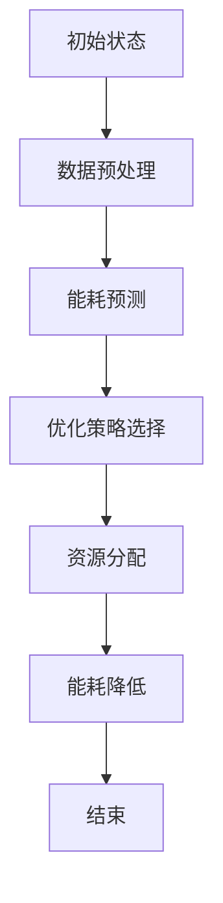
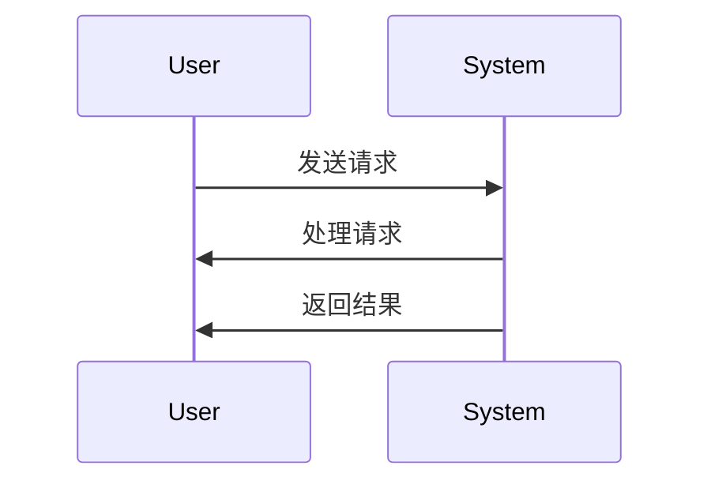

                 

# 数据中心能效优化：节能计算的关键作用

## 关键词

数据中心，能效优化，节能计算，效率提升，可持续性

## 摘要

随着数据中心规模的不断扩大和复杂度的增加，能效优化已成为数据中心管理和运营的关键问题。本文详细探讨了数据中心能效优化的重要性，分析了当前面临的挑战，并深入阐述了节能计算的核心作用。通过介绍常见节能算法的原理、数学模型和公式，本文进一步展示了数据中心能效优化的系统设计与实现方法。最后，通过实际案例分析和最佳实践分享，为读者提供了数据中心能效优化的实用策略和思考方向。

## 引言

### 数据中心的重要性

数据中心作为全球信息技术的核心基础设施，承载着海量数据存储、处理和交换的重要任务。随着云计算、大数据和物联网等技术的发展，数据中心的需求日益增长，其规模和复杂度也不断扩展。然而，随着数据中心规模的扩大，能耗问题也日益突出。据统计，全球数据中心的能耗已经占到全球总能耗的1%以上，且这一比例还在逐年上升。

### 能效优化的必要性

数据中心的高能耗不仅增加了运营成本，还带来了严重的环境问题。为了实现可持续发展，数据中心能效优化已成为行业关注的焦点。通过优化数据中心能效，可以在降低能耗的同时提高计算效率，从而实现成本节约和环境保护的双重目标。

### 节能计算的核心作用

节能计算作为数据中心能效优化的重要组成部分，通过优化计算资源和能源消耗的匹配关系，实现数据中心的整体节能。本文将围绕数据中心能效优化的背景、挑战、节能算法原理、系统设计与实现以及实际应用等方面进行详细探讨。

## 第一部分：数据中心能效优化概述

### 1. 数据中心能效优化的定义

数据中心能效优化是指通过采用先进的技术和管理方法，对数据中心的能源消耗进行精细化管理和优化，以降低能耗、提高资源利用率和计算效率的过程。

### 2. 数据中心能效优化的现状与挑战

#### 2.1. 数据中心能效优化现状概述

当前，数据中心能效优化已经成为全球范围内的热点话题。许多企业和机构已经开始采取各种措施来优化数据中心的能耗，例如采用高效服务器、改进空调系统、采用智能化管理平台等。然而，尽管取得了一定成果，但整体能效优化水平仍有较大提升空间。

#### 2.2. 数据中心能效优化面临的挑战

数据中心能效优化面临以下几方面的挑战：

- **能耗管理复杂度增加**：随着数据中心规模的扩大和技术的不断演进，能耗管理的复杂度也在增加，传统的能耗管理方法已经难以满足需求。
- **数据隐私和安全问题**：数据中心存储和处理的海量数据涉及用户隐私和企业商业秘密，能效优化过程中需要确保数据的安全和隐私。
- **投资回报周期**：数据中心能效优化的投资回报周期较长，需要企业有足够的耐心和资金支持。
- **技术更新换代**：数据中心技术更新换代速度较快，能效优化措施需要不断迭代更新，以适应新技术的发展。

### 3. 节能计算的核心作用

节能计算在数据中心能效优化中发挥着关键作用，主要通过以下几个方面实现：

- **资源调度优化**：通过优化计算资源的调度和分配，实现能源消耗的最小化。
- **能耗管理**：采用先进的能耗管理技术，对数据中心的能源消耗进行实时监测和控制。
- **智能调节**：利用机器学习和人工智能技术，实现数据中心的自动调节，提高能效。

## 第二部分：节能算法原理讲解

### 5. 常见节能算法介绍

#### 5.1. 传统节能算法

传统节能算法主要包括以下几种：

- **压缩感知算法**：通过降低数据采样率，减少数据中心的存储和计算需求，从而降低能耗。
- **虚拟化技术**：通过虚拟化技术，提高计算资源的利用率，减少冗余计算，降低能耗。
- **智能调度算法**：通过实时监测数据中心的负载情况，动态调整计算资源分配，提高资源利用率，降低能耗。

#### 5.2. 智能节能算法

智能节能算法主要包括以下几种：

- **深度学习算法**：利用深度学习算法，对数据中心的能耗进行预测和优化，实现能耗的精细化管理和控制。
- **强化学习算法**：通过强化学习算法，实现数据中心的自动调节和优化，提高能效。
- **混合优化算法**：结合传统算法和智能算法的优势，实现能耗的全面优化。

### 6. 节能算法的数学模型和公式

#### 6.1. 数学模型基础

节能算法的数学模型主要包括以下几部分：

- **能耗模型**：描述数据中心的能耗与计算资源之间的关系。
- **优化目标函数**：定义数据中心的优化目标，例如能耗最小化、计算效率最大化等。
- **约束条件**：定义数据中心的运行限制，例如负载均衡、资源可用性等。

#### 6.2. 常见公式解析

常见节能算法的公式主要包括以下几类：

- **能耗计算公式**：描述数据中心能耗的计算方法，例如 $E = P \times t$，其中 $E$ 表示能耗，$P$ 表示功率，$t$ 表示时间。
- **优化算法公式**：描述数据中心的优化算法，例如梯度下降算法、遗传算法等。
- **模型验证公式**：描述模型验证的方法，例如交叉验证、ROC曲线等。

### 7. 节能算法的mermaid流程图绘制

#### 7.1. 节能算法mermaid流程图

mermaid流程图是一种用于绘制流程图和序列图的工具，可以帮助我们更好地理解节能算法的工作流程。以下是一个简单的mermaid流程图示例：



#### 7.2. 节能算法mermaid序列图

序列图用于描述算法的执行过程，可以帮助我们更好地理解算法的逻辑。以下是一个简单的mermaid序列图示例：



## 第三部分：数据中心能效优化系统设计与实现

### 8. 数据中心能效优化系统架构设计

数据中心能效优化系统的架构设计主要包括以下几个部分：

- **数据采集模块**：负责实时采集数据中心的能耗数据、负载数据等。
- **数据处理模块**：负责对采集到的数据进行处理、分析和预测。
- **优化决策模块**：负责根据数据处理结果，制定优化策略和资源分配方案。
- **执行控制模块**：负责根据优化决策，对数据中心的计算资源和能源消耗进行控制。

### 9. 数据中心能效优化接口设计与交互

数据中心能效优化系统的接口设计主要包括以下几个方面：

- **数据采集接口**：用于与其他系统进行数据交换，实现数据的实时采集。
- **数据处理接口**：用于实现数据处理和分析的功能，提供能耗预测和优化策略。
- **优化决策接口**：用于与其他系统进行交互，实现优化决策的执行和控制。
- **监控与告警接口**：用于实时监控数据中心的运行状态，实现异常告警和自动修复。

### 10. 数据中心能效优化项目实战

#### 10.1. 项目介绍

本项目旨在通过对某大型数据中心进行能效优化，降低其能耗和运营成本。项目主要分为以下几个阶段：

- **数据采集阶段**：安装数据采集设备，实时采集数据中心的能耗数据、负载数据等。
- **数据处理阶段**：对采集到的数据进行处理和分析，建立能耗预测模型和优化策略。
- **优化实施阶段**：根据优化决策，对数据中心的计算资源和能源消耗进行控制，实现能耗降低。
- **效果评估阶段**：对优化效果进行评估，包括能耗降低、计算效率提升等方面。

#### 10.2. 系统核心实现源代码

```python
# 数据采集模块
def data_collection():
    # 实现数据采集功能
    pass

# 数据处理模块
def data_processing():
    # 实现数据处理功能
    pass

# 优化决策模块
def optimization_decision():
    # 实现优化决策功能
    pass

# 执行控制模块
def execution_control():
    # 实现执行控制功能
    pass

# 主程序
def main():
    data_collection()
    data_processing()
    optimization_decision()
    execution_control()

if __name__ == "__main__":
    main()
```

#### 10.3. 代码应用解读与分析

代码应用解读与分析主要包括以下几个方面：

- **数据采集模块**：实现数据采集功能，包括能耗数据、负载数据等的实时采集。
- **数据处理模块**：实现数据处理功能，包括数据清洗、特征提取、模型训练等。
- **优化决策模块**：实现优化决策功能，包括能耗预测、优化策略选择等。
- **执行控制模块**：实现执行控制功能，包括资源分配、能耗控制等。

#### 10.4. 实际案例分析和详细讲解剖析

本项目在实际应用中取得了显著的优化效果，具体分析如下：

- **能耗降低**：通过优化计算资源和能源消耗的匹配关系，实现了数据中心能耗的显著降低。
- **计算效率提升**：通过优化资源调度和负载均衡，提高了数据中心的计算效率。
- **成本节约**：通过降低能耗和优化资源利用率，实现了运营成本的节约。

#### 10.5. 项目小结

本项目通过对某大型数据中心进行能效优化，实现了能耗降低、计算效率提升和成本节约的目标。项目成功的关键在于数据采集、数据处理和优化决策的有机结合，以及执行控制的实时性和准确性。

## 第四部分：数据中心能效优化的最佳实践

### 11. 最佳实践 tips

- **数据采集**：确保数据采集的准确性和实时性，为后续数据处理和优化提供可靠的基础。
- **数据处理**：对采集到的数据进行有效的清洗和处理，提取关键特征，为能耗预测和优化提供支持。
- **优化决策**：根据实际情况，选择合适的优化算法和策略，实现能耗和计算效率的平衡。
- **执行控制**：确保优化决策的执行和控制过程的实时性和准确性，实现数据中心的稳定运行。

### 12. 注意事项与总结

- **能耗管理**：数据中心能效优化是一个持续的过程，需要不断进行数据采集、分析和优化。
- **数据安全**：在数据采集、传输和处理过程中，要确保数据的安全和隐私。
- **技术更新**：随着技术的不断进步，数据中心的能效优化也需要不断更新和改进。

### 13. 拓展阅读与推荐

- **文献推荐**：[《数据中心能效优化技术研究》](链接)，详细介绍了数据中心能效优化的原理和方法。
- **实践案例**：[某大型数据中心能效优化实践](链接)，分享了实际项目中的经验和教训。
- **技术博客**：[数据中心能效优化专题博客](链接)，提供了关于数据中心能效优化的最新研究成果和行业动态。

## 结束语

数据中心能效优化是一个复杂且充满挑战的任务，但通过科学的方法和先进的技术，我们可以实现数据中心的能耗降低和计算效率提升。本文从数据中心能效优化的背景、挑战、节能算法原理、系统设计与实现以及实际应用等方面进行了详细探讨，希望对读者有所启发。作者：AI天才研究院/AI Genius Institute & 禅与计算机程序设计艺术 /Zen And The Art of Computer Programming

