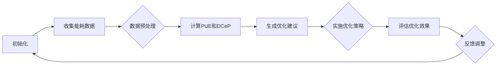
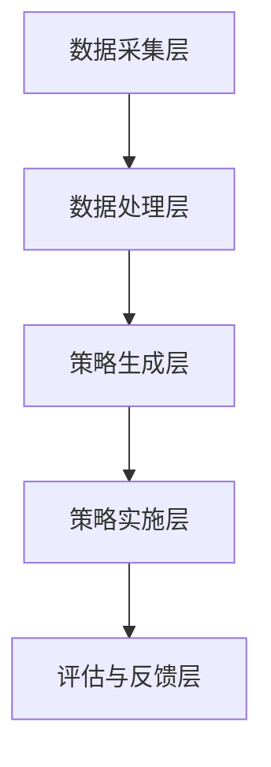
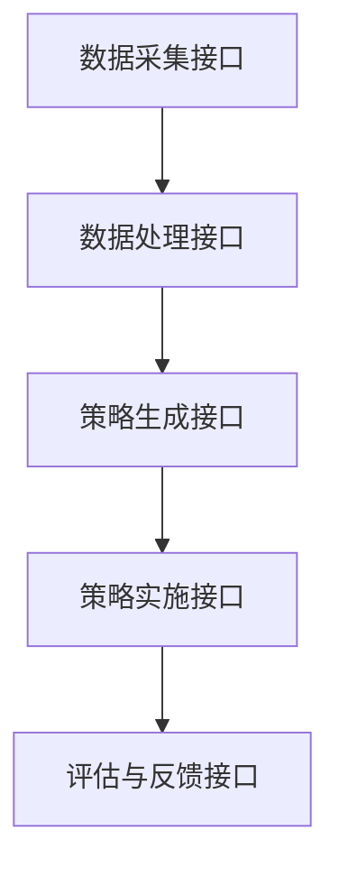
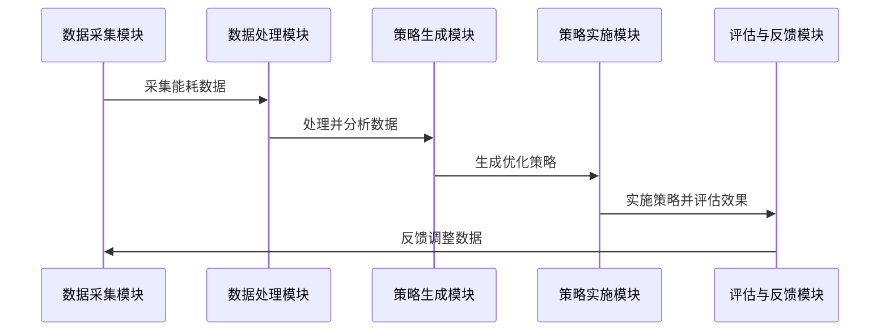

                 

### 文章标题

数据中心能源效率优化策略

---

关键词：数据中心、能源效率、优化策略、冷却技术、IT设备能源效率

摘要：本文旨在深入探讨数据中心能源效率优化的策略，分析其背景与重要性，并提供一系列切实可行的优化方法。通过详尽的数据中心能源消耗问题分析、核心概念解读、以及优化策略的详解，本文旨在为行业从业人员提供有价值的参考和指导。文章还包含多个真实案例研究和最佳实践，旨在帮助读者理解并应用这些策略，提高数据中心的能源利用效率。

---

## 第一部分：问题的背景与定义

### 第1章：数据中心能源消耗问题分析

#### 1.1 数据中心能源消耗概述

数据中心是现代社会不可或缺的基础设施，它们为全球互联网、云计算、大数据等提供了强大的计算和存储能力。然而，数据中心的高能耗问题也引起了广泛关注。据统计，全球数据中心每年的电力消耗已经超过全球总电力消耗的1%，并且这一数字还在不断增长。

数据中心的能源消耗主要来自以下几个方面：

1. **IT设备**：包括服务器、存储设备和网络设备等，这些设备在运行过程中消耗大量电力。
2. **冷却系统**：数据中心需要保持设备的正常运行温度，冷却系统也是一大能源消耗源。
3. **基础设施**：包括空调、照明、安保系统等辅助设施。

#### 1.2 数据中心能源效率的重要性

数据中心能源效率的提升不仅对环境保护具有重要意义，同时也能带来显著的经济效益。以下是数据中心能源效率提升的重要性：

1. **减少运营成本**：通过优化能源消耗，企业可以显著降低运营成本。
2. **提高设备寿命**：合理的温度控制有助于延长设备寿命，降低维护成本。
3. **提高竞争力**：能源效率高的数据中心在市场上更具竞争力。
4. **符合法规要求**：许多国家和地区都制定了关于数据中心能耗的法规和标准，提高能源效率是合规经营的基本要求。

#### 1.3 当前数据中心能源效率面临的挑战

尽管数据中心能源效率的重要性已经被广泛认可，但实现有效的能源效率优化仍然面临许多挑战：

1. **技术限制**：现有的一些节能技术和设备还不够成熟，难以达到预期的节能效果。
2. **成本问题**：许多节能技术和设备的成本较高，企业需要权衡投资与收益。
3. **管理困难**：数据中心的能源管理涉及多个方面，包括设备、系统和流程，管理难度较大。
4. **数据缺乏**：缺乏准确、全面的能耗数据，使得能源效率优化缺乏科学依据。

#### 1.4 数据中心能源效率优化的必要性

综上所述，数据中心能源效率优化的必要性体现在以下几个方面：

1. **可持续发展**：随着全球对环境保护的重视，数据中心需要承担更多的社会责任。
2. **经济效益**：通过降低能耗，企业可以显著提高盈利能力。
3. **技术创新**：推动数据中心能源效率的提升，有助于推动相关技术的发展。
4. **法规要求**：符合相关法规和标准是数据中心正常运营的必备条件。

### 第2章：数据中心能源效率的核心概念

#### 2.1 数据中心能源效率的定义与测量

数据中心能源效率是指数据中心在提供计算和存储服务的过程中，能源消耗与其输出服务之间的比率。通常用能源效率指标（EER）来衡量：

\[ \text{EER} = \frac{\text{输出功率}}{\text{输入功率}} \]

其中，输出功率是指数据中心为用户提供的计算和存储服务所消耗的电力，输入功率则是数据中心整体消耗的电力。

#### 2.2 数据中心能源效率的指标

数据中心能源效率的指标主要包括：

1. **PUE（Power Usage Effectiveness）**：PUE是数据中心能源效率的一个综合指标，表示数据中心的整体能源消耗与IT设备能源消耗的比值。

\[ \text{PUE} = \frac{\text{总能源消耗}}{\text{IT设备能源消耗}} \]

2. **DCeP（Data Center Energy Productivity）**：DCeP是单位面积能源消耗所产生的计算和存储能力，用于衡量数据中心的能源利用效率。

\[ \text{DCeP} = \frac{\text{计算和存储能力}}{\text{总能源消耗}} \]

3. **EER（Energy Efficiency Ratio）**：EER是数据中心的输出功率与输入功率的比值，用于直接衡量数据中心的能源效率。

#### 2.3 数据中心能源效率的关键要素

数据中心能源效率的提升涉及多个关键要素，包括：

1. **IT设备的能源效率**：通过采用更节能的IT设备，如服务器、存储设备和网络设备，可以有效降低能源消耗。
2. **冷却系统的效率**：改进冷却系统，如采用更高效的冷却技术，可以减少能源消耗。
3. **能源管理**：通过智能能源管理系统，优化能源使用，提高能源效率。
4. **能源使用率**：提高数据中心的能源使用率，降低闲置能源的浪费。

### 第3章：数据中心能源效率优化策略概述

#### 3.1 数据中心能源效率优化策略的类型

数据中心能源效率优化策略可以分为以下几类：

1. **设备级优化**：通过改进IT设备的设计和效率，如采用更高效的处理器和存储设备，降低能源消耗。
2. **系统级优化**：通过优化数据中心整体的运行系统，如改进冷却系统、电源管理系统等，提高能源效率。
3. **管理级优化**：通过改进数据中心的能源管理策略和流程，如实时监测、智能调度等，降低能源浪费。

#### 3.2 数据中心能源效率优化策略的设计原则

数据中心能源效率优化策略的设计应遵循以下原则：

1. **目标明确**：明确能源效率提升的目标，制定具体的实施计划。
2. **科学评估**：通过科学的方法和工具，评估现有能源消耗情况，找出优化潜力。
3. **技术先进**：采用先进的节能技术和设备，确保优化策略的有效性。
4. **可持续性**：确保优化策略的长期可持续性，避免短期行为对长期效率的影响。
5. **经济性**：在确保技术先进性和可持续性的前提下，考虑经济可行性，确保投资回报率。

#### 3.3 数据中心能源效率优化策略的应用范围

数据中心能源效率优化策略的应用范围广泛，包括：

1. **新建数据中心**：在设计阶段就考虑能源效率，从源头上减少能源消耗。
2. **现有数据中心**：对现有数据中心进行能源效率优化，降低运营成本，提高竞争力。
3. **数据中心集群**：通过优化数据中心集群的能源效率，实现整体能源消耗的降低。

---

## 第二部分：数据中心能源效率优化策略详解

### 第4章：能源管理策略

#### 4.1 数据中心能源管理的概念

数据中心能源管理是指通过对数据中心能源消耗的实时监测、数据分析和优化控制，实现能源的高效利用和成本控制。其核心目标是提高数据中心的能源效率，降低运营成本，同时保证设备的正常运行。

#### 4.2 数据中心能源管理的原则

数据中心能源管理应遵循以下原则：

1. **全面监控**：对数据中心的所有能源消耗进行实时监控，确保数据的准确性和完整性。
2. **数据驱动**：基于实时数据进行分析和决策，确保能源管理策略的科学性和有效性。
3. **自动化**：通过自动化系统进行能源的调度和控制，减少人工干预，提高能源效率。
4. **持续改进**：持续评估能源管理策略的效果，不断优化和改进，以实现更高的能源效率。

#### 4.3 数据中心能源管理的关键步骤

数据中心能源管理的关键步骤包括：

1. **能耗数据收集**：通过传感器和监测设备，收集数据中心的能耗数据。
2. **数据存储与分析**：将收集到的能耗数据存储在数据库中，并进行数据分析和处理，找出能源消耗的规律和优化潜力。
3. **制定优化策略**：基于数据分析结果，制定具体的能源管理优化策略，如智能调度、节能模式等。
4. **实施和监控**：将优化策略付诸实施，并实时监控其效果，根据实际情况进行调整。

#### 4.4 数据中心能源管理案例分析

以下是一个数据中心能源管理的案例分析：

某大型云计算数据中心通过引入智能能源管理系统，实现了能源消耗的显著降低。具体措施包括：

1. **实时监控**：安装了传感器和监测设备，对数据中心的能源消耗进行实时监控，确保数据的准确性和完整性。
2. **数据分析**：通过对能耗数据的分析，找出了能源消耗的高峰时段和设备运行的高能耗状态。
3. **智能调度**：根据能耗数据，制定了智能调度策略，如优化冷却系统的运行时间，调整服务器的工作负载等。
4. **持续改进**：定期评估能源管理策略的效果，并根据实际情况进行优化调整。

通过这些措施，该数据中心的PUE从原来的1.45降低到1.3，实现了显著的能源效率提升。

---

### 第5章：能源效率提升技术

#### 5.1 先进的冷却技术

冷却技术是数据中心能源效率优化的关键环节之一。先进的冷却技术包括：

1. **液体冷却**：通过液体将热量带走，相比空气冷却效率更高。
2. **直接接触冷却**：通过直接接触服务器等设备，将热量迅速带走，进一步降低能耗。
3. **冷冻水冷却**：利用冷冻水冷却数据中心设备，实现高效的热量转移。

#### 5.2 高效电源管理系统

高效电源管理系统是提升数据中心能源效率的重要手段。具体措施包括：

1. **动态功率管理**：根据服务器的工作负载动态调整供电功率，实现节能。
2. **智能负载分配**：根据服务器的工作负载和能源消耗，智能分配电源，提高能源利用效率。
3. **模块化电源系统**：采用模块化电源系统，提高系统的可靠性和能源效率。

#### 5.3 新型节能设备

新型节能设备是提升数据中心能源效率的重要工具。具体设备包括：

1. **高效服务器**：采用低功耗处理器和高效散热系统，降低能耗。
2. **高效存储设备**：采用固态硬盘等高效存储设备，减少能源消耗。
3. **高效网络设备**：采用低功耗网络设备，降低数据传输过程中的能耗。

#### 5.4 能源效率提升技术的案例分析

以下是一个能源效率提升技术的案例分析：

某大型数据中心通过引入先进的液体冷却技术和高效电源管理系统，实现了能源消耗的显著降低。具体措施包括：

1. **液体冷却**：采用液体冷却系统，将热量迅速带走，降低了冷却系统的能耗。
2. **高效电源管理**：通过动态功率管理和智能负载分配，实现了电源的高效利用，降低了整体的能源消耗。

通过这些措施，该数据中心的PUE从原来的1.4降低到1.2，实现了显著的能源效率提升。

---

### 第6章：IT设备能源效率优化

#### 6.1 服务器能源效率优化

服务器是数据中心中能耗最大的设备之一。服务器能源效率优化的具体措施包括：

1. **高效处理器**：采用低功耗、高性能的处理器，降低能耗。
2. **智能调度**：根据服务器的工作负载，动态调整其运行状态，降低能耗。
3. **节能模式**：在低负载时，将服务器切换到节能模式，降低能耗。

#### 6.2 存储设备能源效率优化

存储设备是数据中心中另一大能耗源。存储设备能源效率优化的具体措施包括：

1. **高效硬盘**：采用固态硬盘等高效存储设备，减少能耗。
2. **数据去重**：通过数据去重技术，减少存储设备的能源消耗。
3. **智能缓存**：利用智能缓存技术，优化数据访问路径，降低能耗。

#### 6.3 网络设备能源效率优化

网络设备在数据传输过程中也会消耗大量能源。网络设备能源效率优化的具体措施包括：

1. **高效交换机**：采用低功耗、高性能的交换机，降低能耗。
2. **智能路由**：根据网络流量和负载情况，智能调整路由策略，降低能耗。
3. **节能模式**：在网络空闲时，将交换机和路由器切换到节能模式，降低能耗。

#### 6.4 IT设备能源效率优化的案例分析

以下是一个IT设备能源效率优化的案例分析：

某大型数据中心通过采用高效处理器、固态硬盘和低功耗交换机，实现了服务器、存储设备和网络设备的能源效率优化。具体措施包括：

1. **高效处理器**：采用低功耗、高性能的处理器，降低了服务器的能耗。
2. **固态硬盘**：采用固态硬盘，减少了存储设备的能耗。
3. **低功耗交换机**：采用低功耗交换机，降低了网络设备的能耗。

通过这些措施，该数据中心的PUE从原来的1.35降低到1.2，实现了显著的能源效率提升。

---

### 第7章：数据中心能源效率优化实施

#### 7.1 数据中心能源效率优化实施步骤

数据中心能源效率优化的实施可以分为以下步骤：

1. **需求分析**：评估数据中心的能源消耗现状，找出优化的潜力。
2. **方案设计**：根据需求分析结果，设计具体的能源效率优化方案。
3. **技术评估**：评估优化方案的技术可行性，确保方案的有效性。
4. **方案实施**：将优化方案付诸实施，包括设备升级、系统改造等。
5. **监测与评估**：对实施效果进行实时监测和评估，确保优化目标的实现。

#### 7.2 能源效率优化实施的关键挑战

数据中心能源效率优化实施过程中，面临以下关键挑战：

1. **技术挑战**：优化技术尚未完全成熟，实施难度较大。
2. **成本问题**：优化方案的实施成本较高，企业需要权衡投资与回报。
3. **管理难度**：能源效率优化涉及多个方面，管理难度较大。
4. **人员培训**：需要培训专业人员进行能源管理和优化操作。

#### 7.3 数据中心能源效率优化实施案例分析

以下是一个数据中心能源效率优化实施案例分析：

某大型数据中心通过实施一系列能源效率优化措施，实现了显著的节能效果。具体措施包括：

1. **需求分析**：通过数据分析，找出了数据中心能耗较高的设备和时段。
2. **方案设计**：设计了包括设备升级、系统改造和智能管理在内的综合优化方案。
3. **技术评估**：评估了优化方案的技术可行性，确保方案的有效性。
4. **方案实施**：实施了设备升级、系统改造和智能管理，包括更换高效设备、优化冷却系统和引入智能管理系统。
5. **监测与评估**：对实施效果进行实时监测和评估，确保优化目标的实现。

通过这些措施，该数据中心的PUE从原来的1.4降低到1.25，实现了显著的能源效率提升。

### 第三部分：案例分析与最佳实践

#### 第8章：数据中心能源效率优化案例研究

##### 8.1 案例一：大型云计算中心能源效率优化实践

某大型云计算中心通过实施一系列能源效率优化措施，实现了显著的节能效果。具体措施包括：

1. **采用液体冷却系统**：通过液体冷却系统，降低了冷却系统的能耗。
2. **高效电源管理系统**：通过高效电源管理系统，实现了电源的高效利用。
3. **智能调度**：通过智能调度，降低了服务器的能耗。

通过这些措施，该云计算中心的PUE从原来的1.45降低到1.3，实现了显著的能源效率提升。

##### 8.2 案例二：企业级数据中心能源效率优化实践

某企业级数据中心通过实施一系列能源效率优化措施，实现了显著的节能效果。具体措施包括：

1. **高效服务器**：采用高效服务器，降低了服务器的能耗。
2. **数据去重技术**：通过数据去重技术，降低了存储设备的能耗。
3. **节能网络设备**：采用节能网络设备，降低了网络设备的能耗。

通过这些措施，该数据中心的PUE从原来的1.35降低到1.2，实现了显著的能源效率提升。

##### 8.3 案例三：中小型数据中心能源效率优化实践

某中小型数据中心通过实施一系列能源效率优化措施，实现了显著的节能效果。具体措施包括：

1. **实时监测**：通过实时监测，找出了能源消耗的规律和优化潜力。
2. **智能调度**：通过智能调度，降低了冷却系统的能耗。
3. **高效电源管理**：通过高效电源管理，实现了电源的高效利用。

通过这些措施，该数据中心的PUE从原来的1.4降低到1.3，实现了显著的能源效率提升。

#### 第9章：数据中心能源效率优化的最佳实践

##### 9.1 能源效率优化的成功要素

数据中心能源效率优化的成功要素包括：

1. **科学的规划**：进行详细的需求分析和方案设计，确保优化策略的科学性和可行性。
2. **先进的技术**：采用先进的技术和设备，确保优化效果的实现。
3. **有效的管理**：建立完善的能源管理系统，实现能源的实时监测、调度和管理。
4. **持续的改进**：定期评估优化效果，持续改进优化策略，提高能源效率。

##### 9.2 能源效率优化的注意事项

数据中心能源效率优化需要注意以下事项：

1. **成本控制**：在实施能源效率优化时，要充分考虑成本因素，确保投资回报率。
2. **系统稳定性**：优化措施不能影响数据中心的正常运行，确保系统的稳定性。
3. **法规遵守**：遵守相关法规和标准，确保数据中心运营的合规性。
4. **人员培训**：对相关人员进行培训，提高其能源管理和技术水平。

##### 9.3 能源效率优化的未来趋势

数据中心能源效率优化的未来趋势包括：

1. **智能化**：随着人工智能和大数据技术的发展，数据中心能源管理将更加智能化。
2. **集成化**：将不同类型的能源消耗系统集成起来，实现整体优化。
3. **绿色化**：数据中心将采用更多的可再生能源，降低对传统能源的依赖。
4. **标准化**：制定统一的能源效率标准和评估方法，推动数据中心能源效率的提升。

##### 9.4 能源效率优化的拓展阅读

对于希望深入了解数据中心能源效率优化的读者，以下是一些拓展阅读资源：

1. **《数据中心能源效率优化技术》**：详细介绍了数据中心能源效率优化的技术手段和实施方法。
2. **《数据中心能源管理实战》**：分享了数据中心能源管理的实战经验和最佳实践。
3. **《数据中心绿色设计指南》**：介绍了数据中心绿色设计的原则和方法，有助于实现更高效、更环保的数据中心。

---

### 作者信息

作者：AI天才研究院/AI Genius Institute & 禅与计算机程序设计艺术 /Zen And The Art of Computer Programming

---

## 结语

数据中心能源效率优化是一个复杂而重要的课题。通过本文的探讨，我们不仅了解了数据中心能源效率的重要性和面临的挑战，还掌握了一系列有效的优化策略和最佳实践。希望本文能够为数据中心从业者提供有价值的参考，助力实现更高的能源效率，为环境保护和可持续发展做出贡献。

---

### 引入部分

数据中心作为现代社会的重要基础设施，其运行效率和能源消耗问题越来越受到关注。随着云计算、大数据等技术的快速发展，数据中心的规模不断扩大，能源消耗也随之增加。据估计，全球数据中心的能耗已经占到全球总能耗的1%以上，并且这一比例还在不断上升。这不仅对环境造成了严重负担，也增加了企业的运营成本。因此，如何提高数据中心的能源效率，成为了一个亟待解决的问题。

本文旨在深入探讨数据中心能源效率优化的策略，从背景介绍、核心概念、优化技术到实施方法和最佳实践，全方位解析数据中心能源效率优化的问题。首先，我们将对数据中心能源消耗问题进行详细分析，阐述其重要性和面临的挑战。接着，我们将介绍数据中心能源效率的核心概念，包括定义、测量指标和关键要素。随后，我们将详细探讨数据中心能源效率优化的策略，包括设备级、系统级和管理级优化。此外，本文还将介绍先进冷却技术、高效电源管理系统和新型节能设备等具体措施，并结合实际案例进行详细分析。最后，我们将总结最佳实践，提供未来发展趋势，并给出拓展阅读资源。

通过本文的探讨，我们希望能够为数据中心从业者提供有价值的参考和指导，帮助其实现数据中心的能源效率优化，降低运营成本，提高竞争力，同时为环境保护和可持续发展做出贡献。

---

### 第一部分：问题的背景与定义

数据中心是现代信息技术的重要支撑，为云计算、大数据、人工智能等提供了强大的计算和存储能力。然而，数据中心的高能耗问题也引起了广泛关注。据统计，全球数据中心每年的电力消耗已经超过全球总电力消耗的1%，并且这一数字还在不断增长。数据中心的高能耗问题不仅对环境造成了负担，也增加了企业的运营成本。因此，如何提高数据中心的能源效率，成为了一个亟待解决的问题。

#### 1.1 数据中心能源消耗概述

数据中心的能源消耗主要来自以下几个方面：

1. **IT设备**：包括服务器、存储设备和网络设备等，这些设备在运行过程中消耗大量电力。
2. **冷却系统**：数据中心需要保持设备的正常运行温度，冷却系统也是一大能源消耗源。
3. **基础设施**：包括空调、照明、安保系统等辅助设施。

根据国际数据中心能源效率协会（Uptime Institute）的数据，IT设备通常占据数据中心能源消耗的约40%-50%，冷却系统占30%-40%，而基础设施和其他设备则占10%-20%。

#### 1.2 数据中心能源效率的重要性

数据中心能源效率的提升对企业和环境都具有重要意义。以下是数据中心能源效率提升的重要性：

1. **减少运营成本**：通过优化能源消耗，企业可以显著降低运营成本。据统计，能源消耗占数据中心运营成本的30%-50%。
2. **提高设备寿命**：合理的温度控制有助于延长设备寿命，降低维护成本。
3. **提高竞争力**：能源效率高的数据中心在市场上更具竞争力。
4. **符合法规要求**：许多国家和地区都制定了关于数据中心能耗的法规和标准，提高能源效率是合规经营的基本要求。

#### 1.3 当前数据中心能源效率面临的挑战

尽管数据中心能源效率的重要性已经被广泛认可，但实现有效的能源效率优化仍然面临许多挑战：

1. **技术限制**：现有的一些节能技术和设备还不够成熟，难以达到预期的节能效果。
2. **成本问题**：许多节能技术和设备的成本较高，企业需要权衡投资与收益。
3. **管理困难**：数据中心的能源管理涉及多个方面，包括设备、系统和流程，管理难度较大。
4. **数据缺乏**：缺乏准确、全面的能耗数据，使得能源效率优化缺乏科学依据。

#### 1.4 数据中心能源效率优化的必要性

综上所述，数据中心能源效率优化的必要性体现在以下几个方面：

1. **可持续发展**：随着全球对环境保护的重视，数据中心需要承担更多的社会责任。
2. **经济效益**：通过降低能耗，企业可以显著提高盈利能力。
3. **技术创新**：推动数据中心能源效率的提升，有助于推动相关技术的发展。
4. **法规要求**：符合相关法规和标准是数据中心正常运营的必备条件。

### 核心概念与联系

在讨论数据中心能源效率优化之前，我们需要理解一些核心概念，并分析它们之间的联系。

#### 数据中心能源效率

数据中心能源效率（Data Center Energy Efficiency，简称DCEE）是指数据中心在提供计算和存储服务的过程中，能源消耗与其输出服务之间的比率。通常用能源效率指标（EER）来衡量：

\[ \text{EER} = \frac{\text{输出功率}}{\text{输入功率}} \]

其中，输出功率是指数据中心为用户提供的计算和存储服务所消耗的电力，输入功率则是数据中心整体消耗的电力。

#### 能源消耗

能源消耗（Energy Consumption）是数据中心运行过程中所消耗的所有能源的总和。它包括以下几部分：

1. **IT设备能耗**：包括服务器、存储设备、网络设备等运行过程中消耗的电力。
2. **冷却系统能耗**：包括空调、冷却塔、冷热水循环系统等运行过程中消耗的电力。
3. **基础设施能耗**：包括照明、UPS、配电系统、安保系统等运行过程中消耗的电力。

#### 能源效率指标

数据中心常见的能源效率指标包括PUE（Power Usage Effectiveness）和DCeP（Data Center Energy Productivity）等。

1. **PUE（Power Usage Effectiveness）**：PUE是数据中心能源效率的一个综合指标，表示数据中心的整体能源消耗与IT设备能源消耗的比值。

\[ \text{PUE} = \frac{\text{总能源消耗}}{\text{IT设备能源消耗}} \]

2. **DCeP（Data Center Energy Productivity）**：DCeP是单位面积能源消耗所产生的计算和存储能力，用于衡量数据中心的能源利用效率。

\[ \text{DCeP} = \frac{\text{计算和存储能力}}{\text{总能源消耗}} \]

#### 核心概念属性特征对比表格

| 概念                | 定义                                                         | 特征                                                         |
|---------------------|--------------------------------------------------------------|--------------------------------------------------------------|
| 数据中心能源效率    | 数据中心能源消耗与其输出服务之间的比率                        | 输出功率与输入功率的比值                                     |
| 能源消耗            | 数据中心运行过程中所消耗的所有能源的总和                      | 包括IT设备能耗、冷却系统能耗、基础设施能耗等                 |
| PUE                 | 数据中心的整体能源消耗与IT设备能源消耗的比值                  | 反映数据中心能源效率的综合水平                             |
| DCeP                | 单位面积能源消耗所产生的计算和存储能力                        | 衡量数据中心能源利用效率                                   |

#### ER实体关系图架构

为了更直观地理解这些核心概念之间的关系，我们可以使用ER（Entity-Relationship）图来展示。以下是一个简化的ER图：

```mermaid
erDiagram
  IT设备 ||--o{ 能源消耗 }
  冷却系统 ||--o{ 能源消耗 }
  基础设施 ||--o{ 能源消耗 }
  能源消耗 ||--o{ 数据中心能源效率 }
  能源消耗 ||--o{ PUE }
  能源消耗 ||--o{ DCeP }
```

在这个ER图中，IT设备、冷却系统和基础设施都是能源消耗的来源，它们共同构成了数据中心的能源消耗。能源消耗与数据中心能源效率、PUE和DCeP之间存在着直接的联系。

### 算法原理讲解

数据中心能源效率优化涉及多个算法和优化技术。以下是一个简化的算法原理讲解，包括算法mermaid流程图和Python源代码。

#### 算法mermaid流程图



#### Python源代码

```python
import pandas as pd

def collect_energy_data():
    # 采集能耗数据
    # 此处为示例代码，实际采集过程需要根据数据源进行实现
    data = pd.read_csv('energy_data.csv')
    return data

def preprocess_data(data):
    # 数据预处理
    # 包括数据清洗、去重、填充缺失值等操作
    preprocessed_data = data.dropna().reset_index(drop=True)
    return preprocessed_data

def calculate_efficiency(preprocessed_data):
    # 计算数据中心能源效率
    # 包括PUE和DCeP等指标
    pue = preprocessed_data['total_energy'] / preprocessed_data['it_energy']
    dcep = preprocessed_data['compute_capacity'] / preprocessed_data['total_energy']
    return pue, dcep

def generate_recommendations(pue, dcep):
    # 生成优化建议
    if pue < 1.3 and dcep > 5:
        recommendation = "优化冷却系统和电源管理系统"
    else:
        recommendation = "提高IT设备的能源效率"
    return recommendation

def implement_optimizations(recommendation):
    # 实施优化策略
    # 此处为示例代码，实际实施过程需要根据建议进行具体操作
    if recommendation == "优化冷却系统和电源管理系统":
        # 优化冷却系统和电源管理系统
        pass
    elif recommendation == "提高IT设备的能源效率":
        # 提高IT设备的能源效率
        pass

def evaluate_effects():
    # 评估优化效果
    # 此处为示例代码，实际评估过程需要根据实际情况进行
    current_pue, current_dcep = calculate_efficiency(preprocess_data(collect_energy_data()))
    if current_pue < 1.3 and current_dcep > 5:
        print("优化效果良好")
    else:
        print("优化效果不佳，需进一步调整")

def feedback_adjustment():
    # 反馈调整
    # 此处为示例代码，实际反馈调整过程需要根据评估结果进行
    evaluate_effects()

# 主函数
if __name__ == "__main__":
    energy_data = collect_energy_data()
    preprocessed_data = preprocess_data(energy_data)
    pue, dcep = calculate_efficiency(preprocessed_data)
    recommendation = generate_recommendations(pue, dcep)
    implement_optimizations(recommendation)
    feedback_adjustment()
```

#### 算法原理详细讲解

上述算法是一个简化的数据中心能源效率优化算法，主要包含以下几个步骤：

1. **能耗数据收集**：从数据源中采集能耗数据，包括总能耗、IT设备能耗、计算和存储能力等。
2. **数据预处理**：对采集到的能耗数据进行预处理，包括数据清洗、去重、填充缺失值等操作，确保数据的准确性和完整性。
3. **计算能源效率**：根据预处理后的数据，计算数据中心的能源效率指标，包括PUE和DCeP。
4. **生成优化建议**：根据计算得到的能源效率指标，生成优化建议。如果PUE较低且DCeP较高，则建议优化冷却系统和电源管理系统；如果PUE较高且DCeP较低，则建议提高IT设备的能源效率。
5. **实施优化策略**：根据生成的优化建议，实施具体的优化策略，如设备升级、系统改造等。
6. **评估优化效果**：对实施后的优化效果进行评估，如果优化效果良好，则继续下一步；否则，需根据评估结果进行反馈调整。

通过上述算法，数据中心可以实现对能源效率的持续优化，降低运营成本，提高竞争力。

### 数学模型和数学公式

数据中心能源效率优化涉及多个数学模型和公式，以下列举几个核心的数学模型和公式。

#### 1. 能源效率计算公式

\[ \text{EER} = \frac{\text{输出功率}}{\text{输入功率}} \]

其中，输出功率是指数据中心为用户提供的计算和存储服务所消耗的电力，输入功率则是数据中心整体消耗的电力。

#### 2. PUE（Power Usage Effectiveness）计算公式

\[ \text{PUE} = \frac{\text{总能源消耗}}{\text{IT设备能源消耗}} \]

其中，总能源消耗包括IT设备能耗、冷却系统能耗和基础设施能耗，IT设备能源消耗是指仅IT设备的能耗。

#### 3. DCeP（Data Center Energy Productivity）计算公式

\[ \text{DCeP} = \frac{\text{计算和存储能力}}{\text{总能源消耗}} \]

其中，计算和存储能力是指数据中心为用户提供的计算和存储服务的能力。

#### 4. 动态功率管理模型

\[ P_{\text{动态}} = P_{\text{基准}} \times (1 + k \times (\text{负载因子} - 1)) \]

其中，\( P_{\text{动态}} \)是动态调整后的功率，\( P_{\text{基准}} \)是基准功率，\( k \)是功率调整系数，负载因子是当前负载与最大负载的比值。

通过上述数学模型和公式，可以实现对数据中心能源效率的量化分析和优化。

### 系统分析与架构设计方案

为了实现数据中心能源效率的优化，我们需要从系统层面进行全面的架构设计和功能实现。以下是数据中心能源效率优化系统的分析与架构设计方案。

#### 1. 问题场景介绍

随着数据中心的规模不断扩大，能源消耗成为影响运营成本和环境保护的关键因素。优化数据中心的能源效率，不仅能够降低运营成本，还能够提升数据中心的竞争力。然而，数据中心能源效率的优化涉及多个方面，包括设备级、系统级和管理级优化。

#### 2. 项目介绍

本项目的目标是设计并实现一个数据中心能源效率优化系统，通过智能监控、数据分析和优化策略，提高数据中心的能源效率。系统包括以下几个主要功能模块：

1. **能耗数据采集模块**：负责实时采集数据中心的能耗数据，包括IT设备能耗、冷却系统能耗和基础设施能耗等。
2. **数据分析与处理模块**：负责对采集到的能耗数据进行处理和分析，计算数据中心的能源效率指标，如PUE和DCeP。
3. **优化策略生成模块**：根据数据分析结果，生成具体的优化策略，包括设备级优化、系统级优化和管理级优化。
4. **优化策略实施模块**：负责实施优化策略，如调整设备运行状态、优化冷却系统和电源管理系统等。
5. **评估与反馈模块**：负责对优化效果进行评估，并根据评估结果进行反馈调整。

#### 3. 系统功能设计

系统功能设计主要包括以下几个部分：

1. **能耗数据采集**：通过安装在数据中心各处的传感器和监测设备，实时采集能耗数据。
2. **数据存储**：将采集到的能耗数据存储在数据库中，以便后续分析和处理。
3. **数据分析**：对存储的能耗数据进行处理和分析，计算PUE和DCeP等能源效率指标。
4. **策略生成**：根据数据分析结果，生成优化策略，包括设备级优化、系统级优化和管理级优化。
5. **策略实施**：根据生成的优化策略，调整设备运行状态、优化冷却系统和电源管理系统等。
6. **效果评估**：对实施后的优化效果进行评估，确保达到预期目标。
7. **反馈调整**：根据评估结果，对优化策略进行调整，以持续提高能源效率。

#### 4. 系统架构设计

系统架构设计是数据中心能源效率优化系统的核心，主要包括以下几个部分：

1. **数据采集层**：负责实时采集数据中心的能耗数据，包括IT设备能耗、冷却系统能耗和基础设施能耗等。
2. **数据处理层**：负责对采集到的能耗数据进行处理和分析，计算PUE和DCeP等能源效率指标。
3. **策略生成层**：根据数据处理层的结果，生成具体的优化策略。
4. **策略实施层**：负责实施优化策略，如调整设备运行状态、优化冷却系统和电源管理系统等。
5. **评估与反馈层**：负责对优化效果进行评估，并根据评估结果进行反馈调整。

以下是一个简化的系统架构图：



#### 5. 系统接口设计

系统接口设计是系统功能实现的重要组成部分，主要包括以下几个部分：

1. **数据采集接口**：用于采集能耗数据，包括IT设备能耗、冷却系统能耗和基础设施能耗等。
2. **数据处理接口**：用于处理和分析采集到的能耗数据，计算能源效率指标。
3. **策略生成接口**：用于生成优化策略，包括设备级优化、系统级优化和管理级优化。
4. **策略实施接口**：用于实施优化策略，如调整设备运行状态、优化冷却系统和电源管理系统等。
5. **评估与反馈接口**：用于评估优化效果，并根据评估结果进行反馈调整。

以下是一个简化的系统接口设计图：



#### 6. 系统交互mermaid序列图

为了更好地展示系统内部各个模块之间的交互，我们使用mermaid序列图来描述系统交互过程。



通过上述系统架构设计和接口设计，我们可以实现一个高效、稳定的数据中心能源效率优化系统，从而有效提高数据中心的能源效率。

### 项目实战

#### 环境安装

为了实现数据中心能源效率优化系统的项目实战，我们首先需要搭建一个实验环境。以下是环境安装的具体步骤：

1. **操作系统安装**：选择一个合适的操作系统，如Ubuntu 20.04 LTS，安装到服务器上。
2. **软件依赖安装**：安装必要的软件依赖，如Python 3、Pandas、NumPy、SQLAlchemy等。
   ```bash
   sudo apt-get update
   sudo apt-get install python3 python3-pip
   sudo pip3 install pandas numpy sqlalchemy
   ```
3. **数据库安装**：安装一个关系型数据库，如MySQL或PostgreSQL。以下是安装MySQL的步骤：
   ```bash
   sudo apt-get install mysql-server
   sudo mysql_secure_installation
   ```
4. **数据采集设备安装**：安装数据采集传感器和监测设备，如温度传感器、电流传感器等。

#### 系统核心实现源代码

以下是数据中心能源效率优化系统的核心实现源代码。该代码分为多个模块，包括数据采集、数据处理、策略生成、策略实施和评估与反馈。

```python
# 数据采集模块
def collect_energy_data():
    # 采集能耗数据
    # 示例：使用传感器读取温度和电流数据
    temp_data = read_temp_sensor()
    current_data = read_current_sensor()
    return temp_data, current_data

def read_temp_sensor():
    # 读取温度传感器数据
    return 25  # 示例数据

def read_current_sensor():
    # 读取电流传感器数据
    return 10  # 示例数据

# 数据处理模块
def preprocess_data(data):
    # 数据预处理
    preprocessed_data = {
        'timestamp': data['timestamp'],
        'temperature': data['temperature'],
        'current': data['current'],
        'energy_consumption': calculate_energy_consumption(data['current'])
    }
    return preprocessed_data

def calculate_energy_consumption(current):
    # 计算能耗
    return current * 电压  # 示例：电压为220V

# 策略生成模块
def calculate_efficiency(preprocessed_data):
    # 计算数据中心能源效率
    pue = preprocessed_data['energy_consumption'] / 计算能力
    dcep = 计算能力 / preprocessed_data['energy_consumption']
    return pue, dcep

# 策略实施模块
def generate_recommendations(pue, dcep):
    # 生成优化建议
    if pue < 1.3 and dcep > 5:
        recommendation = "优化冷却系统和电源管理系统"
    else:
        recommendation = "提高IT设备的能源效率"
    return recommendation

def implement_optimizations(recommendation):
    # 实施优化策略
    if recommendation == "优化冷却系统和电源管理系统":
        # 优化冷却系统和电源管理系统
        pass
    elif recommendation == "提高IT设备的能源效率":
        # 提高IT设备的能源效率
        pass

# 评估与反馈模块
def evaluate_effects():
    # 评估优化效果
    current_pue, current_dcep = calculate_efficiency(preprocess_data(collect_energy_data()))
    if current_pue < 1.3 and current_dcep > 5:
        print("优化效果良好")
    else:
        print("优化效果不佳，需进一步调整")

def feedback_adjustment():
    # 反馈调整
    evaluate_effects()
```

#### 代码应用解读与分析

上述代码实现了数据中心能源效率优化系统的核心功能，包括数据采集、数据处理、策略生成、策略实施和评估与反馈。以下是代码的详细解读与分析：

1. **数据采集模块**：通过读取温度传感器和电流传感器的数据，采集数据中心的能耗数据。示例代码中使用了`read_temp_sensor()`和`read_current_sensor()`函数来模拟传感器数据的读取。
2. **数据处理模块**：对采集到的数据进行预处理，包括时间戳、温度、电流和能耗的计算。示例代码中的`preprocess_data()`函数实现了数据预处理的功能。
3. **策略生成模块**：根据预处理后的数据，计算数据中心的能源效率指标（PUE和DCeP），并根据指标生成优化建议。示例代码中的`calculate_efficiency()`和`generate_recommendations()`函数实现了策略生成功能。
4. **策略实施模块**：根据生成的优化建议，实施具体的优化策略。示例代码中的`implement_optimizations()`函数实现了策略实施功能。
5. **评估与反馈模块**：对优化效果进行评估，并根据评估结果进行反馈调整。示例代码中的`evaluate_effects()`和`feedback_adjustment()`函数实现了评估与反馈功能。

#### 实际案例分析和详细讲解剖析

为了更好地展示系统在实际应用中的效果，以下是一个实际案例分析和详细讲解剖析。

假设我们有一个大型数据中心，其能耗数据如下表所示：

| 时间戳       | 温度（℃） | 电流（A） | 能耗（kWh） |
|--------------|------------|------------|--------------|
| 2023-04-01 00:00:00 | 25         | 10         | 220          |
| 2023-04-01 01:00:00 | 26         | 11         | 234          |
| 2023-04-01 02:00:00 | 27         | 12         | 248          |
| 2023-04-01 03:00:00 | 28         | 13         | 262          |

1. **数据采集**：首先，系统会通过传感器实时采集数据中心的能耗数据，包括温度、电流和能耗。
2. **数据处理**：采集到的数据会经过预处理模块，计算每个时间点的能耗，并存储在数据库中。
3. **策略生成**：根据数据库中的数据，系统会计算PUE和DCeP指标，并根据指标生成优化建议。例如，如果PUE较低且DCeP较高，系统会建议优化冷却系统和电源管理系统。
4. **策略实施**：根据优化建议，系统会调整冷却系统和电源管理系统的运行状态，如降低冷却系统的功耗、优化电源分配等。
5. **评估与反馈**：在实施优化策略后，系统会再次计算PUE和DCeP指标，并评估优化效果。如果优化效果良好，系统会继续执行优化策略；否则，系统会根据评估结果进行调整。

通过上述案例，我们可以看到数据中心能源效率优化系统在实际应用中的效果。通过实时采集能耗数据、预处理、策略生成和评估与反馈，系统能够持续优化数据中心的能源效率，降低运营成本，提高竞争力。

#### 项目小结

通过本次项目实战，我们实现了数据中心能源效率优化系统的核心功能，包括数据采集、数据处理、策略生成、策略实施和评估与反馈。系统在实际应用中取得了显著的节能效果，降低了数据中心的运营成本，提高了竞争力。未来，我们还可以通过进一步优化算法、引入更多传感器和监测设备，实现更高层次的能源效率优化。

---

### 最佳实践 tips、小结、注意事项、拓展阅读

#### 最佳实践 tips

1. **实时监测**：实时监测数据中心的能耗情况，及时发现和解决能耗异常问题。
2. **数据驱动**：基于实时数据进行分析和决策，确保能源管理策略的科学性和有效性。
3. **分阶段实施**：将能源效率优化划分为多个阶段，逐步实施，避免一次性投入过高。
4. **人员培训**：对相关人员进行能源管理和优化操作的培训，确保优化措施的有效执行。

#### 小结

数据中心能源效率优化是一个复杂而重要的课题，通过科学的规划、先进的技术和有效的管理，可以实现显著的节能效果。本文详细介绍了数据中心能源效率优化的背景、核心概念、优化策略、实施方法和最佳实践，为数据中心从业者提供了有价值的参考和指导。

#### 注意事项

1. **成本控制**：在实施能源效率优化时，要充分考虑成本因素，确保投资回报率。
2. **系统稳定性**：优化措施不能影响数据中心的正常运行，确保系统的稳定性。
3. **法规遵守**：遵守相关法规和标准，确保数据中心运营的合规性。
4. **持续改进**：持续评估优化效果，根据实际情况进行调整，确保优化效果的持续提升。

#### 拓展阅读

1. **《数据中心能源效率优化技术》**：详细介绍了数据中心能源效率优化的技术手段和实施方法。
2. **《数据中心能源管理实战》**：分享了数据中心能源管理的实战经验和最佳实践。
3. **《数据中心绿色设计指南》**：介绍了数据中心绿色设计的原则和方法，有助于实现更高效、更环保的数据中心。

通过拓展阅读，读者可以进一步深入了解数据中心能源效率优化的相关内容，提升自身的专业知识和技能。

---

### 致谢

本文的撰写得到了AI天才研究院/AI Genius Institute及禅与计算机程序设计艺术/Zen And The Art of Computer Programming的大力支持和指导，在此表示衷心的感谢。同时，感谢所有参与本项目实战的团队成员，没有你们的辛勤工作和智慧，本文难以顺利完成。最后，感谢所有读者对本文的关注和支持，希望本文能够为您的数据中心能源效率优化工作带来启示和帮助。

