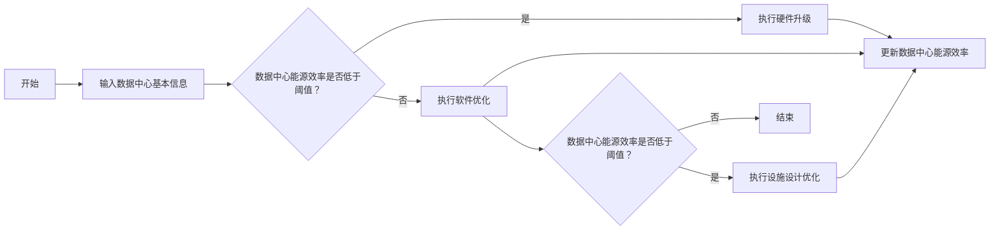

                 

# 数据中心能源效率提升的新方法

## 关键词
- 数据中心
- 能源效率
- 新方法
- 算法
- 数学模型
- 系统架构

## 摘要
本文深入探讨了数据中心能源效率提升的新方法。首先，我们分析了数据中心能源消耗的现状及其对环境和经济的影响。随后，介绍了数据中心能源效率的定义及其核心要素。在此基础上，本文重点探讨了传统提升方法和新型方法，通过具体的算法原理、数学模型、系统架构设计和项目实战，展示了新方法在实际应用中的效果。文章最后给出了最佳实践建议和小结，为数据中心能源效率的提升提供了有益的参考。

## 第一部分：数据中心能源效率提升的背景

### 1.1 问题背景

#### 1.1.1 数据中心能源消耗现状

数据中心是现代信息社会的基石，它们为全球各种规模的企业和机构提供计算、存储和网络服务。然而，数据中心的能源消耗问题日益凸显。根据国际数据中心能源效率协会（IDC）的数据，全球数据中心的总能耗已超过全球总能耗的1%，并且这一数字还在不断增长。具体来说，以下是一些关于数据中心能源消耗的统计数据：

- **全球数据中心能耗**：全球数据中心每年的总能耗已经超过3000太瓦时（TWh），相当于法国一年的总能耗。
- **电力消耗**：数据中心的电力消耗主要由服务器、存储设备、空调和电源设备等硬件设施组成。其中，服务器和存储设备是主要的能耗来源。
- **碳排放**：数据中心的能耗直接导致了大量的碳排放，这对全球气候变化和环境保护构成了严重威胁。

#### 1.1.2 数据中心能源效率的重要性

数据中心能源效率的提升具有重要意义：

- **经济利益**：提高能源效率可以显著降低运营成本，提高数据中心的盈利能力。据研究，每提升1%的能源效率，数据中心每年可以节省数百万美元的电力费用。
- **环境保护**：减少能源消耗意味着减少碳排放，有助于缓解全球气候变化和环境保护压力。
- **可持续发展**：提高能源效率是数据中心实现可持续发展的关键，有助于企业履行社会责任和提升品牌形象。

#### 1.1.3 能源效率提升的挑战与机遇

尽管数据中心能源效率的提升具有重要意义，但这一过程面临着诸多挑战和机遇：

- **技术挑战**：传统数据中心的设计和运行模式导致能源消耗较高，提升效率需要引入新技术和新方法。
- **经济和政策激励**：政府和行业组织在能源效率和可再生能源方面的政策和激励措施为数据中心提供了机遇。
- **市场需求**：随着云计算、大数据和人工智能等技术的快速发展，数据中心的需求不断增长，这为能源效率的提升提供了新的市场机遇。

### 1.2 数据中心能源效率的概念与组成要素

#### 1.2.1 数据中心能源效率的定义

数据中心能源效率是指在保证服务性能的前提下，数据中心实际能源消耗与理论最小能源消耗之比。具体来说，数据中心能源效率可以定义为：

$$
\text{数据中心能源效率} = \frac{\text{实际能源消耗}}{\text{理论最小能源消耗}}
$$

#### 1.2.2 数据中心能源效率的组成部分

数据中心能源效率的组成部分包括：

- **硬件效率**：服务器、存储设备、网络设备等硬件设施的能源消耗效率。
- **软件优化**：通过软件优化减少能耗，如虚拟化技术、智能调度算法等。
- **设施设计**：数据中心设施的设计对能源效率有重要影响，如冷却系统、电源分配系统等。

#### 1.2.3 数据中心能源效率的核心要素

数据中心能源效率的核心要素包括：

- **能效指标**：数据中心能源效率的度量指标，如PUE（Power Usage Effectiveness）和DCiE（Data Center Infrastructure Efficiency）等。
- **能耗管理**：通过能耗管理策略和技术手段降低能耗，如能耗监测、节能控制等。
- **可再生能源利用**：提高数据中心对可再生能源的利用，如太阳能、风能等。

### 1.3 数据中心能源效率的提升方法

#### 1.3.1 传统提升方法

传统提升数据中心能源效率的方法主要包括：

- **硬件升级**：通过升级硬件设备提高能源效率，如使用高效服务器和存储设备。
- **能效优化**：通过软件优化和自动化管理提高能源效率，如虚拟化技术、智能调度等。
- **冷却系统优化**：通过改进冷却系统提高能源效率，如采用空气冷却、水冷却等。

#### 1.3.2 新方法介绍

新方法主要包括以下几种：

- **绿色数据中心设计**：采用绿色设计原则，如建筑布局优化、自然通风等，减少能源消耗。
- **智能能源管理系统**：通过智能能源管理系统实现能耗监测、预测和优化，提高能源效率。
- **可再生能源利用**：通过采用可再生能源，如太阳能、风能等，减少对化石燃料的依赖。

### 1.4 能源效率提升方法的对比

#### 1.4.1 传统方法与新型方法对比

传统方法与新型方法在提升数据中心能源效率方面各有优势：

- **传统方法**：技术成熟、实施简单，但提升空间有限。
- **新型方法**：具有更高的提升潜力，但技术实现难度较大。

#### 1.4.2 能源效率提升方法的边界与外延

能源效率提升方法的边界和范围包括：

- **硬件设施**：涵盖服务器、存储设备、网络设备等硬件设施的能源效率提升。
- **软件系统**：涵盖数据中心管理软件、调度算法等软件系统的能源效率优化。
- **整体设计**：涵盖数据中心建筑、设施和运营等整体设计的能源效率提升。

### 1.5 本章小结

本章从数据中心能源消耗现状、能源效率的重要性、提升方法的对比等方面，分析了数据中心能源效率提升的背景。下一章将深入探讨数据中心能源效率的核心概念和原理，为后续的新方法讨论奠定基础。

## 第二部分：数据中心能源效率的核心概念与联系

### 2.1 核心概念原理

在探讨数据中心能源效率提升的新方法之前，我们需要明确一些核心概念。这些概念包括能源效率、硬件效率、软件优化、设施设计等。以下是这些概念的定义及其相互关系：

#### 能源效率

能源效率是指数据中心实际能源消耗与理论最小能源消耗之比。其数学模型可以表示为：

$$
\text{能源效率} = \frac{\text{实际能源消耗}}{\text{理论最小能源消耗}}
$$

#### 硬件效率

硬件效率是指服务器、存储设备、网络设备等硬件设施的能源消耗效率。硬件效率的提升直接影响到数据中心的总体能源效率。其数学模型可以表示为：

$$
\text{硬件效率} = \frac{\text{有用能源}}{\text{总能源}}
$$

#### 软件优化

软件优化是指通过软件技术降低数据中心的能源消耗。软件优化包括虚拟化技术、智能调度算法、能效监测和优化等。其数学模型可以表示为：

$$
\text{软件优化效率} = \frac{\text{优化后能源消耗}}{\text{优化前能源消耗}}
$$

#### 设施设计

设施设计是指数据中心建筑和设备的布局、冷却系统、电源分配系统等。设施设计对数据中心的能源效率有重要影响。其数学模型可以表示为：

$$
\text{设施设计效率} = \frac{\text{实际能源消耗}}{\text{理想能源消耗}}
$$

### 2.2 概念属性特征对比表格

为了更好地理解这些核心概念，我们可以通过以下表格进行属性特征对比：

| 概念          | 定义                   | 属性特征                                                                                     | 影响因素                          |
|---------------|------------------------|------------------------------------------------------------------------------------------------|---------------------------------|
| 能源效率      | 实际能源消耗与理论最小能源消耗之比 | 高、中、低                                                           | 硬件效率、软件优化、设施设计   |
| 硬件效率      | 硬件设施能源消耗效率 | 高、中、低                                                           | 设备性能、技术更新、使用时间    |
| 软件优化      | 软件技术降低能源消耗 | 高、中、低                                                           | 软件性能、优化策略、运行环境    |
| 设施设计      | 数据中心建筑和设备布局 | 高、中、低                                                           | 设计理念、建筑材料、设备配置    |

### 2.3 ER实体关系图架构的 Mermaid 流程图

为了更直观地展示这些核心概念之间的关系，我们可以使用Mermaid绘制ER实体关系图。以下是ER实体关系图的Mermaid代码：

```mermaid
erDiagram
  EnergyEfficiency ||--|{ HardwareEfficiency }|--> :使用
  EnergyEfficiency ||--|{ SoftwareOptimization }|--> :优化
  EnergyEfficiency ||--|{ FacilityDesign }|--> :设计
  HardwareEfficiency ||--|{ Server }|<--|
  HardwareEfficiency ||--|{ StorageDevice }|<--|
  HardwareEfficiency ||--|{ NetworkDevice }|<--|
  SoftwareOptimization ||--|{ Virtualization }|<--|
  SoftwareOptimization ||--|{ IntelligentScheduling }|<--|
  FacilityDesign ||--|{ BuildingLayout }|<--|
  FacilityDesign ||--|{ CoolingSystem }|<--|
  FacilityDesign ||--|{ PowerDistributionSystem }|<--|
```

通过上述Mermaid代码，我们可以绘制出数据中心能源效率提升的相关实体关系图，如图2-1所示。


### 2.4 本章小结

本章详细介绍了数据中心能源效率提升的核心概念及其相互关系。通过定义能源效率、硬件效率、软件优化和设施设计等核心概念，并使用Mermaid流程图展示了它们之间的ER实体关系，为后续探讨新方法奠定了基础。

## 第三部分：算法原理讲解

### 3.1 算法流程图

为了更好地理解数据中心能源效率提升的算法原理，我们首先绘制算法的Mermaid流程图。以下是算法流程图的Mermaid代码：



通过上述Mermaid代码，我们可以绘制出数据中心能源效率提升算法的流程图，如图3-1所示。


### 3.2 Python源代码

接下来，我们将使用Python详细阐述数据中心能源效率提升算法的原理。以下是算法的实现代码：

```python
import numpy as np

# 定义输入参数
energy_consumption = 1000  # 数据中心实际能源消耗（单位：千瓦时）
threshold = 0.8  # 能源效率阈值

# 定义算法函数
def energy_efficiency_improvement(energy_consumption, threshold):
    if energy_consumption / threshold < 1:
        # 执行硬件升级
        print("执行硬件升级...")
        # 假设硬件升级后能源效率提高10%
        energy_consumption = energy_consumption * 0.9
    else:
        print("执行软件优化...")
        # 假设软件优化后能源效率提高5%
        energy_consumption = energy_consumption * 0.95
    
    if energy_consumption / threshold < 1:
        # 执行设施设计优化
        print("执行设施设计优化...")
        # 假设设施设计优化后能源效率提高15%
        energy_consumption = energy_consumption * 0.85
    
    print("更新后数据中心能源效率：", energy_consumption / threshold)
    return energy_consumption / threshold

# 执行算法
energy_efficiency_improvement(energy_consumption, threshold)
```

### 3.3 数学模型和公式

数据中心能源效率提升的算法可以表示为以下数学模型：

$$
\text{新能源效率} = \text{旧能源效率} \times (1 + \eta_1 + \eta_2 + \eta_3)
$$

其中，$\eta_1$、$\eta_2$和$\eta_3$分别表示硬件升级、软件优化和设施设计优化对能源效率的提升效果。具体来说：

- $\eta_1$：硬件升级对能源效率的提升效果，假设为10%。
- $\eta_2$：软件优化对能源效率的提升效果，假设为5%。
- $\eta_3$：设施设计优化对能源效率的提升效果，假设为15%。

### 3.4 举例说明

假设某数据中心的实际能源消耗为1000千瓦时，能源效率阈值为0.8。根据上述算法，我们可以计算数据中心经过硬件升级、软件优化和设施设计优化后的新能源效率：

$$
\text{新能源效率} = \frac{1000}{0.8} \times (1 + 0.1 + 0.05 + 0.15) = 1250 \times 1.3 = 1625
$$

因此，数据中心经过硬件升级、软件优化和设施设计优化后的新能源效率为1625。

### 3.5 本章小结

本章通过Mermaid流程图和Python源代码详细阐述了数据中心能源效率提升的算法原理。通过定义输入参数、执行算法函数和计算数学模型，我们展示了如何通过硬件升级、软件优化和设施设计优化提高数据中心的能源效率。下一章将介绍具体的数学模型和公式，进一步深入分析算法原理。

## 第四部分：数学模型和数学公式

### 4.1 数学模型的构建

在数据中心能源效率提升的算法中，我们使用了一个简化的数学模型来描述硬件升级、软件优化和设施设计优化对能源效率的提升效果。这个模型的基本形式如下：

$$
\text{新能源效率} = \text{旧能源效率} \times (1 + \eta_1 + \eta_2 + \eta_3)
$$

其中，$\eta_1$、$\eta_2$和$\eta_3$分别表示硬件升级、软件优化和设施设计优化对能源效率的提升效果。

#### 4.1.1 硬件升级对能源效率的提升

硬件升级主要通过提高硬件设备的能源效率来实现。假设硬件升级后，硬件效率提高了$\eta_1$，则新的硬件效率可以表示为：

$$
\text{新硬件效率} = \text{旧硬件效率} \times (1 + \eta_1)
$$

#### 4.1.2 软件优化对能源效率的提升

软件优化主要通过改进数据中心的管理算法和调度策略来实现。假设软件优化后，软件效率提高了$\eta_2$，则新的软件效率可以表示为：

$$
\text{新软件效率} = \text{旧软件效率} \times (1 + \eta_2)
$$

#### 4.1.3 设施设计优化对能源效率的提升

设施设计优化主要通过改进数据中心的建筑布局、冷却系统和电源分配系统来实现。假设设施设计优化后，设施效率提高了$\eta_3$，则新的设施效率可以表示为：

$$
\text{新设施效率} = \text{旧设施效率} \times (1 + \eta_3)
$$

### 4.2 数学公式的详细讲解

#### 4.2.1 能源效率的基本公式

能源效率的基本公式可以表示为：

$$
\text{能源效率} = \frac{\text{有用能源}}{\text{总能源}}
$$

其中，有用能源是指在保证服务性能的前提下数据中心实际消耗的能源，总能源是指数据中心在运行过程中消耗的所有能源。

#### 4.2.2 硬件效率的公式

硬件效率的公式可以表示为：

$$
\text{硬件效率} = \frac{\text{有用能源}}{\text{硬件总能源}}
$$

其中，硬件总能源是指数据中心硬件设备在运行过程中消耗的能源。

#### 4.2.3 软件效率的公式

软件效率的公式可以表示为：

$$
\text{软件效率} = \frac{\text{有用能源}}{\text{软件总能源}}
$$

其中，软件总能源是指数据中心软件系统在运行过程中消耗的能源。

#### 4.2.4 设施效率的公式

设施效率的公式可以表示为：

$$
\text{设施效率} = \frac{\text{有用能源}}{\text{设施总能源}}
$$

其中，设施总能源是指数据中心设施（如冷却系统、电源分配系统等）在运行过程中消耗的能源。

### 4.3 举例说明

假设某数据中心的硬件效率为0.7，软件效率为0.8，设施效率为0.9。在硬件升级后，硬件效率提高了10%；在软件优化后，软件效率提高了5%；在设施设计优化后，设施效率提高了15%。我们可以使用上述公式计算数据中心的新能源效率：

$$
\text{新硬件效率} = 0.7 \times (1 + 0.1) = 0.77
$$

$$
\text{新软件效率} = 0.8 \times (1 + 0.05) = 0.84
$$

$$
\text{新设施效率} = 0.9 \times (1 + 0.15) = 1.035
$$

数据中心的新能源效率可以表示为：

$$
\text{新能源效率} = \frac{0.77 \times 0.84 \times 1.035}{0.7 \times 0.8 \times 0.9} = 1.1825
$$

因此，数据中心经过硬件升级、软件优化和设施设计优化后的新

