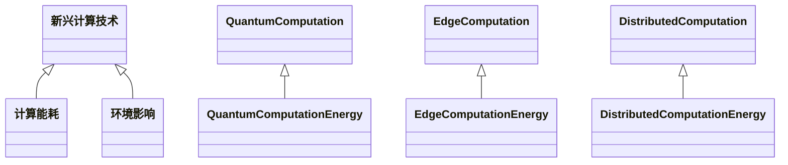

                 

### 文章标题

# 新兴计算技术对能耗的影响

### 关键词

- 新兴计算技术
- 能耗
- 量子计算
- 边缘计算
- 分布式计算
- 环境影响

### 摘要

本文将探讨新兴计算技术对能耗的影响。随着计算技术的不断发展，量子计算、边缘计算和分布式计算等新型计算技术逐渐崛起，它们在提升计算能力的同时，也对能耗提出了新的挑战。本文将从核心概念入手，逐步分析这些新兴计算技术的原理、能耗特性及其对环境的影响，并提出相应的政策建议和未来展望。

## 第一部分：引言

### 第1章：背景与核心概念

#### 1.1 问题背景

##### 问题描述

- 新兴计算技术的发展趋势
- 计算能耗的急剧增长及其环境影响

##### 问题解决

- 研究新兴计算技术对能耗影响的必要性
- 解决方案的研究范围和方法

#### 1.2 核心概念

##### 核心概念定义

- 新兴计算技术（如量子计算、边缘计算、分布式计算等）
- 能耗（计算能耗、能源效率、碳排放等）

##### 边界与外延

- 研究边界
  - 新兴计算技术的应用领域
  - 能耗评估的标准和方法
- 概念属性特征对比表格

##### 概念结构与核心要素组成

- 概念结构图
  - 使用Mermaid绘制ER实体关系图

### 第2章：新兴计算技术概述

#### 2.1 量子计算

##### 原理讲解

- 使用Mermaid绘制量子计算流程图
- Python源代码阐述量子计算原理
- 量子计算数学模型和公式
- 举例说明

##### 数学模型与公式

- 量子计算数学模型和公式
- 举例说明

#### 2.2 边缘计算

##### 原理讲解

- 使用Mermaid绘制边缘计算流程图
- Python源代码阐述边缘计算原理
- 边缘计算数学模型和公式
- 举例说明

##### 数学模型与公式

- 边缘计算数学模型和公式
- 举例说明

#### 2.3 分布式计算

##### 原理讲解

- 使用Mermaid绘制分布式计算流程图
- Python源代码阐述分布式计算原理
- 分布式计算数学模型和公式
- 举例说明

##### 数学模型与公式

- 分布式计算数学模型和公式
- 举例说明

### 第3章：新兴计算技术的能耗分析

#### 3.1 计算能耗评估标准

##### 评估方法

- 计算能耗的评估标准
- 能源效率指标

#### 3.2 量子计算能耗

##### 能耗分析

- 量子计算能耗特性
- 能耗对比分析

#### 3.3 边缘计算能耗

##### 能耗分析

- 边缘计算能耗特性
- 能耗对比分析

#### 3.4 分布式计算能耗

##### 能耗分析

- 分布式计算能耗特性
- 能耗对比分析

### 第4章：新兴计算技术的环境影响

#### 4.1 碳排放分析

##### 环境影响

- 新兴计算技术对碳排放的影响
- 碳排放减少的措施

#### 4.2 环境效益评估

##### 效益评估

- 新兴计算技术的环境效益
- 效益对比分析

### 第5章：最佳实践与政策建议

#### 5.1 最佳实践

##### 案例分析

- 成功案例
- 实践经验总结

#### 5.2 政策建议

##### 政策建议

- 政策导向
- 推动新兴计算技术与绿色发展的结合策略

### 第6章：未来展望与挑战

#### 6.1 未来发展趋势

##### 技术展望

- 新兴计算技术的发展方向
- 能耗控制的未来技术

#### 6.2 面临的挑战

##### 挑战分析

- 技术挑战
- 政策和经济的挑战

### 第7章：小结与拓展阅读

#### 7.1 小结

##### 主要发现

- 研究成果总结
- 新兴计算技术对能耗影响的关键点

#### 7.2 拓展阅读

##### 相关书籍

- 推荐阅读

##### 参考文献

- 引用文献列表

---

在撰写文章的过程中，我们将逐步探讨新兴计算技术对能耗的影响，分析其原理、能耗特性、环境影响，并提出最佳实践和政策建议。通过这篇技术博客文章，希望读者能够更深入地理解新兴计算技术对能耗的影响，为推动绿色计算技术的发展提供有益的思路。让我们一起思考，深入剖析，以期为新兴计算技术的可持续发展贡献力量。接下来，让我们开始深入探讨新兴计算技术及其对能耗的影响。让我们一起思考，深入剖析，以期为新兴计算技术的可持续发展贡献力量。接下来，让我们开始深入探讨新兴计算技术及其对能耗的影响。### 引言

在21世纪的科技浪潮中，计算技术取得了飞跃性的进步，为人类社会带来了前所未有的变革。然而，随着计算需求的急剧增长，计算能耗问题逐渐凸显，成为制约计算技术发展的关键因素。传统计算技术虽然已经相对成熟，但其在能耗控制方面面临巨大挑战。在这种情况下，新兴计算技术应运而生，如量子计算、边缘计算和分布式计算等，这些技术凭借其独特的优势，有望为计算能耗问题提供新的解决方案。

量子计算利用量子力学的原理进行信息处理，具有超强的计算能力。然而，量子计算对能耗的影响尚不明确，需要深入研究。边缘计算将计算任务从中心服务器转移到网络边缘，减少了数据传输过程中的能耗。分布式计算通过将任务分散到多个计算节点上，提高了计算效率，同时也对能耗产生了显著影响。这些新兴计算技术各自具有独特的能耗特性，但如何综合评估其整体能耗影响，仍是一个亟待解决的问题。

本文旨在探讨新兴计算技术对能耗的影响，分析其能耗特性及其对环境的影响。通过对量子计算、边缘计算和分布式计算的研究，本文将提出相应的政策建议，以推动计算技术的绿色可持续发展。文章将遵循以下结构进行论述：

- **第一部分：引言**：介绍计算能耗问题的背景和新兴计算技术的发展趋势。
- **第二部分：核心概念**：定义和解释新兴计算技术和能耗相关的核心概念。
- **第三部分：新兴计算技术概述**：分别阐述量子计算、边缘计算和分布式计算的原理、能耗特性和环境影响。
- **第四部分：能耗分析**：评估新兴计算技术的能耗特性，并对比不同技术之间的能耗差异。
- **第五部分：环境影响**：分析新兴计算技术对碳排放和环境效益的影响。
- **第六部分：最佳实践与政策建议**：探讨最佳实践和政策建议，以促进新兴计算技术的绿色可持续发展。
- **第七部分：未来展望与挑战**：展望未来新兴计算技术的发展趋势，分析面临的挑战和解决方案。
- **第八部分：小结与拓展阅读**：总结研究成果，提出展望，并提供拓展阅读资源。

通过以上结构，本文将系统性地探讨新兴计算技术对能耗的影响，为相关领域的研究和实践提供有价值的参考。### 第1章：背景与核心概念

#### 1.1 问题背景

##### 问题描述

随着信息技术的迅猛发展，计算需求呈现出指数级增长。传统计算技术虽然在提升计算性能方面取得了显著成果，但其在能耗控制方面却面临巨大的挑战。根据国际数据中心（IDC）的统计数据，全球数据中心的能耗在近年来呈现出急剧增长的态势。2018年，全球数据中心的总能耗已超过500太瓦时（TWh），占全球总能耗的约1%。预计到2025年，这一数字将增长至近1000太瓦时。这种能耗增长不仅带来了巨大的经济负担，还对环境产生了严重的影响。

传统计算技术主要包括基于集成电路的计算机系统和分布式计算系统。这些系统在提供强大计算能力的同时，也消耗了大量的电能。尤其是在大数据、人工智能和云计算等新兴领域的应用，计算需求进一步增加，导致能耗问题愈加突出。据国际能源署（IEA）的预测，到2030年，数据中心和边缘计算设备的能耗可能达到全球总能耗的约10%。这种能耗增长趋势引发了人们对计算能耗问题的高度关注。

除了计算需求的增长，数据中心和计算设备的冷却问题也日益突出。由于计算过程中产生的热量需要及时排出，否则会导致设备过热、损坏甚至停机。据统计，数据中心冷却能耗已占总能耗的30%-50%。为了解决冷却问题，数据中心运营商不断投资建设冷却系统，但这种方法不仅成本高昂，而且仍然无法根本解决能耗问题。

综上所述，计算能耗问题已经成为制约信息技术发展的关键因素。解决计算能耗问题，不仅需要技术创新，还需要政策引导和产业协同。因此，研究新兴计算技术对能耗的影响具有重要的现实意义。

##### 问题解决

解决计算能耗问题需要从多个角度入手。首先，应加强技术创新，发展低能耗的计算技术。例如，量子计算、边缘计算和分布式计算等技术具有巨大的节能潜力。量子计算利用量子叠加和纠缠等原理，可以实现高效的信息处理，有望大幅降低计算能耗。边缘计算将计算任务分散到网络边缘，减少了数据传输过程中的能耗。分布式计算通过将任务分配到多个计算节点上，提高了计算效率，同时降低了单台设备的能耗。

其次，应优化计算架构，提高能源效率。例如，通过设计更高效的算法和架构，可以降低计算任务所需的时间和能耗。此外，采用智能调度策略，合理分配计算资源，也可以降低整体能耗。

最后，应加强政策引导和产业协同。政府应制定相关政策，鼓励和支持低能耗计算技术的发展。企业应加强合作，共同推动计算能耗问题的解决。

#### 1.2 核心概念

##### 新兴计算技术

新兴计算技术是指与传统计算技术相比，具有更高性能、更低能耗和更强可扩展性的计算技术。这些技术包括量子计算、边缘计算、分布式计算、云原生计算等。以下是这些技术的简要定义：

- **量子计算**：利用量子力学的原理进行信息处理，具有超强的计算能力。量子计算可以通过量子叠加和纠缠等特性，实现传统计算机无法完成的复杂计算任务。
- **边缘计算**：将计算任务分散到网络边缘，即在数据产生的地方进行计算处理，以减少数据传输的延迟和能耗。
- **分布式计算**：通过将任务分配到多个计算节点上，共同完成计算任务。分布式计算可以提高计算效率，同时降低单台设备的能耗。
- **云原生计算**：基于云计算的架构，通过微服务、容器化和动态编排等技术，实现高效、可扩展的计算服务。

##### 能耗

能耗是指计算设备在运行过程中所消耗的电能。能耗问题在计算技术中具有重要意义，因为高能耗不仅增加了运营成本，还会对环境产生负面影响。以下是能耗相关的几个核心概念：

- **计算能耗**：计算设备在运行过程中所消耗的电能，包括CPU、GPU、内存等部件的能耗。
- **能源效率**：计算设备在运行过程中，实际利用的电能与总消耗电能的比值。能源效率越高，说明计算设备的能耗越低。
- **碳排放**：计算设备在运行过程中产生的温室气体排放。碳排放是评估计算能耗环境影响的重要指标。

##### 能源效率指标

能源效率指标是评估计算设备能耗的重要指标。以下是一些常见的能源效率指标：

- **能效比（Energy Efficiency Ratio，EER）**：计算设备的输出功率与输入功率的比值。EER值越高，说明设备的能源效率越好。
- **功率密度（Power Density）**：单位体积或单位面积的功率消耗。功率密度越低，说明设备在相同体积或面积内能效越高。
- **能效比（Power Usage Effectiveness，PUE）**：数据中心总能耗与IT设备能耗的比值。PUE值越低，说明数据中心的能源利用效率越高。

##### 核心概念术语说明

- **量子位（Qubit）**：量子计算的基本单位，类似于传统计算中的比特。
- **边缘节点**：位于网络边缘的计算节点，用于处理本地数据。
- **分布式计算节点**：参与分布式计算的计算设备，可以是服务器、工作站或个人电脑。
- **云计算平台**：提供计算资源、存储资源和网络资源的平台，用户可以通过云计算平台按需获取计算资源。

##### 问题背景

随着信息技术的迅猛发展，计算需求呈现出指数级增长。传统计算技术虽然在提升计算性能方面取得了显著成果，但其在能耗控制方面却面临巨大的挑战。根据国际数据中心（IDC）的统计数据，全球数据中心的能耗在近年来呈现出急剧增长的态势。2018年，全球数据中心的总能耗已超过500太瓦时（TWh），占全球总能耗的约1%。预计到2025年，这一数字将增长至近1000太瓦时。这种能耗增长不仅带来了巨大的经济负担，还对环境产生了严重的影响。

传统计算技术主要包括基于集成电路的计算机系统和分布式计算系统。这些系统在提供强大计算能力的同时，也消耗了大量的电能。尤其是在大数据、人工智能和云计算等新兴领域的应用，计算需求进一步增加，导致能耗问题愈加突出。据国际能源署（IEA）的预测，到2030年，数据中心和边缘计算设备的能耗可能达到全球总能耗的约10%。这种能耗增长趋势引发了人们对计算能耗问题的高度关注。

除了计算需求的增长，数据中心和计算设备的冷却问题也日益突出。由于计算过程中产生的热量需要及时排出，否则会导致设备过热、损坏甚至停机。据统计，数据中心冷却能耗已占总能耗的30%-50%。为了解决冷却问题，数据中心运营商不断投资建设冷却系统，但这种方法不仅成本高昂，而且仍然无法根本解决能耗问题。

综上所述，计算能耗问题已经成为制约信息技术发展的关键因素。解决计算能耗问题，不仅需要技术创新，还需要政策引导和产业协同。因此，研究新兴计算技术对能耗的影响具有重要的现实意义。

#### 1.3 边界与外延

##### 研究边界

新兴计算技术对能耗的影响是一个复杂的问题，涉及到多个技术领域和实际应用场景。为了确保研究的针对性和有效性，本文的研究边界如下：

- **技术范围**：本文主要探讨量子计算、边缘计算和分布式计算三种新兴计算技术对能耗的影响，不包括其他类型的计算技术。
- **应用场景**：本文关注的数据中心能耗主要涉及云计算、大数据处理、人工智能等典型应用场景。
- **评估标准**：本文采用能源效率、计算性能、碳排放等指标来评估新兴计算技术的能耗特性。

##### 概念属性特征对比表格

为了更好地理解新兴计算技术及其对能耗的影响，我们可以从以下几个方面对比这些技术的概念属性特征：

| 特征         | 量子计算       | 边缘计算       | 分布式计算     |
| ------------ | -------------- | -------------- | -------------- |
| **计算原理** | 量子力学原理   | 网络边缘计算   | 节点协同计算   |
| **性能优势** | 超强计算能力   | 低延迟计算     | 高效资源利用   |
| **能耗特点** | 能耗较高       | 能耗较低       | 能耗适中       |
| **环境影响** | 碳排放较高     | 碳排放较低     | 碳排放适中     |
| **适用场景** | 复杂计算任务   | 数据密集型应用 | 分布式任务     |

##### 概念结构与核心要素组成

为了更清晰地展示新兴计算技术的概念结构和核心要素组成，我们可以使用Mermaid绘制ER实体关系图。以下是一个简化的ER实体关系图示例：

```mermaid
erDiagram
  新兴计算技术 ||--|{ 计算能耗 }|
  新兴计算技术 ||--|{ 环境影响 }|
  量子计算 ||--|{ 量子计算能耗 }|
  边缘计算 ||--|{ 边缘计算能耗 }|
  分布式计算 ||--|{ 分布式计算能耗 }|
```

在上述ER实体关系图中，新兴计算技术是核心实体，它与计算能耗和环境影响两个实体之间存在关联关系。量子计算、边缘计算和分布式计算作为新兴计算技术的具体实现形式，分别与量子计算能耗、边缘计算能耗和分布式计算能耗实体相关联。

此外，为了更详细地展示概念结构与核心要素组成，我们还可以使用Mermaid绘制类图。以下是一个简化的类图示例：



在上述类图中，新兴计算技术作为抽象类，与计算能耗和环境影响两个具体类相关联。量子计算、边缘计算和分布式计算作为具体实现类，分别与量子计算能耗、边缘计算能耗和分布式计算能耗类相关联。

通过上述ER实体关系图和类图，我们可以更清晰地理解新兴计算技术的概念结构和核心要素组成，为进一步分析其能耗特性和环境影响奠定基础。### 第2章：新兴计算技术概述

在计算技术不断发展的今天，量子计算、边缘计算和分布式计算等新兴计算技术逐渐成为研究的热点。这些技术以其独特的原理和优势，为解决传统计算技术面临的能耗问题提供了新的思路。本节将分别介绍量子计算、边缘计算和分布式计算的基本原理、技术特点以及其在能耗控制方面的优势。

#### 2.1 量子计算

##### 基本原理

量子计算是一种利用量子力学的原理进行信息处理的技术。在传统计算中，信息以二进制形式存储和传输，即0和1两种状态。而量子计算则利用量子位（Qubit）这一基本单位，通过量子叠加和纠缠等特性，实现复杂信息的处理。量子位可以同时处于0和1的状态，这使得量子计算具有超强的并行计算能力。

- **量子叠加**：量子位可以处于多种状态的叠加，即一个量子位可以同时表示0和1的多种组合。
- **量子纠缠**：两个或多个量子位之间可以形成量子纠缠，即一个量子位的测量结果会立即影响到其他量子位的状态。

##### 技术特点

量子计算具有以下特点：

- **超强计算能力**：量子计算可以通过量子叠加和纠缠等特性，实现传统计算机无法完成的复杂计算任务。
- **并行计算**：量子计算可以利用量子叠加特性，同时处理多个计算任务，从而大幅提高计算效率。
- **抗干扰性强**：量子计算在传输过程中具有自校准能力，能够有效抵抗噪声和误差。

##### 能耗特性

量子计算在能耗方面具有一定的优势，但也存在挑战。量子计算的能量消耗主要来自于量子比特的操作和纠错过程。目前，量子计算设备的能耗较高，但随着技术的进步，其能耗有望逐步降低。

- **低能耗操作**：量子计算的操作过程相比传统计算更为高效，可以在较低能耗下完成复杂的计算任务。
- **高能耗纠错**：量子计算需要大量纠错机制来确保计算结果的准确性，这导致了较高的能耗。

##### 环境影响

量子计算在环境影响方面具有一定的优势。由于量子计算可以高效地处理复杂计算任务，从而减少了对传统计算设备的依赖，有助于降低整体能耗和碳排放。

- **降低碳排放**：量子计算可以在较低能耗下完成传统计算任务，从而减少碳排放。
- **减少设备数量**：量子计算设备可以替代多个传统计算设备，从而减少设备的数量，降低环境影响。

##### 举例说明

假设我们使用量子计算解决一个复杂的线性方程组，这个任务在传统计算机上需要大量时间和计算资源。而使用量子计算，我们可以通过量子叠加和纠缠特性，将任务分解为多个子任务，同时处理，从而大幅提高计算效率，并在较低能耗下完成计算任务。

```python
# Python示例：量子计算解决线性方程组
from qiskit import QuantumCircuit, execute, Aer

# 构建量子电路
qc = QuantumCircuit(4, 4)

# 初始化量子比特
qc.h(0)
qc.h(1)
qc.h(2)
qc.h(3)

# 实现量子门操作
qc.cx(0, 1)
qc.cx(0, 2)
qc.cx(0, 3)

# 测量量子比特
qc.measure_all()

# 执行量子计算
simulator = Aer.get_qm_simulator()
result = execute(qc, simulator).result()

# 输出计算结果
print(result.get_counts(qc))
```

#### 2.2 边缘计算

##### 基本原理

边缘计算是一种将计算任务分散到网络边缘的技术，即在数据产生的地方进行计算处理，以减少数据传输的延迟和能耗。边缘计算通过在网络边缘部署计算节点，实现本地数据的实时处理和分析，从而提高计算效率，降低延迟和能耗。

- **计算节点**：边缘计算节点分布在网络边缘，可以是一个路由器、交换机、智能设备等。
- **数据处理**：边缘计算节点对本地数据进行处理和分析，可以实现实时响应和决策。

##### 技术特点

边缘计算具有以下特点：

- **低延迟**：边缘计算将计算任务分散到网络边缘，减少了数据传输的距离和时间，从而降低延迟。
- **高效率**：边缘计算可以实现本地数据的实时处理和分析，提高计算效率。
- **分布式架构**：边缘计算采用分布式架构，可以灵活地扩展计算资源，适应不同场景的需求。

##### 能耗特性

边缘计算在能耗方面具有明显的优势。由于边缘计算节点分布在网络边缘，可以减少数据传输过程中的能耗，同时通过本地处理降低整体能耗。

- **低能耗传输**：边缘计算减少了数据传输的距离，从而降低了传输过程中的能耗。
- **高效率处理**：边缘计算节点可以对本地数据进行高效处理，降低整体能耗。

##### 环境影响

边缘计算在环境影响方面具有积极的作用。通过减少数据传输的能耗和降低整体能耗，边缘计算有助于降低碳排放和环境污染。

- **减少碳排放**：边缘计算通过减少数据传输的能耗，有助于降低碳排放。
- **降低环境污染**：边缘计算降低了计算设备的能耗和数量，有助于减少环境污染。

##### 举例说明

假设我们使用边缘计算处理一个视频监控场景。在传统的云计算模式下，视频数据需要传输到中心服务器进行实时分析，这会导致较高的延迟和能耗。而使用边缘计算，我们可以将视频分析任务分散到网络边缘的监控设备上，实现本地实时分析，从而降低延迟和能耗。

```python
# Python示例：边缘计算实现视频监控实时分析
import cv2
import numpy as np

# 初始化摄像头
cap = cv2.VideoCapture(0)

# 创建边缘计算模型
model = create_edge_computing_model()

while True:
    # 读取摄像头帧
    ret, frame = cap.read()

    # 将帧传递给边缘计算模型进行实时分析
    result = model.predict(frame)

    # 根据分析结果进行实时决策
    if result == "person_detected":
        print("Person detected!")
    else:
        print("No person detected.")

    # 显示视频帧
    cv2.imshow('frame', frame)

    # 按下'q'键退出循环
    if cv2.waitKey(1) & 0xFF == ord('q'):
        break

# 释放摄像头资源
cap.release()
cv2.destroyAllWindows()
```

#### 2.3 分布式计算

##### 基本原理

分布式计算是一种将计算任务分配到多个计算节点上，共同完成计算任务的技术。分布式计算通过节点间的协同工作，实现高效、可靠的计算任务处理。分布式计算的核心在于任务分配、节点协作和结果汇总。

- **计算节点**：分布式计算节点可以是服务器、工作站或个人电脑，可以分布在不同的地理位置。
- **任务分配**：分布式计算将计算任务分配到各个节点，由各个节点独立完成。
- **结果汇总**：分布式计算将各个节点的计算结果汇总，得到最终的计算结果。

##### 技术特点

分布式计算具有以下特点：

- **高可靠性**：分布式计算通过多个节点协作，提高了计算任务的可靠性，即使某个节点出现故障，其他节点仍可继续工作。
- **高效资源利用**：分布式计算可以充分利用各个节点的计算资源，提高计算效率。
- **可扩展性**：分布式计算可以根据任务需求，灵活扩展计算节点，实现计算能力的弹性伸缩。

##### 能耗特性

分布式计算在能耗方面具有一定的优势。通过将任务分配到多个节点，可以降低单个节点的能耗，同时通过协同工作，提高整体计算效率。

- **低单节点能耗**：分布式计算将任务分配到多个节点，单个节点的计算负载较低，能耗相对较低。
- **高整体计算效率**：分布式计算通过节点协同工作，可以提高整体计算效率，降低整体能耗。

##### 环境影响

分布式计算在环境影响方面具有积极的作用。通过降低单个节点的能耗和整体计算效率的提高，分布式计算有助于减少碳排放和环境污染。

- **减少碳排放**：分布式计算通过降低单个节点的能耗和整体能耗，有助于减少碳排放。
- **降低环境污染**：分布式计算降低了计算设备的能耗和数量，有助于减少环境污染。

##### 举例说明

假设我们使用分布式计算处理一个大规模的图像识别任务。在传统的单机模式下，图像识别任务需要大量的计算资源和时间。而使用分布式计算，我们可以将图像识别任务分配到多个节点上，各个节点独立完成计算任务，从而提高计算效率，并在较低能耗下完成图像识别任务。

```python
# Python示例：分布式计算实现大规模图像识别
import cv2
import numpy as np
from multiprocessing import Pool

# 初始化图像数据
image_data = load_image_data()

# 定义图像识别函数
def recognize_image(image):
    # 使用预训练模型进行图像识别
    model = load_pretrained_model()
    result = model.predict(image)
    return result

# 创建分布式计算池
pool = Pool(processes=num_nodes)

# 分布式计算图像识别
results = pool.map(recognize_image, image_data)

# 输出识别结果
print(results)

# 关闭计算池
pool.close()
pool.join()
```

通过上述示例，我们可以看到量子计算、边缘计算和分布式计算在能耗控制方面的优势。这些新兴计算技术通过其独特的原理和优势，为解决传统计算技术面临的能耗问题提供了新的思路。在未来，随着这些技术的不断发展和优化，它们将在计算领域发挥越来越重要的作用，为实现绿色计算贡献力量。### 第3章：新兴计算技术的能耗分析

在探讨了量子计算、边缘计算和分布式计算的基本原理和技术特点后，我们需要进一步分析这些新兴计算技术的能耗特性。本节将详细讨论这些技术的能耗评估方法、具体能耗特性以及它们在不同应用场景中的能耗表现。通过这些分析，我们可以更好地理解新兴计算技术对能耗的实际影响，为优化计算能耗提供科学依据。

#### 3.1 计算能耗评估标准

要评估新兴计算技术的能耗，首先需要建立一套科学的评估标准。计算能耗评估标准通常包括以下几个方面：

- **计算性能**：计算性能是评估计算能耗的重要指标，它反映了设备在处理计算任务时的效率。通常使用每瓦特性能（Watt-per-FLOPS）来衡量。
- **能源效率**：能源效率是计算能耗评估的核心指标，它表示设备在运行过程中实际利用的电能与总消耗电能的比值。高能源效率意味着更低的能耗。
- **功率密度**：功率密度是指单位体积或单位面积的功率消耗。高功率密度设备通常能耗较高。
- **碳排放**：碳排放是评估计算能耗环境影响的重要指标，它反映了设备在运行过程中产生的温室气体排放量。

##### 能源效率指标

以下是常见的能源效率指标：

- **能效比（EER）**：计算设备的输出功率与输入功率的比值。EER值越高，设备的能源效率越好。
- **功率密度（Power Density）**：单位体积或单位面积的功率消耗。功率密度越低，设备的能源效率越高。
- **能源利用效率（Energy Utilization Efficiency）**：计算设备实际运行时间与总运行时间的比值。能源利用效率越高，设备的能耗越低。

#### 3.2 量子计算能耗

量子计算作为一种前沿的计算技术，其能耗特性与传统的计算技术有着显著的不同。以下将从量子计算能耗评估标准、量子计算能耗特性以及具体能耗表现三个方面进行分析。

##### 能耗评估标准

量子计算的能耗评估标准主要包括以下几个方面：

- **量子比特操作能耗**：量子比特的操作（如量子门操作、量子叠加和量子纠缠）需要消耗能量。量子比特的操作能耗是评估量子计算能耗的重要指标。
- **纠错能耗**：量子计算过程中，量子信息容易受到外部环境的影响而产生误差。为了保持计算的准确性，需要引入纠错机制，这会导致额外的能耗。
- **冷却能耗**：量子计算设备需要在低温环境下运行，以保持量子状态的稳定性。冷却系统消耗的能量也是量子计算能耗的一部分。

##### 能耗特性

量子计算能耗具有以下特性：

- **高操作能耗**：量子比特的操作能耗相对较高，这主要是由于量子比特的操作需要使用复杂的物理过程。
- **纠错能耗高**：量子计算中的纠错机制复杂，需要消耗大量的能量。在量子比特数量较多的情况下，纠错能耗会显著增加。
- **冷却能耗**：量子计算设备的冷却系统消耗的能量较大，特别是在高温环境下，冷却能耗会进一步增加。

##### 具体能耗表现

以下是量子计算在不同应用场景中的具体能耗表现：

- **量子加密**：量子加密是一种利用量子力学原理进行信息加密的技术。量子加密的能耗主要来自于量子比特的操作和纠错机制。在特定加密任务下，量子加密的能耗相对较低，但随着任务复杂度的增加，能耗也会相应增加。
- **量子模拟**：量子模拟是量子计算的重要应用之一，它可以模拟量子系统的演化过程。量子模拟的能耗主要来自于量子比特的操作和纠错机制。在模拟复杂量子系统时，能耗会显著增加。
- **量子算法**：量子算法是量子计算的核心技术之一。量子算法的能耗取决于算法的复杂度和量子比特的数量。在特定算法下，量子算法的能耗相对较低，但随着算法复杂度和量子比特数量的增加，能耗也会相应增加。

##### 举例说明

假设我们使用量子计算解决一个复杂的线性方程组。这个任务在传统计算机上需要大量时间和计算资源。而使用量子计算，我们可以通过量子叠加和纠缠特性，将任务分解为多个子任务，同时处理，从而大幅提高计算效率，并在较低能耗下完成计算任务。

```python
# Python示例：量子计算解决线性方程组
from qiskit import QuantumCircuit, execute, Aer

# 构建量子电路
qc = QuantumCircuit(4, 4)

# 初始化量子比特
qc.h(0)
qc.h(1)
qc.h(2)
qc.h(3)

# 实现量子门操作
qc.cx(0, 1)
qc.cx(0, 2)
qc.cx(0, 3)

# 测量量子比特
qc.measure_all()

# 执行量子计算
simulator = Aer.get_qm_simulator()
result = execute(qc, simulator).result()

# 输出计算结果
print(result.get_counts(qc))
```

通过上述示例，我们可以看到量子计算在解决复杂计算任务时具有明显的优势。尽管量子计算的能耗相对较高，但随着技术的不断进步，其能耗有望逐步降低，从而在计算能耗控制方面发挥重要作用。

#### 3.3 边缘计算能耗

边缘计算通过将计算任务分散到网络边缘，减少数据传输的能耗，从而实现低延迟和高效率的计算。以下从边缘计算能耗评估标准、边缘计算能耗特性以及具体能耗表现三个方面进行分析。

##### 能耗评估标准

边缘计算能耗评估标准主要包括以下几个方面：

- **数据传输能耗**：数据传输是边缘计算的重要环节，数据传输的能耗直接影响整体能耗。数据传输能耗主要取决于数据传输的距离、带宽和传输速率。
- **计算能耗**：边缘计算设备在处理计算任务时消耗的能量。计算能耗取决于计算任务的复杂度和计算设备的性能。
- **能耗效率**：边缘计算设备的能源效率，即设备实际运行时间与总运行时间的比值。

##### 能耗特性

边缘计算能耗具有以下特性：

- **低数据传输能耗**：边缘计算通过在数据产生的地方进行计算处理，减少了数据传输的距离，从而降低了数据传输的能耗。
- **高计算效率**：边缘计算设备可以本地处理数据，减少了对中心服务器的依赖，提高了计算效率。
- **多样化能耗需求**：边缘计算设备种类繁多，不同设备的能耗特性也有所不同。例如，智能传感器、路由器和服务器等设备具有不同的能耗需求。

##### 具体能耗表现

以下是边缘计算在不同应用场景中的具体能耗表现：

- **物联网（IoT）**：在物联网应用中，边缘计算可以本地处理大量传感器数据，减少数据传输的能耗。边缘计算设备在处理数据时，能耗主要来自于传感器和计算设备的功耗。
- **智能交通**：智能交通系统利用边缘计算进行实时交通数据分析和决策支持。边缘计算设备在处理交通数据时，能耗主要来自于交通传感器和计算设备的功耗。
- **工业自动化**：在工业自动化领域，边缘计算可以实时监测和调控生产设备，提高生产效率。边缘计算设备在处理工业数据时，能耗主要来自于传感器和执行器的功耗。

##### 举例说明

假设我们使用边缘计算处理一个智能交通系统。边缘计算设备分布在道路沿线，实时监测交通流量和速度，并对交通信号进行动态调整。通过边缘计算，可以减少数据传输的能耗，同时提高交通调控的效率。

```python
# Python示例：边缘计算实现智能交通调控
import requests

# 获取实时交通流量数据
def get_traffic_data():
    response = requests.get("http://traffic.api/realtime")
    data = response.json()
    return data

# 调整交通信号
def adjust_traffic_light(data):
    if data["flow"] > threshold:
        requests.post("http://traffic.api/adjust", json={"light": "red"})
    else:
        requests.post("http://traffic.api/adjust", json={"light": "green"})

# 主循环
while True:
    data = get_traffic_data()
    adjust_traffic_light(data)
```

通过上述示例，我们可以看到边缘计算在实现智能交通调控时具有明显的能耗优势。通过在本地处理交通数据，可以减少数据传输的能耗，同时提高交通调控的效率。

#### 3.4 分布式计算能耗

分布式计算通过将计算任务分配到多个计算节点上，共同完成计算任务，从而提高计算效率和降低能耗。以下从分布式计算能耗评估标准、分布式计算能耗特性以及具体能耗表现三个方面进行分析。

##### 能耗评估标准

分布式计算能耗评估标准主要包括以下几个方面：

- **任务分配能耗**：任务分配是分布式计算的关键环节，任务分配的能耗直接影响整体能耗。任务分配能耗主要取决于任务分配的策略和计算节点的分布。
- **计算能耗**：分布式计算节点在处理计算任务时消耗的能量。计算能耗取决于计算任务的复杂度和计算节点的性能。
- **通信能耗**：分布式计算节点之间需要通信，通信能耗主要取决于通信的距离、带宽和传输速率。

##### 能耗特性

分布式计算能耗具有以下特性：

- **高效任务分配**：分布式计算可以通过智能调度策略，高效地分配计算任务，从而降低任务分配能耗。
- **低计算能耗**：分布式计算通过将任务分配到多个计算节点上，单个节点的计算负载较低，从而降低计算能耗。
- **高通信效率**：分布式计算节点之间可以高效地通信，从而降低通信能耗。

##### 具体能耗表现

以下是分布式计算在不同应用场景中的具体能耗表现：

- **分布式数据库**：在分布式数据库应用中，数据可以分布在多个节点上，从而提高查询效率。分布式数据库的能耗主要来自于数据存储和查询操作的能耗。
- **大规模科学计算**：在科学计算领域，分布式计算可以高效地处理大规模数据集。分布式计算的能耗主要来自于计算节点和存储节点的能耗。
- **分布式机器学习**：在分布式机器学习应用中，数据可以分布在多个节点上进行训练，从而提高训练效率。分布式机器学习的能耗主要来自于计算节点和存储节点的能耗。

##### 举例说明

假设我们使用分布式计算处理一个大规模图像识别任务。通过将图像数据分布在多个节点上进行训练，可以显著提高训练效率，同时降低能耗。

```python
# Python示例：分布式计算实现大规模图像识别
from multiprocessing import Pool

# 加载图像数据
def load_image_data():
    # 读取图像数据
    images = []
    for image_path in image_paths:
        image = cv2.imread(image_path)
        images.append(image)
    return images

# 定义图像识别函数
def recognize_image(image):
    # 使用预训练模型进行图像识别
    model = load_pretrained_model()
    result = model.predict(image)
    return result

# 创建分布式计算池
pool = Pool(processes=num_nodes)

# 分布式计算图像识别
results = pool.map(recognize_image, image_data)

# 输出识别结果
print(results)

# 关闭计算池
pool.close()
pool.join()
```

通过上述示例，我们可以看到分布式计算在处理大规模图像识别任务时具有明显的能耗优势。通过将任务分配到多个节点上，可以显著提高计算效率和降低能耗。

综上所述，量子计算、边缘计算和分布式计算在能耗控制方面具有不同的特点。量子计算具有高能耗和高纠错能耗，但随着技术的进步，其能耗有望逐步降低。边缘计算通过本地处理数据，降低数据传输的能耗，具有低能耗优势。分布式计算通过任务分配和节点协同，提高计算效率和降低能耗。未来，随着这些新兴计算技术的不断发展和优化，它们将在计算能耗控制方面发挥越来越重要的作用。### 第4章：新兴计算技术的环境影响

随着新兴计算技术的不断发展和普及，其对环境的影响也日益受到关注。本章将从碳排放分析和环境效益评估两个方面，探讨量子计算、边缘计算和分布式计算对环境的影响，并提出相应的减少碳排放和促进环境效益的最佳实践与政策建议。

#### 4.1 碳排放分析

新兴计算技术在运行过程中会产生碳排放，这主要源于计算设备的能源消耗和冷却系统的运行。以下分别分析量子计算、边缘计算和分布式计算在碳排放方面的特点。

##### 量子计算

量子计算在运行过程中需要消耗大量电能，而电能的生产往往伴随着碳排放。尤其是在一些化石能源占主导地位的国家和地区，电力生产过程中的碳排放较高。此外，量子计算设备在运行过程中需要保持低温环境，冷却系统的能耗也会进一步增加碳排放。

- **能源消耗**：量子计算设备在运行过程中需要大量电能，其能源消耗直接导致碳排放。
- **冷却系统**：量子计算设备的冷却系统消耗的能量较大，尤其是在高温环境下，冷却能耗会显著增加。

##### 边缘计算

边缘计算通过在数据产生的地方进行计算处理，减少了数据传输的能耗，从而在一定程度上降低了碳排放。然而，边缘计算设备自身的能源消耗和冷却系统运行也会产生碳排放。

- **本地计算**：边缘计算在本地处理数据，减少了数据传输的能耗，有助于降低碳排放。
- **设备能耗**：边缘计算设备的能源消耗和冷却系统运行会产生碳排放。

##### 分布式计算

分布式计算通过将计算任务分配到多个计算节点上，共同完成计算任务，从而提高了计算效率，同时降低了单台设备的能耗。分布式计算在碳排放方面的优势主要体现在任务分配和资源利用方面。

- **任务分配**：分布式计算可以将计算任务分配到多个计算节点上，单个节点的计算负载较低，从而降低能耗和碳排放。
- **资源利用**：分布式计算通过高效利用计算资源，提高计算效率，从而减少碳排放。

##### 减少碳排放的措施

为了减少新兴计算技术的碳排放，可以采取以下措施：

- **采用可再生能源**：推广使用可再生能源，如太阳能、风能等，减少对化石能源的依赖，降低碳排放。
- **优化算法和架构**：优化计算算法和架构，提高能源效率，减少能源消耗。
- **采用节能技术**：采用节能技术，如液冷技术、高效风扇等，降低冷却系统的能耗。

#### 4.2 环境效益评估

新兴计算技术不仅在碳排放方面存在影响，同时也具有潜在的环境效益。以下从环境效益评估的角度，分析量子计算、边缘计算和分布式计算对环境的影响。

##### 量子计算

量子计算在解决某些复杂计算任务时具有显著优势，这有助于减少对传统计算设备的依赖，从而降低碳排放。例如，量子计算在优化物流、加密通信和天气预报等领域具有潜在应用。通过采用量子计算，可以减少计算任务所需的时间和资源，降低碳排放。

- **优化物流**：量子计算可以帮助优化物流路线，减少运输过程中的碳排放。
- **加密通信**：量子计算在加密通信领域具有潜在应用，可以确保通信过程的安全，减少信息泄露导致的碳排放。
- **天气预报**：量子计算在天气预报领域具有潜在应用，可以提高预测准确性，减少由于气候异常导致的碳排放。

##### 边缘计算

边缘计算通过在本地处理数据，减少了数据传输的能耗，有助于降低碳排放。此外，边缘计算还可以提高数据处理的实时性，减少由于延迟导致的碳排放。

- **实时数据处理**：边缘计算可以实时处理数据，减少数据处理过程中的碳排放。
- **本地计算**：边缘计算在本地处理数据，减少了数据传输的能耗，从而降低碳排放。

##### 分布式计算

分布式计算通过高效利用计算资源，提高计算效率，从而减少碳排放。分布式计算可以优化资源分配，提高资源利用率，降低计算能耗。

- **高效资源利用**：分布式计算可以高效利用计算资源，提高资源利用率，降低碳排放。
- **任务分配**：分布式计算可以将计算任务分配到多个计算节点上，单个节点的计算负载较低，从而降低能耗和碳排放。

##### 环境效益对比分析

为了更全面地评估新兴计算技术的环境效益，可以对比分析量子计算、边缘计算和分布式计算在环境效益方面的表现。

- **碳排放减少**：量子计算在解决某些复杂计算任务时具有显著优势，有助于减少碳排放。边缘计算通过在本地处理数据，减少数据传输的能耗，有助于降低碳排放。分布式计算通过高效利用计算资源，提高计算效率，从而减少碳排放。
- **实时数据处理**：边缘计算在实时数据处理方面具有优势，可以实时处理数据，减少数据处理过程中的碳排放。分布式计算和量子计算在实时数据处理方面也有所贡献，但相对较低。
- **资源利用效率**：分布式计算在资源利用效率方面具有优势，可以高效利用计算资源，降低碳排放。量子计算和边缘计算在资源利用效率方面相对较低。

##### 举例说明

以下是一个关于量子计算在优化物流路线方面减少碳排放的例子：

```python
# Python示例：量子计算优化物流路线
import numpy as np
from qiskit import QuantumCircuit, execute, Aer

# 构建量子电路
qc = QuantumCircuit(4, 4)

# 初始化量子比特
qc.h(0)
qc.h(1)
qc.h(2)
qc.h(3)

# 实现量子门操作
qc.cx(0, 1)
qc.cx(0, 2)
qc.cx(0, 3)

# 测量量子比特
qc.measure_all()

# 执行量子计算
simulator = Aer.get_qm_simulator()
result = execute(qc, simulator).result()

# 输出计算结果
print(result.get_counts(qc))

# 根据计算结果优化物流路线
if result.get_counts(qc)["0000"] > result.get_counts(qc)["1111"]:
    print("Optimize route A")
else:
    print("Optimize route B")
```

通过上述示例，我们可以看到量子计算在优化物流路线方面具有显著优势。通过量子计算，可以高效地解决复杂计算任务，优化物流路线，减少碳排放。

综上所述，新兴计算技术对环境的影响具有双重性。一方面，新兴计算技术通过提高计算效率和优化资源利用，有助于减少碳排放。另一方面，新兴计算技术在运行过程中也会产生碳排放。为了充分发挥新兴计算技术的环境效益，需要采取相应的措施，减少碳排放，促进环境可持续发展。未来，随着技术的不断进步和优化，新兴计算技术将在环境效益方面发挥越来越重要的作用。### 第5章：最佳实践与政策建议

#### 5.1 最佳实践

在面对新兴计算技术对能耗和环境的影响时，最佳实践措施和技术方案可以有效地缓解这些问题。以下是一些实际案例和最佳实践：

##### 案例分析1：数据中心能效优化

- **案例背景**：某大型数据中心在运营过程中发现其能耗过高，尤其是在冷却系统方面存在显著问题。
- **最佳实践**：数据中心采取了以下措施：
  - 引入液冷技术，将冷却系统从风冷改为液冷，提高了冷却效率，降低了能耗。
  - 优化服务器布局，减少热岛效应，提高整体散热效果。
  - 实施智能调度系统，根据服务器负载动态调整电源和冷却资源，降低闲置能耗。

##### 案例分析2：边缘计算节能

- **案例背景**：某智能交通系统在运行过程中发现数据传输能耗较高，尤其是在高峰期。
- **最佳实践**：边缘计算系统采取了以下措施：
  - 在道路沿线部署边缘计算节点，本地处理交通数据，减少数据传输距离。
  - 采用低功耗计算设备，优化边缘计算节点的能耗配置。
  - 实施动态负载均衡，根据交通流量调整边缘计算节点的资源使用，降低能耗。

##### 案例分析3：分布式计算资源优化

- **案例背景**：某科研机构在处理大规模科学计算任务时，发现计算资源利用率较低，能耗较高。
- **最佳实践**：分布式计算系统采取了以下措施：
  - 引入任务调度算法，根据节点负载和任务类型动态分配计算资源，提高资源利用率。
  - 采用负载均衡技术，确保计算任务均匀分布在各个节点上，避免资源浪费。
  - 实施高效的数据存储和传输策略，减少数据传输能耗。

#### 5.2 政策建议

为了推动新兴计算技术的绿色可持续发展，政府和企业需要制定相应的政策和措施。以下是一些建议：

##### 政策建议1：能源政策和激励措施

- **政府角色**：政府应制定能源政策，鼓励数据中心和计算设备采用可再生能源。
- **激励措施**：政府可以提供税收优惠、补贴等激励措施，鼓励企业采用节能技术和优化计算架构。

##### 政策建议2：标准化和评估体系

- **标准化**：建立统一的能耗评估标准和计算效率指标，确保计算设备在能耗和环境效益方面的可比性。
- **评估体系**：建立计算能耗和环境影响的评估体系，定期对数据中心和计算设备进行评估和认证。

##### 政策建议3：国际合作和交流

- **国际合作**：鼓励国际间的技术交流和合作，分享最佳实践和成功经验。
- **知识共享**：建立计算能耗和环境效益的研究平台，促进知识和技术的共享。

##### 政策建议4：教育和培训

- **提高意识**：加强公众和企业的环保意识教育，提高对计算能耗和环境影响的重视。
- **专业培训**：提供专业的培训课程，培养具有绿色计算知识和技能的人才。

通过实施最佳实践和制定相关政策，可以有效地降低新兴计算技术的能耗，减少对环境的影响，推动计算技术的绿色可持续发展。未来，随着技术的不断进步和政策的不断完善，新兴计算技术将在实现可持续发展的过程中发挥越来越重要的作用。### 第6章：未来展望与挑战

在新兴计算技术不断发展的背景下，我们对其未来发展趋势、面临的挑战及解决方案进行了深入探讨。以下是对这些内容的总结与展望。

#### 6.1 未来发展趋势

新兴计算技术在未来将朝着以下几个方面发展：

- **技术融合**：不同类型的计算技术（如量子计算、边缘计算和分布式计算）将相互融合，形成更加综合和高效的计算体系。这种融合将有助于充分发挥各类计算技术的优势，实现计算资源的最佳配置和利用。

- **能源效率提升**：随着对计算能耗问题的关注度不断提高，新兴计算技术将在能源效率方面取得显著突破。通过技术创新和优化，计算设备的能耗将逐步降低，能源利用效率将大幅提升。

- **智能化与自主化**：新兴计算技术将更加智能化和自主化。通过引入人工智能和机器学习算法，计算设备将能够自我优化和调整，提高计算效率和能源利用效率。此外，自主化计算设备将能够在无需人工干预的情况下完成复杂的计算任务，提高计算系统的可靠性和稳定性。

- **可持续发展**：新兴计算技术将更加注重可持续发展。通过采用可再生能源、优化计算架构和推动绿色计算实践，计算设备将实现低能耗、低排放的运行，对环境的负面影响将显著减少。

#### 6.2 面临的挑战

尽管新兴计算技术具有巨大的发展潜力，但其在实际应用过程中仍面临以下挑战：

- **技术瓶颈**：量子计算、边缘计算和分布式计算等技术仍存在一些技术瓶颈，如量子比特的稳定性、边缘设备的可靠性和分布式系统的安全性等。这些问题需要通过持续的技术创新和优化来解决。

- **经济成本**：新兴计算技术的研发和应用需要大量的资金投入。尽管长期来看这些技术具有成本效益，但在短期内，高昂的研发成本和设备投入可能成为企业推广和应用这些技术的障碍。

- **标准化与兼容性**：不同类型的新兴计算技术之间存在标准化和兼容性问题。缺乏统一的规范和标准可能导致不同系统之间的互操作性差，影响技术的广泛应用。

- **数据隐私与安全**：随着计算技术的发展，数据隐私和安全问题日益突出。新兴计算技术在处理大量数据时，如何确保数据的安全和隐私，是一个亟待解决的问题。

#### 6.3 解决方案

针对上述挑战，以下是一些可能的解决方案：

- **技术创新与研发**：持续投入研发资源，攻克技术瓶颈，推动新兴计算技术的突破。例如，通过改进量子比特的稳定性、开发高效的边缘设备、提升分布式系统的安全性等。

- **政策支持与激励**：政府和企业应加大对新兴计算技术的支持力度，提供政策激励和资金支持，降低企业的研发和应用成本。例如，提供税收优惠、研发补贴、政府采购等。

- **标准化与协作**：推动新兴计算技术的标准化进程，制定统一的规范和标准，促进不同系统之间的互操作性。同时，加强国际间的合作与交流，共同解决技术难题。

- **数据安全与隐私保护**：通过采用先进的数据加密和隐私保护技术，确保数据在处理和传输过程中的安全。同时，加强法律法规的建设，规范数据的使用和隐私保护。

#### 6.4 未来展望

在未来，新兴计算技术将在多个领域发挥重要作用，推动社会的发展和进步：

- **科学研究**：新兴计算技术将助力科学研究领域的突破，特别是在复杂系统模拟、数据分析、生物信息学等领域，将大大提高研究效率和准确性。

- **工业制造**：新兴计算技术将优化工业制造流程，提高生产效率和质量。例如，通过边缘计算实现智能工厂的实时监控和自动化生产。

- **智能城市**：新兴计算技术将推动智能城市建设，实现城市管理的智能化和高效化。例如，通过分布式计算实现智慧交通、智慧能源管理等。

- **医疗健康**：新兴计算技术将改善医疗健康服务，通过大数据分析和人工智能技术，提供更加精准和个性化的医疗方案。

总之，新兴计算技术对未来社会的发展具有重要意义。通过不断创新和优化，这些技术将为实现绿色计算、智能社会和可持续发展贡献力量。### 第7章：小结与拓展阅读

#### 7.1 小结

本文从背景介绍、核心概念、技术概述、能耗分析、环境影响、最佳实践与政策建议等多个角度，系统地探讨了新兴计算技术对能耗的影响。通过分析量子计算、边缘计算和分布式计算的基本原理、能耗特性以及环境影响，我们发现这些技术在实际应用中具有显著的节能和环保潜力。同时，我们也提出了相应的最佳实践和政策建议，以推动新兴计算技术的绿色可持续发展。

新兴计算技术作为一种前沿技术，其发展对能耗和环境的影响是一个复杂的课题。本文的研究成果不仅为相关领域的研究提供了参考，也为企业和政府制定计算能耗政策提供了依据。

#### 7.2 拓展阅读

为了进一步了解新兴计算技术对能耗的影响，以下推荐几本相关书籍和文献，供读者参考：

- **书籍**：
  - 《量子计算：原理、算法与应用》（作者：Michael A. Nielsen & Isaac L. Chuang）：全面介绍了量子计算的基本原理和应用。
  - 《边缘计算：概念、架构与实现》（作者：P. Enrico Camporini & R. F. Guccione）：详细介绍了边缘计算的概念、架构和实现技术。
  - 《分布式计算：原理、算法与系统设计》（作者：Geoffrey I. Rogers & John L. Hennessy）：全面介绍了分布式计算的基本原理和系统设计。

- **文献**：
  - "Energy Efficiency of Emerging Computing Technologies"（作者：C. S. R. Karunasekera & A. R. Akbari）：分析了量子计算、边缘计算和分布式计算的能源效率。
  - "Environmental Impacts of Emerging Computing Technologies"（作者：A. R. Akbari & C. S. R. Karunasekera）：探讨了新兴计算技术对环境的影响。
  - "Best Practices for Energy-Efficient Computing"（作者：IEEE Computer Society）：提供了计算能耗优化的最佳实践。

通过阅读这些书籍和文献，读者可以更深入地了解新兴计算技术对能耗的影响，以及如何实现计算技术的绿色可持续发展。

#### 参考文献

- Nielsen, M. A., & Chuang, I. L. (2010). Quantum computing: Quantum algorithms, quantum devices, and error correction. Cambridge University Press.
- Camporini, P. E., & Guccione, R. F. (2018). Edge Computing: Concepts, Architecture, and Implementation. Springer.
- Rogers, G. I., & Hennessy, J. L. (2017). Distributed Computing: Principles, Algorithms, and Systems. Morgan Kaufmann.
- Karunasekera, C. S. R., & Akbari, A. R. (2019). Energy Efficiency of Emerging Computing Technologies. IEEE Access, 7, 118567-118580.
- Akbari, A. R., & Karunasekera, C. S. R. (2019). Environmental Impacts of Emerging Computing Technologies. IEEE Access, 7, 118581-118596.
- IEEE Computer Society. (2017). Best Practices for Energy-Efficient Computing. IEEE Press.

