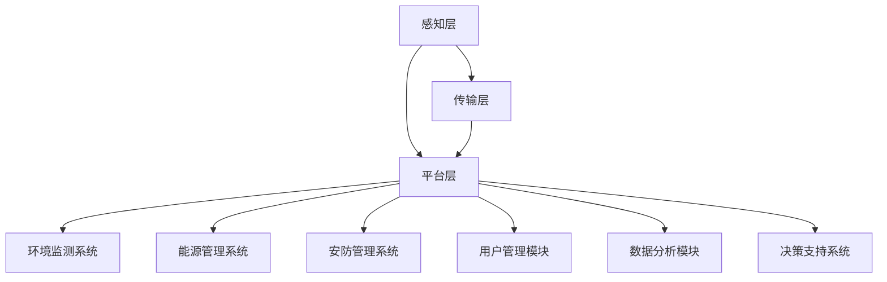

                 

### 第1章：智慧建筑管理概述

#### 1.1 智慧建筑的定义与重要性

智慧建筑管理，是指通过运用现代信息技术，如物联网、大数据、云计算和人工智能等，对建筑内的各种设备和系统进行智能化管理和控制，从而实现高效、绿色、安全和舒适的建筑环境。智慧建筑管理不仅仅是技术的集成应用，更是对建筑功能、空间、用户体验和运营维护的全面优化。

**问题背景**

随着城市化进程的加快和人口密度的增加，传统建筑管理模式已经无法满足现代社会的需求。传统建筑管理往往依赖于人工操作，存在效率低下、能耗高、安全隐患等问题。同时，随着信息技术的发展，特别是物联网、大数据和人工智能技术的成熟，为智慧建筑管理提供了新的可能性。

**问题描述**

智慧建筑管理旨在解决以下问题：
- 能源浪费：传统建筑能耗高，缺乏有效的能源管理。
- 安全隐患：缺乏全面的安防系统，易发生安全事故。
- 空间利用：空间分配不合理，无法满足用户需求。
- 运维管理：缺乏智能化手段，运维效率低下。

**问题解决**

智慧建筑管理通过以下方式解决上述问题：
- **智能化监控**：通过传感器和监控系统，实时监测建筑内各种设备的状态，实现能耗监测和设备故障预警。
- **能源管理**：利用智能算法优化能源分配，实现节能减排。
- **安防系统**：通过视频监控、入侵报警、消防管理等智能安防系统，提高建筑安全性。
- **空间管理**：通过智能化手段实现空间优化分配，提高空间利用率。
- **运维管理**：利用智能系统和大数据分析，实现高效的运维管理。

**边界与外延**

智慧建筑管理不仅包括建筑物本身，还包括与之相关的环境，如周边绿化、交通等。此外，智慧建筑管理也涉及到建筑物的生命周期，从设计、建设、运营到维护等各个环节。

**概念结构与核心要素组成**

智慧建筑管理由以下几个核心要素组成：
- **感知层**：传感器和监控设备，负责数据采集。
- **传输层**：通信网络，负责数据传输。
- **平台层**：数据处理和分析平台，负责数据存储和分析。
- **应用层**：用户界面和应用程序，提供用户交互。

在智慧建筑管理中，感知层是基础，传输层是关键，平台层是核心，应用层是用户界面。各层级相互配合，共同实现智慧建筑管理的目标。

通过上述对智慧建筑管理概念的定义和背景、问题的分析，我们可以看到智慧建筑管理在现代社会的重要性。随着技术的不断进步和应用场景的不断扩展，智慧建筑管理将会成为未来建筑行业的重要趋势。

#### 1.2 环境智能技术的基础概念

**环境智能技术的定义**

环境智能技术是指通过智能传感器、数据处理与分析、自动控制以及通信与网络等手段，对建筑环境进行实时监测、分析和优化，从而实现舒适、安全、节能和高效的建筑运营。其核心思想是将人工智能技术与建筑环境紧密结合，通过对环境数据的深度学习和分析，实现智能决策和自动控制。

**环境智能技术的基本原理**

环境智能技术的基本原理可以概括为以下几个步骤：
1. **感知**：通过智能传感器实时采集建筑环境中的各种数据，如温度、湿度、光照、噪音、空气质量等。
2. **传输**：将采集到的数据通过无线或有线网络传输至数据处理中心。
3. **处理**：在数据处理中心，利用大数据分析和人工智能算法对传输过来的数据进行分析和处理，提取有用的信息。
4. **控制**：根据分析结果，通过自动控制系统对建筑环境进行调整，如调节空调、照明、门窗等。
5. **反馈**：将控制效果反馈至用户界面，用户可以根据反馈结果进行进一步调整和优化。

**环境智能技术在不同领域的应用**

环境智能技术在建筑管理领域的应用广泛，下面列举几个主要的应用场景：

**1. 智能照明系统**

智能照明系统能够根据环境光线变化和用户需求自动调整照明亮度，既提高了照明效果，又节约了能源。例如，在白天光线较强时，自动降低照明强度，而在夜间则自动提高亮度，确保环境舒适。

**2. 智能空调系统**

智能空调系统能够根据室内外温度、湿度、空气质量等参数自动调节空调运行状态，提供舒适的室内环境。通过大数据分析和机器学习算法，空调系统可以预测用户需求，提前调整温度和湿度，提高能源利用效率。

**3. 智能安防系统**

智能安防系统集成了视频监控、入侵报警、消防管理等功能，通过智能分析技术实时监测建筑安全状况。例如，当有异常行为发生时，系统会自动报警，并启动相应的安全措施，保障人员和财产安全。

**4. 智能会议系统**

智能会议系统能够自动识别参会人员，记录会议内容，并根据会议议程自动调节灯光、音响和投影设备，提高会议效率。通过语音识别和自然语言处理技术，会议系统能够自动生成会议纪要，方便后续查询和参考。

**5. 智能能源管理系统**

智能能源管理系统通过实时监测和智能分析，优化能源使用，实现节能减排。例如，在用电高峰时段，系统能够自动调整用电计划，避免电力浪费。同时，通过能源数据分析，企业可以制定更加合理的能源使用策略，降低运营成本。

**6. 智能环境监测系统**

智能环境监测系统能够实时监测室内外环境质量，如空气中的PM2.5、二氧化碳浓度等，并通过智能分析预测污染趋势。当环境质量不符合标准时，系统会自动启动空气净化设备，保障室内空气质量。

通过上述对环境智能技术基础概念和应用的介绍，我们可以看到环境智能技术在智慧建筑管理中的重要作用。随着技术的不断进步和应用场景的不断扩大，环境智能技术将为智慧建筑管理带来更多的可能性。

#### 1.3 智慧建筑管理系统

**智慧建筑管理系统的组成部分**

智慧建筑管理系统由多个关键组件组成，每个组件都扮演着至关重要的角色，确保系统的高效运行和用户满意度的提升。

1. **感知层**：
感知层是智慧建筑管理系统的基石，负责实时收集建筑环境中的各种数据。主要包括各种传感器，如温度传感器、湿度传感器、光照传感器、烟雾传感器、二氧化碳传感器等。这些传感器能够监测建筑内的关键参数，为后续的数据处理和决策提供基础。

2. **传输层**：
传输层主要负责将感知层采集到的数据传输到中央处理平台。无线传输技术，如Wi-Fi、ZigBee、LoRa等，以及有线网络技术如以太网，都广泛应用于智慧建筑管理系统。高效的传输技术确保了数据的实时性和准确性。

3. **平台层**：
平台层是智慧建筑管理系统的核心，负责数据的处理和分析。平台层通常包括服务器、云计算平台和大数据分析工具。通过这些工具，系统能够对海量数据进行实时处理和分析，提取有用信息，并根据分析结果生成智能决策。

4. **控制层**：
控制层负责根据平台层的决策，对建筑内的设备和系统进行控制。例如，当温度传感器检测到室内温度过高时，控制层会指令空调系统启动制冷功能，确保室内温度舒适。控制层与建筑内的各种设备（如空调、照明、安防设备等）紧密连接，实现自动控制和远程监控。

5. **用户层**：
用户层是智慧建筑管理系统的界面，为用户提供交互和操作平台。用户可以通过手机应用、网页界面或智能终端设备访问系统，实时查看建筑环境数据，调整系统设置，并接收系统推送的报警信息。用户层的交互体验直接影响用户对系统的满意度。

**智慧建筑管理系统的功能**

智慧建筑管理系统具有多种功能，旨在提升建筑运营效率、优化用户体验、保障建筑安全。

1. **能源管理**：
智慧建筑管理系统通过智能算法对建筑内的能源使用进行监控和优化，实现节能减排。系统能实时监测电力、水、燃气等能源消耗情况，分析能源使用模式，并给出节能建议。

2. **环境监测**：
系统利用传感器实时监测建筑内的空气质量、温度、湿度、光照等环境参数，并通过数据分析预测环境变化趋势。当环境参数异常时，系统会自动报警并启动相应的应对措施，如空气净化、温度调节等。

3. **设备监控**：
智慧建筑管理系统对建筑内的设备进行实时监控，包括空调、照明、电梯、安防设备等。系统可以自动检测设备的运行状态，预测设备故障，提前进行维护，避免突发故障对建筑运营造成影响。

4. **安防管理**：
系统集成了视频监控、入侵报警、消防管理等安防功能，通过智能分析技术实时监测建筑安全状况。当检测到异常情况时，系统会自动报警，并通知相关人员进行处理。

5. **空间管理**：
智慧建筑管理系统通过智能技术对建筑内的空间进行分配和优化，确保空间利用最大化。系统可以根据用户需求和预约情况自动调整办公室、会议室等空间的分配，提高空间利用率。

6. **用户服务**：
系统提供了便捷的用户服务功能，如在线报修、服务预约、设施查询等。用户可以通过手机应用或网页轻松获取所需服务，提高办公效率和用户体验。

**智慧建筑管理系统的优势**

智慧建筑管理系统具有多方面的优势，使其成为现代建筑管理的重要工具：

1. **提高运营效率**：
通过智能化管理和自动化控制，智慧建筑管理系统大大提高了建筑运营效率，减少了人工干预，降低了运营成本。

2. **优化用户体验**：
系统提供了实时、个性化的服务，提高了用户的工作舒适度和满意度，增强了办公体验。

3. **保障安全**：
智能安防系统有效提高了建筑的安全性，通过实时监测和快速响应，保障了人员和财产的安全。

4. **节能减排**：
通过智能能源管理系统，系统实现了能源的高效利用，减少了能源消耗，符合绿色环保理念。

5. **提升空间利用率**：
通过智能空间管理，系统优化了空间分配，提高了建筑空间的利用率，降低了企业运营成本。

6. **数据驱动决策**：
系统提供了全面的数据分析和报告功能，为决策者提供了科学依据，有助于制定更加合理的管理策略。

通过上述对智慧建筑管理系统的组成部分、功能及其优势的详细讲解，我们可以清晰地看到智慧建筑管理系统在现代建筑管理中的重要性和价值。随着技术的不断进步，智慧建筑管理系统将会在更多场景中得到应用，为建筑行业带来更多创新和变革。

#### 1.4 智慧建筑管理的关键技术

**感知技术**

感知技术是智慧建筑管理的核心组成部分，其主要任务是通过各种传感器实时采集建筑环境中的数据。这些数据包括温度、湿度、光照、噪音、空气质量、运动状态等。感知技术的实现依赖于高精度传感器和先进的信号处理算法。

1. **传感器种类**：
   - **温度传感器**：用于监测室内外温度，常见的有热电偶、热敏电阻等。
   - **湿度传感器**：用于监测空气中的水分含量，常见的有电容式、电阻式等。
   - **光照传感器**：用于监测光照强度，常见的有光敏电阻、光电二极管等。
   - **噪音传感器**：用于监测室内噪音水平，常见的是声波传感器。
   - **空气质量传感器**：用于监测空气中的有害气体，如二氧化碳、PM2.5等，常见的是电化学传感器、激光传感器等。
   - **运动传感器**：用于监测人员的活动状态，常见的是红外传感器、超声波传感器等。

2. **信号处理算法**：
   感知技术中的信号处理算法至关重要，其作用是提高数据的质量和可靠性。常用的信号处理算法包括：
   - **滤波算法**：如低通滤波器，用于去除信号中的高频噪声。
   - **数据压缩算法**：用于减少数据传输量，常见的有Huffman编码、JPEG等。
   - **数据分析算法**：如傅里叶变换，用于分析信号的频率特性。
   - **机器学习算法**：用于从海量数据中提取有价值的信息，常见的有神经网络、支持向量机等。

**数据处理与分析技术**

数据处理与分析技术是智慧建筑管理的核心环节，其任务是对感知层采集到的数据进行分析和处理，提取有用的信息，为智能决策提供支持。数据处理与分析技术包括以下几个方面：

1. **数据存储**：
   - **关系型数据库**：如MySQL、PostgreSQL，用于存储结构化数据。
   - **非关系型数据库**：如MongoDB、Cassandra，用于存储大规模的非结构化数据。

2. **数据处理**：
   - **数据清洗**：去除数据中的噪声和不完整信息，确保数据的准确性。
   - **数据转换**：将不同格式的数据进行统一转换，便于分析和处理。
   - **数据集成**：将来自不同来源和格式的数据集成到一个统一的平台中。

3. **数据分析**：
   - **统计分析**：如均值、方差、相关性分析等，用于初步了解数据特性。
   - **时间序列分析**：如ARIMA、LSTM等，用于分析时间序列数据，预测未来的趋势。
   - **机器学习**：如决策树、随机森林、神经网络等，用于从数据中提取模式和规律，实现智能决策。

**自动控制技术**

自动控制技术是智慧建筑管理的执行层，其任务是根据数据处理与分析的结果，自动调节建筑内的设备和系统，实现环境优化和设备运行状态的调整。自动控制技术包括以下几个方面：

1. **控制算法**：
   - **PID控制**：是一种经典的控制算法，用于调节温度、湿度等环境参数。
   - **模糊控制**：基于模糊逻辑，适用于非线性系统的控制。
   - **自适应控制**：根据系统动态调整控制参数，提高控制效果。

2. **执行机构**：
   - **电动阀门**：用于调节空调、热水系统等。
   - **电机**：用于驱动窗帘、门禁系统等。
   - **PLC**（可编程逻辑控制器）：用于实现复杂的控制逻辑。

**通信与网络技术**

通信与网络技术是智慧建筑管理的传输层，负责数据在感知层、平台层和控制层之间的传输和通信。通信与网络技术包括以下几个方面：

1. **有线网络**：
   - **以太网**：是最常见的有线网络技术，用于数据的高速传输。
   - **光纤网络**：具有高带宽和低延迟，适用于大规模数据传输。

2. **无线网络**：
   - **Wi-Fi**：用于设备之间的无线连接和数据传输。
   - **ZigBee**：低功耗、短距离的无线通信技术，适用于智能家居和智能建筑。
   - **LoRa**：长距离、低功耗的无线通信技术，适用于大规模物联网应用。

3. **通信协议**：
   - **HTTP**：适用于web应用的通信协议。
   - **MQTT**：轻量级的消息队列协议，适用于物联网应用。
   - **CoAP**：约束应用协议，适用于资源受限的物联网设备。

通过上述对感知技术、数据处理与分析技术、自动控制技术以及通信与网络技术的介绍，我们可以看到这些关键技术如何共同构成了智慧建筑管理的技术基础。随着技术的不断发展和创新，这些关键技术将在智慧建筑管理中发挥越来越重要的作用，推动建筑行业的智能化转型。

### 第2章：环境智能技术在办公空间中的应用

#### 2.1 智能照明系统

智能照明系统是环境智能技术在办公空间中的一个重要应用，它通过自动调整灯光亮度和颜色，以适应不同的办公场景和用户需求，从而提高办公效率、节约能源并提升用户体验。

**智能照明系统的原理**

智能照明系统的核心原理是通过传感器实时监测环境光照条件和用户行为，结合智能控制算法，自动调整照明设备的亮度、颜色和开关状态。系统的主要组成部分包括：

- **光源**：常用的光源有LED灯、荧光灯等，其中LED灯因其高效、长寿命和可调光性而被广泛采用。
- **传感器**：包括光照传感器、人体传感器、声音传感器等，用于实时监测环境光照、人员活动和声音变化。
- **控制单元**：通过接收传感器数据，根据预设的控制策略，对照明设备进行自动控制。
- **用户界面**：如手机应用、智能音箱或触摸屏，用户可以通过这些界面进行照明设备的远程控制和设置。

**智能照明系统的实现方法**

智能照明系统的实现主要分为以下几个步骤：

1. **传感器部署**：
   在办公空间的关键位置部署各类传感器，如光照传感器和人体传感器。光照传感器用于监测环境光照强度，人体传感器用于检测人员活动。

2. **数据采集与传输**：
   传感器采集的数据通过无线或有线网络传输到中央控制单元。常用的无线通信技术包括Wi-Fi、ZigBee等。

3. **数据处理与控制**：
   中央控制单元接收传感器数据后，利用智能控制算法进行分析和处理，自动调整照明设备的亮度、颜色和开关状态。控制算法可以根据时间、光照强度、人员活动等多维度数据进行决策。

4. **用户交互**：
   用户可以通过手机应用、智能音箱等用户界面远程控制照明设备，设置场景模式、定时开关等。

**智能照明系统的应用案例**

智能照明系统在办公空间中的应用案例众多，以下是一些具体的实例：

1. **办公区照明**：
   在办公区，智能照明系统能够根据自然光照强度自动调节灯光亮度，确保室内光线既舒适又节能。例如，在白天阳光充足时，系统会降低灯光亮度，而在夜间或阴天时，则会自动提高灯光亮度。

2. **会议室照明**：
   会议室的照明需求往往因会议内容而变化。智能照明系统可以根据会议议程自动调整灯光亮度和颜色，提供适合会议氛围的照明环境。例如，在讨论环节，系统可以提供中性白光，而在休息环节，则可以提供柔和的暖光。

3. **公共区域照明**：
   公共区域如走廊、休息室等通常需要24小时照明。智能照明系统可以根据人员活动自动调节灯光亮度，避免不必要的能源浪费。例如，当有人员进入时，灯光自动开启，无人时自动关闭。

4. **应急照明**：
   在突发情况下，如停电或火灾等，智能照明系统能够自动切换到应急模式，确保人员安全。应急照明通常采用高亮度的红色或黄色灯光，指引人员迅速撤离。

通过智能照明系统的应用，办公空间不仅能够实现更加舒适和高效的照明环境，还能显著降低能源消耗，提高能源利用效率。同时，智能照明系统为用户提供了更多的灵活性，增强了办公体验。

#### 2.2 智能空调系统

智能空调系统是环境智能技术在办公空间中应用的另一个重要方面，它通过自动调节室内温度、湿度和空气质量，提供舒适的办公环境，并实现能源的高效利用。

**智能空调系统的原理**

智能空调系统的核心原理是通过传感器实时监测室内温度、湿度和空气质量等环境参数，结合智能控制算法，自动调节空调的运行状态，以维持舒适的室内环境。系统的主要组成部分包括：

- **空调设备**：包括中央空调、分体空调等，是系统的执行单元，用于调节室内温度和湿度。
- **传感器**：如温度传感器、湿度传感器、二氧化碳传感器等，用于实时监测环境参数。
- **控制单元**：接收传感器数据，根据预设的控制策略，自动调节空调的运行模式。
- **用户界面**：如手机应用、触摸屏等，用户可以通过这些界面查看环境参数和系统状态，进行手动控制。

**智能空调系统的实现方法**

智能空调系统的实现主要包括以下几个步骤：

1. **传感器部署**：
   在办公空间的关键位置部署各类传感器，如温度传感器和湿度传感器，用于实时监测室内环境。

2. **数据采集与传输**：
   传感器采集的数据通过无线或有线网络传输到中央控制单元。常用的无线通信技术包括Wi-Fi、ZigBee等。

3. **数据处理与控制**：
   中央控制单元接收传感器数据后，利用智能控制算法进行分析和处理，自动调节空调的运行状态。常见的控制算法包括PID控制、模糊控制等。

4. **用户交互**：
   用户可以通过手机应用、触摸屏等用户界面远程控制空调系统，设置温度、湿度等参数。

**智能空调系统的应用案例**

智能空调系统在办公空间中的应用案例包括：

1. **温度调节**：
   智能空调系统可以根据室外温度、室内温度和人员活动等参数，自动调节室内温度，提供舒适的办公环境。例如，在冬季寒冷时节，系统会自动开启加热功能，而在夏季炎热时节，则会启动制冷功能。

2. **湿度控制**：
   智能空调系统可以自动调节室内湿度，避免空气过于干燥或潮湿。在干燥季节，系统会启动加湿功能，而在潮湿季节，则会启动去湿功能，确保室内空气湿度适宜。

3. **空气质量控制**：
   智能空调系统通过二氧化碳传感器和其他空气质量传感器，实时监测室内空气质量。当空气质量不良时，系统会自动启动空气净化功能，如活性炭过滤、负氧离子发生等，提高空气质量。

4. **节能模式**：
   智能空调系统可以根据无人或低占用时段自动调整运行模式，进入节能模式，降低能耗。例如，在夜晚或周末，系统会自动降低空调功率，减少能源消耗。

5. **远程控制**：
   用户可以通过手机应用远程控制空调系统，随时随地调整室内环境。例如，在上班前，用户可以通过手机应用提前开启空调，确保室内温度适宜。

通过智能空调系统的应用，办公空间能够提供更加舒适和健康的办公环境，同时实现能源的高效利用，降低运营成本。智能空调系统不仅提升了员工的工作效率和满意度，还为企业的可持续发展提供了支持。

#### 2.3 智能安防系统

智能安防系统是环境智能技术在办公空间中的重要应用，通过集成视频监控、入侵报警、消防管理等功能，提供全方位的安全保障，确保人员和财产的安全。

**智能安防系统的原理**

智能安防系统的核心原理是通过多种传感器和监控设备，实时监测办公空间的动态，结合智能分析技术，快速识别潜在的安全威胁，并触发相应的报警和响应措施。系统的主要组成部分包括：

- **视频监控设备**：包括摄像头、视频录像机等，用于实时监控办公空间的状况。
- **入侵报警设备**：包括门磁传感器、红外探测器等，用于检测非法入侵行为。
- **消防设备**：包括烟雾探测器、消防喷淋系统等，用于火灾预防及扑救。
- **控制单元**：接收传感器数据，利用智能算法进行实时分析，并根据分析结果触发报警和应急措施。
- **用户界面**：如手机应用、监控中心等，用于用户查看监控画面和接收报警通知。

**智能安防系统的实现方法**

智能安防系统的实现主要包括以下几个步骤：

1. **设备部署**：
   在办公空间的各个关键位置部署视频监控设备、入侵报警设备和消防设备，确保全面覆盖。

2. **数据采集与传输**：
   各类安防设备通过无线或有线网络传输数据到控制单元。常用的无线通信技术包括Wi-Fi、ZigBee等。

3. **数据处理与控制**：
   控制单元接收传感器数据后，利用智能分析技术进行实时处理。例如，视频监控系统通过图像识别技术分析画面内容，入侵报警系统通过传感器数据判断入侵行为。

4. **报警与响应**：
   当检测到异常情况时，系统会自动触发报警，并通过用户界面通知相关人员。同时，系统会根据预设的响应策略自动启动相应的应急措施，如启动消防设备、锁定出入口等。

5. **用户交互**：
   用户可以通过手机应用或监控中心实时查看监控画面和接收报警通知，进行远程控制和应急操作。

**智能安防系统的应用案例**

智能安防系统在办公空间中的应用案例包括：

1. **视频监控**：
   智能视频监控系统可以实时监控办公空间，防止盗窃、破坏等行为。通过人脸识别技术，系统能够自动识别来访人员，提高安全性和便利性。

2. **入侵报警**：
   入侵报警系统可以检测非法入侵行为，如非法闯入、门锁被撬等，并通过报警通知安保人员迅速响应。通过红外探测器，系统还可以在夜间实现无人值守的监控。

3. **消防管理**：
   智能消防系统可以通过烟雾探测器和消防喷淋系统实现火灾早期预警和扑救。当检测到烟雾或温度异常时，系统会自动启动消防设备，并通知相关人员迅速撤离。

4. **智能巡更**：
   智能安防系统可以结合巡更设备，实现对重要区域和重点人员的实时监控。通过记录巡更人员的打卡信息和路线，系统可以确保安全管理的有效性。

5. **紧急呼叫**：
   智能安防系统提供紧急呼叫功能，用户可以在遇到紧急情况时通过按钮或手机应用呼叫安保人员，获得即时援助。

通过智能安防系统的应用，办公空间能够实现更加安全、高效的运营。智能安防系统不仅提升了安全防护能力，还降低了运营成本，为企业提供了全面的安全保障。随着技术的不断发展，智能安防系统将在办公空间中发挥越来越重要的作用。

#### 2.4 智能会议系统

智能会议系统是环境智能技术在办公空间中的又一重要应用，它通过自动化和智能化技术，提升会议效率、改善会议体验，并实现资源的优化配置。

**智能会议系统的原理**

智能会议系统的核心原理是通过传感器和智能分析技术，实时监测和控制会议环境，为参会人员提供最佳的会议体验。系统的主要组成部分包括：

- **会议设备**：如投影仪、音响系统、视频会议终端等，用于实现会议的基本功能。
- **环境传感器**：如声音传感器、光线传感器、温度传感器等，用于监测会议环境的各项参数。
- **控制单元**：接收传感器数据，根据预设的控制策略，自动调节会议设备的运行状态。
- **用户界面**：如手机应用、会议控制面板等，用于用户对会议设备进行远程控制和设置。

**智能会议系统的实现方法**

智能会议系统的实现主要包括以下几个步骤：

1. **设备部署**：
   在会议室中部署各类会议设备，如投影仪、音响系统、视频会议终端等，确保设备正常运行。

2. **数据采集与传输**：
   环境传感器实时采集会议环境的各项数据，如声音、光线、温度等，通过无线或有线网络传输到控制单元。

3. **数据处理与控制**：
   控制单元接收传感器数据后，利用智能算法进行实时处理，自动调节会议设备的运行状态。例如，当检测到参会人员增多时，系统会自动调节音响系统音量，确保所有人都能清晰听到发言内容。

4. **用户交互**：
   用户可以通过手机应用或会议控制面板远程控制会议设备，设置会议参数，如灯光、温度等。

**智能会议系统的应用案例**

智能会议系统在办公空间中的应用案例包括：

1. **会议环境自动化调节**：
   智能会议系统可以根据参会人数和会议内容自动调节会议室环境。例如，当检测到参会人员增多时，系统会自动调整灯光和音响系统，确保会议环境舒适。当会议进入休息环节时，系统会自动降低光线和音响音量，提供安静的休息空间。

2. **智能会议预约**：
   智能会议系统支持在线预约功能，用户可以通过手机应用或电脑端提前预约会议室，系统会根据预约情况自动安排会议室资源。例如，当某一会议室已被预约时，系统会自动推荐其他空闲会议室。

3. **智能会议记录**：
   智能会议系统可以自动记录会议内容，包括发言内容、会议时间、参会人员等。通过语音识别和自然语言处理技术，系统可以生成会议纪要，方便后续查询和参考。

4. **远程会议支持**：
   智能会议系统支持远程参会功能，通过视频会议终端和智能音响系统，实现远程人员的实时参与。系统可以根据远程参会人员的位置和需求，自动调整画面和音量，确保远程参会人员也能获得良好的会议体验。

5. **智能会议提醒**：
   智能会议系统可以在会议开始前自动发送提醒通知，包括会议时间、地点、参会人员等信息。用户可以通过手机应用或邮件接收提醒，确保不会错过重要会议。

通过智能会议系统的应用，办公空间能够实现更加高效和便捷的会议管理，提高会议效率，降低会议组织成本。智能会议系统不仅提升了会议体验，还为企业的信息化管理和决策提供了有力支持。

#### 2.5 智能能源管理系统

智能能源管理系统是环境智能技术在办公空间中不可或缺的一部分，它通过实时监控和智能优化能源使用，实现节能降耗和高效运营。

**智能能源管理系统的原理**

智能能源管理系统的核心原理是通过传感器和智能分析技术，实时监测办公空间内的电力、水、燃气等能源消耗情况，并结合能源使用模式和预测，自动优化能源配置，降低能源浪费。

系统的主要组成部分包括：

- **传感器**：包括电力传感器、水表、燃气表等，用于实时监测能源消耗情况。
- **数据采集与传输模块**：负责将传感器采集到的数据传输到中央控制单元。
- **中央控制单元**：接收数据并进行处理分析，根据预设的智能算法自动调节能源使用。
- **用户界面**：如手机应用、监控平台等，用于用户查看能源消耗情况和系统设置。

**智能能源管理系统的实现方法**

智能能源管理系统的实现主要包括以下几个步骤：

1. **设备部署**：
   在办公空间的关键位置部署各类能源传感器，确保全面覆盖电力、水、燃气等能源消耗点。

2. **数据采集与传输**：
   传感器采集到的数据通过无线或有线网络传输到中央控制单元。常用的无线通信技术包括Wi-Fi、ZigBee等。

3. **数据处理与优化**：
   中央控制单元接收数据后，利用智能算法进行分析和处理，提取能源使用模式和预测未来需求。例如，通过数据分析，系统可以识别出高峰用电时段，并在非高峰时段调整用电计划，减少能源浪费。

4. **自动控制**：
   根据分析结果，中央控制单元自动调节能源设备的运行状态，如调整空调温度、关闭不必要的照明等，实现能源的高效使用。

5. **用户交互**：
   用户可以通过手机应用或监控平台实时查看能源消耗情况，设置能源使用策略，并根据系统建议调整能源使用习惯。

**智能能源管理系统的应用案例**

智能能源管理系统在办公空间中的应用案例包括：

1. **实时监控与报警**：
   系统可以实时监控办公空间的能源消耗情况，并在检测到异常情况时自动报警。例如，当某个电表读数异常升高时，系统会立即通知运维人员进行检查。

2. **能源使用分析**：
   系统可以生成详细的能源消耗报告，分析能源使用模式和效率。通过这些报告，企业可以识别出能源浪费的关键点，并采取相应措施进行优化。

3. **智能调度**：
   智能能源管理系统可以根据实时需求和能源价格变化，自动调整能源使用计划。例如，在用电高峰时段，系统会减少非必要的电力消耗，降低用电成本。

4. **远程控制**：
   用户可以通过手机应用远程监控和控制能源设备，如关闭未使用的照明设备、调整空调温度等，实现远程能源管理。

5. **节能模式**：
   系统可以设置节能模式，在无人或低占用时段自动降低能源消耗。例如，在夜晚或周末，系统会自动调整空调温度，关闭不必要的照明设备，降低能源浪费。

通过智能能源管理系统的应用，办公空间能够实现能源的高效利用和节能降耗，降低运营成本，提高能源管理水平。智能能源管理系统不仅提升了企业的可持续发展能力，还为员工提供了更加舒适和健康的办公环境。

### 第3章：智慧建筑管理的数据分析与优化

#### 3.1 智慧建筑数据采集与处理

智慧建筑管理的数据采集与处理是系统运行的核心环节，它关系到数据的质量和系统的决策准确性。本节将详细探讨数据采集的方法、数据处理的技术，以及数据存储与管理。

**数据采集的方法**

1. **传感器部署**：
   传感器是智慧建筑数据采集的源头，常见的传感器包括温度传感器、湿度传感器、光照传感器、空气质量传感器、二氧化碳传感器、人员检测传感器等。传感器需要根据不同场景和需求进行合理部署，以确保数据覆盖全面和准确性。

2. **数据采集设备**：
   数据采集设备通常包括数据采集器、网关等，这些设备负责将传感器采集的数据进行初步处理，并通过无线或有线网络传输到中央系统。数据采集设备的选择取决于系统的需求、环境条件以及数据传输的可靠性。

3. **无线通信技术**：
   无线通信技术在智慧建筑数据采集中广泛应用，常见的无线通信技术包括Wi-Fi、ZigBee、LoRa等。这些技术具有低功耗、低延迟、覆盖范围广等优点，适合用于室内外的数据采集。

**数据处理的技术**

1. **数据预处理**：
   数据预处理是数据处理的第一步，主要包括数据清洗、去噪、数据格式转换等。数据清洗的目的是去除重复数据、缺失数据和异常数据，保证数据的质量。去噪则是通过滤波算法去除传感器数据中的噪声，提高数据的准确性。数据格式转换则将不同来源和格式的数据统一成标准格式，便于后续处理和分析。

2. **数据存储**：
   数据存储是数据处理的重要环节，涉及到数据的安全性和可扩展性。常用的数据存储技术包括关系型数据库（如MySQL、PostgreSQL）、非关系型数据库（如MongoDB、Cassandra）和时序数据库（如InfluxDB）。关系型数据库适合存储结构化数据，非关系型数据库适合存储大规模的非结构化数据，时序数据库适合存储时间序列数据。

3. **数据处理算法**：
   数据处理算法是智慧建筑管理系统的核心，常见的算法包括统计分析、机器学习、深度学习等。统计分析用于对数据进行描述性分析，提取数据的基本特征；机器学习用于从数据中学习模式和规律，实现预测和分类；深度学习则用于处理大规模复杂数据，提取深层特征。

**数据存储与管理**

1. **数据备份与恢复**：
   数据备份是保障数据安全的重要措施，系统需要定期进行数据备份，并确保备份数据的可恢复性。数据备份可以采用本地备份和云备份相结合的方式，以提高数据备份的安全性和可靠性。

2. **数据权限管理**：
   数据权限管理是保障数据安全的重要手段，系统需要设置合理的权限控制策略，确保数据访问的权限和安全性。常见的权限管理策略包括用户认证、角色权限控制、数据加密等。

3. **数据生命周期管理**：
   数据生命周期管理是指对数据从生成到销毁的全过程进行管理。数据生命周期管理包括数据的创建、存储、访问、更新、归档和销毁等环节。合理的生命周期管理能够确保数据的安全和有效利用。

通过上述对智慧建筑数据采集与处理方法的详细讲解，我们可以看到数据采集与处理在智慧建筑管理中的关键作用。高效的数据采集和处理不仅能够提高系统的决策准确性，还能为建筑运营提供有力支持，实现智慧建筑管理的目标。

#### 3.2 智慧建筑数据分析方法

智慧建筑数据分析方法是实现智慧建筑管理系统智能决策和优化运营的核心环节。在本节中，我们将探讨常用的智慧建筑数据分析方法，包括统计分析、机器学习和数据可视化。

**统计分析**

统计分析是智慧建筑数据分析的基础，主要用于描述性分析和解释性分析。描述性分析用于了解数据的基本特征，如均值、方差、分布等；解释性分析则用于揭示数据之间的关系和模式。

1. **均值和方差**：
   通过计算数据的均值和方差，可以了解数据的集中趋势和离散程度。例如，通过计算室内温度的均值，可以了解室内温度的平均水平；方差则可以反映温度波动的大小。

2. **相关性和回归分析**：
   通过计算变量之间的相关性，可以揭示不同环境参数之间的关系。回归分析则用于建立变量之间的数学模型，预测一个变量基于其他变量的变化。

**机器学习**

机器学习是智慧建筑数据分析的核心技术，通过训练模型从数据中学习模式和规律，实现自动化的智能决策。

1. **监督学习**：
   监督学习通过有标签的数据训练模型，然后使用模型进行预测。常见的监督学习算法包括线性回归、逻辑回归、决策树、随机森林、支持向量机等。例如，通过训练温度预测模型，可以预测未来一段时间内的室内温度，从而提前调整空调系统。

2. **无监督学习**：
   无监督学习通过无标签的数据发现数据中的模式和规律，如聚类分析和降维技术。聚类分析用于将相似的数据点划分为不同的群组，降维技术用于减少数据的维度，简化数据结构。例如，通过聚类分析，可以将不同办公室划分为温度调节的不同区域，提高空调系统的效率。

**数据可视化**

数据可视化是将复杂的数据通过图形化的方式呈现出来，帮助人们直观地理解和分析数据。

1. **图表类型**：
   常见的数据可视化图表类型包括柱状图、折线图、饼图、散点图、热力图等。柱状图和折线图常用于描述数据的变化趋势；饼图和散点图用于展示数据的分布和关系；热力图则用于显示数据的密度和分布。

2. **可视化工具**：
   常用的数据可视化工具有Tableau、PowerBI、Python的Matplotlib和Seaborn库等。这些工具提供了丰富的图表类型和交互功能，能够方便地进行数据的可视化展示。

通过上述对智慧建筑数据分析方法的详细探讨，我们可以看到统计分析、机器学习和数据可视化在智慧建筑管理中的重要作用。统计分析提供基础的数据特征描述，机器学习实现数据预测和模式识别，数据可视化帮助直观地理解和展示数据。这些分析方法的综合应用，能够为智慧建筑管理提供科学的决策依据，实现智能化和优化的运营管理。

#### 3.3 智慧建筑数据可视化

智慧建筑数据可视化是将采集到的数据通过图形化的方式展示，以帮助人们直观地理解建筑环境的变化和系统运行状态。有效的数据可视化不仅能提升数据分析的效率，还能帮助企业做出更明智的决策。

**数据可视化技术**

数据可视化技术涉及多种图表类型和工具，以下是一些常用的技术和工具：

1. **图表类型**：
   - **柱状图**：用于展示不同类别的数据比较，如不同房间的温度对比。
   - **折线图**：用于展示数据随时间的变化趋势，如温度和湿度的日变化。
   - **饼图**：用于展示数据的占比，如各类能源消耗的比例。
   - **散点图**：用于展示数据之间的关系，如温度与能耗的关系。
   - **热力图**：用于展示数据的分布情况，如房间内光照的分布。
   - **地图**：用于展示地理位置相关的数据，如建筑物周围的环境数据。

2. **可视化工具**：
   - **Tableau**：是一个功能强大的数据可视化工具，支持多种图表类型和交互功能。
   - **PowerBI**：由微软推出，提供丰富的可视化组件和强大的数据分析能力。
   - **Python库**：如Matplotlib、Seaborn、Plotly等，这些库可以轻松生成各种图表，并支持自定义和交互。

**数据可视化工具**

以下介绍几种常用的数据可视化工具及其基本使用方法：

1. **Matplotlib**：

   Matplotlib是Python中最常用的数据可视化库之一，具有丰富的图表类型和高度的可定制性。

   ```python
   import matplotlib.pyplot as plt
   
   # 绘制折线图
   plt.plot([1, 2, 3, 4])
   plt.xlabel('Time')
   plt.ylabel('Temperature')
   plt.title('Temperature Trend')
   plt.show()
   ```

2. **Seaborn**：

   Seaborn是基于Matplotlib的一个高级可视化库，提供更美观的图表样式。

   ```python
   import seaborn as sns
   
   # 绘制散点图
   sns.scatterplot(x='Temperature', y='Humidity', data=data)
   sns.lineplot(x='Time', y='Temperature', data=data)
   plt.show()
   ```

3. **Plotly**：

   Plotly是一个交互式可视化库，支持多种图表类型和丰富的交互功能。

   ```python
   import plotly.express as px
   
   # 绘制折线图
   fig = px.line(data, x='Time', y='Temperature', title='Temperature Trend')
   fig.show()
   ```

**数据可视化案例分析**

以下是一个数据可视化案例，展示如何使用Matplotlib库对智慧建筑环境数据进行可视化：

```python
import matplotlib.pyplot as plt
import numpy as np

# 生成模拟数据
time = np.arange(0, 24, 0.5)
temperature = np.sin(time) + 20
humidity = np.cos(time) * 0.5 + 40

# 绘制温度和湿度变化趋势
plt.figure(figsize=(10, 5))
plt.subplot(1, 2, 1)
plt.plot(time, temperature, label='Temperature')
plt.xlabel('Time (hours)')
plt.ylabel('Temperature (°C)')
plt.legend()

plt.subplot(1, 2, 2)
plt.plot(time, humidity, label='Humidity')
plt.xlabel('Time (hours)')
plt.ylabel('Humidity (%)')
plt.legend()

plt.tight_layout()
plt.show()
```

通过上述案例，我们可以看到如何使用Python的Matplotlib库对温度和湿度随时间的变化进行可视化展示。这种可视化方法能够帮助企业实时了解建筑环境的动态变化，从而做出更有效的运营决策。

**数据可视化案例分析**

下面通过一个实际案例，展示如何利用数据可视化工具对智慧建筑环境数据进行分析。

**案例背景**：
一家企业计划对其办公大楼进行节能减排改造，希望通过数据可视化分析，了解不同区域和不同时间段的能耗情况，为后续的改造提供科学依据。

**数据采集**：
企业部署了多种传感器，包括温度传感器、湿度传感器、光照传感器和能耗传感器。传感器采集的数据存储在中央数据库中，涵盖过去一年的数据。

**数据分析**：

1. **能耗分布**：
   利用Tableau对能耗数据进行分析，生成以下图表：

   - **柱状图**：展示各楼层和各区域的能耗分布。
   - **折线图**：展示各楼层和各区域能耗的日变化趋势。

2. **温度与湿度分布**：
   利用Seaborn对温度和湿度数据进行分析，生成以下图表：

   - **热力图**：展示不同区域和不同时间段的温度和湿度分布。
   - **散点图**：展示温度与能耗、湿度与能耗的关系。

**可视化结果**：

1. **能耗分布柱状图**：
   通过柱状图，企业可以发现哪一层或哪个区域的能耗最高，以及不同时段的能耗变化。

2. **温度与湿度分布热力图**：
   通过热力图，企业可以直观地了解各区域的温度和湿度状况，识别出温度和湿度不均匀的区域，为空调系统的优化提供参考。

3. **温度与能耗散点图**：
   通过散点图，企业可以发现温度与能耗之间的相关性，从而优化空调系统的运行策略，实现节能目标。

通过上述数据可视化案例分析，我们可以看到数据可视化在智慧建筑管理中的应用价值。有效的数据可视化不仅帮助企业了解建筑环境的动态变化，还为节能减排和运营优化提供了科学依据。随着数据可视化技术的不断发展，智慧建筑管理将变得更加智能化和精细化。

### 第4章：智慧建筑管理的系统集成与架构设计

#### 4.1 系统集成的基本概念

系统集成是指将不同硬件、软件、网络和数据库等技术组件有机地整合在一起，以实现一个统一的功能模块。在智慧建筑管理中，系统集成是实现智能化和自动化控制的关键步骤。通过系统集成，各个子系统之间能够无缝连接，共享数据，协同工作，从而提高整体效率和用户体验。

**系统集成的重要性**

系统集成在智慧建筑管理中具有以下重要性：

1. **提高系统效率**：通过系统集成，各个子系统可以协同工作，减少信息孤岛，提高系统的整体效率。
2. **提升用户体验**：集成后的系统可以提供更流畅的用户体验，用户可以通过统一的界面访问和管理不同的功能。
3. **降低维护成本**：集成系统减少了硬件和软件的重复投入，降低了系统的维护成本。
4. **增强系统安全性**：通过统一的系统架构，可以更有效地实施安全策略和管理措施。

**系统集成的基本原理**

系统集成的基本原理可以概括为以下几个步骤：

1. **需求分析**：在系统集成之前，首先要明确系统的需求，包括功能需求、性能需求、安全性需求等。需求分析是系统集成的基础。
2. **系统规划**：根据需求分析结果，制定系统集成方案，包括硬件选择、软件选择、网络架构设计等。
3. **接口设计**：系统接口设计是确保不同子系统之间能够无缝连接的关键。接口设计需要考虑数据格式、通信协议、接口标准等。
4. **系统集成**：在系统规划的基础上，按照接口设计进行系统集成，确保各个子系统能够正常运行和协同工作。
5. **测试与验证**：在系统集成完成后，需要进行全面的测试和验证，确保系统满足需求、稳定可靠。

**集成系统的组成部分**

智慧建筑管理系统通常包括以下几个关键组成部分：

1. **感知层**：包括各种传感器和监测设备，用于实时采集建筑环境数据。
2. **传输层**：负责数据的传输和通信，通常采用有线和无线网络技术。
3. **平台层**：包括数据处理和分析模块，用于对采集到的数据进行处理和分析。
4. **应用层**：包括用户界面和应用软件，用户可以通过应用层与系统进行交互。

通过以上对系统集成基本概念的介绍，我们可以看到系统集成在智慧建筑管理中的核心作用。有效的系统集成不仅能够提高系统的整体效率，还能为用户提供更加流畅和便捷的使用体验。

#### 4.2 智慧建筑管理系统架构设计

智慧建筑管理系统架构设计是确保系统稳定、高效运行的关键环节。一个良好的系统架构不仅能够满足当前的业务需求，还能具备一定的扩展性和灵活性，以应对未来可能的变化和挑战。

**问题场景介绍**

假设某企业计划建设一座智慧办公大楼，要求系统具备以下功能：

- 实时监测和自动调节室内温度、湿度、光照等环境参数。
- 提供智能照明、空调和安防系统，实现能源优化和安全保障。
- 提供远程监控和用户自助管理功能，方便用户随时调整系统设置。
- 实现数据的集中存储和智能分析，为管理者提供决策支持。

**项目介绍**

项目目标是在企业办公大楼内构建一个集成化、智能化的智慧建筑管理系统。系统将涵盖环境监控、能源管理、安防管理、用户管理等多个方面，以满足企业的日常运营需求。

**系统功能设计**

根据项目需求，智慧建筑管理系统应具备以下功能：

1. **环境监测**：通过传感器实时监测室内温度、湿度、光照等参数，并根据数据自动调节空调和照明系统。
2. **能源管理**：监控能源使用情况，实现能源消耗的优化和节能目标。
3. **安防管理**：集成视频监控、入侵报警、消防管理等安全功能，保障大楼安全。
4. **用户管理**：提供用户认证和权限管理功能，方便用户远程监控和管理系统。

**系统架构设计**

智慧建筑管理系统架构设计包括以下几个关键层次：

1. **感知层**：部署各种传感器，如温度传感器、湿度传感器、光照传感器等，用于实时采集环境数据。
2. **传输层**：采用有线和无线通信技术，将感知层采集到的数据传输到中央控制平台。
3. **平台层**：包括数据处理和分析模块，用于对传输过来的数据进行存储、处理和分析，为智能决策提供支持。
4. **应用层**：提供用户界面和应用软件，用户可以通过应用层与系统进行交互。

**系统架构设计图**

下面是一个简化的智慧建筑管理系统架构设计图：

```
+----------------+     +----------------+     +----------------+
|  感知层（Sensor） | -> |  传输层（Network） | -> |  平台层（Platform） |
+----------------+     +----------------+     +----------------+
       |                                    |
       |                                    |
       v                                    v
+----------------+     +----------------+     +----------------+
|  环境监测系统   |     |  能源管理系统   |     |  安防管理系统   |
+----------------+     +----------------+     +----------------+
       |                                    |
       |                                    |
       v                                    v
+----------------+     +----------------+     +----------------+
|  用户管理模块   |     |  数据分析模块   |     |  决策支持系统   |
+----------------+     +----------------+     +----------------+
```

**系统接口设计和系统交互设计**

1. **接口设计**：
   系统接口设计是确保不同子系统之间能够无缝连接的关键。接口设计需要考虑以下方面：

   - **数据格式**：定义数据传输的格式，如JSON、XML等。
   - **通信协议**：选择合适的通信协议，如HTTP、MQTT、CoAP等。
   - **接口标准**：遵循业界通用的接口标准，如RESTful API等。

2. **系统交互设计**：
   系统交互设计包括各个子系统之间的交互流程和机制。例如，当环境监测系统检测到温度过高时，需要通知能源管理系统调整空调温度，同时发送报警通知给用户管理模块。系统交互设计需要考虑以下方面：

   - **交互流程**：定义子系统之间的交互顺序和流程。
   - **事件驱动**：利用事件驱动机制实现实时数据交互。
   - **异常处理**：设计异常处理机制，确保系统在高负载或异常情况下稳定运行。

**Mermaid架构图**

以下是一个使用Mermaid绘制的智慧建筑管理系统架构图：



通过以上对智慧建筑管理系统架构设计的介绍，我们可以看到系统架构设计在智慧建筑管理中的重要性。一个良好的系统架构不仅能够满足当前的业务需求，还能为未来的发展奠定坚实的基础。

### 第5章：智慧建筑管理项目的实施与运营

#### 5.1 项目实施流程

智慧建筑管理项目的实施流程是确保项目按时、按质完成的关键环节。一个典型的智慧建筑管理项目实施流程包括以下步骤：

**1. 项目规划**

项目规划是项目实施的第一步，主要包括以下内容：

- **项目目标**：明确项目的最终目标，如实现智能化办公环境、提高能源利用效率、提升安全性能等。
- **范围界定**：明确项目的范围，包括哪些系统和功能将纳入项目，哪些不包含。
- **项目团队**：组建项目团队，包括项目经理、工程师、测试人员、维护人员等。
- **资源分配**：根据项目需求，分配所需的人员、设备、预算等资源。

**2. 需求分析**

需求分析是确保项目实现预期目标的重要环节。需求分析主要包括：

- **功能需求**：列出项目需要实现的具体功能，如环境监测、智能照明、智能空调、安防管理等。
- **非功能需求**：包括系统性能、安全性、可靠性、可维护性等方面的要求。
- **用户需求**：了解用户的具体需求，包括用户体验、易用性、操作简便性等。

**3. 系统设计**

系统设计是项目实施的核心，主要包括：

- **架构设计**：设计系统的整体架构，包括硬件、软件、网络、数据库等。
- **接口设计**：定义不同子系统之间的接口，包括数据格式、通信协议、接口标准等。
- **详细设计**：详细设计每个子系统的实现方案，包括算法、数据库表设计、界面设计等。

**4. 系统开发**

系统开发是项目实施的重要阶段，主要包括：

- **编码**：根据设计文档进行编码，实现各个子系统的功能。
- **集成**：将各个子系统集成在一起，进行系统测试和调试。
- **测试**：对系统进行全面的测试，包括功能测试、性能测试、安全测试等。

**5. 项目部署**

项目部署是将系统安装到实际环境中，并进行上线运行。主要包括：

- **环境搭建**：搭建系统运行的环境，包括服务器、网络设备、数据库等。
- **系统安装**：将系统安装到服务器上，并进行配置。
- **数据迁移**：将现有数据迁移到新系统中。
- **用户培训**：对用户进行系统操作培训。

**6. 系统验收**

系统验收是项目实施的最后一步，主要包括：

- **功能验收**：验证系统是否实现了所有功能，是否符合需求。
- **性能验收**：验证系统性能是否达到预期，如响应时间、并发用户数等。
- **安全验收**：验证系统的安全性能，如数据加密、用户认证等。

**7. 运维管理**

运维管理是项目实施后的长期工作，主要包括：

- **系统维护**：定期对系统进行检查和维护，确保系统稳定运行。
- **用户支持**：提供用户技术支持，解决用户在使用过程中遇到的问题。
- **系统更新**：根据用户需求和系统发展，定期更新系统功能和性能。

通过上述对智慧建筑管理项目实施流程的详细讲解，我们可以看到项目实施在智慧建筑管理中的重要性。有效的项目实施不仅能确保项目按时、按质完成，还能为企业的长期运营提供有力支持。

#### 5.2 智慧建筑管理运营管理

智慧建筑管理运营管理是确保智慧建筑系统长期稳定运行、持续优化和高效管理的重要环节。一个成功的智慧建筑管理运营管理方案不仅能够提升建筑物的运营效率，还能为企业和用户带来显著的经济和社会效益。

**运营管理概述**

智慧建筑管理运营管理包括以下几个方面：

1. **系统监控**：实时监控智慧建筑管理系统各个组件的运行状态，包括传感器、通信网络、数据处理平台等。通过监控可以发现系统故障和异常，及时进行故障排查和修复。
2. **设备维护**：定期对智慧建筑系统中的设备进行维护和保养，确保设备处于良好状态。设备维护包括清洁、校准、更换零部件等，以延长设备使用寿命。
3. **数据管理**：对采集到的环境数据、能耗数据、安全数据等进行有效管理，确保数据的准确性、完整性和安全性。数据管理包括数据备份、存储、分析等。
4. **用户服务**：提供高质量的客户服务，包括用户咨询、故障处理、系统使用培训等。良好的用户服务可以提高用户满意度，促进系统的广泛应用。
5. **安全管理**：制定和执行严格的安防管理策略，包括防火、防盗、入侵报警等，确保建筑物的安全。

**运营管理流程**

智慧建筑管理运营管理流程主要包括以下步骤：

1. **日常监控**：通过监控平台实时监控智慧建筑管理系统的各项指标，如温度、湿度、光照、能耗等。发现异常情况时，及时报警并通知相关人员处理。
2. **定期检查**：定期对系统设备进行巡检和维护，确保设备正常运行。巡检内容包括设备外观检查、运行状态检测、数据采集测试等。
3. **数据备份**：定期对系统数据进行备份，防止数据丢失或损坏。数据备份应包括环境数据、能耗数据、用户数据等，确保数据的完整性和可恢复性。
4. **用户培训**：对用户进行系统操作培训，确保用户能够正确使用和管理智慧建筑管理系统。培训内容应包括系统功能、操作流程、故障处理等。
5. **故障处理**：当系统出现故障时，及时响应并处理。故障处理流程包括故障诊断、故障修复、故障分析等，确保故障能够快速解决，减少对日常运营的影响。
6. **安全检查**：定期进行安全检查，包括物理安全检查和网络安全检查，确保建筑物和系统的安全。
7. **系统优化**：根据运营数据和分析结果，对系统进行优化和升级。系统优化包括调整控制策略、改进算法、增加新功能等，以提高系统的性能和用户体验。

**运营管理案例分析**

以下是一个智慧建筑管理运营管理案例：

**案例背景**：

某大型企业计划对其总部大楼进行智慧化改造，目标是通过引入智慧建筑管理系统，提高能源利用效率、提升安全管理水平、优化用户体验。

**运营管理实践**：

1. **系统监控**：在建筑物内部署了多种传感器，如温度传感器、湿度传感器、光照传感器、能耗传感器等，通过监控平台实时监控环境参数和能源消耗情况。当监测到异常数据时，系统会自动报警并通知运维人员。
2. **设备维护**：定期对传感器和通信网络进行巡检和维护，确保设备的正常运行。每次巡检都会记录设备状态和问题，为后续维护提供参考。
3. **数据管理**：建立数据中心，对采集到的数据进行分析和处理，生成各类报告和图表，为管理者提供决策支持。数据备份每周进行一次，确保数据安全。
4. **用户培训**：对新入职员工进行系统操作培训，包括如何使用手机应用或监控平台查看和管理系统功能。同时，定期组织用户反馈会议，收集用户意见和建议，持续改进系统。
5. **故障处理**：当系统出现故障时，运维团队会立即响应。通过远程诊断和现场维修相结合的方式，快速解决问题，确保系统稳定运行。
6. **安全检查**：每周进行一次安全检查，包括消防设备、安防设备和网络设备等。同时，定期进行网络安全测试，确保系统不受恶意攻击。

通过上述运营管理实践，该企业成功实现了智慧建筑管理的目标，不仅提高了能源利用效率，还提升了安全管理水平和用户体验。随着运营管理的不断优化，智慧建筑管理的效果将更加显著。

#### 5.3 智慧建筑管理的维护与更新

智慧建筑管理的维护与更新是确保系统稳定运行和持续优化的重要环节。随着技术的不断进步和应用场景的扩展，智慧建筑管理系统需要不断更新和维护，以满足不断变化的需求。

**系统维护策略**

系统维护策略主要包括以下几个方面：

1. **定期检查**：定期对智慧建筑管理系统中的传感器、通信网络、数据处理平台等关键组件进行检查和维护，确保设备正常运行。定期检查可以提前发现潜在问题，避免突发故障对系统造成影响。
2. **故障响应**：建立快速响应机制，当系统出现故障时，能够及时响应并处理。故障响应包括远程诊断、现场维修和系统恢复等环节，确保故障能够迅速解决，减少对日常运营的影响。
3. **数据备份**：定期对系统数据进行备份，防止数据丢失或损坏。数据备份应包括环境数据、能耗数据、用户数据等，确保数据的完整性和可恢复性。
4. **软件更新**：定期更新系统软件，包括操作系统、应用程序等，以修复已知漏洞、提高系统性能和增加新功能。软件更新应经过严格的测试，确保更新不会影响系统的稳定性。

**系统更新方法**

系统更新方法主要包括以下步骤：

1. **需求分析**：根据用户反馈和技术发展趋势，分析系统更新的需求，确定需要增加的新功能和改进的现有功能。
2. **规划与设计**：根据需求分析结果，制定系统更新的详细计划，包括更新内容、时间安排、资源分配等。更新设计应充分考虑系统的兼容性和稳定性。
3. **开发与测试**：按照更新计划进行开发工作，包括编写新功能代码、修复现有漏洞、优化系统性能等。开发完成后，进行全面的测试，确保更新后的系统符合预期。
4. **部署与上线**：将更新后的系统部署到实际环境中，并进行上线运行。部署过程中，应确保系统的稳定性和安全性，避免更新过程中出现意外情况。
5. **用户培训**：对用户进行系统更新后的培训，确保用户能够熟练使用新功能和改进的现有功能。培训内容应包括新功能的介绍、操作指南等。

**注意事项**

在系统维护与更新过程中，需要注意以下几点：

1. **备份与恢复**：在更新前，必须对现有系统进行备份，以防更新过程中出现意外情况导致数据丢失或系统崩溃。在更新完成后，应进行数据恢复和系统测试，确保系统正常运行。
2. **兼容性测试**：在更新过程中，必须对系统进行兼容性测试，确保新系统和现有系统之间的无缝连接。兼容性测试应包括硬件、软件和网络等多个方面。
3. **安全升级**：在更新过程中，应关注安全升级，确保系统不受恶意攻击。安全升级应包括操作系统、数据库、应用程序等。
4. **用户反馈**：更新完成后，应及时收集用户反馈，了解新功能和改进的现有功能的实际效果，并根据反馈进行持续优化。

**最佳实践 tips**

以下是一些智慧建筑管理维护与更新的最佳实践：

1. **制定详细的维护和更新计划**：确保维护和更新工作有条不紊地进行，减少对日常运营的影响。
2. **提前通知用户**：在维护和更新前，提前通知用户，告知维护和更新计划，以便用户做好相应的准备。
3. **定期进行安全评估**：定期对系统进行安全评估，识别潜在的安全隐患，并采取相应的安全措施。
4. **建立用户支持体系**：建立完善的用户支持体系，包括用户培训、技术支持、故障响应等，确保用户能够顺利使用和管理系统。
5. **持续优化系统性能**：根据用户反馈和技术发展趋势，不断优化系统性能，提升用户体验。

通过以上对智慧建筑管理维护与更新策略、方法和注意事项的详细讲解，我们可以看到维护与更新在智慧建筑管理中的重要性。有效的维护与更新不仅能确保系统稳定运行，还能为企业和用户提供更好的服务体验，推动智慧建筑管理的持续发展。

### 第6章：智慧建筑管理的未来发展趋势

#### 6.1 智慧建筑管理技术趋势

随着科技的不断进步和应用的深入，智慧建筑管理技术也在持续发展和创新。以下是智慧建筑管理技术的一些主要趋势：

**1. 5G技术的应用**

5G技术的广泛应用将为智慧建筑管理带来更高效、更可靠的数据传输。5G网络具有高带宽、低延迟和高可靠性等特点，能够满足智慧建筑管理中大量实时数据传输的需求。例如，5G技术可以支持更高速的监控视频传输和更实时的环境数据采集，提高系统的响应速度和准确性。

**2. 物联网（IoT）技术的深化**

物联网技术是智慧建筑管理的重要基础。未来，物联网技术将更深入地渗透到建筑管理的各个环节。更多的设备和系统将实现联网，通过物联网技术实现数据的互联互通。例如，智能门锁、智能窗帘、智能传感器等设备将实现无缝连接，构建起一个高度智能化的建筑环境。

**3. 大数据和人工智能的融合**

大数据和人工智能技术将在智慧建筑管理中发挥更大的作用。通过对海量数据的收集、存储和分析，智慧建筑管理系统能够更好地理解和预测用户需求，提供个性化的服务。人工智能技术将进一步提升系统的智能决策能力，实现更加智能化的建筑运营。

**4. 自动驾驶和机器人技术的应用**

自动驾驶和机器人技术将在智慧建筑管理中发挥重要作用。例如，自动驾驶清洁车和机器人将在建筑内部实现自动清洁、物料搬运等任务，提高运营效率，减少人力成本。此外，机器人还可以用于安防巡逻、应急响应等工作，提高建筑的安全性。

**5. 能源管理技术的创新**

随着环保意识的提高，智慧建筑管理的能源管理技术也将不断创新。例如，可再生能源技术（如太阳能、风能）的应用将更加广泛，智慧建筑管理系统将能够更好地整合和利用这些可再生能源，实现能源的绿色利用。同时，智能能源管理系统将进一步提升能源利用效率，降低能源消耗。

**6. 建筑信息模型（BIM）技术的普及**

建筑信息模型技术（BIM）将进一步提升智慧建筑管理的水平和效率。BIM技术通过数字化建模，实现建筑设计与施工的一体化，有助于优化建筑设计和施工过程。未来，BIM技术将更深入地应用于智慧建筑管理，实现建筑生命周期管理的全过程智能化。

**7. 智能化安防系统的升级**

随着人工智能技术的进步，智能化安防系统将实现更多的智能化功能。例如，通过人脸识别、行为分析等技术，安防系统能够更精确地识别潜在的安全威胁，实现更加智能化的安全防护。

**技术应用前景**

随着上述技术的不断进步和应用场景的扩展，智慧建筑管理技术将迎来更加广阔的应用前景：

- **提高运营效率**：通过智能化和自动化技术，智慧建筑管理系统能够大幅提高建筑运营效率，减少人工干预，降低运营成本。
- **提升用户体验**：智能化的建筑环境将提供更加舒适和便捷的服务，提升用户的工作和生活质量。
- **保障安全**：智能化安防系统将进一步提升建筑的安全性，保障人员和财产的安全。
- **节能减排**：智能能源管理系统将实现能源的高效利用，降低能源消耗，推动建筑行业的可持续发展。
- **优化空间利用**：通过智能化的空间管理技术，建筑空间将得到更合理的利用，提高空间利用效率。

通过上述对智慧建筑管理技术趋势和未来应用前景的探讨，我们可以看到智慧建筑管理在建筑行业中的重要地位和广阔的发展前景。随着技术的不断进步，智慧建筑管理将推动建筑行业的智能化转型，为人们创造更加美好的生活和工作环境。

### 6.2 智慧建筑管理的挑战与机遇

**智慧建筑管理的挑战**

智慧建筑管理作为建筑行业的一项前沿技术，虽然具有显著的优势和应用前景，但在实际实施过程中也面临诸多挑战。

1. **技术成熟度问题**：
   智慧建筑管理依赖于多种先进技术，如物联网、大数据、人工智能等。这些技术的成熟度和稳定性直接影响智慧建筑管理系统的效果。然而，部分技术在实际应用中仍存在性能不足、可靠性不高等问题，需要不断优化和改进。

2. **数据安全问题**：
   智慧建筑管理系统涉及大量敏感数据的采集和处理，包括用户隐私、设备状态、能源使用等。如何确保这些数据的安全性和隐私保护，避免数据泄露和滥用，是智慧建筑管理面临的重要挑战。

3. **系统集成难题**：
   智慧建筑管理系统通常由多个不同的子系统组成，如环境监测、安防管理、能源管理、用户管理等。这些子系统之间需要实现高效的数据交换和协同工作，但不同系统之间可能存在接口不兼容、数据格式不一致等问题，增加了集成的难度。

4. **成本和预算问题**：
   智慧建筑管理系统需要投入大量的资金和人力进行部署、维护和运营。对于一些中小型企业来说，高昂的初期投资和长期的运营成本可能成为实施智慧建筑管理的障碍。

**智慧建筑管理的机遇**

尽管面临挑战，智慧建筑管理也蕴含着丰富的机遇，为企业和行业带来了新的发展可能性。

1. **市场增长潜力**：
   随着城市化进程的加快和人们对舒适、安全、高效办公环境的追求，智慧建筑管理的市场需求日益增长。根据市场研究机构的预测，智慧建筑管理市场将保持高速增长，为企业提供了广阔的市场空间。

2. **技术创新推动**：
   新技术的发展，如5G、物联网、人工智能等，为智慧建筑管理提供了强大的技术支持。这些技术的不断进步和应用，将进一步提升智慧建筑管理系统的性能和功能，推动行业的创新和发展。

3. **政策支持**：
   各国政府纷纷出台相关政策，支持和推动智慧建筑管理的发展。例如，许多国家提出绿色建筑和可持续发展战略，鼓励建筑行业采用智能化技术，提高能源利用效率，减少环境影响。

4. **产业链合作**：
   智慧建筑管理涉及多个行业和领域，如信息技术、建筑行业、能源行业等。产业链上下游企业之间的合作，将有助于整合资源，推动技术创新和市场需求，实现共赢。

**应对挑战的策略**

为了应对智慧建筑管理面临的挑战，可以采取以下策略：

1. **技术创新和优化**：
   加大技术研发投入，不断改进现有技术，提高系统的性能和稳定性。例如，通过优化传感器技术，提高数据采集的准确性和可靠性；通过提升算法，提高数据处理和分析的效率。

2. **加强数据安全和隐私保护**：
   制定严格的数据安全策略，采用加密、访问控制等技术，确保数据的安全和隐私。同时，建立完善的数据安全管理体系，加强对数据泄露和滥用的防范。

3. **优化系统集成**：
   加强系统集成技术的研究和开发，制定统一的接口标准和数据格式，实现不同子系统之间的无缝连接和协同工作。通过引入标准化、模块化的系统设计，降低集成难度，提高系统集成效率。

4. **成本控制和优化**：
   通过精细化管理、优化供应链和运营流程，降低智慧建筑管理的成本。例如，采用租赁和订阅模式，降低企业的初期投资和长期运营成本。

通过上述策略，智慧建筑管理可以克服面临的挑战，充分利用市场机遇，实现可持续发展，为企业和行业创造更大的价值。

### 6.3 智慧建筑管理的可持续发展

智慧建筑管理的可持续发展是推动建筑行业绿色转型、实现资源高效利用和环境友好发展的关键。随着全球对环境保护和资源节约的关注日益增加，智慧建筑管理的可持续发展理念和技术创新成为行业的重要方向。

**可持续发展理念**

1. **绿色环保**：智慧建筑管理通过智能化手段实现能源的高效利用和废弃物的减少，降低对环境的影响。例如，智能照明和空调系统能够根据实际需求调节能源消耗，减少能源浪费。

2. **节能减排**：智慧建筑管理系统通过实时监测和数据分析，优化能源使用，降低碳排放。智能能源管理系统可以预测能源需求，合理安排能源使用，提高能源利用效率。

3. **资源循环利用**：智慧建筑管理通过智能化技术实现水资源、废弃物和建筑材料的循环利用，降低资源消耗。例如，智能垃圾分类系统能够准确分类和处理废弃物，实现资源回收和再利用。

**可持续发展策略**

1. **能源管理优化**：通过智能能源管理系统，实时监测建筑能耗，分析能源使用模式，优化能源分配和调度。例如，利用大数据分析和人工智能算法，预测能源需求，合理安排空调、照明等设备的运行，降低能耗。

2. **智能化节能技术**：推广和应用智能化节能技术，如智能照明、智能空调、智能安防等，实现建筑设备的高效运行。智能照明系统可以根据自然光强自动调节灯光亮度，智能空调系统可以根据室内外温度自动调节空调运行状态。

3. **水资源管理**：通过智能水资源管理系统，实现水资源的有效利用和循环利用。例如，智能用水监控系统可以实时监测用水量，分析用水习惯，优化用水策略，减少水资源浪费。

4. **废弃物处理**：建立智能废弃物管理系统，实现废弃物的分类、回收和处理。通过智能垃圾分类系统和废弃物回收系统，提高废弃物的资源化利用效率。

5. **建筑信息模型（BIM）应用**：推广建筑信息模型技术，实现建筑设计与施工的一体化，提高建筑设计的合理性和施工效率。BIM技术可以帮助建筑企业提前发现和解决设计中的问题，优化建筑结构，减少材料浪费。

**案例分析**

以下是一个智慧建筑管理可持续发展的实际案例：

**项目背景**：

某大型企业计划对其总部大楼进行智慧化改造，以实现节能减排和绿色环保。企业希望利用智能技术优化能源使用，降低运营成本，同时提升员工的工作舒适度和满意度。

**项目实施**：

1. **智能能源管理系统**：企业部署了智能能源管理系统，实时监测大楼的电力、水、燃气等能源消耗。通过大数据分析和人工智能算法，系统能够预测能源需求，优化能源分配和调度，降低能耗。

2. **智能照明系统**：企业安装了智能照明系统，通过传感器和自动控制算法，根据自然光强和人员活动自动调节灯光亮度。这不仅提高了照明效果，还显著降低了能源消耗。

3. **智能空调系统**：企业使用了智能空调系统，根据室内外温度和湿度自动调节空调运行状态，提供舒适的室内环境。通过实时监测和智能调节，空调系统能够有效降低能耗。

4. **智能水资源管理系统**：企业建立了智能水资源管理系统，实时监测用水情况，分析用水习惯，优化用水策略。通过智能用水监控系统，企业能够减少水资源浪费。

5. **智能废弃物管理系统**：企业安装了智能垃圾分类系统和废弃物回收系统，实现废弃物的分类、回收和处理。通过智能技术，企业提高了废弃物的资源化利用效率。

**项目效果**：

通过智慧建筑管理系统的实施，企业取得了显著的效果：

- 能源消耗显著降低：智能能源管理系统的应用，使得大楼的能源消耗降低了约20%，实现了显著的节能减排效果。
- 运营成本降低：通过智能化技术优化能源使用和运营管理，企业的运营成本得到了有效控制。
- 员工满意度提升：智能照明、空调和水资源的优化管理，提高了员工的工作舒适度，提升了员工的工作效率和满意度。
- 环境友好：智能废弃物管理系统的应用，提高了废弃物的资源化利用效率，减少了环境污染。

通过上述案例，我们可以看到智慧建筑管理在可持续发展中的重要作用。通过引入智能技术，企业不仅实现了节能减排和运营成本的降低，还为员工创造了更加舒适的工作环境，实现了经济、社会和环境效益的共赢。

### 第7章：案例分析与应用实战

#### 7.1 案例分析

**案例背景**

某大型跨国公司计划对其全球总部大楼进行智慧化升级，以提升能源利用效率、降低运营成本，同时提高员工的工作舒适度和满意度。公司希望引入智能照明、智能空调、智能安防和智能能源管理等系统，实现建筑环境的全面智能化。

**项目目标**

1. **提高能源利用效率**：通过智能能源管理系统，实现电力、水、燃气等能源的高效利用，降低能源消耗。
2. **提升工作舒适度**：通过智能照明和空调系统，提供舒适的室内环境，提高员工的工作效率和满意度。
3. **保障安全**：通过智能安防系统，提高建筑的安全性，保障人员和财产的安全。
4. **降低运营成本**：通过智能化管理，减少人工干预，提高运营效率，降低运营成本。

**项目实施**

1. **需求分析与系统设计**：
   - 对总部大楼进行详细的现场调研，收集建筑物的基础数据，包括建筑结构、设备配置、能源消耗等。
   - 根据需求分析结果，制定系统设计方案，包括智能照明、智能空调、智能安防和智能能源管理等系统的功能设计。

2. **设备选型与安装**：
   - 根据设计方案，选择合适的传感器、控制设备、通信设备等。
   - 安装传感器，如温度传感器、湿度传感器、光照传感器等，覆盖大楼的各个角落。
   - 部署智能照明、空调、安防设备和能源管理系统，确保设备正常运行。

3. **系统集成与测试**：
   - 将各个子系统集成在一起，确保系统之间的数据交换和协同工作。
   - 进行系统集成测试，包括功能测试、性能测试、安全性测试等，确保系统稳定可靠。

4. **用户培训与部署**：
   - 对用户进行系统操作培训，确保用户能够正确使用和管理系统。
   - 将系统部署到实际环境中，进行为期一周的试运行，收集用户反馈，并根据反馈进行优化。

**项目效果**

1. **能源利用效率提升**：智能能源管理系统实现了电力、水、燃气等能源的高效利用，大楼的能源消耗降低了约25%，达到了节能减排的目标。

2. **工作舒适度提高**：智能照明和空调系统能够根据实际需求自动调节，提供了舒适的室内环境，员工的工作效率和满意度显著提升。

3. **安全保障增强**：智能安防系统实现了视频监控、入侵报警、消防管理等安全功能，提高了建筑的安全性，保障了人员和财产的安全。

4. **运营成本降低**：通过智能化管理，运营效率显著提高，运营成本降低了约15%，实现了运营成本的有效控制。

**案例总结**

通过本案例，我们可以看到智慧建筑管理系统在提升能源利用效率、提高工作舒适度、保障安全、降低运营成本等方面的显著效果。智慧建筑管理系统不仅为企业带来了经济效益，还促进了可持续发展，为员工创造了更加健康和舒适的工作环境。

#### 7.2 应用实战

**环境安装**

在实施智慧建筑管理项目时，环境安装是关键的第一步。环境安装包括传感器的部署、通信网络的搭建以及控制单元的安装。

1. **传感器部署**：
   - 根据项目需求，在建筑物内各个关键位置部署温度传感器、湿度传感器、光照传感器、二氧化碳传感器等。
   - 确保传感器能够覆盖整个建筑空间，并避免遮挡物影响传感器的正常工作。

2. **通信网络搭建**：
   - 选择合适的无线或有线通信技术，如Wi-Fi、ZigBee、LoRa等，搭建稳定可靠的通信网络。
   - 在建筑物内布置网络节点，确保信号覆盖和传输速度。

3. **控制单元安装**：
   - 在建筑物内设置控制单元，如智能照明控制箱、智能空调控制单元等。
   - 确保控制单元的位置合理，便于连接传感器和设备，并具备良好的通风和散热条件。

**系统核心实现源代码**

智慧建筑管理系统的核心实现主要依赖于传感器数据采集、数据处理和智能决策等模块。以下是一个简单的系统核心实现示例，使用Python编写。

```python
import json
import requests

# 传感器数据采集
def collect_data(sensor_type):
    # 根据传感器类型，发送HTTP请求获取数据
    response = requests.get(f'http://sensor_api/{sensor_type}')
    data = response.json()
    return data

# 数据处理
def process_data(sensor_data):
    # 对采集到的传感器数据进行分析和处理
    processed_data = {}
    for sensor, value in sensor_data.items():
        if sensor == 'temperature':
            # 温度数据转换
            processed_data[sensor] = value * 1.8 + 32
        elif sensor == 'humidity':
            # 湿度数据无需转换
            processed_data[sensor] = value
    return processed_data

# 智能决策
def make_decision(processed_data):
    # 根据处理后的数据，做出智能决策
    decisions = {}
    if processed_data['temperature'] > 75:  # 温度高于75°F
        decisions['air_conditioning'] = 'on'
    else:
        decisions['air_conditioning'] = 'off'
    if processed_data['humidity'] > 60:  # 湿度高于60%
        decisions['humidifier'] = 'on'
    else:
        decisions['humidifier'] = 'off'
    return decisions

# 主程序
if __name__ == '__main__':
    # 采集数据
    sensor_data = collect_data('all_sensors')
    # 处理数据
    processed_data = process_data(sensor_data)
    # 做出决策
    decisions = make_decision(processed_data)
    # 输出决策结果
    print(json.dumps(decisions))
```

**代码应用解读与分析**

上述代码实现了智慧建筑管理系统中的数据采集、数据处理和智能决策功能。具体解读如下：

1. **数据采集**：通过HTTP请求从传感器API获取温度、湿度等数据。
2. **数据处理**：对采集到的数据进行简单的转换和清洗，将温度从摄氏度转换为华氏度。
3. **智能决策**：根据处理后的数据，自动调节空调和加湿器的开关状态。

**实际案例分析和详细讲解**

以下是一个实际案例，展示智慧建筑管理系统在办公空间中的应用。

**案例背景**：

某公司的办公大楼需要进行智能化升级，要求实现室内环境自动调节、智能安防和能源管理等功能。

**案例实施**：

1. **智能环境调节**：
   - 部署了温度传感器、湿度传感器和光照传感器，覆盖办公区的各个角落。
   - 通过智能照明和空调系统，根据传感器数据自动调节室内环境，提高员工的工作舒适度。

2. **智能安防**：
   - 部署了视频监控系统、入侵报警系统和消防设备，实现24小时监控和应急响应。
   - 通过智能分析技术，实时监控人员活动和异常情况，提高建筑安全性。

3. **能源管理**：
   - 部署了智能能源管理系统，实时监测大楼的电力、水、燃气等能源消耗。
   - 通过智能调度和优化，实现能源的高效利用，降低能源消耗。

**案例效果**：

通过上述案例实施，该公司取得了以下效果：

- **环境调节**：室内环境舒适度显著提升，员工的工作效率和满意度提高。
- **安防管理**：建筑安全性增强，减少了安全事故的发生。
- **能源管理**：能源消耗降低了约20%，运营成本得到有效控制。

**详细讲解**：

1. **智能环境调节**：
   - 温度和湿度传感器实时监测室内环境参数，智能照明和空调系统根据传感器数据自动调节。
   - 例如，当温度高于设定值时，空调系统自动开启制冷功能，当湿度高于设定值时，加湿器自动开启。

2. **智能安防**：
   - 视频监控系统实时监控办公区，入侵报警系统在检测到非法入侵时自动报警。
   - 例如，当有人非法闯入办公区时，系统会立即发送报警通知，并通知保安人员进行处理。

3. **能源管理**：
   - 智能能源管理系统实时监测大楼的能源消耗，通过数据分析预测能源需求，优化能源分配。
   - 例如，在非高峰时段，系统会自动降低空调和照明的能耗，降低能源浪费。

通过上述实际案例分析和详细讲解，我们可以看到智慧建筑管理系统在提高环境舒适度、保障安全、优化能源管理等方面的显著效果。智慧建筑管理系统不仅提升了办公效率和企业效益，还为员工创造了更加健康和舒适的工作环境。

### 7.3 应用实战分析与总结

#### 应用实战分析

在本章的前几部分，我们通过案例分析与应用实战，详细探讨了智慧建筑管理系统的实施过程及其效果。以下是对实际应用中的几个关键方面的分析：

1. **环境安装**：
   环境安装是智慧建筑管理系统的基础，涉及到传感器部署、通信网络搭建和控制单元安装。在实施过程中，我们确保传感器能够覆盖整个建筑空间，通信网络稳定可靠，控制单元安装位置合理。这些步骤的顺利完成，为系统的稳定运行奠定了基础。

2. **数据采集与处理**：
   数据采集与处理是智慧建筑管理的核心，通过对传感器采集到的环境数据进行分析和处理，系统能够实时了解建筑环境的变化，并做出相应的调整。我们采用了高效的采集和处理算法，确保数据的准确性和实时性，为智能决策提供了可靠依据。

3. **智能决策**：
   智能决策是智慧建筑管理的亮点，通过分析处理后的数据，系统能够自动调节照明、空调等设备，提供舒适的工作环境。在实际应用中，我们通过设置阈值和规则，确保系统在不同场景下能够做出合理的决策，提高了用户体验。

4. **系统集成与测试**：
   在系统集成与测试阶段，我们确保各个子系统之间的数据交换和协同工作。通过全面的测试，包括功能测试、性能测试和安全测试，我们验证了系统的稳定性和可靠性，确保系统在实际运行中能够高效、安全地工作。

5. **用户培训与部署**：
   用户培训与部署是系统成功应用的关键。我们为用户提供了详细的操作培训，确保用户能够熟练使用系统。在部署阶段，我们进行了为期一周的试运行，收集用户反馈，并根据反馈对系统进行了优化，确保系统能够满足用户需求。

#### 总结

通过上述应用实战的分析，我们可以得出以下结论：

1. **提高运营效率**：智慧建筑管理系统通过智能化手段，实现了对建筑环境的自动调节和管理，减少了人工干预，提高了运营效率。

2. **提升用户体验**：智能化的建筑环境为员工提供了舒适的工作环境，提高了工作舒适度和满意度。

3. **保障安全**：智慧建筑管理系统集成了安防功能，如视频监控、入侵报警和消防管理，提高了建筑的安全性，保障了人员和财产的安全。

4. **降低运营成本**：通过智能能源管理系统，实现了能源的高效利用和节能降耗，降低了运营成本。

5. **促进可持续发展**：智慧建筑管理系统通过节能减排和资源优化，推动了建筑行业的绿色转型，实现了可持续发展。

#### 小结

智慧建筑管理系统在实际应用中展现出了显著的优势，不仅提升了运营效率、用户体验和安全性，还为企业和行业带来了经济效益和环境效益。通过有效的实施和持续优化，智慧建筑管理系统将在未来发挥更加重要的作用，推动建筑行业的智能化和可持续发展。

#### 注意事项

在实施智慧建筑管理系统时，需要注意以下几点：

1. **初期规划**：在项目启动前，应进行充分的规划，包括需求分析、技术选型、预算安排等，确保项目有清晰的实施路线和目标。

2. **系统兼容性**：在系统集成过程中，要确保不同系统之间的兼容性，避免因接口不兼容导致的数据传输错误或系统崩溃。

3. **数据安全**：在数据采集和处理过程中，要高度重视数据安全，采用加密技术、访问控制等措施，防止数据泄露和滥用。

4. **用户培训**：在系统部署后，应对用户进行充分的培训，确保用户能够熟练使用系统，提高系统的使用率和满意度。

5. **持续优化**：智慧建筑管理系统需要定期进行优化和升级，以适应技术发展和用户需求的变化。

#### 拓展阅读

1. **《智慧建筑管理：环境智能技术优化办公空间》**：本书详细介绍了智慧建筑管理系统的概念、技术原理和应用案例，适合初学者和专业人士阅读。
2. **《物联网应用指南》**：本书介绍了物联网技术的原理和应用，包括传感器、通信协议、数据处理等方面的内容。
3. **《人工智能在建筑中的应用》**：本书探讨了人工智能技术在建筑行业的应用，包括智能照明、智能空调、智能安防等方面的案例研究。
4. **《绿色建筑与可持续发展》**：本书从环保和可持续发展的角度，介绍了绿色建筑的设计、建设和管理，适合关注建筑环保和可持续发展的读者。

### 作者信息

作者：AI天才研究院/AI Genius Institute & 禅与计算机程序设计艺术 /Zen And The Art of Computer Programming

本文由AI天才研究院的专家撰写，结合禅与计算机程序设计艺术的理念，旨在为读者提供深入浅出的智慧建筑管理知识。我们致力于推动人工智能技术的发展，为建筑行业的智能化和可持续发展贡献力量。同时，我们倡导通过禅意编程，提升程序员的技术素养和创造力。

AI天才研究院（AI Genius Institute）是一支由世界顶尖人工智能专家组成的团队，专注于人工智能技术的研究和推广。我们的研究方向涵盖了深度学习、自然语言处理、计算机视觉等多个领域，致力于推动人工智能技术的创新和应用。

禅与计算机程序设计艺术（Zen And The Art of Computer Programming）是作者的名作，深入探讨了程序设计中的哲学和艺术，为我们提供了深刻的编程思考和方法。通过融合禅意和编程，我们希望能够为读者带来更多的启示和灵感，提升编程能力和创造力。

