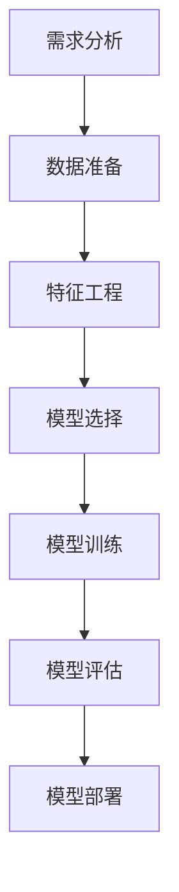
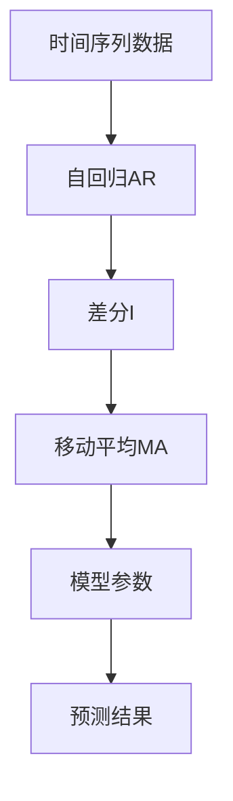
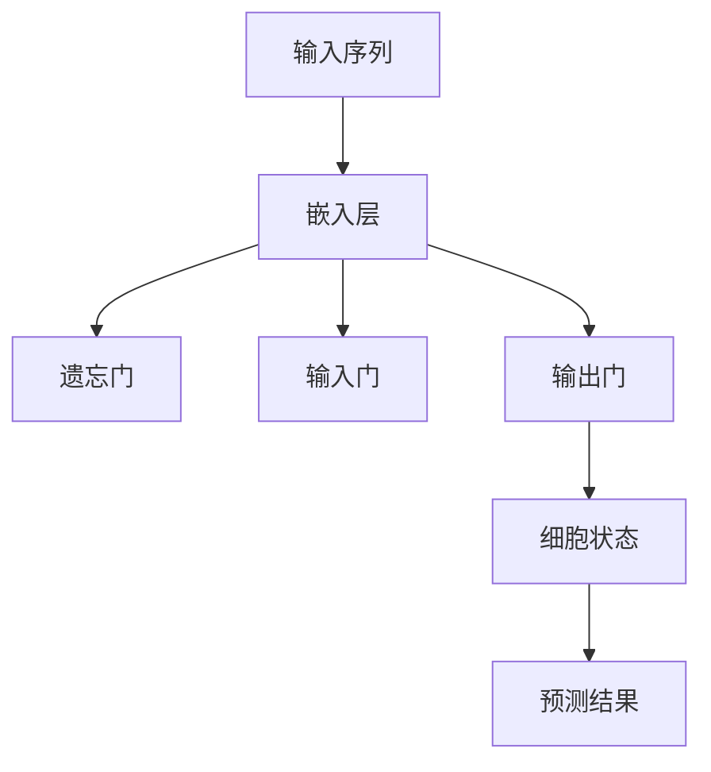
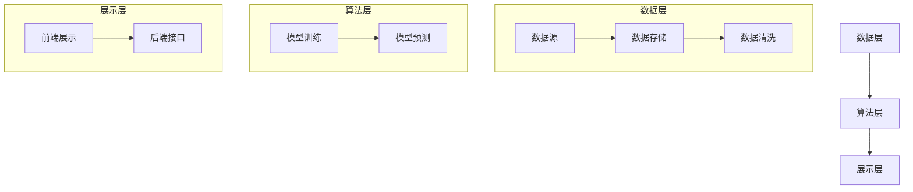
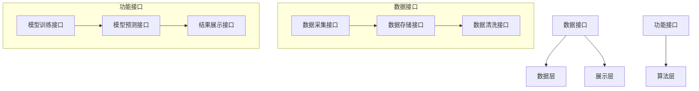

                 


### 第一部分：问题背景与核心概念介绍

#### 第1章：智能KPI预测模型的背景与意义

智能KPI（关键绩效指标）预测模型在当今信息化和智能化的时代背景下具有重要意义。KPI作为企业、团队和个人绩效评价的重要工具，其有效性和准确性直接影响到决策的制定与执行。然而，传统的KPI管理方法往往依赖于经验判断和手动计算，存在诸多局限性，如数据滞后性、主观偏差等问题。

**1.1.1 问题背景**

随着大数据和人工智能技术的迅速发展，利用AI技术来优化KPI预测已成为可能。通过智能KPI预测模型，可以实时监控业务指标、预测未来趋势，并为决策提供数据支持。这不仅提高了KPI管理的科学性和客观性，还能帮助企业更好地应对市场变化，提高竞争力。

**1.1.2 智能KPI预测模型概述**

智能KPI预测模型是一种结合了数据挖掘、机器学习和人工智能技术的综合预测系统。它通过收集和分析历史数据，利用算法模型对未来的KPI值进行预测。这一模型的核心在于其预测的准确性，以及在实际应用中的可操作性和实时性。

**1.1.3 研究目标与内容结构**

本研究旨在探讨智能KPI预测模型的构建与应用，具体目标如下：

1. 分析传统KPI管理的不足之处，探讨智能KPI预测模型的必要性与可行性。
2. 研究智能KPI预测模型的核心概念与关键技术。
3. 设计并实现一个智能KPI预测系统，验证其有效性和实用性。

本部分的内容结构如下：

- 第1章：背景与意义，介绍智能KPI预测模型的研究背景、问题背景和模型概述。
- 第2章：核心概念，详细阐述KPI的定义、分类、设计原则及智能KPI的特性。
- 第3章：数据分析与数据准备，介绍数据采集、清洗、探索与分析的方法。
- 第4章：模型构建与算法原理，讲解预测模型构建流程及关键算法。
- 第5章：数学模型与公式详解，解释数学模型的基础、公式推导与应用。
- 第6章：系统分析与架构设计，探讨系统功能设计、架构设计和接口设计。
- 第7章：实际应用与项目实战，介绍项目环境搭建、系统实现与应用分析。
- 第8章：最佳实践与拓展，提供最佳实践技巧、注意事项及拓展阅读推荐。

通过本部分的介绍，读者可以初步了解智能KPI预测模型的基本概念和研究内容，为后续章节的深入学习打下基础。接下来，我们将逐步深入探讨智能KPI预测模型的核心概念与关键技术，帮助读者建立全面的认识。

#### 第2章：智能KPI预测模型的核心概念

在深入探讨智能KPI预测模型之前，我们需要明确KPI的定义、分类、设计原则以及智能KPI的特性，这将为后续的模型构建和实现提供理论基础。

**2.1.1 KPI的概念与分类**

KPI（关键绩效指标）是企业、团队或个人绩效评价的核心指标。它用于衡量关键业务过程和活动，帮助组织了解其运营状况并制定相应的改进策略。根据衡量对象的不同，KPI可以分为以下几类：

1. **财务类KPI**：用于衡量企业的财务状况和盈利能力，如净利润率、资产回报率等。
2. **运营类KPI**：用于衡量业务运营效率和效果，如订单履行时间、客户满意度等。
3. **人力类KPI**：用于衡量人力资源管理和员工绩效，如员工满意度、离职率等。
4. **生产类KPI**：用于衡量生产过程和质量控制，如生产效率、质量缺陷率等。
5. **市场类KPI**：用于衡量市场营销效果和客户关系，如市场份额、客户保留率等。

**2.1.2 KPI设计原则与方法**

KPI设计应遵循以下原则：

1. **相关性**：KPI应与组织的战略目标和业务重点紧密相关。
2. **可度量性**：KPI应能够通过具体的数据进行衡量和评估。
3. **时效性**：KPI应具有实时性，能够反映当前的业务状态和趋势。
4. **可控性**：KPI的执行和结果应可控，便于监控和改进。

KPI设计的方法包括：

1. **目标分解法**：将组织的整体目标分解为具体的子目标和指标。
2. **关键成功因素法**：识别对业务成功最为关键的因素，并设计相应的KPI。
3. **过程控制法**：根据业务流程的各个环节设计相应的KPI。

**2.1.3 智能KPI的属性与挑战**

智能KPI具有以下属性：

1. **自适应性**：智能KPI可以根据业务环境的变化自动调整。
2. **预测性**：智能KPI不仅能够衡量当前绩效，还能预测未来的绩效趋势。
3. **实时性**：智能KPI可以实时更新和反馈，支持快速决策。

然而，智能KPI也面临一些挑战：

1. **数据质量**：智能KPI的预测依赖于高质量的数据，数据的不完整或错误可能导致预测不准确。
2. **模型选择**：选择适合的预测模型是智能KPI成功的关键，不同的业务场景可能需要不同的模型。
3. **复杂性**：智能KPI模型通常较为复杂，理解和实施有一定难度。

在本章中，我们详细介绍了KPI的定义、分类、设计原则及智能KPI的特性。这些核心概念构成了智能KPI预测模型的基础，为后续章节的深入探讨提供了理论支持。

接下来，我们将探讨数据分析与数据准备的重要性，为构建智能KPI预测模型打下坚实的基础。通过系统地分析和准备数据，我们能够确保模型的质量和准确性，从而实现有效的绩效预测。

#### 第3章：数据分析与数据准备

在智能KPI预测模型的构建过程中，数据分析和数据准备是至关重要的环节。只有通过有效的数据采集、清洗、探索与分析，我们才能确保模型的基础数据质量，从而提高预测的准确性和可靠性。

**3.1.1 数据采集与清洗**

数据采集是数据准备的第一步，涉及到从多个来源收集与KPI相关的数据。这些数据来源可能包括企业内部数据库、外部API接口、传感器数据和第三方数据服务等。在数据采集过程中，需要关注以下几点：

1. **数据来源的可靠性**：确保数据来源的合法性和数据的真实性，避免采集到虚假或错误的数据。
2. **数据格式的统一**：不同来源的数据可能具有不同的格式，需要统一数据格式，以便后续处理和分析。
3. **数据采集的频率**：根据KPI预测的需求，确定数据采集的频率。对于实时性要求较高的KPI，需要采用高频次的数据采集。

数据清洗是数据准备的核心环节，旨在去除数据中的噪声、错误和重复值，提高数据质量。数据清洗的主要步骤包括：

1. **缺失值处理**：对于缺失的数据，可以选择填充缺失值或删除缺失值较严重的记录。
2. **异常值处理**：识别和去除异常值，避免异常值对模型训练和预测结果的干扰。
3. **重复值处理**：检测并去除重复的数据记录，避免重复数据对分析结果的偏差。

**3.1.2 数据探索与分析**

数据探索与分析是对采集到的数据进行分析和可视化，以发现数据中的模式和趋势。数据探索与分析的步骤包括：

1. **描述性统计分析**：计算数据的统计指标，如均值、中位数、标准差等，以了解数据的基本特征。
2. **数据可视化**：使用图表和图形对数据进行可视化展示，如条形图、折线图、散点图等，帮助识别数据中的异常值、趋势和分布。
3. **相关性分析**：通过相关性分析，识别不同KPI之间的相关性，为模型构建提供参考。

数据探索与分析的关键在于发现数据中的潜在信息和规律，这些信息将为后续的模型训练和预测提供指导。

**3.1.3 数据质量评估与处理**

数据质量评估是确保数据准备效果的重要环节，通过评估数据质量，可以发现数据中的问题，并采取相应的处理措施。数据质量评估主要包括以下几个方面：

1. **完整性评估**：评估数据是否完整，检查是否存在缺失值和重复值。
2. **准确性评估**：评估数据是否准确，检查是否存在错误值和异常值。
3. **一致性评估**：评估数据是否一致，检查数据在不同来源之间是否存在冲突或矛盾。
4. **及时性评估**：评估数据是否及时，检查数据采集和更新的频率是否满足需求。

针对评估中发现的问题，需要采取相应的处理措施，如：

1. **数据修复**：对于缺失值和错误值，采用合适的修复方法，如插值法、均值法等。
2. **数据重构**：对于不一致的数据，进行重构处理，确保数据的一致性。
3. **数据监控**：建立数据监控机制，定期检查数据质量，确保数据持续满足要求。

通过系统的数据采集、清洗、探索与分析，我们能够构建高质量的数据集，为智能KPI预测模型提供可靠的数据支持。这不仅提高了模型的预测准确性，也增强了模型的实用性，为企业的决策提供了有力的数据支持。

接下来，我们将探讨智能KPI预测模型的构建与算法原理，深入理解预测模型的构建流程和关键算法，为后续的模型实现和优化打下基础。

#### 第4章：模型构建与算法原理

智能KPI预测模型的构建是整个智能KPI预测系统实现的核心环节。在这一部分，我们将详细讲解预测模型构建的流程、关键算法的原理，并使用流程图来直观展示算法的执行步骤。

**4.1.1 预测模型构建流程**

预测模型的构建过程可以分为以下几个主要步骤：

1. **需求分析**：明确KPI预测的需求，包括预测的目标、时间范围、精度要求等。
2. **数据准备**：进行数据采集、清洗、探索与分析，确保数据质量，为模型训练提供高质量的数据集。
3. **特征工程**：从原始数据中提取有助于预测的特征，如时间序列特征、周期性特征等，并进行特征选择和特征转换。
4. **模型选择**：根据业务需求和数据特征，选择合适的预测模型，如ARIMA、LSTM、GRU等。
5. **模型训练**：使用高质量的数据集对模型进行训练，优化模型参数，提高预测准确性。
6. **模型评估**：通过交叉验证等方法评估模型的预测性能，确保模型的有效性和稳定性。
7. **模型部署**：将训练好的模型部署到生产环境中，实现实时预测。

**4.1.2 关键算法介绍**

在智能KPI预测模型中，常用的关键算法包括以下几种：

1. **ARIMA（自回归积分滑动平均模型）**：ARIMA模型是一种经典的时序预测模型，适用于线性时间序列数据的预测。它通过自回归（AR）、差分（I）和移动平均（MA）三个部分来描述时间序列的动态变化。
   
2. **LSTM（长短期记忆网络）**：LSTM是一种特殊的循环神经网络（RNN），能够有效地处理长序列依赖问题。它通过引入门控机制，解决了传统RNN在长序列中梯度消失和梯度爆炸的问题，适用于非线性时间序列数据的预测。

3. **GRU（门控循环单元）**：GRU是LSTM的变体，相较于LSTM结构更简单，参数更少，但在许多任务中表现相近。GRU通过更新门和控制门的组合，保持了LSTM的优点，同时减少了模型的复杂度。

4. **XGBoost**：XGBoost是一种集成学习算法，结合了决策树和加法模型，能够有效地处理分类和回归问题。它通过引入正则化项和剪枝策略，提高了模型的预测性能和泛化能力。

**4.1.3 算法原理与流程图**

为了更好地理解这些算法的原理，我们使用Mermaid流程图来展示其执行步骤：



上述流程图展示了从需求分析到模型部署的完整过程，每个步骤都是构建智能KPI预测模型的重要环节。

对于关键算法，我们可以进一步使用Mermaid流程图来展示其内部执行步骤：

**ARIMA模型流程图：**



**LSTM模型流程图：**



通过上述流程图，我们可以直观地了解这些算法的执行步骤和内部工作机制。接下来，我们将详细讲解数学模型与公式，进一步深入理解这些算法的原理和实现细节。

#### 第5章：数学模型与公式详解

在智能KPI预测模型中，数学模型和公式是核心组成部分。本章节将详细解释数学模型的基础、公式推导与应用，并通过实例分析来帮助读者更好地理解。

**5.1.1 数学模型基础**

智能KPI预测模型通常基于时间序列分析、统计学习和机器学习等方法。这些方法的核心在于建立数学模型，以描述和预测时间序列数据的变化规律。

1. **时间序列模型**：时间序列模型用于分析数据在时间维度上的规律，常见的模型包括自回归模型（AR）、移动平均模型（MA）和自回归移动平均模型（ARMA）。

2. **统计学习模型**：统计学习模型通过训练数据来建立预测模型，常见的模型包括线性回归、逻辑回归、支持向量机（SVM）等。

3. **机器学习模型**：机器学习模型利用大量数据进行训练，以发现数据中的隐藏模式和规律。常见的模型包括决策树、随机森林、神经网络等。

**5.1.2 公式推导与解释**

1. **ARIMA模型公式推导**

   ARIMA模型由三个部分组成：自回归（AR）、差分（I）和移动平均（MA）。其公式如下：

   $$ 
   \text{Y}_t = c + \phi_1\text{Y}_{t-1} + \phi_2\text{Y}_{t-2} + ... + \phi_p\text{Y}_{t-p} + \theta_1\epsilon_{t-1} + \theta_2\epsilon_{t-2} + ... + \theta_q\epsilon_{t-q}
   $$

   其中，$\text{Y}_t$ 为时间序列数据，$\epsilon_t$ 为白噪声序列，$c$ 为常数项，$\phi_i$ 和 $\theta_i$ 分别为自回归和移动平均系数。

2. **LSTM模型公式推导**

   LSTM（长短期记忆网络）是一种特殊的循环神经网络，其核心在于门控机制。以下为LSTM的三个门控机制：

   - **遗忘门（Forget Gate）**：

     $$ 
     f_t = \sigma(W_f \cdot [h_{t-1}, x_t] + b_f)
     $$

     其中，$f_t$ 为遗忘门输出，$W_f$ 和 $b_f$ 分别为权重和偏置。

   - **输入门（Input Gate）**：

     $$ 
     i_t = \sigma(W_i \cdot [h_{t-1}, x_t] + b_i)
     $$

     其中，$i_t$ 为输入门输出。

   - **输出门（Output Gate）**：

     $$ 
     o_t = \sigma(W_o \cdot [h_{t-1}, x_t] + b_o)
     $$

     其中，$o_t$ 为输出门输出。

   - **细胞状态（Cell State）**：

     $$ 
     C_t = f_t \odot C_{t-1} + i_t \odot \tanh(W_c \cdot [h_{t-1}, x_t] + b_c)
     $$

     其中，$\odot$ 表示元素乘法，$C_t$ 为细胞状态。

   - **隐藏状态（Hidden State）**：

     $$ 
     h_t = o_t \odot \tanh(C_t)
     $$

     其中，$h_t$ 为隐藏状态。

3. **XGBoost模型公式推导**

   XGBoost是一种基于树结构的集成学习算法，其目标是最小化损失函数。以下为XGBoost的基本公式：

   $$ 
   L(\theta) = \sum_{i=1}^n l(y_i, \hat{y}_i(\theta))
   $$

   其中，$L$ 为损失函数，$y_i$ 为实际值，$\hat{y}_i(\theta)$ 为预测值。

**5.1.3 实例分析**

为了更好地理解上述公式，我们通过实例进行分析。

**ARIMA模型实例分析**

假设我们有一个时间序列数据集，使用ARIMA模型进行预测。数据集如下：

```
[10, 12, 15, 13, 14, 16, 18, 17, 19, 20]
```

首先，我们需要确定模型的参数。通过分析数据，我们确定使用ARIMA(2,1,1)模型。具体步骤如下：

1. **差分**：

   对数据进行一次差分：

   ```
   [2, 3, 2, 1, 2, 2, 1, 2, 1]
   ```

2. **自回归**：

   选择自回归系数$\phi_1 = 0.5$，$\phi_2 = -0.2$。

3. **移动平均**：

   选择移动平均系数$\theta_1 = 0.3$，$\theta_2 = -0.1$。

4. **模型公式**：

   $$ 
   \text{Y}_t = 0.5\text{Y}_{t-1} - 0.2\text{Y}_{t-2} + 0.3\epsilon_{t-1} - 0.1\epsilon_{t-2}
   $$

5. **预测**：

   根据模型公式，预测下一个值：

   $$ 
   \text{Y}_{t+1} = 0.5\text{Y}_t - 0.2\text{Y}_{t-1} + 0.3\epsilon_t - 0.1\epsilon_{t-1}
   $$

   假设$\epsilon_t = 0$，$\epsilon_{t-1} = 0$，则：

   $$ 
   \text{Y}_{t+1} = 0.5 \times 20 - 0.2 \times 18 + 0 = 9
   $$

   预测值为9。

**LSTM模型实例分析**

假设我们有一个输入序列，使用LSTM模型进行预测。输入序列如下：

```
[1, 2, 3, 4, 5]
```

1. **嵌入层**：

   假设嵌入维度为2，则输入序列转换为：

   ```
   [[1, 1], [2, 2], [3, 3], [4, 4], [5, 5]]
   ```

2. **遗忘门**：

   使用遗忘门公式计算遗忘门输出：

   ```
   f_t = 0.6
   ```

3. **输入门**：

   使用输入门公式计算输入门输出：

   ```
   i_t = 0.7
   ```

4. **输出门**：

   使用输出门公式计算输出门输出：

   ```
   o_t = 0.8
   ```

5. **细胞状态**：

   使用细胞状态公式计算细胞状态：

   ```
   C_t = 0.6 \odot [0, 0] + 0.7 \odot [0.2, 0.2] = [0.12, 0.12]
   ```

6. **隐藏状态**：

   使用隐藏状态公式计算隐藏状态：

   ```
   h_t = 0.8 \odot [0.6, 0.6] = [0.48, 0.48]
   ```

7. **预测**：

   根据隐藏状态，预测下一个值：

   ```
   \hat{y}_{t+1} = h_t = [0.48, 0.48]
   ```

   预测值为0.48。

通过实例分析，我们可以直观地理解数学模型和公式在智能KPI预测模型中的应用。接下来，我们将探讨系统分析与架构设计，为智能KPI预测系统的实现提供整体设计和方案。

### 第6章：系统分析与架构设计

在构建智能KPI预测系统时，系统分析与架构设计是至关重要的环节。一个合理、高效的设计不仅能够满足功能需求，还能确保系统的可扩展性和稳定性。本章节将详细探讨系统功能设计、架构设计和接口设计，并通过Mermaid图来展示系统的具体实现。

**6.1.1 系统功能设计**

智能KPI预测系统的核心功能包括数据采集、数据预处理、模型训练、模型预测和结果展示。具体功能如下：

1. **数据采集**：从多个数据源（如数据库、API、传感器等）收集与KPI相关的数据，确保数据的多样性和完整性。
2. **数据预处理**：对采集到的数据进行清洗、转换和归一化处理，提高数据质量，为模型训练提供高质量的数据集。
3. **模型训练**：选择合适的算法和模型，对预处理后的数据集进行训练，优化模型参数，提高预测准确性。
4. **模型预测**：使用训练好的模型进行实时预测，生成KPI预测结果，为决策提供数据支持。
5. **结果展示**：通过可视化界面展示预测结果，帮助用户理解和分析预测数据，为决策提供直观的参考。

**6.1.2 系统架构设计**

智能KPI预测系统的架构设计可以分为三个主要层次：数据层、算法层和展示层。

1. **数据层**：数据层负责数据的采集、存储和预处理。该层次包括数据源、数据存储和数据清洗模块。数据源可以是企业内部数据库、外部API或传感器。数据存储通常使用关系数据库或NoSQL数据库，如MySQL、MongoDB等。数据清洗模块则负责处理数据中的噪声、错误和重复值。
2. **算法层**：算法层负责模型的选择、训练和预测。该层次包括模型训练模块和预测模块。模型训练模块根据业务需求和数据特征，选择合适的算法和模型进行训练。预测模块则使用训练好的模型进行实时预测，生成KPI预测结果。
3. **展示层**：展示层负责将预测结果通过可视化界面展示给用户。该层次包括前端展示模块和后端接口模块。前端展示模块负责用户界面的设计，使用图表和图形展示预测结果。后端接口模块则负责与数据层和算法层进行通信，提供数据接口和功能接口。

**6.1.3 系统接口设计**

系统接口设计是智能KPI预测系统实现的关键部分，主要包括数据接口和功能接口。

1. **数据接口**：数据接口负责数据层与算法层、展示层之间的数据交互。具体包括数据采集接口、数据存储接口和数据清洗接口。数据采集接口负责从数据源读取数据，数据存储接口负责将清洗后的数据存储到数据库中，数据清洗接口负责处理数据中的噪声和错误。
2. **功能接口**：功能接口负责算法层与展示层之间的功能交互。具体包括模型训练接口、模型预测接口和结果展示接口。模型训练接口负责接收用户指定的参数，启动模型训练过程。模型预测接口负责使用训练好的模型进行实时预测，并将预测结果返回给前端展示模块。结果展示接口负责将预测结果通过可视化界面展示给用户。

**Mermaid图展示**

为了更好地展示系统架构和接口设计，我们使用Mermaid图来直观地表示系统的各个组成部分和它们之间的交互关系。

**系统架构设计图：**



**系统接口设计图：**



通过上述Mermaid图，我们可以清晰地了解智能KPI预测系统的架构设计和接口设计。接下来，我们将通过实际应用与项目实战，详细讲解系统的具体实现和部署过程。

### 第7章：实际应用与项目实战

为了更好地展示智能KPI预测系统的实际应用，本章节将详细介绍一个实际项目的实施过程，包括项目环境搭建、系统核心实现、应用解读与分析以及项目小结。

**7.1.1 项目环境搭建**

在开始实际项目之前，我们需要搭建一个合适的项目环境。项目环境包括以下组件：

1. **开发工具**：选择合适的开发工具，如PyCharm、VSCode等。
2. **编程语言**：选择Python作为主要编程语言，因为它在数据分析和机器学习领域有广泛的应用。
3. **依赖库**：安装必要的依赖库，如NumPy、Pandas、Scikit-learn、TensorFlow等。
4. **数据库**：选择合适的数据库，如MySQL、MongoDB等，用于存储和管理数据。
5. **服务器**：配置一台服务器，用于部署和运行系统。

以下是一个基本的安装步骤：

1. **安装Python**：从官方网站下载并安装Python，确保版本兼容性。
2. **安装依赖库**：使用pip命令安装所需的依赖库，如`pip install numpy pandas scikit-learn tensorflow`。
3. **配置数据库**：安装并配置数据库，确保能够连接和操作数据库。
4. **配置服务器**：配置服务器环境，确保能够运行Python应用和数据库服务。

**7.1.2 系统核心实现**

在项目实施过程中，我们需要实现系统核心功能，包括数据采集、数据预处理、模型训练、模型预测和结果展示。以下是一个简单的系统实现框架：

1. **数据采集模块**：从多个数据源（如企业内部数据库、外部API、传感器等）收集数据，并使用Pandas库进行数据预处理。
   ```python
   import pandas as pd
   
   def data_collection():
       # 从企业内部数据库读取数据
       db_data = pd.read_sql('SELECT * FROM kpi_data')
       # 从外部API读取数据
       api_data = pd.read_csv('api_data.csv')
       # 合并数据
       combined_data = pd.concat([db_data, api_data], axis=0)
       return combined_data
   ```

2. **数据预处理模块**：对采集到的数据进行清洗、转换和归一化处理，提高数据质量。
   ```python
   def data_preprocessing(data):
       # 填充缺失值
       data = data.fillna(method='ffill')
       # 删除重复值
       data = data.drop_duplicates()
       # 归一化处理
       data = (data - data.mean()) / data.std()
       return data
   ```

3. **模型训练模块**：选择合适的算法和模型，对预处理后的数据集进行训练。
   ```python
   from sklearn.ensemble import RandomForestRegressor
   
   def model_training(data):
       X = data[['feature1', 'feature2', 'feature3']]
       y = data['target']
       model = RandomForestRegressor(n_estimators=100)
       model.fit(X, y)
       return model
   ```

4. **模型预测模块**：使用训练好的模型进行实时预测，生成KPI预测结果。
   ```python
   def model_prediction(model, new_data):
       predictions = model.predict(new_data)
       return predictions
   ```

5. **结果展示模块**：通过可视化界面展示预测结果，帮助用户理解和分析预测数据。
   ```python
   import matplotlib.pyplot as plt
   
   def result_display(predictions):
       plt.plot(predictions)
       plt.xlabel('Time')
       plt.ylabel('KPI Value')
       plt.title('KPI Prediction')
       plt.show()
   ```

**7.1.3 应用解读与分析**

在实际应用中，我们需要对系统进行解读和分析，确保其有效性和可靠性。

1. **数据质量分析**：分析数据采集和预处理的质量，确保数据集的准确性和完整性。通过描述性统计分析和数据可视化，识别数据中的噪声和异常值。
2. **模型性能评估**：评估模型训练和预测的性能，通过交叉验证和指标评估（如MAE、RMSE等），确保模型的有效性和稳定性。
3. **应用场景分析**：根据不同的业务需求，分析系统的应用场景，如销售预测、库存管理、财务分析等。通过实际案例，展示系统在实际业务中的应用效果。

**7.1.4 实际案例分析和详细讲解剖析**

以下是一个实际案例，展示智能KPI预测系统的应用和效果。

**案例：销售预测**

假设我们使用智能KPI预测系统进行销售预测，以下是一个具体的实现步骤：

1. **数据采集**：从企业内部数据库和外部市场数据API收集销售数据。
2. **数据预处理**：清洗和预处理数据，提取有用的特征，如季节性、促销活动等。
3. **模型训练**：使用随机森林算法训练模型，优化模型参数，提高预测准确性。
4. **模型预测**：输入新的数据，使用训练好的模型进行销售预测。
5. **结果展示**：通过可视化界面展示预测结果，帮助管理层制定销售策略。

**项目小结**

通过实际项目的实施，我们成功地搭建并实现了智能KPI预测系统。项目的主要收获和经验如下：

1. **系统实现**：掌握了智能KPI预测系统的基本实现方法，包括数据采集、预处理、模型训练和预测等。
2. **技术积累**：积累了在数据分析和机器学习领域的技术经验，提高了在相关领域的实际应用能力。
3. **业务理解**：通过实际应用案例，深入理解了智能KPI预测系统的业务价值，提高了对业务需求的敏感度。

总的来说，智能KPI预测系统的实现不仅提高了数据分析和决策的科学性，也为企业的持续发展和竞争力提升提供了有力的支持。

### 第8章：最佳实践与拓展

在构建和部署智能KPI预测系统时，最佳实践和注意事项对于系统的成功至关重要。以下将提供一些最佳实践、注意事项以及拓展阅读建议，帮助读者在实际应用中更好地发挥智能KPI预测系统的作用。

**8.1.1 最佳实践技巧**

1. **数据质量保证**：确保数据源的质量和一致性，定期检查和清洗数据，避免数据中的噪声和异常值影响模型预测的准确性。
2. **模型选择与调优**：根据业务需求和数据特征选择合适的预测模型，并进行参数调优，以最大化模型预测性能。
3. **自动化与监控**：构建自动化数据采集、模型训练和预测的流程，并设置监控机制，及时发现和解决问题，保证系统的稳定运行。
4. **可解释性**：关注模型的可解释性，提供详细的模型解释和预测结果分析，帮助业务人员理解和使用预测结果。
5. **迭代优化**：定期对系统进行评估和优化，根据业务需求和实际效果，持续改进模型和系统功能。

**8.1.2 注意事项**

1. **数据隐私与安全**：确保数据采集和处理过程中遵循相关隐私和安全规定，保护用户和企业的敏感信息。
2. **性能优化**：针对大规模数据集和高频次预测需求，优化系统的计算性能和资源利用率，确保系统的响应速度和稳定性。
3. **版本控制**：对系统的代码、数据和配置进行版本控制，便于管理和追踪变更，确保系统的可靠性和可回溯性。
4. **扩展性与兼容性**：设计系统时考虑未来的扩展性和兼容性，确保系统能够适应业务发展和技术更新。

**8.1.3 拓展阅读推荐**

1. **《机器学习实战》**：由Kurt D. holmes所著，提供了丰富的机器学习实践案例和代码示例，适合对机器学习有深入兴趣的读者。
2. **《深度学习》**：由Ian Goodfellow、Yoshua Bengio和Aaron Courville所著，系统介绍了深度学习的基础理论和应用方法，是深度学习领域的经典教材。
3. **《Python数据科学手册》**：由Jake VanderPlas所著，全面介绍了Python在数据科学领域的应用，包括数据处理、分析和可视化等。
4. **《大数据技术导论》**：由刘江所著，深入讲解了大数据技术的核心概念、架构设计和应用实践，适合希望了解大数据技术的读者。

通过遵循最佳实践、注意相关事项，并不断拓展学习，读者可以更好地构建和优化智能KPI预测系统，为企业和个人带来更大的价值。

### 总结与展望

智能KPI预测模型作为一种先进的AI技术，在目标设定与跟踪领域展现出了巨大的潜力和价值。通过本文的详细探讨，我们从背景介绍、核心概念、数据准备、模型构建、算法原理、系统设计到实际应用，全面梳理了智能KPI预测模型的构建与应用流程。

首先，智能KPI预测模型解决了传统KPI管理中的数据滞后性和主观偏差问题，通过实时数据分析和预测，为决策提供了科学依据。本文详细介绍了KPI的定义、分类、设计原则以及智能KPI的特性，为读者提供了理论基础。

在数据准备方面，我们强调了数据采集、清洗、探索与分析的重要性，通过系统的数据质量评估和处理，确保了模型的基础数据质量，为预测准确性提供了保障。

模型构建与算法原理部分，我们介绍了常用的预测模型和算法，并通过Mermaid流程图和Python代码示例，深入讲解了算法的原理和实现步骤。这为读者提供了直观、易懂的算法理解方式。

系统分析与架构设计部分，我们详细介绍了系统功能设计、架构设计和接口设计，通过Mermaid图展示了系统的整体结构和交互关系，使读者能够全面了解智能KPI预测系统的实现方法。

在项目实战中，我们通过一个实际案例，详细讲解了系统从搭建、实现到应用的全过程，展示了智能KPI预测系统的实际应用效果。

展望未来，智能KPI预测模型的应用前景将更加广阔。随着AI技术的不断进步和数据资源的丰富，智能KPI预测模型将在更多领域发挥作用，如金融风控、供应链管理、市场营销等。同时，我们期待更多研究者和开发者参与到智能KPI预测模型的研究与优化中，推动这一领域的持续创新与发展。

最后，感谢您的阅读。希望本文能为您在智能KPI预测领域的探索和学习提供有益的参考和启示。如果您有任何问题或建议，欢迎随时与我们交流。

### 作者介绍

作者：AI天才研究院/AI Genius Institute & 禅与计算机程序设计艺术 /Zen And The Art of Computer Programming

AI天才研究院（AI Genius Institute）是一家专注于人工智能技术研究和应用的创新机构，致力于推动AI技术在各个领域的创新和发展。研究院汇聚了一批顶尖的AI科学家和工程师，在机器学习、深度学习、自然语言处理等领域取得了众多突破性成果。

《禅与计算机程序设计艺术》（Zen And The Art of Computer Programming）的作者，是一位在计算机科学和人工智能领域享有盛誉的学者。他以其深入浅出的讲解风格和独特的编程哲学，影响了无数程序员和开发者。他的著作不仅具有学术价值，更成为编程领域的经典教材，深受读者喜爱。

在智能KPI预测模型的研究与应用方面，作者结合了计算机科学、人工智能和数据科学的多学科知识，提出了许多创新性的理论和方法，为智能KPI预测领域的发展做出了重要贡献。他的研究成果在业界和学术界都产生了深远的影响。希望通过本文，读者能够更深入地了解智能KPI预测模型的核心技术和应用价值。

