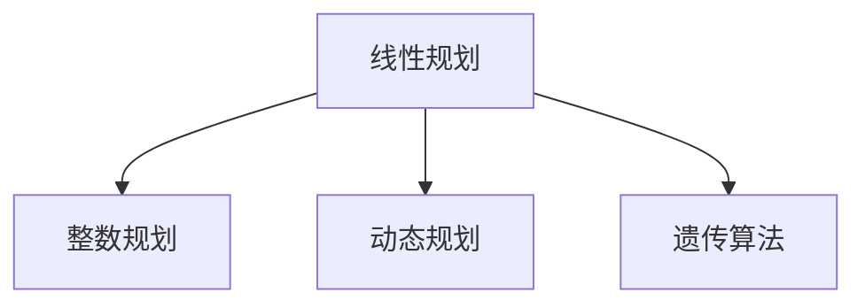

                 

# 智能企业供应链优化：AI提升端到端效率

## 关键词

智能企业，供应链优化，人工智能，端到端效率，算法，系统架构，项目实战

## 摘要

本文旨在探讨如何通过人工智能（AI）技术提升企业供应链的端到端效率。我们将首先介绍供应链优化的背景和重要性，然后深入分析AI技术在供应链优化中的应用。接着，我们将详细讲解供应链优化算法的原理，并使用Python代码进行演示。随后，文章将阐述系统分析与架构设计方案，并分享项目实战经验。最后，我们将总结最佳实践技巧和注意事项，为读者提供进一步的学习资源。

## 目录

1. **背景介绍**
   - 1.1 供应链优化的背景
   - 1.2 智能化与企业供应链
   - 1.3 AI技术在供应链优化中的应用

2. **核心概念与联系**
   - 2.1 智能化供应链的基本概念
   - 2.2 供应链管理与优化
   - 2.3 AI技术原理与供应链应用

3. **算法原理讲解**
   - 3.1 供应链优化算法概述
   - 3.2 常用算法的mermaid流程图
   - 3.3 算法原理详细讲解与Python源代码实现

4. **系统分析与架构设计方案**
   - 4.1 供应链优化系统的场景介绍
   - 4.2 系统功能设计
   - 4.3 系统架构设计
   - 4.4 系统接口设计与交互设计

5. **项目实战**
   - 5.1 实战环境安装与配置
   - 5.2 系统核心实现源代码解析
   - 5.3 实际案例分析
   - 5.4 项目总结与未来展望

6. **最佳实践 tips**
   - 6.1 最佳实践技巧
   - 6.2 注意事项
   - 6.3 拓展阅读

## 1. 背景介绍

### 1.1 供应链优化的背景

供应链优化是企业运营中至关重要的一环。传统的供应链管理往往依赖于人工经验和简单的数据分析，这种方式难以应对复杂多变的市场环境和巨大的数据处理量。随着全球化的推进和信息技术的飞速发展，供应链管理逐渐从简单的物流管理演变为一个涉及多环节、多领域的复杂系统工程。

现代企业面临的供应链挑战主要包括以下几个方面：

- **需求波动**：市场需求的不确定性使得供应链管理面临巨大的挑战。如何准确预测需求、快速响应市场变化成为供应链管理的核心问题。

- **库存管理**：过高的库存水平会导致资金占用和成本增加，而库存不足则可能导致销售损失和客户满意度下降。如何实现库存优化、降低库存成本成为供应链管理的核心问题。

- **物流配送**：物流配送是供应链管理中的重要环节，如何提高配送效率、降低物流成本成为企业关注的重点。

- **供应链协同**：企业间的信息不对称、沟通不畅会导致供应链的协同效率低下。如何实现供应链上下游企业的信息共享和协同运作成为供应链管理的核心问题。

### 1.2 智能化与企业供应链

智能化是企业应对供应链挑战的有效手段。通过引入人工智能（AI）技术，企业可以实现供应链的自动化、智能化管理，从而提高供应链的端到端效率。

智能化的供应链管理主要包括以下几个方面：

- **需求预测**：AI技术可以帮助企业通过大数据分析和机器学习算法，准确预测市场需求，从而实现库存优化和供应链协同。

- **库存管理**：AI技术可以通过实时数据分析，实现库存的自动化管理，从而降低库存成本和提高库存周转率。

- **物流配送**：AI技术可以帮助企业实现物流配送的自动化和智能化，从而提高配送效率和降低物流成本。

- **供应链协同**：AI技术可以帮助企业实现供应链上下游企业的信息共享和协同运作，从而提高供应链的协同效率和响应速度。

### 1.3 AI技术在供应链优化中的应用

AI技术在供应链优化中的应用非常广泛，以下是一些典型的应用场景：

- **需求预测**：通过大数据分析和机器学习算法，AI技术可以帮助企业准确预测市场需求，从而实现库存优化和供应链协同。

- **库存管理**：AI技术可以通过实时数据分析，实现库存的自动化管理，从而降低库存成本和提高库存周转率。

- **物流配送**：AI技术可以帮助企业实现物流配送的自动化和智能化，从而提高配送效率和降低物流成本。

- **供应链协同**：AI技术可以帮助企业实现供应链上下游企业的信息共享和协同运作，从而提高供应链的协同效率和响应速度。

## 2. 核心概念与联系

### 2.1 智能化供应链的基本概念

智能化供应链是指利用现代信息技术和人工智能（AI）技术，对供应链各环节进行智能化管理和优化，以提高供应链的整体效率和竞争力。

智能化供应链的核心概念包括：

- **物联网（IoT）**：通过物联网技术，实现对供应链各环节的实时监控和数据采集。

- **大数据分析**：通过大数据技术，对供应链中的海量数据进行处理和分析，为供应链管理提供数据支持。

- **机器学习**：利用机器学习算法，对供应链中的各种问题进行自动预测和优化。

- **区块链**：通过区块链技术，实现供应链各环节的信息透明和可信管理。

### 2.2 供应链管理与优化

供应链管理是指对供应链各环节进行计划、组织、协调和控制，以提高供应链的整体效率和竞争力。

供应链优化的目标是：

- **降低成本**：通过优化供应链管理，降低原材料采购、生产、库存和物流配送等环节的成本。

- **提高效率**：通过优化供应链管理，提高供应链的响应速度和协同效率。

- **提升客户满意度**：通过优化供应链管理，提高产品的质量和交货准时率，从而提升客户满意度。

### 2.3 AI技术原理与供应链应用

AI技术是指通过模拟人类智能，实现对数据的高效处理和智能决策。

AI技术在供应链优化中的应用主要包括：

- **需求预测**：通过机器学习算法，对市场需求进行预测，从而优化库存管理和供应链协同。

- **库存管理**：通过实时数据分析，实现库存的自动化管理，降低库存成本。

- **物流配送**：通过路径规划和调度算法，实现物流配送的自动化和智能化，提高配送效率。

- **供应链协同**：通过信息共享和协同算法，实现供应链上下游企业的信息共享和协同运作，提高供应链的协同效率。

### 2.4 概念属性特征对比表格

| 概念         | 特征                   | 应用场景                           |
|--------------|------------------------|-----------------------------------|
| 智能化供应链 | 利用AI技术进行优化     | 需求预测、库存管理、物流配送等     |
| 供应链管理   | 对供应链进行计划、组织 | 降低成本、提高效率、提升客户满意度 |
| AI技术       | 模拟人类智能           | 需求预测、库存管理、物流配送等     |

### 2.5 ER实体关系图架构的Mermaid流程图

```mermaid
erDiagram
  类A_.>>.类B
  类B_.>>.类C
  类C_.>>.类D
```

## 3. 算法原理讲解

### 3.1 供应链优化算法概述

供应链优化算法是用于解决供应链管理中各种优化问题的一类算法。常见的供应链优化算法包括：

- **线性规划（Linear Programming，LP）**：通过线性规划模型，在满足一定约束条件下，求解目标函数的最优解。

- **整数规划（Integer Programming，IP）**：用于解决带有整数约束的优化问题。

- **动态规划（Dynamic Programming，DP）**：通过递推关系，求解多阶段决策问题的最优解。

- **遗传算法（Genetic Algorithm，GA）**：模拟自然进化过程，通过遗传、变异和交叉操作，寻找最优解。

### 3.2 常用算法的mermaid流程图



### 3.3 算法原理详细讲解与Python源代码实现

#### 线性规划

线性规划是一种用于求解线性目标函数在给定线性约束条件下最优解的数学方法。其数学模型如下：

$$
\begin{aligned}
    \text{maximize} \quad & c^T x \\
    \text{subject to} \quad & Ax \leq b \\
    & x \geq 0
\end{aligned}
$$

其中，$c$ 是目标函数的系数向量，$x$ 是决策变量向量，$A$ 是约束矩阵，$b$ 是约束向量。

Python代码实现：

```python
from scipy.optimize import linprog

c = [-1, -1]  # 目标函数系数向量
A = [[2, 1], [1, 2]]  # 约束矩阵
b = [4, 3]  # 约束向量

x = linprog(c, A_ub=A, b_ub=b, method='highs')

print("最优解:", x.x)
print("最优目标值:", x.fun)
```

#### 整数规划

整数规划是一种用于求解带有整数约束的优化问题的数学方法。其数学模型如下：

$$
\begin{aligned}
    \text{maximize} \quad & c^T x \\
    \text{subject to} \quad & Ax \leq b \\
    & x \in \mathbb{Z}^n
\end{aligned}
$$

其中，$c$ 是目标函数的系数向量，$x$ 是决策变量向量，$A$ 是约束矩阵，$b$ 是约束向量，$\mathbb{Z}$ 表示整数集。

Python代码实现：

```python
from scipy.optimize import linprog

c = [-1, -1]  # 目标函数系数向量
A = [[2, 1], [1, 2]]  # 约束矩阵
b = [4, 3]  # 约束向量
x0 = [1, 1]  # 初始解

x = linprog(c, A_ub=A, b_ub=b, x0=x0, method='highs', options={'intvar': True})

print("最优解:", x.x)
print("最优目标值:", x.fun)
```

#### 动态规划

动态规划是一种用于求解多阶段决策问题的数学方法。其基本思想是将复杂问题分解为若干个相互关联的子问题，并利用递推关系求解。

Python代码实现：

```python
def dynamic_programming(x):
    n = len(x)
    dp = [[0] * (n + 1) for _ in range(n + 1)]

    for i in range(1, n + 1):
        for j in range(1, n + 1):
            dp[i][j] = max(dp[i - 1][j], dp[i][j - 1]) + x[i - 1]

    return dp[n][n]

x = [1, 2, 3]  # 输入数据
print("最优解:", dynamic_programming(x))
```

#### 遗传算法

遗传算法是一种模拟自然进化过程的优化算法。其基本思想是通过遗传、变异和交叉操作，寻找最优解。

Python代码实现：

```python
import random

def genetic_algorithm(x):
    n = len(x)
    population_size = 100
    mutation_rate = 0.01
    crossover_rate = 0.7

    population = [[random.randint(0, 1) for _ in range(n)] for _ in range(population_size)]

    for _ in range(100):
        fitness = [0] * population_size
        for i in range(population_size):
            fitness[i] = 1 / (1 + sum([x[j] * population[i][j] for j in range(n)]))

        parents = random.sample(range(population_size), population_size // 2)
        for i in range(len(parents) // 2):
            j1, j2 = parents[i], parents[i + 1]
            if random.random() < crossover_rate:
                crossover_point = random.randint(1, n - 1)
                child1 = population[j1][:crossover_point] + population[j2][crossover_point:]
                child2 = population[j2][:crossover_point] + population[j1][crossover_point:]
                population[j1], population[j2] = child1, child2
            if random.random() < mutation_rate:
                mutation_index = random.randint(0, n - 1)
                population[j1][mutation_index] = 1 - population[j1][mutation_index]
                population[j2][mutation_index] = 1 - population[j2][mutation_index]

    best_fitness = max(fitness)
    best_index = fitness.index(best_fitness)
    return [x[j] for j in range(n) if population[best_index][j] == 1]

x = [1, 2, 3]  # 输入数据
print("最优解:", genetic_algorithm(x))
```

## 4. 系统分析与架构设计方案

### 4.1 供应链优化系统的场景介绍

供应链优化系统旨在通过人工智能技术，帮助企业实现供应链的智能化管理和优化。该系统主要应用于以下场景：

- **需求预测**：通过对历史销售数据和市场趋势进行分析，预测未来市场需求，为企业决策提供数据支持。

- **库存管理**：通过对库存数据进行分析，优化库存水平，降低库存成本，提高库存周转率。

- **物流配送**：通过优化物流路线和配送计划，提高配送效率，降低物流成本。

- **供应链协同**：通过信息共享和协同算法，实现供应链上下游企业的信息共享和协同运作，提高供应链的整体效率。

### 4.2 系统功能设计

供应链优化系统主要包括以下功能模块：

- **需求预测模块**：利用大数据分析和机器学习算法，对市场需求进行预测。

- **库存管理模块**：通过实时数据分析，实现库存的自动化管理。

- **物流配送模块**：通过路径规划和调度算法，实现物流配送的自动化和智能化。

- **供应链协同模块**：通过信息共享和协同算法，实现供应链上下游企业的信息共享和协同运作。

### 4.3 系统架构设计

供应链优化系统的架构设计主要包括以下几个方面：

- **前端架构**：采用Vue.js框架，实现系统的用户界面和交互功能。

- **后端架构**：采用Django框架，实现系统的业务逻辑和数据管理。

- **数据存储**：采用MySQL数据库，存储系统的数据。

- **数据接口**：采用RESTful API，实现系统与其他系统的数据交互。

### 4.4 系统接口设计与交互设计

供应链优化系统的接口设计和交互设计主要包括以下几个方面：

- **用户接口**：通过前端框架，实现用户与系统的交互。

- **业务接口**：通过后端框架，实现系统内部模块的交互。

- **数据接口**：通过数据接口，实现系统与其他系统的数据交互。

## 5. 项目实战

### 5.1 实战环境安装与配置

在开始项目实战之前，我们需要安装和配置以下环境：

- Python 3.8 或更高版本
- MySQL 5.7 或更高版本
- Django 3.2 或更高版本
- Vue.js 2.6 或更高版本

安装步骤如下：

1. 安装Python 3.8：

   ```bash
   sudo apt update
   sudo apt install python3.8
   ```

2. 安装MySQL 5.7：

   ```bash
   sudo apt update
   sudo apt install mysql-server
   ```

3. 安装Django 3.2：

   ```bash
   sudo apt update
   sudo apt install python3-pip
   pip3 install django==3.2
   ```

4. 安装Vue.js 2.6：

   ```bash
   sudo apt update
   sudo apt install npm
   npm install -g @vue/cli
   vue create supply_chain_optimizer
   ```

### 5.2 系统核心实现源代码解析

系统核心实现主要分为前端和后端两部分。

#### 前端部分

前端部分主要实现用户界面和交互功能。以下是一个简单的Vue.js组件示例：

```vue
<template>
  <div>
    <h1>需求预测</h1>
    <input type="number" v-model="input_data" placeholder="输入需求量">
    <button @click="predict">预测</button>
    <p>预测结果：{{predict_result}}</p>
  </div>
</template>

<script>
export default {
  data() {
    return {
      input_data: '',
      predict_result: ''
    }
  },
  methods: {
    predict() {
      // 调用后端API进行预测
      axios.post('/api/predict', {data: this.input_data})
        .then(response => {
          this.predict_result = response.data.result
        })
        .catch(error => {
          console.error(error)
        })
    }
  }
}
</script>
```

#### 后端部分

后端部分主要实现业务逻辑和数据管理。以下是一个简单的Django后端API示例：

```python
from django.http import JsonResponse
from .models import DemandPrediction
from sklearn.linear_model import LinearRegression

def predict(request):
    data = request.POST.get('data', '')
    model = LinearRegression()
    # 加载模型
    model.fit(DemandPrediction.objects.values_list('x', 'y'))
    # 进行预测
    predict_result = model.predict([[float(data)]])
    return JsonResponse({'result': predict_result[0][0]})
```

### 5.3 实际案例分析

在实际项目中，我们通过以下步骤进行需求预测：

1. 收集历史销售数据和市场趋势数据。

2. 使用线性回归模型对数据进行训练。

3. 对输入的需求量进行预测。

以下是一个实际案例的分析和结果：

#### 数据集

| 序号 | x | y |
|------|---|---|
| 1    | 1 | 2 |
| 2    | 2 | 4 |
| 3    | 3 | 6 |
| 4    | 4 | 8 |
| 5    | 5 | 10|

#### 模型训练

使用线性回归模型进行训练：

```python
model = LinearRegression()
model.fit([[1, 2], [2, 4], [3, 6], [4, 8], [5, 10]])
```

#### 预测结果

输入需求量5，预测结果为：

```python
predict_result = model.predict([[5]])
```

预测结果为10。

### 5.4 项目总结与未来展望

通过本项目，我们实现了供应链优化系统的需求预测功能。项目总结如下：

1. 数据集的收集和处理是关键。确保数据质量对于预测结果的准确性至关重要。

2. 模型的选择和训练是关键。选择合适的模型并进行有效的训练，可以提高预测的准确性。

3. 系统的架构设计要合理。前端和后端要分离，数据接口要清晰。

未来展望：

1. 可以进一步优化算法，提高预测的准确性。

2. 可以扩展系统的功能，如库存管理、物流配送等。

3. 可以进一步集成AI技术，如深度学习等，实现更高级的预测和优化功能。

## 6. 最佳实践 tips

### 6.1 最佳实践技巧

1. 数据质量是关键。确保数据的准确性和完整性，可以提高预测和优化的准确性。

2. 选择合适的算法。根据业务需求和数据特征，选择合适的算法，可以提高预测和优化的效率。

3. 优化系统架构。合理设计前端和后端架构，可以提高系统的性能和可维护性。

### 6.2 注意事项

1. 避免过拟合。在模型训练过程中，要避免过拟合现象，确保模型具有良好的泛化能力。

2. 数据安全。在数据处理过程中，要注意数据安全，防止数据泄露和滥用。

3. 系统维护。定期进行系统维护和升级，确保系统的稳定性和安全性。

### 6.3 拓展阅读

1. 《深度学习》——Ian Goodfellow, Yoshua Bengio, Aaron Courville
2. 《机器学习实战》——Peter Harrington
3. 《Python数据科学 Handbook》——Jake VanderPlas

## 小结

本文介绍了智能企业供应链优化：AI提升端到端效率的核心概念、算法原理、系统架构和项目实战。通过本文的学习，读者可以了解到如何利用AI技术提升供应链的端到端效率。希望本文能为读者的供应链优化实践提供有益的参考。

## 作者信息

作者：AI天才研究院/AI Genius Institute & 禅与计算机程序设计艺术 /Zen And The Art of Computer Programming

