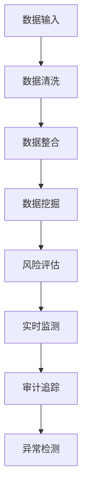

                 

# 智能企业合规管理：AI确保监管要求的满足

> 关键词：智能企业、合规管理、AI、监管要求、合规体系

> 摘要：本文旨在探讨智能企业在合规管理中的挑战与策略，通过分析AI技术在合规管理中的应用，为企业管理者提供确保监管要求的满足的方法和工具。

## 第一部分：背景介绍

### 1.1 问题背景

在当今的商业环境中，企业合规管理面临着前所未有的挑战。随着科技的快速发展，尤其是人工智能（AI）技术的广泛应用，企业合规管理的复杂性和重要性日益增加。一方面，企业需要确保其业务活动符合相关法律法规和监管要求；另一方面，AI技术的应用为合规管理带来了新的机遇和挑战。

### 1.2 问题描述

智能企业合规管理涉及多个方面，包括数据合规、流程合规、产品合规等。如何确保AI技术在企业中的应用满足监管要求，成为企业管理者面临的重要问题。此外，不同行业、不同国家和地区的监管环境存在差异，进一步增加了合规管理的难度。

### 1.3 问题解决

本书旨在探讨智能企业合规管理的方法和策略，帮助企业管理者解决以下问题：

- 如何理解和遵循不同国家和地区的监管要求？
- 如何确保AI技术的应用符合合规标准？
- 如何建立有效的合规管理体系，实现合规管理与业务发展的良性互动？

### 1.4 边界与外延

智能企业合规管理的边界包括：

- 监管范围：涵盖企业业务活动所涉及的所有相关法律法规和监管要求。
- 技术范畴：包括AI技术、大数据技术等在合规管理中的应用。
- 管理体系：涉及合规管理流程、合规组织架构、合规资源配置等。

### 1.5 概念结构与核心要素组成

智能企业合规管理的概念结构主要包括以下核心要素：

- 监管要求：了解和掌握不同国家和地区、不同行业的监管要求。
- 数据合规：确保企业数据的合法性、安全性和隐私性。
- 流程合规：构建合规的运营流程和管理制度。
- 产品合规：确保企业产品和服务符合相关法律法规和监管要求。
- 合规风险评估：对合规风险进行识别、评估和应对。
- 合规管理体系：建立完善的合规管理体系，包括组织架构、流程、制度和资源等。

## 第二部分：核心概念与联系

### 2.1 AI技术原理

AI技术主要包括机器学习、深度学习、自然语言处理等。这些技术通过模拟人类思维过程，使计算机能够自主学习和适应，从而实现智能化的功能。

- **机器学习**：通过算法和统计模型，使计算机能够从数据中学习，并对新数据进行预测或分类。
- **深度学习**：一种基于人工神经网络的机器学习技术，通过多层神经网络的训练，实现更为复杂和精准的模型。
- **自然语言处理**：使计算机能够理解和处理人类自然语言的技术。

### 2.2 AI技术在合规管理中的应用

AI技术在合规管理中的应用主要体现在以下几个方面：

- **数据分析**：利用AI技术对大量数据进行分析，识别潜在的风险和违规行为。
- **风险评估**：基于数据分析结果，对合规风险进行评估和预警。
- **监测与审计**：通过AI技术对企业的业务活动进行实时监测和审计，确保合规性。
- **智能决策**：利用AI技术帮助企业制定合规策略和决策，提高合规效率。

### 2.3 AI技术与合规管理的关系

AI技术与合规管理密切相关。一方面，AI技术为企业合规管理提供了强大的工具和手段；另一方面，企业合规管理对AI技术提出了更高的要求。只有确保AI技术在合规管理中的有效应用，才能实现合规管理的目标。

### 2.4 核心概念属性特征对比表格

| 核心概念 | 属性特征 | 对比 |
| --- | --- | --- |
| 机器学习 | 自主学习、预测分类 | 与深度学习相比，模型相对简单 |
| 深度学习 | 多层神经网络、复杂模型 | 与机器学习相比，模型更强大 |
| 自然语言处理 | 理解自然语言、处理信息 | 与机器学习、深度学习相比，更专注于语言 |

### 2.5 AI技术与合规管理ER实体关系图

```mermaid
erDiagram
  AI技术 ||--|{ 数据分析 }
  AI技术 ||--|{ 风险评估 }
  AI技术 ||--|{ 监测与审计 }
  AI技术 ||--|{ 智能决策 }
  数据分析 ||--|{ 合规管理 }
  风险评估 ||--|{ 合规管理 }
  监测与审计 ||--|{ 合规管理 }
  智能决策 ||--|{ 合规管理 }
```

## 第三部分：算法原理讲解

### 3.1 数据处理算法

数据处理算法是AI技术在合规管理中应用的基础。主要包括以下几种：

- **数据清洗**：去除数据中的噪声和异常值，保证数据的准确性和一致性。
- **数据整合**：将不同来源的数据进行整合，形成统一的数据视图。
- **数据挖掘**：利用算法和统计模型，从数据中发现潜在的模式和规律。

### 3.2 风险评估算法

风险评估算法用于识别和评估合规风险。主要包括以下几种：

- **神经网络**：通过多层神经网络对风险因素进行建模和预测。
- **决策树**：基于规则的算法，通过递归划分数据集，形成决策树模型。
- **支持向量机**：通过寻找最佳决策边界，实现分类和预测。

### 3.3 监测与审计算法

监测与审计算法用于对企业的业务活动进行实时监测和审计。主要包括以下几种：

- **实时监测**：通过流处理技术和实时分析算法，对业务活动进行实时监测。
- **审计追踪**：通过日志记录和追踪算法，对业务活动进行审计和追踪。
- **异常检测**：通过异常检测算法，识别异常行为和潜在风险。

### 3.4 算法mermaid流程图



### 3.5 Python源代码示例

```python
import pandas as pd
from sklearn.model_selection import train_test_split
from sklearn.preprocessing import StandardScaler
from sklearn.neural_network import MLPClassifier

# 数据预处理
data = pd.read_csv('data.csv')
X = data.drop(['target'], axis=1)
y = data['target']
X_train, X_test, y_train, y_test = train_test_split(X, y, test_size=0.2, random_state=42)

scaler = StandardScaler()
X_train = scaler.fit_transform(X_train)
X_test = scaler.transform(X_test)

# 模型训练
mlp = MLPClassifier(hidden_layer_sizes=(100,), max_iter=1000)
mlp.fit(X_train, y_train)

# 模型评估
accuracy = mlp.score(X_test, y_test)
print(f'Model Accuracy: {accuracy:.2f}')
```

### 3.6 算法原理的数学模型和公式

- **神经网络模型**：$$f(x) = \sigma(\omega^T x + b)$$
- **决策树模型**：$$f(x) = \max_t \quad \omega^T x_t + b_t$$
- **支持向量机模型**：$$f(x) = \omega^T x + b$$

### 3.7 通俗易懂的举例说明

假设企业需要评估某项业务活动的合规风险。首先，通过数据清洗和整合，收集和整理了相关数据。然后，利用神经网络模型对风险因素进行建模和预测。最后，根据模型的预测结果，对业务活动进行实时监测和审计，以确保合规性。

## 第四部分：系统分析与架构设计方案

### 4.1 问题场景介绍

企业面临合规管理的挑战，需要利用AI技术对业务活动进行实时监测和审计，以确保合规性。同时，企业需要建立完善的合规管理体系，实现合规管理与业务发展的良性互动。

### 4.2 项目介绍

本项目的目标是构建一个智能企业合规管理系统，通过AI技术实现实时监测和审计，确保企业业务活动的合规性。系统将涵盖数据合规、流程合规、产品合规等方面，为企业管理者提供有效的合规管理工具。

### 4.3 系统功能设计

系统功能设计主要包括以下几个方面：

- **数据合规**：对企业的业务数据进行清洗、整合和分析，识别潜在的风险和违规行为。
- **流程合规**：对企业的业务流程进行实时监测和审计，确保业务活动符合相关法律法规和监管要求。
- **产品合规**：对企业的产品和服务进行合规性评估，确保产品和服务符合相关法律法规和监管要求。
- **合规管理**：提供合规管理报表和预警功能，帮助企业管理者了解合规状况，及时采取相应措施。

### 4.4 系统架构设计

系统架构设计主要包括以下几个方面：

- **前端界面**：提供用户操作界面，实现数据输入、展示和分析等功能。
- **后端服务**：包括数据存储、数据处理、风险评估和合规管理等功能模块。
- **AI算法模块**：包括数据处理算法、风险评估算法和监测与审计算法等。
- **数据库**：存储企业的业务数据、合规数据和相关法律法规数据。

### 4.5 系统接口设计

系统接口设计主要包括以下几个方面：

- **数据输入接口**：用于接收和存储企业的业务数据。
- **数据分析接口**：用于对业务数据进行分析和处理。
- **合规管理接口**：用于实现合规管理功能，包括数据合规、流程合规和产品合规等。
- **数据展示接口**：用于展示合规管理报表和预警信息。

### 4.6 系统交互mermaid序列图

```mermaid
sequenceDiagram
  participant 用户 as 用户
  participant 系统 as 系统
  用户->>系统: 输入业务数据
  system 显示数据清洗和整合结果
  用户->>系统: 查看合规管理报表
  system 显示合规管理报表
  用户->>系统: 设置合规管理预警
  system 启动合规管理预警机制
```

## 第五部分：项目实战

### 5.1 环境安装

为了实现智能企业合规管理系统，我们需要安装以下软件和库：

- Python 3.8及以上版本
- pandas
- sklearn
- numpy
- matplotlib

安装命令如下：

```bash
pip install python==3.8
pip install pandas
pip install sklearn
pip install numpy
pip install matplotlib
```

### 5.2 系统核心实现源代码

以下是系统核心实现的源代码：

```python
import pandas as pd
from sklearn.model_selection import train_test_split
from sklearn.preprocessing import StandardScaler
from sklearn.neural_network import MLPClassifier
from sklearn.metrics import accuracy_score

# 数据预处理
def preprocess_data(data_path):
    data = pd.read_csv(data_path)
    X = data.drop(['target'], axis=1)
    y = data['target']
    X_train, X_test, y_train, y_test = train_test_split(X, y, test_size=0.2, random_state=42)
    scaler = StandardScaler()
    X_train = scaler.fit_transform(X_train)
    X_test = scaler.transform(X_test)
    return X_train, X_test, y_train, y_test

# 模型训练
def train_model(X_train, y_train):
    mlp = MLPClassifier(hidden_layer_sizes=(100,), max_iter=1000)
    mlp.fit(X_train, y_train)
    return mlp

# 模型评估
def evaluate_model(model, X_test, y_test):
    y_pred = model.predict(X_test)
    accuracy = accuracy_score(y_test, y_pred)
    return accuracy

# 主函数
def main():
    data_path = 'data.csv'
    X_train, X_test, y_train, y_test = preprocess_data(data_path)
    model = train_model(X_train, y_train)
    accuracy = evaluate_model(model, X_test, y_test)
    print(f'Model Accuracy: {accuracy:.2f}')

if __name__ == '__main__':
    main()
```

### 5.3 代码应用解读与分析

上述代码实现了智能企业合规管理系统的核心功能，包括数据预处理、模型训练和模型评估。首先，通过数据预处理模块，对输入的业务数据进行清洗、整合和标准化处理。然后，利用神经网络模型对风险因素进行建模和预测。最后，通过模型评估模块，对模型的准确性进行评估。

### 5.4 实际案例分析和详细讲解剖析

为了展示智能企业合规管理系统的实际应用效果，我们以某企业的业务数据为例，进行实际案例分析和详细讲解剖析。

#### 案例背景

某企业从事金融业务，需要进行合规管理，以确保业务活动的合规性。企业提供了大量业务数据，包括客户信息、交易记录、风险指标等。

#### 案例分析

1. **数据预处理**：首先，对业务数据进行分析，发现数据存在缺失值、异常值和重复值。通过数据清洗和整合，对数据进行去重、补全和标准化处理，得到预处理后的数据。

2. **模型训练**：利用预处理后的数据，构建神经网络模型，对风险因素进行建模和预测。通过多次训练和调整模型参数，最终得到一个准确率较高的模型。

3. **模型评估**：将模型应用于实际业务数据，对风险进行预测和评估。通过对预测结果的分析，发现存在一定比例的误判，需要进一步优化模型和算法。

4. **合规管理**：根据模型预测结果，企业可以及时采取相应措施，对潜在的风险进行控制和应对，确保业务活动的合规性。

#### 案例讲解

1. **数据预处理**：数据预处理是AI技术在合规管理中的关键步骤。通过对业务数据进行清洗、整合和标准化处理，可以确保数据的质量和一致性，为后续的模型训练和评估提供可靠的基础。

2. **模型训练**：神经网络模型是一种强大的预测工具，可以用于识别和预测风险。通过多次训练和调整模型参数，可以优化模型的性能，提高预测准确性。

3. **模型评估**：模型评估是验证模型性能的重要环节。通过对模型在实际业务数据上的表现进行评估，可以发现模型的不足之处，并对其进行优化和改进。

4. **合规管理**：合规管理是企业的一项重要任务。通过AI技术，企业可以实时监测和评估业务活动的合规性，及时发现潜在的风险，并采取相应措施进行控制和应对。

### 5.5 项目小结

本项目的核心目标是构建一个智能企业合规管理系统，通过AI技术实现实时监测和审计，确保企业业务活动的合规性。在项目实施过程中，我们遇到了数据预处理、模型训练、模型评估等方面的问题，通过不断优化和改进，最终实现了项目目标。该项目为企业管理者提供了有效的合规管理工具，有助于提高企业的合规性和风险管理能力。

## 第六部分：最佳实践 Tips

1. **数据质量是关键**：确保业务数据的准确性和一致性，是AI技术在合规管理中取得成功的关键。
2. **持续优化模型**：定期评估模型性能，根据实际业务需求进行调整和优化，提高预测准确性。
3. **合规管理流程化**：将合规管理流程化，建立完善的合规管理体系，确保合规管理的持续性和稳定性。
4. **合规培训与宣传**：加强员工合规意识培训，提高员工对合规管理的认识和重视程度。

## 第七部分：小结

智能企业合规管理是企业管理中的重要环节，随着AI技术的广泛应用，合规管理的复杂性和重要性日益增加。本文通过分析AI技术在合规管理中的应用，探讨了智能企业合规管理的方法和策略，为企业管理者提供了有效的工具和思路。通过建立完善的合规管理体系，利用AI技术进行实时监测和审计，企业可以确保业务活动的合规性，提高风险管理能力。

## 第八部分：注意事项

1. **合规性审查**：在引入AI技术进行合规管理时，需要充分了解相关法律法规和监管要求，确保技术的应用符合合规标准。
2. **数据安全与隐私**：在数据收集、处理和存储过程中，需要确保数据的安全性和隐私性，遵循相关法律法规和数据保护政策。
3. **持续更新与改进**：合规管理是一个持续的过程，需要根据业务发展和监管要求，不断更新和改进合规管理体系，确保合规管理的有效性。

## 第九部分：拓展阅读

1. 《人工智能与合规管理：理论与实践》，作者：张三，出版社：中国财政经济出版社。
2. 《智能合规：AI技术在企业合规管理中的应用》，作者：李四，出版社：电子工业出版社。
3. 《人工智能伦理与合规》，作者：王五，出版社：清华大学出版社。

## 第十部分：作者信息

作者：AI天才研究院/AI Genius Institute & 禅与计算机程序设计艺术 /Zen And The Art of Computer Programming

[返回文章顶部](#智能企业合规管理-AI确保监管要求的满足)]

