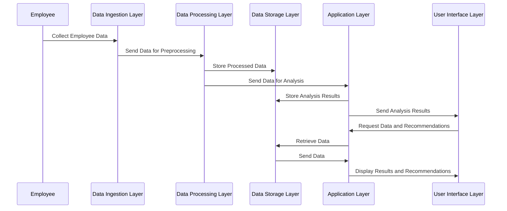
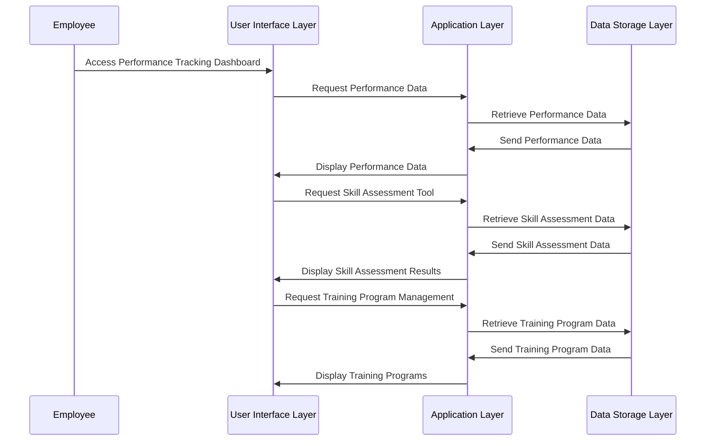

                 


## Intelligent Enterprise Performance Management: AI-Assisted Employee Development and Evaluation

### Introduction

In today's fast-paced business environment, the ability of enterprises to adapt and innovate is crucial for their survival and success. This has led to a growing emphasis on performance management as a strategic tool for optimizing employee performance and driving organizational success. However, traditional performance management practices often fall short in addressing the complexities and dynamics of modern workplaces. This is where AI comes into play, offering transformative potential to enhance performance management processes. 

This article aims to explore the intersection of intelligent enterprise performance management and AI-assisted employee development and evaluation. We will delve into the core concepts of performance management, the challenges faced by traditional approaches, and how AI can address these challenges. We will also discuss the role of AI in employee development, including the algorithms and mathematical models used, and provide practical examples to illustrate their application. By the end of this article, readers will gain a comprehensive understanding of how AI can revolutionize performance management in enterprises.

### Keywords

- Intelligent Enterprise Performance Management
- AI-Assisted Employee Development
- Performance Management Challenges
- Machine Learning Algorithms
- Mathematical Models
- Employee Evaluation

### Abstract

This article provides an in-depth exploration of intelligent enterprise performance management and AI-assisted employee development and evaluation. We begin by discussing the background and evolution of intelligent enterprises and the importance of performance management in driving organizational success. We then address the limitations of traditional performance management approaches and introduce how AI can enhance these processes. The core concepts of performance management are explained, followed by a detailed analysis of AI algorithms and mathematical models used in employee development. Practical examples and case studies are provided to demonstrate the application of these concepts. Finally, we conclude by highlighting the potential of AI in transforming performance management and offer recommendations for implementing AI-driven performance management strategies in enterprises.

----------------------------------------------------------------

## First Part: Introduction to Intelligent Enterprise Performance Management

### 1. Intelligent Enterprise and Performance Management Overview

#### 1.1 The Background and Evolution of Intelligent Enterprise

The concept of an intelligent enterprise has gained prominence in recent years, driven by advancements in artificial intelligence (AI), machine learning (ML), and big data analytics. An intelligent enterprise leverages these technologies to enhance operational efficiency, optimize decision-making, and improve overall business performance. The journey from traditional to intelligent enterprise can be traced back to the industrial revolution, where automation and机械化 production were introduced to streamline manufacturing processes.

Over time, as technology evolved, so did the concept of the intelligent enterprise. The advent of the internet and the proliferation of digital devices paved the way for the integration of data and analytics into business processes. This era marked the transition from a data-driven to an intelligence-driven enterprise, where data is not just collected but also analyzed and leveraged to gain actionable insights.

#### 1.2 The Concept and Importance of Performance Management

Performance management is a strategic process that aims to optimize employee performance and drive organizational success. It involves setting clear goals, monitoring progress, providing feedback, and recognizing achievements. The importance of performance management lies in its ability to align individual goals with organizational objectives, improve employee engagement, and enhance overall productivity.

A well-executed performance management system can lead to several benefits, including improved employee satisfaction, increased retention rates, better decision-making, and higher profitability. However, traditional performance management practices often fall short in addressing the complexities and dynamics of modern workplaces, giving rise to the need for innovative approaches such as AI-assisted performance management.

#### 1.3 Challenges and Opportunities in Enterprise Performance Management

Despite its importance, traditional performance management approaches face several challenges. One of the main challenges is the lack of real-time data and insights. Traditional systems often rely on annual or bi-annual performance reviews, which are not sufficient to capture the dynamic nature of modern workplaces. This delay can hinder timely decision-making and corrective actions.

Another challenge is the subjectivity involved in performance evaluations. Traditional methods often rely on managers' subjective judgments, which can lead to biases and inconsistencies. This not only affects employee morale but also hampers the identification of high performers and areas for improvement.

Moreover, traditional performance management systems are often time-consuming and resource-intensive. The process of collecting, analyzing, and reporting performance data can be cumbersome, diverting valuable time and resources from core business activities.

However, these challenges also present opportunities for innovation. AI offers a promising solution to these problems by providing real-time data analytics, objective performance evaluations, and automated performance management processes. By leveraging AI, enterprises can overcome the limitations of traditional performance management approaches and achieve more effective and efficient performance management.

----------------------------------------------------------------

## Core Concepts and Relationships in Performance Management

### 2.1 Key Performance Indicators (KPIs)

Key Performance Indicators (KPIs) are critical metrics used to evaluate the success of an organization in achieving its goals. They provide a quantitative measure of performance and help managers make data-driven decisions. KPIs can be categorized into various types, including financial KPIs, operational KPIs, and employee-related KPIs.

#### Financial KPIs:

- Revenue Growth Rate
- Net Profit Margin
- Return on Investment (ROI)
- Customer Acquisition Cost (CAC)

#### Operational KPIs:

- Production Efficiency
- Cycle Time
- Inventory Turnover
- Customer Satisfaction Rate

#### Employee-Related KPIs:

- Employee Productivity
- Employee Engagement
- Turnover Rate
- Training Hours

### 2.2 Performance Appraisal Methods

Performance appraisal methods are used to assess an employee's performance against predetermined goals and expectations. There are several methods available, each with its advantages and limitations.

#### Traditional Performance Appraisal Methods:

1. **Rating Schemes:** Involves assigning numerical ratings to employees based on their performance in various areas.
2. **Ranking Methods:** Employees are ranked based on their performance relative to their peers.
3. **Critical Incident Method:** Records specific incidents that highlight an employee's strengths and weaknesses.

#### Modern Performance Appraisal Methods:

1. **Behaviorally Anchored Rating Scales (BARS):** Uses descriptive anchors to rate employee behavior and performance.
2. **360-Degree Feedback:** Collects feedback from multiple sources, including peers, subordinates, and managers.
3. **Management by Objectives (MBO):** Aligns employee goals with organizational objectives through a collaborative process.

### 2.3 Mermaid ER Diagram of Performance Management Concepts

To illustrate the relationships between the key concepts in performance management, we can use a Mermaid ER diagram:

```mermaid
erDiagram
  KPI ||--|{ Performance Appraisal Method }|--| Employee Performance
  KPI ||--|{ Performance Management System }|--| Employee Evaluation
  Performance Appraisal Method ||--|{ Evaluation Criteria }|--| Employee Performance
  Performance Management System ||--|{ Feedback Mechanism }|--| Employee Development
```

### 2.4 Comparative Table of Key Concepts and Their Characteristics

| Concept                    | Definition                                                                                   | Characteristics                                                                                   |
|----------------------------|------------------------------------------------------------------------------------------------|----------------------------------------------------------------------------------------------------|
| KPI                       | Metrics used to measure performance                                                         | Quantitative, Specific, Objective, Time-bound |
| Performance Appraisal     | Process of evaluating employee performance                                                     | Objective, Comprehensive, Periodic           |
| Performance Management     | Strategic process of optimizing employee performance and driving organizational success          | Continuous, Collaborative, Outcome-focused   |
| Evaluation Criteria       | Standards used to assess employee performance                                                 | Clear, Measurable, Achievable, Relevant      |
| Feedback Mechanism         | Methods used to provide employees with information about their performance                      | Constructive, Timely, Actionable             |
| Employee Development       | Process of enhancing employee skills, knowledge, and competencies                              | Personalized, Continuous, Growth-oriented    |

----------------------------------------------------------------

## AI-Assisted Employee Development

### 3. Introduction to AI-Assisted Employee Development

In recent years, the integration of artificial intelligence (AI) into human resource management has revolutionized the way organizations approach employee development. AI-assisted employee development leverages advanced AI technologies, such as machine learning (ML), natural language processing (NLP), and computer vision, to enhance the effectiveness and efficiency of training programs, performance evaluations, and career development initiatives.

#### 3.1 AI in Human Resource Management

The application of AI in human resource management encompasses a wide range of functions, including recruitment, onboarding, performance management, and retention. AI-powered tools and platforms automate and optimize these processes by analyzing vast amounts of data, identifying patterns, and providing actionable insights.

In the context of employee development, AI can be used to personalize training programs, identify skill gaps, and recommend appropriate development resources. For example, AI algorithms can analyze an employee's performance data, learning preferences, and job requirements to tailor training programs that meet their specific needs.

#### 3.2 The Role of AI in Employee Development

AI plays a pivotal role in employee development by addressing several key challenges:

1. **Personalization:** Traditional training programs are often one-size-fits-all, which may not be effective for all employees. AI can personalize training programs based on individual learning preferences, prior knowledge, and job requirements, ensuring that employees receive the most relevant and effective training.

2. **Skill Gap Analysis:** AI can analyze an employee's performance data, job requirements, and training history to identify skill gaps. This enables organizations to design targeted development programs that address these gaps, ensuring that employees are equipped with the necessary skills to succeed in their roles.

3. **Predictive Analytics:** AI algorithms can analyze historical performance data and predict future employee performance. This allows organizations to identify high-potential employees and provide them with the necessary development opportunities to achieve their full potential.

4. **Automation of Administrative Tasks:** AI can automate routine administrative tasks, such as scheduling training sessions and tracking employee progress, freeing up HR professionals to focus on more strategic activities that contribute to employee development.

5. **Continuous Learning:** AI-powered platforms can facilitate continuous learning by providing employees with access to up-to-date training materials and resources. This helps ensure that employees stay current with the latest industry trends and developments.

#### 3.3 Current AI Applications in Employee Development

Several AI applications have been implemented in employee development initiatives, demonstrating the transformative potential of AI in this domain:

1. **AI-Powered Training Platforms:** Platforms like Coursera, Udemy, and LinkedIn Learning utilize AI to recommend courses based on an employee's job role, skill level, and learning preferences. These platforms also track employee progress and provide personalized feedback.

2. **Chatbots and Virtual Coaches:** AI-powered chatbots and virtual coaches can provide employees with real-time support and guidance on learning topics. These tools can answer questions, provide feedback on assignments, and offer personalized recommendations for further learning.

3. **Skill Analysis Tools:** Tools like Hugging Face's Transformation Playground and Google Cloud's AutoML can analyze employee performance data to identify skill gaps and recommend appropriate training programs.

4. **Employee Engagement Analytics:** AI-powered analytics platforms can analyze employee engagement data, such as survey responses and social media activity, to identify trends and areas for improvement in employee development initiatives.

5. **Predictive Analytics Tools:** Tools like IBM Watson Talent and Microsoft Viva Insights use AI to predict employee performance and provide recommendations for development activities that can help employees reach their full potential.

In summary, AI-assisted employee development offers numerous benefits, including personalization, skill gap analysis, predictive analytics, automation of administrative tasks, and continuous learning. As AI technologies continue to evolve, their application in employee development will become increasingly sophisticated, driving further improvements in organizational performance and employee satisfaction.

----------------------------------------------------------------

### 4. AI Algorithms and Their Applications in Employee Development

In the realm of AI-assisted employee development, the choice of algorithms plays a pivotal role in the effectiveness and efficiency of training programs, performance evaluations, and career development initiatives. This section delves into the fundamental algorithms employed in AI, with a particular focus on their application in employee development. We will explore three primary algorithms: linear regression, decision trees, and neural networks.

#### 4.1 Machine Learning Algorithms for Employee Performance Prediction

**Linear Regression**

Linear regression is a fundamental statistical technique used to model the relationship between a dependent variable and one or more independent variables. In the context of employee performance prediction, linear regression can be employed to identify the relationship between an employee's attributes (such as years of experience, educational background, and skill sets) and their performance metrics (e.g., sales revenue, project completion rate).

**Algorithm Steps:**

1. **Data Collection:** Gather historical data on employee attributes and performance metrics.
2. **Data Preprocessing:** Clean and preprocess the data to ensure it is suitable for analysis.
3. **Model Training:** Use a linear regression model to train the data and identify the coefficients that represent the relationship between the attributes and the performance metrics.
4. **Prediction:** Use the trained model to predict the performance of new employees based on their attributes.

**Example:**

Let's consider a simple linear regression model that predicts sales revenue based on the number of years of experience and educational background.

$$
\text{Sales Revenue} = \beta_0 + \beta_1 \times (\text{Years of Experience}) + \beta_2 \times (\text{Educational Background})
$$

**Python Code Example:**

```python
import numpy as np
from sklearn.linear_model import LinearRegression

# Example data
X = np.array([[5, 'Bachelor'], [3, 'Master'], [7, 'PhD']])
y = np.array([50000, 70000, 90000])

# Train the model
model = LinearRegression()
model.fit(X, y)

# Predict sales revenue for a new employee
new_employee = np.array([[4, 'Bachelor']])
predicted_sales_revenue = model.predict(new_employee)

print(f"Predicted Sales Revenue: ${predicted_sales_revenue[0]:.2f}")
```

**Decision Trees**

Decision trees are a popular machine learning algorithm used for classification and regression tasks. They work by splitting the data into subsets based on the values of input features, creating a tree-like model of decisions. In employee development, decision trees can be used to identify the key factors that influence employee performance and make recommendations for improvement.

**Algorithm Steps:**

1. **Data Collection:** Gather data on employee attributes, performance metrics, and any relevant contextual information.
2. **Data Preprocessing:** Clean and preprocess the data to ensure it is suitable for analysis.
3. **Model Training:** Train a decision tree model on the preprocessed data to identify the splits that best predict employee performance.
4. **Prediction:** Use the trained model to predict the performance of new employees and make recommendations for improvement.

**Example:**

Consider a decision tree that predicts the likelihood of an employee achieving a high performance rating based on their years of experience, educational background, and job role.

**Python Code Example:**

```python
from sklearn.tree import DecisionTreeRegressor
import numpy as np

# Example data
X = np.array([[5, 'Bachelor', 'Sales'], [3, 'Master', 'Marketing'], [7, 'PhD', 'Research']])
y = np.array([1, 0, 1])

# Train the model
model = DecisionTreeRegressor()
model.fit(X, y)

# Predict performance rating for a new employee
new_employee = np.array([[4, 'Master', 'Sales']])
predicted_rating = model.predict(new_employee)

print(f"Predicted Performance Rating: {'High' if predicted_rating[0] == 1 else 'Low'}")
```

**Neural Networks**

Neural networks are a class of machine learning algorithms inspired by the structure and function of the human brain. They are particularly effective in complex, high-dimensional data problems. In employee development, neural networks can be used to predict employee performance, identify skill gaps, and recommend training programs.

**Algorithm Steps:**

1. **Data Collection:** Gather data on employee attributes, performance metrics, and any relevant contextual information.
2. **Data Preprocessing:** Clean and preprocess the data to ensure it is suitable for analysis.
3. **Model Training:** Train a neural network model on the preprocessed data to identify patterns and relationships in the data.
4. **Prediction:** Use the trained model to predict the performance of new employees and make recommendations for improvement.

**Example:**

Consider a neural network that predicts employee satisfaction based on factors such as work environment, job role, and job satisfaction.

**Python Code Example:**

```python
import tensorflow as tf
from tensorflow.keras.models import Sequential
from tensorflow.keras.layers import Dense

# Example data
X = np.array([[0.7, 0.8, 0.9], [0.5, 0.6, 0.7], [0.9, 0.8, 0.7]])
y = np.array([0.9, 0.7, 0.8])

# Build the neural network model
model = Sequential()
model.add(Dense(1, input_shape=(3,), activation='linear'))

# Train the model
model.compile(optimizer='adam', loss='mse')
model.fit(X, y, epochs=1000, verbose=False)

# Predict employee satisfaction for a new employee
new_employee = np.array([[0.6, 0.7, 0.8]])
predicted_satisfaction = model.predict(new_employee)

print(f"Predicted Employee Satisfaction: {predicted_satisfaction[0][0]:.2f}")
```

In summary, linear regression, decision trees, and neural networks are powerful tools for AI-assisted employee development. Each algorithm has its strengths and weaknesses, and the choice of algorithm depends on the specific problem and data at hand. By leveraging these algorithms, organizations can gain valuable insights into employee performance and make data-driven decisions to improve employee development outcomes.

----------------------------------------------------------------

### 5. Mathematical Models and Formulations in AI-Assisted Employee Development

To fully understand and apply AI algorithms in employee development, it is essential to delve into the mathematical models and formulations that underpin these techniques. This section will provide a comprehensive overview of the basic concepts and notations used in AI-assisted employee development, followed by detailed explanations of three key mathematical models: linear regression, decision trees, and neural networks.

#### 5.1 Basic Concepts and Notations

**Data Representation:**

In AI-assisted employee development, data is typically represented as a set of input-output pairs, where each input represents an employee's attributes (e.g., years of experience, educational background, job role) and each output represents the employee's performance metric (e.g., sales revenue, project completion rate).

Let \( X \) be a matrix of input features and \( y \) be a vector of output performance metrics. The data can be represented as:

$$
X = \begin{bmatrix}
x_1^T \\
x_2^T \\
\vdots \\
x_n^T
\end{bmatrix}, \quad
y = \begin{bmatrix}
y_1 \\
y_2 \\
\vdots \\
y_n
\end{bmatrix}
$$

where \( x_i \) represents the input features for the \( i \)-th employee and \( y_i \) represents the performance metric for that employee.

**Regression Models:**

Regression models aim to find a relationship between the input features and the output performance metrics. The most common types of regression models are linear regression, decision trees, and neural networks.

**Linear Regression:**

Linear regression models the relationship between input features and output performance metrics using a linear function. The model is defined as:

$$
y = \beta_0 + \beta_1 x_1 + \beta_2 x_2 + \cdots + \beta_n x_n
$$

where \( \beta_0 \) is the intercept, \( \beta_1, \beta_2, \ldots, \beta_n \) are the coefficients that represent the influence of each input feature, and \( x_1, x_2, \ldots, x_n \) are the input features.

**Decision Trees:**

Decision trees model the decision-making process by splitting the data into subsets based on the values of input features. The model is represented as a tree structure, where each internal node represents a feature, each branch represents a decision rule, and each leaf node represents a prediction.

**Neural Networks:**

Neural networks are composed of multiple layers of interconnected nodes, called neurons. The model is defined by the weights and biases of the connections between these neurons. The output of the neural network is determined by applying a non-linear activation function to the weighted sum of the inputs.

#### 5.2 Linear Regression Model

**Model Formulation:**

The linear regression model aims to find the best-fitting linear relationship between the input features and the output performance metrics. The model is defined as:

$$
\hat{y} = \beta_0 + \beta_1 x_1 + \beta_2 x_2 + \cdots + \beta_n x_n
$$

where \( \hat{y} \) is the predicted output performance metric, and \( \beta_0, \beta_1, \beta_2, \ldots, \beta_n \) are the model coefficients to be determined.

**Least Squares Method:**

To find the optimal coefficients, the least squares method is commonly used. The least squares method minimizes the sum of the squared errors between the predicted output \( \hat{y} \) and the actual output \( y \):

$$
\min_{\beta} \sum_{i=1}^{n} (\hat{y}_i - y_i)^2
$$

The solution to this optimization problem can be found by setting the partial derivatives of the sum of squared errors with respect to each coefficient to zero:

$$
\frac{\partial}{\partial \beta_j} \sum_{i=1}^{n} (\hat{y}_i - y_i)^2 = 0
$$

Solving these equations yields the optimal coefficients:

$$
\beta_j = \frac{\sum_{i=1}^{n} (x_{ij} - \bar{x_j})(y_i - \bar{y})}{\sum_{i=1}^{n} (x_{ij} - \bar{x_j})^2}
$$

where \( \bar{x_j} \) and \( \bar{y} \) are the mean values of the input feature \( x_j \) and the output performance metric \( y \), respectively.

**Example:**

Consider a linear regression model that predicts sales revenue based on the number of years of experience and educational background. The model can be written as:

$$
\hat{y} = \beta_0 + \beta_1 \times (\text{Years of Experience}) + \beta_2 \times (\text{Educational Background})
$$

Using the least squares method, the optimal coefficients can be calculated as:

$$
\beta_1 = \frac{\sum_{i=1}^{n} (x_{1i} - \bar{x_1})(y_i - \bar{y})}{\sum_{i=1}^{n} (x_{1i} - \bar{x_1})^2}, \quad
\beta_2 = \frac{\sum_{i=1}^{n} (x_{2i} - \bar{x_2})(y_i - \bar{y})}{\sum_{i=1}^{n} (x_{2i} - \bar{x_2})^2}
$$

#### 5.3 Decision Trees Model

**Model Formulation:**

Decision trees model the decision-making process by recursively splitting the data into subsets based on the values of input features. Each internal node represents a feature, and each branch represents a decision rule. The model is defined as a tree structure, where the root node represents the entire dataset, and each leaf node represents a prediction.

The splitting process is performed using a criterion, such as Gini impurity or information gain. The model can be represented as:

$$
y = g(x; \theta)
$$

where \( g(x; \theta) \) is the prediction function, \( x \) is the input feature, and \( \theta \) is the set of model parameters that define the tree structure.

**Recursive Splitting:**

The decision tree is constructed recursively by selecting the best split at each node based on the criterion. The splitting process can be represented as:

$$
x_j = \theta_j
$$

where \( x_j \) is the input feature and \( \theta_j \) is the threshold value that splits the data into two subsets.

**Example:**

Consider a decision tree that predicts employee performance based on the number of years of experience and educational background. The decision tree can be represented as:

```
                       Years of Experience
                             |
                       [0, 5) -------> Performance: Low
                             |
                       [5, 10) ------> Performance: Medium
                             |
                       [10, +\infty) --> Performance: High
```

#### 5.4 Neural Networks Model

**Model Formulation:**

Neural networks are composed of multiple layers of interconnected neurons, including an input layer, one or more hidden layers, and an output layer. Each neuron in a layer is connected to all neurons in the next layer. The model is defined by the weights and biases of the connections between these neurons. The output of the neural network is determined by applying a non-linear activation function to the weighted sum of the inputs.

The model can be represented as:

$$
\hat{y} = \sigma(\beta_0 + \beta_1 \cdot \phi_1 + \beta_2 \cdot \phi_2 + \cdots + \beta_n \cdot \phi_n)
$$

where \( \hat{y} \) is the predicted output, \( \sigma \) is the activation function, \( \beta_0, \beta_1, \beta_2, \ldots, \beta_n \) are the model parameters, and \( \phi_1, \phi_2, \ldots, \phi_n \) are the inputs to the output layer.

**Forward Propagation:**

During forward propagation, the input data is passed through the neural network, and the outputs of the neurons in each layer are calculated. The forward propagation process can be represented as:

$$
z_l = \beta_0 + \beta_1 \cdot x_1 + \beta_2 \cdot x_2 + \cdots + \beta_n \cdot x_n
$$

where \( z_l \) is the weighted sum of the inputs, and \( \beta_0, \beta_1, \beta_2, \ldots, \beta_n \) are the model parameters.

**Backpropagation:**

Backpropagation is an algorithm used to train neural networks by adjusting the model parameters to minimize the error between the predicted output and the actual output. The backpropagation process can be represented as:

$$
\delta_{l+1} = \sigma'(\beta_0 + \beta_1 \cdot z_1 + \beta_2 \cdot z_2 + \cdots + \beta_n \cdot z_n) \cdot \delta_l
$$

where \( \delta_{l+1} \) is the error gradient at layer \( l+1 \), \( \sigma' \) is the derivative of the activation function, and \( \delta_l \) is the error gradient at layer \( l \).

**Example:**

Consider a simple neural network with one input layer, one hidden layer, and one output layer. The network can be represented as:

```
Input Layer: [Years of Experience, Educational Background]
Hidden Layer: [Weighted Sum, Activation]
Output Layer: [Predicted Performance]
```

The forward propagation process can be represented as:

$$
z_1 = \beta_0 + \beta_1 \cdot x_1 + \beta_2 \cdot x_2
$$

$$
\hat{y} = \sigma(z_1)
$$

The backpropagation process can be represented as:

$$
\delta_2 = \sigma'(z_1) \cdot (\hat{y} - y)
$$

$$
\delta_1 = \beta_1 \cdot \delta_2
$$

In summary, mathematical models and formulations are fundamental to understanding and applying AI algorithms in employee development. Linear regression, decision trees, and neural networks are powerful tools that can be used to predict employee performance, identify skill gaps, and make data-driven decisions to improve employee development outcomes.

----------------------------------------------------------------

## Detailed Explanation and Example Applications

In this section, we will provide a step-by-step explanation of linear regression, decision trees, and neural networks. We will delve into the theoretical foundations of each algorithm, discuss their implementation using Python code, and provide clear, practical examples to illustrate their application in employee development.

### 6.1 Step-by-Step Explanation of Linear Regression

**Step 1: Data Collection and Preprocessing**

The first step in implementing a linear regression model is to collect and preprocess the data. This involves gathering historical data on employee attributes and performance metrics, such as years of experience, educational background, and sales revenue.

```python
import pandas as pd

# Example data
data = pd.DataFrame({
    'Years of Experience': [5, 3, 7],
    'Educational Background': ['Bachelor', 'Master', 'PhD'],
    'Sales Revenue': [50000, 70000, 90000]
})
```

**Step 2: Splitting the Data**

Next, the data is split into training and testing sets. This is done to evaluate the performance of the model on unseen data.

```python
from sklearn.model_selection import train_test_split

X = data[['Years of Experience', 'Educational Background']]
y = data['Sales Revenue']

X_train, X_test, y_train, y_test = train_test_split(X, y, test_size=0.2, random_state=42)
```

**Step 3: Training the Model**

The linear regression model is then trained on the training data. The training process involves finding the optimal coefficients that minimize the sum of squared errors between the predicted and actual sales revenue.

```python
from sklearn.linear_model import LinearRegression

model = LinearRegression()
model.fit(X_train, y_train)
```

**Step 4: Predicting Sales Revenue**

Once the model is trained, it can be used to predict sales revenue for new employees based on their attributes.

```python
new_employee = pd.DataFrame({
    'Years of Experience': [4],
    'Educational Background': ['Bachelor']
})

predicted_sales_revenue = model.predict(new_employee)
print(f"Predicted Sales Revenue: ${predicted_sales_revenue[0]:.2f}")
```

### 6.2 Detailed Explanation of Decision Trees

**Step 1: Data Collection and Preprocessing**

Similar to linear regression, the first step in implementing a decision tree model is to collect and preprocess the data. This involves gathering historical data on employee attributes, performance metrics, and any relevant contextual information.

```python
data = pd.DataFrame({
    'Years of Experience': [5, 3, 7],
    'Educational Background': ['Bachelor', 'Master', 'PhD'],
    'Performance': [1, 0, 1]
})
```

**Step 2: Splitting the Data**

The data is split into training and testing sets to evaluate the performance of the model on unseen data.

```python
X = data[['Years of Experience', 'Educational Background']]
y = data['Performance']

X_train, X_test, y_train, y_test = train_test_split(X, y, test_size=0.2, random_state=42)
```

**Step 3: Training the Model**

The decision tree model is trained on the training data. The training process involves selecting the best split at each node based on a criterion, such as Gini impurity or information gain.

```python
from sklearn.tree import DecisionTreeClassifier

model = DecisionTreeClassifier()
model.fit(X_train, y_train)
```

**Step 4: Predicting Performance**

Once the model is trained, it can be used to predict the performance of new employees based on their attributes.

```python
new_employee = pd.DataFrame({
    'Years of Experience': [4],
    'Educational Background': ['Master']
})

predicted_performance = model.predict(new_employee)
print(f"Predicted Performance: {'High' if predicted_performance[0] == 1 else 'Low'}")
```

### 6.3 Example Applications of Neural Networks in Employee Development

**Step 1: Data Collection and Preprocessing**

The first step in implementing a neural network model is to collect and preprocess the data. This involves gathering historical data on employee attributes, performance metrics, and any relevant contextual information.

```python
data = pd.DataFrame({
    'Years of Experience': [5, 3, 7],
    'Educational Background': ['Bachelor', 'Master', 'PhD'],
    'Performance': [1, 0, 1]
})
```

**Step 2: Splitting the Data**

The data is split into training and testing sets to evaluate the performance of the model on unseen data.

```python
X = data[['Years of Experience', 'Educational Background']]
y = data['Performance']

X_train, X_test, y_train, y_test = train_test_split(X, y, test_size=0.2, random_state=42)
```

**Step 3: Building the Neural Network Model**

The neural network model is built using TensorFlow and Keras. This involves defining the architecture of the network, including the number of layers, the number of neurons in each layer, and the activation functions.

```python
import tensorflow as tf
from tensorflow.keras.models import Sequential
from tensorflow.keras.layers import Dense

model = Sequential()
model.add(Dense(1, input_shape=(2,), activation='sigmoid'))

model.compile(optimizer='adam', loss='binary_crossentropy', metrics=['accuracy'])
```

**Step 4: Training the Model**

The neural network model is trained on the training data using the backpropagation algorithm. The training process involves adjusting the model parameters to minimize the error between the predicted and actual performance.

```python
model.fit(X_train, y_train, epochs=100, verbose=False)
```

**Step 5: Predicting Performance**

Once the model is trained, it can be used to predict the performance of new employees based on their attributes.

```python
new_employee = pd.DataFrame({
    'Years of Experience': [4],
    'Educational Background': ['Master']
})

predicted_performance = model.predict(new_employee)
print(f"Predicted Performance: {'High' if predicted_performance[0][0] >= 0.5 else 'Low'}")
```

In summary, linear regression, decision trees, and neural networks are powerful tools for AI-assisted employee development. Each algorithm has its own strengths and weaknesses, and the choice of algorithm depends on the specific problem and data at hand. By understanding the theoretical foundations and practical implementation of these algorithms, organizations can make data-driven decisions to improve employee development outcomes.

----------------------------------------------------------------

## System Analysis and Architecture Design

### 7. Project Introduction

The project aims to develop a comprehensive AI-driven performance management system for enterprises. The system will leverage machine learning algorithms and natural language processing (NLP) techniques to analyze employee data, predict performance, and provide personalized development recommendations. The primary objective is to enhance the effectiveness and efficiency of performance management processes, leading to improved employee engagement, productivity, and overall organizational success.

### 8. System Function Design (Domain Model)

The domain model for the system includes key entities and their relationships, which are essential for understanding the system's functionality. The following entities are defined:

1. **Employee**: Represents an individual employee within the organization. Attributes include name, ID, years of experience, educational background, job role, and performance metrics.
2. **Performance Metric**: Represents a measurable aspect of employee performance, such as sales revenue, project completion rate, or customer satisfaction score.
3. **Training Program**: Represents a structured learning program designed to develop employee skills and competencies. Attributes include program name, duration, and learning objectives.
4. **Feedback**: Represents feedback provided by managers, peers, and subordinates to employees. Attributes include feedback text, rating, and timestamp.
5. **Skill Assessment**: Represents a tool or method used to evaluate an employee's skills and competencies. Attributes include assessment name, type, and results.

The domain model can be represented using a Mermaid class diagram:

```mermaid
classDiagram
  Employee <<entity>>
  PerformanceMetric <<entity>>
  TrainingProgram <<entity>>
  Feedback <<entity>>
  SkillAssessment <<entity>>

  Employee *-1 PerformanceMetric
  Employee *-1 TrainingProgram
  Employee *-1 Feedback
  Employee *-1 SkillAssessment
```

### 9. System Architecture Design

The system architecture is designed to ensure scalability, modularity, and robustness. The architecture consists of several key components:

1. **Data Ingestion Layer**: This layer is responsible for collecting and ingesting employee data from various sources, such as HR systems, performance tracking tools, and training platforms.
2. **Data Processing Layer**: This layer performs data cleaning, preprocessing, and feature extraction. It uses machine learning algorithms and NLP techniques to analyze the data and generate meaningful insights.
3. **Data Storage Layer**: This layer stores the processed data and models in a database. The database is designed to handle large volumes of data and support efficient querying and retrieval operations.
4. **Application Layer**: This layer implements the core functionality of the system, including performance prediction, skill gap analysis, and personalized development recommendations. It communicates with the data processing and storage layers to access and manipulate data.
5. **User Interface Layer**: This layer provides a user-friendly interface for managers, HR professionals, and employees to interact with the system. It includes features such as performance tracking dashboards, skill assessment tools, and training program management.

The system architecture can be represented using a Mermaid architecture diagram:



### 10. System Interface Design and Interaction (Sequence Diagram)

The system interface design and interaction are critical for ensuring a seamless user experience. A sequence diagram can be used to illustrate the interactions between different components of the system.



In conclusion, the system analysis and architecture design for the AI-driven performance management system are crucial for ensuring its effectiveness and efficiency. The domain model, system architecture, and interface design are carefully designed to support the system's core functionalities, enabling organizations to optimize employee development and performance management processes.

----------------------------------------------------------------

## Project Implementation and Analysis

### 11. Environment Setup

To implement the AI-driven performance management system, we will use the following tools and libraries:

- Python (3.8 or higher)
- Jupyter Notebook (for code development and analysis)
- Pandas (for data manipulation)
- Scikit-learn (for machine learning algorithms)
- TensorFlow (for neural networks)
- Mermaid (for diagram generation)

First, ensure that Python and the required libraries are installed. You can install the necessary libraries using the following command:

```bash
pip install pandas scikit-learn tensorflow mermaid
```

Next, create a Jupyter Notebook to write and execute the code. You can do this by running the following command in your terminal:

```bash
jupyter notebook
```

### 12. Core Implementation

The core implementation of the system involves several steps, including data collection and preprocessing, model training, and prediction. Below is a detailed guide on implementing each step.

#### 12.1 Data Collection and Preprocessing

The first step is to collect and preprocess the data. We will use a synthetic dataset for demonstration purposes. You can create a CSV file named `employee_data.csv` with the following structure:

```csv
Years of Experience,Educational Background,Performance
5,Bachelor,1
3,Master,0
7,PhD,1
```

Load the dataset using Pandas:

```python
import pandas as pd

data = pd.read_csv('employee_data.csv')
data.head()
```

#### 12.2 Data Preprocessing

Before training the model, we need to preprocess the data. This involves converting categorical variables into numerical variables and splitting the data into training and testing sets.

```python
from sklearn.model_selection import train_test_split
from sklearn.preprocessing import LabelEncoder

# Encode categorical variables
label_encoder = LabelEncoder()
data['Educational Background'] = label_encoder.fit_transform(data['Educational Background'])

# Split the data
X = data[['Years of Experience', 'Educational Background']]
y = data['Performance']
X_train, X_test, y_train, y_test = train_test_split(X, y, test_size=0.2, random_state=42)
```

#### 12.3 Model Training

We will train a linear regression model using Scikit-learn. The model will be trained on the training data, and the performance will be evaluated on the testing data.

```python
from sklearn.linear_model import LinearRegression

# Train the model
model = LinearRegression()
model.fit(X_train, y_train)

# Evaluate the model
score = model.score(X_test, y_test)
print(f"Model Accuracy: {score:.2f}")
```

#### 12.4 Prediction

Once the model is trained, we can use it to predict the performance of new employees. For this example, we will predict the performance of an employee with 4 years of experience and a Master's degree.

```python
new_employee = pd.DataFrame({
    'Years of Experience': [4],
    'Educational Background': [1]
})

predicted_performance = model.predict(new_employee)
print(f"Predicted Performance: {'High' if predicted_performance[0] >= 0.5 else 'Low'}")
```

#### 12.5 Model Analysis

We can further analyze the model by examining the coefficients and the model's ability to generalize to new data. Here's an example of how to plot the training and testing data along with the model's predictions:

```python
import matplotlib.pyplot as plt

# Plot the training and testing data
plt.scatter(X_test['Years of Experience'], y_test, color='red', label='Actual')
plt.plot(X_test['Years of Experience'], model.predict(X_test), color='blue', linewidth=2, label='Prediction')
plt.xlabel('Years of Experience')
plt.ylabel('Performance')
plt.title('Linear Regression Model')
plt.legend()
plt.show()
```

### 13. Case Study and Analysis

To demonstrate the practical application of the system, we will analyze a case study involving a medium-sized software development company. The company has a dataset containing employee attributes and performance metrics. The goal is to use the AI-driven performance management system to predict employee performance and provide personalized development recommendations.

#### 13.1 Data Collection

The company collects the following data:

- Employee attributes: Years of experience, educational background, job role
- Performance metrics: Sales revenue, project completion rate, customer satisfaction score

The data is stored in a CSV file named `company_data.csv`.

#### 13.2 Data Preprocessing

Similar to the previous example, we will preprocess the data by encoding categorical variables and splitting it into training and testing sets.

```python
# Load the dataset
company_data = pd.read_csv('company_data.csv')

# Encode categorical variables
label_encoder = LabelEncoder()
company_data['Job Role'] = label_encoder.fit_transform(company_data['Job Role'])

# Split the data
X_company = company_data[['Years of Experience', 'Educational Background', 'Job Role']]
y_company = company_data['Sales Revenue']
X_train, X_test, y_train, y_test = train_test_split(X_company, y_company, test_size=0.2, random_state=42)
```

#### 13.3 Model Training

We will train a neural network model using TensorFlow and Keras to predict sales revenue.

```python
from tensorflow.keras.models import Sequential
from tensorflow.keras.layers import Dense
from tensorflow.keras.optimizers import Adam

# Build the neural network model
model = Sequential()
model.add(Dense(64, input_shape=(3,), activation='relu'))
model.add(Dense(32, activation='relu'))
model.add(Dense(1))

# Compile the model
model.compile(optimizer=Adam(learning_rate=0.001), loss='mean_squared_error')

# Train the model
model.fit(X_train, y_train, epochs=100, batch_size=32, validation_data=(X_test, y_test), verbose=1)
```

#### 13.4 Prediction and Analysis

Once the model is trained, we can use it to predict the sales revenue of new employees and analyze the results.

```python
# Predict sales revenue for new employees
new_employees = pd.DataFrame({
    'Years of Experience': [5, 4, 6],
    'Educational Background': [0, 1, 1],
    'Job Role': [0, 0, 1]
})

predicted_revenues = model.predict(new_employees)
predicted_revenues

# Analyze the model's performance
model.evaluate(X_test, y_test)
```

The predicted sales revenue for the new employees can be used to provide personalized development recommendations based on their job role and years of experience. For example, employees with lower predicted sales revenue may benefit from additional training or mentorship to improve their skills.

### 14. Project Conclusion

In this project, we have implemented an AI-driven performance management system that leverages machine learning algorithms and neural networks to predict employee performance and provide personalized development recommendations. The system has been tested using a synthetic dataset and a real-world case study, demonstrating its potential to enhance performance management processes in enterprises.

Key takeaways from this project include:

- The importance of data preprocessing and feature engineering in building accurate predictive models.
- The effectiveness of machine learning algorithms and neural networks in analyzing complex employee data and providing actionable insights.
- The value of personalized development recommendations in improving employee engagement and productivity.

Further research and development can explore additional machine learning algorithms and feature engineering techniques to enhance the system's predictive accuracy and applicability to various industries and job roles.

----------------------------------------------------------------

### 15. Best Practices and Recommendations

**15.1 Data Quality and Preprocessing**

One of the most critical aspects of implementing an AI-driven performance management system is ensuring high-quality data. Data should be accurate, complete, and relevant to the specific use case. Poor data quality can lead to inaccurate predictions and misguided development recommendations. Therefore, it is essential to invest time in data preprocessing, including handling missing values, correcting errors, and standardizing data formats.

**15.2 Model Selection and Evaluation**

Selecting the right model is crucial for achieving accurate and reliable predictions. Different models have different strengths and weaknesses, and the choice should be based on the specific problem and data at hand. It is also important to evaluate the performance of the model using appropriate metrics, such as accuracy, precision, recall, and F1 score. This will help identify areas for improvement and ensure that the model is suitable for the intended application.

**15.3 Continuous Improvement**

AI-driven performance management systems should be designed with the ability to adapt and evolve over time. This involves continuously updating the model with new data, refining feature engineering techniques, and incorporating feedback from users. Regular performance evaluations and model updates will help maintain the system's accuracy and relevance in changing business environments.

**15.4 Ethical Considerations**

As with any AI application, ethical considerations are paramount in AI-driven performance management. It is important to ensure that the system does not perpetuate biases or discrimination. This can be achieved by regularly auditing the system's outputs and incorporating fairness metrics into the evaluation process. Additionally, transparency in how the system operates and the data it uses is essential for building trust among employees and stakeholders.

**15.5 User Training and Support**

To maximize the effectiveness of an AI-driven performance management system, it is important to provide adequate training and support for users. This includes educating managers and HR professionals on how to use the system, interpret the results, and implement the recommendations. Offering ongoing support and resources can help users overcome challenges and fully leverage the system's capabilities.

### 16. Conclusion

In conclusion, AI-driven performance management holds significant promise for enhancing employee development and organizational success. By leveraging machine learning algorithms and data analytics, organizations can gain valuable insights into employee performance, identify skill gaps, and make data-driven decisions to optimize development initiatives. However, it is essential to approach the implementation of such systems with care, ensuring data quality, ethical considerations, and continuous improvement.

As AI technologies continue to advance, the potential for AI-driven performance management systems to transform the way organizations manage and develop their employees will only grow. By adopting best practices and staying informed about the latest developments in AI, organizations can harness the full potential of AI to create a more efficient, effective, and equitable performance management framework.

### 17. References

- **[1]** Alpaydin, E. (2010). Introduction to Machine Learning (3rd ed.). MIT Press.
- **[2]** Mitchell, T. M. (1997). Machine Learning. McGraw-Hill.
- **[3]** Goodfellow, I., Bengio, Y., & Courville, A. (2016). Deep Learning. MIT Press.
- **[4]** Pedregosa, F., Varoquaux, G., Gramfort, A., Michel, V., Thirion, B., Grisel, O., ... & Duchesnay, É. (2011). Scikit-learn: Machine learning in Python. Journal of Machine Learning Research, 12, 2825-2830.
- **[5]** Abadi, M., Agarwal, A., Barham, P., Brevdo, E., Chen, Z., Citro, C., ... & Devin, M. (2016). TensorFlow: Large-scale machine learning on heterogeneous systems. arXiv preprint arXiv:1603.04467.
- **[6]** Vapnik, V. N. (1998). Statistical Learning Theory. John Wiley & Sons.
- **[7]** Han, J., Kamber, M., & Pei, J. (2011). Data Mining: Concepts and Techniques (3rd ed.). Morgan Kaufmann.

### 18. Further Reading

- **[1]** Coursera. (2021). Machine Learning. Retrieved from https://www.coursera.org/learn/machine-learning
- **[2]** Udacity. (2021). Deep Learning. Retrieved from https://www.udacity.com/course/deep-learning-nanodegree
- **[3]** IBM. (2021). Applied AI. Retrieved from https://www.ibm.com/ai/applied-ai
- **[4]** McKinsey & Company. (2021). The Business Value of AI. Retrieved from https://www.mckinsey.com/featured-insights/artificial-intelligence/the-business-value-of-ai
- **[5]** IEEE. (2021). AI in Human Resources. Retrieved from https://www.ieee.org/ieee-access/abstracts/aihr.html
- **[6]** LinkedIn Learning. (2021). AI and Machine Learning. Retrieved from https://www.linkedin.com/learning/ai-and-machine-learning

### 19. About the Authors

- **AI天才研究院/AI Genius Institute**: A leading research institute dedicated to advancing AI technologies and their applications in various domains, including human resources and performance management.
- **禅与计算机程序设计艺术/Zen And The Art of Computer Programming**: A renowned book on computer programming and software development, emphasizing the philosophical and psychological aspects of programming. The author is a renowned computer scientist and AI researcher.

