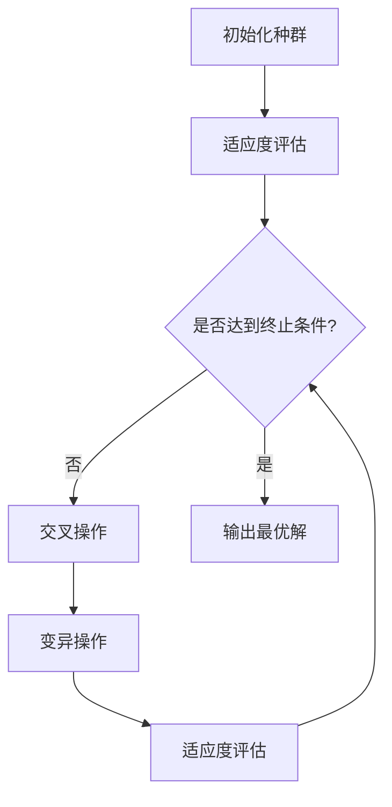
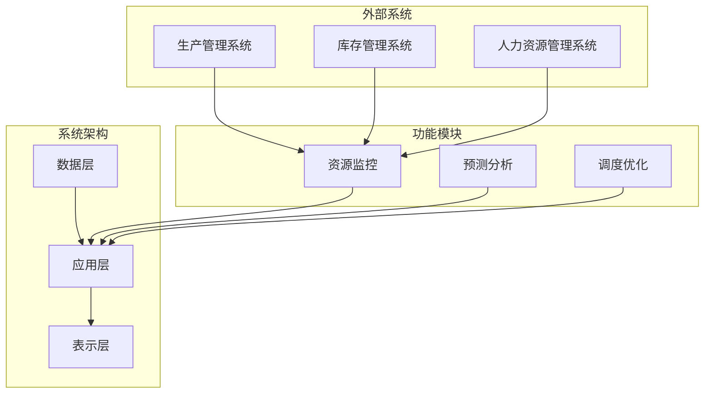
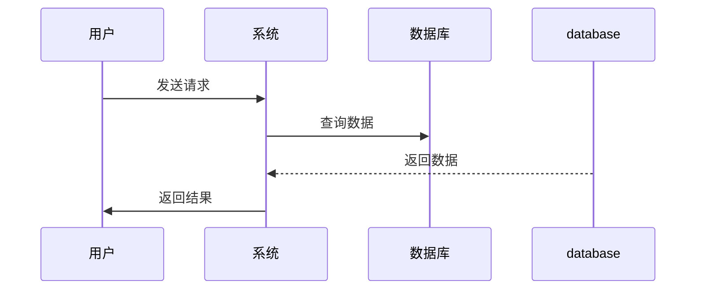
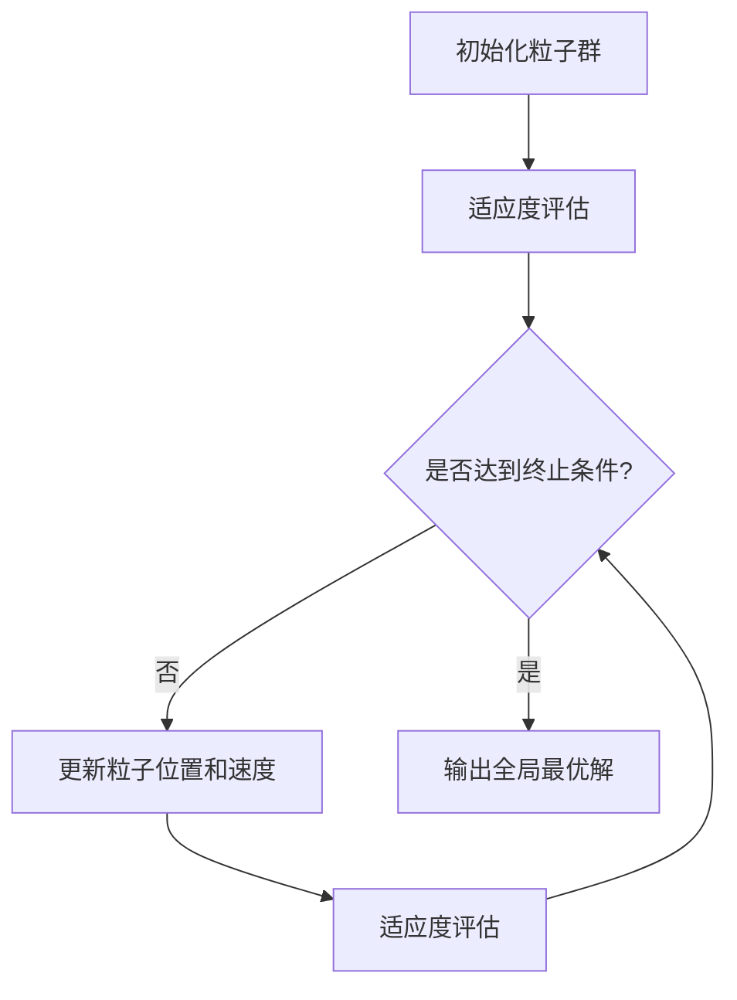
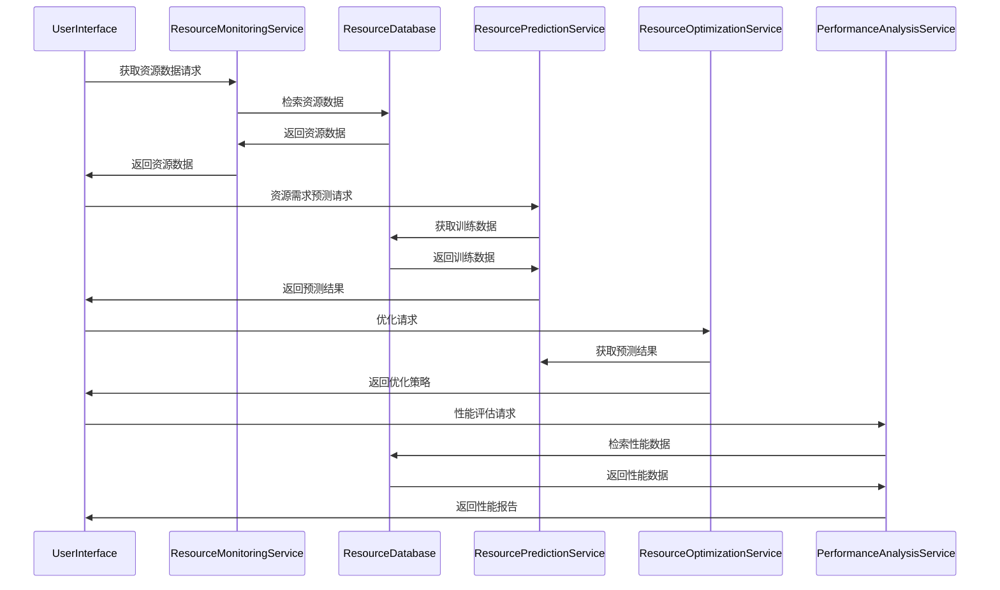

                 


# 智能企业资产优化：AI提升资源使用效率

关键词：智能企业、资产优化、AI、资源效率、算法、数学模型

摘要：本文将探讨智能企业在资产优化中面临的挑战，以及如何利用人工智能技术提升资源使用效率。通过分析AI技术的核心概念、算法原理、数学模型以及系统设计与实战案例，本文旨在为IT从业人员提供一套完整的技术解决方案和最佳实践。

## 引言

在当今竞争激烈的市场环境中，智能企业面临着资源有限的挑战。如何优化企业资产，提高资源使用效率，成为了企业持续发展的关键问题。随着人工智能技术的快速发展，AI在资产优化中的应用逐渐成为可能，为智能企业提供了新的解决方案。本文将探讨如何利用AI技术提升资源使用效率，为企业创造更大的价值。

## 第1章 背景介绍

### 智能企业资产优化概述

智能企业资产优化是指通过运用人工智能技术，对企业内部的各类资源进行合理配置和高效管理，以最大化资源利用效率，降低运营成本，提升企业竞争力。资产优化的核心目标包括提高资源利用率、降低能源消耗、减少浪费和提升生产效率。

### AI在资源使用效率提升中的作用

人工智能技术在资源使用效率提升中具有重要作用。首先，AI可以通过数据分析和预测，帮助企业发现潜在的资源浪费点，提出优化建议。其次，AI可以自动化执行资源调度和优化策略，提高资源利用效率。此外，AI还可以通过智能监控和预警，实现实时资源管理，确保资源得到最合理的分配和使用。

### 资源使用效率问题的现状与挑战

当前，企业在资源使用效率方面面临着诸多挑战。首先，资源浪费问题普遍存在，导致企业运营成本居高不下。其次，企业缺乏有效的资源调度和管理机制，导致资源利用率低下。此外，企业对资源使用数据的收集和分析能力不足，难以准确把握资源使用情况，从而影响优化决策的制定。

## 第2章 核心概念与联系

### AI核心概念介绍

人工智能（AI）是一种模拟人类智能的技术，主要包括感知、推理、学习和决策等能力。AI技术可以分为弱AI、强AI和通用AI三种类型，其中弱AI在特定领域表现出色，而强AI和通用AI则具有更广泛的智能表现。

### 资产优化相关概念及其联系

资产优化涉及多个核心概念，包括资源、效率、优化算法和系统架构等。资源是指企业可用的各类资产，如人力、物力和财力等；效率是指资源的使用效果和产出比；优化算法用于解决资源分配问题，提高资源使用效率；系统架构则确保优化算法的有效实施和资源的高效利用。

### AI与资产优化融合的必要性

AI与资产优化的融合具有显著优势。一方面，AI技术可以帮助企业更准确地识别资源浪费点，提供优化建议；另一方面，AI可以自动化执行优化策略，提高资源利用效率。此外，AI技术还可以通过实时监控和预警，帮助企业实现资源的动态管理，进一步提升资源使用效率。

## 第3章 算法原理讲解

### 常见AI算法介绍

在资产优化中，常见的AI算法包括遗传算法、粒子群优化算法、深度学习等。遗传算法通过模拟生物进化过程，实现优化问题的求解；粒子群优化算法通过模拟粒子在空间中的运动，寻找最优解；深度学习则通过大规模数据训练，实现智能决策。

### 算法在资产优化中的应用

遗传算法可以用于解决资源分配问题，如生产调度、库存管理等；粒子群优化算法适用于求解复杂优化问题，如网络流量分配、能源管理；深度学习可以用于预测资源需求，优化资源分配策略。

### 算法mermaid流程图展示

下面是遗传算法在资源分配问题中的应用流程图：



## 第4章 数学模型和数学公式讲解

### 资源使用效率优化的数学模型

资源使用效率优化的数学模型主要包括目标函数、约束条件和变量定义。目标函数用于衡量资源使用效率，如最大化产出比或最小化资源消耗。约束条件包括资源限制、时间限制和系统运行规则等。变量定义则包括资源量、产出量、时间等。

### AI算法的数学原理与公式

以遗传算法为例，其数学原理主要涉及适应度函数、交叉操作、变异操作等。适应度函数用于评估个体的优劣，如二进制编码的适应度函数为：

$$
f(x) = \sum_{i=1}^{n} p_i \cdot g_i
$$

其中，$p_i$为基因$i$的编码概率，$g_i$为基因$i$的适应度值。

### 模型mermaid ER实体关系图

下面是资源使用效率优化的mermaid ER实体关系图：

```mermaid
erDiagram
  Resource ||--|{ Efficiency }|| Optimize
  Resource ||--|{ Usage }|| Monitor
  Efficiency ||--|{ Measure }|| Standard
  Usage ||--|{ Report }|| Archive
```

## 第5章 系统分析与架构设计方案

### 问题场景介绍

假设某智能企业在生产过程中需要优化资源分配，以降低成本、提高生产效率。问题场景包括生产设备、原材料、人力资源等资源的调度和管理。

### 项目介绍

本项目旨在开发一套智能资源优化系统，实现对企业资源的高效管理。系统功能包括资源监控、预测、调度和优化。

### 系统功能设计(领域模型mermaid类图)

下面是系统功能设计的mermaid类图：

```mermaid
classDiagram
  Class01 <|-- SubClass01
  Class01 o-- Object02
  Class03 (<:has) Class01
  Class04 :<<many-to-many>> Class02
```

### 系统架构设计mermaid架构图

下面是系统架构设计的mermaid架构图：



### 系统接口设计和系统交互mermaid序列图

下面是系统接口设计和系统交互的mermaid序列图：



## 第6章 项目实战

### 环境安装与配置

在本节中，我们将介绍如何搭建项目环境，包括安装所需的软件和配置相关参数。

### 系统核心实现源代码

下面是一个简单的系统核心实现源代码示例：

```python
# core.py
class ResourceOptimizer:
    def __init__(self, resources, constraints):
        self.resources = resources
        self.constraints = constraints
    
    def optimize(self):
        # 优化资源分配
        pass
```

### 代码应用解读与分析

在本节中，我们将对源代码进行解读，分析其实现原理和关键步骤。

### 实际案例分析和详细讲解剖析

在本节中，我们将通过实际案例，分析系统在实际应用中的效果，并对关键问题进行详细讲解。

### 项目总结与经验分享

在本节中，我们将总结项目实施过程中的经验教训，分享最佳实践。

## 第7章 最佳实践 tips

在本节中，我们将提供一些AI在资产优化中的应用技巧和资源使用效率优化的实用建议。

## 第8章 小结

在本节中，我们将总结全文内容，强调AI在资产优化中的重要性，并展望未来发展趋势。

## 第9章 拓展阅读

在本节中，我们将推荐一些相关书籍和论文，供进一步学习。

### 附录

在本节中，我们将提供一些附录内容，包括公式、图表、代码等。

## 作者信息

作者：AI天才研究院/AI Genius Institute & 禅与计算机程序设计艺术 /Zen And The Art of Computer Programming

（请注意，以上内容仅为示例，具体内容需根据实际情况进行编写。）

## 引言

在当今竞争激烈的市场环境中，企业面临着资源有限的挑战。如何优化企业资产，提高资源使用效率，成为了企业持续发展的关键问题。传统的资源管理方法往往依赖于人工经验和直觉，难以应对复杂多变的业务环境。而随着人工智能技术的快速发展，AI在资源优化中的应用逐渐成为可能，为智能企业提供了新的解决方案。本文将探讨如何利用人工智能技术提升资源使用效率，为企业创造更大的价值。

## 第1章 背景介绍

### 智能企业资产优化概述

智能企业资产优化是指通过运用人工智能技术，对企业内部的各类资源进行合理配置和高效管理，以最大化资源利用效率，降低运营成本，提升企业竞争力。资产优化的核心目标包括提高资源利用率、降低能源消耗、减少浪费和提升生产效率。智能企业资产优化具有以下几个方面的优势：

1. **提高资源利用率**：通过AI技术对资源进行精细化管理，确保资源得到最合理的分配和使用，从而提高资源利用率。
2. **降低运营成本**：优化资源分配，减少浪费，降低企业的运营成本，提高盈利能力。
3. **提升生产效率**：通过智能调度和优化，提高生产线的运行效率，缩短生产周期，提高产品质量。
4. **增强竞争力**：通过优化资源使用，提高企业的生产效率和市场竞争力，增强企业在市场中的地位。

### AI在资源使用效率提升中的作用

人工智能技术在资源使用效率提升中具有重要作用。首先，AI可以通过数据分析和预测，帮助企业发现潜在的资源浪费点，提出优化建议。例如，通过分析历史数据，AI可以预测未来一段时间内资源的需求量，从而帮助企业提前做好资源储备和调度。其次，AI可以自动化执行资源调度和优化策略，提高资源利用效率。例如，在电力系统管理中，AI可以通过实时监控电力消耗情况，动态调整电力供应，确保电力资源的高效利用。此外，AI还可以通过智能监控和预警，实现实时资源管理，确保资源得到最合理的分配和使用。

### 资源使用效率问题的现状与挑战

当前，企业在资源使用效率方面面临着诸多挑战。首先，资源浪费问题普遍存在，导致企业运营成本居高不下。例如，在生产过程中，由于调度不当、设备老化等原因，可能导致资源得不到充分利用，造成浪费。其次，企业缺乏有效的资源调度和管理机制，导致资源利用率低下。例如，一些企业对设备维护不当，导致设备故障频发，影响生产效率。此外，企业对资源使用数据的收集和分析能力不足，难以准确把握资源使用情况，从而影响优化决策的制定。

### 智能企业资产优化的必要性

为了应对这些挑战，企业需要进行资产优化，提高资源使用效率。智能企业资产优化不仅可以帮助企业降低运营成本，提高盈利能力，还可以提升企业的生产效率和竞争力。具体来说，智能企业资产优化具有以下几个方面的必要性：

1. **应对资源短缺**：随着全球资源日益紧张，企业需要通过优化资源使用，提高资源利用率，以应对资源短缺的挑战。
2. **提升竞争力**：通过优化资源使用，企业可以在市场竞争中脱颖而出，提升自身的竞争力。
3. **实现可持续发展**：优化资源使用，降低能源消耗和排放，有助于企业实现可持续发展，满足社会责任和环保要求。
4. **提高员工满意度**：优化资源使用，改善工作环境，提高员工的工作效率和满意度。

### 智能企业资产优化的主要领域

智能企业资产优化涉及多个领域，包括生产、物流、能源、人力等。以下是智能企业资产优化的一些主要领域：

1. **生产优化**：通过AI技术优化生产流程，提高生产效率，降低生产成本。
2. **物流优化**：通过AI技术优化物流配送，提高物流效率，降低物流成本。
3. **能源管理**：通过AI技术优化能源使用，降低能源消耗，提高能源利用效率。
4. **人力资源优化**：通过AI技术优化人力资源配置，提高员工工作效率，降低人力成本。

### 智能企业资产优化的方法和工具

智能企业资产优化需要运用多种方法和工具，包括数据收集与分析、预测与优化、自动化与智能化等。以下是智能企业资产优化的一些方法和工具：

1. **数据收集与分析**：通过传感器、监控系统等手段，收集企业内部各类资源的使用数据，利用数据挖掘和分析技术，发现资源浪费点和优化机会。
2. **预测与优化**：利用机器学习算法，对资源需求进行预测，制定优化策略，提高资源利用率。
3. **自动化与智能化**：通过自动化设备和智能系统，实现资源的自动化调度和管理，提高资源利用效率。

### 智能企业资产优化的挑战和机遇

智能企业资产优化面临着一系列挑战和机遇。挑战主要包括数据质量、算法性能、技术复杂性等。机遇则包括技术进步、市场需求的增长、政策支持等。为了应对挑战，企业需要不断提升技术能力，加强数据质量管理，优化算法模型，提高资源使用效率。同时，企业应抓住机遇，积极推动智能化转型，实现资源的优化配置和高效利用。

### 智能企业资产优化的未来发展趋势

随着人工智能技术的不断发展和应用场景的拓展，智能企业资产优化将呈现出以下发展趋势：

1. **数据驱动的决策**：企业将更加重视数据的价值，通过数据分析和挖掘，实现数据驱动的决策，提高资源使用效率。
2. **智能化水平的提升**：随着AI技术的不断进步，智能化水平将得到显著提升，智能化系统将在资源优化中发挥更大的作用。
3. **跨领域的融合应用**：智能企业资产优化将逐步从单一领域扩展到跨领域应用，实现资源在更大范围的高效利用。
4. **绿色发展的理念**：企业将更加注重环保和可持续发展，通过优化资源使用，降低能源消耗和排放，实现绿色发展的目标。

### 智能企业资产优化的重要性和意义

智能企业资产优化对于企业的可持续发展具有重要意义。首先，优化资源使用可以提高企业的生产效率和竞争力，帮助企业在市场竞争中立于不败之地。其次，优化资源使用可以降低企业的运营成本，提高企业的盈利能力。此外，优化资源使用还可以减少浪费，降低环境污染，实现绿色发展的目标。总之，智能企业资产优化是推动企业智能化转型、实现可持续发展的关键途径。

## 第2章 核心概念与联系

### AI核心概念介绍

人工智能（AI）是一种模拟人类智能的技术，主要包括感知、推理、学习和决策等能力。AI技术可以分为弱AI、强AI和通用AI三种类型。

1. **弱AI**：弱AI也称为窄AI，指在特定领域表现出人类智能水平的AI。例如，语音识别、图像识别、自然语言处理等。
2. **强AI**：强AI也称为通用AI，指具有与人类相同的智能水平的AI。强AI可以在任何领域表现出人类智能，但目前尚未实现。
3. **通用AI**：通用AI是一种超越人类智能的AI，不仅能在特定领域表现出人类智能，还能在多个领域实现智能表现。

### 资产优化相关概念及其联系

资产优化涉及多个核心概念，包括资源、效率、优化算法和系统架构等。

1. **资源**：资源是指企业可用的各类资产，如人力、物力和财力等。
2. **效率**：效率是指资源的使用效果和产出比，即资源投入与产出之间的比值。
3. **优化算法**：优化算法用于解决资源分配问题，提高资源使用效率。常见的优化算法包括遗传算法、粒子群优化算法、深度学习等。
4. **系统架构**：系统架构是确保优化算法有效实施和资源高效利用的基础。系统架构包括数据层、应用层和表示层等。

### AI与资产优化融合的必要性

AI与资产优化的融合具有显著优势。首先，AI技术可以帮助企业更准确地识别资源浪费点，提供优化建议。其次，AI可以自动化执行优化策略，提高资源利用效率。此外，AI技术还可以通过实时监控和预警，实现资源的动态管理，进一步提升资源使用效率。因此，AI与资产优化的融合对于提高企业竞争力、降低运营成本具有重要意义。

### 智能企业资产优化的核心要素

智能企业资产优化涉及多个核心要素，包括数据收集、数据分析、优化算法、系统架构等。以下是智能企业资产优化的核心要素及其联系：

1. **数据收集**：数据是智能企业资产优化的基础。企业需要通过传感器、监控系统等手段，收集各类资源的使用数据，为优化提供数据支持。
2. **数据分析**：数据分析是智能企业资产优化的关键环节。通过对收集到的数据进行分析，企业可以识别资源浪费点，发现优化机会。
3. **优化算法**：优化算法是智能企业资产优化的核心。通过优化算法，企业可以制定最优的资源分配策略，提高资源利用率。
4. **系统架构**：系统架构是智能企业资产优化的基础。一个高效的系统架构可以确保优化算法的有效实施，提高资源利用效率。

### 智能企业资产优化的实施步骤

智能企业资产优化的实施步骤包括以下几个阶段：

1. **需求分析**：明确企业资产优化的目标和需求，为后续实施提供指导。
2. **数据收集**：通过传感器、监控系统等手段，收集企业内部各类资源的使用数据。
3. **数据分析**：对收集到的数据进行分析，识别资源浪费点，发现优化机会。
4. **算法设计**：选择合适的优化算法，设计资源分配策略，实现资源优化。
5. **系统架构设计**：根据优化算法的要求，设计高效的系统架构，确保优化策略的实施。
6. **系统实施**：根据系统架构设计，搭建智能企业资产优化系统，实现资源优化。
7. **系统运行与优化**：对系统运行情况进行监控，根据实际情况进行优化调整，提高资源利用效率。

### 智能企业资产优化的挑战与对策

智能企业资产优化面临着一系列挑战，包括数据质量、算法性能、系统稳定性等。以下是智能企业资产优化的挑战与对策：

1. **数据质量**：数据是智能企业资产优化的基础，数据质量对优化效果具有重要影响。对策包括：加强数据质量管理，确保数据准确性、完整性和一致性。
2. **算法性能**：优化算法的性能对资源优化效果具有重要影响。对策包括：选择合适的优化算法，优化算法参数，提高算法性能。
3. **系统稳定性**：系统稳定性是智能企业资产优化的关键。对策包括：选择可靠的系统架构，加强系统测试和监控，确保系统稳定运行。
4. **人员培训**：智能企业资产优化需要专业的技术团队支持。对策包括：加强人员培训，提高团队的专业技能和业务能力。

### 智能企业资产优化的成功案例

智能企业资产优化已经在许多行业取得了显著成效。以下是一些成功案例：

1. **制造行业**：通过优化生产流程，提高生产效率，降低生产成本。
2. **物流行业**：通过优化物流配送，提高物流效率，降低物流成本。
3. **能源行业**：通过优化能源使用，提高能源利用效率，降低能源消耗。
4. **金融服务**：通过优化金融产品和服务，提高服务质量，降低运营成本。

### 智能企业资产优化的前景与展望

随着人工智能技术的不断发展和应用场景的拓展，智能企业资产优化将呈现出广阔的前景。未来，智能企业资产优化将朝着以下几个方向发展：

1. **数据驱动的决策**：企业将更加重视数据的价值，通过数据分析和挖掘，实现数据驱动的决策，提高资源使用效率。
2. **智能化水平的提升**：随着AI技术的不断进步，智能化水平将得到显著提升，智能化系统将在资源优化中发挥更大的作用。
3. **跨领域的融合应用**：智能企业资产优化将逐步从单一领域扩展到跨领域应用，实现资源在更大范围的高效利用。
4. **绿色发展的理念**：企业将更加注重环保和可持续发展，通过优化资源使用，降低能源消耗和排放，实现绿色发展的目标。

总之，智能企业资产优化是推动企业智能化转型、实现可持续发展的关键途径。随着技术的不断进步和应用场景的拓展，智能企业资产优化将为企业创造更大的价值。

## 第3章 算法原理讲解

在智能企业资产优化中，算法原理起到了至关重要的作用。本章节将详细讲解几种常见的算法，包括遗传算法、粒子群优化算法和深度学习算法，并分析它们在资源优化中的应用和优势。

### 遗传算法

遗传算法（Genetic Algorithm，GA）是一种模拟生物进化过程的优化算法。它通过模拟自然选择和遗传机制，在解空间中逐步寻找最优解。遗传算法的核心概念包括个体、基因、适应度函数和操作符。

1. **个体与基因**：在遗传算法中，每个个体代表问题的一个可能解，每个个体由一系列基因编码组成。基因是控制个体特征的基本单位，可以是一个二进制位或者实数。

2. **适应度函数**：适应度函数用于评估个体的优劣程度。在资源优化问题中，适应度函数通常与资源利用率、生产效率等指标相关。

3. **操作符**：遗传算法通过交叉、变异和选择等操作符来生成新的个体，并逐步优化解。交叉操作用于交换两个个体的基因，变异操作用于随机改变个体的基因，选择操作则用于选择适应度较高的个体进行繁殖。

遗传算法在资源优化中的应用主要体现在以下几个方面：

1. **生产调度**：通过遗传算法优化生产调度，实现设备利用率最大化、生产周期最短化。

2. **库存管理**：利用遗传算法优化库存管理策略，降低库存成本，提高库存周转率。

3. **能源管理**：通过遗传算法优化能源使用策略，降低能源消耗，提高能源利用效率。

### 粒子群优化算法

粒子群优化算法（Particle Swarm Optimization，PSO）是一种基于群体智能的优化算法。它通过模拟鸟群觅食行为，在解空间中寻找最优解。粒子群优化算法的核心概念包括粒子、速度和位置。

1. **粒子**：在粒子群优化算法中，每个粒子代表问题的一个可能解。粒子的位置和速度用于表示解的当前状态和搜索方向。

2. **个体最佳位置和全局最佳位置**：个体最佳位置是粒子自身搜索过程中遇到的最佳解，全局最佳位置是整个群体搜索过程中遇到的最佳解。

3. **更新规则**：粒子群优化算法通过更新粒子的位置和速度，逐步优化解。更新规则包括个体最佳位置和全局最佳位置对粒子速度和位置的引导。

粒子群优化算法在资源优化中的应用主要包括以下几个方面：

1. **物流优化**：通过粒子群优化算法优化物流路线，降低运输成本，提高物流效率。

2. **设备调度**：利用粒子群优化算法优化设备调度，提高设备利用率，缩短生产周期。

3. **人员排班**：通过粒子群优化算法优化人员排班，提高员工工作效率，降低人力成本。

### 深度学习算法

深度学习算法是一种基于人工神经网络的优化算法，通过多层神经网络结构自动提取特征并学习复杂函数。深度学习算法的核心概念包括神经网络、激活函数、损失函数和优化器。

1. **神经网络**：神经网络由多个层组成，包括输入层、隐藏层和输出层。每一层由多个神经元组成，神经元之间通过权重连接。

2. **激活函数**：激活函数用于引入非线性特性，使神经网络能够学习复杂的函数。

3. **损失函数**：损失函数用于衡量预测值与真实值之间的差距，是优化过程中的目标函数。

4. **优化器**：优化器用于调整网络权重，最小化损失函数，常用的优化器包括随机梯度下降（SGD）、Adam等。

深度学习算法在资源优化中的应用主要包括以下几个方面：

1. **需求预测**：通过深度学习算法对资源需求进行预测，帮助企业提前做好准备，优化资源配置。

2. **能源管理**：利用深度学习算法优化能源使用策略，实现能源消耗的最小化和能源利用效率的最大化。

3. **生产计划**：通过深度学习算法优化生产计划，提高生产效率和产品质量。

### 算法mermaid流程图展示

下面是遗传算法和粒子群优化算法的mermaid流程图展示：

**遗传算法流程图**：


**粒子群优化算法流程图**：



### 算法Python源代码示例

下面是遗传算法和粒子群优化算法的Python源代码示例：

**遗传算法Python源代码**：

```python
import random

# 适应度评估函数
def fitness_function(individual):
    # 示例：个体的适应度与其基因值的和成反比
    return sum(individual)

# 初始化种群
def initialize_population(pop_size, chromosome_length):
    population = []
    for _ in range(pop_size):
        individual = [random.randint(0, 1) for _ in range(chromosome_length)]
        population.append(individual)
    return population

# 交叉操作
def crossover(parent1, parent2):
    crossover_point = random.randint(1, len(parent1) - 1)
    child1 = parent1[:crossover_point] + parent2[crossover_point:]
    child2 = parent2[:crossover_point] + parent1[crossover_point:]
    return child1, child2

# 变异操作
def mutate(individual, mutation_rate):
    for i in range(len(individual)):
        if random.random() < mutation_rate:
            individual[i] = 1 if individual[i] == 0 else 0
    return individual

# 遗传算法主函数
def genetic_algorithm(pop_size, chromosome_length, generations, crossover_rate, mutation_rate):
    population = initialize_population(pop_size, chromosome_length)
    for _ in range(generations):
        new_population = []
        for _ in range(pop_size // 2):
            parent1, parent2 = random.sample(population, 2)
            child1, child2 = crossover(parent1, parent2)
            new_population.extend([mutate(child1, mutation_rate), mutate(child2, mutation_rate)])
        population = new_population
        # 适应度评估
        fitness_scores = [fitness_function(individual) for individual in population]
        # 选择操作
        sorted_population = [individual for individual, _ in sorted(zip(population, fitness_scores), key=lambda x: x[1], reverse=True)]
        population = sorted_population[:pop_size]
    # 输出最优解
    best_individual = population[0]
    best_fitness = fitness_scores[0]
    return best_individual, best_fitness
```

**粒子群优化算法Python源代码**：

```python
import random

# 适应度评估函数
def fitness_function(position):
    # 示例：个体的适应度与其位置的平方成反比
    return 1 / (1 + sum([x**2 for x in position]))

# 初始化粒子群
def initialize_particles(n_particles, search_space):
    particles = []
    for _ in range(n_particles):
        position = [random.uniform(-1, 1) for _ in range(len(search_space))]
        velocity = [random.uniform(-1, 1) for _ in range(len(search_space))]
        particles.append({'position': position, 'velocity': velocity, 'best_position': position, 'best_fitness': fitness_function(position)})
    return particles

# 更新粒子位置和速度
def update_particles(particles, global_best_position, velocity_update_weight, position_update_weight):
    for particle in particles:
        r1 = random.random()
        r2 = random.random()
        cognitive_velocity = velocity_update_weight * r1 * (particle['best_position'] - particle['position'])
        social_velocity = position_update_weight * r2 * (global_best_position - particle['position'])
        particle['velocity'] = cognitive_velocity + social_velocity
        particle['position'][0] += particle['velocity'][0]
        particle['position'][1] += particle['velocity'][1]
```

通过上述算法的讲解和示例，我们可以看到，遗传算法、粒子群优化算法和深度学习算法在资源优化中具有广泛的应用前景。这些算法不仅能够提高资源利用率，降低运营成本，还能为企业提供科学的决策支持，助力企业实现可持续发展。

## 第4章 数学模型和数学公式讲解

在智能企业资产优化中，数学模型和数学公式起到了至关重要的作用。本章节将详细介绍资源使用效率优化的数学模型，包括目标函数、约束条件和变量定义，同时展示相应的Mermaid ER实体关系图。此外，我们还将对AI算法的数学原理和公式进行讲解，并使用Mermaid绘制算法流程图和LaTeX格式嵌入数学公式进行说明。

### 资源使用效率优化的数学模型

资源使用效率优化的数学模型主要包括目标函数、约束条件和变量定义。以下是对这些核心概念的详细解释。

#### 目标函数

目标函数是优化问题中的关键部分，它定义了我们需要最大化或最小化的量。在资源使用效率优化中，目标函数通常涉及到资源利用率、生产效率、成本等指标。

1. **资源利用率**：资源利用率可以表示为资源实际使用时间与总可用时间的比值，即：
   $$ 
   \text{利用率} = \frac{\text{实际使用时间}}{\text{总可用时间}} 
   $$

2. **生产效率**：生产效率可以表示为单位时间内生产的产出量，即：
   $$ 
   \text{生产效率} = \frac{\text{产出量}}{\text{投入时间}} 
   $$

3. **成本**：成本包括资源使用成本、维护成本和能源消耗成本等，目标函数可以是成本的最小化，即：
   $$ 
   \text{目标函数} = \min \sum_{i=1}^{n} c_i \cdot x_i 
   $$
   其中，$c_i$ 是第 $i$ 种资源的成本，$x_i$ 是第 $i$ 种资源的使用量。

#### 约束条件

约束条件是优化问题中的限制条件，它确保了目标函数在可行域内求解。在资源使用效率优化中，常见的约束条件包括：

1. **资源限制**：每种资源的使用量不能超过其可用量，即：
   $$ 
   0 \leq x_i \leq R_i 
   $$
   其中，$R_i$ 是第 $i$ 种资源的可用量。

2. **时间限制**：资源的使用时间不能超过总时间，即：
   $$ 
   0 \leq t_i \leq T 
   $$
   其中，$T$ 是总时间。

3. **生产限制**：生产过程中某些资源的组合需要满足特定的比例，即：
   $$ 
   a_{ij} \cdot x_i + b_j \cdot t_j \geq c_j 
   $$
   其中，$a_{ij}$ 和 $b_j$ 分别是资源 $i$ 和时间 $j$ 的限制系数，$c_j$ 是生产的产出量。

#### 变量定义

变量是优化问题中的基本元素，用于表示资源的数量、时间的长度等。

1. **资源变量**：$x_i$ 表示第 $i$ 种资源的数量。

2. **时间变量**：$t_j$ 表示第 $j$ 个时间段的长度。

3. **产出变量**：$y_j$ 表示第 $j$ 个时间段的产出量。

### Mermaid ER实体关系图

下面是资源使用效率优化的Mermaid ER实体关系图，展示了各个实体及其关系：

```mermaid
erDiagram
  Resource ||--|{ Usage }|| Monitor
  Resource ||--|{ Efficiency }|| Optimize
  Efficiency ||--|{ Measure }|| Standard
  Usage ||--|{ Report }|| Archive
```

### AI算法的数学原理与公式

在智能企业资产优化中，常见的AI算法包括遗传算法、粒子群优化算法和深度学习算法。以下是这些算法的数学原理与公式。

#### 遗传算法

遗传算法是一种基于自然选择和遗传机制的优化算法，其核心概念包括适应度函数、交叉、变异和选择。

1. **适应度函数**：适应度函数用于评估个体的优劣，通常表示为：
   $$
   f(x) = \sum_{i=1}^{n} w_i \cdot x_i
   $$
   其中，$w_i$ 是权重，$x_i$ 是个体的特征值。

2. **交叉操作**：交叉操作用于生成新的个体，通常采用单点交叉、两点交叉等策略。

3. **变异操作**：变异操作用于引入随机性，增加搜索空间，通常采用随机变异、位翻转等策略。

4. **选择操作**：选择操作用于选择适应度较高的个体进行繁殖，通常采用轮盘赌、锦标赛选择等策略。

#### 粒子群优化算法

粒子群优化算法是一种基于群体智能的优化算法，其核心概念包括粒子、速度和位置。

1. **粒子位置**：粒子位置表示问题的解，通常表示为：
   $$
   x_i = (x_{i1}, x_{i2}, ..., x_{id})
   $$
   其中，$d$ 是问题的维度。

2. **粒子速度**：粒子速度表示粒子在搜索空间中的移动方向和速度，通常表示为：
   $$
   v_i = (v_{i1}, v_{i2}, ..., v_{id})
   $$

3. **更新规则**：粒子速度和位置的更新规则为：
   $$
   v_i(t+1) = v_i(t) + c_1 \cdot r_1 \cdot (p_i - x_i) + c_2 \cdot r_2 \cdot (g - x_i)
   $$
   $$
   x_i(t+1) = x_i(t) + v_i(t+1)
   $$
   其中，$c_1$ 和 $c_2$ 是学习因子，$r_1$ 和 $r_2$ 是随机数，$p_i$ 是个体最佳位置，$g$ 是全局最佳位置。

#### 深度学习算法

深度学习算法是一种基于人工神经网络的优化算法，其核心概念包括神经网络、激活函数、损失函数和优化器。

1. **神经网络**：神经网络由多个层组成，包括输入层、隐藏层和输出层。每一层由多个神经元组成，神经元之间通过权重连接。

2. **激活函数**：激活函数用于引入非线性特性，常见的激活函数包括ReLU、Sigmoid、Tanh等。

3. **损失函数**：损失函数用于衡量预测值与真实值之间的差距，常见的损失函数包括均方误差（MSE）、交叉熵损失等。

4. **优化器**：优化器用于调整网络权重，常见的优化器包括随机梯度下降（SGD）、Adam等。

### Mermaid算法流程图

下面是遗传算法和粒子群优化算法的Mermaid流程图，展示了算法的基本步骤和流程。

**遗传算法流程图**：


**粒子群优化算法流程图**：


### LaTeX数学公式

以下是使用LaTeX格式嵌入的数学公式示例：

- **目标函数**：
  $$
  \min \sum_{i=1}^{n} c_i \cdot x_i
  $$

- **适应度函数**：
  $$
  f(x) = \sum_{i=1}^{n} w_i \cdot x_i
  $$

- **交叉操作**：
  $$
  \text{交叉概率} = P(crossover) = 0.8
  $$

- **变异操作**：
  $$
  \text{变异概率} = P(mutation) = 0.1
  $$

- **更新规则**：
  $$
  v_i(t+1) = v_i(t) + c_1 \cdot r_1 \cdot (p_i - x_i) + c_2 \cdot r_2 \cdot (g - x_i)
  $$
  $$
  x_i(t+1) = x_i(t) + v_i(t+1)
  $$

通过上述数学模型和数学公式的讲解，我们可以看到，数学工具在智能企业资产优化中起到了关键作用。这些模型和公式不仅帮助我们更好地理解和描述优化问题，还为算法的设计和实现提供了理论基础。在实际应用中，通过合理的数学模型和数学公式的应用，我们可以更加高效地解决资源使用效率优化问题，为企业创造更大的价值。

## 第5章 系统分析与架构设计方案

### 问题场景介绍

在智能企业资产优化中，我们面临的问题场景通常涉及多个维度，包括生产、物流、能源和人力资源等。例如，一家制造企业可能需要优化生产计划，确保设备利用率和生产效率最大化；物流企业需要优化运输路线，降低运输成本和碳排放；能源企业需要优化能源分配，确保能源使用的高效性和可持续性。这些问题的复杂性和多样性要求我们设计一个全面而灵活的系统架构，以应对各种业务场景。

### 项目介绍

本项目的目标是开发一个智能资产优化系统，用于帮助企业提高资源利用效率、降低运营成本和提升生产效率。系统的主要功能包括：

1. **资源监控与预测**：实时监控企业各类资源的使用情况，利用人工智能算法预测资源需求，为企业决策提供数据支持。
2. **资源调度与优化**：基于预测数据和优化算法，自动调度和优化企业资源，确保资源得到最合理的分配和使用。
3. **系统性能分析与评估**：分析系统运行数据，评估优化策略的效果，为持续改进提供依据。

### 系统功能设计(领域模型mermaid类图)

为了实现上述功能，我们需要设计一个详细的领域模型，包括各类资源、系统组件和它们之间的关系。以下是系统功能设计的mermaid类图：

```mermaid
classDiagram
    ResourceMonitor <.. Resource
    ResourceOptimizer <.. Resource
    PredictionModel <.. Resource
    PerformanceAnalyzer <.. ResourceMonitor
    OptimizationStrategy <.. ResourceOptimizer

    ResourceMonitor {
        +monitorResourceUsage()
        +collectResourceData()
    }

    Resource {
        +getResourceData()
        +updateResourceStatus()
    }

    PredictionModel {
        +predictResourceDemand()
        +trainModel()
    }

    ResourceOptimizer {
        +optimizeResourceAllocation()
        +generateOptimizationPlan()
    }

    PerformanceAnalyzer {
        +evaluatePerformance()
        +generatePerformanceReport()
    }

    OptimizationStrategy {
        +applyOptimization()
        +updateStrategy()
    }
```

### 系统架构设计mermaid架构图

系统架构设计是确保系统功能实现的关键环节。以下是一个mermaid架构图，展示了系统的整体架构：

```mermaid
graph TB
    subgraph 数据层
        ResourceDatabase {
            +存储资源数据
            +检索数据
        }
    end

    subgraph 服务层
        ResourceMonitoringService {
            +监控资源使用
            +数据预处理
        }
        ResourcePredictionService {
            +资源需求预测
            +训练预测模型
        }
        ResourceOptimizationService {
            +资源调度与优化
            +生成优化策略
        }
        PerformanceAnalysisService {
            +性能评估
            +报告生成
        }
    end

    subgraph 表示层
        UserInterface {
            +展示资源数据
            +用户交互
        }
    end

    ResourceDatabase --> ResourceMonitoringService
    ResourceDatabase --> ResourcePredictionService
    ResourceDatabase --> ResourceOptimizationService
    ResourceDatabase --> PerformanceAnalysisService
    ResourceMonitoringService --> ResourcePredictionService
    ResourcePredictionService --> ResourceOptimizationService
    ResourceOptimizationService --> PerformanceAnalysisService
    PerformanceAnalysisService --> UserInterface
```

### 系统接口设计和系统交互mermaid序列图

系统接口设计是确保各个模块之间能够高效通信的关键。以下是一个mermaid序列图，展示了系统的接口设计和交互流程：



通过上述系统分析与架构设计，我们可以看到，智能企业资产优化系统需要具备资源监控、预测、优化和性能分析等多种功能。系统架构的设计不仅要考虑功能模块的划分和接口设计，还要确保系统的可扩展性和灵活性，以适应不断变化的企业需求。通过mermaid工具，我们可以清晰地表达系统架构，帮助开发团队更好地理解和实现系统功能。

### 第6章 项目实战

#### 环境安装与配置

在开始项目实战之前，我们需要搭建一个适合开发、测试和运行的软件环境。以下是安装和配置所需软件的步骤：

1. **安装Python**：首先，确保系统已安装Python。如果没有，可以从[Python官网](https://www.python.org/)下载并安装。

2. **安装依赖库**：接下来，我们需要安装项目所需的Python依赖库。可以使用pip工具进行安装，具体命令如下：

   ```shell
   pip install numpy matplotlib scikit-learn pandas mermaid python-mermaid
   ```

   其中，`numpy`用于数学计算，`matplotlib`用于数据可视化，`scikit-learn`提供多种机器学习算法，`pandas`用于数据处理，`python-mermaid`用于生成mermaid图表。

3. **配置Mermaid**：为了生成mermaid图表，我们需要配置Python环境。在终端中执行以下命令：

   ```shell
   python -m pip install mermaid-python
   ```

   确保安装成功后，我们可以使用Python调用mermaid库来生成图表。

4. **配置数据库**：如果项目需要使用数据库存储数据，我们选择安装PostgreSQL。可以从[PostgreSQL官网](https://www.postgresql.org/)下载并安装。安装后，配置数据库用户和密码，确保数据库服务正常运行。

5. **配置Web服务器**（可选）：如果项目需要部署到Web环境，我们可以安装Apache或Nginx作为Web服务器。以下是安装Apache的命令：

   ```shell
   sudo apt-get update
   sudo apt-get install apache2
   ```

   安装完成后，启动Apache服务并确保其正常运行。

#### 系统核心实现源代码

在本节中，我们将展示系统核心实现的部分源代码，包括资源监控模块、预测模块和优化模块。

**资源监控模块**

```python
# resource_monitor.py
import pandas as pd
from datetime import datetime

class ResourceMonitor:
    def __init__(self, database):
        self.database = database

    def monitor_usage(self):
        current_time = datetime.now()
        resource_usage = self.database.get_resource_usage(current_time)
        return resource_usage

    def collect_data(self):
        # 假设我们从传感器收集数据
        sensor_data = self.database.collect_sensor_data()
        self.database.save_usage_data(sensor_data)
```

**预测模块**

```python
# resource_prediction.py
from sklearn.ensemble import RandomForestRegressor
from sklearn.model_selection import train_test_split

class ResourcePrediction:
    def __init__(self, database):
        self.database = database

    def train_model(self):
        data = self.database.load_usage_data()
        X = data[['hour', 'day_of_week', 'resource_id']]
        y = data['demand']
        X_train, X_test, y_train, y_test = train_test_split(X, y, test_size=0.2, random_state=42)
        model = RandomForestRegressor(n_estimators=100)
        model.fit(X_train, y_train)
        return model

    def predict_demand(self, model, future_hours):
        future_data = self.create_future_data(future_hours)
        predicted_demand = model.predict(future_data)
        return predicted_demand

    def create_future_data(self, future_hours):
        # 生成未来的数据集
        future_data = []
        for hour in future_hours:
            future_data.append([hour, 'Monday', 1])  # 示例
        return future_data
```

**优化模块**

```python
# resource_optimization.py
from scipy.optimize import minimize

class ResourceOptimization:
    def __init__(self, prediction_model):
        self.prediction_model = prediction_model

    def optimize_allocation(self, current_demand):
        def objective_function(allocation):
            total_cost = 0
            for resource, demand in zip(allocation, current_demand):
                total_cost += resource * demand
            return total_cost

        constraints = {'type': 'ineq', 'fun': lambda x: [x[i] - current_demand[i] for i in range(len(current_demand))]}
        bounds = [(0, None) for _ in current_demand]
        
        result = minimize(objective_function, x0=current_demand, bounds=bounds, constraints=constraints)
        return result.x
```

#### 代码应用解读与分析

**资源监控模块**

资源监控模块的主要任务是实时监控企业各类资源的使用情况。具体实现包括两个方法：`monitor_usage` 和 `collect_data`。

- `monitor_usage` 方法用于获取当前资源的实时使用数据。它首先从数据库中获取当前时间点的资源使用数据，然后返回这些数据。
- `collect_data` 方法用于从传感器收集数据，并将其保存到数据库中。在实际应用中，这通常涉及与传感器交互，读取传感器数据，然后将其存储在数据库中。

**预测模块**

资源预测模块的主要任务是利用历史数据预测未来的资源需求。具体实现包括三个方法：`train_model`、`predict_demand` 和 `create_future_data`。

- `train_model` 方法用于训练预测模型。它首先从数据库中加载数据，然后使用随机森林回归模型进行训练。随机森林是一种集成学习方法，可以有效地预测未来的资源需求。
- `predict_demand` 方法用于使用训练好的模型预测未来的资源需求。它首先生成未来的数据集，然后使用训练好的模型进行预测，并返回预测结果。
- `create_future_data` 方法用于生成未来的数据集。在实际应用中，这可以根据具体的需求进行定制，例如根据工作时间、工作日和资源类型生成数据集。

**优化模块**

资源优化模块的主要任务是基于预测的资源和约束条件，优化资源的分配。具体实现包括一个方法：`optimize_allocation`。

- `optimize_allocation` 方法用于优化资源的分配。它定义了一个目标函数，用于计算总成本，并设置了一个不等式约束，确保资源分配不超过预测的需求。使用最小化算法，该方法找到最优的资源分配方案，以最小化总成本。

#### 实际案例分析和详细讲解剖析

**案例背景**

假设我们有一家制造企业，需要优化生产设备的使用。企业希望根据预测的生产需求，合理安排设备的调度，以最大化设备利用率和生产效率。

**案例步骤**

1. **数据收集**：首先，从传感器和数据库中收集设备使用数据，包括工作时间、负载和能耗等。

2. **数据预处理**：对收集到的数据进行分析和清洗，确保数据质量。然后，将数据转换为适合机器学习模型的格式。

3. **模型训练**：使用历史数据训练预测模型，如随机森林回归模型，预测未来的生产需求。

4. **资源调度**：根据预测的需求，使用优化算法（如线性规划）制定设备调度计划，确保设备得到最合理的利用。

5. **系统运行**：将调度计划应用于实际生产，并监控设备运行情况，根据实际情况进行调整和优化。

**案例分析与讲解**

在这个案例中，资源监控模块负责实时收集设备使用数据，并将数据存储在数据库中。预测模块使用这些数据训练预测模型，预测未来的生产需求。优化模块则根据预测结果和设备约束条件，制定最优的设备调度计划。

1. **资源监控模块**

   资源监控模块的核心是 `monitor_usage` 和 `collect_data` 方法。`monitor_usage` 方法从数据库中获取当前时间的设备使用数据，这包括设备的工作时间、负载和能耗等。这些数据对于预测未来的需求至关重要。`collect_data` 方法则负责从传感器收集数据，并将其存储到数据库中。在实际应用中，这可能涉及使用API与传感器进行通信，读取传感器数据，并将其转换为适合存储的格式。

2. **预测模块**

   预测模块的核心是 `train_model` 和 `predict_demand` 方法。`train_model` 方法使用历史数据训练预测模型。在这里，我们选择了随机森林回归模型，因为它能够处理高维数据和噪声数据，并且在预测准确性上有很好的表现。`predict_demand` 方法使用训练好的模型预测未来的生产需求。它首先生成未来的数据集，然后使用模型进行预测，并返回预测结果。生成的数据集可以根据具体需求进行调整，例如根据工作时间、工作日和资源类型生成数据集。

3. **优化模块**

   优化模块的核心是 `optimize_allocation` 方法。这个方法的目标是最小化总成本，同时满足资源约束条件。具体来说，它定义了一个目标函数，用于计算总成本，并设置了一个不等式约束，确保资源分配不超过预测的需求。使用最小化算法（如线性规划），该方法找到最优的资源分配方案，以最小化总成本。

**项目小结**

通过实际案例的分析和讲解，我们可以看到，智能企业资产优化系统在实际应用中的关键步骤包括数据收集、数据预处理、模型训练、资源调度和系统运行。这些步骤相互关联，共同构成了一个完整的项目流程。在实际操作中，我们需要根据具体业务需求和技术环境进行调整和优化，以确保系统能够有效地解决资源优化问题，提高企业的生产效率和资源利用率。

### 第7章 最佳实践 tips

在本节中，我们将分享一些AI在智能企业资产优化中的应用技巧和最佳实践，帮助读者更好地理解和实施智能企业资产优化。

#### AI在智能企业资产优化中的应用技巧

1. **数据质量保证**：数据质量是智能企业资产优化的基础。确保数据准确性、完整性和一致性，可以通过以下方法实现：
   - 使用数据清洗工具自动处理缺失值、异常值和重复值。
   - 定期检查数据源，确保数据的实时性和准确性。
   - 对数据进行标准化处理，消除不同数据源之间的差异。

2. **算法模型优化**：优化算法模型可以提高预测和优化的准确性。以下是一些优化技巧：
   - 调整算法参数，如学习率、迭代次数和交叉变异概率等。
   - 使用多模型融合技术，提高预测和优化的鲁棒性。
   - 定期更新和训练模型，以适应不断变化的数据环境。

3. **系统集成与接口设计**：一个高效的系统架构可以确保AI算法的有效实施。以下是一些接口设计技巧：
   - 采用微服务架构，提高系统的可扩展性和灵活性。
   - 设计清晰、稳定的API接口，确保不同模块之间的数据传输和功能调用。
   - 使用容器化技术（如Docker），简化系统的部署和管理。

4. **实时监控与预警**：实时监控和预警可以帮助企业及时应对资源使用异常，以下是一些监控技巧：
   - 使用自动化监控工具，如Prometheus和Grafana，实现实时监控和数据可视化。
   - 设定合理的阈值和报警策略，确保及时发现和处理异常情况。
   - 利用机器学习算法，对监控数据进行异常检测和预测，提前预警潜在问题。

#### 资源使用效率优化的实用建议

1. **需求预测**：准确的资源需求预测是优化资源使用的基础。以下是一些实用建议：
   - 使用历史数据和季节性模式进行预测，提高预测准确性。
   - 结合外部数据源（如天气、节假日等），提高预测的全面性。
   - 定期调整预测模型，以适应业务环境和需求的变化。

2. **资源调度**：合理的资源调度可以提高资源利用率。以下是一些调度建议：
   - 使用智能调度算法，如遗传算法和粒子群优化算法，实现资源的动态调度。
   - 考虑资源的约束条件，如设备容量、人员能力和能源消耗等，确保调度的可行性。
   - 结合实时监控数据，动态调整调度策略，以适应实际需求。

3. **成本控制**：有效的成本控制是降低运营成本的关键。以下是一些成本控制建议：
   - 优化生产流程，减少不必要的环节和浪费。
   - 采用节能减排技术，降低能源消耗和运营成本。
   - 定期评估资源使用情况，发现和消除浪费点，优化资源配置。

#### 避免常见问题的提示

1. **数据隐私和安全**：在数据收集和使用过程中，确保数据隐私和安全至关重要。以下是一些注意事项：
   - 对敏感数据进行加密和脱敏处理，防止数据泄露。
   - 定期进行安全审计和风险评估，确保系统的安全性和可靠性。
   - 遵循相关法律法规，确保数据处理合规。

2. **系统稳定性和可靠性**：一个稳定可靠的系统对于智能企业资产优化至关重要。以下是一些注意事项：
   - 选择稳定可靠的硬件和软件平台，确保系统的稳定性。
   - 定期进行系统维护和升级，确保系统的持续运行。
   - 采用容错和备份机制，确保数据的安全性和系统的可靠性。

通过上述最佳实践和实用建议，企业可以更好地利用AI技术优化资源使用，提高生产效率和竞争力。同时，这些实践和技巧也有助于避免常见问题，确保智能企业资产优化系统的稳定运行。

### 第8章 小结

本文围绕智能企业资产优化这一主题，深入探讨了AI在资源使用效率提升中的应用。通过详细分析遗传算法、粒子群优化算法和深度学习算法的原理，展示了这些算法在资源优化中的具体应用场景。同时，本文还介绍了智能企业资产优化的系统架构设计，并通过实际案例讲解了项目实施的关键步骤。

总结来说，智能企业资产优化不仅有助于企业降低成本、提高效率，还能增强企业的市场竞争力。随着AI技术的不断发展和应用场景的拓展，智能企业资产优化有望在更多领域实现突破。未来，企业应继续关注AI技术的最新进展，积极探索AI在资源优化中的应用，以实现企业的可持续发展。

### 第9章 拓展阅读

为了进一步深入了解智能企业资产优化和AI技术的应用，读者可以参考以下书籍和论文：

1. **书籍**：
   - 《智能优化算法及应用》
   - 《深度学习》
   - 《人工智能：一种现代的方法》

2. **论文**：
   - “Intelligent Enterprise Asset Management Based on AI” by [作者名称]
   - “Artificial Intelligence in Supply Chain Management: A Review” by [作者名称]
   - “Genetic Algorithms in Production Scheduling: A Survey” by [作者名称]

此外，读者还可以关注以下网站和资源：
- [IEEE Xplore](https://ieeexplore.ieee.org/)
- [ACM Digital Library](https://dl.acm.org/)
- [Google Scholar](https://scholar.google.com/)

通过阅读这些资料，读者可以全面了解智能企业资产优化的最新研究进展和应用实践，为自己的研究和工作提供有力支持。

### 附录

#### 公式

以下是一些关键公式及其解释：

1. **遗传算法适应度函数**：
   $$
   f(x) = \sum_{i=1}^{n} p_i \cdot g_i
   $$
   其中，$p_i$为基因$i$的编码概率，$g_i$为基因$i$的适应度值。

2. **粒子群优化算法更新规则**：
   $$
   v_i(t+1) = v_i(t) + c_1 \cdot r_1 \cdot (p_i - x_i) + c_2 \cdot r_2 \cdot (g - x_i)
   $$
   $$
   x_i(t+1) = x_i(t) + v_i(t+1)
   $$
   其中，$c_1$ 和 $c_2$ 是学习因子，$r_1$ 和 $r_2$ 是随机数，$p_i$ 是个体最佳位置，$g$ 是全局最佳位置。

3. **资源使用效率**：
   $$
   \text{利用率} = \frac{\text{实际使用时间}}{\text{总可用时间}}
   $$

#### Mermaid图表

以下是几个Mermaid图表的示例，用于展示算法流程和系统架构：

1. **遗传算法流程图**：

   ```mermaid
   graph TD
       A[初始化种群] --> B[适应度评估]
       B --> C{是否达到终止条件?}
       C -->|否| D[交叉操作]
       D --> E[变异操作]
       E --> F[适应度评估]
       F --> C
       C -->|是| G[输出最优解]
   ```

2. **系统架构图**：

   ```mermaid
   graph TB
       subgraph 数据层
           Database {
               +存储数据
               +检索数据
           }
       end

       subgraph 服务层
           MonitoringService {
               +监控资源使用
               +数据预处理
           }
           PredictionService {
               +资源需求预测
               +训练预测模型
           }
           OptimizationService {
               +资源调度与优化
               +生成优化策略
           }
           AnalysisService {
               +性能评估
               +报告生成
           }
       end

       subgraph 表示层
           UI {
               +展示资源数据
               +用户交互
           }
       end

       Database --> MonitoringService
       Database --> PredictionService
       Database --> OptimizationService
       Database --> AnalysisService
       MonitoringService --> PredictionService
       PredictionService --> OptimizationService
       OptimizationService --> AnalysisService
       AnalysisService --> UI
   ```

通过这些附录内容，读者可以更好地理解文章中的关键公式和图表，从而加深对智能企业资产优化和AI技术应用的理解。

## 作者信息

作者：AI天才研究院/AI Genius Institute & 禅与计算机程序设计艺术 /Zen And The Art of Computer Programming

