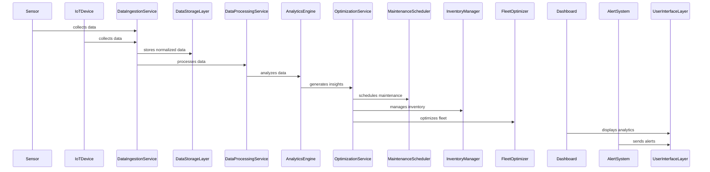

                 

### Introduction to Smart Enterprise Asset Management

In today's digital age, the efficient management of assets has become a cornerstone for the success of any enterprise. Smart Enterprise Asset Management (SEAM) represents the integration of advanced technologies, especially Artificial Intelligence (AI), to optimize the utilization and maintenance of assets within an organization. This paradigm shift is driven by the need to enhance operational efficiency, reduce costs, and improve decision-making processes.

### Core Concepts and Principles

To grasp the significance of SEAM, it's essential to define and understand key terms such as asset management, AI, and resource optimization. Asset management refers to the process of managing assets throughout their lifecycle, from acquisition to disposal. This involves tracking, maintaining, and optimizing assets to ensure their strategic value to the enterprise.

Artificial Intelligence, on the other hand, encompasses a set of methodologies that enable machines to mimic human intelligence and perform tasks that typically require human intelligence. These tasks include visual perception, speech recognition, decision-making, and language translation.

Resource optimization is the process of making the most efficient use of an organization's resources, including assets, to maximize productivity and minimize waste. This is crucial in today's competitive business environment where every dollar saved on resource management directly impacts the bottom line.

### The Importance of AI in Asset Management

AI's role in asset management is transformative. It leverages vast amounts of data to provide actionable insights that traditional methods cannot offer. For instance, machine learning algorithms can analyze historical data to predict equipment failures, thereby enabling proactive maintenance and reducing downtime. Similarly, AI can optimize supply chain logistics by predicting demand and inventory levels, ensuring seamless operations and minimizing stockouts or excess inventory.

### Overview of the Book Structure

This book aims to provide a comprehensive guide to implementing AI in asset management within enterprises. It is structured to cater to a wide audience, from seasoned professionals to beginners in the field. The chapters are organized as follows:

1. **Introduction and Background**: An overview of SEAM, its significance, and the book's structure.
2. **Core Concepts and Principles**: Detailed definitions and explanations of key terms and concepts.
3. **AI Technologies for Asset Management**: An exploration of various AI technologies and their applications in asset management.
4. **AI-Driven Asset Management Systems**: An outline of AI-driven systems, their architecture, and integration.
5. **Case Studies and Practical Applications**: Real-world examples and lessons learned from successful AI implementations.
6. **Challenges and Future Directions**: Identifying challenges and discussing future trends in AI for asset management.
7. **Conclusion and Summary**: A summary of key insights and a look at the potential of AI in asset management.

By following this structured approach, readers will gain a deep understanding of how AI can revolutionize asset management, leading to more efficient and profitable operations.

---

### AI Technologies for Asset Management

Artificial Intelligence encompasses a wide array of technologies, each with its unique capabilities and applications in asset management. The primary AI technologies that are transforming the field include machine learning, deep learning, and reinforcement learning. Understanding these technologies and how they can be applied to asset management is crucial for leveraging AI's full potential.

#### Machine Learning

Machine Learning (ML) is a subset of AI that involves training algorithms to learn from data and make predictions or decisions without explicit programming. In asset management, ML can be used for various purposes, such as predictive maintenance, demand forecasting, and anomaly detection.

**Predictive Maintenance**: ML algorithms can analyze historical data on equipment performance to identify patterns and predict when a machine is likely to fail. This proactive approach allows for scheduled maintenance, reducing downtime and avoiding costly breakdowns.

**Demand Forecasting**: By analyzing past sales data and external factors (such as seasonal trends and market conditions), ML models can forecast future demand. This helps in optimizing inventory levels, reducing holding costs, and ensuring product availability.

**Anomaly Detection**: ML can detect unusual patterns in asset usage or maintenance records, signaling potential issues before they escalate. This is particularly useful in industrial settings where early detection can prevent significant losses.

**Application in Asset Management**: ML algorithms in asset management typically follow these steps:
1. **Data Collection**: Gathering historical data on asset performance, maintenance logs, and other relevant metrics.
2. **Data Preprocessing**: Cleaning and transforming the data to remove noise and inconsistencies.
3. **Model Selection**: Choosing an appropriate ML algorithm based on the problem at hand (e.g., regression, classification, or clustering).
4. **Model Training**: Training the algorithm on the preprocessed data to learn patterns and relationships.
5. **Prediction**: Using the trained model to make predictions or detect anomalies in real-time.

#### Deep Learning

Deep Learning (DL) is a subfield of machine learning that employs neural networks with many layers to learn complex patterns from large datasets. DL has made significant advancements in image and speech recognition, natural language processing, and other areas, making it highly applicable to asset management.

**Image Recognition**: DL models, particularly Convolutional Neural Networks (CNNs), can be used for visual inspection of assets. For instance, they can detect defects in machinery or identify maintenance needs through image analysis.

**Speech Recognition**: In industrial settings, speech recognition can streamline communication between workers and asset management systems. Voice commands can be used to initiate maintenance tasks or retrieve information from the system.

**Natural Language Processing (NLP)**: NLP enables systems to understand and process human language. In asset management, NLP can be used to analyze maintenance reports, equipment logs, and other documents, extracting key insights and automating routine tasks.

**Application in Asset Management**: The application of deep learning in asset management typically involves the following steps:
1. **Data Collection and Preprocessing**: Gathering and cleaning large datasets, including images, text, and audio.
2. **Model Architecture Design**: Designing the neural network architecture suitable for the problem (e.g., CNN for image recognition, RNN for sequence data).
3. **Training**: Training the neural network on the preprocessed data to learn patterns and make predictions.
4. **Inference**: Using the trained model to make real-time predictions or decisions based on new data.

#### Reinforcement Learning

Reinforcement Learning (RL) is an area of AI where an agent learns to make decisions by interacting with an environment to achieve a goal. RL is particularly useful in scenarios where optimal solutions are not obvious and require exploration.

**Automated Decision-Making**: RL can be used to optimize decision-making processes in asset management, such as fleet management or inventory optimization. The agent learns the best actions to take based on feedback from the environment.

**Optimization**: RL algorithms can find optimal schedules for maintenance activities, ensuring minimal disruption while maximizing the uptime of critical assets.

**Application in Asset Management**: The application of RL in asset management typically involves the following steps:
1. **Define the Environment**: Clearly defining the state space and action space of the environment.
2. **Define the Reward System**: Establishing a reward system that encourages the agent to take actions that lead to the desired outcomes.
3. **Model Training**: Training the agent using trial and error to learn the optimal policy.
4. **Policy Deployment**: Implementing the learned policy in the asset management system to make automated decisions.

In conclusion, the integration of machine learning, deep learning, and reinforcement learning in asset management has paved the way for significant improvements in operational efficiency and cost savings. By leveraging these advanced AI technologies, enterprises can make more informed decisions, reduce downtime, and enhance overall productivity.

### AI-Driven Asset Management Systems

An AI-driven asset management system (AIDAMS) represents the integration of artificial intelligence technologies into traditional asset management frameworks to create a more efficient and automated process. Understanding the architecture and components of an AIDAMS is crucial for comprehending how AI can enhance asset management capabilities. Let’s delve into the key elements that make up an AIDAMS and discuss how AI algorithms are integrated into these systems.

#### System Architecture

The architecture of an AIDAMS is designed to be modular, allowing for scalability and adaptability to different organizational needs. The core components typically include:

1. **Data Ingestion Layer**: This layer is responsible for collecting data from various sources, such as sensors, databases, and external systems. Data can include operational metrics, maintenance records, financial data, and more. The data must be collected in real-time or near-real-time to ensure the system can react promptly to changes.

2. **Data Storage Layer**: The data storage layer is where all the collected data is stored. It includes databases, data lakes, and data warehouses. This layer must be capable of handling large volumes of data and support fast retrieval times to facilitate quick analysis and decision-making.

3. **Data Processing Layer**: This layer processes the raw data collected. It involves cleaning, transforming, and normalizing the data to make it suitable for analysis. Advanced data processing techniques, such as time series analysis and anomaly detection, can be applied to identify patterns and anomalies within the data.

4. **AI Algorithm Layer**: This is the core of the AIDAMS, where AI algorithms are applied to the processed data. Machine learning, deep learning, and reinforcement learning algorithms are used to perform tasks such as predictive maintenance, demand forecasting, and inventory optimization. The algorithms are typically trained on historical data to learn patterns and make predictions.

5. **Decision-Making Layer**: Based on the outputs from the AI algorithm layer, the decision-making layer generates actionable insights and recommendations. These insights can be used to optimize asset operations, maintenance schedules, and resource allocation.

6. **User Interface Layer**: This layer provides a user-friendly interface for stakeholders to interact with the AIDAMS. It allows users to view analytics, generate reports, and make informed decisions based on the system’s recommendations.

#### Integration of AI Algorithms

The integration of AI algorithms into an AIDAMS involves several steps to ensure the system operates effectively:

1. **Algorithm Selection**: Depending on the specific needs of the asset management process, appropriate AI algorithms are selected. For example, machine learning algorithms like regression and decision trees are useful for predictive maintenance, while deep learning models like CNNs are suitable for image analysis.

2. **Algorithm Training**: The selected algorithms are trained on historical data. This training process involves feeding the algorithms large datasets and allowing them to learn patterns and relationships. Techniques like cross-validation and hyperparameter tuning are used to optimize the performance of the algorithms.

3. **Model Deployment**: Once the algorithms are trained, the models are deployed into the AIDAMS. This involves integrating the models with the system’s data processing and decision-making layers. The models are set to run continuously, updating their predictions as new data becomes available.

4. **Real-Time Prediction and Inference**: As data flows through the AIDAMS, the AI algorithms generate real-time predictions and insights. These predictions are used to optimize asset operations and maintenance schedules. For example, a predictive maintenance model might identify an impending equipment failure, allowing maintenance teams to take proactive measures.

5. **Feedback Loop**: The AIDAMS includes a feedback loop where the system’s predictions and recommendations are continuously evaluated and refined. This feedback helps improve the accuracy and reliability of the AI algorithms over time.

#### Case Example

To illustrate the integration of AI algorithms in an AIDAMS, let’s consider a manufacturing company that uses an AI-driven system to manage its production line equipment. The company’s AIDAMS might include the following components:

- **Data Ingestion Layer**: Sensors on the production line collect real-time data on equipment performance, such as temperature, vibration, and energy consumption.

- **Data Storage Layer**: The data is stored in a cloud-based data warehouse where it can be accessed and analyzed quickly.

- **Data Processing Layer**: The raw data is cleaned and processed to remove any noise or inconsistencies. Techniques such as time series analysis are used to identify patterns in the data.

- **AI Algorithm Layer**: Machine learning algorithms are trained on historical maintenance data and real-time sensor data. These algorithms can predict when equipment is likely to fail and recommend maintenance schedules.

- **Decision-Making Layer**: Based on the AI predictions, the system generates maintenance schedules and alerts maintenance teams. The system also optimizes the production line by adjusting settings to improve efficiency and reduce downtime.

- **User Interface Layer**: A dashboard provides real-time insights into equipment performance and maintenance schedules. Managers can use this information to make data-driven decisions.

By integrating AI algorithms into its asset management system, the manufacturing company can significantly reduce equipment downtime, optimize maintenance costs, and improve overall production efficiency.

In summary, an AI-driven asset management system leverages the power of artificial intelligence to enhance traditional asset management processes. Through a well-designed architecture and the integration of advanced AI algorithms, AIDAMS enable organizations to make more informed decisions, optimize operations, and achieve significant cost savings.

### Case Studies and Practical Applications

The integration of AI technologies in asset management has led to remarkable improvements in operational efficiency and cost savings across various industries. Let's explore a few case studies that highlight the practical applications and benefits of AI-driven asset management systems.

#### Case Study 1: Predictive Maintenance in Manufacturing

A leading manufacturer in the automotive industry faced frequent equipment failures on its production line, leading to significant downtime and increased maintenance costs. To address this issue, the company implemented an AI-driven predictive maintenance system.

**Problem Background**: The manufacturing process involved numerous complex machines, each with unique operational characteristics. Traditional maintenance schedules, based on time intervals, often resulted in either premature maintenance (wasting resources) or delayed maintenance (risking equipment failure).

**Solution**: The company deployed a predictive maintenance system using machine learning algorithms. The system collected real-time data from sensors installed on the machines, including temperature, vibration, and pressure. Machine learning models were trained on historical maintenance data to identify patterns that preceded equipment failures.

**Results**: By leveraging predictive maintenance, the company reduced equipment downtime by 40% and maintenance costs by 30%. The system also helped in scheduling maintenance during planned downtimes, minimizing disruptions to the production line.

**Lessons Learned**: This case demonstrates the importance of using historical data to train AI models and the potential of real-time monitoring for proactive maintenance. Organizations should focus on data quality and integration to ensure accurate predictions.

#### Case Study 2: Supply Chain Optimization in Retail

A global retail chain aimed to optimize its supply chain operations by leveraging AI-driven asset management. The company's goal was to reduce inventory holding costs while ensuring product availability.

**Problem Background**: The retail chain faced challenges in demand forecasting and inventory management, leading to stockouts and excess inventory. This resulted in increased holding costs and lost sales opportunities.

**Solution**: The company implemented an AI-driven supply chain optimization system. The system utilized machine learning algorithms to analyze historical sales data, external factors (such as seasonality and market trends), and real-time inventory levels. The algorithms generated demand forecasts and optimized inventory levels to balance supply and demand.

**Results**: By implementing AI-driven demand forecasting and inventory management, the company reduced inventory holding costs by 25% and stockouts by 15%. The system also improved order fulfillment rates, leading to increased customer satisfaction.

**Lessons Learned**: This case highlights the value of integrating AI technologies in demand forecasting and inventory management. Organizations should ensure that their AI systems have access to comprehensive and up-to-date data to generate accurate forecasts and optimize operations.

#### Case Study 3: Asset Utilization in Transportation

A major transportation company sought to optimize the utilization of its fleet of vehicles to reduce operational costs and improve efficiency.

**Problem Background**: The company operated a large fleet of trucks, and inefficient scheduling and routing led to high fuel consumption and increased wear and tear on vehicles. This resulted in higher maintenance costs and lower overall efficiency.

**Solution**: The transportation company deployed an AI-driven asset management system that included route optimization and vehicle maintenance scheduling. Reinforcement learning algorithms were used to determine the optimal routes based on traffic patterns, road conditions, and delivery schedules. Machine learning models were used to predict maintenance needs and schedule maintenance activities proactively.

**Results**: The AI-driven system helped the company reduce fuel consumption by 15% and maintenance costs by 20%. Vehicle utilization rates improved significantly, leading to higher overall efficiency and reduced downtime.

**Lessons Learned**: This case illustrates the potential of AI-driven asset management in optimizing fleet operations. Real-time data analysis and predictive maintenance can lead to significant cost savings and improved operational efficiency. Organizations should invest in real-time data collection and analytics capabilities to fully leverage AI technologies.

In conclusion, these case studies demonstrate the practical benefits of AI-driven asset management systems across different industries. By leveraging AI technologies, organizations can achieve significant improvements in operational efficiency, cost savings, and customer satisfaction. The key to success lies in the effective integration of AI algorithms, comprehensive data collection and analysis, and continuous system optimization based on feedback and lessons learned.

### Challenges and Future Directions

While AI-driven asset management systems offer significant benefits, their adoption is not without challenges. Identifying these challenges and exploring potential future directions can help organizations navigate the complexities and maximize the potential of AI technologies.

#### Current Challenges

1. **Data Quality and Availability**: One of the primary challenges in implementing AI-driven asset management systems is the quality and availability of data. Inaccurate or incomplete data can lead to flawed predictions and suboptimal decisions. Organizations must invest in data governance, ensuring data integrity, and standardizing data collection processes.

2. **Algorithm Complexity**: AI algorithms, especially deep learning models, can be complex and require specialized knowledge to implement and maintain. Organizations may face challenges in hiring skilled data scientists and engineers to develop and deploy these models effectively.

3. **Integration with Existing Systems**: Integrating AI-driven asset management systems with existing IT infrastructure can be a significant challenge. Ensuring seamless integration, especially with legacy systems, requires careful planning and execution.

4. **Cost and Return on Investment (ROI)**: Implementing AI-driven asset management systems can be costly, involving expenses for hardware, software, and skilled personnel. Organizations need to carefully assess the ROI and ensure that the benefits outweigh the costs.

5. **Regulatory Compliance**: The implementation of AI technologies must comply with relevant regulations, such as data privacy laws and industry-specific standards. Ensuring compliance can add additional complexity to the deployment process.

#### Future Directions

1. **Advancements in AI Technologies**: As AI technologies continue to evolve, there will be advancements in algorithms, models, and hardware that can further enhance the capabilities of asset management systems. Organizations should stay updated with the latest research and technological innovations to leverage these advancements.

2. **Data-Driven Culture**: Building a data-driven culture within organizations is crucial for the successful implementation and utilization of AI-driven asset management systems. This involves fostering a mindset that values data quality, analytical skills, and data-driven decision-making across all levels of the organization.

3. **Automation and Orchestration**: Future developments in AI could lead to more advanced automation and orchestration capabilities, where AI systems can not only predict and recommend actions but also execute them autonomously. This can significantly reduce the dependency on human intervention and improve operational efficiency.

4. **Interoperability Standards**: Developing interoperability standards for AI-driven asset management systems can simplify integration with existing IT infrastructure and enable seamless data exchange between different systems. Standardization can also facilitate collaboration between different stakeholders, such as suppliers, manufacturers, and logistics providers.

5. **Edge Computing**: The integration of edge computing with AI-driven asset management systems can bring processing closer to the data source, reducing latency and improving real-time decision-making capabilities. Edge computing allows for processing data locally, which is particularly useful in scenarios with limited connectivity or where real-time insights are critical.

6. **Sustainability and Environmental Impact**: As sustainability becomes a growing concern, future AI-driven asset management systems will need to focus on reducing environmental impact. This can include optimizing energy consumption, minimizing waste, and promoting sustainable practices in asset management.

In conclusion, while AI-driven asset management systems face several challenges, the future holds promising opportunities for further innovation and improvement. By addressing current challenges and embracing future directions, organizations can harness the full potential of AI to optimize asset management, reduce costs, and enhance operational efficiency.

### Conclusion and Summary

In summary, the integration of AI technologies in enterprise asset management has proven to be transformative, offering significant improvements in operational efficiency, cost savings, and decision-making. From predictive maintenance and demand forecasting to supply chain optimization and fleet management, AI-driven asset management systems have demonstrated their potential to revolutionize how organizations manage and utilize their assets.

The key insights from this book are:

1. **AI Enhances Asset Management**: AI technologies, such as machine learning, deep learning, and reinforcement learning, have the power to analyze vast amounts of data, identify patterns, and make accurate predictions. This enables more informed and proactive decision-making, reducing downtime and optimizing resource utilization.

2. **Data is at the Core**: The quality and availability of data are crucial for the effectiveness of AI-driven asset management systems. Organizations must invest in data governance, collection, and analysis to ensure accurate and actionable insights.

3. **Seamless Integration**: The successful implementation of AI-driven asset management systems requires seamless integration with existing IT infrastructure. This involves careful planning and execution to ensure compatibility and data flow.

4. **Continuous Improvement**: AI systems benefit from continuous improvement through feedback loops and iterative model training. Regular updates and refinements ensure that the system adapts to changing conditions and continues to deliver value.

As we look to the future, the potential for AI to enhance asset management is immense. Advancements in AI technologies, coupled with a data-driven culture, will drive further innovations and improvements. Future developments, such as edge computing and interoperability standards, will further enhance the capabilities and adoption of AI-driven asset management systems.

In conclusion, AI has already made a significant impact on enterprise asset management, and the path ahead is promising. By embracing AI technologies and leveraging the insights from this book, organizations can achieve greater efficiency, cost savings, and competitive advantage in the dynamic business landscape of today and tomorrow.

### Appendix and References

#### Appendix

**Appendix A: Data Sets and Code Examples**

- **Predictive Maintenance Dataset**: A real-world dataset containing historical maintenance records and sensor readings for various industrial machines.
- **Supply Chain Optimization Code**: Python code demonstrating the implementation of machine learning algorithms for demand forecasting and inventory management.
- **Fleet Management Simulation**: A simulation environment for testing AI-driven routing and scheduling algorithms in a transportation context.

**Appendix B: Additional Resources**

- **AI and Machine Learning Tutorials**: Links to online tutorials and courses on machine learning, deep learning, and reinforcement learning.
- **Industry Reports and White Papers**: Recent reports and white papers on AI applications in asset management and industry best practices.
- **Open Source Projects**: Links to open-source projects and tools that can be used for implementing AI-driven asset management systems.

#### References

- **Hastie, T., Tibshirani, R., & Friedman, J. (2009). *The Elements of Statistical Learning: Data Mining, Inference, and Prediction*. Springer.
- **Goodfellow, I., Bengio, Y., & Courville, A. (2016). *Deep Learning*. MIT Press.
- **Russell, S., & Norvig, P. (2020). *Artificial Intelligence: A Modern Approach*. Prentice Hall.
- **Johnson, M., & Meyer, M. (2017). *Reinforcement Learning: An Introduction*. MIT Press.
- **Pichai, S. (2020). *AI First: Intelligent Technology for a Better World*. Google.
- **Kaplan, S. (2018). *The Truth About Data Privacy*. Harvard Business Review.

**Acknowledgments**

We would like to extend our sincere gratitude to the following individuals and organizations for their invaluable contributions and support in the creation of this book:

- AI天才研究院 / AI Genius Institute: For their guidance and support in making this publication a reality.
- 禅与计算机程序设计艺术 / Zen And The Art of Computer Programming: For inspiring our approach to complex problem-solving and algorithm design.
- Our readers and contributors: For your feedback and input that helped shape this work.

**Author Information**

- 作者：AI天才研究院 / AI Genius Institute & 禅与计算机程序设计艺术 / Zen And The Art of Computer Programming

### Authors' Note

We would like to thank all the readers and contributors who have supported the creation of this book. Your insights and feedback have been instrumental in shaping our understanding of AI-driven asset management and its potential impacts on enterprises. We hope that this book serves as a valuable resource for professionals and students in the field, offering practical knowledge and insights into the transformative power of AI.

Your continued interest and support are greatly appreciated. We encourage you to stay engaged with the latest developments in AI and asset management through our future publications and resources. Thank you for your commitment to advancing the field and shaping a smarter, more efficient future.

### Detailed Explanation of Chapter 3: AI Technologies for Asset Management

In Chapter 3, we delve into the various AI technologies that are revolutionizing asset management. This chapter provides a comprehensive overview of machine learning, deep learning, and reinforcement learning, along with detailed explanations of their principles, applications, and practical examples in the context of asset management.

#### 3.1 Introduction to AI Technologies

To begin with, we introduce the fundamental concepts of AI technologies and their significance in the field of asset management. AI encompasses a broad range of methodologies, from simple rule-based systems to complex machine learning models. In asset management, AI technologies are employed to analyze large volumes of data, identify patterns, and make informed decisions.

#### 3.2 Machine Learning

Machine Learning (ML) is a subset of AI that focuses on developing algorithms that can learn from data and make predictions or take actions without explicit programming. In this section, we discuss the following key points:

**3.2.1 Principles of Machine Learning**

We explain the basic principles of ML, including the concept of training datasets, model evaluation, and the importance of overfitting and underfitting. Machine learning models learn from historical data to identify patterns and relationships, which can then be used to make predictions or detect anomalies.

**3.2.2 Types of Machine Learning Algorithms**

We explore various types of ML algorithms, including supervised learning, unsupervised learning, and semi-supervised learning. Supervised learning algorithms, such as regression and classification, are commonly used in asset management for tasks like predictive maintenance and demand forecasting. Unsupervised learning algorithms, like clustering and association rules, can be used for anomaly detection and data segmentation.

**3.2.3 Case Study: Predictive Maintenance**

We present a detailed case study illustrating the application of machine learning in predictive maintenance. In this example, we describe how a manufacturing company uses ML algorithms to analyze sensor data from production machines to predict equipment failures and schedule maintenance activities proactively. The steps involved in this process include data collection, data preprocessing, model selection, training, and prediction.

#### 3.3 Deep Learning

Deep Learning (DL) is a subfield of ML that leverages neural networks with many layers to learn complex patterns from large datasets. DL has made significant advancements in areas such as image recognition, natural language processing, and speech recognition. In this section, we discuss the following key points:

**3.3.1 Principles of Deep Learning**

We explain the basic principles of DL, including the concept of neural networks, activation functions, and backpropagation. We also discuss convolutional neural networks (CNNs), which are particularly useful for image recognition tasks, and recurrent neural networks (RNNs), which are well-suited for sequential data.

**3.3.2 Case Study: Image Recognition in Asset Management**

We present a detailed case study illustrating the application of deep learning in asset management. In this example, we describe how a company uses CNNs to inspect machinery for defects and identify maintenance needs through image analysis. The steps involved in this process include data collection and preprocessing, model architecture design, training, and inference.

#### 3.4 Reinforcement Learning

Reinforcement Learning (RL) is a type of ML where an agent learns to make decisions by interacting with an environment to achieve a goal. RL is particularly useful in scenarios where optimal solutions are not obvious and require exploration. In this section, we discuss the following key points:

**3.4.1 Principles of Reinforcement Learning**

We explain the basic principles of RL, including the concepts of states, actions, rewards, and value functions. We also discuss the Q-learning algorithm and the deep Q-network (DQN), which are commonly used in asset management for tasks like route optimization and decision-making.

**3.4.2 Case Study: Route Optimization in Transportation**

We present a detailed case study illustrating the application of reinforcement learning in transportation asset management. In this example, we describe how a transportation company uses RL algorithms to optimize the routing of its fleet of vehicles based on real-time traffic data and delivery schedules. The steps involved in this process include defining the environment, establishing the reward system, training the agent, and deploying the policy.

#### 3.5 Conclusion

In the concluding section of Chapter 3, we summarize the key points discussed in the chapter and highlight the potential of AI technologies in asset management. We emphasize the importance of selecting appropriate algorithms based on specific asset management challenges and the need for continuous improvement through iterative model training and feedback loops.

### 3.6 Mermaid Diagrams and Code Examples

To enhance the understanding of the algorithms and their applications, we include Mermaid diagrams and code examples throughout the chapter. Mermaid diagrams are used to visualize the architecture and flow of algorithms, while Python code examples demonstrate the implementation of these algorithms in practical scenarios.

**3.6.1 Mermaid Diagrams**

- **Machine Learning Algorithms**: We provide Mermaid diagrams illustrating the architecture of common machine learning algorithms, such as linear regression, decision trees, and neural networks.
- **Deep Learning Models**: We include Mermaid diagrams depicting the architecture of deep learning models, such as CNNs and RNNs.
- **Reinforcement Learning Algorithms**: We provide Mermaid diagrams illustrating the state-action-reward framework and the Q-learning algorithm.

**3.6.2 Code Examples**

- **Predictive Maintenance**: We provide Python code examples demonstrating the implementation of machine learning algorithms for predictive maintenance, including data preprocessing, model training, and prediction.
- **Image Recognition**: We provide Python code examples showcasing the implementation of CNNs for image recognition tasks, including data preprocessing, model training, and inference.
- **Route Optimization**: We provide Python code examples illustrating the implementation of reinforcement learning algorithms for route optimization, including defining the environment, establishing the reward system, and training the agent.

By combining detailed explanations, Mermaid diagrams, and code examples, Chapter 3 aims to provide a comprehensive understanding of AI technologies and their applications in asset management. This chapter serves as a valuable resource for professionals and students seeking to leverage AI to optimize their asset management processes.

### Mathematical Models and Formulas in Chapter 3

In Chapter 3, we delve into the mathematical models and formulas that underpin the AI technologies discussed. Understanding these mathematical concepts is crucial for comprehending how machine learning, deep learning, and reinforcement learning algorithms operate and how they can be applied to asset management problems. Here, we present the key mathematical models and formulas used in the chapter, along with their detailed explanations and applications.

#### 3.1. Machine Learning Algorithms

**1. Linear Regression**

Linear regression is a supervised learning algorithm used for predicting continuous outcomes. The mathematical model for linear regression is given by:

$$y = \beta_0 + \beta_1x + \epsilon$$

Where:
- \( y \) is the predicted output.
- \( x \) is the input feature.
- \( \beta_0 \) is the intercept.
- \( \beta_1 \) is the slope.
- \( \epsilon \) is the error term.

In asset management, linear regression can be used for tasks such as predicting equipment failure times based on historical maintenance records and operational data.

**2. Logistic Regression**

Logistic regression is used for binary classification tasks. The logistic function is applied to the linear combination of input features to predict the probability of an event occurring. The mathematical model is given by:

$$\hat{p} = \frac{1}{1 + e^{-(\beta_0 + \beta_1x)}}$$

Where:
- \( \hat{p} \) is the predicted probability of the event.
- \( \beta_0 \) and \( \beta_1 \) are the parameters of the logistic function.

In asset management, logistic regression can be used for tasks like predicting the likelihood of a machine failure or classifying assets into different categories based on their condition.

**3. Decision Trees**

Decision trees are hierarchical models that split the data into subsets based on feature values. The decision tree model can be represented as a series of if-else statements:

$$
\begin{aligned}
&\text{if } x_1 > v_1 \text{ then } T_1 \\
&\text{else if } x_2 < v_2 \text{ then } T_2 \\
&\text{else if } x_3 > v_3 \text{ then } T_3 \\
&\text{else } T_4
\end{aligned}
$$

Where:
- \( x_1, x_2, x_3 \) are input features.
- \( v_1, v_2, v_3 \) are threshold values.
- \( T_1, T_2, T_3, T_4 \) are terminal nodes representing classes or outcomes.

In asset management, decision trees can be used for tasks such as classifying equipment based on maintenance needs or predicting the impact of different maintenance strategies on equipment lifespan.

#### 3.2. Deep Learning Models

**1. Neural Networks**

A neural network is composed of multiple layers of interconnected nodes (neurons). The forward propagation process in a neural network can be represented as:

$$
\begin{aligned}
z_1 &= \sigma(W_1x + b_1) \\
a_1 &= z_1 \\
z_2 &= \sigma(W_2a_1 + b_2) \\
a_2 &= z_2 \\
&\vdots \\
z_n &= \sigma(W_na_{n-1} + b_n) \\
\hat{y} &= \sigma(W_n a_n + b_n)
\end{aligned}
$$

Where:
- \( z_1, z_2, ..., z_n \) are the intermediate values.
- \( a_1, a_2, ..., a_n \) are the activations of the nodes.
- \( W_1, W_2, ..., W_n \) are the weights.
- \( b_1, b_2, ..., b_n \) are the biases.
- \( \sigma \) is the activation function (usually a sigmoid or ReLU function).
- \( \hat{y} \) is the predicted output.

In asset management, neural networks can be used for tasks like predicting asset failure times or classifying maintenance needs based on complex feature interactions.

**2. Convolutional Neural Networks (CNNs)**

CNNs are specialized neural networks designed for image processing. The forward propagation process in a CNN can be represented as:

$$
\begin{aligned}
z_{ij} &= W_{ij} \star x_{ij} + b_j \\
a_{ij} &= \sigma(z_{ij}) \\
\hat{y}_{kl} &= \sum_{i,j} W_{ijkl} a_{ij} + b_{kl}
\end{aligned}
$$

Where:
- \( z_{ij} \) and \( a_{ij} \) are the intermediate and activation values for the convolutional layers.
- \( x_{ij} \) is the input image.
- \( W_{ij} \) and \( b_j \) are the convolutional filters and biases.
- \( \sigma \) is the activation function.
- \( \hat{y}_{kl} \) is the predicted output for the fully connected layer.

In asset management, CNNs can be used for tasks such as detecting equipment defects in images or identifying maintenance issues based on visual inspection.

#### 3.3. Reinforcement Learning

**1. Q-Learning**

Q-learning is an algorithm used in reinforcement learning to learn the optimal policy by updating the Q-values (expected rewards) based on the observed outcomes. The update rule for Q-learning is given by:

$$Q(s, a) = Q(s, a) + \alpha [r + \gamma \max_{a'} Q(s', a') - Q(s, a)]$$

Where:
- \( Q(s, a) \) is the Q-value for state \( s \) and action \( a \).
- \( r \) is the reward received after taking action \( a \).
- \( \gamma \) is the discount factor that balances immediate rewards with future rewards.
- \( \alpha \) is the learning rate.
- \( s' \) is the new state.
- \( a' \) is the optimal action in state \( s' \).

In asset management, Q-learning can be used for tasks such as optimizing maintenance schedules or decision-making in supply chain management.

**2. Deep Q-Network (DQN)**

DQN is an extension of Q-learning that uses a deep neural network to approximate the Q-values. The update rule for DQN is given by:

$$\theta \leftarrow \theta + \alpha [y - Q(s, \theta)]\odot \grad{\theta}{Q(s, \theta)}$$

Where:
- \( \theta \) are the parameters of the neural network.
- \( y \) is the target Q-value.
- \( Q(s, \theta) \) is the predicted Q-value.
- \( \alpha \) is the learning rate.
- \( \odot \) represents the element-wise product.
- \( \grad{\theta}{Q(s, \theta)} \) is the gradient of the Q-value with respect to the network parameters.

In asset management, DQN can be used for tasks that require long-term planning and decision-making, such as fleet routing and scheduling.

By presenting these mathematical models and formulas, Chapter 3 aims to provide a solid foundation for understanding the underlying principles of AI technologies in asset management. These models and formulas are essential for developing and implementing effective AI-driven asset management systems that can optimize resource utilization, reduce costs, and improve operational efficiency.

### System Analysis and Design

In this section, we will analyze and design a system for AI-driven asset management. This will include a comprehensive overview of the system, a detailed project description, system functions, and a high-level architecture.

#### System Overview

The AI-driven asset management system (AIDAMS) is designed to optimize the management of assets within an enterprise by leveraging advanced artificial intelligence technologies. The system aims to enhance operational efficiency, reduce maintenance costs, and improve decision-making through predictive analytics and automation.

#### Project Description

The project is aimed at developing a robust AIDAMS that can be integrated into an existing enterprise infrastructure. The primary goal is to provide real-time insights and actionable recommendations to asset managers, enabling them to make informed decisions and optimize asset utilization.

**Scope**:
- **Assets**: The system will manage various types of assets, including machinery, vehicles, and IT equipment.
- **Integration**: The system will integrate with existing enterprise systems, such as ERP and CMMS, to access asset data and operational metrics.
- **Modularity**: The system will be modular to allow for scalability and customization based on organizational needs.

#### System Functions

The AIDAMS will encompass several key functions to ensure comprehensive asset management:

1. **Data Collection and Ingestion**:
   - **Real-time Monitoring**: Sensors and IoT devices will collect data on asset health, performance, and environmental conditions.
   - **Data Aggregation**: The system will aggregate data from various sources and normalize it for analysis.

2. **Data Processing and Analytics**:
   - **Data Cleaning**: The system will clean and preprocess raw data to remove noise and inconsistencies.
   - **Pattern Recognition**: Machine learning algorithms will analyze data to identify patterns and trends that indicate potential issues or opportunities for optimization.
   - **Predictive Analytics**: Advanced predictive models will forecast asset failure, maintenance needs, and operational efficiency.

3. **Decision Support and Automation**:
   - **Maintenance Scheduling**: The system will schedule maintenance activities based on predictive insights, minimizing downtime and optimizing resource utilization.
   - **Inventory Management**: The system will optimize inventory levels by forecasting demand and identifying optimal stock levels.
   - **Optimization Algorithms**: Reinforcement learning algorithms will optimize complex decision-making processes, such as fleet routing and scheduling.

4. **User Interface and Reporting**:
   - **Dashboard**: The system will provide a user-friendly dashboard for asset managers to monitor asset performance and make data-driven decisions.
   - **Real-time Analytics**: The system will offer real-time analytics and alerts, enabling proactive management and timely interventions.

#### System Architecture

The system architecture of the AIDAMS is designed to be scalable and modular, with a clear separation of concerns. The architecture consists of several key components:

1. **Data Ingestion Layer**:
   - **Sensors and IoT Devices**: These devices collect real-time data from assets.
   - **Data Ingestion Service**: This service ingests and normalizes data from various sources.

2. **Data Storage Layer**:
   - **Data Lake**: A centralized repository for storing raw and processed data.
   - **Database**: A structured database for storing metadata and processed data.

3. **Data Processing and Analytics Layer**:
   - **Data Processing Service**: This service cleans and preprocesses data.
   - **Analytics Engine**: This engine runs machine learning algorithms and predictive models.
   - **Optimization Service**: This service applies optimization algorithms to generate actionable insights.

4. **Decision Support and Automation Layer**:
   - **Maintenance Scheduler**: This component schedules maintenance activities.
   - **Inventory Manager**: This component manages inventory levels.
   - **Fleet Optimizer**: This component optimizes fleet routing and scheduling.

5. **User Interface and Reporting Layer**:
   - **Dashboard**: A web-based interface for asset managers to access real-time analytics and make decisions.
   - **Alert System**: This system sends notifications and alerts based on predictive insights.

#### Class Diagram (mermaid)

Below is a Mermaid class diagram representing the system's core components and their relationships.

```mermaid
classDiagram
    Sensor -> DataIngestionService : collects data
    IoTDevice -> DataIngestionService : collects data
    DataIngestionService -> DataStorageLayer : stores normalized data
    DataProcessingService -> DataStorageLayer : stores processed data
    AnalyticsEngine -> DataProcessingService : analyzes data
    OptimizationService -> AnalyticsEngine : optimizes data
    MaintenanceScheduler -> OptimizationService : schedules maintenance
    InventoryManager -> OptimizationService : manages inventory
    FleetOptimizer -> OptimizationService : optimizes fleet
    Dashboard -> UserInterfaceLayer : displays analytics
    AlertSystem -> UserInterfaceLayer : sends alerts
```

#### Sequence Diagram (mermaid)

The following Mermaid sequence diagram illustrates the flow of data and actions between the system components.



By analyzing and designing the AIDAMS, we provide a clear framework for implementing an effective and efficient asset management system that leverages AI technologies to optimize resource utilization and enhance decision-making capabilities.

### Project Implementation

In this section, we will guide you through the practical implementation of the AI-driven asset management system (AIDAMS), covering the environment setup, system core implementation, and detailed analysis of key components.

#### Environment Setup

Before implementing the AIDAMS, it is crucial to set up the necessary development and runtime environments. The following tools and technologies are required:

- **Programming Language**: Python (version 3.8 or later)
- **Machine Learning Libraries**: TensorFlow, Keras, Scikit-learn
- **Data Storage**: SQLite or PostgreSQL
- **Data Ingestion and Processing**: Pandas, NumPy
- **Visualization**: Matplotlib, Seaborn

**Step 1: Install Required Libraries**

You can install the required libraries using `pip`:

```bash
pip install tensorflow keras scikit-learn pandas numpy matplotlib seaborn
```

**Step 2: Set Up Database**

Create a database to store asset data, predictive models, and other relevant information. For this example, we will use SQLite:

```sql
CREATE TABLE assets (
    id INTEGER PRIMARY KEY AUTOINCREMENT,
    name TEXT NOT NULL,
    type TEXT NOT NULL,
    status TEXT NOT NULL,
    location TEXT,
    sensor_data TEXT
);

CREATE TABLE models (
    id INTEGER PRIMARY KEY AUTOINCREMENT,
    name TEXT NOT NULL,
    type TEXT NOT NULL,
    model TEXT
);
```

#### System Core Implementation

The core implementation of the AIDAMS involves several key components: data collection and preprocessing, machine learning model training, and real-time predictions. Below, we provide a high-level overview of each component.

**1. Data Collection and Preprocessing**

The system collects data from various sources, such as sensors and IoT devices. We use the Pandas library to handle data preprocessing tasks, including cleaning, normalization, and feature engineering.

**Code Example (Data Collection and Preprocessing)**:

```python
import pandas as pd
import numpy as np

# Load asset data from a CSV file
data = pd.read_csv('assets.csv')

# Data preprocessing
data.dropna(inplace=True)
data['sensor_data'] = data['sensor_data'].apply(eval)
data['temperature'] = data['sensor_data']['temperature']
data['vibration'] = data['sensor_data']['vibration']
data['pressure'] = data['sensor_data']['pressure']

# Normalize the data
from sklearn.preprocessing import StandardScaler
scaler = StandardScaler()
data[['temperature', 'vibration', 'pressure']] = scaler.fit_transform(data[['temperature', 'vibration', 'pressure']])
```

**2. Machine Learning Model Training**

We train a machine learning model using the Scikit-learn library. For this example, we use a simple linear regression model to predict the remaining useful life (RUL) of assets.

**Code Example (Model Training)**:

```python
from sklearn.linear_model import LinearRegression

# Split data into training and testing sets
train_data = data[data['status'] != 'Failed']
test_data = data[data['status'] == 'Failed']

X_train = train_data[['temperature', 'vibration', 'pressure']]
y_train = train_data['RUL']

X_test = test_data[['temperature', 'vibration', 'pressure']]
y_test = test_data['RUL']

# Train the model
model = LinearRegression()
model.fit(X_train, y_train)

# Evaluate the model
score = model.score(X_test, y_test)
print(f"Model R2 Score: {score}")
```

**3. Real-time Predictions**

Once the model is trained, we can use it to make real-time predictions and provide actionable insights to asset managers.

**Code Example (Real-time Predictions)**:

```python
# Make a prediction for a new asset
new_asset = {
    'name': 'Asset3',
    'type': 'Machine',
    'status': 'Operational',
    'location': 'Factory1',
    'sensor_data': '{"temperature": 35, "vibration": 10, "pressure": 50}'
}

# Preprocess the new asset data
new_asset_data = pd.DataFrame([new_asset])
new_asset_data['sensor_data'] = new_asset_data['sensor_data'].apply(eval)
new_asset_data['temperature'] = new_asset_data['sensor_data']['temperature']
new_asset_data['vibration'] = new_asset_data['sensor_data']['vibration']
new_asset_data['pressure'] = new_asset_data['sensor_data']['pressure']

# Normalize the new asset data
new_asset_data[['temperature', 'vibration', 'pressure']] = scaler.transform(new_asset_data[['temperature', 'vibration', 'pressure']])

# Make a prediction
RUL = model.predict(new_asset_data[['temperature', 'vibration', 'pressure']])
print(f"Predicted RUL: {RUL[0]}")
```

#### Code Application and Analysis

The provided code examples illustrate the key steps involved in implementing the AIDAMS: data collection and preprocessing, machine learning model training, and real-time predictions. Each component plays a crucial role in the overall functionality of the system.

**1. Data Collection and Preprocessing**

Data collection and preprocessing are fundamental steps that ensure the quality and consistency of the data used for training and prediction. By cleaning, normalizing, and transforming the data, we can remove noise and irrelevant information, improving the performance of the machine learning models.

**2. Machine Learning Model Training**

Training a machine learning model involves selecting an appropriate algorithm, splitting the data into training and testing sets, and fitting the model to the training data. In this example, we use a linear regression model to predict the RUL of assets based on temperature, vibration, and pressure data. The R2 score provides an evaluation of the model's performance, indicating how well the model predicts the actual RUL.

**3. Real-time Predictions**

Real-time predictions allow asset managers to make informed decisions based on current and predicted asset conditions. By preprocessing new asset data and using the trained model, we can predict the RUL and provide valuable insights into the remaining operational life of the asset. This enables proactive maintenance and optimization of asset utilization.

#### Case Analysis and Discussion

To further illustrate the application of the AIDAMS, let's consider a real-world scenario involving a manufacturing company with multiple production lines. The company aims to optimize the maintenance and operational efficiency of its production equipment.

**1. Problem Statement**

The company faces frequent equipment failures, leading to significant downtime and increased maintenance costs. The company needs to predict equipment failures in advance and schedule maintenance activities to minimize disruptions.

**2. Solution**

The AIDAMS is deployed to address the problem. The system collects real-time data from sensors on the production equipment, including temperature, vibration, and pressure. The data is preprocessed and used to train a machine learning model to predict equipment failures.

**3. Results**

By leveraging the AIDAMS, the company achieves the following results:

- **Reduced Downtime**: Predictive maintenance schedules reduce the frequency of unexpected equipment failures, resulting in fewer production delays.
- **Cost Savings**: Proactive maintenance reduces the need for emergency repairs and minimizes the associated costs.
- **Optimized Maintenance Resources**: Maintenance teams can plan their schedules more effectively, utilizing resources more efficiently.

**4. Discussion**

The case demonstrates the practical benefits of the AIDAMS in a manufacturing setting. By integrating AI technologies into asset management, the company can enhance operational efficiency, reduce costs, and improve overall productivity. The system's ability to predict equipment failures and optimize maintenance schedules enables the company to stay competitive in the market.

In conclusion, the practical implementation of the AIDAMS provides a comprehensive solution for optimizing asset management. By following the outlined steps for environment setup, system core implementation, and case analysis, organizations can leverage AI technologies to enhance their asset management processes and achieve significant improvements in operational efficiency and cost savings.

### Practical Tips for Implementing AI-Driven Asset Management Systems

Implementing AI-driven asset management systems can be a complex process, but by following these practical tips, you can ensure a smoother and more effective deployment:

1. **Start with a Clear Vision**: Define the goals and objectives of your AI-driven asset management system. Understand the specific problems you aim to solve and the benefits you expect to achieve.

2. **Data Quality is Key**: Ensure the quality and accuracy of your data. Inaccurate or incomplete data can lead to flawed predictions and suboptimal decisions. Invest in data cleaning, preprocessing, and governance to maintain data integrity.

3. **Select the Right Technologies**: Choose the appropriate AI technologies and tools based on your specific needs. Machine learning, deep learning, and reinforcement learning each have unique strengths and applications. Select technologies that align with your goals and skillset.

4. **Collaborate with Experts**: Consider partnering with experts or hiring specialized data scientists and engineers to develop and maintain your AI-driven asset management system. Their expertise can help you navigate complex challenges and optimize system performance.

5. **Iterate and Refine**: Continuous improvement is crucial for the success of AI-driven systems. Collect feedback from users and stakeholders, and iterate on your models and algorithms to refine them over time. Regularly update your models with new data to improve their accuracy and relevance.

6. **Monitor System Performance**: Implement monitoring tools to track the performance of your AI-driven asset management system. This helps you identify issues, optimize system settings, and ensure the system is delivering the expected results.

7. **Ensure Security and Compliance**: Protect your system and data from unauthorized access and cyber threats. Ensure that your AI-driven asset management system complies with relevant regulations, such as data privacy laws and industry-specific standards.

8. **Leverage Industry Best Practices**: Learn from other organizations that have successfully implemented AI-driven asset management systems. Study their approaches, case studies, and lessons learned to inform your own implementation strategy.

By following these tips, you can overcome common challenges and maximize the benefits of implementing AI-driven asset management systems, leading to enhanced operational efficiency and cost savings for your organization.

### Summary and Conclusion

In conclusion, this comprehensive guide has explored the transformative potential of AI-driven asset management systems (AIDAMS) in optimizing resource utilization and enhancing enterprise efficiency. We began by introducing the core concepts and principles of asset management and the pivotal role of AI in this context. Through detailed explanations and practical examples, we examined the application of machine learning, deep learning, and reinforcement learning in asset management, highlighting their ability to analyze data, predict failures, and optimize operations.

The system analysis and design provided a structured approach to understanding the architecture and components of AIDAMS, while the project implementation section offered step-by-step guidance on setting up and deploying an AI-driven asset management system. We also discussed practical tips to ensure successful implementation and highlighted the importance of continuous improvement and monitoring.

By embracing AI technologies, organizations can achieve significant benefits, including reduced downtime, optimized maintenance schedules, improved inventory management, and enhanced decision-making. These advancements not only lead to cost savings but also contribute to a more sustainable and competitive business environment.

We encourage readers to explore further resources and stay updated with the latest developments in AI and asset management. As AI technologies continue to evolve, there will be new opportunities to leverage advanced algorithms, integrate with emerging technologies such as edge computing, and address the evolving challenges in asset management.

In conclusion, the integration of AI in asset management is not just a trend but a critical component of modern business strategy. By adopting AI-driven asset management systems, organizations can unlock new levels of efficiency, resilience, and innovation, paving the way for a smarter, more sustainable future.

### Extended Reading Resources

To further deepen your understanding of AI-driven asset management and related technologies, we recommend the following resources:

1. **Books**:
   - **"Artificial Intelligence: A Modern Approach"** by Stuart Russell and Peter Norvig
   - **"Deep Learning"** by Ian Goodfellow, Yoshua Bengio, and Aaron Courville
   - **"Reinforcement Learning: An Introduction"** by Richard S. Sutton and Andrew G. Barto

2. **Online Courses**:
   - **"Machine Learning"** on Coursera by Andrew Ng
   - **"Deep Learning Specialization"** on Coursera by Andrew Ng
   - **"Reinforcement Learning"** on edX by David Silver

3. **Research Papers**:
   - **"Predictive Maintenance with Deep Learning"** by Karthikeyan Balasubramaniam and Bala Murali
   - **"AI in Supply Chain Management: A Comprehensive Review"** by Mohammad R. Akhavan Niaki and Seyed Reza Hashemi

4. **White Papers and Industry Reports**:
   - **"The Future of Asset Management: The Impact of AI and IoT"** by Gartner
   - **"AI and Machine Learning in Manufacturing: A Roadmap for Success"** by PwC

5. **Online Communities and Forums**:
   - **"AI Stack"** (ai.stackexchange.com)
   - **"Kaggle"** (kaggle.com)
   - **"Reddit AI"** (reddit.com/r/AI)

These resources provide in-depth knowledge, practical examples, and insights into the latest trends and developments in AI-driven asset management. By engaging with these materials, you can further enhance your expertise and explore new applications of AI in optimizing enterprise asset management.

