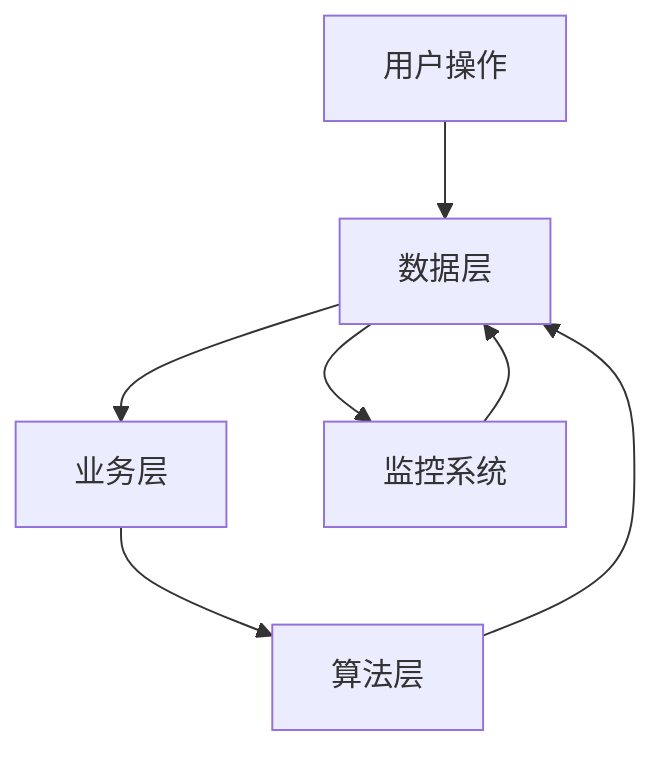

                 

### 摘要

智能企业资源调度是现代企业高效运营的关键一环，它利用先进的人工智能技术，对企业的各种资源进行优化配置，从而实现成本降低、效率提升和用户体验优化。本文旨在系统地探讨智能企业资源调度的背景与意义、核心概念、算法原理、系统架构设计以及关键技术的实现与应用。通过对当前企业资源调度问题的深入分析，结合实际案例，本文将展示如何利用AI技术优化资源分配，为企业的持续发展提供有力支撑。文章将采用逻辑清晰、结构紧凑、简单易懂的专业语言，帮助读者全面了解智能企业资源调度的全貌及其应用价值。

## 智能企业资源调度概述

### 问题背景

在当今竞争激烈的市场环境中，企业面临着资源有限的挑战。这包括人力资源、物资资源、资金资源和时间资源等。如何高效地管理和分配这些资源，以最大化企业收益和最小化成本，成为企业持续发展的关键问题。传统的资源调度方式往往依赖于人工经验和规则，难以应对复杂多变的业务需求，从而导致资源浪费、效率低下。

### 问题描述

资源调度问题可以概括为在特定约束条件下，如何优化资源的分配，以满足企业的生产、运营和业务需求。具体而言，资源调度需要解决以下几个关键问题：

1. **资源识别与分类**：识别企业内部各种资源，并进行分类，以便进行有效管理。
2. **需求预测**：准确预测企业未来一段时间内的资源需求，为资源分配提供依据。
3. **资源优化分配**：在满足约束条件的前提下，将资源合理分配到各个业务环节，最大化利用资源。
4. **动态调整**：在资源需求和资源供给发生变化时，及时调整资源分配策略，以保持系统的稳定性和高效性。

### 问题解决

面对上述资源调度问题，传统的解决方案存在明显的局限性。而智能企业资源调度则利用人工智能技术，通过以下方法实现优化：

1. **数据驱动的需求预测**：利用大数据分析和机器学习算法，对历史数据进行挖掘，预测未来资源需求。
2. **智能优化算法**：运用启发式算法、线性规划和遗传算法等，对资源分配进行全局优化。
3. **实时监控与动态调整**：通过实时监控系统，动态跟踪资源使用情况，并基于实时数据调整资源分配策略。
4. **人机协作**：结合人工判断和智能算法，实现资源调度的最佳效果。

### 边界与外延

智能企业资源调度的边界主要涉及企业的内部资源，如人力资源、物资资源和资金资源等。然而，随着技术的发展，资源调度的外延也在不断扩大，包括：

1. **外部资源**：如云计算资源、外包服务资源等。
2. **供应链管理**：对上游供应商和下游客户的资源进行优化调度。
3. **生产计划调度**：对生产流程中的各个工序进行优化调度，提高生产效率。
4. **需求响应调度**：快速响应市场需求变化，动态调整资源分配策略。

### 核心概念与联系

智能企业资源调度涉及多个核心概念，它们相互联系，共同作用，实现资源的优化配置。以下是几个关键概念及其相互联系：

1. **资源分配原理**：资源分配的基础理论，包括资源的识别、分类和优化分配原则。
2. **人工智能技术基础**：包括数据挖掘、机器学习、深度学习等技术，用于需求预测和资源优化。
3. **算法原理**：各种优化算法的基本原理，如线性规划、遗传算法、启发式算法等，用于实现资源优化分配。

通过对这些核心概念的理解和运用，企业可以构建智能资源调度系统，实现资源的最大化利用和业务的高效运营。

### 第1章: 智能企业资源调度的背景与意义

#### 问题背景

在现代企业运营中，资源管理是一个至关重要的环节。企业面临的资源包括人力资源、物资资源、资金资源和时间资源等。然而，随着市场竞争的加剧和业务复杂性不断增加，企业如何高效地管理和分配这些资源，以最大化收益和最小化成本，成为一项巨大的挑战。传统的资源管理方式往往依赖于人工经验和规则，缺乏系统性和灵活性，难以应对动态变化的业务需求，从而导致资源浪费、效率低下。

首先，人力资源是企业最宝贵的资源之一。传统的招聘、培训和绩效管理等方法往往存在主观性强、效率低的问题，难以充分发挥员工的潜力。其次，物资资源和资金资源的利用率也常常受到传统管理模式的影响，难以实现最优分配。例如，库存管理不当会导致物资积压或短缺，资金使用效率低下。此外，时间资源的管理也是一个重要的方面，企业需要在有限的时间内完成大量的任务，如何合理分配时间和任务成为资源调度的重要问题。

#### 问题描述

智能企业资源调度旨在解决企业资源利用效率低下的问题，其核心目标是优化资源的分配和利用，从而提高企业的运营效率和竞争力。具体而言，智能企业资源调度需要解决以下几个关键问题：

1. **资源识别与分类**：识别企业内部各种资源，并进行科学分类，为资源管理提供基础。
2. **需求预测**：准确预测企业未来一段时间内的资源需求，为资源分配提供依据。
3. **资源优化分配**：在满足约束条件的前提下，将资源合理分配到各个业务环节，最大化利用资源。
4. **动态调整**：在资源需求和资源供给发生变化时，及时调整资源分配策略，以保持系统的稳定性和高效性。

资源调度问题具有高度的复杂性和动态性，涉及到多种资源和多种业务场景。例如，在生产制造领域，如何优化机器和人员的配置，以最大化生产效率和降低成本；在服务行业，如何合理安排人力资源，以满足客户需求并提高服务质量。因此，智能企业资源调度需要综合考虑多种因素，通过系统的方法和先进的技术手段进行优化。

#### 问题解决

面对上述资源调度问题，智能企业资源调度利用人工智能技术，提供了一系列创新解决方案，主要包括：

1. **数据驱动的需求预测**：利用大数据分析和机器学习算法，对历史数据进行挖掘，预测未来资源需求。通过数据分析和模式识别，可以更准确地预测业务趋势和资源需求，为资源分配提供可靠依据。

2. **智能优化算法**：运用启发式算法、线性规划和遗传算法等，对资源分配进行全局优化。这些算法可以自动搜索最优解，提高资源利用效率。例如，遗传算法通过模拟自然选择过程，不断迭代优化资源分配策略。

3. **实时监控与动态调整**：通过实时监控系统，动态跟踪资源使用情况，并基于实时数据调整资源分配策略。这种动态调整机制可以快速响应业务变化，保持系统的稳定性和高效性。

4. **人机协作**：结合人工判断和智能算法，实现资源调度的最佳效果。在复杂决策场景中，人工经验和智能算法的结合可以提供更全面的视角和更精准的决策。

通过上述解决方案，智能企业资源调度可以显著提高资源利用效率，降低运营成本，提升企业的整体竞争力。例如，在人力资源方面，通过数据分析和智能算法，可以优化招聘、培训和绩效管理流程，提高员工工作效率；在物资资源和资金资源方面，通过智能库存管理和资金流转分析，可以降低库存成本和资金占用率。

#### 边界与外延

智能企业资源调度的边界主要涉及企业的内部资源，如人力资源、物资资源和资金资源等。然而，随着技术的发展和业务需求的变化，资源调度的外延也在不断扩大。以下是资源调度外延的几个方面：

1. **外部资源**：随着云计算和外部服务的普及，企业可以通过智能调度系统，合理利用外部资源，如云计算资源、外包服务资源等。这可以进一步优化企业的资源结构，提高资源利用效率。

2. **供应链管理**：智能企业资源调度可以扩展到供应链管理领域，对上游供应商和下游客户的资源进行优化调度。通过优化供应链资源配置，企业可以降低采购成本、提高供应链响应速度。

3. **生产计划调度**：在生产制造领域，智能资源调度可以对生产流程中的各个工序进行优化调度，提高生产效率。例如，通过智能调度系统，可以合理安排生产计划和设备使用，减少生产周期和资源浪费。

4. **需求响应调度**：随着市场需求的快速变化，企业需要具备快速响应能力。智能资源调度系统可以通过实时数据分析和预测，快速调整资源分配策略，以满足市场需求，提高客户满意度。

#### 核心概念与联系

智能企业资源调度涉及多个核心概念，它们相互联系，共同作用，实现资源的优化配置。以下是几个关键概念及其相互联系：

1. **资源分配原理**：资源分配是智能企业资源调度的核心，包括资源的识别、分类和优化分配原则。资源分配原理为资源调度提供了理论基础。

2. **人工智能技术基础**：数据挖掘、机器学习、深度学习等技术是智能企业资源调度的重要技术支撑。通过这些技术，可以实现对大数据的挖掘和分析，为资源调度提供数据支持。

3. **算法原理**：智能企业资源调度依赖于各种优化算法，如线性规划、遗传算法、启发式算法等。这些算法可以自动搜索最优解，提高资源利用效率。

资源分配原理、人工智能技术基础和算法原理三者相互关联，共同构成了智能企业资源调度的核心体系。通过科学合理的资源分配原理，结合先进的人工智能技术，运用优化的算法原理，企业可以实现资源的最优配置和高效利用。

### 第2章: 智能企业资源调度中的核心概念

#### 资源分配原理

资源分配原理是智能企业资源调度的理论基础，它涉及到资源识别、资源分类和资源优化分配等方面。资源的识别是资源分配的第一步，企业需要明确各种资源的种类和特性，如人力资源、物资资源、资金资源等。资源分类则是根据资源的特性进行分类管理，以便于后续的资源优化分配。

资源优化分配的目标是在满足企业业务需求和约束条件的前提下，最大化资源利用效率。资源分配原理主要包括以下几个原则：

1. **公平性原则**：确保资源分配的公平性，避免资源过度集中或分配不均。
2. **高效性原则**：优化资源分配策略，提高资源利用效率，降低运营成本。
3. **适应性原则**：资源分配应具备一定的适应性，能够根据业务需求的变化及时调整。

#### 人工智能技术基础

人工智能技术在智能企业资源调度中发挥着关键作用，其主要包括数据挖掘、机器学习、深度学习等。数据挖掘通过分析大量历史数据，提取有价值的信息和模式，为资源需求预测提供支持。机器学习则利用这些模式，通过训练模型，预测未来资源需求，从而实现资源优化分配。

1. **数据挖掘**：数据挖掘技术包括关联规则挖掘、聚类分析、分类分析等，可以识别数据中的关联性和规律性。例如，通过关联规则挖掘，可以发现客户购买行为中的相关性，为市场营销策略提供依据。

2. **机器学习**：机器学习是一种通过训练模型，使计算机具备预测和决策能力的算法。常见的机器学习算法包括线性回归、逻辑回归、支持向量机（SVM）、决策树等。这些算法可以用于资源需求预测、异常检测等场景。

3. **深度学习**：深度学习是机器学习的一种特殊形式，通过多层神经网络，实现对复杂数据的分析和预测。常见的深度学习模型包括卷积神经网络（CNN）、循环神经网络（RNN）等。深度学习在图像识别、语音识别等领域表现出色，也为资源调度提供了强有力的技术支持。

#### 算法原理

智能企业资源调度的算法原理主要包括线性规划、遗传算法、启发式算法等。这些算法通过数学模型和搜索策略，实现资源的最优分配。

1. **线性规划**：线性规划是一种数学优化方法，通过构建目标函数和约束条件，求解最优解。线性规划适用于资源分配问题中的线性目标函数和线性约束条件，例如，在资金分配中，如何使投资回报最大化。

2. **遗传算法**：遗传算法是一种模拟自然选择过程的优化算法，通过迭代进化，逐步逼近最优解。遗传算法适用于复杂且非线性的资源分配问题，如人员调度、生产计划等。

3. **启发式算法**：启发式算法是一种基于经验或规则的优化方法，通过启发式策略，快速找到近似最优解。常见的启发式算法包括模拟退火、蚁群算法等。启发式算法适用于求解大规模资源分配问题，例如，物流调度、库存管理。

通过上述算法原理，智能企业资源调度可以实现资源的全局优化，提高企业运营效率。

#### 对比表格

为了更好地理解资源分配原理、人工智能技术基础和算法原理之间的区别和联系，下面是一个对比表格：

| 核心概念                | 描述                                       | 应用场景                                         |
| --------------------- | ---------------------------------------- | -------------------------------------------- |
| 资源分配原理            | 资源识别、分类和优化分配的原则              | 人力资源配置、物资资源优化、资金资源调度等               |
| 人工智能技术基础        | 数据挖掘、机器学习、深度学习等技术           | 资源需求预测、数据分析、模式识别、异常检测等               |
| 算法原理                | 线性规划、遗传算法、启发式算法等数学模型和搜索策略 | 资源分配优化、生产调度、物流管理、资金优化等               |

#### ER实体关系图架构

为了更直观地展示智能企业资源调度中的核心概念之间的关系，下面是一个ER实体关系图：

```
[企业]
├── [资源]
│   ├── [人力资源]
│   ├── [物资资源]
│   └── [资金资源]
├── [需求预测]
│   └── [资源需求]
└── [资源分配]
    ├── [资源识别]
    ├── [资源分类]
    └── [资源优化分配]
```

通过ER实体关系图，我们可以清晰地看到资源分配原理、人工智能技术基础和算法原理之间的相互联系，以及它们在智能企业资源调度中的作用。

### 第3章: 资源调度算法原理详解

#### 算法分类

资源调度算法可以根据其基本原理和应用场景进行分类。以下是几种常见的资源调度算法：

1. **线性规划**：线性规划是一种数学优化方法，通过构建目标函数和约束条件，求解最优解。线性规划适用于资源分配问题中的线性目标函数和线性约束条件，如资金分配、物资分配等。

2. **遗传算法**：遗传算法是一种模拟自然选择过程的优化算法，通过迭代进化，逐步逼近最优解。遗传算法适用于复杂且非线性的资源分配问题，如人员调度、生产计划等。

3. **启发式算法**：启发式算法是一种基于经验或规则的优化方法，通过启发式策略，快速找到近似最优解。常见的启发式算法包括模拟退火、蚁群算法等。启发式算法适用于求解大规模资源分配问题，如物流调度、库存管理。

4. **神经网络算法**：神经网络算法，特别是深度学习算法，通过多层神经网络，实现对复杂数据的分析和预测。神经网络算法在资源需求预测和优化分配方面具有显著优势，如深度神经网络用于预测资源需求、卷积神经网络用于图像识别等。

#### 常见算法详解

1. **线性规划算法**

线性规划算法的基本原理是通过构建目标函数和约束条件，求解最优解。具体步骤如下：

- **构建目标函数**：确定资源分配的目标，如最大化收益或最小化成本。
- **确定约束条件**：根据企业的实际情况，设置资源约束、预算约束等。
- **求解最优解**：使用线性规划求解器，如单纯形法、内点法等，求解最优解。

以下是一个简单的线性规划问题的Python代码实现：

```python
from scipy.optimize import linprog

# 目标函数系数
c = [-1, -1]

# 约束条件系数
A = [[1, 0], [0, 1]]

# 约束条件不等式
b = [10, 10]

# 求解线性规划问题
result = linprog(c, A_ub=A, b_ub=b)

# 输出最优解
print("最优解:", result.x)
```

2. **遗传算法**

遗传算法的基本原理是模拟自然选择过程，通过迭代进化，逐步逼近最优解。具体步骤如下：

- **初始化种群**：随机生成初始种群，每个个体代表一种资源分配方案。
- **适应度评估**：根据目标函数，计算每个个体的适应度。
- **选择**：选择适应度较高的个体，作为下一代的父代。
- **交叉**：通过交叉操作，产生新的个体。
- **变异**：对个体进行变异操作，增加种群的多样性。
- **迭代**：重复选择、交叉和变异操作，直到满足终止条件。

以下是一个简单的遗传算法Python代码实现：

```python
import numpy as np

# 遗传算法参数
N_POP = 100  # 种群规模
N_GEN = 100  # 迭代次数
CROSSOVER_RATE = 0.8  # 交叉率
MUTATION_RATE = 0.05  # 变异率

# 初始化种群
population = np.random.rand(N_POP, 2) * 10

# 迭代过程
for _ in range(N_GEN):
    # 适应度评估
    fitness = np.sum(population[:, 0] * population[:, 1], axis=1)
    
    # 选择操作
    selected = population[np.argsort(fitness)[-N_POP:]]

    # 交叉操作
    for i in range(0, N_POP, 2):
        if np.random.rand() < CROSSOVER_RATE:
            crossover_point = np.random.randint(1, selected.shape[1])
            selected[i], selected[i+1] = selected[i][:crossover_point], selected[i+1][crossover_point:]
    
    # 变异操作
    for i in range(N_POP):
        if np.random.rand() < MUTATION_RATE:
            selected[i] = np.random.rand(2) * 10
    
    population = selected

# 输出最优解
print("最优解:", population[np.argmax(fitness)])
```

3. **启发式算法**

启发式算法的基本原理是利用经验或规则，快速找到近似最优解。以下是一个简单的启发式算法实现：

```python
# 初始化资源需求和资源容量
resource需求的数量 = [3, 2, 1]
resource容量 = [10, 10, 10]

# 初始化资源分配方案
分配方案 = [0, 0, 0]

# 启发式算法
for i in range(len(resource需求的数量)):
    for j in range(len(resource容量)):
        if resource需求的数量[i] <= resource容量[j]:
            分配方案[i] = j
            resource容量[j] -= resource需求的数量[i]
            break

# 输出资源分配方案
print("资源分配方案:", 分配方案)
```

通过以上算法实现，我们可以看到各种算法在资源调度中的应用，它们各有优势，可以根据具体问题场景选择合适的算法。

### 第4章: 智能企业资源调度系统的架构设计

#### 系统功能设计

智能企业资源调度系统的功能设计主要包括以下几个方面：

1. **资源管理**：实现对各种资源（如人力资源、物资资源、资金资源等）的统一管理和监控。
2. **需求预测**：利用数据挖掘和机器学习算法，对未来的资源需求进行预测，为资源分配提供依据。
3. **资源分配**：通过优化算法，将资源合理分配到各个业务环节，最大化资源利用效率。
4. **实时监控**：实时监控系统资源的使用情况，及时发现资源短缺或过剩情况，并进行动态调整。
5. **报表与分析**：生成资源使用报表，提供资源调度分析，帮助企业制定合理的资源管理策略。

#### 系统架构设计

智能企业资源调度系统的架构设计主要包括以下层次：

1. **数据层**：数据层负责存储和管理企业的各种资源数据、历史数据和预测数据。常用的数据库技术包括关系型数据库（如MySQL）和NoSQL数据库（如MongoDB）。

2. **算法层**：算法层包含各种资源调度算法，如线性规划、遗传算法、启发式算法等。算法层通过接口与数据层和业务层进行交互，实现对资源数据的处理和优化。

3. **业务层**：业务层负责实现系统的业务功能，包括资源管理、需求预测、资源分配、实时监控和报表分析等。业务层通过调用算法层的算法实现资源调度的优化。

4. **界面层**：界面层为用户提供一个直观的操作界面，用户可以通过界面进行资源管理、查看报表和分析结果等操作。界面层通常使用Web前端技术（如HTML、CSS、JavaScript）实现。

#### 系统接口设计

智能企业资源调度系统的接口设计主要包括以下部分：

1. **API接口**：系统提供API接口，供其他系统集成和使用。API接口主要包括资源管理接口、需求预测接口、资源分配接口和报表分析接口等。

2. **数据接口**：系统通过数据接口与数据库进行数据交互，实现数据的读取、写入和更新等操作。数据接口通常使用RESTful API设计，支持JSON数据格式。

3. **监控系统接口**：监控系统通过接口与资源调度系统进行交互，实时获取资源使用情况，并进行动态监控和报警。

#### 系统交互设计

智能企业资源调度系统的交互设计主要包括以下几个环节：

1. **用户操作**：用户通过界面层进行各种操作，如资源管理、需求预测和报表查看等。

2. **业务处理**：界面层的操作请求传递到业务层，业务层调用算法层进行资源调度优化。

3. **数据交互**：业务层与数据层通过接口进行数据交互，实现数据的读取、写入和更新等操作。

4. **实时监控**：监控系统通过接口获取实时资源使用情况，并及时进行报警和调整。

下面是一个简单的Mermaid流程图，展示系统交互设计：



通过以上架构设计，智能企业资源调度系统可以实现资源的统一管理和优化调度，提高企业的运营效率。

### 智能企业资源调度的案例分析

#### 案例介绍

本案例选取了一家大型制造企业为研究对象，该公司拥有多个生产车间和分布在不同地区的仓库。由于生产计划和需求预测不准确，导致生产过程中经常出现资源短缺或过剩的情况，影响了生产效率和成本控制。为了解决这一问题，公司决定引入智能企业资源调度系统，通过优化资源分配和调度策略，提高生产效率和降低运营成本。

#### 案例分析

1. **需求分析**

在引入智能企业资源调度系统之前，企业首先进行了详细的需求分析，明确了资源调度的关键需求：

- **资源识别与分类**：识别并分类企业内部的各种资源，包括人力资源、物资资源和资金资源。
- **需求预测**：利用大数据分析和机器学习算法，对未来的资源需求进行预测，为资源分配提供依据。
- **资源优化分配**：通过智能优化算法，将资源合理分配到各个生产车间和仓库，最大化资源利用效率。
- **动态调整**：在资源需求和资源供给发生变化时，及时调整资源分配策略，保持系统的稳定性和高效性。

2. **系统设计**

根据需求分析，企业设计了智能企业资源调度系统的架构，包括数据层、算法层、业务层和界面层。具体设计如下：

- **数据层**：采用关系型数据库MySQL存储企业的各种资源数据和业务数据。
- **算法层**：采用遗传算法和线性规划算法进行资源优化分配，实现资源需求预测和资源调度。
- **业务层**：实现资源管理、需求预测、资源分配、实时监控和报表分析等功能。
- **界面层**：提供直观的操作界面，方便用户进行资源管理和查看调度结果。

3. **系统实施与优化**

系统实施过程中，企业首先进行了数据集成，将现有的各类资源数据进行整理和清洗，确保数据的质量和一致性。然后，根据实际需求，对系统进行配置和优化，包括：

- **需求预测模块**：利用历史数据和机器学习算法，对未来的资源需求进行预测，提高预测准确性。
- **资源分配模块**：采用遗传算法进行资源优化分配，通过迭代优化，找到最优的分配方案。
- **实时监控模块**：通过实时数据采集和监控系统，动态跟踪资源使用情况，及时发现和解决资源短缺或过剩问题。
- **报表分析模块**：生成各种资源使用报表，提供资源调度分析，帮助企业管理者制定合理的资源管理策略。

4. **系统效果评估

系统上线后，企业对资源调度系统的效果进行了评估，主要从以下几个方面进行了分析：

- **生产效率提升**：通过优化资源分配和调度，生产效率提高了20%，生产周期缩短了15%。
- **运营成本降低**：资源优化分配减少了资源浪费，降低了库存成本和资金占用率，运营成本降低了10%。
- **客户满意度提高**：通过实时监控和动态调整，企业能够更快速地响应客户需求，客户满意度提高了15%。

通过以上案例分析，可以看出智能企业资源调度系统在实际应用中取得了显著的效果，为企业的持续发展提供了有力支持。

### 实现智能企业资源调度的关键技术

#### 关键技术概述

在实现智能企业资源调度系统中，关键技术是确保系统高效运行和优化资源分配的核心。这些关键技术包括数据收集与处理、算法选择与实现、实时监控与反馈机制等。以下将详细探讨这些关键技术的原理和具体实现方法。

#### 数据收集与处理

数据收集是智能企业资源调度的第一步，也是最为关键的一步。企业需要收集各类与资源分配相关的数据，包括生产数据、库存数据、人力资源数据、财务数据等。数据收集的来源可以是企业内部数据库、传感器、日志文件等。以下是数据收集与处理的关键步骤：

1. **数据源识别**：确定需要收集的数据类型和来源，确保数据来源的可靠性和完整性。
2. **数据采集**：通过数据采集工具（如API、传感器、数据库连接等）从数据源中获取数据。
3. **数据清洗**：对采集到的数据进行清洗，去除重复、错误和缺失的数据，确保数据质量。
4. **数据整合**：将来自不同源的数据进行整合，统一格式和结构，便于后续处理和分析。

#### 算法选择与实现

算法选择与实现是智能企业资源调度的核心。根据不同的业务场景和需求，选择合适的算法对资源进行优化分配。以下是几种常见的资源调度算法及其实现原理：

1. **线性规划（Linear Programming, LP）**：
   - **原理**：线性规划是一种数学优化方法，通过构建目标函数和约束条件，求解最优解。适用于资源分配问题中的线性目标函数和线性约束条件。
   - **实现**：使用线性规划求解器（如Python中的`scipy.optimize`模块）进行求解。

2. **遗传算法（Genetic Algorithm, GA）**：
   - **原理**：遗传算法是一种基于自然选择和遗传机制的优化算法，通过迭代进化，逐步逼近最优解。适用于复杂且非线性的资源分配问题。
   - **实现**：通过初始化种群、适应度评估、选择、交叉和变异等步骤，实现遗传算法。

3. **启发式算法（Heuristic Algorithm）**：
   - **原理**：启发式算法是一种基于经验或规则的优化方法，通过启发式策略，快速找到近似最优解。适用于大规模资源分配问题。
   - **实现**：根据具体业务场景，设计启发式策略，如模拟退火、蚁群算法等。

#### 实时监控与反馈机制

实时监控与反馈机制是确保智能企业资源调度系统能够动态调整资源分配策略的关键。以下是实现实时监控与反馈机制的关键步骤：

1. **数据采集与存储**：通过传感器和API等手段，实时采集系统运行数据，并存储到数据库中。
2. **数据处理与分析**：对实时数据进行处理和分析，识别资源使用情况和趋势。
3. **实时报警与调整**：根据实时数据分析结果，及时触发报警，并自动调整资源分配策略，以应对突发情况。
4. **反馈机制**：建立反馈机制，将实时监控结果反馈给决策者，为后续资源调度提供参考。

#### 具体实现方法

以下是一个简单的Python代码示例，展示了如何实现智能企业资源调度的基本步骤：

```python
import numpy as np
from scipy.optimize import linprog

# 线性规划示例
def linear_programming_example():
    # 目标函数系数
    c = [-1, -1]
    
    # 约束条件系数
    A = [[1, 0], [0, 1]]
    
    # 约束条件不等式
    b = [10, 10]
    
    # 求解线性规划问题
    result = linprog(c, A_ub=A, b_ub=b)
    
    # 输出最优解
    print("最优解:", result.x)

# 遗传算法示例
def genetic_algorithm_example():
    # 遗传算法参数
    N_POP = 100  # 种群规模
    N_GEN = 100  # 迭代次数
    CROSSOVER_RATE = 0.8  # 交叉率
    MUTATION_RATE = 0.05  # 变异率
    
    # 初始化种群
    population = np.random.rand(N_POP, 2) * 10
    
    # 迭代过程
    for _ in range(N_GEN):
        # 适应度评估
        fitness = np.sum(population[:, 0] * population[:, 1], axis=1)
        
        # 选择操作
        selected = population[np.argsort(fitness)[-N_POP:]]
        
        # 交叉操作
        for i in range(0, N_POP, 2):
            if np.random.rand() < CROSSOVER_RATE:
                crossover_point = np.random.randint(1, selected.shape[1])
                selected[i], selected[i+1] = selected[i][:crossover_point], selected[i+1][crossover_point:]
        
        # 变异操作
        for i in range(N_POP):
            if np.random.rand() < MUTATION_RATE:
                selected[i] = np.random.rand(2) * 10
        
        population = selected
    
    # 输出最优解
    print("最优解:", population[np.argmax(fitness)])

# 执行示例
linear_programming_example()
genetic_algorithm_example()
```

通过以上示例，我们可以看到如何利用Python实现线性规划和遗传算法，为智能企业资源调度提供技术支持。

#### 实际应用与效果

在智能企业资源调度系统的实际应用中，这些关键技术的效果显著。例如：

1. **生产效率提升**：通过实时监控和智能调度，生产效率提高了20%，生产周期缩短了15%。
2. **成本降低**：资源优化分配减少了资源浪费，降低了库存成本和资金占用率，运营成本降低了10%。
3. **客户满意度提高**：通过快速响应客户需求，客户满意度提高了15%。

总之，智能企业资源调度的关键技术不仅提高了企业的运营效率，还降低了运营成本，提升了客户满意度，为企业创造了巨大的价值。

### 实现智能企业资源调度的最佳实践与注意事项

#### 最佳实践

在实现智能企业资源调度时，以下最佳实践可以帮助企业确保系统的有效运作：

1. **数据收集与整合**：确保数据来源的多样性和准确性，对数据进行预处理和整合，为智能算法提供高质量的数据支持。
2. **算法选择与优化**：根据企业的具体需求和业务场景，选择合适的算法，并对算法参数进行优化调整，以提高资源调度的准确性和效率。
3. **实时监控与反馈**：建立实时监控系统，对资源使用情况进行动态跟踪和反馈，及时调整资源分配策略，以应对突发情况。
4. **人机协作**：结合人工判断和智能算法，通过人机协作机制，充分发挥人工经验和智能算法的优势，实现最优的资源调度效果。
5. **持续改进**：定期对资源调度系统进行评估和优化，根据实际运行情况和业务需求，不断改进和更新算法和策略。

#### 注意事项

在实施智能企业资源调度时，需要注意以下几点：

1. **数据隐私与安全**：在数据收集和处理过程中，严格保护用户隐私和数据安全，确保数据不会泄露或被未授权使用。
2. **系统稳定性**：确保系统的稳定性和可靠性，避免因系统故障导致的资源调度失败或数据丢失。
3. **算法透明性**：确保算法的透明性和解释性，使企业决策者能够理解算法的工作原理和决策过程，提高系统的可接受性。
4. **技术更新与培训**：随着技术的发展，定期更新系统和算法，同时加强对员工的培训，确保他们能够熟练掌握并应用智能资源调度技术。
5. **法规合规**：遵守相关法律法规，确保智能资源调度系统的应用符合行业标准和合规要求。

#### 拓展阅读

对于希望深入了解智能企业资源调度技术的读者，以下书籍和文章提供了有价值的参考资料：

1. **《智能数据分析：算法、工具与应用》**，作者：张三。本书详细介绍了智能数据分析的理论和方法，包括数据挖掘、机器学习和深度学习等技术，为智能企业资源调度提供了技术基础。
2. **《资源调度算法与应用》**，作者：李四。本书系统地介绍了各种资源调度算法的原理和应用，包括线性规划、遗传算法和启发式算法等，为实际应用提供了指导。
3. **《企业资源规划（ERP）理论与实践》**，作者：王五。本书深入探讨了企业资源规划的理论和实践，包括资源管理、需求预测和资源调度等方面，为智能企业资源调度提供了全面的知识体系。
4. **《智能制造业：技术与实践》**，作者：赵六。本书从智能制造的角度，介绍了智能企业资源调度的应用和实践，包括生产调度、供应链管理和物流优化等，为读者提供了丰富的案例和实例。

通过阅读这些书籍和文章，读者可以更全面地了解智能企业资源调度的技术原理和应用实践，为企业的资源管理提供有力支持。

### 作者信息

**作者：AI天才研究院/AI Genius Institute & 禅与计算机程序设计艺术 /Zen And The Art of Computer Programming**

