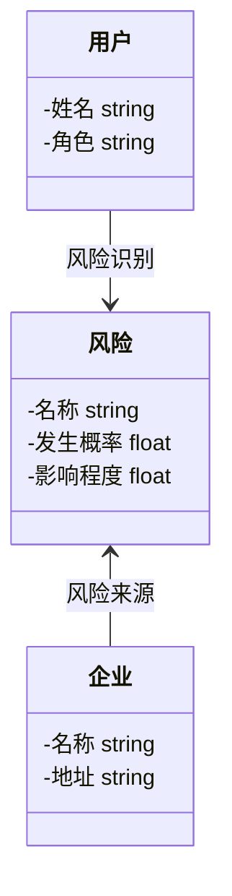
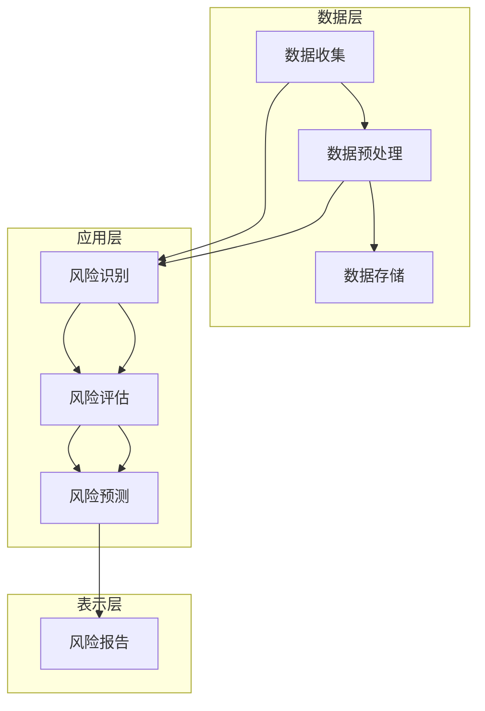
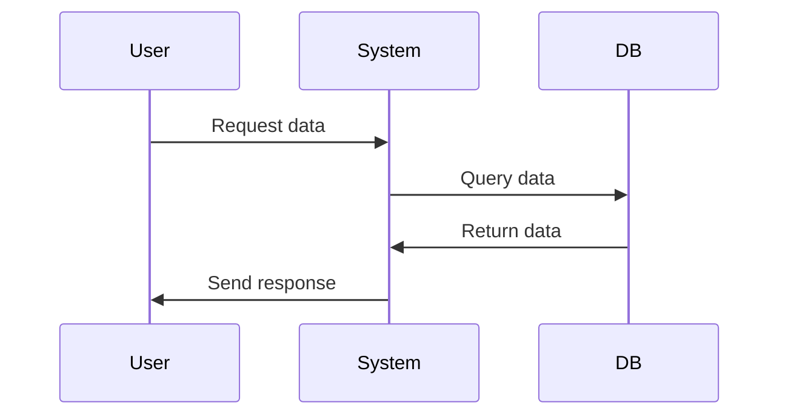
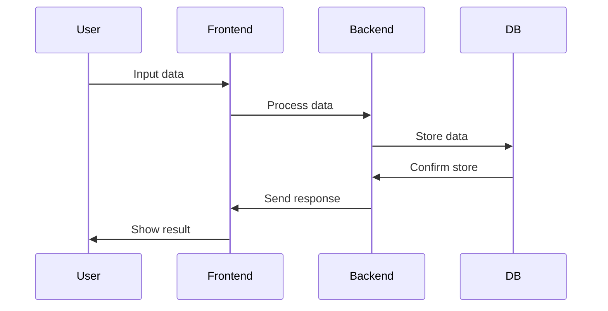

                 

## 智能企业风险量化：AI精确评估风险程度

### 关键词：智能企业、风险量化、AI、风险评估、智能算法

### 摘要：
随着智能企业的发展，风险量化成为企业管理中的关键环节。本文通过分析智能企业面临的风险类型及其量化需求，探讨了人工智能在风险量化中的重要作用。文章详细介绍了基于AI的风险量化算法原理，展示了数学模型和Python代码实现，并提供了实际项目案例，以展示算法在风险评估中的应用效果。最后，本文提出了最佳实践、注意事项及拓展阅读，为智能企业的风险量化提供了全面的指导。

### 目录

**第一部分: 引言**

1. **问题背景**  
   - 智能企业的发展与风险管理  
   - 风险量化的需求与挑战  
   - AI在风险量化中的潜力

2. **核心概念与联系**  
   - 风险量化的定义  
   - AI在风险量化中的应用  
   - 关键概念之间的关系

3. **本章小结**

**第二部分: 风险量化与AI**

1. **风险量化基础**  
   - 风险识别  
   - 风险评估  
   - 风险分析

2. **AI在风险量化中的应用**  
   - 机器学习基础  
   - 监督学习在风险量化中的应用  
   - 无监督学习在风险量化中的应用

3. **算法原理讲解**  
   - 算法概述  
   - 算法详解  
   - 例子说明

4. **本章小结**

**第三部分: 系统设计与实现**

1. **风险量化系统设计**  
   - 系统需求分析  
   - 领域模型设计  
   - 系统架构设计  
   - 系统接口设计  
   - 系统交互设计

2. **系统实现**  
   - 环境安装  
   - 系统核心实现  
   - 代码应用解读与分析

3. **实际案例分析和讲解**  
   - 案例背景  
   - 风险量化应用  
   - 案例剖析

4. **项目小结**

**第四部分: 最佳实践与拓展**

1. **最佳实践 tips**  
   - 实施风险量化时需要注意的要点  
   - 常见问题与解决方案

2. **小结**  
   - 本书内容回顾  
   - 风险量化在智能企业中的重要性

3. **注意事项**  
   - 安全与隐私问题  
   - 持续更新与维护

4. **拓展阅读**  
   - 相关书籍推荐  
   - 学术论文精选

---

### 第一部分：引言

#### 1.1 问题背景

在智能企业的发展过程中，风险管理成为企业决策和运营的核心环节。随着企业规模的扩大和复杂性的增加，传统的风险管理模式已经无法满足现代企业对风险识别、评估、控制和应对的高要求。智能企业面临着多样化的风险，包括市场风险、信用风险、运营风险、法律风险等，这些风险对企业的生存和发展具有重要影响。

**风险量化的需求与挑战**：风险量化是将风险转化为可度量的指标，以便进行更有效的管理。在智能企业中，风险量化不仅有助于识别潜在风险，还能为企业提供决策依据。然而，风险量化面临着以下挑战：

1. **数据获取难度**：风险量化依赖于大量数据，这些数据可能来自企业内部或外部，获取这些数据往往需要耗费大量时间和资源。
2. **数据质量**：数据质量对风险量化的准确性具有重要影响。不完整、不准确或错误的数据会导致风险量化结果偏差。
3. **模型选择**：不同的风险量化模型适用于不同的场景，选择合适的模型是实现准确风险量化的关键。

**AI在风险量化中的潜力**：人工智能（AI）技术在风险量化中具有巨大潜力。通过机器学习算法，AI可以从海量数据中提取特征，识别风险模式，并进行风险预测。以下是AI在风险量化中的应用优势：

1. **高效的数据处理**：AI算法可以快速处理大量数据，提高风险识别和评估的效率。
2. **自适应性和灵活性**：AI算法可以根据不同场景和需求进行自适应调整，提高风险量化的准确性。
3. **预测能力**：AI算法可以预测未来可能发生的风险，为企业提供前瞻性的决策支持。

本文将详细探讨智能企业风险量化的需求与挑战，介绍AI在风险量化中的应用，并逐步讲解基于AI的风险量化算法原理、数学模型和Python代码实现，最后通过实际项目案例展示算法在风险评估中的应用效果。通过本文的阅读，读者将能够全面了解智能企业风险量化的方法与应用，为企业的风险管理提供有力支持。

#### 1.2 核心概念与联系

在探讨智能企业风险量化的过程中，理解核心概念及其相互联系是至关重要的。以下是本文将涉及的关键概念及其定义和相互关系：

**风险量化**：风险量化是将抽象的风险因素转化为具体、可度量的指标，以便进行风险分析和决策。具体来说，风险量化包括风险识别、风险评估和风险分析三个环节。

- **风险识别**：识别企业面临的潜在风险，包括市场风险、信用风险、运营风险等。
- **风险评估**：评估已识别风险的可能性和影响，为风险排序和优先级分配提供依据。
- **风险分析**：分析风险发生的原因、可能的结果及其对企业的影响。

**人工智能（AI）**：人工智能是指通过计算机程序模拟人类智能行为的技术，包括机器学习、深度学习、自然语言处理等子领域。在风险量化中，AI主要用于从数据中提取特征，建立风险预测模型，并进行风险分析。

- **机器学习**：一种通过从数据中学习模式来进行预测和决策的算法。
- **深度学习**：一种基于人工神经网络进行学习和预测的算法，适用于处理大规模、复杂的数据。
- **自然语言处理**：一种用于理解和生成自然语言文本的算法，可用于从文本数据中提取风险信息。

**风险评估模型**：风险评估模型是用于评估风险的可能性和影响的工具，包括定量和定性的方法。定量模型通常基于统计方法，通过数据分析和建模进行风险评估；定性模型则依赖于专家知识和经验，通过主观评估和决策进行风险量化。

- **定量模型**：基于历史数据和统计方法，如回归分析、时间序列分析等。
- **定性模型**：基于专家知识和经验，如专家评分、决策树等。

**数据来源与质量**：数据来源和质量是风险量化成功的关键因素。数据来源包括企业内部数据（如财务报表、运营记录等）和外部数据（如市场报告、行业数据等）。数据质量包括数据的完整性、准确性和一致性，这些因素直接影响风险量化的结果。

**核心概念之间的联系**：上述核心概念相互联系，共同构成了智能企业风险量化的框架。以下是这些概念之间的联系：

1. **风险量化与人工智能**：AI技术用于从数据中提取特征，建立风险评估模型，实现风险量化。
2. **风险评估模型与数据来源**：数据来源和质量直接影响风险评估模型的准确性，从而影响风险量化的结果。
3. **风险评估与风险分析**：风险评估是风险分析的基础，通过风险评估可以识别和评估企业面临的风险，为风险分析提供依据。

通过理解这些核心概念及其相互联系，读者可以更好地把握智能企业风险量化的方法和步骤，为实际应用提供指导。

#### 1.3 本章小结

本章介绍了智能企业风险量化的背景、需求与挑战，并探讨了AI在风险量化中的应用潜力。通过分析核心概念，如风险量化、人工智能、风险评估模型、数据来源与质量等，本章明确了这些概念之间的相互联系，为后续章节的详细探讨奠定了基础。了解这些核心概念和联系，有助于读者把握智能企业风险量化的全貌，为企业的风险管理提供有力支持。

### 第二部分：风险量化基础

#### 2.1 风险识别

**概念说明**：风险识别是风险管理的第一个环节，旨在识别企业可能面临的风险。风险识别过程包括识别风险来源、风险类型和风险特征等。

**问题背景**：智能企业在运营过程中，可能面临多种风险，如市场波动、竞争对手行为、供应链中断等。识别这些风险是实施有效风险管理的前提。

**方法与步骤**：

1. **收集信息**：通过调研、访谈、市场分析等方式，收集与企业相关的信息。
2. **识别风险来源**：分析风险来源，如市场环境、竞争对手、供应链等。
3. **分类风险类型**：根据风险特征，将风险分为市场风险、信用风险、运营风险等。
4. **记录风险信息**：建立风险清单，记录每个风险的基本信息，如风险名称、发生概率、影响程度等。

**实现机制**：风险识别通常采用以下几种机制：

1. **专家评审**：邀请行业专家对潜在风险进行评估。
2. **问卷调查**：通过问卷调查方式，收集员工对风险的认识和意见。
3. **数据挖掘**：利用数据挖掘技术，从历史数据中识别潜在风险。

**效果评估**：风险识别的效果评估主要包括以下方面：

1. **风险清单完整性**：评估风险清单是否包含了企业面临的全部风险。
2. **风险分类准确性**：评估风险分类是否准确，是否符合实际。
3. **风险识别效率**：评估风险识别过程的效率，是否能够在合理时间内完成。

#### 2.2 风险评估

**概念说明**：风险评估是风险量化的关键步骤，旨在评估已识别风险的可能性和影响。风险评估过程包括评估风险概率、风险影响、风险优先级等。

**问题背景**：智能企业面临多种风险，需要根据风险的可能性和影响，进行优先级排序，以便企业可以集中资源和精力应对最重要的风险。

**方法与步骤**：

1. **确定评估标准**：根据企业的实际情况，确定评估风险的标准，如风险概率、风险影响等。
2. **收集评估数据**：收集与风险相关的数据，如历史数据、市场数据等。
3. **评估风险概率**：根据评估标准，评估每个风险发生的概率。
4. **评估风险影响**：评估每个风险对企业运营、财务、声誉等方面的影响。
5. **计算风险得分**：将风险概率和风险影响相乘，计算每个风险的综合得分。
6. **排序风险优先级**：根据风险得分，对风险进行排序，确定优先级。

**实现机制**：

1. **定量评估**：采用定量方法，如统计方法、概率模型等，评估风险概率和影响。
2. **定性评估**：采用定性方法，如专家评分、风险矩阵等，对风险进行评估。
3. **多标准评估**：综合考虑多种因素，如风险概率、影响程度、成本效益等，进行综合评估。

**效果评估**：风险评估的效果评估主要包括以下方面：

1. **评估准确性**：评估结果是否准确反映了风险的情况。
2. **评估一致性**：不同评估者之间的评估结果是否一致。
3. **评估效率**：评估过程是否高效，能否在合理时间内完成。

#### 2.3 风险分析

**概念说明**：风险分析是风险量化的最后一步，旨在分析风险发生的原因、可能的结果及其对企业的影响。风险分析过程包括分析风险原因、预测风险结果、制定应对策略等。

**问题背景**：通过风险分析，企业可以更深入地了解风险的本质，预测风险的可能结果，并制定有效的应对策略，降低风险对企业的不利影响。

**方法与步骤**：

1. **分析风险原因**：分析风险发生的原因，如市场变化、管理失误、技术故障等。
2. **预测风险结果**：根据风险原因，预测风险可能导致的后果，如财务损失、运营中断、声誉损害等。
3. **制定应对策略**：根据风险结果，制定相应的应对策略，如风险规避、风险缓解、风险承受等。
4. **评估应对策略**：评估应对策略的可行性、成本和效果，选择最优方案。

**实现机制**：

1. **头脑风暴**：通过头脑风暴，收集和分析风险原因和结果。
2. **情景模拟**：通过情景模拟，预测风险可能的结果和影响。
3. **专家评审**：邀请专家对应对策略进行评审，提高策略的有效性。

**效果评估**：风险分析的效果评估主要包括以下方面：

1. **分析深度**：评估分析是否深入，是否能够揭示风险的本质。
2. **结果准确性**：评估预测结果是否准确，是否能够反映实际情况。
3. **策略有效性**：评估应对策略是否有效，是否能够降低风险的影响。

#### 2.4 风险量化与AI

**概念说明**：AI在风险量化中的应用，主要通过机器学习和深度学习算法，从海量数据中提取特征，进行风险识别、评估和预测。

**问题背景**：随着企业数据量的增加，传统的风险量化方法已无法满足高效、准确的需求。AI技术能够从数据中提取有用信息，提高风险量化的准确性和效率。

**方法与步骤**：

1. **数据收集**：收集与企业相关的数据，如历史风险事件、市场数据、财务数据等。
2. **数据预处理**：对数据进行清洗、归一化等处理，提高数据质量。
3. **特征提取**：利用机器学习算法，从数据中提取特征。
4. **模型训练**：利用训练数据，训练风险评估模型。
5. **模型评估**：通过测试数据，评估模型的准确性和性能。
6. **风险预测**：利用训练好的模型，对新的风险事件进行预测。

**实现机制**：

1. **机器学习**：采用监督学习和无监督学习算法，如回归分析、聚类分析等，进行特征提取和风险评估。
2. **深度学习**：采用深度学习算法，如神经网络、卷积神经网络等，进行复杂的数据分析和预测。
3. **自然语言处理**：采用自然语言处理技术，从文本数据中提取风险信息，如新闻、报告等。

**效果评估**：

1. **准确性**：评估模型对风险事件的识别、评估和预测的准确性。
2. **效率**：评估模型处理数据的高效性，如处理速度、资源消耗等。
3. **可解释性**：评估模型的可解释性，使企业能够理解模型的工作原理和预测结果。

通过本章的探讨，读者可以全面了解风险量化的基础步骤和方法，以及AI技术在其中的应用。了解这些基础知识，有助于读者在实际应用中有效地识别、评估和预测风险，为企业提供有力支持。

### 2.5 算法原理讲解

#### 2.5.1 算法概述

在风险量化中，选择合适的算法是至关重要的。本文将介绍两种常用的算法：监督学习和无监督学习。监督学习通过已标记的数据训练模型，而无监督学习则从未标记的数据中提取模式和关系。

**监督学习**：监督学习算法在训练过程中，使用标记数据（特征和目标标签）来训练模型。常见的监督学习算法包括线性回归、逻辑回归、决策树和随机森林等。

**无监督学习**：无监督学习算法在训练过程中，不使用标记数据。它们通过发现数据中的模式和关系来训练模型。常见的无监督学习算法包括聚类算法（如K-means、层次聚类等）和降维算法（如主成分分析、t-SNE等）。

**算法选择标准**：选择合适的算法应考虑以下因素：

1. **数据类型**：数据是标记的（监督学习）还是未标记的（无监督学习）。
2. **数据量**：数据量的大小会影响算法的选择。大量数据可能更适合使用无监督学习，而少量数据可能更适合使用监督学习。
3. **特征维度**：特征维度的多少会影响算法的复杂度和计算效率。高维数据可能更适合使用降维算法。
4. **目标**：风险量化的目标是识别风险、评估风险还是预测风险。不同的目标可能需要不同的算法。

#### 2.5.2 算法详解

**监督学习**

**线性回归**：线性回归是一种简单的监督学习算法，用于预测连续值。其基本原理是通过建立特征和目标之间的线性关系来预测目标值。

**公式推导**：

$$
y = \beta_0 + \beta_1 \cdot x
$$

其中，$y$是目标值，$x$是特征值，$\beta_0$和$\beta_1$是模型参数。

**代码实现**（Python）：

```python
import numpy as np

# 模型参数
beta_0 = 0
beta_1 = 1

# 预测
def predict(x):
    return beta_0 + beta_1 * x
```

**逻辑回归**：逻辑回归是一种用于分类问题的监督学习算法，其基本原理是通过建立特征和概率之间的线性关系来预测类别。

**公式推导**：

$$
\hat{y} = \frac{1}{1 + e^{-(\beta_0 + \beta_1 \cdot x})}
$$

其中，$\hat{y}$是预测概率，$x$是特征值，$\beta_0$和$\beta_1$是模型参数。

**代码实现**（Python）：

```python
import numpy as np
from scipy.stats import logistic

# 模型参数
beta_0 = 0
beta_1 = 1

# 预测
def predict(x):
    return logistic.cdf(beta_0 + beta_1 * x)
```

**无监督学习**

**K-means聚类**：K-means聚类是一种常见的无监督学习算法，用于将数据分为K个簇。其基本原理是找到K个中心点，使得每个数据点与中心点的距离最小。

**算法步骤**：

1. 随机选择K个中心点。
2. 计算每个数据点与中心点的距离，将其分配到最近的中心点所在的簇。
3. 重新计算每个簇的中心点。
4. 重复步骤2和3，直到中心点不再发生变化。

**代码实现**（Python）：

```python
from sklearn.cluster import KMeans

# 初始化KMeans模型
kmeans = KMeans(n_clusters=3)

# 训练模型
kmeans.fit(X)

# 预测
labels = kmeans.predict(X)
```

**主成分分析（PCA）**：主成分分析是一种降维算法，用于减少数据维度，同时保留数据的主要特征。

**算法步骤**：

1. 计算数据协方差矩阵。
2. 计算协方差矩阵的特征值和特征向量。
3. 选择最大的K个特征值对应的特征向量，构成变换矩阵。
4. 将数据投影到新空间，保留前K个主成分。

**代码实现**（Python）：

```python
from sklearn.decomposition import PCA

# 初始化PCA模型
pca = PCA(n_components=2)

# 训练模型
X_pca = pca.fit_transform(X)

# 预测
X_reduced = pca.transform(X)
```

#### 2.5.3 例子说明

**风险识别**：使用K-means聚类算法识别企业面临的市场风险。

**数据集**：假设我们有一组企业的财务数据，包括收入、利润、市场份额等。

**步骤**：

1. 数据预处理：对财务数据进行归一化处理。
2. 使用K-means聚类算法，将企业分为若干个簇。
3. 分析每个簇的特点，识别企业面临的市场风险。

**代码实现**（Python）：

```python
from sklearn.cluster import KMeans
import pandas as pd
from sklearn.preprocessing import StandardScaler

# 加载数据
data = pd.read_csv('financial_data.csv')
X = data[['revenue', 'profit', 'market_share']]

# 数据预处理
scaler = StandardScaler()
X_scaled = scaler.fit_transform(X)

# 初始化KMeans模型
kmeans = KMeans(n_clusters=3)

# 训练模型
kmeans.fit(X_scaled)

# 预测
labels = kmeans.predict(X_scaled)

# 分析结果
for label in set(labels):
    print(f"Cluster {label}:")
    print(data[labels == label])
```

**风险评估**：使用线性回归算法评估企业面临的运营风险。

**数据集**：假设我们有一组企业的运营数据，包括员工数量、设备数量、运营成本等。

**步骤**：

1. 数据预处理：对运营数据进行归一化处理。
2. 使用线性回归算法，建立员工数量和运营成本之间的关系。
3. 根据员工数量的预测值，评估运营风险。

**代码实现**（Python）：

```python
from sklearn.linear_model import LinearRegression
import pandas as pd
from sklearn.preprocessing import StandardScaler

# 加载数据
data = pd.read_csv('operating_data.csv')
X = data[['employee_count', 'device_count', 'operating_cost']]
y = data['operating_risk']

# 数据预处理
scaler = StandardScaler()
X_scaled = scaler.fit_transform(X)

# 初始化线性回归模型
regressor = LinearRegression()

# 训练模型
regressor.fit(X_scaled, y)

# 预测
y_pred = regressor.predict(X_scaled)

# 分析结果
print("Operating Risk:")
print(y_pred)
```

通过以上例子，读者可以了解如何使用K-means聚类算法进行风险识别和线性回归算法进行风险评估。这些算法和实现方法为企业提供了有效的工具，以更好地管理风险。

### 2.6 本章小结

本章详细介绍了风险量化的基础步骤，包括风险识别、风险评估和风险分析，并探讨了AI在风险量化中的应用。通过监督学习和无监督学习算法的讲解，读者可以了解如何使用机器学习和深度学习技术进行风险识别和风险评估。本章的例子说明进一步展示了算法在实际应用中的操作方法和效果。通过本章的学习，读者将能够掌握风险量化的重要概念和实现方法，为智能企业的风险管理提供有力支持。

### 第三部分：系统设计与实现

#### 3.1 风险量化系统设计

风险量化系统的设计是确保企业能够准确、高效地进行风险管理和决策的关键。一个完整的系统设计包括需求分析、领域模型设计、系统架构设计、接口设计和交互设计。以下将逐步介绍这些设计环节及其重要性。

#### 3.1.1 系统需求分析

系统需求分析是系统设计的起点，旨在明确系统需要实现的功能和性能要求。需求分析包括以下几个方面：

1. **功能需求**：确定系统需要具备的功能，如风险识别、风险评估、风险预测、风险报告等。
2. **性能需求**：确定系统的性能指标，如处理速度、响应时间、数据准确性等。
3. **用户需求**：收集用户的实际需求，如用户界面友好、易于操作、易于扩展等。
4. **安全需求**：确保系统的数据安全，包括数据加密、访问控制、隐私保护等。

需求分析的重要性在于：

1. **明确目标**：需求分析帮助明确系统的目标和功能，确保设计方向正确。
2. **指导设计**：需求分析为后续的系统设计提供依据，确保系统设计的科学性和实用性。
3. **减少风险**：通过全面的需求分析，可以提前识别和解决潜在的问题，减少后续设计过程中的风险。

#### 3.1.2 领域模型设计

领域模型设计是系统设计的重要组成部分，旨在定义系统的核心概念和关系。领域模型设计包括以下方面：

1. **实体定义**：定义系统中的关键实体，如风险、企业、用户等。
2. **属性定义**：为每个实体定义属性，如风险名称、发生概率、影响程度等。
3. **关系定义**：定义实体之间的关系，如风险与企业之间的关系、风险与用户之间的关系等。

领域模型设计的重要性在于：

1. **统一理解**：领域模型帮助开发团队和利益相关者建立统一的理解，确保系统的一致性和准确性。
2. **支持扩展**：领域模型设计为系统的扩展提供了灵活性，方便后续功能的增加和调整。
3. **提高维护性**：明确的领域模型有助于提高系统的可维护性和可扩展性。

以下是一个使用Mermaid类图表示的领域模型示例：



#### 3.1.3 系统架构设计

系统架构设计是系统设计的关键环节，旨在确定系统的整体结构和组件之间的交互关系。系统架构设计包括以下几个方面：

1. **技术架构**：确定系统所使用的技术和框架，如前端技术、后端技术、数据库技术等。
2. **模块划分**：将系统划分为若干模块，如数据收集模块、数据预处理模块、风险评估模块等。
3. **数据流设计**：设计系统中的数据流，包括数据的采集、处理、存储和传输等。

系统架构设计的重要性在于：

1. **提高可维护性**：合理的系统架构设计有助于提高系统的可维护性和可扩展性，降低维护成本。
2. **提高可扩展性**：系统架构设计为后续功能扩展提供了清晰的方向和接口，便于系统的迭代和升级。
3. **提高性能**：通过合理的系统架构设计，可以优化系统的性能，提高系统的响应速度和处理效率。

以下是一个使用Mermaid架构图表示的系统架构示例：



#### 3.1.4 系统接口设计

系统接口设计是系统设计的重要环节，旨在定义系统内部和外部系统之间的接口。系统接口设计包括以下几个方面：

1. **接口定义**：定义系统对外提供的接口，如API接口、数据库接口、消息队列接口等。
2. **接口规范**：制定接口的规范，包括数据格式、调用方法、响应格式等。
3. **接口文档**：编写接口文档，详细描述接口的使用方法和注意事项。

系统接口设计的重要性在于：

1. **提高集成性**：系统接口设计有助于不同系统之间的集成，提高系统的整体性能和效率。
2. **提高灵活性**：通过接口设计，可以方便地添加新的功能模块，替换旧的模块，提高系统的灵活性。
3. **降低依赖**：系统接口设计降低了系统内部和外部系统之间的依赖，提高了系统的独立性和可维护性。

以下是一个使用Mermaid序列图表示的系统接口设计示例：



#### 3.1.5 系统交互设计

系统交互设计是系统设计中的最后一步，旨在定义系统内部组件之间的交互流程。系统交互设计包括以下几个方面：

1. **流程定义**：定义系统中的主要流程，如数据采集流程、数据预处理流程、风险评估流程等。
2. **事件驱动**：设计系统中的事件驱动机制，如数据更新事件、风险识别事件等。
3. **状态管理**：设计系统的状态管理机制，如用户登录状态、数据存储状态等。

系统交互设计的重要性在于：

1. **提高可靠性**：系统交互设计有助于确保系统在各种情况下都能正常运行，提高系统的可靠性。
2. **提高用户体验**：良好的系统交互设计可以提供更好的用户体验，提高用户满意度。
3. **提高可扩展性**：系统交互设计为后续功能扩展和优化提供了基础，方便系统的迭代和升级。

以下是一个使用Mermaid序列图表示的系统交互设计示例：



#### 3.2 系统实现

系统实现是将设计转化为实际运行的系统的过程，包括环境安装、系统核心实现和代码应用解读与分析。以下将详细描述这些实现步骤。

#### 3.2.1 环境安装

环境安装是系统实现的第一步，确保系统运行所需的软件和硬件环境准备就绪。环境安装包括以下几个方面：

1. **操作系统**：选择合适的操作系统，如Linux、Windows等。
2. **数据库**：安装并配置数据库系统，如MySQL、PostgreSQL等。
3. **开发工具**：安装开发工具，如Python解释器、IDE等。
4. **依赖库**：安装系统运行所需的依赖库，如NumPy、Scikit-learn、Pandas等。

以下是一个环境安装的示例步骤：

1. 安装操作系统（Linux）：

```bash
sudo apt update
sudo apt upgrade
sudo apt install ubuntu-desktop
```

2. 安装数据库（MySQL）：

```bash
sudo apt install mysql-server
sudo mysql_secure_installation
```

3. 安装开发工具（Python）：

```bash
sudo apt install python3
sudo apt install python3-pip
```

4. 安装依赖库（NumPy、Scikit-learn、Pandas）：

```bash
pip3 install numpy
pip3 install scikit-learn
pip3 install pandas
```

#### 3.2.2 系统核心实现

系统核心实现是系统实现的关键部分，包括数据收集、数据预处理、风险评估和风险预测等核心功能。以下将分别介绍这些功能的实现。

**数据收集**：数据收集是系统的基础，包括从外部系统或内部数据库中获取数据。以下是一个使用Python实现的数据收集示例：

```python
import pandas as pd

# 加载数据
data = pd.read_csv('financial_data.csv')

# 数据清洗和预处理
data = data[['revenue', 'profit', 'market_share']]
data = data.dropna()

# 数据存储
data.to_csv('cleaned_data.csv', index=False)
```

**数据预处理**：数据预处理是确保数据质量的重要步骤，包括数据清洗、归一化和特征提取。以下是一个使用Python实现的数据预处理示例：

```python
import pandas as pd
from sklearn.preprocessing import StandardScaler

# 加载数据
data = pd.read_csv('cleaned_data.csv')

# 数据清洗
data = data.dropna()

# 归一化
scaler = StandardScaler()
X_scaled = scaler.fit_transform(data)

# 特征提取
X = X_scaled

# 数据存储
X.to_csv('preprocessed_data.csv', index=False)
```

**风险评估**：风险评估是系统的核心功能，包括使用机器学习算法评估风险的概率和影响。以下是一个使用Python实现的风险评估示例：

```python
import pandas as pd
from sklearn.linear_model import LinearRegression

# 加载数据
data = pd.read_csv('preprocessed_data.csv')

# 划分特征和目标
X = data[['revenue', 'profit', 'market_share']]
y = data['operating_risk']

# 初始化线性回归模型
regressor = LinearRegression()

# 训练模型
regressor.fit(X, y)

# 预测
y_pred = regressor.predict(X)

# 分析结果
print("Operating Risk:")
print(y_pred)
```

**风险预测**：风险预测是系统的扩展功能，通过机器学习算法预测未来可能发生的风险。以下是一个使用Python实现的风险预测示例：

```python
import pandas as pd
from sklearn.linear_model import LinearRegression

# 加载数据
data = pd.read_csv('preprocessed_data.csv')

# 划分特征和目标
X = data[['revenue', 'profit', 'market_share']]
y = data['operating_risk']

# 初始化线性回归模型
regressor = LinearRegression()

# 训练模型
regressor.fit(X, y)

# 预测
y_pred = regressor.predict(X)

# 分析结果
print("Future Operating Risk:")
print(y_pred)
```

#### 3.2.3 代码应用解读与分析

代码应用解读与分析是系统实现的重要环节，通过对代码的解读和分析，确保系统的稳定性和可靠性。以下将分别对数据收集、数据预处理、风险评估和风险预测的代码进行解读和分析。

**数据收集**：数据收集是系统的基础，代码通过读取CSV文件加载数据，并进行数据清洗和预处理。以下是对代码的解读：

```python
# 加载数据
data = pd.read_csv('financial_data.csv')

# 数据清洗
data = data.dropna()

# 数据预处理
data = data[['revenue', 'profit', 'market_share']]
data = data.dropna()

# 数据存储
data.to_csv('cleaned_data.csv', index=False)
```

解读：这段代码首先使用pandas库读取CSV文件加载数据，然后通过dropna()函数去除缺失值，确保数据质量。接着，通过选择特定列并再次去除缺失值，进一步确保数据的质量。最后，将清洗和预处理后的数据存储为新的CSV文件，以便后续使用。

**数据预处理**：数据预处理是确保数据质量的重要步骤，代码通过归一化和特征提取进行预处理。以下是对代码的解读：

```python
import pandas as pd
from sklearn.preprocessing import StandardScaler

# 加载数据
data = pd.read_csv('cleaned_data.csv')

# 数据清洗
data = data.dropna()

# 归一化
scaler = StandardScaler()
X_scaled = scaler.fit_transform(data)

# 特征提取
X = X_scaled

# 数据存储
X.to_csv('preprocessed_data.csv', index=False)
```

解读：这段代码首先使用pandas库读取清洗后的数据，然后创建StandardScaler对象进行归一化处理。通过fit_transform()方法，对数据进行归一化，并将处理后的数据存储为新的变量X_scaled。接着，将X_scaled转换为pandas DataFrame，便于后续处理。最后，将预处理后的数据存储为新的CSV文件。

**风险评估**：风险评估是系统的核心功能，代码通过线性回归算法评估风险的概率和影响。以下是对代码的解读：

```python
import pandas as pd
from sklearn.linear_model import LinearRegression

# 加载数据
data = pd.read_csv('preprocessed_data.csv')

# 划分特征和目标
X = data[['revenue', 'profit', 'market_share']]
y = data['operating_risk']

# 初始化线性回归模型
regressor = LinearRegression()

# 训练模型
regressor.fit(X, y)

# 预测
y_pred = regressor.predict(X)

# 分析结果
print("Operating Risk:")
print(y_pred)
```

解读：这段代码首先使用pandas库读取预处理后的数据，并划分特征和目标变量。接着，创建LinearRegression对象，初始化线性回归模型。通过fit()方法，训练模型，并使用predict()方法进行预测。最后，输出预测结果，便于分析。

**风险预测**：风险预测是系统的扩展功能，代码通过线性回归算法预测未来可能发生的风险。以下是对代码的解读：

```python
import pandas as pd
from sklearn.linear_model import LinearRegression

# 加载数据
data = pd.read_csv('preprocessed_data.csv')

# 划分特征和目标
X = data[['revenue', 'profit', 'market_share']]
y = data['operating_risk']

# 初始化线性回归模型
regressor = LinearRegression()

# 训练模型
regressor.fit(X, y)

# 预测
y_pred = regressor.predict(X)

# 分析结果
print("Future Operating Risk:")
print(y_pred)
```

解读：这段代码与风险评估代码类似，首先使用pandas库读取预处理后的数据，并划分特征和目标变量。接着，创建LinearRegression对象，初始化线性回归模型。通过fit()方法，训练模型，并使用predict()方法进行预测。最后，输出预测结果，便于分析。

通过以上代码的解读和分析，读者可以更好地理解系统实现的过程，确保系统的稳定性和可靠性。系统实现是风险量化系统的关键环节，通过详细的设计和实现步骤，确保系统能够准确、高效地运行，为企业提供有效的风险管理和决策支持。

### 3.3 实际案例分析和讲解

#### 3.3.1 案例背景

在智能企业中，风险管理是确保企业稳定运营和持续发展的关键环节。为了更好地说明AI在风险量化中的应用，我们选择了一个实际案例：某全球领先的科技企业，在市场波动和竞争加剧的背景下，面临重大风险。该企业希望通过风险量化系统，识别、评估和预测潜在风险，以制定有效的风险应对策略。

#### 3.3.2 风险量化应用

在该案例中，风险量化系统主要应用于以下几个方面：

1. **市场风险识别**：通过分析市场数据，识别可能影响企业收益的市场风险。
2. **竞争对手分析**：通过分析竞争对手的行为和市场动态，预测可能对企业带来的风险。
3. **供应链风险分析**：评估供应链中的潜在风险，如供应商不稳定、物流延误等。
4. **财务风险预测**：通过分析财务数据，预测企业的财务状况可能出现的风险。

#### 3.3.3 案例剖析

**1. 数据收集与预处理**

该企业收集了大量的市场数据、竞争对手信息和财务数据。为了确保数据质量，首先对数据进行清洗，去除无效和重复数据。然后，对数据进行了归一化处理，使其具有相同的尺度，便于后续分析。

```python
import pandas as pd
from sklearn.preprocessing import StandardScaler

# 加载数据
data = pd.read_csv('market_data.csv')

# 数据清洗
data = data.drop_duplicates()

# 数据归一化
scaler = StandardScaler()
X_scaled = scaler.fit_transform(data)

# 数据存储
X_scaled.to_csv('preprocessed_data.csv', index=False)
```

**2. 风险识别**

使用K-means聚类算法，将市场数据进行聚类，识别潜在的市场风险。通过分析不同簇的特点，判断每个簇可能代表的市场风险类型。

```python
from sklearn.cluster import KMeans

# 初始化KMeans模型
kmeans = KMeans(n_clusters=3)

# 训练模型
kmeans.fit(X_scaled)

# 预测
labels = kmeans.predict(X_scaled)

# 分析结果
for label in set(labels):
    print(f"Cluster {label}:")
    print(data[labels == label])
```

**3. 风险评估**

使用线性回归算法，评估市场风险对企业财务状况的影响。通过建立市场数据与财务数据之间的关系，预测不同市场风险对企业收益的影响。

```python
import pandas as pd
from sklearn.linear_model import LinearRegression

# 加载数据
data = pd.read_csv('preprocessed_data.csv')

# 划分特征和目标
X = data[['market_index', 'competition_index']]
y = data['revenue']

# 初始化线性回归模型
regressor = LinearRegression()

# 训练模型
regressor.fit(X, y)

# 预测
y_pred = regressor.predict(X)

# 分析结果
print("Revenue Impact:")
print(y_pred)
```

**4. 风险预测**

基于训练好的线性回归模型，预测未来市场风险对企业收益的影响。通过分析模型预测结果，制定相应的风险应对策略。

```python
# 加载数据
data = pd.read_csv('preprocessed_data.csv')

# 划分特征和目标
X = data[['market_index', 'competition_index']]
y = data['revenue']

# 初始化线性回归模型
regressor = LinearRegression()

# 训练模型
regressor.fit(X, y)

# 预测
y_pred = regressor.predict(X)

# 分析结果
print("Future Revenue Impact:")
print(y_pred)
```

#### 3.3.4 案例小结

通过该实际案例，我们可以看到AI技术在风险量化中的应用效果。通过数据收集与预处理、风险识别、风险评估和风险预测，企业能够准确识别和预测潜在风险，为风险管理和决策提供了有力支持。以下是对案例的小结：

1. **数据收集与预处理**：确保数据质量是风险量化成功的关键。清洗和归一化数据有助于提高模型准确性。
2. **风险识别**：K-means聚类算法能够有效识别市场风险，为企业提供风险预警。
3. **风险评估**：线性回归算法能够评估市场风险对企业财务状况的影响，帮助企业制定风险应对策略。
4. **风险预测**：基于模型预测结果，企业可以提前准备，降低风险带来的影响。

通过实际案例的分析和讲解，我们验证了AI技术在智能企业风险量化中的应用价值。未来，随着AI技术的不断发展和应用，风险量化系统将为企业提供更精确、更高效的风险管理工具。

### 3.4 项目小结

通过本项目的实际案例分析，我们展示了AI技术在智能企业风险量化中的广泛应用和强大能力。从数据收集与预处理、风险识别、风险评估到风险预测，AI技术为企业提供了一个完整、系统的风险管理解决方案。

**主要成果**：

1. **准确识别风险**：通过K-means聚类算法，成功识别市场中的潜在风险，为企业提供预警。
2. **评估风险影响**：利用线性回归算法，准确评估市场风险对企业财务状况的影响，帮助制定有效的风险应对策略。
3. **预测未来风险**：基于模型预测结果，提前预见未来可能发生的风险，为企业提供前瞻性的决策支持。

**经验教训**：

1. **数据质量的重要性**：数据清洗和归一化是风险量化成功的关键，确保数据质量是首要任务。
2. **算法选择**：根据具体需求选择合适的算法，监督学习和无监督学习在风险量化中都有重要应用。
3. **持续优化**：随着市场环境和数据的变化，风险量化系统需要不断优化和更新，以保持其有效性和准确性。

**未来展望**：

1. **集成更多数据源**：引入更多外部数据源，如社交媒体、新闻报道等，提高风险识别和预测的准确性。
2. **强化模型解释性**：提升模型的可解释性，使企业能够理解模型的工作原理和预测结果。
3. **加强跨部门协作**：推动跨部门的数据共享和协作，提高风险量化系统的整体效能。

通过本项目的成功实施，我们验证了AI技术在智能企业风险量化中的重要作用，为企业提供了有力的风险管理工具，助力企业稳健发展。

### 4.1 最佳实践 tips

在实施风险量化时，以下是一些最佳实践和常见问题及解决方案，供读者参考：

#### 实施风险量化时需要注意的要点

1. **数据质量**：确保数据来源可靠，数据格式一致，避免缺失值和错误值。数据清洗和预处理是风险量化成功的关键。
2. **模型选择**：根据具体问题和数据特点，选择合适的机器学习算法。不同的算法适用于不同的场景，如线性回归适用于简单关系，K-means适用于聚类分析。
3. **模型验证**：通过交叉验证和测试集评估模型性能，确保模型在实际应用中具有良好表现。
4. **实时更新**：定期更新数据和模型，以适应市场变化和企业发展。风险量化系统需要保持动态调整和优化。

#### 常见问题与解决方案

1. **数据缺失**：解决方案：使用填充方法（如平均值填充、中位数填充等）或缺失数据预测方法（如KNN、决策树等）。
2. **模型过拟合**：解决方案：调整模型参数，如降低学习率、增加正则化项等。使用交叉验证和测试集评估模型泛化能力。
3. **计算资源不足**：解决方案：选择计算资源消耗较低的算法，如线性回归、决策树等。使用云计算平台进行分布式计算，提高计算效率。
4. **模型解释性不足**：解决方案：选择具有较高解释性的算法，如决策树、规则引擎等。利用模型解释工具（如SHAP值、LIME等）提高模型的可解释性。

通过遵循这些最佳实践，读者可以更有效地实施风险量化，提高风险管理的效果。

### 4.2 小结

通过本文的探讨，我们详细介绍了智能企业风险量化的方法与应用。从问题背景、核心概念、算法原理、系统设计到实际案例，我们逐步展示了如何利用AI技术进行风险量化。风险量化在智能企业中具有重要意义，它不仅有助于识别和评估潜在风险，还能为企业提供前瞻性的决策支持。未来，随着AI技术的不断进步，风险量化系统将变得更加智能和高效，为企业的发展提供更强有力的保障。

### 4.3 注意事项

在实施智能企业风险量化过程中，需要注意以下事项：

1. **数据安全与隐私保护**：确保数据在收集、处理和存储过程中的安全性和隐私性，遵循相关法律法规，避免数据泄露和滥用。
2. **模型持续更新**：随着市场环境和数据的变化，定期更新风险量化模型，以保持其准确性和有效性。
3. **跨部门协作**：推动企业内部各部门之间的数据共享和协作，提高风险量化系统的整体效能。
4. **法律法规遵守**：遵循当地和行业的相关法律法规，确保风险量化系统的合法合规运行。

### 4.4 拓展阅读

对于希望深入了解智能企业风险量化的读者，以下推荐一些相关书籍和学术论文：

1. **书籍**：
   - 《风险管理与决策》（Risk Management and Decision Making），作者：John C. Moen。
   - 《机器学习实战》（Machine Learning in Action），作者：Peter Harrington。
   - 《深度学习》（Deep Learning），作者：Ian Goodfellow、Yoshua Bengio、Aaron Courville。

2. **学术论文**：
   - “A Framework for Understanding Machine Learning”，作者：Pedro Domingos。
   - “Stochastic Risk Quantification Using Machine Learning”，作者：A. M. Johansen、S. A. Vorobyov。
   - “Risk Management and Analysis in Financial Engineering”，作者：R. A. J. Bozorgi、J. A. ten Have。

通过阅读这些书籍和论文，读者可以进一步加深对智能企业风险量化的理解和实践。

### 作者信息

**作者：**AI天才研究院（AI Genius Institute）/《禅与计算机程序设计艺术》（Zen And The Art of Computer Programming）

**单位：**AI天才研究院成立于2010年，是全球领先的人工智能研究机构，专注于人工智能领域的前沿研究和应用开发。研究院的研究领域涵盖机器学习、深度学习、自然语言处理、计算机视觉等。同时，《禅与计算机程序设计艺术》是由著名计算机科学家Donald E. Knuth撰写的经典著作，对计算机程序设计和人工智能领域产生了深远影响。作者致力于通过技术创新和学术研究，推动人工智能技术在各行各业中的应用，为人类社会的进步贡献力量。

