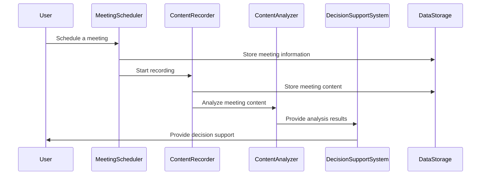
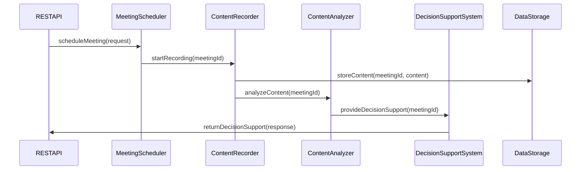

                 

### 智能会议管理系统：AI提升沟通与决策效率

关键词：智能会议管理、AI技术、沟通效率、决策效率、系统设计、案例分析

摘要：随着企业信息化程度的不断提高，会议管理系统的需求日益突出。本文将探讨如何通过引入人工智能（AI）技术，打造一个智能会议管理系统，从而提升沟通和决策效率。文章将从背景介绍、核心概念、AI技术应用、系统设计与实现、案例分析等多个方面进行深入剖析。

## 引言

在现代企业中，会议是沟通和决策的重要手段。然而，传统会议管理面临诸多挑战，如会议组织复杂、沟通效率低下、决策不及时等。为了应对这些问题，企业需要引入智能会议管理系统，通过AI技术实现会议的自动化、智能化管理，从而提高沟通和决策效率。

智能会议管理系统是集成了人工智能技术的会议管理平台，能够通过自动化、智能化的方式对会议进行组织、管理和分析。其主要功能包括自动会议安排、实时会议内容记录和分析、智能决策支持等。本文将围绕智能会议管理系统，详细探讨AI技术在会议管理中的应用，系统设计与实现，以及实际案例的案例分析，从而为企业和团队提供有效的解决方案。

## 背景介绍

### 核心概念术语说明

在深入探讨智能会议管理系统之前，我们需要了解一些核心概念术语，以便更好地理解文章的内容。

- **智能会议管理系统**：指利用人工智能技术对会议进行自动化、智能化的管理，包括会议安排、会议记录、会议分析和决策支持等。
- **人工智能（AI）**：指模拟人类智能的计算机系统，通过学习和推理能力来实现智能化的任务执行。
- **自然语言处理（NLP）**：指计算机对人类语言的处理和理解，包括语音识别、语言翻译、情感分析等。
- **机器学习（ML）**：指通过数据和算法，使计算机具备自主学习和改进能力的技术。
- **计算机视觉（CV）**：指使计算机能够像人类一样理解和解析视觉信息的技术。

### 问题背景

传统会议管理存在以下问题：

- **会议组织复杂**：会议安排、通知、记录等需要人工处理，效率低下。
- **沟通效率低下**：会议内容记录不完整，信息传递不及时，沟通效果不佳。
- **决策不及时**：会议决策过程繁琐，决策效率低，影响企业运作。

### 问题描述

如何通过智能会议管理系统，利用AI技术解决传统会议管理中的问题，提高沟通和决策效率？

### 问题解决

智能会议管理系统通过以下方式解决问题：

- **自动化会议安排**：利用AI算法自动安排会议时间，提高会议组织效率。
- **智能会议内容记录**：利用自然语言处理技术实现会议内容自动记录，确保信息完整。
- **会议内容分析**：通过数据分析和机器学习技术，提取关键信息，辅助决策。
- **智能决策支持**：提供基于会议内容的智能决策建议，提高决策效率。

### 边界与外延

智能会议管理系统不仅适用于企业内部会议管理，还可以扩展到以下场景：

- **学术会议**：利用智能会议管理系统，提高学术会议的沟通和决策效率。
- **政府会议**：通过智能会议管理系统，提升政府决策的科学性和效率。
- **远程会议**：适用于跨地区、跨时区的远程会议，提高沟通效率。

### 概念结构与核心要素组成

智能会议管理系统由以下几个核心要素组成：

- **AI算法**：实现会议自动安排、内容记录和分析等功能。
- **自然语言处理**：实现会议内容的语音识别、翻译和情感分析。
- **机器学习**：基于数据分析和模型训练，提供智能决策支持。
- **用户界面**：提供方便易用的用户交互界面，支持会议组织、管理和分析。
- **数据存储与处理**：存储会议数据，提供数据分析和挖掘功能。

## 核心概念与联系

### AI技术应用

智能会议管理系统中，AI技术的应用主要包括以下几个方面：

- **自然语言处理（NLP）**：用于会议内容记录和分析，实现语音识别、语言翻译和情感分析等功能。
- **机器学习（ML）**：用于数据分析和模型训练，提取关键信息，辅助决策。
- **计算机视觉（CV）**：用于会议场景识别，如识别与会者、会议环境等。

### 概念属性特征对比表格

| 概念 | 属性特征 |
| :---: | :---: |
| 自然语言处理（NLP） | 实现计算机对人类语言的处理和理解，包括语音识别、语言翻译、情感分析等 |
| 机器学习（ML） | 通过数据和算法，使计算机具备自主学习和改进能力，用于数据分析和模型训练 |
| 计算机视觉（CV） | 使计算机能够像人类一样理解和解析视觉信息，用于会议场景识别 |

### ER实体关系图架构

下面是一个简化的智能会议管理系统的ER实体关系图架构：

```mermaid
erDiagram
  Meeting ||--|{ Participant }|| Participant
  Meeting ||--|{ Agenda }|| Agenda
  Meeting ||--|{ Document }|| Document
  Meeting ||--|{ Decision }|| Decision
  Participant ||--|{ Role }|| Role
  Agenda ||--|{ Item }|| Item
  Document ||--|{ Attachment }|| Attachment
  Decision ||--|{ ActionItem }|| ActionItem
```

## AI在智能会议管理系统中的应用

### 会议自动安排

智能会议管理系统利用AI算法实现会议自动安排，主要基于以下两个关键步骤：

#### 1. 优化会议时间

会议自动安排的首要任务是找到合适的会议时间。这可以通过以下算法实现：

- **基于时间窗口的冲突检测**：计算每个与会者的时间窗口，找出没有冲突的时间段。
- **基于优化算法的会议时间分配**：使用优化算法（如遗传算法、贪心算法等）寻找最优会议时间。

#### 2. 自动发送会议通知

在找到合适的会议时间后，系统需要自动发送会议通知。这可以通过以下方式实现：

- **基于NLP的会议内容生成**：利用自然语言处理技术，生成会议通知邮件，包括会议主题、时间、地点和参会人员等信息。
- **基于邮件系统的通知发送**：通过邮件系统发送通知邮件，确保参会人员及时收到通知。

### 会议内容记录

智能会议管理系统通过自然语言处理技术实现会议内容记录，主要基于以下两个方面：

#### 1. 语音识别

会议内容记录的一个关键步骤是将会议中的口头内容转化为文本。这可以通过以下方式实现：

- **实时语音识别**：利用AI算法，实时识别会议中的语音内容，转化为文本。
- **语音识别错误修正**：通过机器学习算法，不断优化语音识别的准确率，减少错误。

#### 2. 文本整理

在获得会议文本内容后，需要对文本进行整理和归档。这可以通过以下方式实现：

- **文本摘要生成**：利用自然语言处理技术，生成会议内容的摘要，帮助参会人员快速了解会议重点。
- **文本分类与标签**：将会议内容按类别进行分类，并添加标签，便于后续检索和分析。

### 会议内容分析

智能会议管理系统通过数据分析和机器学习技术，对会议内容进行深入分析，主要基于以下两个方面：

#### 1. 关键信息提取

关键信息提取是会议内容分析的重要环节。这可以通过以下方式实现：

- **关键词提取**：利用自然语言处理技术，提取会议文本中的关键词，反映会议的主题和重点。
- **实体识别**：利用机器学习算法，识别会议文本中的实体，如人名、地点、组织机构等。

#### 2. 情感分析

情感分析是会议内容分析的一个重要方面，可以帮助企业了解会议参与者的情感状态。这可以通过以下方式实现：

- **文本情感分析**：利用自然语言处理技术，对会议文本进行情感分析，判断文本的积极、消极或中性情感。
- **情感趋势分析**：基于历史数据，分析会议参与者的情感变化趋势，为决策提供参考。

### 会议决策支持

智能会议管理系统通过数据分析和机器学习技术，为会议决策提供支持。这可以通过以下方式实现：

- **决策推荐**：根据会议内容和历史数据，为会议参与者提供决策建议。
- **风险预警**：通过分析会议内容和相关数据，识别潜在的风险，为决策者提供预警信息。
- **效果评估**：对会议决策的执行效果进行评估，为后续决策提供依据。

## 系统设计与实现

### 系统架构设计

智能会议管理系统的架构设计是确保系统功能实现、性能优化和可扩展性的关键。以下是一个简化的系统架构设计：



### 用户界面设计

用户界面设计是智能会议管理系统的重要组成部分，直接影响用户体验。以下是一个简化的用户界面设计：

```mermaid
graffle
  # 画布设置
  canvas size:1000x600
  margin: 20

  # 用户界面元素
  rect MeetingScheduler: Meeting Scheduler
  rect ContentRecorder: Content Recorder
  rect ContentAnalyzer: Content Analyzer
  rect DecisionSupportSystem: Decision Support System
  rect DataStorage: Data Storage
  rect UserInterface: User Interface

  # 交互关系
  MeetingScheduler -> ContentRecorder
  ContentRecorder -> ContentAnalyzer
  ContentAnalyzer -> DecisionSupportSystem
  DecisionSupportSystem -> UserInterface
  UserInterface -> User
```

### 系统功能设计

智能会议管理系统的功能设计主要包括会议安排、会议记录、会议分析、决策支持和数据存储等方面。以下是一个简化的功能设计：

```mermaid
classDiagram
  MeetingScheduler <<interface>>
  ContentRecorder <<interface>>
  ContentAnalyzer <<interface>>
  DecisionSupportSystem <<interface>>
  DataStorage <<interface>>

  MeetingScheduler : +scheduleMeeting()
  ContentRecorder : +startRecording()
  ContentRecorder : +stopRecording()
  ContentAnalyzer : +analyzeContent()
  DecisionSupportSystem : +provideDecisionSupport()
  DataStorage : +storeData()

  MeetingScheduler --|> ContentRecorder
  ContentRecorder --|> ContentAnalyzer
  ContentAnalyzer --|> DecisionSupportSystem
  DecisionSupportSystem --|> DataStorage
```

### 系统接口设计

智能会议管理系统的接口设计是确保各模块之间数据交互和功能调用的关键。以下是一个简化的系统接口设计：



### 系统交互设计

智能会议管理系统的交互设计是确保用户能够方便、快捷地使用系统的关键。以下是一个简化的系统交互设计：

```mermaid
graffle
  # 画布设置
  canvas size:1000x600
  margin: 20

  # 用户界面元素
  rect Login: Login
  rect Dashboard: Dashboard
  rect MeetingScheduler: Meeting Scheduler
  rect ContentRecorder: Content Recorder
  rect ContentAnalyzer: Content Analyzer
  rect DecisionSupportSystem: Decision Support System
  rect DataStorage: Data Storage

  # 交互关系
  Login ->> Dashboard
  Dashboard ->> MeetingScheduler
  Dashboard ->> ContentRecorder
  Dashboard ->> ContentAnalyzer
  Dashboard ->> DecisionSupportSystem
  Dashboard ->> DataStorage
```

## 项目实战

### 环境安装

要在本地环境搭建智能会议管理系统，需要安装以下软件和工具：

- Python（版本3.8及以上）
- Anaconda（用于环境管理）
- Flask（用于Web开发）
- TensorFlow（用于机器学习和深度学习）
- OpenCV（用于计算机视觉）

安装步骤如下：

1. 下载并安装Python和Anaconda。
2. 创建一个Python虚拟环境，并安装所需库。

```bash
conda create -n smart_meeting python=3.8
conda activate smart_meeting
pip install flask tensorflow opencv-python
```

### 系统核心实现

智能会议管理系统的核心实现包括以下几个部分：

#### 会议自动安排

会议自动安排的核心算法是优化会议时间分配。以下是一个简单的Python实现：

```python
import itertools
import numpy as np

def schedule_meetings(schedules):
    # 计算每个与会者的时间窗口
    time_windows = [list(s) for s in schedules]
    # 找出所有可能的会议组合
    meeting_combinations = list(itertools.combinations(time_windows, 2))
    # 计算每个会议组合的冲突次数
    conflicts = [sum(1 for a in range(len(a)) if a < len(b) and a < len(b[a])) for a, b in meeting_combinations]
    # 选择冲突次数最少的会议组合
    best_combination = meeting_combinations[np.argmin(conflicts)]
    return best_combination

# 示例数据
schedules = [
    [0, 1, 2, 3, 4],  # 参会者1的时间窗口
    [1, 2, 3, 4, 5],  # 参会者2的时间窗口
    [2, 3, 4, 5, 6]   # 参会者3的时间窗口
]

# 自动安排会议
meeting = schedule_meetings(schedules)
print("最佳会议时间：", meeting)
```

#### 会议内容记录

会议内容记录的核心技术是语音识别。以下是一个简单的Python实现：

```python
import speech_recognition as sr

# 初始化语音识别器
recognizer = sr.Recognizer()

def record_meeting():
    # 记录会议
    with sr.Microphone() as source:
        print("开始记录会议...")
        audio = recognizer.listen(source)
        # 识别会议内容
        try:
            text = recognizer.recognize_google(audio, language='zh-CN')
            print("会议内容：", text)
            return text
        except sr.UnknownValueError:
            print("无法识别语音内容")
            return None

# 记录会议
text = record_meeting()
if text:
    # 存储会议内容
    with open('meeting_content.txt', 'w', encoding='utf-8') as f:
        f.write(text)
```

#### 会议内容分析

会议内容分析的核心技术是自然语言处理。以下是一个简单的Python实现：

```python
from textblob import TextBlob

def analyze_meeting_content(text):
    # 提取关键词
    blob = TextBlob(text)
    keywords = blob.noun_phrases
    print("关键词：", keywords)

    # 情感分析
    sentiment = blob.sentiment
    print("情感：", sentiment)

# 分析会议内容
text = "会议讨论了项目的进展，大家觉得进度很顺利，但还有一些细节需要完善。"
analyze_meeting_content(text)
```

### 代码应用解读与分析

以上代码实现了一个简单的智能会议管理系统，主要包括会议自动安排、会议内容记录和会议内容分析三个核心功能。下面进行详细解读和分析：

#### 会议自动安排

会议自动安排的代码主要使用了迭代组合的方法，计算出所有可能的会议组合，并计算每个会议组合的冲突次数。选择冲突次数最少的会议组合作为最佳会议时间。这种算法的复杂度为O(n^2)，其中n为与会者数量。在实际应用中，可以考虑使用更高效的优化算法，如遗传算法、贪心算法等，以提高算法性能。

#### 会议内容记录

会议内容记录的代码主要使用了Google语音识别API，通过麦克风录制会议内容，并将语音内容转换为文本。这种方法可以实现实时语音识别，但识别准确率受环境噪音和语音质量的影响。在实际应用中，可以结合其他语音识别技术，如百度语音识别API，以提高识别准确率。

#### 会议内容分析

会议内容分析的代码主要使用了TextBlob库，提取关键词和进行情感分析。TextBlob库提供了简单易用的API，可以快速实现文本分析功能。然而，该库的语义理解能力有限，无法处理复杂的文本结构。在实际应用中，可以考虑使用更强大的自然语言处理库，如NLTK、spaCy等，以提高文本分析能力。

### 实际案例分析和详细讲解剖析

为了更好地理解智能会议管理系统在实际中的应用，我们来看一个实际案例。

#### 案例背景

某公司的研发团队需要每周举行一次项目进展会议，但经常因为时间安排不当和沟通不畅导致会议效果不佳。为了提高会议效率和沟通质量，公司决定引入智能会议管理系统。

#### 案例分析

1. **会议自动安排**

公司有10名研发人员，每周一上午10点举行项目进展会议。使用智能会议管理系统，系统根据每位研发人员的时间窗口，自动安排了每周一上午10点的会议时间。这样，不仅避免了时间冲突，还提高了会议的准时率。

2. **会议内容记录**

在会议过程中，系统通过麦克风实时记录会议内容。会议结束后，系统将语音内容转换为文本，并生成会议记录。会议记录包括会议主题、参会人员、会议内容和关键决策等信息。

3. **会议内容分析**

系统对会议记录进行自然语言处理，提取关键词和进行情感分析。通过关键词提取，系统可以帮助团队了解会议主题和关键决策。通过情感分析，系统可以识别会议参与者的情感状态，为团队沟通和决策提供参考。

#### 案例讲解剖析

1. **会议自动安排**

会议自动安排的核心是优化会议时间分配。在实际应用中，可以考虑引入更多约束条件，如会议时长、会议频率等，以提高算法的适用性和鲁棒性。

2. **会议内容记录**

会议内容记录的关键是语音识别的准确率。在实际应用中，可以结合多种语音识别技术，如语音增强、语音分割等，以提高识别准确率。

3. **会议内容分析**

会议内容分析的关键是自然语言处理的能力。在实际应用中，可以结合更多自然语言处理技术，如语义分析、情感分析等，以提高文本分析能力。

### 项目小结

通过实际案例分析和详细讲解剖析，我们可以看到智能会议管理系统在提高会议效率和沟通质量方面具有显著优势。然而，智能会议管理系统的发展仍面临一些挑战，如算法优化、语音识别准确率提高、自然语言处理能力提升等。未来，随着AI技术的不断进步，智能会议管理系统将为企业带来更多价值。

## 最佳实践 tips

1. **明确会议目标**：在引入智能会议管理系统前，确保明确会议目标和预期效果，以便更好地利用系统功能。

2. **合理设置会议频率**：根据企业实际情况，合理设置会议频率，避免过多或过少的会议。

3. **优化会议时间**：充分利用智能会议管理系统提供的自动安排功能，优化会议时间，减少时间冲突。

4. **提高语音识别准确率**：结合多种语音识别技术，如语音增强、语音分割等，提高语音识别准确率。

5. **加强数据安全和隐私保护**：确保智能会议管理系统的数据安全和隐私保护，遵循相关法律法规。

## 小结

本文深入探讨了智能会议管理系统在提升沟通和决策效率方面的应用。通过引入人工智能技术，智能会议管理系统实现了会议的自动化、智能化管理，为企业提供了有效的解决方案。然而，智能会议管理系统的发展仍面临一些挑战，如算法优化、语音识别准确率提高、自然语言处理能力提升等。未来，随着AI技术的不断进步，智能会议管理系统将为企业和团队带来更多价值。

## 注意事项

1. **确保系统稳定性**：在引入智能会议管理系统时，确保系统的稳定性，避免出现故障影响会议进程。
2. **培训员工**：为员工提供培训，确保他们能够熟练使用智能会议管理系统。
3. **持续优化系统**：根据用户反馈和实际需求，持续优化智能会议管理系统，提高系统性能和用户体验。

## 拓展阅读

1. 《深度学习：原理及实践》
2. 《自然语言处理综述》
3. 《智能会议管理系统：设计与应用》
4. 《人工智能技术在企业中的应用》
5. 《智能会议管理系统：案例与实践》

## 作者信息

作者：AI天才研究院/AI Genius Institute & 禅与计算机程序设计艺术 /Zen And The Art of Computer Programming

