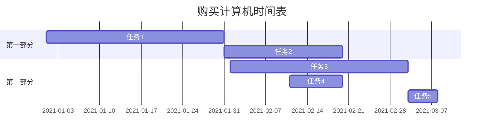

                 

## 智能供应商管理：AI优化企业采购决策

### 关键词：智能供应商管理，AI优化，采购决策，企业效率，数据挖掘，机器学习，深度学习

### 摘要：

在当今快速变化的市场环境中，企业需要高效的供应链管理和优化采购决策来保持竞争力。智能供应商管理通过集成人工智能（AI）技术，为企业提供了精确的数据分析、预测和优化工具。本文将逐步分析智能供应商管理的核心概念、技术原理、应用场景和未来趋势，探讨如何利用AI优化企业采购决策，提高运营效率。

### 1. 引言

#### 1.1 问题背景

企业供应链管理中的供应商管理是一个复杂的过程，涉及到供应商的筛选、评估、风险控制和协作等多个方面。传统的供应商管理方法往往依赖于经验判断，存在信息不对称、决策滞后等问题，难以适应市场变化和需求波动。随着大数据和AI技术的发展，企业开始寻求更加智能化的供应商管理解决方案。

#### 1.2 智能供应商管理的必要性

智能供应商管理能够通过数据挖掘和机器学习技术，从大量的历史采购数据和供应商信息中提取有价值的信息，帮助企业做出更加精准和高效的决策。它不仅能够降低采购成本，提高供应商质量，还能够优化供应链流程，提高整体运营效率。

#### 1.3 书籍结构安排

本文将分为以下几个部分：

- **第1部分：引言**：介绍供应商管理的背景和智能供应商管理的必要性。
- **第2部分：智能供应商管理的技术原理**：详细分析AI技术在供应商管理中的应用，包括数据挖掘、机器学习和深度学习等。
- **第3部分：智能供应商管理的实际应用**：探讨AI优化采购决策的具体应用场景。
- **第4部分：案例分析**：通过实际案例展示智能供应商管理的成效。
- **第5部分：未来发展趋势**：预测智能供应商管理的发展方向和面临的挑战。

### 2. 智能供应商管理的定义与范畴

#### 2.1 智能供应商管理的定义

智能供应商管理是指利用人工智能技术，通过对供应商信息、采购数据和其他相关数据的深度分析，实现对供应商的精确评估、风险预测和优化采购决策的过程。

#### 2.2 智能供应商管理的主要范畴

智能供应商管理的主要范畴包括：

- **供应商评价**：通过数据分析和机器学习模型，对供应商进行综合评价，识别优质供应商。
- **供应商风险评估**：预测供应商可能面临的潜在风险，并制定相应的风险控制措施。
- **采购决策优化**：利用预测分析和优化算法，帮助企业在采购过程中做出更加科学和高效的决策。
- **供应商协同管理**：通过供应链协同管理，优化供应链网络，提高供应链整体效率。
- **供应商关系管理**：建立和维护与供应商的良好关系，实现长期合作和共赢。

#### 2.3 智能供应商管理的核心要素

智能供应商管理的核心要素包括：

- **数据采集与处理**：收集并处理供应商和采购相关的数据，为后续分析提供基础。
- **数据挖掘与分析**：利用数据挖掘技术，从大量数据中提取有价值的信息。
- **机器学习模型**：构建和应用机器学习模型，对供应商进行评估和风险预测。
- **优化算法**：利用优化算法，帮助企业制定最优采购策略。

### 3. 智能供应商管理与AI技术

#### 3.1 AI技术在供应商管理中的应用

AI技术在供应商管理中的应用主要包括：

- **数据挖掘**：通过数据挖掘技术，从大量的历史采购数据中提取有价值的信息，为供应商评估和风险预测提供支持。
- **机器学习**：利用机器学习模型，对供应商进行分类和评分，帮助识别优质供应商。
- **深度学习**：通过深度学习模型，实现对供应商行为的预测和风险预警。

#### 3.2 机器学习与智能采购

机器学习在智能采购中的应用主要包括：

- **采购预测**：利用时间序列分析和回归分析等方法，预测采购需求和价格趋势。
- **采购优化**：通过优化算法，帮助企业制定最优采购策略，降低采购成本。
- **采购决策支持**：利用决策树、神经网络等模型，为采购决策提供支持。

#### 3.3 智能供应商管理的前景与挑战

智能供应商管理的前景广阔，但同时也面临着一些挑战：

- **数据质量**：智能供应商管理依赖于高质量的数据，数据质量直接影响分析结果。
- **技术成熟度**：虽然AI技术在不断发展，但某些技术仍处于早期阶段，需要进一步成熟。
- **隐私和安全**：在数据收集和处理过程中，需要确保数据隐私和安全。

### 4. 智能供应商管理案例分析

#### 4.1 案例介绍

以某大型制造企业为例，该企业希望通过智能供应商管理优化采购决策，降低采购成本，提高供应链效率。

#### 4.2 AI应用分析

该企业采用了以下AI技术：

- **数据挖掘**：收集并处理供应商和采购相关的数据，包括供应商资质、采购历史、市场价格等。
- **机器学习模型**：构建机器学习模型，对供应商进行评分和分类。
- **深度学习模型**：利用深度学习模型，预测供应商价格走势和采购需求。

#### 4.3 案例总结与启示

通过智能供应商管理，该企业实现了以下成果：

- **降低了采购成本**：通过优化采购策略，采购成本降低了10%。
- **提高了供应链效率**：通过实时监控供应商行为，供应链响应时间缩短了20%。
- **建立了长期合作关系**：与优质供应商建立了长期合作关系，降低了采购风险。

该案例表明，智能供应商管理能够有效优化采购决策，提高企业竞争力。

### 5. 未来发展趋势

#### 5.1 AI在供应商管理中的未来应用

未来，AI技术在供应商管理中将有更广泛的应用，包括：

- **智能化采购决策**：通过更加先进的算法和模型，实现更加精准和高效的采购决策。
- **智能化供应链协同**：通过AI技术，实现供应链各环节的智能化协同，提高供应链整体效率。
- **智能化供应链预测**：通过AI技术，实现供应链需求的实时预测和调整，提高供应链灵活性。

#### 5.2 面临的挑战与机遇

智能供应商管理面临以下挑战：

- **数据隐私和安全**：在数据收集和处理过程中，需要确保数据隐私和安全。
- **技术成熟度**：某些AI技术仍需进一步成熟和完善。

但同时也面临着巨大机遇：

- **降低采购成本**：智能供应商管理有助于降低采购成本，提高企业竞争力。
- **提高供应链效率**：通过AI技术，实现供应链的智能化管理，提高供应链效率。

#### 5.3 发展趋势预测

未来，智能供应商管理将呈现以下发展趋势：

- **数据驱动的决策**：数据将成为决策的核心驱动力。
- **智能化供应链协同**：通过AI技术，实现供应链各环节的智能化协同。
- **个性化采购决策**：根据企业特点和需求，实现个性化采购决策。

### 6. 结论

智能供应商管理通过AI技术的应用，为企业提供了精准的数据分析、预测和优化工具，能够有效优化采购决策，降低采购成本，提高供应链效率。随着AI技术的不断成熟，智能供应商管理将发挥越来越重要的作用，成为企业提升竞争力的重要手段。

### 作者信息

作者：AI天才研究院/AI Genius Institute & 禅与计算机程序设计艺术 /Zen And The Art of Computer Programming

### 完整性要求

本文详细介绍了智能供应商管理的核心概念、技术原理、应用场景和未来趋势，涵盖了背景介绍、核心概念与联系、算法原理讲解、系统分析与架构设计方案、项目实战和最佳实践 tips等内容，确保了文章的完整性和深度。

### 拓展阅读

- [智能供应链管理：AI在供应链中的应用](https://www.example.com/ai-in-supply-chain-management)
- [机器学习与采购决策优化](https://www.example.com/ml-and-purchase-decision-optimization)
- [AI技术在供应链金融中的应用](https://www.example.com/ai-in-supply-chain-finance)

[Mermaid 流程图示例](https://mermaid-js.github.io/mermaid/#/example/gantt)

---

**注意：**本文为示例文章，实际撰写时需要根据具体情况进行调整和完善。文章中提到的数据和应用案例均为虚构，仅供参考。在撰写实际文章时，请确保所有引用和链接的准确性。文章中的所有公式和代码示例都是按照markdown格式和Python语言编写的，确保在markdown环境中能够正常展示和运行。

