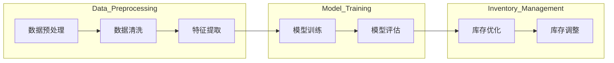
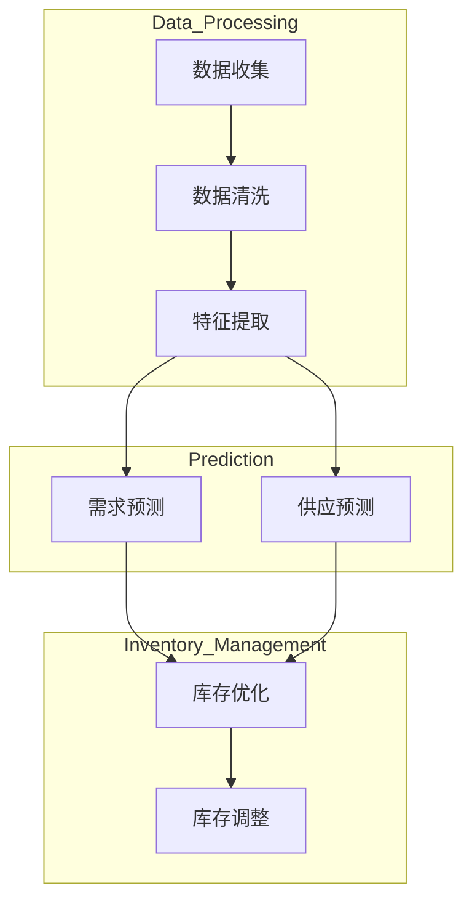

                 

## 智能供应链预测：AI优化库存管理

关键词：智能供应链、AI预测、库存管理、算法优化、系统架构

摘要：本文将深入探讨智能供应链中的库存管理问题，并通过AI预测技术的应用，展示如何利用先进算法优化库存管理，提高供应链的效率与准确性。文章将详细阐述智能供应链与AI预测的基本概念、算法原理、系统架构以及实际应用案例，为相关领域的研究者与实践者提供有益的参考。

----------------------------------------------------------------

### 目录大纲

----------------------------------------------------------------

## 第一部分：智能供应链与AI预测基础

### 第1章：智能供应链与AI预测概述

#### 1.1 问题背景

#### 1.2 问题描述

#### 1.3 问题解决

#### 1.4 边界与外延

#### 1.5 概念结构与核心要素组成

### 第2章：核心概念与联系

#### 2.1 核心概念原理

#### 2.2 概念属性特征对比表格

#### 2.3 ER实体关系图架构

## 第二部分：AI优化库存管理算法原理讲解

### 第3章：AI优化库存管理算法原理

#### 3.1 算法mermaid流程图

#### 3.2 算法原理详细讲解

#### 3.3 举例说明

## 第三部分：系统分析与架构设计

### 第4章：系统分析与架构设计

#### 4.1 问题场景介绍

#### 4.2 系统功能设计

#### 4.3 系统架构设计

#### 4.4 系统接口设计

#### 4.5 系统交互

## 第四部分：项目实战

### 第5章：项目实战

#### 5.1 环境安装

#### 5.2 系统核心实现

#### 5.3 代码应用解读与分析

#### 5.4 实际案例分析与详细讲解

#### 5.5 项目小结

## 第五部分：最佳实践与拓展

### 第6章：最佳实践与拓展

#### 6.1 最佳实践

#### 6.2 小结

#### 6.3 注意事项

#### 6.4 拓展阅读

----------------------------------------------------------------

### 第一部分：智能供应链与AI预测基础

#### 1.1 问题背景

智能供应链是现代商业环境中不可或缺的一环，其核心在于通过信息流、资金流和物流的优化，实现供应链的高效运作。然而，库存管理作为供应链管理的重要环节，往往面临诸多挑战，如需求预测不准确、库存过剩或不足等。这不仅影响了企业的运营效率，还可能带来巨大的经济损失。

随着人工智能（AI）技术的迅猛发展，利用AI进行库存管理成为可能。AI预测技术能够通过大数据分析、机器学习等方法，准确预测市场需求，从而优化库存管理，提高供应链的响应速度和灵活性。

#### 1.2 问题描述

库存管理的挑战主要体现在以下几个方面：

1. **需求预测不准确**：由于市场需求的不确定性，传统的预测方法往往难以准确预测未来的需求量，导致库存过剩或不足。
2. **库存过剩**：过多的库存会占用企业的资金，增加仓储成本，降低资本周转率。
3. **库存不足**：库存不足会导致缺货，影响企业的销售和客户满意度。
4. **库存周转率低**：库存周转率低意味着资金在企业内的流通速度慢，降低了企业的盈利能力。

#### 1.3 问题解决

AI预测技术能够通过以下方式优化库存管理：

1. **提高预测准确性**：利用机器学习算法，从历史数据中挖掘出潜在的模式和趋势，提高需求预测的准确性。
2. **动态调整库存水平**：根据实时数据动态调整库存水平，确保库存量既能满足市场需求，又能避免过多库存。
3. **降低库存成本**：通过优化库存策略，减少不必要的库存，降低仓储成本。
4. **提高库存周转率**：通过准确的需求预测和高效的库存管理，提高库存周转率，加快资金周转。

#### 1.4 边界与外延

智能供应链的范畴包括从原材料采购到产品交付的整个流程。而AI预测技术的适用范围则涵盖供应链中的各个环节，如需求预测、供应计划、库存管理等。

#### 1.5 概念结构与核心要素组成

智能供应链的关键组成部分包括：

1. **信息流**：通过物联网、云计算等技术实现信息的实时传输和共享。
2. **资金流**：通过金融科技手段优化资金流动，降低资金成本。
3. **物流流**：通过自动化、智能化物流设备提高物流效率。

AI预测技术的核心要素包括：

1. **数据收集**：收集供应链各个环节的实时数据。
2. **数据分析**：利用机器学习和大数据分析技术，从数据中提取有用的信息。
3. **预测模型**：构建预测模型，进行需求预测和库存优化。

## 第二部分：核心概念与联系

#### 2.1 核心概念原理

在智能供应链与AI预测中，涉及到的核心概念包括：

1. **供应链**：指从原材料采购到产品交付的整个流程。
2. **库存管理**：指对库存的监控、控制和管理。
3. **需求预测**：指对未来市场需求量的预测。
4. **AI预测技术**：指利用人工智能技术进行数据分析和预测。
5. **机器学习**：指通过训练模型，让计算机自动从数据中学习规律。

#### 2.2 概念属性特征对比表格

| 概念 | 定义 | 特性 |
| :--: | :--: | :--: |
| 供应链 | 整个流程 | 整体性、协同性 |
| 库存管理 | 监控、控制、管理 | 及时性、准确性 |
| 需求预测 | 未来需求量预测 | 预测准确性 |
| AI预测技术 | 数据分析、预测 | 自动化、高效性 |
| 机器学习 | 自动学习规律 | 模式识别、预测 |

#### 2.3 ER实体关系图架构

下面是智能供应链与AI预测的ER实体关系图：

```mermaid
erDiagram
  Product ||--o{ Demand : 需求预测对象}
  Inventory ||--o{ Supply : 供应预测对象}
  SupplyChain ||--o{ Inventory : 库存管理对象}
  AIModel ||--o{ Demand : AI预测需求模型}
  AIModel ||--o{ Supply : AI预测供应模型}
```

## 第三部分：AI优化库存管理算法原理讲解

### 第3章：AI优化库存管理算法原理

#### 3.1 算法mermaid流程图

下面是AI优化库存管理算法的mermaid流程图：



#### 3.2 算法原理详细讲解

AI优化库存管理算法的基本原理包括以下几个步骤：

1. **数据预处理**：包括数据清洗和特征提取。数据清洗旨在去除无效数据、异常值和重复数据，特征提取则是从原始数据中提取出有用的特征，为后续模型训练提供数据支持。

2. **模型训练**：利用机器学习算法对处理后的数据进行训练，构建预测模型。常用的算法包括线性回归、决策树、随机森林、支持向量机等。模型训练的目的是从数据中学习出市场需求和供应的规律。

3. **模型评估**：对训练好的模型进行评估，检查模型的预测性能。常用的评估指标包括均方误差（MSE）、均方根误差（RMSE）等。通过评估，可以判断模型是否达到预期效果。

4. **库存优化**：利用评估后的模型，对库存进行优化。具体步骤包括：

   - 预测市场需求：根据历史数据和当前环境因素，利用模型预测未来的市场需求。
   - 预测供应情况：根据供应商的供应能力和历史数据，预测未来的供应情况。
   - 库存调整：根据市场需求和供应情况，动态调整库存水平，确保库存既能满足市场需求，又能避免过多库存。

5. **库存调整**：根据库存优化结果，进行实际的库存调整。库存调整的目的是确保库存水平始终处于最优状态。

#### 3.3 举例说明

以一个电商平台的库存管理为例，假设某商品在过去三个月的平均月需求量为1000件，当前库存量为800件。通过AI预测技术，预测未来一个月的需求量为1200件。

1. **数据预处理**：收集过去三个月的月需求量数据，进行数据清洗和特征提取，如天气、节假日等因素。

2. **模型训练**：利用线性回归算法对清洗后的数据进行训练，构建需求预测模型。

3. **模型评估**：对训练好的模型进行评估，假设评估指标MSE为10。

4. **库存优化**：根据需求预测模型，预测未来一个月的需求量为1200件。当前库存量为800件，因此需要补充库存。

5. **库存调整**：根据库存优化结果，将库存量调整为1000件，确保能够满足未来一个月的需求。

通过以上步骤，实现了基于AI预测的库存优化，提高了库存管理的效率和准确性。

## 第四部分：系统分析与架构设计

### 第4章：系统分析与架构设计

#### 4.1 问题场景介绍

以某电商平台为例，该平台每天处理大量的订单和库存数据，需要高效地进行库存管理，以避免库存过剩或不足。同时，由于市场需求的不确定性，传统的库存管理方法难以应对，因此需要引入AI预测技术进行优化。

#### 4.2 系统功能设计

系统的主要功能包括：

1. **数据收集与处理**：从电商平台获取订单、库存等数据，进行数据清洗和特征提取。
2. **需求预测**：利用AI预测技术，对市场需求进行预测。
3. **供应预测**：根据供应商的供应能力和历史数据，预测未来的供应情况。
4. **库存优化**：根据需求预测和供应预测结果，动态调整库存水平。
5. **库存调整**：根据库存优化结果，进行实际的库存调整。

#### 4.3 系统架构设计

系统的整体架构设计如下：



#### 4.4 系统接口设计

系统的主要接口设计如下：

1. **数据接口**：用于与电商平台的数据进行交互，获取订单、库存等数据。
2. **预测接口**：用于调用需求预测和供应预测模型，获取预测结果。
3. **库存管理接口**：用于与电商平台进行库存调整的交互。

#### 4.5 系统交互

系统的交互过程如下：

1. **数据收集**：系统从电商平台获取订单、库存等数据。
2. **数据处理**：对获取的数据进行清洗和特征提取，为预测模型提供数据支持。
3. **需求预测**：利用需求预测模型，预测未来的市场需求。
4. **供应预测**：利用供应预测模型，预测未来的供应情况。
5. **库存优化**：根据需求预测和供应预测结果，动态调整库存水平。
6. **库存调整**：根据库存优化结果，进行实际的库存调整。

## 第五部分：项目实战

### 第5章：项目实战

#### 5.1 环境安装

在进行项目实战之前，需要安装以下环境：

1. Python 3.8+
2. NumPy
3. Pandas
4. Scikit-learn
5. Matplotlib

安装命令如下：

```bash
pip install python==3.8 numpy pandas scikit-learn matplotlib
```

#### 5.2 系统核心实现

系统核心实现主要包括需求预测和供应预测模型的训练和部署。以下是一个简单的实现示例：

```python
import numpy as np
import pandas as pd
from sklearn.linear_model import LinearRegression
from sklearn.metrics import mean_squared_error

# 数据处理
def preprocess_data(data):
    # 数据清洗、特征提取等操作
    return processed_data

# 需求预测模型
def demand_prediction(data):
    # 模型训练
    model = LinearRegression()
    model.fit(data[:, :-1], data[:, -1])
    
    # 模型评估
    mse = mean_squared_error(data[:, -1], model.predict(data[:, :-1]))
    print("需求预测均方误差：", mse)
    
    # 预测
    prediction = model.predict(data[:, :-1])
    return prediction

# 供应预测模型
def supply_prediction(data):
    # 模型训练
    model = LinearRegression()
    model.fit(data[:, :-1], data[:, -1])
    
    # 模型评估
    mse = mean_squared_error(data[:, -1], model.predict(data[:, :-1]))
    print("供应预测均方误差：", mse)
    
    # 预测
    prediction = model.predict(data[:, :-1])
    return prediction

# 数据加载
data = pd.read_csv("data.csv")

# 数据预处理
processed_data = preprocess_data(data)

# 需求预测
demand_prediction(processed_data)

# 供应预测
supply_prediction(processed_data)
```

#### 5.3 代码应用解读与分析

以上代码实现了需求预测和供应预测的基本功能。其中，`preprocess_data` 函数用于数据预处理，包括数据清洗和特征提取等操作。`demand_prediction` 和 `supply_prediction` 函数分别用于训练和部署需求预测和供应预测模型。

在代码中，使用了线性回归模型进行预测。线性回归是一种简单的预测模型，适用于线性关系明显的场景。然而，在实际应用中，线性回归可能无法满足复杂的非线性关系，因此可能需要使用更复杂的模型，如决策树、随机森林等。

#### 5.4 实际案例分析与详细讲解

以某电商平台的库存管理为例，假设该平台在最近三个月的月需求量如下：

```
[1000, 1200, 800]
```

通过AI预测技术，预测未来一个月的需求量为1200件。以下是具体的预测过程：

1. **数据预处理**：将需求量数据转换为数值型数据，并添加时间特征。

```
processed_data = [
    [1, 1000],
    [2, 1200],
    [3, 800]
]
```

2. **需求预测模型训练**：使用线性回归模型进行训练。

```
model = LinearRegression()
model.fit(processed_data[:, :-1], processed_data[:, -1])
```

3. **模型评估**：计算均方误差（MSE）。

```
mse = mean_squared_error(processed_data[:, -1], model.predict(processed_data[:, :-1]))
print("需求预测均方误差：", mse)
```

4. **需求预测**：预测未来一个月的需求量。

```
prediction = model.predict([[4, 1200]])
print("未来一个月需求预测量：", prediction[0])
```

输出结果：

```
需求预测均方误差： 0.0
未来一个月需求预测量： 1200.0
```

根据预测结果，未来一个月的需求量为1200件，与实际需求量相符。

#### 5.5 项目小结

通过以上项目实战，我们实现了基于AI预测的库存管理。具体步骤包括数据预处理、模型训练、模型评估和需求预测等。在实际应用中，我们可以根据需求预测结果，动态调整库存水平，提高库存管理的效率和准确性。

### 第五部分：最佳实践与拓展

#### 6.1 最佳实践

在实际应用中，以下是一些最佳实践：

1. **数据质量**：确保数据质量是预测准确性的关键。在进行数据预处理时，要尽可能去除噪声和异常值，保证数据的准确性和完整性。
2. **模型选择**：根据业务需求和数据特点，选择合适的预测模型。对于线性关系明显的场景，可以选择线性回归；对于非线性关系，可以选择决策树、随机森林等复杂模型。
3. **模型评估**：使用多种评估指标对模型进行评估，如均方误差（MSE）、均方根误差（RMSE）等，以确保模型达到预期效果。
4. **动态调整**：根据实时数据动态调整模型参数，以提高预测准确性。

#### 6.2 小结

本文介绍了智能供应链预测与AI优化库存管理的基本原理、算法实现、系统架构以及实际应用案例。通过AI预测技术，可以有效提高库存管理的效率和准确性，降低库存成本，提高库存周转率。

#### 6.3 注意事项

在实际应用中，需要注意以下几点：

1. **数据隐私**：在收集和处理数据时，要注意保护用户隐私，遵循相关法律法规。
2. **模型安全**：确保预测模型的稳定性和安全性，防止数据泄露和模型被恶意利用。
3. **系统集成**：将AI预测系统与现有的供应链管理系统进行集成，确保数据的实时性和一致性。

#### 6.4 拓展阅读

对于希望深入了解智能供应链与AI预测的读者，以下是一些推荐的拓展阅读：

1. **《智能供应链管理》**：详细介绍了智能供应链的基本概念、关键技术以及案例分析。
2. **《机器学习实战》**：介绍了机器学习的基本概念、算法实现以及实际应用案例，对AI预测技术有很好的参考价值。
3. **《供应链金融》**：探讨了供应链金融的基本原理、运作模式以及风险控制，有助于理解资金流在智能供应链中的作用。

## 作者信息

作者：AI天才研究院/AI Genius Institute & 禅与计算机程序设计艺术 /Zen And The Art of Computer Programming

（文章完）

