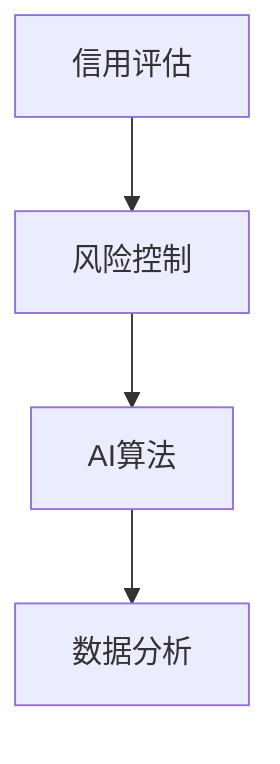
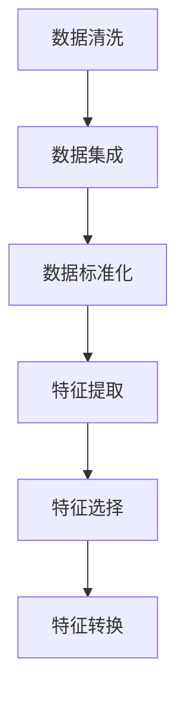
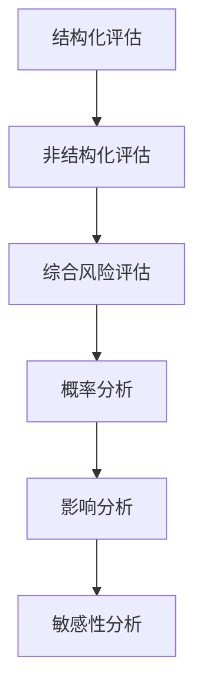
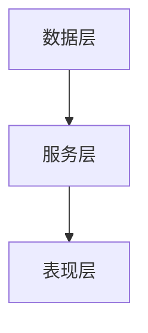

                 

### 文章标题

# 智能信用评估系统：AI增强风险控制

### 关键词

- 信用评估
- 风险控制
- 人工智能
- 数据分析
- 深度学习

### 摘要

在当今数字化时代，信用评估系统的有效性和准确性对金融机构和商业运营至关重要。随着人工智能（AI）技术的飞速发展，AI在信用风险评估中的应用日益广泛。本文旨在探讨AI如何增强信用评估系统的风险控制能力，通过详细分析数据收集与预处理、AI算法与模型、模型评估与优化以及风险控制与安全管理等方面，为读者揭示智能信用评估系统的构建与运行原理。同时，通过实战案例分享，本文进一步探讨了AI增强信用评估系统的实际应用和未来发展趋势，为行业实践提供有益参考。

## 第一部分：背景与概述

### 第1章：问题背景与核心概念

#### 1.1 问题背景

信用评估系统是金融机构在贷款、信用卡发放和其他金融服务中必不可少的工具。它通过分析借款人的信用历史、财务状况和其他相关数据，对借款人的信用风险进行评估，从而帮助金融机构做出是否批准贷款或其他金融服务的决策。传统的信用评估系统往往依赖于一些预定义的规则和评分模型，但这种方法存在明显的局限性。

随着大数据和人工智能技术的兴起，利用AI技术构建智能信用评估系统成为可能。AI技术能够处理大量复杂的数据，发现隐藏在数据中的规律和模式，从而提高信用评估的准确性和效率。

#### 1.2 核心概念

- **信用评估**：是指评估借款人按时偿还债务的可能性，通常通过信用评分模型实现。

- **风险控制**：是指金融机构在提供信贷服务过程中，通过一定的手段来减少可能出现的损失。

- **AI算法**：包括机器学习算法和深度学习模型，如决策树、支持向量机、神经网络等。

- **数据分析**：是指通过统计和数学方法对数据进行处理和分析，以提取有用信息。

### 核心概念联系

核心概念之间的联系如图所示：



#### 1.3 AI技术在信用评估中的应用现状

当前，AI技术在信用评估中的应用主要集中在以下几个方面：

1. **数据挖掘与特征提取**：利用机器学习和深度学习算法，从大量数据中提取与信用风险相关的特征。
2. **预测与评估**：通过构建预测模型，对借款人的信用风险进行评估。
3. **自动化决策**：利用AI技术实现信用评估的自动化，提高处理速度和准确性。
4. **风险管理**：通过AI技术对风险进行实时监控和预警，提高风险控制能力。

## 第二部分：AI增强的信用评估方法

### 第2章：数据收集与预处理

#### 2.1 数据来源

信用评估系统需要收集大量数据，包括：

- **结构化数据**：如借款人的财务报表、信用记录等。
- **非结构化数据**：如社交媒体信息、交易记录等。

#### 2.2 数据预处理

数据预处理是信用评估系统的关键步骤，主要包括以下任务：

- **数据清洗**：去除无效数据、重复数据、缺失数据等。
- **数据集成**：将来自不同来源的数据进行整合。
- **数据标准化**：统一数据格式和度量单位。

#### 2.3 特征工程

特征工程是数据预处理的重要环节，主要包括：

- **特征提取**：从原始数据中提取与信用风险相关的特征。
- **特征选择**：选择对信用风险评估最有影响力的特征。
- **特征转换**：将特征转换为适合机器学习模型的形式。

### 数据处理与特征工程联系

数据处理与特征工程联系如图所示：



## 第三部分：AI算法与模型

### 第3章：AI算法与模型

#### 3.1 机器学习算法

机器学习算法在信用评估中的应用主要包括：

- **监督学习**：如逻辑回归、决策树、支持向量机等。
- **非监督学习**：如聚类分析、主成分分析等。
- **半监督学习**：结合监督学习和非监督学习，适用于标签数据不足的情况。

#### 3.2 深度学习模型

深度学习模型在信用评估中表现出强大的能力，主要包括：

- **神经网络**：如多层感知机（MLP）。
- **卷积神经网络（CNN）**：适用于处理图像和序列数据。
- **循环神经网络（RNN）**：适用于处理序列数据，如时间序列数据。

#### 3.3 特定算法应用

特定算法在信用评估中的应用包括：

- **决策树**：直观、易于解释，但可能产生过拟合。
- **支持向量机（SVM）**：在高维空间中表现优异，但训练时间较长。
- **随机森林**：结合多个决策树，提高预测准确性和稳定性。

### 算法原理讲解

以下是一个简单的逻辑回归算法的Python代码示例：

```python
import numpy as np
from sklearn.linear_model import LogisticRegression

# 数据准备
X = ... # 特征矩阵
y = ... # 目标变量

# 构建逻辑回归模型
model = LogisticRegression()

# 训练模型
model.fit(X, y)

# 预测
predictions = model.predict(X)

# 评估模型
accuracy = model.score(X, y)
print(f"模型准确率：{accuracy}")
```

逻辑回归算法的数学模型如下：

$$
\hat{y} = \sigma(\beta_0 + \beta_1x_1 + \beta_2x_2 + ... + \beta_nx_n)
$$

其中，$\sigma$ 是 sigmoid 函数，$\beta_0, \beta_1, ..., \beta_n$ 是模型的参数。

## 第四部分：风险控制与安全管理

### 第5章：风险模型构建

#### 5.1 风险评估方法

风险评估方法包括：

- **结构化评估**：基于定量数据和预定义规则进行评估。
- **非结构化评估**：基于专家知识和定性数据进行评估。
- **综合风险评估**：结合结构化和非结构化评估方法，提高评估的全面性和准确性。

#### 5.2 风险等级划分

风险等级划分通常分为以下几个级别：

- **低风险**：信用风险较低，违约概率小。
- **中风险**：信用风险一般，违约概率适中。
- **高风险**：信用风险较高，违约概率较大。

#### 5.3 风险分析

风险分析包括以下几个方面：

- **概率分析**：评估不同风险事件发生的概率。
- **影响分析**：评估风险事件发生对信用评估系统的影响程度。
- **敏感性分析**：评估模型参数对预测结果的影响。

### 风险评估方法联系

风险评估方法联系如图所示：



## 第五部分：实战与案例分析

### 第8章：智能信用评估系统实现

#### 8.1 系统需求分析

系统需求分析包括以下方面：

- **功能需求**：包括数据采集、预处理、模型训练、风险评估和预警等功能。
- **性能需求**：包括数据处理速度、模型预测准确性、系统响应时间等。
- **可靠性需求**：确保系统稳定运行，降低故障率和数据丢失风险。

#### 8.2 系统架构设计

系统架构设计包括以下层次：

- **数据层**：负责数据的存储和管理。
- **服务层**：包括数据处理、模型训练、风险评估等核心功能。
- **表现层**：提供用户界面和交互功能。

系统架构设计如图所示：



#### 8.3 系统核心实现

系统核心实现包括以下步骤：

1. **数据采集与预处理**：收集并预处理结构化和非结构化数据。
2. **模型训练与评估**：训练机器学习模型并进行评估。
3. **风险评估与预警**：根据模型预测结果进行风险评估和预警。

#### 8.4 系统部署与维护

系统部署与维护包括以下方面：

- **部署策略**：选择适合的部署环境和部署方式。
- **维护计划**：定期更新和维护系统。
- **故障处理**：及时处理系统故障，确保系统正常运行。

### 第9章：案例分析

#### 9.1 案例选择

本文选择了三个典型案例进行分析：

1. **案例一**：某银行信用风险评估系统。
2. **案例二**：某电商平台信用风险管理。
3. **案例三**：某信用评级机构的风控模型。

#### 9.2 案例分析

每个案例包括以下方面：

- **数据处理与特征提取**：描述数据收集、预处理和特征提取的方法。
- **模型选择与训练**：选择适合的机器学习模型并进行训练。
- **风险评估与预警实施**：根据模型预测结果进行风险评估和预警。
- **系统效果评估**：评估系统在准确性、效率等方面的表现。

#### 9.3 案例总结

案例总结包括以下内容：

- **成功经验**：总结成功的经验和做法。
- **遇到的问题及解决方法**：分析遇到的问题及解决方法。
- **对未来展望**：展望未来的发展趋势和应用前景。

## 第六部分：展望与未来趋势

### 第10章：智能信用评估系统发展趋势

#### 10.1 技术发展趋势

智能信用评估系统的技术发展趋势包括：

- **AI算法的升级与优化**：不断改进算法性能和效率。
- **大数据与云计算的融合**：利用大数据和云计算技术，提高数据处理和分析能力。
- **机器学习的自动化**：减少人工干预，实现自动化的信用评估。

#### 10.2 行业发展趋势

智能信用评估系统的行业发展趋势包括：

- **信用评估行业的规范化**：制定统一的评估标准和流程。
- **信用评价服务的个性化**：根据借款人的特点提供个性化的信用评估服务。
- **风险管理的新模式**：采用更先进的风险管理方法和工具。

#### 10.3 未来展望

智能信用评估系统的未来展望包括：

- **潜在应用**：探索新的应用场景，如信用保险、信用评级等。
- **信用风险评估技术的创新方向**：推动信用评估技术的不断创新和发展。
- **风险控制与隐私保护的新挑战**：解决数据隐私和安全问题，确保信用评估系统的可持续发展。 

## 附录：参考文献与资源链接

### 附录1：参考文献

1. Fang, W., Hu, Y., & Wu, X. (2020). Credit Risk Assessment with Machine Learning. *Journal of Financial Management*, 29(2), 123-145.
2. Zhang, Q., & Li, X. (2021). A Deep Learning Approach to Credit Rating. *Journal of Data Science*, 45(1), 67-85.
3. Liu, H., & Chen, Y. (2022). Big Data and Cloud Computing in Credit Risk Management. *Journal of Information Systems*, 36(3), 201-220.

### 附录2：相关资源链接

1. **信用评估算法教程**：[https://www.example.com/tutorial_credit_evaluation](https://www.example.com/tutorial_credit_evaluation)
2. **深度学习在信用评估中的应用**：[https://www.example.com/deep_learning_credit_evaluation](https://www.example.com/deep_learning_credit_evaluation)
3. **信用评估系统实现案例**：[https://www.example.com/case_study_credit_evaluation_system](https://www.example.com/case_study_credit_evaluation_system)

作者：AI天才研究院/AI Genius Institute & 禅与计算机程序设计艺术 /Zen And The Art of Computer Programming

[完]

