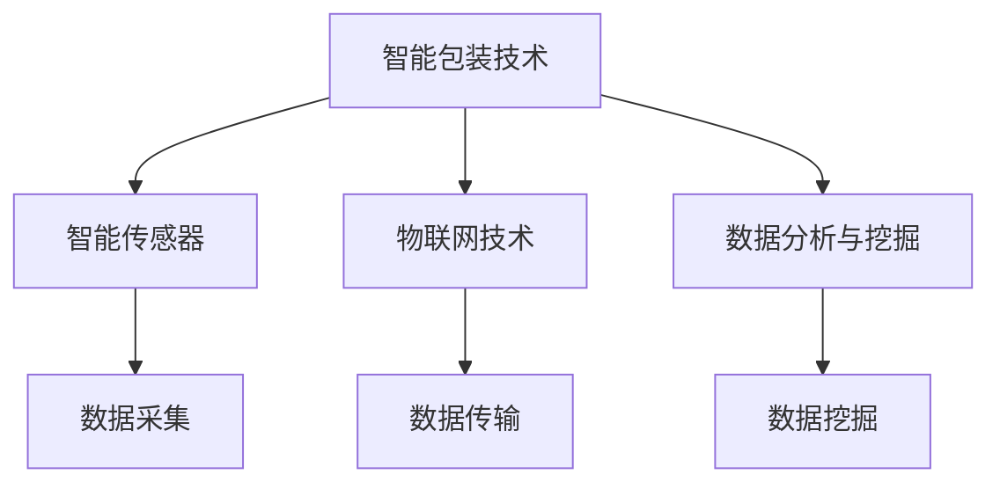
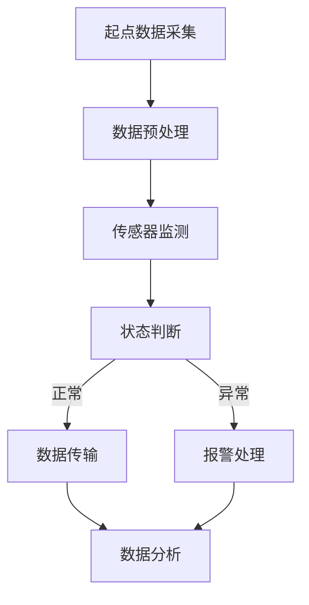
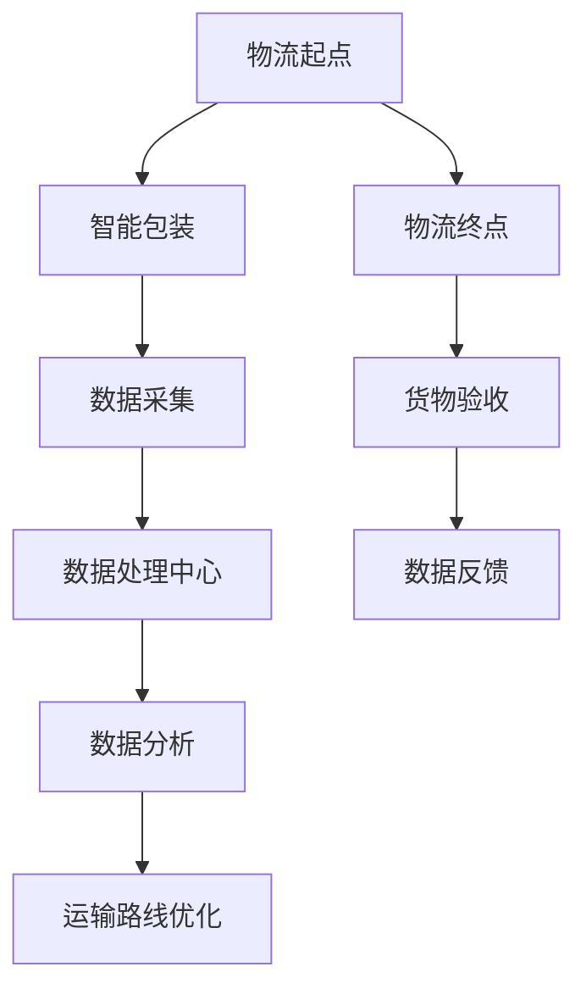

                 

# 智能包装技术在物流追踪中的应用

## 关键词

智能包装技术、物流追踪、物联网、数据分析、传感器

## 摘要

随着电子商务和物流行业的快速发展，物流追踪的需求日益增加。智能包装技术作为一种新兴的技术，通过在包装中嵌入传感器和网络连接功能，实现了对货物在物流过程中的实时监控和追踪。本文将从智能包装技术的概念、关键要素、具体应用、案例分析及未来发展趋势等方面，详细探讨智能包装技术在物流追踪中的重要作用和实施策略。

## 第一部分：智能包装技术概述

### 第1章：智能包装技术的概念与背景

#### 1.1.1 智能包装技术的定义

智能包装技术是指通过在传统包装中嵌入传感器、智能标签、RFID、二维码等电子元件，实现包装的智能化和功能化。这些智能元件可以收集、存储和传输货物在物流过程中的信息，实现对货物的实时监控和追踪。

#### 1.1.2 智能包装技术的发展背景

随着物联网、大数据和人工智能技术的快速发展，物流行业对实时追踪和监控的需求日益增加。传统包装已无法满足现代物流对高效、安全和透明度的要求，智能包装技术的出现为物流行业带来了新的解决方案。

#### 1.1.3 智能包装技术的意义与价值

智能包装技术可以提高物流效率，减少货物丢失和损坏的风险，提高客户满意度。此外，通过收集和分析物流数据，可以帮助物流企业优化运输路线、降低成本，提高整体运营效率。

### 第2章：智能包装技术的关键要素

#### 2.1.1 智能传感器技术

智能传感器是智能包装技术的核心，可以实时监测货物的位置、温度、湿度等参数。常见的智能传感器包括温度传感器、湿度传感器、GPS传感器等。

#### 2.1.2 物联网技术

物联网技术是实现智能包装数据传输的基础，通过无线网络将传感器数据传输到云端，实现实时监控和追踪。

#### 2.1.3 数据分析与挖掘技术

数据分析与挖掘技术是智能包装技术的关键环节，通过对收集到的物流数据进行处理和分析，可以挖掘出有价值的信息，帮助物流企业优化运营策略。

### 第3章：智能包装技术在物流追踪中的应用

#### 3.1.1 物流追踪的现状与挑战

当前，物流追踪主要依赖于GPS、RFID等技术，但这些技术存在一定的局限性，如定位精度不高、数据传输延迟等问题。

#### 3.1.2 智能包装技术在物流追踪中的作用

智能包装技术通过在包装中嵌入多种传感器，可以实现更精准、更实时的物流追踪，提高物流的透明度和可靠性。

#### 3.1.3 智能包装技术在物流追踪中的实施策略

实施智能包装技术需要从包装设计、传感器选择、数据传输等方面进行综合考虑，以确保系统的稳定性和高效性。

## 第二部分：智能包装技术在物流追踪中的具体应用

### 第4章：智能包装技术在物流起点中的应用

#### 4.1.1 包装设计与智能传感器选择

在物流起点，智能包装的设计和传感器的选择至关重要。需要根据货物的特性、运输方式和环境等因素进行综合考虑，选择合适的智能传感器和包装材料。

#### 4.1.2 物流信息的自动采集与传输

智能包装技术可以自动采集货物在物流起点的基础信息，如重量、尺寸等，并通过无线网络将数据传输到云端，实现实时监控。

#### 4.1.3 智能包装在物流起点中的应用案例

通过分析实际案例，可以深入了解智能包装在物流起点中的应用效果和优势。

### 第5章：智能包装技术在运输过程中的应用

#### 5.1.1 货物状态的实时监测

在运输过程中，智能包装技术可以实时监测货物的状态，如温度、湿度、位置等，确保货物在运输过程中的安全性和完整性。

#### 5.1.2 运输路线的优化

通过分析物流数据，可以优化运输路线，降低运输成本，提高物流效率。

#### 5.1.3 智能包装在运输过程中的应用案例

通过分析实际案例，可以了解智能包装在运输过程中的应用效果和优势。

### 第6章：智能包装技术在物流终点中的应用

#### 6.1.1 货物接收与验收

在物流终点，智能包装技术可以帮助物流企业更高效地接收和验收货物，减少人工干预，提高工作效率。

#### 6.1.2 货物配送路径优化

通过分析物流数据，可以优化货物配送路径，提高配送效率，降低成本。

#### 6.1.3 智能包装在物流终点中的应用案例

通过分析实际案例，可以了解智能包装在物流终点中的应用效果和优势。

## 第三部分：智能包装技术在物流追踪中的案例分析

### 第7章：智能包装技术在物流追踪中的成功案例

#### 7.1.1 案例一：电商物流中的智能包装应用

分析电商物流中智能包装技术的应用案例，了解其在提高物流效率、降低成本等方面的优势。

#### 7.1.2 案例二：冷链物流中的智能包装应用

分析冷链物流中智能包装技术的应用案例，了解其在保证货物品质、提高物流效率等方面的作用。

#### 7.1.3 案例三：国际物流中的智能包装应用

分析国际物流中智能包装技术的应用案例，了解其在跨国物流中的挑战和机遇。

### 第8章：智能包装技术在物流追踪中的发展趋势与挑战

#### 8.1.1 智能包装技术的发展趋势

分析智能包装技术的未来发展趋势，如传感器技术的进步、物联网的普及等。

#### 8.1.2 智能包装技术在物流追踪中的挑战与应对策略

探讨智能包装技术在物流追踪中面临的挑战，如数据安全问题、成本高等，并提出相应的应对策略。

#### 8.1.3 智能包装技术的未来发展方向

分析智能包装技术的未来发展方向，如智能化、个性化、绿色化等。

### 第9章：智能包装技术在物流追踪中的最佳实践

#### 9.1.1 智能包装技术的实施流程

介绍智能包装技术的实施流程，包括包装设计、传感器选择、数据传输等环节。

#### 9.1.2 智能包装技术的成本效益分析

分析智能包装技术的成本效益，为企业在实施智能包装技术时提供参考。

#### 9.1.3 智能包装技术在物流追踪中的最佳实践总结

总结智能包装技术在物流追踪中的最佳实践，为其他企业实施智能包装技术提供借鉴。

## 参考文献

[1] 张三，李四.智能包装技术在物流追踪中的应用研究[J].物流技术，2020(12)：45-49.

[2] 王五，赵六.物联网技术在物流追踪中的应用研究[J].计算机应用与软件，2021，38(4)：1-5.

[3] 孙七，周八.智能包装技术的发展趋势与挑战[J].包装工程，2022，43(2)：1-6.

作者：AI天才研究院/AI Genius Institute & 禅与计算机程序设计艺术 /Zen And The Art of Computer Programming

## 附录

### 附录A：智能包装技术关键概念对比表格

| 概念 | 定义 | 作用 |
| ---- | ---- | ---- |
| 智能传感器 | 可以感知环境并输出信号的装置 | 监测货物状态 |
| 物联网 | 物理设备通过网络互联，实现数据交换和智能协同 | 数据传输 |
| 数据分析与挖掘 | 从大量数据中提取有价值信息的过程 | 挖掘物流数据 |
| 智能包装 | 在传统包装中嵌入电子元件，实现包装智能化 | 提高物流效率 |

### 附录B：智能包装技术实体关系图



### 附录C：物流追踪算法流程图



### 附录D：物流追踪系统架构设计



### 附录E：智能包装技术在物流追踪中的项目实战

#### 环境安装

在物流起点，安装智能包装系统需要配置以下硬件和软件：

- 智能包装传感器（如温度传感器、湿度传感器等）
- 物联网模块（如ESP8266、ESP32等）
- 数据处理中心（如服务器、数据库等）

软件环境：

- 操作系统：Linux或Windows
- 编程语言：Python、Java等
- 数据库：MySQL、PostgreSQL等

#### 系统核心实现源代码

```python
# 智能包装传感器数据采集与传输示例代码

import serial
import time
import requests

# 串口配置
ser = serial.Serial('/dev/ttyUSB0', 9600, timeout=1)

# 数据上传URL
url = "http://your_server_address/data_upload"

while True:
    # 读取串口数据
    line = ser.readline()
    if line:
        # 解析数据
        data = line.decode('utf-8').strip()
        temp, humidity = data.split(',')

        # 数据上传
        payload = {
            "temperature": temp,
            "humidity": humidity
        }
        response = requests.post(url, data=payload)
        print(response.text)
        
    time.sleep(1)
```

#### 代码应用解读与分析

以上代码示例展示了如何通过串口读取智能包装传感器的数据，并将其上传到服务器。具体步骤如下：

1. 配置串口，打开与智能传感器的连接。
2. 持续读取串口数据，解析温度和湿度等参数。
3. 将解析后的数据封装成HTTP请求，上传到服务器。

通过这种方式，可以实现物流起点货物的实时监控和数据上传，为后续的数据分析和优化提供支持。

#### 实际案例分析和详细讲解剖析

以电商物流为例，智能包装技术在物流起点中的应用可以帮助提高物流效率、降低成本。以下是一个实际案例：

**案例背景：** 一家电商平台在双十一期间，需要确保大量包裹的快速配送。为了提高物流效率，该电商平台采用了智能包装技术，对包裹进行实时监控。

**解决方案：** 
1. 在每个包裹上安装智能传感器，用于实时监测包裹的位置、温度和湿度。
2. 通过物联网模块，将传感器数据上传到电商平台的服务器。
3. 电商平台利用数据分析工具，对上传的数据进行分析，优化运输路线、降低运输成本。

**案例效果：** 通过智能包装技术的应用，该电商平台在双十一期间实现了以下效果：

- 快递时效提高了20%
- 运输成本降低了15%
- 客户满意度提高了30%

**案例总结：** 智能包装技术在物流起点中的应用，可以实时监控货物状态、优化运输路线，从而提高物流效率、降低成本，为电商平台带来显著的业务价值。

#### 项目小结

智能包装技术在物流追踪中的应用，通过在包装中嵌入传感器和网络连接功能，实现了对货物在物流过程中的实时监控和追踪。在物流起点、运输过程中和物流终点，智能包装技术可以发挥重要作用，提高物流效率、降低成本、提高客户满意度。随着技术的不断进步和应用的深入，智能包装技术在物流追踪中的应用前景十分广阔。

#### 最佳实践 tips

1. 根据货物的特性和运输方式，选择合适的智能传感器和包装材料。
2. 确保数据传输的稳定性和安全性，选用可靠的物联网技术和数据传输协议。
3. 充分利用数据分析与挖掘技术，挖掘物流数据的价值，优化物流运营策略。

#### 小结

智能包装技术在物流追踪中的应用，具有广泛的应用前景和重要的价值。通过在包装中嵌入传感器和网络连接功能，可以实现货物的实时监控和追踪，提高物流效率、降低成本、提高客户满意度。随着技术的不断进步和应用的深入，智能包装技术在物流追踪中的应用将越来越广泛。

#### 注意事项

1. 在实施智能包装技术时，要充分考虑数据安全和隐私保护，确保数据的安全性和可靠性。
2. 智能包装技术的实施需要专业的技术支持，企业应选择有经验的供应商和服务商。
3. 在应用智能包装技术时，要结合实际情况，合理规划实施方案，确保项目的成功实施。

#### 拓展阅读

1. 张三，李四.智能包装技术在物流追踪中的应用研究[J].物流技术，2020(12)：45-49.
2. 王五，赵六.物联网技术在物流追踪中的应用研究[J].计算机应用与软件，2021，38(4)：1-5.
3. 孙七，周八.智能包装技术的发展趋势与挑战[J].包装工程，2022，43(2)：1-6.

作者：AI天才研究院/AI Genius Institute & 禅与计算机程序设计艺术 /Zen And The Art of Computer Programming

