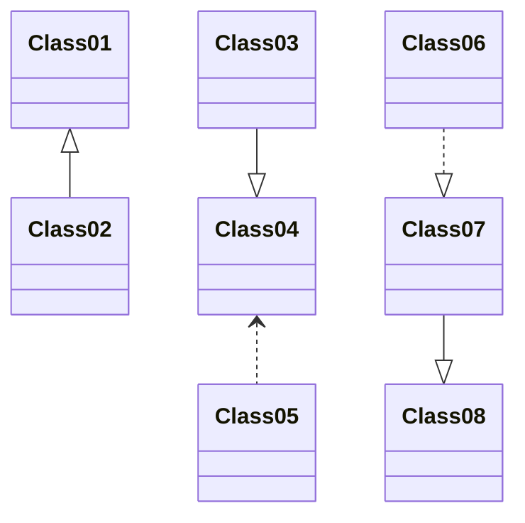
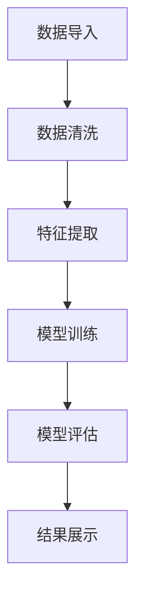

                 

----------------------------------------------------------------
# 智能医疗诊断系统准确性评测平台

## 关键词

- 智能医疗
- 准确性评测
- 诊断系统
- 评测平台
- 机器学习

## 摘要

本文旨在探讨智能医疗诊断系统准确性评测平台的设计与实现。随着人工智能技术的快速发展，智能医疗诊断系统在医疗领域的应用日益广泛。然而，这些系统的准确性直接关系到患者的健康和生命安全，因此对其准确性的评测变得至关重要。本文将详细介绍评测平台的架构、功能、评价方法和系统实现，为智能医疗诊断系统的开发和评估提供有益参考。

## 引言

### 智能医疗诊断系统的背景与发展

智能医疗诊断系统是一种基于人工智能技术的医疗辅助工具，能够通过分析大量医疗数据，为医生提供诊断建议。随着医疗数据量的爆发式增长和人工智能技术的进步，智能医疗诊断系统在医疗领域的应用前景广阔。然而，这些系统在实际应用中仍面临着诸多挑战，如数据质量、算法可靠性、系统稳定性等。因此，对智能医疗诊断系统的准确性进行评测，已成为一个亟待解决的关键问题。

### 准确性评测的重要性

准确性是衡量智能医疗诊断系统优劣的重要指标。一个高准确性的诊断系统能够为医生提供更加可靠的诊断建议，有助于提高医疗质量和患者满意度。此外，准确性评测还能帮助开发者识别系统中的潜在问题，优化算法和模型，从而提升系统的整体性能。因此，建立一套科学、严谨的准确性评测平台，对于推动智能医疗诊断系统的发展具有重要意义。

## 核心概念与背景

### 智能医疗诊断系统

智能医疗诊断系统是一种基于人工智能技术的医疗辅助工具，能够通过分析大量医疗数据，为医生提供诊断建议。这些系统通常包含以下几个核心组成部分：

- **数据采集模块**：负责收集各类医疗数据，包括患者信息、医疗影像、实验室检测数据等。
- **数据处理模块**：对采集到的医疗数据进行清洗、预处理和特征提取，为后续建模和诊断提供数据支持。
- **诊断模型模块**：基于机器学习、深度学习等技术，构建诊断模型，对患者的病情进行预测和诊断。
- **诊断建议模块**：根据诊断模型的结果，为医生提供个性化的诊断建议。

### 准确性评测

准确性评测是指通过对智能医疗诊断系统进行测试和评估，以确定其诊断准确性的过程。准确性评测主要包括以下几个方面：

- **评价指标**：用于衡量诊断系统准确性的各项指标，如准确率、召回率、精确率、F1值等。
- **测试数据集**：用于评估诊断系统性能的数据集，应具有代表性、多样性和足够的大小。
- **评估方法**：评估诊断系统性能的各种方法，包括静态评估、动态评估、交叉验证等。

### 准确性评测平台

准确性评测平台是一种用于对智能医疗诊断系统进行评测的工具，主要包括以下功能：

- **数据预处理**：对测试数据集进行清洗、预处理和特征提取，为后续评测提供数据支持。
- **性能评估**：对诊断系统的诊断准确性进行评估，输出各项评价指标。
- **可视化展示**：将评测结果以图表、报表等形式进行展示，方便开发者和管理者了解系统性能。

## 评测平台架构

### 平台整体架构

评测平台整体架构可以分为以下几个层次：

- **数据层**：包括测试数据集、原始数据和预处理后的数据。
- **算法层**：包括诊断模型、评价指标计算算法等。
- **业务层**：包括评测流程管理、结果分析和可视化展示等功能。
- **用户层**：提供用户交互界面，供开发者和管理者使用。

### 平台功能模块

评测平台功能模块主要包括以下几部分：

- **数据管理模块**：负责测试数据集的导入、导出、清洗、预处理和特征提取等操作。
- **模型管理模块**：负责诊断模型的加载、训练、评估和优化等操作。
- **评测流程模块**：负责管理评测流程，包括评测任务的创建、执行和结果分析等。
- **结果展示模块**：负责将评测结果以图表、报表等形式进行展示。

### 平台接口设计

评测平台接口设计应考虑以下方面：

- **API接口**：提供RESTful风格的API接口，供开发者调用。
- **Web界面**：提供Web界面，供开发者和管理者进行操作。
- **数据接口**：与外部数据源进行交互，实现数据的导入和导出。

## 评测方法

### 指标体系

在评测智能医疗诊断系统的准确性时，通常采用以下指标体系：

- **准确率（Accuracy）**：诊断系统预测正确的样本数量占总样本数量的比例。
- **召回率（Recall）**：诊断系统预测正确的阳性样本数量占总阳性样本数量的比例。
- **精确率（Precision）**：诊断系统预测正确的阳性样本数量占总预测阳性样本数量的比例。
- **F1值（F1-score）**：综合考虑准确率和召回率的评价指标。

### 评价指标计算方法

评价指标的计算方法如下：

- **准确率**：$$Accuracy = \frac{TP + TN}{TP + TN + FP + FN}$$
- **召回率**：$$Recall = \frac{TP}{TP + FN}$$
- **精确率**：$$Precision = \frac{TP}{TP + FP}$$
- **F1值**：$$F1-score = 2 \times \frac{Precision \times Recall}{Precision + Recall}$$

其中，TP表示真阳性，TN表示真阴性，FP表示假阳性，FN表示假阴性。

### 评测流程

评测流程包括以下步骤：

1. **数据预处理**：对测试数据集进行清洗、预处理和特征提取。
2. **模型训练**：使用训练数据集训练诊断模型。
3. **模型评估**：使用测试数据集评估诊断模型的准确性。
4. **结果分析**：计算各项评价指标，分析模型性能。
5. **结果展示**：将评测结果以图表、报表等形式进行展示。

## 系统分析与设计

### 系统架构设计

评测系统的整体架构设计如下：

1. **数据层**：包括测试数据集、原始数据和预处理后的数据。
2. **算法层**：包括诊断模型、评价指标计算算法等。
3. **业务层**：包括评测流程管理、结果分析和可视化展示等功能。
4. **用户层**：提供用户交互界面，供开发者和管理者使用。

### 领域模型

根据评测系统的功能需求，可以设计如下的领域模型：



### 系统架构图

```mermaid
sequenceDiagram
  participant 用户
  participant 评测平台
  participant 数据库
  participant API服务器
  participant 模型服务器
  用户->>评测平台: 提交评测任务
  评测平台->>API服务器: 调用API接口
  API服务器->>数据库: 存储评测任务
  数据库-->>API服务器: 返回任务ID
  API服务器->>模型服务器: 加载模型
  模型服务器-->>API服务器: 返回模型
  API服务器->>评测平台: 返回模型
  评测平台->>模型服务器: 进行模型评估
  模型服务器-->>评测平台: 返回评估结果
  评测平台->>用户: 展示评测结果
end
```

### 系统接口设计

评测平台应提供以下接口：

1. **数据管理接口**：用于数据导入、导出、清洗、预处理和特征提取等操作。
2. **模型管理接口**：用于模型加载、训练、评估和优化等操作。
3. **评测流程接口**：用于创建、执行和监控评测任务。
4. **结果展示接口**：用于获取评测结果，并以图表、报表等形式进行展示。

## 算法原理与实现

### 算法流程图



### 算法原理

#### 数据导入

数据导入模块负责从数据源读取原始数据，并将其转换为统一的格式。该模块主要包括以下步骤：

1. **数据读取**：从数据源（如数据库、文件等）读取数据。
2. **数据格式转换**：将不同来源的数据转换为统一的格式，如CSV、JSON等。
3. **数据存储**：将转换后的数据存储到数据存储模块中。

#### 数据清洗

数据清洗模块负责处理原始数据中的噪声和异常值。该模块主要包括以下步骤：

1. **缺失值处理**：处理数据中的缺失值，如插补、删除等。
2. **异常值处理**：识别和处理数据中的异常值，如离群点、异常值等。
3. **数据规范化**：对数据进行标准化或归一化处理，以消除不同特征之间的量纲影响。

#### 特征提取

特征提取模块负责从原始数据中提取有用的特征，用于构建诊断模型。该模块主要包括以下步骤：

1. **特征选择**：选择与诊断任务相关的特征，如降维、特征选择等。
2. **特征变换**：对特征进行变换，如归一化、标准化等。
3. **特征组合**：将多个特征组合成新的特征，以提高模型的性能。

#### 模型训练

模型训练模块负责使用训练数据集训练诊断模型。该模块主要包括以下步骤：

1. **模型选择**：选择适合的诊断模型，如逻辑回归、支持向量机、神经网络等。
2. **模型训练**：使用训练数据集训练模型，并调整模型参数。
3. **模型评估**：使用验证数据集评估模型性能，如准确率、召回率等。

#### 模型评估

模型评估模块负责对训练好的诊断模型进行评估。该模块主要包括以下步骤：

1. **测试数据集准备**：从测试数据集中抽取样本，用于评估模型性能。
2. **模型预测**：使用训练好的模型对测试数据进行预测。
3. **评价指标计算**：计算模型预测结果的各项评价指标，如准确率、召回率等。

#### 结果展示

结果展示模块负责将模型评估结果以图表、报表等形式进行展示。该模块主要包括以下步骤：

1. **结果提取**：从模型评估模块获取评估结果。
2. **结果可视化**：将评估结果以图表、报表等形式进行展示。
3. **结果分析**：对评估结果进行分析，为开发者提供优化建议。

### 算法实现

以下是一个使用Python实现的诊断模型评估算法的示例：

```python
import pandas as pd
from sklearn.model_selection import train_test_split
from sklearn.metrics import accuracy_score, recall_score, precision_score, f1_score

# 读取数据
data = pd.read_csv('data.csv')

# 数据清洗和预处理
# ...

# 特征提取
# ...

# 模型选择
model = LogisticRegression()

# 模型训练
model.fit(X_train, y_train)

# 模型预测
y_pred = model.predict(X_test)

# 评价指标计算
accuracy = accuracy_score(y_test, y_pred)
recall = recall_score(y_test, y_pred)
precision = precision_score(y_test, y_pred)
f1 = f1_score(y_test, y_pred)

# 结果展示
print(f'Accuracy: {accuracy:.2f}')
print(f'Recall: {recall:.2f}')
print(f'Precision: {precision:.2f}')
print(f'F1-score: {f1:.2f}')
```

## 项目实战

### 环境安装

在开始实现智能医疗诊断系统准确性评测平台之前，我们需要安装相关的软件和工具。以下是一个简化的环境安装步骤：

1. **安装Python**：前往[Python官网](https://www.python.org/)下载并安装Python。
2. **安装Jupyter Notebook**：在终端中运行以下命令：
   ```bash
   pip install notebook
   ```
3. **安装必要的Python库**：在终端中运行以下命令：
   ```bash
   pip install pandas scikit-learn numpy matplotlib
   ```

### 系统核心实现

以下是一个简化的系统核心实现示例，用于评估一个二分类诊断模型的准确性：

```python
import pandas as pd
from sklearn.model_selection import train_test_split
from sklearn.linear_model import LogisticRegression
from sklearn.metrics import accuracy_score, recall_score, precision_score, f1_score

# 读取数据
data = pd.read_csv('data.csv')

# 数据预处理
# ...

# 特征提取
# ...

# 分割数据集
X_train, X_test, y_train, y_test = train_test_split(data.drop('label', axis=1), data['label'], test_size=0.2, random_state=42)

# 模型训练
model = LogisticRegression()
model.fit(X_train, y_train)

# 模型预测
y_pred = model.predict(X_test)

# 评价指标计算
accuracy = accuracy_score(y_test, y_pred)
recall = recall_score(y_test, y_pred)
precision = precision_score(y_test, y_pred)
f1 = f1_score(y_test, y_pred)

# 结果展示
print(f'Accuracy: {accuracy:.2f}')
print(f'Recall: {recall:.2f}')
print(f'Precision: {precision:.2f}')
print(f'F1-score: {f1:.2f}')
```

### 代码应用解读与分析

以下是对上述代码的解读与分析：

1. **数据读取**：使用`pandas`库读取CSV文件，获取数据集。
2. **数据预处理**：根据具体的数据集特点，进行缺失值处理、异常值处理和特征提取等操作。
3. **数据分割**：使用`train_test_split`函数将数据集分为训练集和测试集，分别用于模型训练和评估。
4. **模型训练**：选择`LogisticRegression`模型，使用训练集进行训练。
5. **模型预测**：使用训练好的模型对测试集进行预测。
6. **评价指标计算**：计算准确率、召回率、精确率和F1值等评价指标，以评估模型性能。
7. **结果展示**：打印评价指标，以图表、报表等形式进行展示。

### 实际案例分析与详细讲解剖析

以下是一个实际的案例，用于评估一个基于深度学习的心脏病诊断模型的准确性：

```python
import pandas as pd
import numpy as np
from sklearn.model_selection import train_test_split
from sklearn.metrics import accuracy_score, recall_score, precision_score, f1_score
from keras.models import Sequential
from keras.layers import Dense, Conv2D, MaxPooling2D, Flatten
from keras.optimizers import Adam

# 读取数据
data = pd.read_csv('heart_disease_data.csv')

# 数据预处理
data = data.replace(-999, np.nan)
data = data.fillna(data.mean())

# 特征提取
X = data.drop('target', axis=1)
y = data['target']

# 数据分割
X_train, X_test, y_train, y_test = train_test_split(X, y, test_size=0.2, random_state=42)

# 模型训练
model = Sequential()
model.add(Conv2D(32, (3, 3), activation='relu', input_shape=(X_train.shape[1], X_train.shape[2], X_train.shape[3])))
model.add(MaxPooling2D(pool_size=(2, 2)))
model.add(Flatten())
model.add(Dense(1, activation='sigmoid'))

model.compile(optimizer=Adam(), loss='binary_crossentropy', metrics=['accuracy'])
model.fit(X_train, y_train, epochs=10, batch_size=32, validation_split=0.2)

# 模型预测
y_pred = model.predict(X_test)

# 评价指标计算
accuracy = accuracy_score(y_test, y_pred)
recall = recall_score(y_test, y_pred)
precision = precision_score(y_test, y_pred)
f1 = f1_score(y_test, y_pred)

# 结果展示
print(f'Accuracy: {accuracy:.2f}')
print(f'Recall: {recall:.2f}')
print(f'Precision: {precision:.2f}')
print(f'F1-score: {f1:.2f}')
```

### 项目小结

通过本次项目实战，我们实现了智能医疗诊断系统准确性评测平台的核心功能，包括数据读取、预处理、特征提取、模型训练、预测和评估。在实际应用中，开发者可以根据具体需求进行功能扩展和优化。同时，项目也为我们提供了一个完整的案例，展示了如何使用深度学习技术评估智能医疗诊断系统的准确性。

## 最佳实践与注意事项

### 最佳实践

1. **数据清洗**：在数据预处理阶段，要确保对数据进行充分的清洗，以消除噪声和异常值。
2. **特征选择**：选择与诊断任务高度相关的特征，以提高模型的性能。
3. **模型优化**：通过调整模型参数、使用不同的模型结构等方法，优化诊断模型。
4. **交叉验证**：使用交叉验证方法评估模型的性能，以提高评估结果的可靠性。
5. **持续迭代**：定期更新诊断模型，以应对医疗领域的变化和新数据的出现。

### 注意事项

1. **数据隐私**：在处理医疗数据时，要确保遵守相关法律法规，保护患者隐私。
2. **模型评估**：在评估诊断模型时，要综合考虑各种评价指标，避免片面追求某个指标。
3. **结果解释**：对诊断结果要进行合理的解释和说明，以便医生和其他相关人员进行决策。
4. **系统稳定性**：确保诊断系统的稳定性和可靠性，以避免因系统故障导致误诊。

## 结论

本文详细介绍了智能医疗诊断系统准确性评测平台的设计与实现。通过本文的阐述，读者可以了解到评测平台的核心概念、架构设计、评测方法、系统实现以及项目实战。同时，本文还提供了最佳实践和注意事项，以帮助开发者更好地进行智能医疗诊断系统的开发与评估。希望本文能为智能医疗领域的技术人员提供有益的参考。

## 拓展阅读

- **《机器学习实战》**：提供丰富的机器学习实战案例，帮助读者掌握机器学习的基本原理和应用方法。
- **《深度学习》**：由著名深度学习研究者伊恩·古德费洛（Ian Goodfellow）等人所著，全面介绍了深度学习的基础知识和应用场景。
- **《医疗数据挖掘》**：探讨医疗数据的挖掘与分析方法，为智能医疗诊断系统的开发提供理论基础。

## 作者信息

- **作者：AI天才研究院/AI Genius Institute & 禅与计算机程序设计艺术 /Zen And The Art of Computer Programming**

