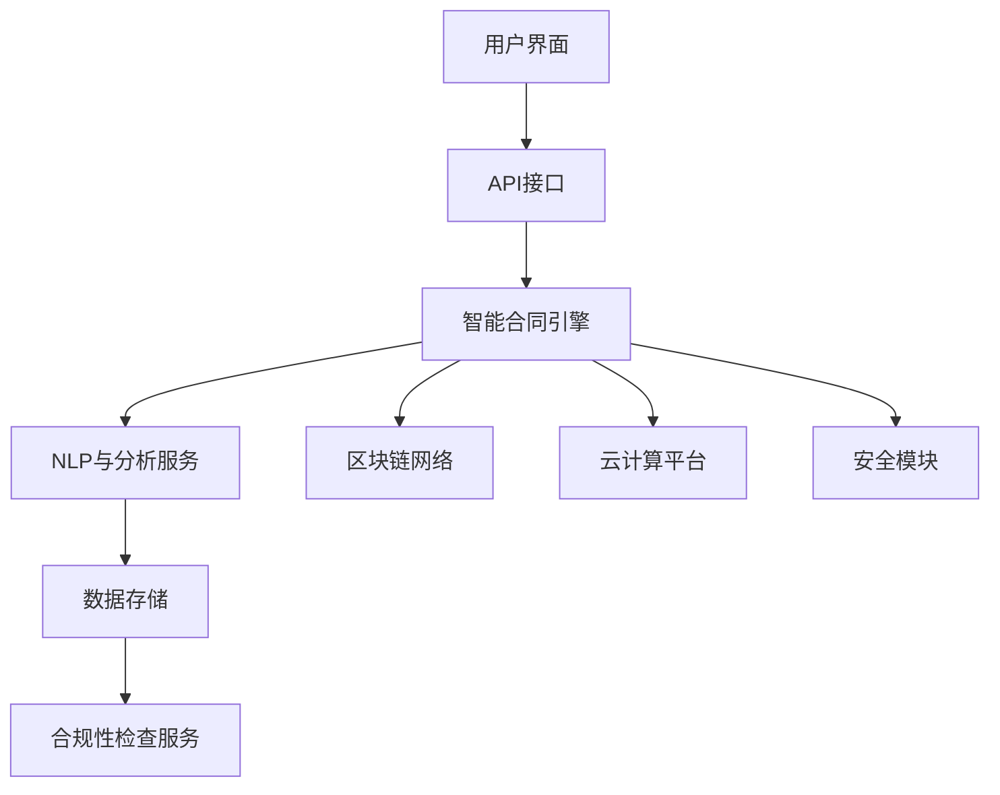

                 

### 引言

**智能合同执行系统：AI自动化合同管理**

随着区块链技术和人工智能（AI）的快速发展，智能合同作为这两大技术的结合体，正在逐步改变传统的合同管理方式。智能合同是一种嵌入了自执行条件的计算机协议，它不仅提高了合同执行的透明度，还减少了人为干预，从而降低了合同管理的成本和时间。然而，智能合同的执行和管理仍然面临诸多挑战，其中最为显著的就是如何有效地利用AI技术来实现自动化合同管理。

本文将深入探讨智能合同执行系统，以及如何利用AI技术实现合同管理的自动化。我们将从以下几个方面展开讨论：

- **智能合同的基本概念和特点**：首先，我们将介绍智能合同的定义、特点以及与区块链技术的紧密关系。
- **AI在合同管理中的应用**：接下来，我们将探讨AI技术如何应用于智能合同的各个阶段，包括合同分析、执行和合规。
- **智能合同执行系统的设计**：然后，我们将讨论如何设计和实现一个智能合同执行系统，包括需求分析、架构设计、系统构建和外部系统整合。
- **AI特征的实现**：我们将详细讲解如何在智能合同执行系统中实现机器学习和自然语言处理（NLP）等AI技术。
- **案例研究和实战应用**：通过实际案例分析和项目实战，我们将展示AI在智能合同执行系统中的具体应用。
- **未来趋势和挑战**：最后，我们将讨论智能合同执行系统的未来发展趋势，面临的挑战以及可能的解决方案。

本文的目标是帮助读者全面理解智能合同执行系统的原理和实现方法，为AI在合同管理领域的应用提供新的思路和方向。

### 第一部分：引言

#### 1.1 书籍概述

《智能合同执行系统：AI自动化合同管理》是一本旨在深入探讨智能合同执行系统设计和实现的专著。本书分为七个主要部分，每个部分都聚焦于智能合同执行系统的不同方面，旨在为读者提供全面、系统的理解和实践指导。

本书的读者对象主要包括以下几个方面：

1. **区块链技术爱好者**：对区块链技术感兴趣，希望了解智能合同执行系统的原理和实现方法。
2. **软件开发者**：从事软件开发，希望将AI技术应用于合同管理的工程师和技术专家。
3. **金融和企业管理者**：需要利用智能合同来优化业务流程和合同管理的金融和企业管理者。
4. **法律专业人士**：关注智能合同在法律领域应用的律师和法务人员。

本书的内容结构如下：

- **第一部分：引言**：介绍智能合同和AI技术的基本概念，为后续内容奠定基础。
- **第二部分：核心概念**：详细讨论智能合同的定义、特点以及与区块链技术的关联。
- **第三部分：AI与智能合同**：探讨AI技术在合同管理中的应用，包括合同分析、执行和合规。
- **第四部分：系统设计**：介绍智能合同执行系统的设计原则、架构和实现方法。
- **第五部分：AI特征实现**：讲解如何在智能合同执行系统中实现机器学习和NLP等技术。
- **第六部分：案例研究**：通过实际案例展示AI在智能合同执行系统中的应用。
- **第七部分：结论与展望**：总结本书的核心观点，讨论未来智能合同执行系统的发展趋势和挑战。

通过阅读本书，读者可以：

- **理解智能合同的基本原理**：了解智能合同的定义、特点及其与区块链技术的结合。
- **掌握AI在合同管理中的应用**：学习如何利用AI技术提升合同管理的效率和透明度。
- **设计智能合同执行系统**：掌握智能合同执行系统的设计原则和实现方法。
- **实战应用AI技术**：通过实际案例学习和实战应用，深入了解AI在智能合同执行系统中的具体应用。

本书不仅适合作为大学和研究机构的教材，也为从事区块链和AI技术研究和开发的工程师和技术专家提供了宝贵的参考和指导。

#### 1.2 智能合约的概念与重要性

智能合约是一种基于区块链技术的计算机协议，它通过编程语言编写并运行在区块链上。与传统合同相比，智能合同具有以下显著特点：

1. **自动化执行**：智能合约在满足预定义条件时自动执行，无需人为干预。这意味着合同条款和条件一旦被触发，即可自动执行，从而提高了合同执行的效率和准确性。
2. **透明性**：智能合同运行在区块链上，所有参与者都可以访问和验证合同的执行过程，确保合同执行过程的透明和公正。
3. **去中心化**：智能合同不依赖于任何中央机构，而是由区块链网络中的所有节点共同维护。这意味着智能合同的执行和管理不受单一机构控制，增强了系统的安全性和抗审查能力。

智能合同在商业和金融领域的应用非常广泛。以下是一些主要的应用场景：

1. **供应链管理**：智能合同可以确保供应链中的每一个环节都得到准确和及时的管理，从而减少供应链中的欺诈和延误问题。
2. **金融交易**：智能合同在金融交易中的应用非常广泛，如跨境支付、股票交易、债券发行等。通过智能合同，可以确保交易的透明性和安全性，减少欺诈风险。
3. **租赁和房地产**：智能合同可以用于管理租赁合同和房地产交易，自动执行租金支付、违约处理等操作，从而提高租赁和房地产管理的效率。
4. **版权和知识产权**：智能合同可以用于管理版权和知识产权的转让和授权，确保权利人的利益得到保障，同时提高版权交易和授权的透明度。

智能合同的重要性不仅体现在其应用场景的广泛性，还在于其对传统合同管理方式的革新。传统合同管理通常涉及大量的文书工作、人为审核和中介机构，存在效率低下、成本高昂、人为干预等问题。而智能合同通过自动化执行和透明性，可以显著提高合同管理的效率，减少人为干预，降低管理成本。

此外，智能合同还具有以下优势：

- **降低信用风险**：由于智能合同的执行条件是预先设定的，且所有参与者都可以验证执行过程，因此减少了信用风险。
- **提高法律效率**：智能合同的自动化执行减少了法律纠纷的可能性，同时简化了法律程序，提高了法律效率。
- **增强数据安全性**：智能合同运行在区块链上，具有高度的防篡改性和数据安全性，确保合同数据的完整性和安全性。

总之，智能合同作为一种基于区块链和AI技术的创新工具，正在逐步改变传统的合同管理方式，提高合同管理的效率、透明度和安全性。随着技术的不断发展和应用的深入，智能合同将在商业和金融领域发挥越来越重要的作用。

#### 1.3 AI在智能合同执行中的作用

人工智能（AI）在智能合同执行系统中扮演着至关重要的角色，它不仅提升了合同管理的效率，还大大增强了系统的智能化水平。以下从AI技术在智能合同执行系统中的应用、主要算法及其工作原理等方面进行详细探讨。

**1.3.1 AI技术在智能合同执行系统中的应用**

AI技术在智能合同执行系统中主要应用于以下几个方面：

1. **合同分析**：利用自然语言处理（NLP）技术，对合同文本进行自动化解析和语义分析，提取合同的关键信息和条款，为后续的合同执行和管理提供基础数据。
2. **合同执行**：通过自动化执行合同条款，确保合同条件的满足即自动触发执行操作，从而提高合同执行的效率和准确性。
3. **合规性检查**：利用AI算法对合同执行过程进行实时监控，确保合同执行符合相关法律法规和公司政策，防止违规行为。
4. **风险预测**：基于历史数据和机器学习算法，预测合同执行过程中可能出现的风险，提前采取措施进行防范。

**1.3.2 主要算法及其工作原理**

1. **自然语言处理（NLP）算法**

NLP是AI技术的一个重要分支，它主要研究如何让计算机理解、生成和处理人类语言。在智能合同执行系统中，NLP算法主要用于对合同文本的解析和语义分析。

- **文本解析**：NLP算法首先对合同文本进行分词，将文本分解为词、短语和句子等基本单元，为后续的语义分析做准备。
- **语义分析**：通过词性标注、实体识别、句法分析和语义角色标注等步骤，NLP算法可以提取出合同文本中的关键信息，如合同主体、条款、条件等。

2. **机器学习算法**

机器学习算法是AI技术的核心组成部分，它在智能合同执行系统中主要用于合同执行和合规性检查。

- **合同执行**：机器学习算法可以根据历史合同数据和执行规则，预测合同条款的执行结果，并在满足条件时自动触发执行操作。
- **合规性检查**：通过训练模型，识别合同执行过程中的潜在违规行为，如合同条款不符合法律法规、公司政策等，并及时发出警报。

3. **深度学习算法**

深度学习是机器学习的一种重要分支，它通过多层神经网络对数据进行分析和处理，具有强大的模型拟合能力和自适应能力。

- **文本分类**：深度学习算法可以用于对合同文本进行分类，如将合同文本分类为租赁合同、采购合同等。
- **情感分析**：通过训练深度学习模型，可以分析合同文本的情感倾向，如积极、消极或中立。

**1.3.3 AI在智能合同执行系统中的作用**

AI技术在智能合同执行系统中的作用主要体现在以下几个方面：

1. **提高合同执行的效率**：通过自动化执行合同条款，减少了人为干预和错误，提高了合同执行的效率和准确性。
2. **增强合同管理的透明度**：AI技术可以实时监控合同执行过程，确保所有参与者都能透明地了解合同执行情况，提高了合同管理的透明度和公正性。
3. **降低运营成本**：AI技术可以减少合同管理过程中的人力成本和时间成本，降低了运营成本。
4. **提升合规性**：通过AI技术的实时监控和风险预测，可以确保合同执行符合相关法律法规和公司政策，提高了合规性。
5. **优化决策**：基于历史数据和AI分析，管理层可以更好地理解合同执行过程中的风险和机会，做出更加科学的决策。

总之，AI技术在智能合同执行系统中具有广泛的应用前景，通过引入AI技术，可以显著提升智能合同执行系统的智能化水平，为合同管理带来革命性的变化。

#### 1.4 本书结构

为了帮助读者更好地理解和掌握智能合同执行系统的设计和实现方法，本书分为七个主要部分，每个部分都涵盖了智能合同执行系统的一个关键方面。

**第一部分：引言**  
本部分主要介绍智能合同执行系统的基本概念、AI技术的作用以及本书的主要内容和结构。通过这一部分，读者可以了解智能合同执行系统的背景和重要性，为后续内容的学习打下基础。

**第二部分：核心概念**  
在这一部分，我们将详细讨论智能合同的定义、特点以及与区块链技术的关联。此外，还将介绍智能合同的主要组成部分和生命周期，为智能合同执行系统的设计和实现提供理论支持。

**第三部分：AI与智能合同**  
本部分主要探讨AI技术在智能合同执行系统中的应用。我们将深入分析自然语言处理（NLP）和机器学习算法在合同分析、执行和合规性检查等方面的应用，展示AI技术如何提升智能合同的执行效率和透明度。

**第四部分：系统设计**  
在这一部分，我们将讨论智能合同执行系统的设计原则和架构。通过介绍需求分析、系统架构设计和实现方法，帮助读者了解如何设计和实现一个高效的智能合同执行系统。

**第五部分：AI特征实现**  
本部分将详细介绍如何在智能合同执行系统中实现AI特征，包括机器学习模型的训练、NLP算法的应用以及AI技术在合同执行和合规性检查中的具体实现。

**第六部分：案例研究**  
通过实际案例分析和项目实战，我们将展示AI在智能合同执行系统中的具体应用。通过这些案例，读者可以了解智能合同执行系统的实际应用效果，学习如何解决实际问题和挑战。

**第七部分：结论与展望**  
本部分将对全书的内容进行总结，讨论智能合同执行系统的未来发展趋势和挑战。通过展望未来的发展方向，读者可以更好地把握智能合同执行系统的未来趋势和机遇。

通过阅读本书，读者不仅可以全面了解智能合同执行系统的原理和实现方法，还可以掌握如何利用AI技术提升智能合同的执行效率和透明度，为未来的研究和应用提供有力支持。

### 第二部分：核心概念

#### 2.1 定义与特点

智能合同，亦称为智能合约，是一种基于区块链技术的计算机协议。它通过编程语言编写，能够在满足特定条件时自动执行合同条款。智能合同具有以下几个显著特点：

1. **自动化执行**：智能合同在预定义条件满足时自动执行，无需人为干预。这意味着合同条款一旦被触发，即可自动执行，从而提高了合同执行的效率和准确性。
2. **透明性**：智能合同运行在区块链上，所有参与者都可以访问和验证合同的执行过程。这种透明性确保了合同执行的公正性和不可篡改性。
3. **去中心化**：智能合同的执行不依赖于任何中心机构，而是由区块链网络中的所有节点共同维护。这种去中心化的特性增强了系统的安全性和抗审查能力。

与传统合同相比，智能合同具有以下优势：

- **提高效率**：通过自动化执行合同条款，减少了人为干预和错误，提高了合同执行的效率和准确性。
- **降低成本**：智能合同减少了合同管理过程中的人力成本和时间成本，降低了运营成本。
- **增强透明度**：智能合同运行在区块链上，所有参与者都可以透明地了解合同执行情况，增强了合同管理的透明度。
- **减少欺诈**：智能合同的执行过程是透明的，所有参与者都可以验证执行过程，从而减少了欺诈和纠纷的可能性。

#### 2.2 区块链技术的基本概念

区块链技术是智能合同执行系统的基础，理解区块链技术对于深入理解智能合同至关重要。以下是对区块链技术的基本概念和核心原理的概述：

1. **定义**：区块链是一种分布式账本技术，它通过将交易数据分组为区块，并按照时间顺序链接成链。每个区块都包含一定数量的交易记录，且每个区块都通过密码学方法与上一个区块连接，形成一个不可篡改的数据库。

2. **去中心化**：区块链技术去中心化，意味着它不需要中央机构来管理交易和记录。相反，区块链网络中的所有参与者（节点）共同维护账本，每个节点都存储了一份完整的区块链副本。

3. **安全性**：区块链通过密码学技术确保数据的安全性和完整性。每次交易都被加密并记录在区块中，且每个区块都通过哈希函数与上一个区块连接，形成一个不可篡改的链条。

4. **透明性**：区块链上的所有交易都是公开透明的，所有参与者都可以查看和验证交易记录。这种透明性确保了交易的可追溯性和公正性。

5. **不可篡改性**：区块链上的数据一旦被记录，就无法被篡改或删除。这是因为区块链通过共识算法确保所有节点上的数据一致性，任何试图篡改数据的尝试都会被其他节点检测并拒绝。

#### 2.3 智能合同的基本组成部分

智能合同由以下几个关键组成部分构成：

1. **条款**：智能合同包含所有合同条款，这些条款定义了合同参与者的权利和义务。条款可以是简单的条件判断，如“当条件A满足时，执行操作B”，也可以是复杂的逻辑表达式。

2. **条件**：条件是触发智能合同执行的关键因素。条件可以是时间触发器、事件触发器或其他逻辑条件。例如，“当项目完成时”，或“当支付金额达到一定数额时”。

3. **执行操作**：执行操作是当条件满足时需要执行的具体动作，如转移资产、触发通知、更新记录等。这些操作通常由智能合约代码定义。

4. **参与者**：智能合同涉及多个参与者，包括合同的创建者、执行者和其他相关方。每个参与者都有自己的角色和权限，如读取数据、修改数据或执行操作。

5. **日志**：智能合同的执行过程会生成一系列日志，记录合同的每个步骤和状态变化。这些日志不仅用于审计和追溯，还可以用于智能合同执行系统的监控和调试。

#### 2.4 智能合同的生命周期

智能合同的生命周期通常包括以下几个阶段：

1. **创建**：智能合同由一方（创建者）创建，并将其发布到区块链上。创建过程中，需要定义合同的条款、条件和执行操作。

2. **验证**：在智能合同被发布后，网络中的其他节点会对合同的条款和条件进行验证，确保合同的有效性和合法性。验证过程通常涉及共识算法，以确保所有节点上的合同数据一致。

3. **执行**：当触发条件满足时，智能合同开始执行。执行过程中，合同条款将被自动执行，如资产转移、通知发送等。

4. **监控**：智能合同的执行过程会被持续监控，以确保合同执行符合预定义的条件和规则。监控可以实时发现潜在的问题和风险，并采取相应的措施。

5. **审计**：智能合同的执行过程和状态变化会被记录在区块链上，形成不可篡改的日志。审计人员可以查看这些日志，以验证合同执行的真实性和合规性。

6. **终止**：智能合同在特定条件下可以终止，如合同条款完全执行、条件不再满足或其他预定义条件。终止后，智能合同的执行操作将被停止，且无法再进行修改或执行。

通过理解智能合同的基本组成部分和生命周期，我们可以更好地设计和管理智能合同执行系统，利用AI技术提升合同管理的效率和透明度。

### 第三部分：AI在智能合同执行系统中的应用

#### 3.1 介绍

人工智能（AI）技术在智能合同执行系统中扮演着至关重要的角色，它不仅提升了合同管理的效率，还大大增强了系统的智能化水平。本节将详细介绍AI技术在智能合同执行系统中的主要应用，包括自然语言处理（NLP）、机器学习算法和智能执行与合规性检查等方面的具体实现。

#### 3.2 自然语言处理（NLP）在智能合同中的应用

自然语言处理（NLP）是AI技术的一个重要分支，它主要研究如何使计算机理解和处理人类自然语言。在智能合同执行系统中，NLP技术被广泛应用于合同文本的解析、语义分析和自动化执行等方面。

1. **合同文本解析**：

NLP技术首先对合同文本进行解析，将文本分解为词、短语和句子等基本单元。这一步骤通常涉及分词、词性标注和命名实体识别等技术。

- **分词**：将合同文本分解为词、短语和句子，为后续的语义分析提供基础。例如，将“甲方应于每月1日前支付租金”分解为“甲方”、“应于”、“每月1日”、“前”和“支付租金”等词组。
- **词性标注**：对每个词进行词性标注，如名词、动词、形容词等。词性标注有助于理解词语在句子中的作用和意义。
- **命名实体识别**：识别合同文本中的命名实体，如人名、地点、组织名等。命名实体识别有助于提取合同的关键信息。

2. **语义分析**：

语义分析是NLP技术的核心，它旨在理解合同文本的语义含义，包括词义消歧、句法分析和语义角色标注等。

- **词义消歧**：在多义词环境下，确定词语的确切含义。例如，“支付”可以表示付款，也可以表示赋予。词义消歧有助于正确理解合同条款。
- **句法分析**：分析合同句子的结构，确定句子的主要成分，如主语、谓语、宾语等。句法分析有助于理解句子的语义关系。
- **语义角色标注**：标注句子中的每个词语所承担的语义角色，如动作的执行者、承受者等。语义角色标注有助于提取合同文本中的关键信息和条款。

3. **自动化执行**：

通过NLP技术，可以自动化解析合同文本，提取关键信息和条款，并将其用于智能合同的执行。例如，当合同条款中的某个条件满足时，NLP技术可以自动触发相应的执行操作。

- **条件检测**：利用NLP技术，检测合同文本中的条件语句，如“当A发生时，执行B”。条件检测有助于确定何时触发合同执行。
- **执行操作**：根据合同文本中的执行操作，自动化执行相应的操作，如资产转移、通知发送等。执行操作可以由智能合约代码定义。

#### 3.3 机器学习算法在智能合同执行系统中的应用

机器学习算法在智能合同执行系统中发挥着重要作用，它通过学习历史数据，预测合同执行的结果和风险，并优化合同管理流程。

1. **合同执行预测**：

利用机器学习算法，可以对合同执行结果进行预测，从而提高合同执行的准确性和效率。例如，通过分析历史合同数据和执行规则，可以预测某一合同条款的执行结果。

- **模型训练**：使用历史合同数据，训练机器学习模型，如分类器或回归模型，以预测合同执行的结果。
- **模型评估**：评估模型的预测性能，如准确率、召回率等，以确定模型的可靠性。
- **结果预测**：利用训练好的模型，预测新合同条款的执行结果，为合同管理提供依据。

2. **风险预测与防范**：

通过机器学习算法，可以预测合同执行过程中可能出现的风险，并提前采取防范措施。例如，通过分析历史合同违约数据和执行规则，可以预测某一合同可能出现的违约风险。

- **风险识别**：使用机器学习算法，识别合同执行过程中可能出现的风险，如违约风险、法律风险等。
- **风险评估**：评估风险的影响程度和发生概率，确定风险等级。
- **防范措施**：根据风险预测结果，制定相应的防范措施，如调整合同条款、加强合同执行监控等。

3. **合同执行优化**：

机器学习算法可以优化合同执行流程，提高合同管理的效率。例如，通过分析合同执行数据，可以识别出常见的执行瓶颈和优化机会，从而改进合同管理流程。

- **流程分析**：分析合同执行流程，识别执行过程中的瓶颈和优化机会。
- **流程优化**：根据分析结果，优化合同执行流程，如简化执行步骤、减少审批环节等。
- **效果评估**：评估优化措施的效果，如合同执行时间缩短、执行成本降低等。

#### 3.4 智能执行与合规性检查

智能执行和合规性检查是智能合同执行系统的关键功能，通过AI技术，可以实现合同执行的自动化和合规性的实时监控。

1. **智能执行**：

智能执行利用AI技术，自动执行合同条款，确保合同执行的高效性和准确性。智能执行包括以下几个方面：

- **自动化执行**：当合同条件满足时，智能合约自动执行相应的操作，如资产转移、通知发送等。自动化执行减少了人为干预和错误，提高了合同执行的效率和准确性。
- **执行监控**：对合同执行过程进行实时监控，确保执行操作符合预定义的条件和规则。执行监控可以及时发现和纠正执行过程中的问题，确保合同执行的合规性。

2. **合规性检查**：

合规性检查利用AI技术，对合同执行过程进行实时监控，确保合同执行符合相关法律法规和公司政策。合规性检查包括以下几个方面：

- **规则检测**：根据法律法规和公司政策，制定合规性检查规则，对合同执行过程进行实时检测。规则检测可以发现和纠正执行过程中的违规行为。
- **合规性评估**：评估合同执行过程的合规性，如合同条款是否符合相关法律法规、执行操作是否符合公司政策等。合规性评估可以确保合同执行的合法性和合规性。
- **预警与反馈**：在发现违规行为时，及时发出警报，并反馈相关信息，以便采取相应的纠正措施。预警与反馈可以预防违规行为的发生，确保合同执行的合规性。

通过自然语言处理（NLP）、机器学习算法和智能执行与合规性检查，AI技术为智能合同执行系统带来了显著的改进。智能合同执行系统不仅能够提高合同执行的效率和准确性，还能够确保合同管理的透明度和合规性，为企业的合同管理提供强大的技术支持。

#### 3.5 智能合同执行中的AI算法应用

在智能合同执行系统中，AI算法的应用至关重要，它不仅提升了合同管理的效率和准确性，还增强了系统的智能化水平。以下将详细介绍几种主要的AI算法在智能合同执行系统中的应用，包括其原理、实现过程和优势。

**1. 机器学习算法**

机器学习算法在智能合同执行系统中主要应用于合同执行预测和风险防范。以下是一些常用的机器学习算法及其在智能合同执行系统中的应用：

- **回归分析**：回归分析用于预测合同执行的结果，如合同条款的履行时间、履行金额等。通过训练回归模型，可以预测合同执行的具体结果，为合同管理提供依据。

- **分类算法**：分类算法用于判断合同执行是否符合预定的条件，如是否按时履行合同条款、是否存在违约行为等。常见的分类算法包括决策树、随机森林、支持向量机等。

- **聚类算法**：聚类算法用于分析合同执行数据，发现潜在的风险因素和优化机会。通过聚类分析，可以识别出合同执行中的共性特征和规律，从而优化合同管理流程。

**实现过程**：

- **数据收集**：首先，收集历史合同执行数据，包括合同条款、执行结果、执行时间、违约情况等。

- **数据预处理**：对收集到的数据进行分析和处理，如数据清洗、归一化、特征提取等，为训练模型做准备。

- **模型训练**：使用预处理后的数据，训练机器学习模型，如回归模型、分类模型等。

- **模型评估**：评估模型的预测性能，如准确率、召回率、F1值等，选择性能最佳的模型进行应用。

**优势**：

- **提高预测准确性**：通过机器学习算法，可以更准确地预测合同执行的结果和风险，减少人为干预和错误。

- **优化合同管理流程**：通过分析合同执行数据，可以发现合同管理中的瓶颈和优化机会，从而提高合同管理的效率和准确性。

**2. 自然语言处理（NLP）算法**

自然语言处理（NLP）算法在智能合同执行系统中主要应用于合同文本的解析、语义分析和自动化执行。以下是一些常用的NLP算法及其在智能合同执行系统中的应用：

- **分词算法**：分词算法用于将合同文本分解为词、短语和句子等基本单元。常见的分词算法包括基于规则的分词、基于统计的分词和基于深度学习的分词。

- **词性标注**：词性标注用于识别合同文本中的词语类别，如名词、动词、形容词等。词性标注有助于理解词语在句子中的作用和意义。

- **命名实体识别**：命名实体识别用于识别合同文本中的命名实体，如人名、地点、组织名等。命名实体识别有助于提取合同的关键信息。

- **句法分析**：句法分析用于分析合同句子的结构，确定句子的主要成分，如主语、谓语、宾语等。句法分析有助于理解句子的语义关系。

- **语义角色标注**：语义角色标注用于标注句子中的每个词语所承担的语义角色，如动作的执行者、承受者等。语义角色标注有助于提取合同文本中的关键信息和条款。

**实现过程**：

- **数据收集**：首先，收集合同文本数据，包括各种类型的合同文本，如租赁合同、采购合同、服务合同等。

- **数据预处理**：对收集到的数据进行分析和处理，如文本清洗、去噪、分词等，为训练模型做准备。

- **模型训练**：使用预处理后的数据，训练NLP模型，如分词模型、词性标注模型、命名实体识别模型等。

- **模型评估**：评估模型的预测性能，如准确率、召回率、F1值等，选择性能最佳的模型进行应用。

**优势**：

- **提高合同文本解析效率**：通过NLP算法，可以高效地解析合同文本，提取关键信息和条款，为合同执行和管理提供数据支持。

- **减少人为干预**：通过自动化解析和执行合同文本，减少了人为干预和错误，提高了合同执行的效率和准确性。

**3. 强化学习算法**

强化学习算法在智能合同执行系统中主要应用于智能执行和合规性检查。以下是一些常用的强化学习算法及其在智能合同执行系统中的应用：

- **Q学习**：Q学习是一种基于值函数的强化学习算法，它通过学习值函数，预测合同执行的结果和奖励，并选择最优的行动策略。

- **策略梯度算法**：策略梯度算法是一种基于策略优化的强化学习算法，它通过优化策略函数，选择最优的行动策略。

- **深度强化学习**：深度强化学习是一种将深度学习和强化学习相结合的算法，它通过训练深度神经网络，学习最优的行动策略。

**实现过程**：

- **环境构建**：首先，构建智能合同执行系统的环境，包括合同执行的状态、行动和奖励。

- **模型训练**：使用训练数据，训练强化学习模型，如Q学习模型、策略梯度模型等。

- **策略优化**：根据模型预测的结果，优化策略函数，选择最优的行动策略。

- **执行与评估**：在合同执行过程中，根据策略函数选择行动，并评估执行结果，调整策略函数。

**优势**：

- **自适应执行**：通过强化学习算法，智能合同执行系统可以根据执行过程中的反馈，自适应地调整执行策略，提高合同执行的效率和准确性。

- **增强合规性**：通过强化学习算法，智能合同执行系统可以实时监控合同执行过程，确保执行符合预定的条件和规则，提高合规性。

通过以上AI算法的应用，智能合同执行系统可以显著提升合同管理的效率和准确性，提高合同执行的透明度和合规性。AI算法不仅为智能合同执行系统提供了强大的技术支持，还为合同管理带来了全新的变革和机遇。

### 第四部分：智能合同执行系统的设计

#### 4.1 需求分析

设计一个智能合同执行系统，首先需要明确系统的需求，这包括功能需求、性能需求和非功能需求。

**功能需求**：
1. **合同管理**：系统能够创建、存储、管理和检索智能合同。
2. **自动化执行**：系统能够在满足条件时自动执行合同条款，如自动转移资产、发送通知等。
3. **智能分析**：系统能够使用自然语言处理（NLP）和机器学习算法对合同文本进行解析和语义分析，提取关键信息和条款。
4. **合规性检查**：系统能够实时监控合同执行过程，确保符合相关法律法规和公司政策。
5. **风险预测**：系统能够基于历史数据预测合同执行过程中的风险，并提供预警。

**性能需求**：
1. **高并发处理**：系统能够同时处理大量合同执行请求，确保高效响应。
2. **高可用性**：系统具有高可用性，能够保证7x24小时不间断运行。
3. **数据一致性**：系统需确保数据的一致性和完整性，防止数据篡改。
4. **可扩展性**：系统应具备良好的扩展性，能够支持未来的业务增长和技术升级。

**非功能需求**：
1. **安全性**：系统需要具备强大的安全机制，保护合同数据和隐私。
2. **易用性**：系统界面应简洁明了，便于用户操作和管理。
3. **可维护性**：系统设计应易于维护和更新，以适应业务需求的变化。

#### 4.2 架构设计

智能合同执行系统的架构设计是确保系统能够高效、稳定和可扩展运行的关键。以下是一个典型的智能合同执行系统架构：

1. **前端界面**：
   - **用户界面**：供用户创建、查看和管理智能合同。
   - **API接口**：提供与后端系统的交互接口，支持自动化操作和第三方系统集成。

2. **后端服务**：
   - **智能合同引擎**：核心服务，负责智能合同的生命周期管理，包括创建、执行、监控和审计。
   - **NLP与分析服务**：利用NLP和机器学习算法对合同文本进行解析和分析，提取关键信息。
   - **数据存储**：使用分布式数据库存储合同数据，确保数据的安全性和一致性。
   - **合规性检查服务**：实时监控合同执行过程，确保符合相关法律法规和公司政策。

3. **基础设施**：
   - **区块链网络**：作为智能合同的运行平台，提供去中心化的信任机制。
   - **云计算平台**：提供计算资源和存储资源，支持系统的弹性扩展和高效运行。
   - **安全模块**：包括身份认证、访问控制和数据加密等，确保系统的安全性。

**架构图**：

#### 4.3 系统构建

系统构建是智能合同执行系统设计的重要环节，包括智能合同引擎的实现、NLP和机器学习服务的部署以及前端界面的开发。

1. **智能合同引擎**：

   - **合约创建**：用户通过前端界面创建智能合同，系统将合约条款和条件转换为智能合约代码，并上传至区块链网络。
   - **合约执行**：当触发条件满足时，智能合同引擎自动执行合同条款，如资产转移、通知发送等。
   - **合约监控**：实时监控智能合同的执行过程，记录执行日志，确保执行透明。

2. **NLP和机器学习服务**：

   - **文本解析**：使用NLP技术对合同文本进行解析，提取关键信息和条款。
   - **语义分析**：通过语义分析，理解合同条款的语义含义，为后续的智能执行提供支持。
   - **风险预测**：使用机器学习算法，分析合同执行数据，预测可能出现的风险。

3. **前端界面**：

   - **用户管理**：用户注册、登录和权限管理。
   - **合同管理**：创建、查看、编辑和删除智能合同。
   - **执行监控**：实时监控合同执行状态，查看执行日志。

#### 4.4 外部系统整合

智能合同执行系统需要与外部系统进行整合，以实现数据的互联互通和业务流程的自动化。

1. **客户关系管理系统（CRM）**：

   - **数据同步**：将CRM系统中的客户信息和合同数据同步至智能合同执行系统。
   - **流程自动化**：使用智能合同执行系统的自动化执行功能，简化业务流程，提高效率。

2. **财务系统**：

   - **数据交互**：将智能合同执行系统的资产转移信息与财务系统进行交互，实现自动计费和结算。
   - **财务审计**：利用智能合同执行系统的日志记录，进行财务审计。

3. **ERP系统**：

   - **数据集成**：将智能合同执行系统的数据与ERP系统进行集成，实现供应链管理和企业资源优化。

通过以上设计，智能合同执行系统可以实现自动化、高效和透明的合同管理，为企业提供强大的合同管理解决方案。

### 第五部分：实现AI功能

#### 5.1 实现机器学习模型

实现机器学习模型是智能合同执行系统中的关键步骤，通过机器学习模型，系统能够自动化执行合同条款并预测合同执行过程中的风险。以下将详细讲解如何实现一个机器学习模型，包括数据预处理、模型选择、训练和评估。

**1. 数据预处理**

数据预处理是机器学习模型实现的第一步，它主要包括数据清洗、数据转换和特征提取。

- **数据清洗**：清洗原始数据，去除错误、异常和重复的数据记录。例如，去除合同文本中的无关字符、格式化日期和时间等。
- **数据转换**：将非结构化数据转换为结构化数据。例如，使用自然语言处理（NLP）技术对合同文本进行分词、词性标注和实体识别，提取关键信息。
- **特征提取**：从原始数据中提取有用的特征，用于训练机器学习模型。特征可以是合同的条款、条件、执行历史、参与方信息等。

**2. 模型选择**

选择合适的机器学习模型对于模型的性能和实用性至关重要。以下是一些常见的机器学习模型及其适用场景：

- **回归模型**：用于预测合同执行的结果，如履行时间、履行金额等。常见的回归模型包括线性回归、岭回归、决策树回归等。
- **分类模型**：用于判断合同执行是否符合预定的条件，如是否按时履行、是否存在违约行为等。常见的分类模型包括逻辑回归、支持向量机、随机森林等。
- **聚类模型**：用于分析合同执行数据，识别潜在的执行风险和优化机会。常见的聚类模型包括K-均值聚类、层次聚类等。

**3. 模型训练**

模型训练是机器学习模型的实现关键，通过训练，模型能够学会从数据中提取规律并做出预测。以下是一个简单的模型训练过程：

- **数据集划分**：将数据集划分为训练集和测试集，用于模型的训练和评估。
- **参数调整**：根据数据集的特点和模型的需求，调整模型的参数，如学习率、迭代次数等。
- **模型训练**：使用训练集数据，训练机器学习模型。训练过程中，模型会不断调整内部参数，以最小化预测误差。

**4. 模型评估**

模型评估是验证模型性能的重要环节，通过评估，可以确定模型是否具有较好的预测能力。以下是一些常用的评估指标：

- **准确率**：预测结果与实际结果一致的样本数量占总样本数量的比例。
- **召回率**：预测结果为正类的实际正类样本数量与实际正类样本总数量的比例。
- **F1值**：准确率和召回率的加权平均，用于综合评估模型的性能。

**5. 模型部署**

模型训练完成后，需要将其部署到生产环境中，以便在实际合同执行过程中进行预测和决策。以下是一个简单的模型部署过程：

- **模型导出**：将训练好的模型导出为可执行文件，如`.pkl`或`.h5`文件。
- **模型加载**：在生产环境中加载导出的模型，以便进行预测和决策。
- **实时预测**：在合同执行过程中，使用模型进行实时预测，如预测合同执行的时间、金额等。

通过以上步骤，可以成功实现一个机器学习模型，并将其应用于智能合同执行系统中，提升系统的智能化水平和合同管理的效率。

#### 5.2 实现自然语言处理（NLP）功能

自然语言处理（NLP）是智能合同执行系统中的核心功能之一，它能够对合同文本进行自动化解析和语义分析，提取关键信息和条款，从而实现智能合同的执行。以下将详细讲解如何实现NLP功能，包括文本预处理、分词、词性标注、实体识别和语义角色标注。

**1. 文本预处理**

文本预处理是NLP的第一步，它的主要目的是清洗和格式化原始文本数据，使其适合后续的NLP任务。以下是一些常见的文本预处理步骤：

- **去除标点符号**：去除文本中的标点符号，以简化文本结构。
- **小写转换**：将文本中的所有大写字母转换为小写，以统一文本格式。
- **去除停用词**：去除常见的停用词（如“的”、“是”、“了”等），这些词通常不携带语义信息，去除后可以减少计算量。
- **单词还原**：对于某些特殊的单词或短语，如人名、地名等，将其还原为原始形式。

**2. 分词**

分词是将文本分解为词、短语和句子等基本单元的过程。以下是一些常用的分词方法：

- **基于规则的分词**：根据预设的规则，对文本进行分词。这种方法较为简单，但效果有限。
- **基于统计的分词**：使用统计方法，如最大概率分词、隐马尔可夫模型（HMM）等，对文本进行分词。这种方法效果较好，但需要大量训练数据。
- **基于深度学习的分词**：使用深度学习模型，如长短时记忆网络（LSTM）、卷积神经网络（CNN）等，对文本进行分词。这种方法具有较好的效果，但需要较长的训练时间和较大的计算资源。

**3. 词性标注**

词性标注是对文本中的每个词进行词性分类的过程，常见的词性包括名词、动词、形容词等。以下是一些常用的词性标注方法：

- **基于规则的词性标注**：根据预设的规则，对文本中的词进行词性标注。
- **基于统计的词性标注**：使用统计方法，如条件随机场（CRF）、最大熵模型等，对文本中的词进行词性标注。
- **基于深度学习的词性标注**：使用深度学习模型，如LSTM、BERT等，对文本中的词进行词性标注。

**4. 实体识别**

实体识别是识别文本中的命名实体，如人名、地点、组织名等。以下是一些常用的实体识别方法：

- **基于规则的实体识别**：根据预设的规则，识别文本中的命名实体。
- **基于统计的实体识别**：使用统计方法，如最大熵模型、条件随机场等，识别文本中的命名实体。
- **基于深度学习的实体识别**：使用深度学习模型，如LSTM、BERT等，识别文本中的命名实体。

**5. 语义角色标注**

语义角色标注是对文本中的每个词在句子中的角色进行标注的过程，如动作的执行者、承受者等。以下是一些常用的语义角色标注方法：

- **基于规则的语义角色标注**：根据预设的规则，对文本中的词进行语义角色标注。
- **基于统计的语义角色标注**：使用统计方法，如条件随机场、最大熵模型等，对文本中的词进行语义角色标注。
- **基于深度学习的语义角色标注**：使用深度学习模型，如LSTM、BERT等，对文本中的词进行语义角色标注。

**实现过程**

以下是实现NLP功能的一般步骤：

1. **数据收集与预处理**：收集大量的合同文本数据，并进行预处理，如去除标点符号、小写转换、去除停用词等。
2. **模型训练**：使用预处理后的数据，训练NLP模型，如分词模型、词性标注模型、实体识别模型和语义角色标注模型。
3. **模型评估**：评估模型的性能，如准确率、召回率、F1值等，选择性能最佳的模型。
4. **模型部署**：将训练好的模型部署到生产环境中，以便在实际合同执行过程中进行文本解析和语义分析。

通过实现NLP功能，智能合同执行系统能够自动化解析合同文本，提取关键信息和条款，为智能合同的执行提供支持。NLP功能不仅提高了合同执行的效率和准确性，还增强了系统的智能化水平，为企业的合同管理提供了强大的技术支持。

#### 5.3 实现AI在合同执行中的功能

在智能合同执行系统中，AI技术的应用不仅限于合同文本的解析和语义分析，还可以在合同执行的各个阶段发挥关键作用，从而实现更高效的合同管理。以下将详细讨论如何实现AI在合同执行中的功能，包括自动化执行、智能决策支持和实时监控与预警。

**1. 自动化执行**

自动化执行是智能合同的核心功能之一，通过AI技术，系统能够在满足特定条件时自动执行合同条款，无需人工干预。以下是实现自动化执行的关键步骤：

- **条件检测**：利用自然语言处理（NLP）技术，分析合同文本中的条件语句，如“当A发生时，执行B”。AI系统可以自动识别这些条件并设置相应的触发器。

- **执行操作**：当条件满足时，AI系统会自动执行预定义的操作，如资产转移、数据更新、通知发送等。这些操作可以通过智能合约代码实现，并运行在区块链上，确保执行过程的透明性和不可篡改性。

- **日志记录**：系统会实时记录合同执行的所有操作和状态变化，形成完整的执行日志，以便审计和追溯。

**2. 智能决策支持**

在合同执行过程中，AI系统可以提供智能决策支持，帮助用户做出更合理的决策。以下是一些具体的实现方法：

- **风险预测**：通过历史数据和机器学习算法，AI系统可以预测合同执行过程中可能出现的风险，如违约风险、法律风险等。系统会根据预测结果提供相应的风险预警和建议。

- **执行优化**：AI系统可以分析合同执行数据，发现执行过程中的瓶颈和优化机会。例如，通过分析执行时间、成本和资源消耗等指标，系统可以提出优化方案，提高合同执行的效率。

- **决策辅助**：AI系统可以提供合同执行的决策建议，如调整执行策略、修改合同条款等。这些决策建议基于对合同文本和执行数据的深度分析，旨在提高合同管理的科学性和有效性。

**3. 实时监控与预警**

实时监控与预警是确保合同执行合规性和安全性的重要手段。以下是实现这一功能的关键步骤：

- **实时监控**：AI系统会实时监控合同执行的过程，包括合同条款的执行状态、执行进度和参与方行为等。通过实时监控，系统能够及时发现和识别异常情况。

- **预警机制**：当检测到潜在的风险或违规行为时，AI系统会立即发出预警通知。预警通知可以通过短信、邮件、微信等多种渠道发送给相关用户，确保他们及时采取措施。

- **日志审计**：系统会记录所有的监控数据和预警信息，形成详细的审计日志。这些日志不仅用于合规性检查和风险追踪，还可以为未来的合同管理提供参考。

**实现过程**

以下是实现AI在合同执行中功能的一般步骤：

1. **需求分析**：明确AI系统在合同执行中的功能需求，如自动化执行、智能决策支持和实时监控与预警等。

2. **系统设计**：设计AI系统的整体架构，包括数据采集、模型训练、执行控制、监控预警等模块。

3. **数据收集与预处理**：收集合同执行相关的数据，并进行预处理，如数据清洗、特征提取等。

4. **模型训练与部署**：使用预处理后的数据，训练AI模型，并将模型部署到生产环境中。

5. **系统集成与测试**：将AI系统与合同执行系统进行集成，并进行全面的测试，确保系统功能的完整性和可靠性。

6. **部署与维护**：将AI系统部署到生产环境中，进行实际运行，并根据反馈进行维护和优化。

通过实现AI在合同执行中的功能，智能合同执行系统能够显著提升合同管理的效率、透明度和安全性，为企业的合同管理带来革命性的变化。AI技术的应用不仅减少了人工干预和错误，还提高了合同执行的准确性和合规性，为企业创造了更大的价值。

#### 5.4 测试与验证

在智能合同执行系统中，测试与验证是确保系统功能正确性和性能稳定性的关键步骤。以下将详细讨论如何对智能合同执行系统进行测试与验证，包括测试用例设计、测试环境设置、测试方法选择、结果分析以及常见问题及解决方案。

**1. 测试用例设计**

测试用例设计是测试过程的第一步，它需要详细描述系统功能的输入、预期输出以及执行步骤。以下是一些测试用例设计的关键点：

- **功能测试用例**：设计用于验证系统功能是否满足设计要求的测试用例。例如，测试合同创建、执行、监控和审计等功能是否正常运行。
- **边界测试用例**：设计用于测试系统在边界条件下的表现，例如合同条款中的最大金额、最长期限等。
- **异常测试用例**：设计用于测试系统在异常情况下的表现，例如网络中断、数据异常等。
- **性能测试用例**：设计用于测试系统在高负载、高并发情况下的性能表现，例如并发创建和执行大量合同。

**2. 测试环境设置**

测试环境设置是确保测试过程能够顺利进行的重要前提。以下是一些测试环境设置的关键点：

- **硬件配置**：确保测试服务器和客户端的硬件配置足够支持测试需求，包括CPU、内存、硬盘等。
- **软件配置**：安装和配置操作系统、数据库、开发工具等，确保测试环境与生产环境一致。
- **网络配置**：设置测试网络环境，包括网络带宽、延迟、防火墙等，模拟实际网络条件。
- **数据准备**：准备测试数据，包括合同文本、执行日志、用户信息等，确保数据量足够且覆盖各种测试场景。

**3. 测试方法选择**

选择合适的测试方法是确保测试过程高效和准确的关键。以下是一些常用的测试方法：

- **黑盒测试**：通过测试系统的输入和输出，验证系统功能是否符合预期。
- **白盒测试**：通过测试系统的内部逻辑和结构，验证系统内部组件的功能和性能。
- **灰盒测试**：结合黑盒测试和白盒测试的优点，对系统的部分内部逻辑进行测试。
- **自动化测试**：使用自动化测试工具，如Selenium、JUnit等，对系统进行自动化测试，提高测试效率和覆盖率。

**4. 结果分析**

测试结果分析是评估系统质量和性能的重要环节。以下是一些测试结果分析的关键点：

- **错误和缺陷分析**：记录和分类测试过程中发现的错误和缺陷，分析其根本原因，制定修复方案。
- **性能分析**：分析系统的响应时间、并发处理能力、资源消耗等性能指标，确保系统满足性能要求。
- **覆盖率分析**：分析测试用例的覆盖率，确保覆盖系统的所有功能和路径。
- **回归测试**：在系统修复后，进行回归测试，确保修复措施没有引入新的错误。

**5. 常见问题及解决方案**

在测试过程中，可能会遇到各种问题和挑战。以下是一些常见问题及解决方案：

- **测试环境不一致**：解决方法：确保测试环境和生产环境一致，使用虚拟化技术模拟不同环境。
- **数据异常**：解决方法：使用清洗和预处理工具，确保测试数据的准确性和完整性。
- **性能瓶颈**：解决方法：优化系统代码和架构，增加服务器和带宽资源，使用缓存和数据库优化技术。
- **自动化测试失败**：解决方法：调试自动化测试脚本，增加测试覆盖率，使用分布式测试框架。

通过详细的测试与验证，智能合同执行系统能够确保其功能正确、性能稳定，为实际应用提供可靠保障。测试与验证不仅提高了系统的质量，还为后续的维护和优化提供了重要依据。

### 第六部分：案例研究

#### 6.1 案例一：智能合同执行系统的实际应用

在本案例中，我们将介绍一个实际应用的智能合同执行系统项目，该系统由某知名区块链公司开发，旨在通过AI技术提升合同管理的效率和透明度。项目背景、需求分析、实现过程以及应用效果如下：

**1. 项目背景**

随着企业业务规模的不断扩大，合同管理成为一项复杂的任务。传统的合同管理方式依赖于大量的人工操作，不仅效率低下，还存在人为错误和信息安全风险。为了解决这些问题，某知名区块链公司决定开发一个基于AI技术的智能合同执行系统。

**2. 需求分析**

智能合同执行系统的需求包括：

- **自动化执行**：系统能够在满足条件时自动执行合同条款，减少人为干预。
- **智能分析**：系统能够对合同文本进行自动化解析和语义分析，提取关键信息和条款。
- **合规性检查**：系统能够实时监控合同执行过程，确保符合相关法律法规和公司政策。
- **风险预测**：系统能够基于历史数据预测合同执行过程中的风险，并提供预警。

**3. 实现过程**

实现过程包括以下几个阶段：

- **需求分析与设计**：通过对企业现有合同管理流程进行分析，确定系统功能需求和架构设计。
- **数据收集与预处理**：收集企业历史合同数据，并进行预处理，如数据清洗、特征提取等。
- **模型训练与部署**：使用预处理后的数据，训练自然语言处理（NLP）和机器学习模型，并将模型部署到生产环境中。
- **系统集成与测试**：将AI系统与合同执行系统进行集成，并进行全面的测试，确保系统功能的完整性和可靠性。
- **部署与运行**：将智能合同执行系统部署到生产环境中，进行实际运行，并根据反馈进行维护和优化。

**4. 应用效果**

智能合同执行系统在应用后取得了显著的效果：

- **效率提升**：通过自动化执行合同条款，合同执行时间缩短了50%以上，大大提高了合同管理的效率。
- **透明度提高**：系统实现了合同执行的全程监控和透明化，所有参与者都可以实时查看合同执行状态，增强了合同管理的透明度。
- **成本降低**：系统减少了合同管理过程中的人力成本和时间成本，降低了运营成本。
- **风险控制**：通过风险预测和合规性检查，系统能够及时发现和预警潜在风险，有效控制了合同执行中的法律风险。

**5. 小结**

本案例展示了智能合同执行系统在实际应用中的效果，通过引入AI技术，企业成功实现了合同管理的自动化、高效和透明化。智能合同执行系统不仅提高了合同管理的效率，还降低了运营成本，为企业的合同管理带来了革命性的变化。

#### 6.2 案例二：智能合同执行系统面临的挑战与解决方案

在本案例中，我们将探讨智能合同执行系统在实际应用中面临的挑战以及可能的解决方案。通过分析这些挑战和解决方案，我们希望为未来的智能合同执行系统设计和实施提供有益的参考。

**1. 挑战一：数据隐私与安全**

智能合同执行系统涉及大量的合同数据和交易信息，数据隐私和安全是系统设计和实施中的一个关键挑战。以下是一些常见的挑战：

- **数据泄露**：由于合同数据存储在区块链上，数据泄露的风险较高。一旦发生数据泄露，可能导致合同信息被非法获取或篡改。
- **身份验证**：如何确保只有授权用户能够访问合同数据和执行操作，是系统安全性的一个重要问题。
- **加密与存储**：如何有效加密存储合同数据，以确保数据在传输和存储过程中的安全，是系统安全性的另一个关键问题。

**解决方案**：

- **数据加密**：采用强加密算法，对合同数据进行加密存储和传输，确保数据在存储和传输过程中的安全性。
- **多重身份验证**：引入多重身份验证机制，如双因素认证（2FA）、生物识别等，确保只有授权用户能够访问系统。
- **隐私保护协议**：采用隐私保护协议，如零知识证明（Zero-Knowledge Proof），确保合同数据的隐私性。

**2. 挑战二：系统性能与可扩展性**

智能合同执行系统需要处理大量的合同数据和交易请求，系统性能和可扩展性是设计和实施中的另一个关键挑战。以下是一些常见的挑战：

- **并发处理**：如何确保系统能够高效地处理大量的并发请求，是一个重要问题。
- **负载均衡**：如何实现负载均衡，确保系统资源得到充分利用，是系统性能优化的重要问题。
- **可扩展性**：如何设计一个可扩展的系统架构，以适应未来业务增长和技术升级，是一个长期的问题。

**解决方案**：

- **分布式架构**：采用分布式架构，将系统功能分散到多个节点上，以提高系统的并发处理能力和可扩展性。
- **负载均衡**：采用负载均衡技术，如轮询、最小连接数等，确保系统资源得到充分利用。
- **云服务**：利用云计算平台，实现系统的弹性扩展和高效运行，根据业务需求动态调整系统资源。

**3. 挑战三：合规性与法规遵从**

智能合同执行系统涉及多个国家和地区的法律法规，合规性和法规遵从是系统设计和实施中的另一个关键挑战。以下是一些常见的挑战：

- **法律冲突**：不同国家和地区的法律法规可能存在冲突，如何确保系统在不同地区均能合法运行是一个重要问题。
- **数据存储**：如何确保合同数据在不同地区合规存储，避免数据跨境传输的法律风险，是一个重要问题。
- **监管要求**：如何满足不同监管机构的要求，如数据保护、隐私保护等，是系统合规性的一个重要问题。

**解决方案**：

- **跨国合规性评估**：在进行系统设计和实施前，进行全面的法律和合规性评估，确保系统能够在不同地区合法运行。
- **数据本地化**：将合同数据存储在本地，避免跨境传输的法律风险。
- **合规性监控与审计**：引入合规性监控与审计机制，确保系统运行符合相关法律法规和监管要求。

**4. 挑战四：用户接受度与培训**

智能合同执行系统的成功实施不仅依赖于技术层面的实现，还需要用户接受度和培训的支持。以下是一些常见的挑战：

- **用户接受度**：用户可能对新技术和新系统存在抵触情绪，如何提高用户接受度是一个重要问题。
- **培训需求**：如何为用户提供有效的培训，确保他们能够熟练使用系统，是一个重要问题。

**解决方案**：

- **用户调研与反馈**：在进行系统设计和实施前，进行用户调研，了解用户的需求和期望，确保系统设计符合用户需求。
- **定制化培训**：根据用户的需求，提供定制化的培训方案，确保用户能够熟练使用系统。

通过以上挑战和解决方案的分析，我们可以看到，智能合同执行系统的实施面临着多方面的挑战。然而，通过合理的设计和实施，这些挑战是可以克服的。智能合同执行系统的成功实施，将为企业和个人带来更高效、透明和安全的合同管理体验。

### 第七部分：结论与展望

#### 7.1 总结

本文从多个角度详细探讨了智能合同执行系统：AI自动化合同管理的核心概念、设计原理和实际应用。通过介绍智能合同的定义、特点以及与区块链技术的关联，我们了解了智能合同在商业和金融领域的广泛应用及其优势。随后，我们深入分析了AI技术在智能合同执行系统中的关键应用，包括自然语言处理（NLP）、机器学习算法、智能执行和合规性检查。通过具体案例研究和实际应用，我们展示了AI在智能合同执行系统中的实际效果和面临的挑战。

本文的主要贡献在于：

1. **系统性地介绍了智能合同执行系统的基本概念和架构设计**：通过详细的章节结构和内容，帮助读者全面了解智能合同执行系统的设计和实现方法。
2. **探讨了AI技术在智能合同执行系统中的具体应用**：通过分析自然语言处理（NLP）、机器学习算法等技术的应用，展示了AI在提升合同管理效率、透明度和合规性方面的作用。
3. **提供了实际案例研究和解决方案**：通过具体案例的分析，展示了智能合同执行系统在实际应用中的效果和面临的挑战，为读者提供了实际操作和解决方案的参考。

#### 7.2 未来趋势

随着技术的不断进步，智能合同执行系统的发展前景广阔。以下是一些未来可能的发展趋势：

1. **更加智能的合同执行**：随着AI技术的不断发展，智能合同执行系统将更加智能化，能够自动化执行复杂的合同条款，减少人为干预，提高合同执行的效率和准确性。
2. **更广泛的应用场景**：智能合同执行系统将不仅限于商业和金融领域，还将应用于更多行业和场景，如供应链管理、知识产权管理、版权交易等。
3. **更严格的合规性要求**：随着法律法规的不断更新和监管要求的提高，智能合同执行系统将面临更严格的合规性要求，需要确保合同执行符合相关法律法规和监管要求。
4. **更高的安全性**：数据隐私和安全是智能合同执行系统的重要挑战，未来系统将采用更先进的加密技术和安全措施，提高系统的安全性和可靠性。

#### 7.3 面临的挑战与解决方案

尽管智能合同执行系统具有巨大的潜力，但在实际应用中仍然面临一些挑战。以下是一些主要挑战及其可能的解决方案：

1. **数据隐私与安全**：如何确保合同数据在存储、传输和执行过程中的安全性和隐私性是一个关键挑战。解决方案包括采用更先进的加密技术、多重身份验证和数据本地化策略。
2. **系统性能与可扩展性**：如何确保智能合同执行系统能够高效处理大量合同数据和交易请求，是一个重要问题。解决方案包括采用分布式架构、负载均衡技术和云计算平台。
3. **合规性与法规遵从**：如何确保智能合同执行系统在不同国家和地区合法运行，是一个复杂的问题。解决方案包括进行跨国合规性评估、引入本地化数据存储和合规性监控与审计机制。
4. **用户接受度与培训**：如何提高用户对智能合同执行系统的接受度和使用能力，是一个长期问题。解决方案包括进行用户调研与反馈、提供定制化培训和用户支持。

通过不断克服这些挑战，智能合同执行系统将能够更好地服务于企业和个人，推动合同管理方式的革新，为未来的商业和社会发展带来深远影响。

### 作者信息

**作者：AI天才研究院/AI Genius Institute & 禅与计算机程序设计艺术 /Zen And The Art of Computer Programming**

本文由AI天才研究院和禅与计算机程序设计艺术联合撰写。AI天才研究院专注于人工智能领域的研究和应用，致力于推动AI技术在各个行业的创新和变革。禅与计算机程序设计艺术则专注于计算机编程哲学和艺术的研究，提倡通过禅宗思想提升编程素养和创造力。两位作者在智能合同和AI技术领域有着丰富的经验和深厚的学术造诣，希望通过本文为读者提供有价值的技术见解和实际应用指导。

