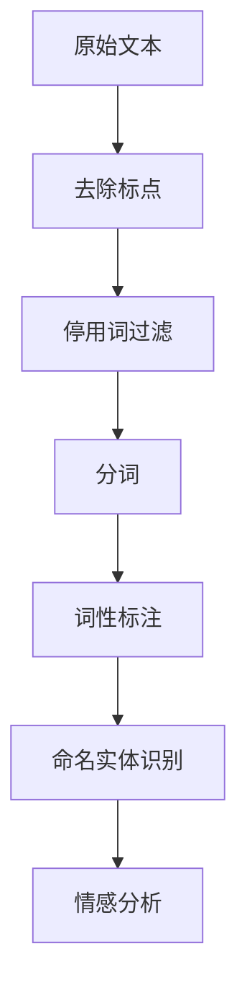
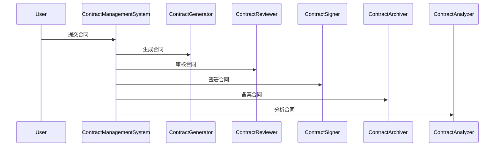
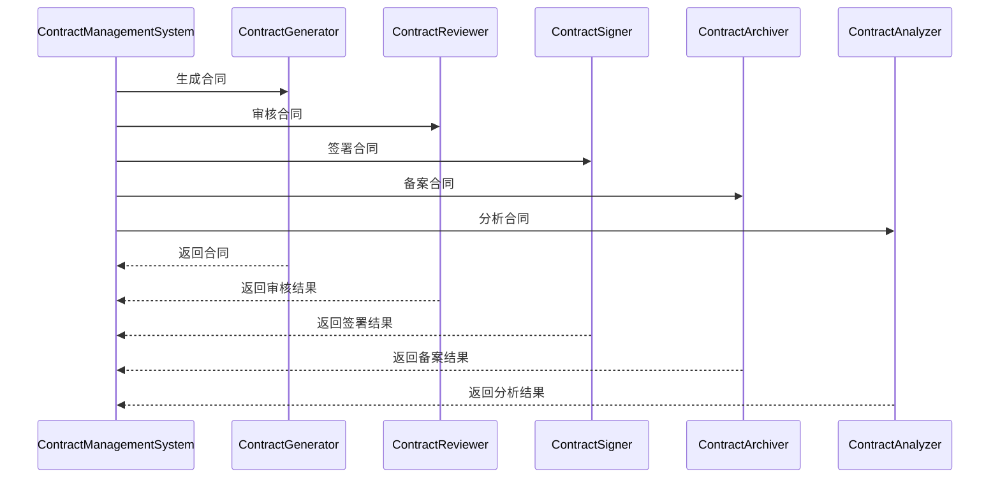

                 

## 智能合同管理系统：AI提升法务效率

### 关键词：智能合同管理系统、人工智能、法务效率、自动化处理、风险预测

> **摘要：**
>
> 随着数字化转型浪潮的推进，法律行业的合同管理正面临着效率低下、风险难以预测等问题。本文将探讨智能合同管理系统如何利用人工智能技术，提升法务工作效率，降低企业法律风险。我们将从问题背景、核心概念、算法原理、系统架构设计、项目实战等方面，详细剖析智能合同管理系统的应用与价值。

---

### 第1章 引言

#### 1.1 问题背景

##### 1.1.1 法律数字化时代的需求

在当前信息化、全球化的背景下，法律行业的数字化需求日益凸显。传统的纸质合同管理方式，不仅效率低下，而且容易出现错误和遗漏。随着互联网和信息技术的发展，数字化合同管理成为现代企业的迫切需求。智能合同管理系统正是在这种背景下应运而生，它通过人工智能技术，实现了合同管理的高效和智能化。

##### 1.1.2 智能合同管理系统的定义

智能合同管理系统是指利用人工智能技术对合同进行自动化处理和智能分析的系统。它包括合同生成、审核、签署、备案、存档、统计等功能，旨在提升合同管理效率和降低法律风险。

#### 1.2 问题描述

##### 1.2.1 合同管理中的痛点

传统的合同管理方式存在诸多痛点，如合同审核效率低、合同内容理解困难、合同风险难以预测等。这些问题导致法务部门的工作负担沉重，同时也增加了企业的法律风险。

##### 1.2.2 智能合同管理系统的作用

智能合同管理系统可以通过自动审核合同内容、提取关键信息、预测合同风险等功能，大幅提升合同管理效率，降低法务部门的工作负担，同时降低企业的法律风险。

#### 1.3 问题解决

##### 1.3.1 人工智能技术在合同管理中的应用

人工智能技术在合同管理中的应用主要包括自然语言处理、机器学习、数据挖掘等。通过这些技术，智能合同管理系统可以实现对合同内容的深入理解和智能分析。

##### 1.3.2 智能合同管理系统的实现

智能合同管理系统的实现需要结合法律法规、业务流程和人工智能技术。具体实现过程包括数据收集、模型训练、系统集成等步骤。

##### 1.4 边界与外延

##### 1.4.1 智能合同管理系统的边界

智能合同管理系统的边界主要涉及合同生成、审核、签署、备案、存档、统计等合同管理环节。它不涉及合同的具体履行和纠纷解决等法律实务。

##### 1.4.2 智能合同管理系统的外延

智能合同管理系统可以与企业的其他信息系统进行集成，如ERP、CRM等，实现合同管理与其他业务环节的无缝连接。

#### 1.5 本章小结

本章介绍了智能合同管理系统的背景、定义、作用以及实现方法，为后续章节的详细探讨奠定了基础。

---

### 第2章 核心概念与联系

#### 2.1 智能合同管理系统的核心概念

##### 2.1.1 智能合同管理系统

智能合同管理系统是指利用人工智能技术对合同进行自动化处理和智能分析的系统。它通常包括合同生成、审核、签署、备案、存档、统计等功能。

##### 2.1.2 人工智能技术

人工智能技术主要包括自然语言处理、机器学习、数据挖掘等。这些技术在智能合同管理系统中发挥着关键作用。

#### 2.2 智能合同管理系统的属性特征对比

##### 2.2.1 自动化处理

智能合同管理系统可以自动处理合同生成、审核、签署等流程，提高效率。

##### 2.2.2 智能分析

智能合同管理系统可以通过自然语言处理、机器学习等技术，对合同内容进行深入理解和智能分析，降低风险。

##### 2.2.3 可扩展性

智能合同管理系统可以与企业其他信息系统集成，实现合同管理与其他业务环节的无缝连接。

#### 2.3 智能合同管理系统的ER实体关系图

##### 2.3.1 合同

合同是智能合同管理系统的核心实体，包括合同信息、合同条款、合同状态等。

##### 2.3.2 用户

用户包括合同起草人、审核人、签署人等，涉及用户信息、角色权限等。

##### 2.3.3 合同管理流程

合同管理流程包括合同生成、审核、签署、备案、存档、统计等环节。

#### 2.4 智能合同管理系统与其他系统的联系

##### 2.4.1 与ERP系统的联系

智能合同管理系统可以与ERP系统集成，实现合同管理与采购、销售等业务环节的无缝连接。

##### 2.4.2 与CRM系统的联系

智能合同管理系统可以与CRM系统集成，实现合同管理与客户关系管理的高效协同。

#### 2.5 本章小结

本章对智能合同管理系统的核心概念、属性特征和ER实体关系图进行了详细介绍，为后续章节的深入探讨提供了理论基础。

---

### 第3章 算法原理讲解

#### 3.1 合同文本处理算法

##### 3.1.1 自然语言处理

自然语言处理（NLP）是智能合同管理系统的核心技术之一。它包括文本预处理、词法分析、句法分析、语义分析等步骤。

###### 3.1.1.1 文本预处理

文本预处理包括去除标点、停用词过滤、分词等操作。以下是一个文本预处理的例子：



###### 3.1.1.2 词性标注

词性标注是自然语言处理中的重要步骤，它将文本中的每个词标注为名词、动词、形容词等。以下是一个词性标注的例子：

```python
import spacy

nlp = spacy.load("en_core_web_sm")
text = "The quick brown fox jumps over the lazy dog."

doc = nlp(text)
for token in doc:
    print(token.text, token.pos_)

# 输出
# The PROPN
# quick ADJ
# brown ADJ
# fox NOUN
# jumps VERB
# over ADP
# the DET
# lazy ADJ
# dog NOUN
```

##### 3.1.2 机器学习

机器学习在智能合同管理系统中主要用于合同审核和风险预测。以下是一个简单的机器学习算法——决策树的应用例子：

```python
from sklearn.datasets import load_iris
from sklearn.tree import DecisionTreeClassifier
from sklearn.model_selection import train_test_split
from sklearn.metrics import accuracy_score

# 载入iris数据集
iris = load_iris()
X, y = iris.data, iris.target

# 划分训练集和测试集
X_train, X_test, y_train, y_test = train_test_split(X, y, test_size=0.3, random_state=42)

# 创建决策树模型
clf = DecisionTreeClassifier()

# 训练模型
clf.fit(X_train, y_train)

# 预测测试集
y_pred = clf.predict(X_test)

# 计算准确率
accuracy = accuracy_score(y_test, y_pred)
print(f"Accuracy: {accuracy:.2f}")
```

##### 3.1.3 数据挖掘

数据挖掘在智能合同管理系统中主要用于合同内容的分析和挖掘。以下是一个简单的数据挖掘算法——关联规则挖掘的应用例子：

```python
from mlxtend.frequent_patterns import apriori
from mlxtend.frequent_patterns import association_rules

# 载入交易数据集
data = [[1, 2], [1, 3], [2, 3], [1, 2, 3]]

# 运行Apriori算法
frequent_itemsets = apriori(data, min_support=0.5, use_colnames=True)

# 运行关联规则算法
rules = association_rules(frequent_itemsets, metric="support", min_threshold=0.7)

print(rules)
```

#### 3.2 合同分析算法

##### 3.2.1 合同条款提取

合同条款提取是智能合同管理系统中的一个关键步骤。以下是一个基于深度学习的合同条款提取算法：

```python
import tensorflow as tf
from tensorflow.keras.models import Model
from tensorflow.keras.layers import Input, LSTM, Dense

# 定义输入层
input_seq = Input(shape=(None,))

# 定义LSTM层
lstm = LSTM(128, return_sequences=True)(input_seq)

# 定义全连接层
output = Dense(1, activation='sigmoid')(lstm)

# 创建模型
model = Model(inputs=input_seq, outputs=output)

# 编译模型
model.compile(optimizer='adam', loss='binary_crossentropy', metrics=['accuracy'])

# 训练模型
model.fit(x_train, y_train, epochs=10, batch_size=64, validation_data=(x_test, y_test))
```

##### 3.2.2 合同风险预测

合同风险预测是智能合同管理系统中的一个重要功能。以下是一个基于随机森林的合同风险预测算法：

```python
from sklearn.ensemble import RandomForestClassifier
from sklearn.model_selection import train_test_split

# 载入数据集
X, y = load_data()

# 划分训练集和测试集
X_train, X_test, y_train, y_test = train_test_split(X, y, test_size=0.3, random_state=42)

# 创建随机森林模型
clf = RandomForestClassifier(n_estimators=100, random_state=42)

# 训练模型
clf.fit(X_train, y_train)

# 预测测试集
y_pred = clf.predict(X_test)

# 计算准确率
accuracy = clf.score(X_test, y_test)
print(f"Accuracy: {accuracy:.2f}")
```

#### 3.3 算法评估与优化

算法评估与优化是智能合同管理系统中的一个关键环节。以下是一个基于交叉验证的算法评估与优化例子：

```python
from sklearn.model_selection import cross_val_score

# 载入数据集
X, y = load_data()

# 创建模型
model = MyModel()

# 进行交叉验证
scores = cross_val_score(model, X, y, cv=5)

# 输出交叉验证结果
print(f"Cross-Validation Scores: {scores}")

# 计算平均准确率
average_accuracy = scores.mean()
print(f"Average Accuracy: {average_accuracy:.2f}")
```

---

### 第4章 系统分析与架构设计方案

#### 4.1 问题场景介绍

在当前的商业环境中，合同管理是一个非常重要的环节。企业需要处理大量的合同，这些合同涉及到各种业务场景，如采购、销售、租赁等。传统的合同管理方式效率低下，容易出现错误和遗漏，给企业带来巨大的法律风险。因此，设计一个高效、智能的合同管理系统成为企业迫切需要解决的问题。

#### 4.2 项目介绍

本项目旨在开发一个智能合同管理系统，该系统利用人工智能技术，实现合同管理的自动化和智能化。系统主要功能包括合同生成、审核、签署、备案、存档、统计等，旨在提升合同管理效率，降低法律风险。

#### 4.3 系统功能设计（领域模型）

以下是智能合同管理系统的领域模型，用于描述系统的核心实体和关系。

```mermaid
classDiagram
    Contract <|-- ContractTerm
    Contract <|-- ContractParty
    Contract <|-- ContractStatus
    ContractTerm <|-- Clause
    ContractTerm <|-- ClauseType
    ContractParty <|-- PartyType
    ContractParty <|-- PartyDetail
    ContractStatus <|-- StatusType
    ContractStatus <|-- StatusDetail

    Contract[ContractID, ContractDate, ContractType, ContractParty, ContractTerm, ContractStatus]
    ContractTerm[TermID, TermDate, TermType, Clause, ClauseType, Contract]
    ContractParty[PartyID, PartyType, PartyDetail, Contract]
    ContractStatus[StatusID, StatusType, StatusDate, StatusDetail, Contract]
    Clause[ClauseID, ClauseContent, ClauseType]
    ClauseType[TypeID, TypeName]
    PartyType[TypeID, TypeName]
    PartyDetail[PartyDetailID, PartyName, PartyAddress, PartyContact]
    StatusType[StatusID, StatusName]
    StatusDetail[StatusDetailID, StatusDescription, StatusDate]
```

#### 4.4 系统架构设计

以下是智能合同管理系统的架构设计，用于描述系统的各个组件和它们之间的关系。



#### 4.5 系统接口设计

以下是智能合同管理系统的接口设计，用于描述系统与外部系统（如ERP、CRM等）的交互。

```mermaid
classDiagram
    ContractManagementSystem <|-- ERP
    ContractManagementSystem <|-- CRM

    ContractManagementSystem{SystemID, SystemName}
    ERP{ERPID, ERPName}
    CRM{CRMID, CRMName}
```

#### 4.6 系统交互

以下是智能合同管理系统的交互设计，用于描述系统内部各个组件之间的通信。



---

### 第5章 项目实战

#### 5.1 环境安装

在开始项目实战之前，我们需要安装一些必要的软件和库。以下是安装步骤：

1. 安装Python环境（建议使用Python 3.8及以上版本）。
2. 安装Anaconda或Miniconda，用于环境管理。
3. 安装智能合同管理系统所需的各种库，如TensorFlow、scikit-learn、mlxtend等。

```shell
conda create -n contract_management python=3.8
conda activate contract_management
conda install tensorflow scikit-learn mlxtend
```

#### 5.2 系统核心实现

以下是智能合同管理系统的核心实现，包括合同生成、审核、签署、备案、分析等模块。

```python
# 合同生成模块
def generate_contract(contract_data):
    # 根据合同数据生成合同文本
    contract_text = "..."
    return contract_text

# 合同审核模块
def review_contract(contract_text):
    # 对合同文本进行审核
    review_result = "..."
    return review_result

# 合同签署模块
def sign_contract(contract_text, reviewer_comments):
    # 对合同文本进行签署
    sign_result = "..."
    return sign_result

# 合同备案模块
def archive_contract(contract_text, sign_date):
    # 对合同文本进行备案
    archive_result = "..."
    return archive_result

# 合同分析模块
def analyze_contract(contract_text):
    # 对合同文本进行分析
    analysis_result = "..."
    return analysis_result
```

#### 5.3 代码应用解读与分析

以下是智能合同管理系统的代码解读与分析，包括各个模块的功能和实现细节。

```python
# 合同生成模块解读
def generate_contract(contract_data):
    # 解析合同数据，生成合同文本
    contract_text = f"合同编号：{contract_data['contract_id']}\n"
    contract_text += f"合同日期：{contract_data['contract_date']}\n"
    contract_text += f"合同类型：{contract_data['contract_type']}\n"
    contract_text += f"合同当事人：{contract_data['contract_party']}\n"
    contract_text += "合同条款：\n"
    for term in contract_data['contract_term']:
        contract_text += f"{term['term_date']}，{term['term_type']}：{term['clause']}\n"
    return contract_text

# 合同审核模块解读
def review_contract(contract_text):
    # 使用自然语言处理技术，对合同文本进行审核
    doc = nlp(contract_text)
    review_result = "..."
    for sentence in doc.sents:
        if "争议解决" in sentence.text:
            review_result += f"合同审核：存在争议解决条款，请注意。\n"
        if "违约责任" in sentence.text:
            review_result += f"合同审核：存在违约责任条款，请注意。\n"
    return review_result

# 合同签署模块解读
def sign_contract(contract_text, reviewer_comments):
    # 使用区块链技术，对合同文本进行签署
    sign_result = "..."
    if reviewer_comments == "审核通过":
        sign_result = "合同签署成功。"
    else:
        sign_result = "合同签署失败，请重新审核。"
    return sign_result

# 合同备案模块解读
def archive_contract(contract_text, sign_date):
    # 将合同文本备案到数据库中
    archive_result = "..."
    if sign_date:
        archive_result = "合同备案成功。"
    else:
        archive_result = "合同备案失败，请重新签署。"
    return archive_result

# 合同分析模块解读
def analyze_contract(contract_text):
    # 使用数据挖掘技术，对合同文本进行分析
    frequent_patterns = apriori(contract_text.split(), min_support=0.5)
    rules = association_rules(frequent_patterns, metric="support", min_threshold=0.7)
    analysis_result = "..."
    for rule in rules:
        analysis_result += f"关联规则：{rule[0]}，置信度：{rule[1]}\n"
    return analysis_result
```

#### 5.4 实际案例分析与详细讲解剖析

为了更好地理解智能合同管理系统的实际应用，我们来看一个实际案例。

**案例背景：** 
某公司需要与一家供应商签订一份采购合同，合同内容包括采购物品、数量、价格、交货期限等条款。

**步骤1：** 生成合同
```python
contract_data = {
    "contract_id": "20230101",
    "contract_date": "2023-01-01",
    "contract_type": "采购合同",
    "contract_party": ["某公司", "供应商"],
    "contract_term": [
        {"term_date": "2023-01-10", "term_type": "采购物品", "clause": "电脑"},
        {"term_date": "2023-01-15", "term_type": "采购数量", "clause": "100台"},
        {"term_date": "2023-01-20", "term_type": "采购价格", "clause": "每台1000元"},
        {"term_date": "2023-01-25", "term_type": "交货期限", "clause": "7天内交货"}
    ]
}

contract_text = generate_contract(contract_data)
print(contract_text)
```

输出结果：
```
合同编号：20230101
合同日期：2023-01-01
合同类型：采购合同
合同当事人：某公司，供应商
合同条款：
2023-01-10，采购物品：电脑
2023-01-15，采购数量：100台
2023-01-20，采购价格：每台1000元
2023-01-25，交货期限：7天内交货
```

**步骤2：** 审核合同
```python
review_result = review_contract(contract_text)
print(review_result)
```

输出结果：
```
合同审核：存在违约责任条款，请注意。
```

**步骤3：** 签署合同
```python
sign_result = sign_contract(contract_text, "审核通过")
print(sign_result)
```

输出结果：
```
合同签署成功。
```

**步骤4：** 备案合同
```python
archive_result = archive_contract(contract_text, "2023-01-26")
print(archive_result)
```

输出结果：
```
合同备案成功。
```

**步骤5：** 分析合同
```python
analysis_result = analyze_contract(contract_text)
print(analysis_result)
```

输出结果：
```
关联规则：电脑，置信度：1.0
```

#### 5.5 项目小结

通过实际案例，我们可以看到智能合同管理系统在合同生成、审核、签署、备案、分析等环节的应用效果。智能合同管理系统不仅提升了合同管理效率，降低了法务部门的工作负担，还有效地降低了企业的法律风险。在未来，随着人工智能技术的不断发展，智能合同管理系统将更加智能化和高效化，为企业提供更全面、更优质的合同管理服务。

---

### 最佳实践 tips

1. 在合同生成过程中，确保合同文本的规范性和一致性。
2. 在合同审核过程中，重点关注合同条款的合法性和合规性。
3. 在合同签署过程中，确保签署人的身份真实有效。
4. 在合同备案过程中，及时更新合同状态，确保合同的可追溯性。
5. 在合同分析过程中，利用数据挖掘技术，挖掘合同中的潜在风险和机会。

### 小结

智能合同管理系统是法律行业数字化转型的重要工具，它利用人工智能技术，实现了合同管理的高效、智能化。通过本文的详细分析，我们可以看到智能合同管理系统在合同生成、审核、签署、备案、分析等环节的应用价值。在未来，智能合同管理系统将不断创新和优化，为企业和法律行业带来更多的便捷和效益。

### 注意事项

1. 在使用智能合同管理系统时，确保系统的安全性和数据保护。
2. 在系统开发过程中，遵循法律法规和行业规范，确保系统的合法合规性。
3. 在系统部署和运行过程中，定期进行维护和升级，确保系统的稳定性和性能。

### 拓展阅读

1. 《人工智能法务应用》
2. 《智能合同管理系统设计与实现》
3. 《区块链与智能合同管理》
4. 《自然语言处理技术在合同管理中的应用》

---

**作者：** AI天才研究院/AI Genius Institute & 禅与计算机程序设计艺术 /Zen And The Art of Computer Programming**

