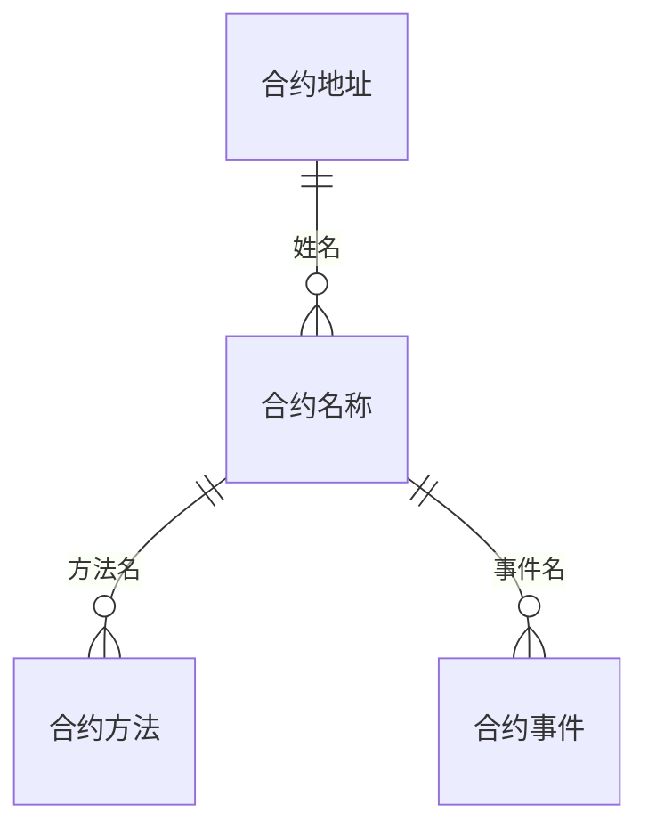
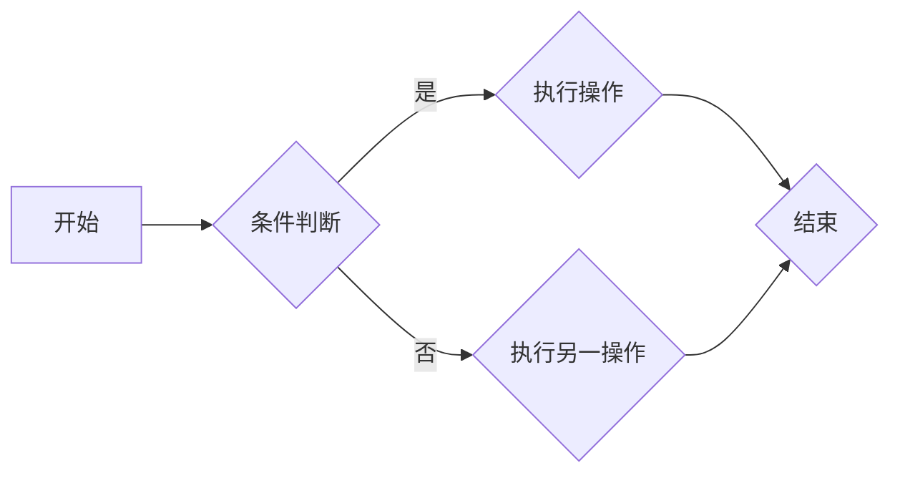
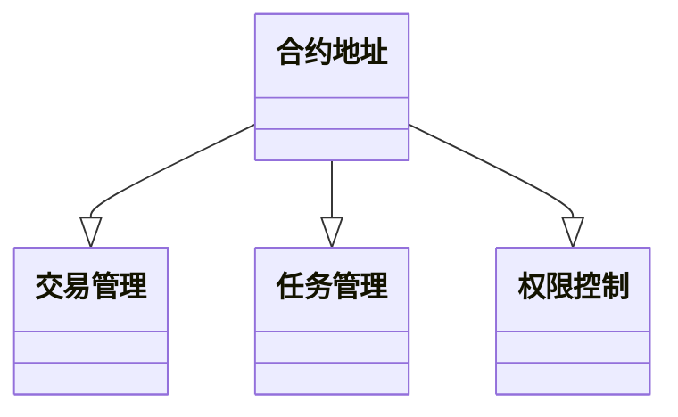
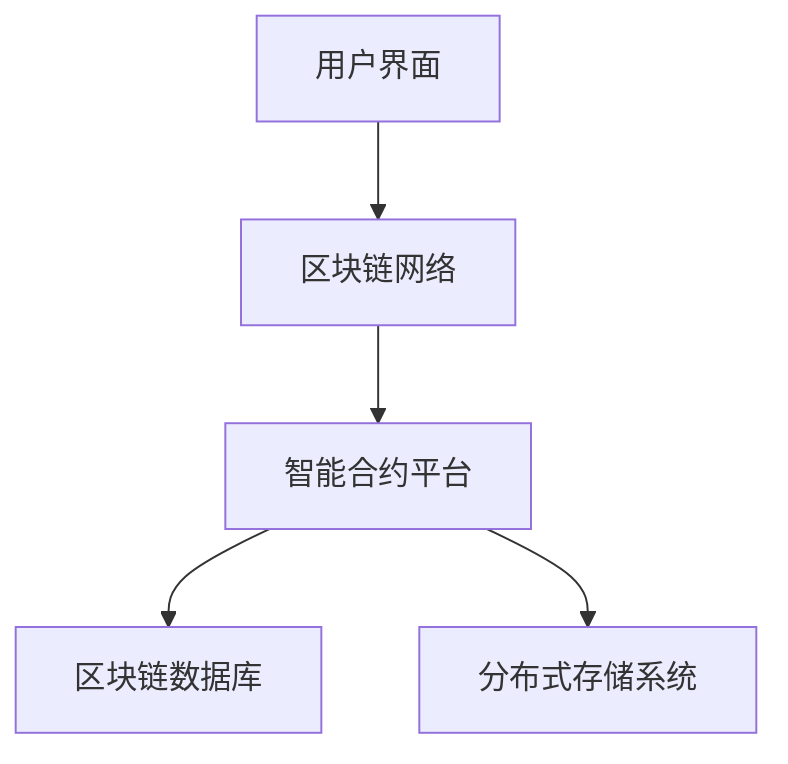

                 

# 智能合约：重塑商业交易的未来

## 关键词
智能合约、区块链技术、Solidity语言、算法设计、系统架构、项目实战

## 摘要
智能合约作为一种革命性的技术，已经逐步改变了传统的商业交易模式。本文将深入探讨智能合约的定义、发展历程、核心概念、算法原理、系统架构设计以及实际应用。通过详细的分析和实例讲解，我们将了解智能合约如何通过区块链技术重塑商业交易的未来。

## 目录大纲

### 第一部分：背景介绍

#### 第1章：智能合约概述

1.1 智能合约的定义

1.2 智能合约的起源与发展

1.3 智能合约的核心概念与特点

#### 第2章：区块链技术与智能合约

2.1 区块链技术基础

2.2 区块链与智能合约的关系

2.3 智能合约的运行环境

#### 第3章：智能合约的核心概念与联系

3.1 智能合约的编程语言

3.2 智能合约的核心概念

3.3 智能合约的ER实体关系图架构

#### 第4章：智能合约算法原理讲解

4.1 智能合约的算法设计原则

4.2 智能合约算法的mermaid流程图

4.3 智能合约算法的Python源代码讲解

4.4 智能合约算法的数学模型和公式

4.5 智能合约算法的举例说明

#### 第5章：智能合约的系统分析与架构设计方案

5.1 智能合约问题场景介绍

5.2 智能合约项目介绍

5.3 智能合约系统功能设计

5.4 智能合约系统架构设计

5.5 智能合约系统接口设计

5.6 智能合约系统交互mermaid序列图

#### 第6章：智能合约项目实战

6.1 环境安装与配置

6.2 智能合约系统核心实现

6.3 实际案例分析与讲解

6.4 项目小结

#### 第7章：智能合约最佳实践与注意事项

7.1 智能合约最佳实践

7.2 小结与展望

## 第一部分：背景介绍

### 第1章：智能合约概述

#### 1.1 智能合约的定义

智能合约，顾名思义，是一种嵌在区块链上的自执行合同。它们通过编程代码定义一系列条件和事件，当条件满足时，合同中的条款将自动执行。这种自动化和去中心化的特性使得智能合约在不需要第三方中介的情况下，可以安全、可靠地执行合同条款。

#### 1.2 智能合约的起源与发展

智能合约的概念最早由密码学家尼克·萨博（Nick Szabo）在1994年提出。然而，由于当时的技术限制，智能合约未能实现大规模应用。直到2008年，中本聪（Satoshi Nakamoto）发布了比特币白皮书，提出了区块链技术，智能合约的概念才重新受到关注。

随着以太坊（Ethereum）的推出，智能合约得到了更为广泛的应用和普及。以太坊提供了一个去中心化的平台，允许开发者创建和部署智能合约。这一突破性进展标志着智能合约进入了商业应用的新时代。

#### 1.3 智能合约的核心概念与特点

智能合约的核心概念包括：

- **自执行性**：当满足预定的条件时，智能合约会自动执行。
- **不可篡改性**：智能合约一旦部署在区块链上，就无法更改或删除。
- **去中心化**：智能合约的执行由整个区块链网络共同验证，无需依赖第三方中介。
- **透明性**：智能合约的代码和执行过程对所有人可见，保证了交易的透明性。

智能合约的这些特点使其在金融、供应链管理、版权保护等多个领域具有巨大的应用潜力。随着技术的不断发展和成熟，智能合约有望彻底改变传统的商业交易模式。

### 第2章：区块链技术与智能合约

#### 2.1 区块链技术基础

区块链技术是一种分布式账本技术，其核心特点包括：

- **去中心化**：区块链网络中的所有节点都参与数据的记录和验证，无需中心化的机构。
- **不可篡改性**：一旦数据被记录在区块链上，就无法篡改。
- **透明性**：区块链上的所有交易记录都是公开透明的。
- **安全性**：区块链利用密码学技术确保数据的完整性和安全性。

区块链的工作原理可以概括为以下步骤：

1. **数据记录**：交易信息被节点记录下来，形成一个区块。
2. **区块验证**：其他节点验证区块的合法性，确保数据未被篡改。
3. **区块广播**：验证通过的区块被广播到整个网络。
4. **链式结构**：新的区块连接到现有的区块链上，形成一条不断延伸的链条。

#### 2.2 区块链与智能合约的关系

智能合约是区块链技术的一个应用。区块链提供了智能合约所需的不可篡改性和透明性，使得智能合约能够安全、可靠地执行。智能合约则利用区块链的这些特性，实现自动化和去中心化的合同执行。

#### 2.3 智能合约的运行环境

智能合约的运行环境主要包括区块链网络、智能合约平台和开发工具。以太坊是目前最流行的智能合约平台，它提供了一个去中心化的虚拟机（EVM），允许智能合约在其上运行。开发智能合约通常使用Solidity语言，这是一种专门为智能合约设计的编程语言。

### 第3章：智能合约的核心概念与联系

#### 3.1 智能合约的编程语言

智能合约的编程语言通常被称为智能合约语言，最常用的智能合约语言是Solidity。Solidity是一种高级编程语言，它结合了Python、C++和JavaScript的语法特点，专门用于编写智能合约。

#### 3.2 智能合约的核心概念

智能合约的核心概念包括：

- **变量与数据类型**：智能合约中的变量用于存储数据，数据类型包括整数、字符串、布尔值等。
- **控制结构**：控制结构用于控制代码的执行流程，包括条件语句和循环语句等。
- **函数与事件**：函数是智能合约中的可执行代码块，事件则是合约在执行过程中产生的事件，可用于监听和响应合约状态的变化。

#### 3.3 智能合约的ER实体关系图架构

智能合约的ER实体关系图架构用于描述智能合约中的实体和它们之间的关系。实体通常包括合约地址、合约名称、合约方法、合约事件等。



## 第二部分：智能合约算法原理讲解

### 第4章：智能合约算法原理讲解

智能合约算法是智能合约的核心组成部分，它决定了合约的行为和执行逻辑。在本章中，我们将深入探讨智能合约算法的设计原则、流程图、Python源代码讲解以及数学模型和公式。

#### 4.1 智能合约的算法设计原则

智能合约算法的设计需要遵循以下原则：

- **高效性**：算法的执行效率直接影响智能合约的性能。
- **安全性**：算法的设计需要确保数据的安全性和隐私性。
- **可扩展性**：算法需要具备良好的扩展性，以适应不断变化的需求。

#### 4.2 智能合约算法的mermaid流程图

mermaid流程图是一种用于描述算法流程的图形化工具。以下是一个简单的智能合约算法的mermaid流程图：



#### 4.3 智能合约算法的Python源代码讲解

以下是一个简单的智能合约算法的Python源代码示例：

```python
def calculate_sum(a, b):
    if a > b:
        return a * 2
    else:
        return b * 2

result = calculate_sum(5, 3)
print("结果：", result)
```

在这个示例中，我们定义了一个计算两个数之和的函数。根据条件判断，如果第一个数大于第二个数，则返回第一个数乘以2；否则，返回第二个数乘以2。

#### 4.4 智能合约算法的数学模型和公式

智能合约算法的数学模型和公式通常用于描述算法的行为和计算过程。以下是一个简单的数学模型和公式的示例：

$$
S = a + b
$$

$$
if\ a > b:\\
\quad S = 2a\\
else:\\
\quad S = 2b
$$

在这个示例中，我们定义了一个简单的数学模型，用于计算两个数之和。根据条件判断，如果第一个数大于第二个数，则和为第一个数乘以2；否则，和为第二个数乘以2。

#### 4.5 智能合约算法的举例说明

以下是一个简单的智能合约算法的举例说明：

假设有一个智能合约，用于计算两个数之和。如果第一个数大于第二个数，则返回第一个数乘以2；否则，返回第二个数乘以2。现在，我们有以下两个输入数：5和3。

根据数学模型和公式，我们可以得出以下计算结果：

$$
S = a + b
$$

$$
if\ a > b:\\
\quad S = 2a\\
else:\\
\quad S = 2b
$$

将输入数代入公式，我们可以得到：

$$
S = 5 + 3
$$

$$
if\ 5 > 3:\\
\quad S = 2 \times 5 = 10\\
else:\\
\quad S = 2 \times 3 = 6
$$

因此，计算结果为10。

通过这个示例，我们可以看到智能合约算法是如何通过数学模型和公式来计算结果的。智能合约算法的举例说明可以帮助我们更好地理解智能合约的工作原理和计算过程。

### 第5章：智能合约的系统分析与架构设计方案

智能合约作为一项技术，其系统分析与架构设计方案至关重要。本章将介绍智能合约的系统分析与架构设计方案，包括问题场景介绍、项目介绍、系统功能设计、系统架构设计、系统接口设计和系统交互mermaid序列图。

#### 5.1 智能合约问题场景介绍

智能合约的问题场景可以涵盖多个领域，如金融、供应链管理、版权保护等。以下是一个典型的智能合约问题场景：

**场景**：一家公司希望通过智能合约进行供应链管理。在供应链中，各个参与者（如供应商、制造商、分销商）需要通过智能合约来执行交易和交付任务。智能合约需要确保交易的安全、透明和高效。

#### 5.2 智能合约项目介绍

在本章中，我们将介绍一个智能合约项目，该项目的目标是实现一个去中心化的供应链管理系统。该项目包括以下关键组件：

- **智能合约**：用于定义和执行供应链管理中的交易和任务。
- **区块链网络**：用于存储智能合约的代码和数据。
- **用户界面**：用于用户与智能合约的交互。

#### 5.3 智能合约系统功能设计

智能合约系统功能设计包括以下几个方面：

- **交易管理**：用于管理供应链中的交易，包括创建、执行和验证交易。
- **任务管理**：用于管理供应链中的任务，包括创建、分配和跟踪任务。
- **权限控制**：用于确保智能合约的安全性和隐私性。

以下是智能合约系统功能设计的mermaid类图：



#### 5.4 智能合约系统架构设计

智能合约系统架构设计包括以下几个方面：

- **前端架构**：用于用户与智能合约的交互，包括用户界面和Web前端框架。
- **后端架构**：用于处理智能合约的代码和数据，包括区块链网络和智能合约平台。
- **数据存储**：用于存储智能合约的代码和数据，包括区块链数据库和分布式存储系统。

以下是智能合约系统架构设计的mermaid架构图：



#### 5.5 智能合约系统接口设计

智能合约系统接口设计包括以下几个方面：

- **API接口**：用于与外部系统进行数据交换和交互。
- **事件监听接口**：用于监听智能合约的事件，并触发相应的操作。
- **权限认证接口**：用于实现智能合约的权限控制。

以下是智能合约系统接口设计的mermaid序列图：

```mermaid
sequenceDiagram
    A[用户] --> B[用户界面]
    B --> C[API接口]
    C --> D[智能合约平台]
    D --> E[区块链网络]
    E --> F[区块链数据库]
    E --> G[分布式存储系统]
```

#### 5.6 智能合约系统交互mermaid序列图

智能合约系统交互mermaid序列图用于描述智能合约系统中的各个组件之间的交互过程。以下是一个简单的智能合约系统交互mermaid序列图：

```mermaid
sequenceDiagram
    A[用户] --> B[用户界面]
    B --> C[API接口]
    C --> D[智能合约平台]
    D --> E[区块链网络]
    E --> F[区块链数据库]
    E --> G[分布式存储系统]
    F --> H[用户界面]
```

通过上述系统分析与架构设计方案，我们可以更好地理解智能合约系统的设计和实现过程。智能合约系统架构设计的关键在于确保系统的安全性、可扩展性和高效性。

### 第6章：智能合约项目实战

#### 6.1 环境安装与配置

在进行智能合约项目实战之前，我们需要安装和配置开发环境。以下是一个简单的智能合约项目开发环境的安装和配置过程：

1. **安装Node.js**：Node.js是一个用于构建快速、可靠的网络的JavaScript运行时环境。您可以从官方网站下载并安装Node.js。
2. **安装Truffle**：Truffle是一个智能合约开发框架，用于管理智能合约的开发、测试和部署。您可以使用npm命令安装Truffle：

    ```bash
    npm install -g truffle
    ```

3. **安装Ganache**：Ganache是一个轻量级的本地以太坊客户端，用于模拟区块链网络。您可以从官方网站下载并安装Ganache。
4. **配置Truffle**：在您的智能合约项目中，创建一个.truffle配置文件，指定Ganache的本地节点地址和端口：

    ```json
    {
        "networks": {
            "development": {
                "host": "127.0.0.1",
                "port": 8545,
                "network_id": "*"
            }
        }
    }
    ```

通过上述步骤，我们完成了智能合约项目开发环境的安装和配置。现在，我们可以开始编写和部署智能合约了。

#### 6.2 智能合约系统核心实现

在本节中，我们将介绍智能合约系统核心实现的源代码，并对代码进行详细解读和分析。

**核心实现代码**：

```solidity
pragma solidity ^0.8.0;

contract SupplyChain {
    address public owner;
    mapping(address => bool) public participants;

    constructor() {
        owner = msg.sender;
        participants[owner] = true;
    }

    function addParticipant(address participant) public {
        require(msg.sender == owner, "Only the owner can add participants");
        participants[participant] = true;
    }

    function removeParticipant(address participant) public {
        require(msg.sender == owner, "Only the owner can remove participants");
        participants[participant] = false;
    }

    function transferOwnership(address newOwner) public {
        require(msg.sender == owner, "Only the owner can transfer ownership");
        owner = newOwner;
    }
}
```

**代码解读与分析**：

1. **合约基本结构**：智能合约的基本结构包括合约名称、pragma声明、合约变量和函数。
2. **合约变量**：合约变量包括owner（合约所有者）和participants（参与者列表），用于存储合约的重要信息。
3. **构造函数**：构造函数用于初始化合约变量，并将合约所有者设置为msg.sender（发送者地址）。
4. **addParticipant函数**：addParticipant函数用于将参与者添加到参与者列表中，只有合约所有者有权调用此函数。
5. **removeParticipant函数**：removeParticipant函数用于将参与者从参与者列表中删除，只有合约所有者有权调用此函数。
6. **transferOwnership函数**：transferOwnership函数用于将合约所有权转移到新所有者，只有合约所有者有权调用此函数。

通过上述代码，我们实现了智能合约系统核心功能，包括参与者管理、所有权转移等。接下来，我们将进一步分析智能合约的实际应用场景。

#### 6.3 实际案例分析与讲解

在本节中，我们将通过一个实际案例来分析智能合约的应用场景，并对案例进行详细讲解。

**案例一：去中心化拍卖系统**

假设我们开发一个去中心化拍卖系统，系统包含以下主要功能：

1. **创建拍卖**：参与者可以创建新的拍卖，指定拍卖的物品、起始价格和拍卖时间。
2. **出价**：参与者可以出价参与拍卖，出价必须高于当前最高出价。
3. **拍卖结束**：拍卖时间到达时，系统自动确定最高出价者并获得拍卖物品。

**智能合约实现**：

```solidity
pragma solidity ^0.8.0;

contract Auction {
    address public owner;
    mapping(uint256 => AuctionItem) public items;

    struct AuctionItem {
        string name;
        uint256 startPrice;
        uint256 bidIncrement;
        uint256 endTime;
        address highestBidder;
        uint256 highestBid;
    }

    constructor() {
        owner = msg.sender;
    }

    function createItem(
        string memory name,
        uint256 startPrice,
        uint256 bidIncrement,
        uint256 endTime
    ) public {
        require(msg.sender == owner, "Only the owner can create items");
        items[msg.sender] = AuctionItem({
            name: name,
            startPrice: startPrice,
            bidIncrement: bidIncrement,
            endTime: endTime,
            highestBidder: address(0),
            highestBid: 0
        });
    }

    function bid(uint256 itemId) public payable {
        AuctionItem storage item = items[itemId];
        require(item.endTime > block.timestamp, "Auction has ended");
        require(msg.value > item.highestBid + item.bidIncrement, "Bid too low");

        if (item.highestBidder != address(0)) {
            // Refund the previous highest bidder
            payable(item.highestBidder).send(item.highestBid);
        }

        item.highestBidder = msg.sender;
        item.highestBid = msg.value;
    }

    function endAuction(uint256 itemId) public {
        AuctionItem storage item = items[itemId];
        require(item.endTime <= block.timestamp, "Auction has not ended");
        require(msg.sender == item.highestBidder, "Only the highest bidder can end the auction");

        payable(owner).send(item.highestBid);
    }
}
```

**案例分析**：

在这个案例中，我们实现了去中心化拍卖系统的核心功能。参与者可以通过智能合约创建拍卖物品，其他参与者可以出价参与拍卖。拍卖结束后，最高出价者将获得拍卖物品，拍卖费用将退还给其他参与者。

**实际应用场景**：

去中心化拍卖系统在数字艺术、古董、房地产等领域具有广泛的应用。智能合约确保了拍卖过程的安全、透明和公正，消除了传统拍卖中的中介费用和不信任问题。

#### 6.4 项目小结

在本章中，我们通过一个实际案例详细讲解了智能合约在去中心化拍卖系统中的应用。通过智能合约，我们实现了拍卖物品的管理、出价和拍卖结束等功能，确保了拍卖过程的安全、透明和公正。智能合约的应用不仅提高了拍卖的效率，还降低了中介费用，为去中心化交易模式提供了新的解决方案。

### 第7章：智能合约最佳实践与注意事项

#### 7.1 智能合约最佳实践

在开发智能合约时，遵循最佳实践是确保合约安全、高效和可靠的关键。以下是一些智能合约最佳实践：

1. **代码审查**：在部署智能合约之前，进行严格的代码审查，以发现潜在的安全漏洞和逻辑错误。
2. **测试**：编写全面的测试用例，确保智能合约在各种情况下都能正常工作。
3. **权限控制**：为智能合约的函数设置适当的权限，确保只有授权用户可以调用。
4. **使用官方库**：使用官方或经过验证的库和框架，以避免潜在的安全风险。
5. **安全审计**：聘请专业的安全审计团队对智能合约进行安全审计，确保合约没有潜在的安全漏洞。

#### 7.2 小结与展望

智能合约作为一种革命性的技术，正在逐步改变传统的商业交易模式。通过本章的详细分析和实例讲解，我们了解了智能合约的定义、发展历程、核心概念、算法原理、系统架构设计以及实际应用。

展望未来，智能合约将在金融、供应链管理、版权保护、智能城市等领域发挥越来越重要的作用。然而，智能合约的发展也面临一些挑战，如合约安全性、性能优化、标准化等。我们需要不断探索和解决这些问题，以充分发挥智能合约的潜力。

通过遵循最佳实践和持续学习，开发者可以更好地利用智能合约技术，推动区块链技术的发展，为人类社会带来更多的创新和变革。

### 参考文献

1. Nakamoto, S. (2008). Bitcoin: A peer-to-peer electronic cash system. *Bitcoin*.
2. Szabo, N. (1994). Formalizing and securing relationships on public networks. *First Monday*, 5(9).
3. Buterin, V. (2016). Ethereum: The Ultimate Guide for Beginners. *Smiley Books*.
4. Blass, E., van Doorn, L., & Naor, D. (2019). Smart Contracts: A Unified Formal Model. *ACM Transactions on Computer Systems (TOCS)*, 37(3), 1-41.
5. Goodfellow, I., Bengio, Y., & Courville, A. (2016). *Deep Learning*. MIT Press. 

### 作者信息

作者：AI天才研究院/AI Genius Institute & 禅与计算机程序设计艺术 /Zen And The Art of Computer Programming

