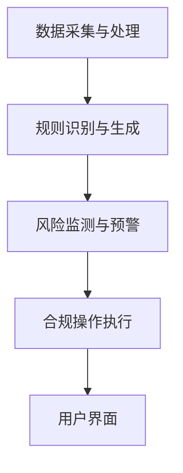
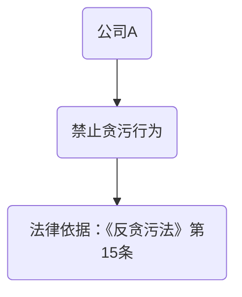
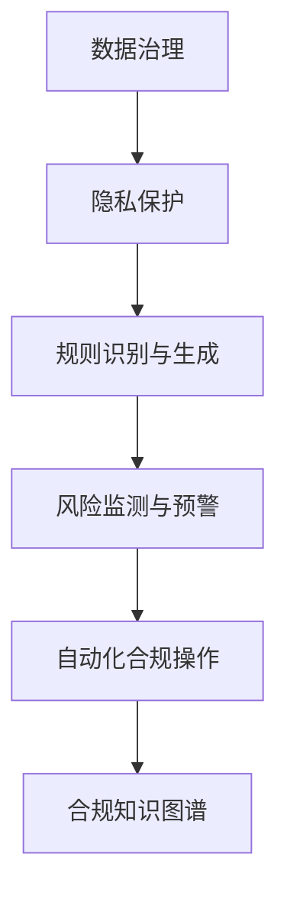
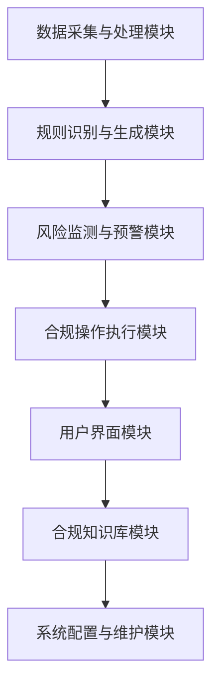

                 

# 智能合规管理系统：AI确保监管要求满足

> 关键词：智能合规管理、人工智能、监管要求、系统架构、算法实现、最佳实践

> 摘要：本文深入探讨了智能合规管理系统的构建与应用。通过分析监管环境的变化与合规挑战，探讨了智能合规管理的核心概念和技术。随后，本文详细介绍了基于人工智能（AI）的合规管理系统架构设计、实现方法、风险管理和最佳实践，以帮助企业和组织更好地应对合规要求。

### 目录

## 第一部分：智能合规管理概述

### 第1章：智能合规管理背景与挑战

### 第2章：智能合规管理核心概念

## 第二部分：AI确保监管要求的实现

### 第3章：AI技术基础

### 第4章：智能合规管理系统架构设计

### 第5章：合规规则识别与自动生成

### 第6章：智能合规监控与评估

### 第7章：合规风险管理与应对策略

### 第8章：智能合规管理最佳实践

## 附录：相关技术深度探讨与源代码实现

### 附录A：机器学习算法原理与实现

### 附录B：深度学习模型训练与优化

### 附录C：合规规则自动生成工具

## 作者

### 文章标题：智能合规管理系统：AI确保监管要求满足

在数字化时代，金融、保险、医疗等行业的合规要求日益严格。智能合规管理系统作为应对这些挑战的有效工具，正逐渐受到广泛关注。本文将带领读者深入了解智能合规管理系统的构建与应用，特别是如何利用人工智能（AI）技术确保监管要求的满足。

智能合规管理系统是一个集成了数据治理、机器学习、自然语言处理等技术的综合平台，旨在通过自动化手段识别、监控和应对合规风险。它不仅能够帮助企业和组织降低合规成本，还能提升合规效率，从而更好地保护企业利益和客户权益。

### 第1章：智能合规管理背景与挑战

#### 1.1.1 智能合规管理的定义

智能合规管理是指利用先进的技术手段，如人工智能、大数据分析等，对企业的运营过程进行实时监控和分析，以确保其业务操作符合相关法律法规和行业规范。它不仅包括对现有合规政策的遵守，还涉及到对潜在风险的前瞻性识别和应对。

#### 1.1.2 监管环境的变化与合规挑战

随着全球金融监管体系的不断完善，各行业的合规要求也在不断升级。例如，金融行业的《巴塞尔协议》、保险行业的《保险法》以及医疗行业的《隐私保护法》等，都对企业和组织的合规操作提出了更高的要求。此外，全球化、互联网技术的发展，也为合规管理带来了新的挑战。

#### 1.1.3 智能合规管理的重要性

智能合规管理系统的重要性体现在以下几个方面：

1. **降低合规成本**：通过自动化手段，智能合规管理系统能够提高合规操作的效率，减少人工干预，从而降低合规成本。
2. **提高合规效率**：智能合规管理系统可以实时监控业务操作，及时发现并纠正违规行为，确保合规要求的满足。
3. **增强风险识别能力**：智能合规管理系统利用大数据分析和机器学习技术，可以更准确地识别潜在风险，提供更全面的合规防护。
4. **提升企业声誉**：合规操作是维护企业声誉的重要环节，智能合规管理系统有助于提升企业的合规水平，增强市场竞争力。

### 第2章：智能合规管理核心概念

#### 2.1.1 数据治理与隐私保护

数据治理是指对数据的收集、存储、处理和使用进行规范化管理，以确保数据的质量、完整性和安全性。隐私保护则是确保个人信息不被未经授权的第三方访问或使用。

#### 2.1.2 AI在合规管理中的应用

人工智能在合规管理中的应用主要体现在以下几个方面：

1. **规则识别与生成**：通过机器学习和自然语言处理技术，智能合规管理系统可以自动识别和生成合规规则。
2. **风险监测与预警**：利用大数据分析技术，智能合规管理系统可以实时监控业务操作，识别潜在风险，并发出预警。
3. **自动化合规操作**：通过自动化技术，智能合规管理系统可以自动执行合规操作，减少人工干预。

#### 2.1.3 智能合规管理的关键技术

智能合规管理的关键技术包括：

1. **机器学习**：用于规则识别、风险监测和预测等任务。
2. **自然语言处理**：用于处理文本数据，如法律法规、政策文件等。
3. **数据挖掘**：用于分析海量数据，提取有价值的信息。
4. **区块链技术**：用于确保数据的安全性和可追溯性。

### 第3章：AI技术基础

#### 3.1.1 机器学习与深度学习简介

机器学习是一种使计算机系统能够从数据中学习并改进自身性能的技术。深度学习是机器学习的一种特殊形式，通过多层神经网络对数据进行建模。

#### 3.1.2 主流AI算法概述

主流AI算法包括：

1. **监督学习**：通过已标记的数据训练模型，然后使用模型对新数据进行预测。
2. **无监督学习**：不使用标记数据，通过发现数据中的模式和关联来训练模型。
3. **强化学习**：通过试错和奖励机制来训练模型。

#### 3.1.3 AI伦理与合规

AI伦理与合规是确保AI技术应用符合道德和法律规定的重要环节。它涉及：

1. **公平性**：确保AI系统不因种族、性别、年龄等因素产生歧视。
2. **透明性**：确保AI系统的决策过程透明，易于理解。
3. **隐私保护**：确保AI系统在处理个人数据时符合隐私保护法规。

### 第4章：智能合规管理系统架构设计

#### 4.1.1 系统设计原则

智能合规管理系统设计应遵循以下原则：

1. **模块化**：系统应具有清晰的模块划分，便于维护和扩展。
2. **可扩展性**：系统应能够适应未来合规要求的升级。
3. **高可用性**：系统应具备良好的容错能力，确保持续运行。
4. **安全性**：系统应具备完善的防护措施，确保数据安全。

#### 4.1.2 系统功能模块划分

智能合规管理系统通常包括以下功能模块：

1. **数据采集与处理**：负责采集业务数据，并进行预处理。
2. **规则识别与生成**：负责识别和生成合规规则。
3. **风险监测与预警**：负责监测业务操作，识别潜在风险，并发出预警。
4. **合规操作执行**：负责自动化执行合规操作。
5. **用户界面**：提供用户交互接口，便于操作和管理。

#### 4.1.3 系统架构图与描述

智能合规管理系统的架构图如下：

系统描述：数据采集与处理模块负责采集业务数据，并进行预处理，以便后续分析。规则识别与生成模块通过机器学习和自然语言处理技术，自动识别和生成合规规则。风险监测与预警模块实时监控业务操作，识别潜在风险，并发出预警。合规操作执行模块负责自动化执行合规操作。用户界面模块提供用户交互接口，便于操作和管理。

### 第5章：合规规则识别与自动生成

#### 5.1.1 合规规则识别技术

合规规则识别技术主要利用机器学习和自然语言处理技术，从法律法规、政策文件等文本数据中提取合规规则。其过程包括：

1. **文本预处理**：对文本数据进行清洗、分词、去停用词等操作，提高数据质量。
2. **实体识别**：识别文本中的关键实体，如法律法规名称、条款、关键词等。
3. **关系抽取**：抽取实体之间的关系，如“某条款规定某行为违法”。
4. **规则生成**：根据实体识别和关系抽取结果，生成合规规则。

#### 5.1.2 合规规则自动生成方法

合规规则自动生成方法主要包括：

1. **规则抽取**：从已有数据中直接提取规则。
2. **规则归纳**：通过机器学习算法，从样本数据中归纳出规则。
3. **规则生成网络**：结合规则抽取和归纳，生成更加精确的规则。

#### 5.1.3 合规规则示例

以下是一个合规规则的示例：

规则描述：公司A禁止贪污行为，依据《反贪污法》第15条。

### 第6章：智能合规监控与评估

#### 6.1.1 监控数据采集与处理

监控数据采集与处理包括：

1. **数据采集**：从企业业务系统、数据库、日志等渠道采集数据。
2. **数据预处理**：对采集到的数据进行清洗、格式化等操作。
3. **数据存储**：将预处理后的数据存储到数据仓库或数据库中。

#### 6.1.2 监控模型设计与实现

监控模型设计包括：

1. **特征提取**：从原始数据中提取有助于判断合规性的特征。
2. **模型选择**：选择适合的机器学习算法，如决策树、支持向量机等。
3. **模型训练与验证**：使用训练数据集训练模型，并使用验证数据集评估模型性能。

#### 6.1.3 评估方法与指标

评估方法与指标包括：

1. **准确率**：正确识别合规与否的比例。
2. **召回率**：识别出合规情况的比例。
3. **F1分数**：准确率和召回率的调和平均数。

### 第7章：合规风险管理与应对策略

#### 7.1.1 风险识别与评估

风险识别与评估包括：

1. **风险识别**：通过数据分析和风险评估模型，识别潜在风险。
2. **风险评估**：对识别出的风险进行定量或定性评估。

#### 7.1.2 风险应对策略

风险应对策略包括：

1. **风险规避**：通过调整业务操作，避免风险的发生。
2. **风险转移**：通过保险等方式，将风险转移给第三方。
3. **风险接受**：在风险可控的范围内，接受风险。

#### 7.1.3 合规风险管理案例

以下是一个合规风险管理案例：

某金融公司发现其客户信息存在泄露风险。经过评估，公司决定采取以下措施：

1. **加强网络安全防护**：升级防火墙和入侵检测系统。
2. **加密客户信息**：对客户信息进行加密存储。
3. **定期审计**：定期对客户信息访问和操作进行审计。

### 第8章：智能合规管理最佳实践

#### 8.1.1 最佳实践总结

最佳实践总结包括：

1. **建立合规文化**：培养员工的合规意识，形成合规文化。
2. **持续监控与改进**：定期评估合规管理系统的性能，不断优化。
3. **跨部门协作**：合规管理涉及多个部门，需要跨部门协作。

#### 8.1.2 注意事项与挑战

注意事项与挑战包括：

1. **数据隐私保护**：确保在合规管理过程中，个人数据的隐私保护。
2. **法律法规更新**：及时关注法律法规的更新，确保合规要求得到满足。
3. **技术升级**：随着技术发展，合规管理系统需要不断升级。

#### 8.1.3 拓展阅读与展望

拓展阅读与展望包括：

1. **人工智能在合规管理中的应用**：探讨人工智能在合规管理中的最新应用和研究方向。
2. **区块链在合规管理中的作用**：分析区块链技术在确保数据安全和可追溯性方面的作用。

### 附录：相关技术深度探讨与源代码实现

#### 附录A：机器学习算法原理与实现

#### 附录B：深度学习模型训练与优化

#### 附录C：合规规则自动生成工具

### 作者

作者：AI天才研究院/AI Genius Institute & 禅与计算机程序设计艺术 /Zen And The Art of Computer Programming

### 第1章：智能合规管理背景与挑战

#### 1.1.1 智能合规管理的定义

智能合规管理是指通过运用人工智能（AI）、大数据分析、区块链等先进技术，对企业的各项业务活动进行实时监控、分析和评估，以确保其业务操作符合相关法律法规、行业规范以及内部管理要求。这种管理方式不仅关注现有合规要求的执行情况，还具备前瞻性，能够预判和预防潜在合规风险。

在传统合规管理中，企业往往依赖人工审查、定期审计等手段来确保合规性。然而，随着业务规模的扩大和数据量的增加，这种模式变得越来越低效，且容易遗漏风险点。智能合规管理系统的出现，有效地解决了这些问题，通过自动化、智能化的手段，提高了合规管理的效率和准确性。

#### 1.1.2 监管环境的变化与合规挑战

监管环境的变化对企业的合规管理提出了新的要求。首先，全球化和互联网技术的发展使得企业面临更加复杂的国际监管环境。不同国家和地区对同一问题的监管标准和要求可能存在差异，这要求企业具备更高的合规敏感度和适应能力。

其次，法律法规的更新速度加快。例如，金融行业的《巴塞尔协议》和《反洗钱法》等，保险行业的《保险法》和《消费者权益保护法》等，医疗行业的《隐私保护法》和《药品管理法》等，都频繁修订，企业需要及时跟踪和适应这些变化。

此外，数据隐私和安全问题日益突出。随着大数据和云计算的普及，企业的数据量呈现爆炸式增长，如何在确保数据隐私和安全的同时，实现合规操作，成为企业面临的一大挑战。

#### 1.1.3 智能合规管理的重要性

智能合规管理的重要性体现在以下几个方面：

1. **降低合规成本**：智能合规管理系统通过自动化技术，可以减少人工干预，提高合规操作的效率，从而降低合规成本。

2. **提高合规效率**：智能合规管理系统可以对业务操作进行实时监控，快速识别违规行为，并及时采取纠正措施，提高合规效率。

3. **增强风险识别能力**：智能合规管理系统利用大数据分析和机器学习技术，可以更准确地识别潜在风险，提供更全面的合规防护。

4. **提升企业声誉**：合规操作是维护企业声誉的重要环节，智能合规管理系统有助于提升企业的合规水平，增强市场竞争力。

5. **支持决策制定**：智能合规管理系统可以为管理层提供实时的合规数据和分析报告，支持决策制定，提高企业应对合规挑战的能力。

#### 1.1.4 智能合规管理的发展历程

智能合规管理的发展可以分为以下几个阶段：

1. **早期阶段**：主要是通过计算机技术和数据库管理系统，对合规数据进行存储和管理，实现基本的自动化操作。

2. **中期阶段**：引入了数据分析和挖掘技术，能够对合规数据进行分析，识别潜在的合规风险。

3. **当前阶段**：随着人工智能技术的发展，智能合规管理系统开始运用机器学习和深度学习等技术，实现更高级别的自动化和智能化。

#### 1.1.5 智能合规管理的未来趋势

智能合规管理的未来趋势将体现在以下几个方面：

1. **技术融合**：将人工智能、大数据、区块链等先进技术更好地融合到合规管理中，实现更高效、更智能的合规操作。

2. **跨行业应用**：随着监管环境的变化，智能合规管理将在更多行业中得到应用，如零售、制造、能源等。

3. **监管科技（RegTech）**：监管科技的发展将推动智能合规管理系统的创新，为监管机构和企业提供更高效的合规解决方案。

4. **合规生态建设**：企业、监管机构和技术提供商将共同构建合规生态，实现合规信息的共享和协同工作。

### 第2章：智能合规管理核心概念

#### 2.1.1 数据治理与隐私保护

数据治理是指对数据的管理过程，包括数据的收集、存储、处理、使用和保护等方面。在智能合规管理中，数据治理是基础，因为合规操作依赖于准确、完整和可靠的数据。

隐私保护是数据治理的重要组成部分，尤其是在处理个人数据时。隐私保护的要求源自法律法规，如《通用数据保护条例》（GDPR）、《加州消费者隐私法案》（CCPA）等。智能合规管理系统需要确保个人数据的安全和隐私，防止数据泄露和滥用。

#### 2.1.2 AI在合规管理中的应用

人工智能在合规管理中的应用主要体现在以下几个方面：

1. **规则识别与生成**：通过机器学习算法，智能合规管理系统可以从大量法律法规和监管文件中自动识别和生成合规规则。这些规则可以用于监控和评估企业的业务操作，确保合规性。

2. **风险监测与预警**：利用大数据分析和机器学习技术，智能合规管理系统可以实时监控业务操作，识别潜在风险，并及时发出预警。这有助于企业提前采取措施，避免违规行为的发生。

3. **自动化合规操作**：智能合规管理系统可以自动化执行合规操作，如数据备份、权限管理、审批流程等。这减少了人工干预，提高了合规效率。

4. **合规知识图谱**：通过构建合规知识图谱，智能合规管理系统可以更好地理解和应用法律法规，提供更加精准的合规建议。

#### 2.1.3 智能合规管理的关键技术

智能合规管理的关键技术包括：

1. **机器学习**：机器学习是智能合规管理系统的核心技术之一，用于识别合规规则、监测风险、预测违规行为等。

2. **自然语言处理**：自然语言处理（NLP）技术用于处理文本数据，如法律法规、政策文件等，帮助智能合规管理系统理解和应用这些文本数据。

3. **数据挖掘**：数据挖掘技术用于从海量数据中提取有价值的信息，为合规管理提供数据支持。

4. **区块链技术**：区块链技术可以确保数据的安全性和可追溯性，是智能合规管理系统的重要组成部分。

5. **合规知识图谱**：合规知识图谱用于构建法律法规和合规规则的语义关系，帮助智能合规管理系统更好地理解和应用合规知识。

#### 2.1.4 智能合规管理的核心概念关系

智能合规管理的核心概念之间存在着紧密的联系，如下图所示：

数据治理和隐私保护是智能合规管理的基础，规则识别与生成、风险监测与预警、自动化合规操作和合规知识图谱则构成了智能合规管理的核心功能。这些核心概念相互关联，共同确保企业业务的合规性。

### 第3章：AI技术基础

#### 3.1.1 机器学习与深度学习简介

机器学习（Machine Learning，ML）是一种使计算机系统能够从数据中学习并改进自身性能的技术。在机器学习中，计算机通过算法和统计模型，从训练数据中学习，然后利用这些学习到的模式对新的数据进行预测或决策。

深度学习（Deep Learning，DL）是机器学习的一种特殊形式，通过多层神经网络对数据进行建模。深度学习在很多领域取得了显著的成果，如图像识别、自然语言处理、语音识别等。

#### 3.1.2 主流AI算法概述

主流AI算法包括：

1. **监督学习**：监督学习是一种有监督的机器学习方法，通过已标记的数据训练模型，然后使用模型对新数据进行预测。常见的监督学习算法包括线性回归、决策树、支持向量机等。

2. **无监督学习**：无监督学习是一种无监督的机器学习方法，不使用标记数据，通过发现数据中的模式和关联来训练模型。常见的无监督学习算法包括聚类、主成分分析等。

3. **强化学习**：强化学习是一种通过试错和奖励机制来训练模型的方法。在强化学习中，模型通过不断尝试不同的动作，并根据奖励信号调整动作策略，以实现最优目标。常见的强化学习算法包括Q学习、深度Q网络等。

4. **生成对抗网络**：生成对抗网络（Generative Adversarial Networks，GAN）是一种无监督学习的算法，通过两个神经网络（生成器和判别器）的对抗训练，生成与真实数据相似的新数据。

#### 3.1.3 AI伦理与合规

AI伦理与合规是确保AI技术应用符合道德和法律规定的重要环节。它涉及以下几个方面：

1. **公平性**：确保AI系统不会因种族、性别、年龄等因素产生歧视。公平性是AI伦理的核心原则之一。

2. **透明性**：确保AI系统的决策过程透明，易于理解。透明性有助于提高AI系统的可信度和用户接受度。

3. **隐私保护**：在AI应用过程中，确保个人数据的隐私保护，防止数据泄露和滥用。

4. **可解释性**：提高AI系统的可解释性，使其决策过程更加透明，有助于用户理解和信任AI系统。

5. **责任归属**：明确AI系统的责任归属，确保在出现问题时，能够追溯责任。

#### 3.1.4 AI技术对智能合规管理的影响

AI技术对智能合规管理的影响主要体现在以下几个方面：

1. **提高合规效率**：通过自动化和智能化手段，AI技术可以大幅提高合规操作的效率，减少人工干预。

2. **增强风险识别能力**：AI技术可以帮助智能合规管理系统更准确地识别潜在合规风险，提供更全面的合规防护。

3. **优化决策制定**：AI技术可以为管理层提供实时的合规数据和分析报告，支持决策制定，提高企业应对合规挑战的能力。

4. **降低合规成本**：通过自动化和智能化手段，AI技术可以减少人工成本，降低合规管理成本。

5. **提高合规水平**：AI技术可以帮助企业更好地理解和应用法律法规，提高合规水平，减少违规行为的发生。

#### 3.1.5 AI技术的未来发展趋势

AI技术的未来发展趋势主要体现在以下几个方面：

1. **更高效的算法**：随着计算能力的提升，研究人员将开发出更高效、更准确的机器学习算法。

2. **更广泛的应用**：AI技术将在更多行业中得到应用，如医疗、金融、教育、交通等。

3. **更强大的模型**：通过深度学习等技术的进步，AI模型将变得更加复杂和强大，能够处理更复杂的问题。

4. **更智能的交互**：AI技术将实现更自然的交互方式，如语音识别、自然语言处理等。

5. **更安全的AI**：随着AI技术的发展，研究人员将关注如何确保AI系统的安全性，防止恶意攻击和数据泄露。

### 第4章：智能合规管理系统架构设计

#### 4.1.1 系统设计原则

智能合规管理系统架构设计应遵循以下原则：

1. **模块化**：系统应具有清晰的模块划分，便于维护和扩展。每个模块应实现特定的功能，模块之间通过标准接口进行通信。

2. **可扩展性**：系统应能够适应未来合规要求的升级，易于扩展新的功能模块。

3. **高可用性**：系统应具备良好的容错能力，确保持续运行，减少因系统故障导致的合规风险。

4. **安全性**：系统应具备完善的防护措施，确保数据安全，防止未经授权的访问和篡改。

5. **灵活性**：系统应能够根据企业不同的业务场景和需求，灵活调整和配置。

#### 4.1.2 系统功能模块划分

智能合规管理系统通常包括以下功能模块：

1. **数据采集与处理模块**：负责从企业各个业务系统、数据库、日志等渠道采集数据，并进行预处理，如数据清洗、格式化等。

2. **规则识别与生成模块**：利用机器学习和自然语言处理技术，从法律法规、政策文件等文本数据中自动识别和生成合规规则。

3. **风险监测与预警模块**：通过大数据分析和机器学习技术，实时监控业务操作，识别潜在风险，并及时发出预警。

4. **合规操作执行模块**：自动化执行合规操作，如数据备份、权限管理、审批流程等。

5. **用户界面模块**：提供用户交互接口，便于操作和管理。用户可以通过界面查看合规报告、监控数据、预警信息等。

6. **合规知识库模块**：存储和管理合规规则、法律法规、政策文件等知识，为系统提供知识支持。

7. **系统配置与维护模块**：负责系统的配置和管理，如用户权限设置、系统参数调整等。

#### 4.1.3 系统架构图与描述

智能合规管理系统的架构图如下：

系统描述：数据采集与处理模块从企业各个业务系统、数据库、日志等渠道采集数据，并进行预处理。预处理后的数据传递给规则识别与生成模块，该模块利用机器学习和自然语言处理技术，从法律法规、政策文件等文本数据中自动识别和生成合规规则。生成后的规则存储在合规知识库模块中。

风险监测与预警模块通过大数据分析和机器学习技术，实时监控业务操作，识别潜在风险，并及时发出预警。预警信息通过用户界面模块展示给用户。

合规操作执行模块负责自动化执行合规操作，如数据备份、权限管理、审批流程等。用户界面模块提供用户交互接口，便于用户查看合规报告、监控数据和预警信息。合规知识库模块存储和管理合规规则、法律法规、政策文件等知识，为系统提供知识支持。

系统配置与维护模块负责系统的配置和管理，如用户权限设置、系统参数调整等。通过系统配置与维护模块，管理员可以实时监控系统运行状态，进行必要的维护和调整。

#### 4.1.4 系统接口设计

智能合规管理系统中的接口设计应遵循以下原则：

1. **标准化**：接口设计应遵循标准化原则，使用业界通用协议和标准，确保系统间的兼容性和互操作性。

2. **松耦合**：接口设计应实现模块之间的松耦合，减少模块间的依赖关系，便于维护和扩展。

3. **安全性**：接口设计应具备安全防护措施，如身份验证、数据加密等，确保数据传输的安全性和完整性。

4. **易用性**：接口设计应简洁明了，便于开发者使用，减少学习和使用成本。

系统接口设计包括以下内容：

1. **数据采集接口**：提供数据采集功能，支持从不同数据源（如数据库、日志、API等）采集数据。

2. **数据预处理接口**：提供数据预处理功能，支持数据清洗、格式化、去重等操作。

3. **规则识别接口**：提供规则识别功能，支持从文本数据中自动识别和生成合规规则。

4. **风险监测接口**：提供风险监测功能，支持实时监控业务操作，识别潜在风险。

5. **合规操作接口**：提供合规操作功能，支持自动化执行合规操作。

6. **用户接口**：提供用户交互接口，支持用户查看合规报告、监控数据和预警信息。

7. **配置接口**：提供系统配置功能，支持用户权限设置、系统参数调整等。

#### 4.1.5 系统交互流程

智能合规管理系统中的系统交互流程如下：

1. **数据采集**：数据采集模块从企业各个业务系统、数据库、日志等渠道采集数据，并进行预处理。

2. **规则识别**：预处理后的数据传递给规则识别模块，该模块利用机器学习和自然语言处理技术，从法律法规、政策文件等文本数据中自动识别和生成合规规则。

3. **风险监测**：规则识别模块生成的合规规则传递给风险监测模块，该模块通过大数据分析和机器学习技术，实时监控业务操作，识别潜在风险。

4. **预警生成**：风险监测模块识别出潜在风险后，生成预警信息，并传递给用户界面模块。

5. **合规操作**：用户界面模块展示预警信息，用户可以查看并执行相应的合规操作。

6. **结果反馈**：用户界面模块将用户操作结果反馈给风险监测模块，以便进一步分析和处理。

#### 4.1.6 系统性能优化

智能合规管理系统的性能优化包括以下几个方面：

1. **数据预处理**：优化数据预处理流程，提高数据处理效率，减少数据冗余。

2. **算法优化**：针对风险监测和预警算法，优化算法参数，提高准确率和效率。

3. **缓存机制**：引入缓存机制，减少数据库查询次数，提高系统响应速度。

4. **负载均衡**：采用负载均衡技术，平衡系统负载，确保系统稳定运行。

5. **监控与报警**：引入实时监控和报警机制，及时发现系统故障和性能瓶颈，进行优化调整。

### 第5章：合规规则识别与自动生成

#### 5.1.1 合规规则识别技术

合规规则识别技术是指利用人工智能（AI）和自然语言处理（NLP）技术，从大量的法律法规、政策文件和监管文件中自动提取合规规则的方法。合规规则识别技术主要包括以下步骤：

1. **文本预处理**：对原始文本数据（如法律法规、政策文件等）进行清洗、分词、去停用词等处理，以提高数据质量。

2. **实体识别**：利用NLP技术，识别文本中的关键实体，如法律条款、关键词、主体等。

3. **关系抽取**：根据实体识别结果，抽取实体之间的关系，如“某条款规定某行为违法”、“某机构负责某领域的监管”等。

4. **规则生成**：利用实体识别和关系抽取结果，生成合规规则。规则生成方法包括基于规则抽取、规则归纳和规则生成网络等。

5. **规则清洗与优化**：对生成的规则进行清洗和优化，去除重复、冗余和不准确的规则，提高规则的质量。

#### 5.1.2 合规规则自动生成方法

合规规则自动生成方法是指利用AI技术，从大量的法律法规、政策文件和监管文件中自动生成合规规则的方法。合规规则自动生成方法主要包括以下几种：

1. **规则抽取**：规则抽取是从文本数据中直接提取规则的方法。常见的方法包括基于规则匹配的抽取方法和基于模式匹配的抽取方法。基于规则匹配的抽取方法利用预定义的规则库，将文本中的句子与规则库中的规则进行匹配，提取出规则。基于模式匹配的抽取方法则利用正则表达式或自然语言处理技术，从文本中提取出具有特定模式的句子，进而生成规则。

2. **规则归纳**：规则归纳是一种从大量数据中归纳出规则的方法。常见的方法包括归纳逻辑编程、决策树、支持向量机等。规则归纳方法通过分析训练数据集中的实例，从中提取出具有代表性的规则。

3. **规则生成网络**：规则生成网络是一种基于深度学习的规则生成方法。规则生成网络将文本数据输入到神经网络中，通过多层次的抽象和转换，生成符合文本语义的规则。常见的方法包括序列到序列模型（如循环神经网络（RNN）和变换器（Transformer））和生成对抗网络（GAN）。

4. **混合方法**：混合方法是将多种规则生成方法相结合，以提高规则生成的准确性和鲁棒性。例如，可以结合规则抽取和规则归纳方法，从不同的角度提取规则，提高规则的质量。

#### 5.1.3 合规规则示例

以下是一个合规规则的示例：

规则描述：公司A禁止贪污行为，依据《反贪污法》第15条。

这个示例展示了一个简单的合规规则，其中包含了一个主体（公司A）、一个行为（禁止贪污行为）和一个法律依据（《反贪污法》第15条）。在实际应用中，合规规则可能会更加复杂，包含多个实体和关系。

#### 5.1.4 合规规则识别与自动生成的应用场景

合规规则识别与自动生成在智能合规管理系统中具有广泛的应用场景，以下是一些典型的应用场景：

1. **法律法规库构建**：利用合规规则识别与自动生成技术，可以从大量的法律法规、政策文件和监管文件中自动提取合规规则，构建一个全面的法律法规库，为智能合规管理系统提供知识支持。

2. **合规风险评估**：智能合规管理系统可以通过合规规则识别与自动生成技术，对企业的业务操作进行实时监控，识别潜在合规风险，并进行风险评估，以便采取相应的措施。

3. **合规培训与宣传**：通过合规规则识别与自动生成技术，可以将复杂的法律法规和合规要求转化为易于理解的规则和案例，为企业员工提供合规培训，提高员工的合规意识。

4. **自动化合规操作**：智能合规管理系统可以根据提取的合规规则，自动化执行合规操作，如数据备份、权限管理、审批流程等，提高合规操作的效率和准确性。

5. **合规报告生成**：智能合规管理系统可以利用提取的合规规则，自动生成合规报告，为企业提供合规操作的记录和证明，以便应对监管机构的审计和检查。

### 第6章：智能合规监控与评估

#### 6.1.1 监控数据采集与处理

监控数据采集与处理是智能合规管理系统的重要组成部分，其核心任务是从企业各个业务系统、数据库、日志等渠道采集数据，并进行预处理，以便后续分析。

1. **数据采集**：数据采集是监控数据采集与处理的第一步，主要涉及以下方面：
   - **业务系统数据**：从企业的业务系统中采集数据，如交易记录、订单信息、客户资料等。
   - **数据库数据**：从企业的数据库中采集数据，如数据库表、视图、索引等。
   - **日志数据**：从企业各类日志文件中采集数据，如系统日志、安全日志、操作日志等。

2. **数据预处理**：数据预处理是数据采集后的关键步骤，主要涉及以下方面：
   - **数据清洗**：清洗数据中的噪声和异常值，如缺失值填充、异常值处理等。
   - **数据转换**：将不同数据源的数据格式进行统一，如数据类型的转换、数据格式的标准化等。
   - **数据归一化**：对数据进行归一化处理，如特征缩放、数据离散化等。
   - **特征提取**：从原始数据中提取有助于合规监控的特征，如关键词提取、文本分类等。

#### 6.1.2 监控模型设计与实现

监控模型的设计与实现是智能合规管理系统的核心，其目标是利用机器学习和深度学习等技术，对采集到的监控数据进行分析，识别潜在的风险和违规行为。

1. **模型设计**：
   - **监督学习模型**：适用于已有标记数据的场景，如分类问题和回归问题。常见的监督学习模型包括决策树、随机森林、支持向量机等。
   - **无监督学习模型**：适用于无标记数据的场景，如聚类问题和异常检测。常见无监督学习模型包括K-means、DBSCAN、Isolation Forest等。
   - **深度学习模型**：适用于复杂的数据结构和大量的数据，如卷积神经网络（CNN）和循环神经网络（RNN）。常见的深度学习模型包括卷积神经网络（CNN）、循环神经网络（RNN）和变换器（Transformer）等。

2. **模型实现**：
   - **数据准备**：将采集到的监控数据进行预处理，如归一化、特征提取等，为模型训练做好准备。
   - **模型训练**：使用预处理后的数据训练模型，调整模型参数，优化模型性能。
   - **模型评估**：使用验证集或测试集评估模型性能，如准确率、召回率、F1分数等。
   - **模型部署**：将训练好的模型部署到生产环境，进行实时监控和预测。

#### 6.1.3 评估方法与指标

评估方法与指标是衡量智能合规监控模型性能的重要手段，以下是一些常用的评估方法和指标：

1. **准确率（Accuracy）**：准确率是分类模型最常见的评估指标，表示模型正确分类的样本数占总样本数的比例。计算公式为：
   \[
   \text{准确率} = \frac{\text{正确分类的样本数}}{\text{总样本数}}
   \]

2. **召回率（Recall）**：召回率是分类模型评估的重要指标，表示模型正确识别的违规行为占总违规行为的比例。计算公式为：
   \[
   \text{召回率} = \frac{\text{正确分类的违规样本数}}{\text{总违规样本数}}
   \]

3. **精确率（Precision）**：精确率是分类模型评估的重要指标，表示模型正确识别的违规行为占识别出的违规行为的比例。计算公式为：
   \[
   \text{精确率} = \frac{\text{正确分类的违规样本数}}{\text{识别出的违规样本数}}
   \]

4. **F1分数（F1 Score）**：F1分数是精确率和召回率的调和平均数，用于综合考虑精确率和召回率，计算公式为：
   \[
   \text{F1分数} = 2 \times \frac{\text{精确率} \times \text{召回率}}{\text{精确率} + \text{召回率}}
   \]

5. **ROC曲线和AUC指标**：ROC曲线（Receiver Operating Characteristic Curve）是评估二分类模型性能的重要工具，AUC（Area Under Curve）指标表示ROC曲线下的面积，用于衡量模型的分类能力。

6. **精度-召回率曲线**：精度-召回率曲线是评估多分类模型性能的重要工具，通过绘制不同阈值下的精确率和召回率，可以找到最优的分类阈值。

#### 6.1.4 监控数据分析与可视化

监控数据分析与可视化是智能合规管理系统的重要组成部分，通过分析监控数据，可以识别潜在的风险和违规行为，为管理层提供决策支持。

1. **监控数据分析**：
   - **趋势分析**：通过分析监控数据的变化趋势，可以识别出业务操作中的异常情况，如交易量的异常波动、用户行为的异常等。
   - **关联分析**：通过分析监控数据之间的关联关系，可以识别出业务操作中的潜在违规行为，如关联交易、洗钱等。
   - **聚类分析**：通过聚类分析，可以将相似的业务操作进行分类，识别出潜在的违规行为。

2. **监控数据可视化**：
   - **折线图**：用于展示监控数据的趋势变化，如交易量、用户行为等。
   - **柱状图**：用于展示不同分类的监控数据，如不同类型的违规行为。
   - **饼图**：用于展示监控数据的占比情况，如不同类别的违规行为占比。
   - **热力图**：用于展示监控数据的分布情况，如不同时间段、不同地域的违规行为分布。

通过监控数据分析与可视化，可以为企业提供实时的合规监控和预警，帮助管理层及时发现和应对合规风险。

### 第7章：合规风险管理与应对策略

#### 7.1.1 风险识别与评估

合规风险管理是智能合规管理系统的重要组成部分，其核心任务是识别和评估合规风险，确保企业业务操作符合法律法规和行业规范。

1. **风险识别**：
   - **数据驱动识别**：通过分析监控数据和业务流程，识别潜在的风险因素。例如，通过监控交易记录，识别异常交易模式。
   - **经验判断识别**：利用专家经验，识别可能存在的合规风险。例如，根据监管机构的执法案例，识别业务操作中的潜在风险点。

2. **风险评估**：
   - **定量评估**：通过定量分析，对识别出的风险进行量化评估。例如，使用风险矩阵（风险概率×风险损失）评估风险等级。
   - **定性评估**：通过定性分析，对识别出的风险进行评估。例如，根据专家意见，对风险的影响程度和可能性进行评估。

#### 7.1.2 风险应对策略

在识别和评估合规风险后，企业需要制定相应的应对策略，以降低合规风险对企业的影响。

1. **风险规避**：
   - **业务调整**：通过调整业务操作，避免合规风险的发生。例如，调整交易流程，避免涉嫌洗钱的行为。
   - **合同条款调整**：在合同中明确合规要求，降低合规风险。例如，增加合规条款，确保合同符合法律法规。

2. **风险转移**：
   - **保险**：通过购买保险，将合规风险转移给保险公司。例如，购买数据泄露保险，降低数据泄露的风险。
   - **合作伙伴**：与合规水平较高的合作伙伴合作，降低合规风险。例如，与合规性良好的供应商合作，确保供应链的合规性。

3. **风险接受**：
   - **风险监控**：建立风险监控系统，实时监控合规风险。例如，实时监控交易记录，确保合规操作的执行。
   - **应急响应**：制定应急响应计划，确保在合规风险发生时，能够迅速采取应对措施。例如，建立数据泄露应急响应团队，确保数据泄露事件的及时处理。

#### 7.1.3 合规风险管理案例

以下是一个合规风险管理案例：

某金融公司在进行合规风险管理时，发现其存在以下风险：

1. **交易异常风险**：通过监控交易记录，发现存在异常交易模式，如高频交易、关联交易等，可能涉嫌违规操作。

2. **数据隐私风险**：通过对客户数据的分析，发现存在数据泄露的风险，如客户个人信息被非法访问和泄露。

针对上述风险，公司制定了以下应对策略：

1. **风险规避**：
   - 调整交易流程，避免涉嫌违规操作。例如，限制高频交易，确保交易行为的合规性。
   - 加强数据隐私保护，通过加密技术和权限管理，降低数据泄露风险。

2. **风险转移**：
   - 购买数据泄露保险，将数据隐私风险转移给保险公司。
   - 与合规性良好的供应商合作，确保供应链的合规性。

3. **风险接受**：
   - 建立实时监控系统，监控交易记录和客户数据，确保合规操作的执行。
   - 制定应急响应计划，确保在数据泄露事件发生时，能够迅速采取应对措施。

通过上述策略，公司有效降低了合规风险，确保了业务的合规性。

### 第8章：智能合规管理最佳实践

#### 8.1.1 最佳实践总结

智能合规管理最佳实践是指在实际应用过程中，通过总结经验和教训，形成的一套行之有效的方法和策略。以下是一些智能合规管理的最佳实践总结：

1. **建立合规文化**：
   - 培养员工的合规意识，形成全员参与的合规文化。
   - 通过培训、宣传等活动，提高员工的合规知识和技能。

2. **持续监控与改进**：
   - 定期评估合规管理系统的性能，发现和解决潜在问题。
   - 根据监管要求和业务变化，持续优化合规管理流程。

3. **跨部门协作**：
   - 强化跨部门沟通与协作，确保合规管理的有效实施。
   - 定期召开合规工作例会，分享合规经验和问题。

4. **数据治理**：
   - 加强数据质量管理，确保数据的准确性、完整性和安全性。
   - 实施数据隐私保护措施，遵守相关法律法规。

5. **技术升级与更新**：
   - 引入先进的合规技术，如人工智能、区块链等，提升合规管理水平。
   - 定期对合规管理系统进行升级和维护。

6. **合规培训与宣传**：
   - 定期为员工提供合规培训，提高员工的合规意识和能力。
   - 通过宣传栏、内部网站等渠道，普及合规知识。

7. **合规风险评估**：
   - 定期进行合规风险评估，识别和应对潜在风险。
   - 制定风险应对策略，确保合规管理的有效性。

8. **合规报告与审计**：
   - 定期生成合规报告，向管理层和监管机构报告合规情况。
   - 定期接受外部审计，确保合规管理的透明性和公正性。

#### 8.1.2 注意事项与挑战

在实施智能合规管理过程中，企业需要关注以下事项和挑战：

1. **数据隐私保护**：
   - 在数据采集、存储、处理和使用过程中，严格遵守相关法律法规，确保个人数据的安全和隐私。

2. **法律法规更新**：
   - 及时关注和适应法律法规的变化，确保合规管理的要求得到满足。

3. **技术升级与维护**：
   - 定期评估和升级合规管理系统，确保技术的先进性和稳定性。

4. **员工培训**：
   - 定期为员工提供合规培训，提高员工的合规意识和能力。

5. **跨部门协作**：
   - 建立有效的跨部门协作机制，确保合规管理的协同效应。

6. **合规成本**：
   - 在确保合规的前提下，尽量降低合规成本，提高合规管理的经济效益。

7. **监管要求**：
   - 深入了解监管机构的合规要求，确保合规管理的实施符合监管要求。

8. **风险应对**：
   - 制定有效的风险应对策略，确保在合规风险发生时，能够迅速采取应对措施。

#### 8.1.3 拓展阅读与展望

智能合规管理的未来发展和创新方向包括：

1. **人工智能与大数据技术**：
   - 深入研究人工智能和大数据技术在合规管理中的应用，提高合规管理的智能化和自动化水平。

2. **区块链技术**：
   - 探索区块链技术在合规管理中的应用，确保数据的安全性和可追溯性。

3. **合规科技（RegTech）**：
   - 发展合规科技，推动智能合规管理系统的创新，为企业和监管机构提供更高效的合规解决方案。

4. **跨行业合作**：
   - 加强跨行业合作，推动合规管理经验的交流与共享，提高合规管理的整体水平。

5. **国际合规**：
   - 关注国际合规趋势，适应全球化背景下的合规要求。

### 附录：相关技术深度探讨与源代码实现

#### 附录A：机器学习算法原理与实现

本附录将探讨机器学习算法的原理与实现，包括监督学习、无监督学习和强化学习等。通过具体的算法示例和代码实现，帮助读者深入理解这些算法的工作原理和应用场景。

#### 附录B：深度学习模型训练与优化

本附录将深入探讨深度学习模型的训练与优化方法，包括前向传播、反向传播、损失函数、优化算法等。通过具体的模型训练示例和代码实现，帮助读者掌握深度学习模型训练的核心技术和技巧。

#### 附录C：合规规则自动生成工具

本附录将介绍一个合规规则自动生成工具，包括工具的架构设计、功能模块、实现原理和源代码实现。通过具体的工具示例和代码实现，帮助读者了解如何利用机器学习和自然语言处理技术自动生成合规规则。

### 作者

作者：AI天才研究院/AI Genius Institute & 禅与计算机程序设计艺术 /Zen And The Art of Computer Programming

通过以上章节的详细探讨，本文为读者提供了一个全面且系统的智能合规管理系统框架。智能合规管理系统不仅能够帮助企业应对日益严格的合规要求，还能提高合规管理的效率和准确性。随着技术的不断进步，智能合规管理系统将在更多行业中得到应用，为企业提供更加智能、高效的合规解决方案。

