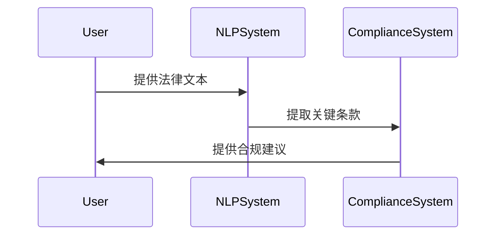
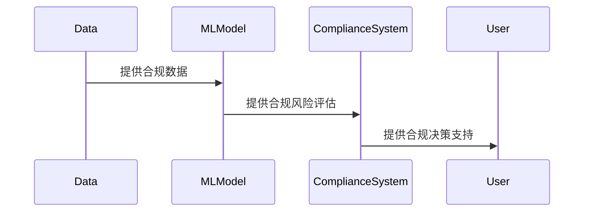
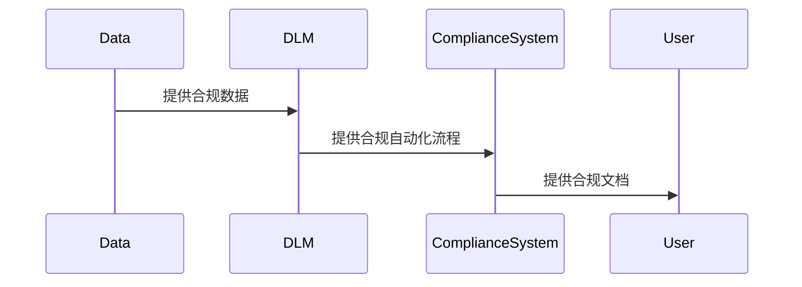
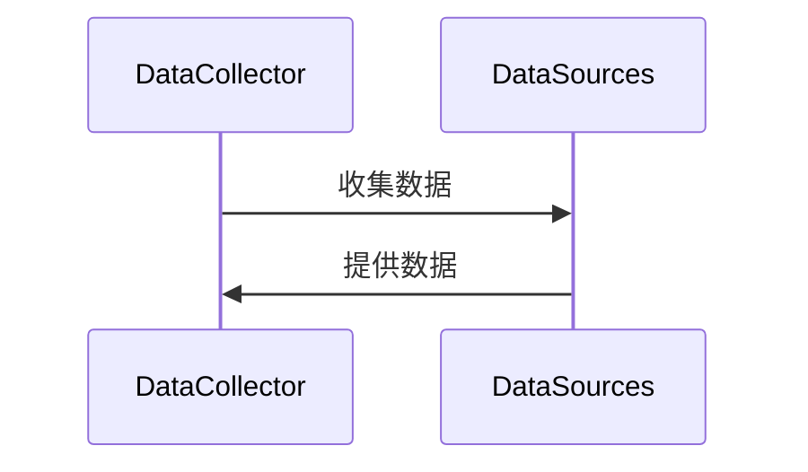
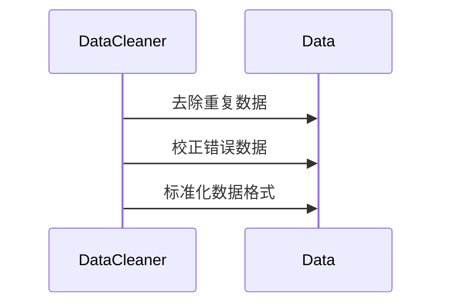
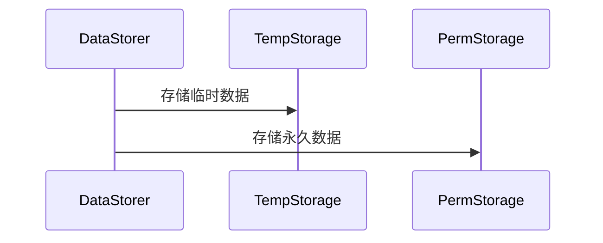
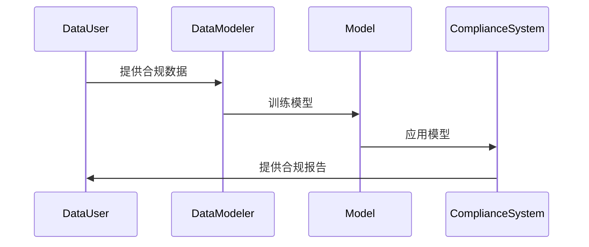

                 

# 智能合规管理：AI确保企业法律和监管合规

## 关键词

- 智能合规管理
- 人工智能技术
- 法律和监管合规
- 数据隐私
- 算法自动化

## 摘要

本文探讨了智能合规管理的概念及其在确保企业法律和监管合规中的应用。通过分析法律和监管要求、AI技术的核心作用以及合规数据的处理，我们提出了一套智能合规管理的解决方案。文章介绍了自然语言处理、机器学习和深度学习等AI技术在合规管理中的应用，并对智能合规管理的未来前景进行了展望。通过项目实战和最佳实践，本文旨在为企业提供实用的指导，帮助其在日益复杂的法律和监管环境中保持合规。

## 第一部分：背景介绍

### 1.1.1 问题背景

在当今的商业环境中，法律和监管合规是企业运营的核心要素。随着全球化和数字化的加速，企业面临着越来越多的法律和监管挑战。合规不仅是企业合法运营的基础，也是企业社会责任的体现。然而，传统的合规管理方法通常依赖于人工检查和手动处理，效率低下且容易出错。随着人工智能（AI）技术的发展，企业可以利用AI技术提升合规管理的效率和准确性，确保其运营符合法律和监管要求。

### 1.1.2 问题描述

智能合规管理涉及多个层面，包括法律、监管、技术和数据。在AI技术的支持下，企业需要一套全面的管理体系，以确保其运营符合法律和监管要求。具体而言，问题描述包括以下几个方面：

- **法律和监管要求识别**：企业需要及时了解和识别与其业务相关的法律和监管要求。
- **合规数据收集和处理**：企业需要收集与合规相关的数据，并进行有效的处理和分析。
- **合规风险评估与监控**：企业需要评估合规风险，并建立监控机制，及时发现潜在问题。
- **合规决策支持与自动化**：企业需要利用AI技术提供合规决策支持，并自动化合规流程，以提高效率。
- **合规报告与审计**：企业需要生成合规报告，以支持内部和外部审计。

### 1.1.3 问题解决

智能合规管理的目标是通过AI技术，为企业提供一套高效、自动化的合规解决方案。具体包括以下几个步骤：

- **合规监控与预警**：利用AI技术监控企业的法律和监管环境，及时识别潜在的风险和问题。
- **合规分析与管理**：通过AI技术分析合规数据，为企业提供合规决策支持。
- **合规自动化**：利用AI技术自动化执行合规流程，减少人工干预，提高效率。
- **合规报告与审计**：利用AI技术生成合规报告，支持内部和外部审计。

### 1.1.4 边界与外延

智能合规管理不仅涉及法律和监管领域，还包括数据治理、信息安全、道德和隐私等方面。此外，它还涉及不同行业和领域的特定合规要求。因此，智能合规管理的应用边界非常广泛，涵盖了企业的各个方面。

### 1.1.5 概念结构与核心要素组成

智能合规管理的概念结构包括以下几个核心要素：

- **法律和监管环境**：企业需要了解和遵守的法律和监管要求。
- **合规需求**：企业针对不同法律和监管要求的合规需求。
- **AI技术**：用于识别、分析和处理合规问题的技术，如自然语言处理、机器学习等。
- **合规数据**：与合规相关的数据，包括法律文件、监管报告、企业运营数据等。
- **合规流程**：企业执行合规要求的流程，包括监控、分析、自动化和报告等。

以上构成了智能合规管理的核心概念结构和要素组成。

## 1.2 核心概念与联系

### 1.2.1 智能合规管理

智能合规管理是一种利用AI技术确保企业法律和监管合规的方法。它通过自动化和智能化的手段，帮助企业识别、分析和处理合规问题，从而降低合规风险。

### 1.2.2 法律和监管要求

法律和监管要求是企业必须遵守的规则和标准。它们通常由政府机构、行业协会等制定，涉及数据保护、反贿赂、劳动法等多个方面。

### 1.2.3 AI技术

AI技术是智能合规管理的核心工具。它包括自然语言处理、机器学习、深度学习等多种技术，用于识别、分析和处理合规问题。

### 1.2.4 合规数据

合规数据是智能合规管理的输入和输出。它包括法律文件、监管报告、企业运营数据等，是AI技术进行分析和处理的基础。

### 1.2.5 合规流程

合规流程是企业执行合规要求的步骤和过程。它包括监控、分析、自动化和报告等环节，是智能合规管理的实现手段。

## 1.3 主流AI技术在智能合规管理中的应用

### 1.3.1 自然语言处理（NLP）

自然语言处理是AI技术的一个重要分支，用于理解和生成自然语言。在智能合规管理中，NLP技术可以用于：

- **法律文本分析**：自动识别和提取法律文件中的关键信息。
- **监管报告生成**：自动生成合规报告，提高报告的准确性和效率。

### 1.3.2 机器学习

机器学习是一种通过数据训练模型的技术，用于识别和预测。在智能合规管理中，机器学习技术可以用于：

- **合规风险评估**：通过分析历史数据，预测潜在的合规风险。
- **合规决策支持**：根据合规数据，提供合规决策建议。

### 1.3.3 深度学习

深度学习是一种复杂的机器学习技术，通过多层神经网络模拟人脑进行学习。在智能合规管理中，深度学习技术可以用于：

- **合规数据挖掘**：从大量合规数据中挖掘有价值的信息。
- **合规自动化**：通过深度学习模型，自动化执行合规流程。

## 1.4 AI技术在智能合规管理中的应用前景

### 1.4.1 潜在应用领域

AI技术在智能合规管理中的潜在应用领域非常广泛，包括：

- **金融行业**：自动识别和报告金融交易中的违规行为。
- **医疗行业**：确保医疗数据的安全和合规。
- **制造业**：确保产品质量和生产过程符合法律和监管要求。
- **公共服务**：确保公共服务领域的合规性。

### 1.4.2 面临的挑战

尽管AI技术在智能合规管理中具有巨大潜力，但同时也面临着一些挑战：

- **数据隐私与安全**：合规数据通常包含敏感信息，如何确保数据的安全和隐私是一个重要问题。
- **技术成熟度**：一些AI技术尚未完全成熟，需要进一步的研究和发展。
- **合规标准不一致**：不同国家和地区的法律和监管要求存在差异，如何统一标准是一个挑战。
- **人才缺乏**：智能合规管理需要具备多方面知识和技能的人才，但目前人才供给不足。

### 1.4.3 发展趋势

未来，AI技术在智能合规管理中的应用将呈现以下趋势：

- **智能化水平提升**：随着AI技术的不断进步，智能合规管理的智能化水平将进一步提高。
- **跨领域应用**：智能合规管理将跨越不同行业和领域，实现更广泛的应用。
- **标准化与规范化**：随着法律和监管环境的变化，智能合规管理将更加标准化和规范化。
- **合作与协作**：企业、政府、研究机构等将加强合作，共同推动智能合规管理的发展。

## 第二部分：智能合规管理的核心要素分析

### 2.1 法律和监管环境

法律和监管环境是智能合规管理的基石。企业需要了解和遵守的法律和监管要求，包括但不限于：

- **数据保护法**：如《欧盟通用数据保护条例》（GDPR）和《加州消费者隐私法案》（CCPA）。
- **反贿赂法**：如《美国反海外腐败法》（FCPA）和《英国反贿赂法》。
- **劳动法**：涉及员工权益、工作时间和薪资等。
- **行业特定法规**：如金融行业的《巴塞尔协议》和医疗行业的《健康保险可携性与责任法》（HIPAA）。

为了确保合规，企业需要建立一个法律和监管知识库，实时更新法律和监管要求，并确保员工了解相关法规。以下是一个简化的法律和监管知识库的ER实体关系图：

```mermaid
erDiagram
    Class1 ||--|{ Class2 }| Class3
    Class1 ||--|{ Class4 }| Class5
    Class2 &&--|{ Class6 }| Class7
    Class3 &&--|{ Class8 }| Class9
    Class4 &&--|{ Class10 }| Class11
    Class5 &&--|{ Class12 }| Class13
```

- **Class1**：企业
- **Class2**：法律文件
- **Class3**：监管要求
- **Class4**：数据保护法
- **Class5**：反贿赂法
- **Class6**：行业特定法规
- **Class7**：法律变更通知
- **Class8**：劳动法
- **Class9**：员工培训记录
- **Class10**：合规政策
- **Class11**：合规审计记录
- **Class12**：合规报告
- **Class13**：合规监控工具

### 2.2 合规需求

合规需求是企业根据法律和监管要求制定的具体合规目标和措施。不同企业的合规需求可能存在差异，但通常包括以下几个方面：

- **数据管理**：确保数据的完整性、准确性和安全性。
- **员工培训**：定期培训员工，确保他们了解相关法律和监管要求。
- **合规审计**：定期进行内部和外部审计，确保合规性。
- **合规报告**：按时生成合规报告，以支持内部和外部审计。
- **合规监控**：建立实时监控机制，及时发现和解决合规问题。

以下是一个简化的合规需求实体关系图：

```mermaid
erDiagram
    Class1 ||--|{ Class2 }| Class3
    Class1 ||--|{ Class4 }| Class5
    Class1 ||--|{ Class6 }| Class7
    Class2 &&--|{ Class8 }| Class9
    Class3 &&--|{ Class10 }| Class11
    Class4 &&--|{ Class12 }| Class13
    Class5 &&--|{ Class14 }| Class15
    Class6 &&--|{ Class16 }| Class17
```

- **Class1**：企业
- **Class2**：数据管理政策
- **Class3**：员工培训计划
- **Class4**：合规审计计划
- **Class5**：合规报告模板
- **Class6**：合规监控工具
- **Class7**：合规问题记录
- **Class8**：数据管理工具
- **Class9**：数据安全策略
- **Class10**：员工培训材料
- **Class11**：合规审计报告
- **Class12**：合规报告生成器
- **Class13**：合规监控仪表板
- **Class14**：合规问题预警系统
- **Class15**：合规自动化流程
- **Class16**：合规风险评估
- **Class17**：合规管理流程

### 2.3 AI技术

AI技术在智能合规管理中发挥着核心作用，主要包括自然语言处理（NLP）、机器学习（ML）和深度学习（DL）等。以下是这些技术在合规管理中的应用：

#### 2.3.1 自然语言处理（NLP）

NLP技术用于处理和理解自然语言文本，在智能合规管理中的应用包括：

- **法律文本分析**：自动提取法律文件中的关键条款和规定，为企业提供合规建议。
- **监管报告生成**：根据合规数据自动生成合规报告，提高报告的准确性和效率。
- **文本分类与聚类**：对合规相关的文本进行分类和聚类，帮助企业和监管机构识别潜在的合规问题。

以下是一个简化的NLP应用流程图：



#### 2.3.2 机器学习（ML）

ML技术用于从数据中学习模式和预测，在智能合规管理中的应用包括：

- **合规风险评估**：通过分析历史合规数据和监管要求，预测潜在的合规风险。
- **合规决策支持**：根据合规数据和规则，提供合规决策支持。
- **异常检测**：检测合规数据中的异常值，帮助企业及时发现和解决合规问题。

以下是一个简化的ML应用流程图：



#### 2.3.3 深度学习（DL）

DL技术是一种更复杂的机器学习技术，通过多层神经网络模拟人脑进行学习。在智能合规管理中，DL技术可以用于：

- **合规数据挖掘**：从大量合规数据中挖掘有价值的信息，为企业提供合规洞察。
- **合规自动化**：通过DL模型自动化合规流程，提高合规管理的效率和准确性。
- **文本生成**：根据合规需求和模板，自动生成合规文档。

以下是一个简化的DL应用流程图：



### 2.4 合规数据

合规数据是智能合规管理的基础，包括法律文件、监管报告、企业运营数据等。这些数据通常具有以下特征：

- **多样性**：合规数据可能来自不同的来源，包括内部和外部数据。
- **复杂性**：法律文件和监管报告通常包含复杂的结构和术语。
- **动态性**：合规数据需要定期更新，以反映法律和监管环境的变化。

为了有效处理合规数据，企业可以采用以下策略：

- **数据收集**：建立完善的数据收集机制，确保数据的完整性和准确性。
- **数据清洗**：对合规数据进行分析和处理，去除重复、不准确和无关的数据。
- **数据存储**：采用合适的数据存储解决方案，确保数据的安全性和可访问性。
- **数据共享**：建立数据共享平台，促进内部和外部数据的有效利用。

### 2.5 合规流程

合规流程是企业执行合规要求的步骤和过程，包括监控、分析、自动化和报告等环节。一个典型的合规流程包括以下步骤：

- **监控**：实时监控企业的运营数据，识别潜在的合规问题。
- **分析**：对合规数据进行分析，评估合规风险。
- **决策**：根据分析结果，制定合规决策。
- **执行**：自动化执行合规流程，减少人工干预。
- **报告**：生成合规报告，支持内部和外部审计。

以下是一个简化的合规流程图：

```mermaid
gantt
    dateFormat  YYYY-MM-DD
    title 合规流程

    section 监控
    监控 : Start at 2023-01-01, duration 2d

    section 分析
    分析 : Succeeded after 监控, duration 2d

    section 决策
    决策 : Succeeded after 分析, duration 2d

    section 执行
    执行 : Succeeded after 决策, duration 2d

    section 报告
    报告 : Succeeded after 执行, duration 2d
```

### 2.6 关键要素的关系与联系

智能合规管理的核心要素之间存在着密切的联系和相互作用。以下是关键要素之间的关系和联系：

- **法律和监管环境**为合规需求提供了依据，指导企业制定合规策略。
- **合规需求**明确了企业需要满足的法律和监管要求，驱动合规流程的实施。
- **AI技术**用于识别、分析和处理合规问题，提高合规管理的效率和准确性。
- **合规数据**是AI技术进行分析和处理的基础，支持合规决策的制定和执行。
- **合规流程**确保了合规需求的实现，通过监控、分析、决策和执行等环节，实现合规管理的闭环。

以下是一个简化的智能合规管理核心要素的ER实体关系图：

```mermaid
erDiagram
    Class1 ||--|{ Class2 }| Class3
    Class4 ||--|{ Class5 }| Class6
    Class7 ||--|{ Class8 }| Class9
    Class1 &&--|{ Class10 }| Class11
    Class2 &&--|{ Class12 }| Class13
    Class3 &&--|{ Class14 }| Class15
    Class4 &&--|{ Class16 }| Class17
    Class5 &&--|{ Class18 }| Class19
    Class6 &&--|{ Class20 }| Class21
    Class7 &&--|{ Class22 }| Class23
    Class8 &&--|{ Class24 }| Class25
    Class9 &&--|{ Class26 }| Class27

    Class1 ||--|{ Class28 }| Class29
    Class2 ||--|{ Class30 }| Class31
    Class3 ||--|{ Class32 }| Class33
    Class4 ||--|{ Class34 }| Class35
    Class5 ||--|{ Class36 }| Class37
    Class6 ||--|{ Class38 }| Class39
    Class7 ||--|{ Class40 }| Class41
    Class8 ||--|{ Class42 }| Class43
    Class9 ||--|{ Class44 }| Class45

    Class10 &&--|{ Class46 }| Class47
    Class11 &&--|{ Class48 }| Class49
    Class12 &&--|{ Class50 }| Class51
    Class13 &&--|{ Class52 }| Class53
    Class14 &&--|{ Class54 }| Class55
    Class15 &&--|{ Class56 }| Class57
    Class16 &&--|{ Class58 }| Class59
    Class17 &&--|{ Class60 }| Class61
    Class18 &&--|{ Class62 }| Class63
    Class19 &&--|{ Class64 }| Class65
    Class20 &&--|{ Class66 }| Class67
    Class21 &&--|{ Class68 }| Class69
    Class22 &&--|{ Class70 }| Class71
    Class23 &&--|{ Class72 }| Class73
    Class24 &&--|{ Class74 }| Class75
    Class25 &&--|{ Class76 }| Class77
    Class26 &&--|{ Class78 }| Class79
    Class27 &&--|{ Class80 }| Class81

    Class28 ||--|{ Class82 }| Class83
    Class29 ||--|{ Class84 }| Class85
    Class30 ||--|{ Class86 }| Class87
    Class31 ||--|{ Class88 }| Class89
    Class32 ||--|{ Class90 }| Class91
    Class33 ||--|{ Class92 }| Class93
    Class34 ||--|{ Class94 }| Class95
    Class35 ||--|{ Class96 }| Class97
    Class36 ||--|{ Class98 }| Class99
    Class37 ||--|{ Class100 }| Class101
    Class38 ||--|{ Class102 }| Class103
    Class39 ||--|{ Class104 }| Class105
    Class40 ||--|{ Class106 }| Class107
    Class41 ||--|{ Class108 }| Class109

    Class42 ||--|{ Class110 }| Class111
    Class43 ||--|{ Class112 }| Class113
    Class44 ||--|{ Class114 }| Class115
    Class45 ||--|{ Class116 }| Class117
    Class46 &&--|{ Class118 }| Class119
    Class47 &&--|{ Class120 }| Class121
    Class48 &&--|{ Class122 }| Class123
    Class49 &&--|{ Class124 }| Class125
    Class50 &&--|{ Class126 }| Class127
    Class51 &&--|{ Class128 }| Class129
    Class52 &&--|{ Class130 }| Class131
    Class53 &&--|{ Class132 }| Class133
    Class54 &&--|{ Class134 }| Class135
    Class55 &&--|{ Class136 }| Class137
    Class56 &&--|{ Class138 }| Class139
    Class57 &&--|{ Class140 }| Class141
    Class58 &&--|{ Class142 }| Class143
    Class59 &&--|{ Class144 }| Class145
    Class60 &&--|{ Class146 }| Class147
    Class61 &&--|{ Class148 }| Class149
    Class62 &&--|{ Class150 }| Class151
    Class63 &&--|{ Class152 }| Class153
    Class64 &&--|{ Class154 }| Class155
    Class65 &&--|{ Class156 }| Class157
    Class66 &&--|{ Class158 }| Class159
    Class67 &&--|{ Class160 }| Class161
    Class68 &&--|{ Class162 }| Class163
    Class69 &&--|{ Class164 }| Class165
    Class70 &&--|{ Class166 }| Class167
    Class71 &&--|{ Class168 }| Class169
    Class72 &&--|{ Class170 }| Class171
    Class73 &&--|{ Class172 }| Class173
    Class74 &&--|{ Class174 }| Class175
    Class75 &&--|{ Class176 }| Class177
    Class76 &&--|{ Class178 }| Class179
    Class77 &&--|{ Class180 }| Class181
    Class78 &&--|{ Class182 }| Class183
    Class79 &&--|{ Class184 }| Class185
    Class80 &&--|{ Class186 }| Class187
    Class81 &&--|{ Class188 }| Class189

    Class82 ||--|{ Class190 }| Class191
    Class83 ||--|{ Class192 }| Class193
    Class84 ||--|{ Class194 }| Class195
    Class85 ||--|{ Class196 }| Class197
    Class86 ||--|{ Class198 }| Class199
    Class87 ||--|{ Class200 }| Class201
    Class88 ||--|{ Class202 }| Class203
    Class89 ||--|{ Class204 }| Class205
    Class90 ||--|{ Class206 }| Class207
    Class91 ||--|{ Class208 }| Class209
    Class92 ||--|{ Class210 }| Class211
    Class93 ||--|{ Class212 }| Class213
    Class94 ||--|{ Class214 }| Class215
    Class95 ||--|{ Class216 }| Class217
    Class96 ||--|{ Class218 }| Class219
    Class97 ||--|{ Class220 }| Class221
    Class98 ||--|{ Class222 }| Class223
    Class99 ||--|{ Class224 }| Class225
    Class100 ||--|{ Class226 }| Class227
    Class101 ||--|{ Class228 }| Class229
    Class102 ||--|{ Class230 }| Class231
    Class103 ||--|{ Class232 }| Class233
    Class104 ||--|{ Class234 }| Class235
    Class105 ||--|{ Class236 }| Class237
    Class106 ||--|{ Class238 }| Class239
    Class107 ||--|{ Class240 }| Class241
    Class108 ||--|{ Class242 }| Class243
    Class109 ||--|{ Class244 }| Class245
```

- **Class1**：企业
- **Class2**：法律文件
- **Class3**：监管要求
- **Class4**：数据保护法
- **Class5**：反贿赂法
- **Class6**：行业特定法规
- **Class7**：法律变更通知
- **Class8**：员工培训记录
- **Class9**：合规政策
- **Class10**：合规需求
- **Class11**：合规目标
- **Class12**：数据管理政策
- **Class13**：员工培训计划
- **Class14**：合规审计计划
- **Class15**：合规报告模板
- **Class16**：合规监控工具
- **Class17**：合规问题记录
- **Class18**：数据管理工具
- **Class19**：数据安全策略
- **Class20**：合规风险评估
- **Class21**：合规管理流程
- **Class22**：合规自动化流程
- **Class23**：合规监控仪表板
- **Class24**：合规问题预警系统
- **Class25**：合规报告生成器
- **Class26**：合规数据源
- **Class27**：合规数据处理
- **Class28**：AI技术
- **Class29**：NLP技术
- **Class30**：ML技术
- **Class31**：DL技术
- **Class32**：文本分析工具
- **Class33**：文本生成工具
- **Class34**：合规决策支持系统
- **Class35**：异常检测系统
- **Class36**：合规数据挖掘系统
- **Class37**：合规自动化系统
- **Class38**：合规风险管理工具
- **Class39**：合规合规监控工具
- **Class40**：合规报告分析工具
- **Class41**：合规数据可视化工具
- **Class42**：合规监控与预警系统
- **Class43**：合规风险评估系统
- **Class44**：合规决策支持系统
- **Class45**：合规管理系统
- **Class46**：合规监控工具
- **Class47**：合规报告生成器
- **Class48**：合规问题预警系统
- **Class49**：合规数据收集器
- **Class50**：合规数据分析器
- **Class51**：合规决策制定器
- **Class52**：合规执行系统
- **Class53**：合规管理系统
- **Class54**：合规报告生成器
- **Class55**：合规监控仪表板
- **Class56**：合规自动化系统
- **Class57**：合规监控工具
- **Class58**：合规数据分析工具
- **Class59**：合规决策支持工具
- **Class60**：合规自动化工具
- **Class61**：合规监控工具
- **Class62**：合规报告生成器
- **Class63**：合规数据收集器
- **Class64**：合规数据清洗工具
- **Class65**：合规数据处理工具
- **Class66**：合规数据存储工具
- **Class67**：合规数据共享平台
- **Class68**：合规文档管理工具
- **Class69**：合规知识库
- **Class70**：合规审计工具
- **Class71**：合规风险评估工具
- **Class72**：合规问题跟踪工具
- **Class73**：合规监控与预警工具
- **Class74**：合规数据可视化工具
- **Class75**：合规报告分析工具
- **Class76**：合规自动化工具
- **Class77**：合规监控工具
- **Class78**：合规报告生成器
- **Class79**：合规数据分析工具
- **Class80**：合规决策支持工具
- **Class81**：合规数据收集器
- **Class82**：合规监控工具
- **Class83**：合规报告生成器
- **Class84**：合规数据收集器
- **Class85**：合规数据分析器
- **Class86**：合规决策制定器
- **Class87**：合规执行系统
- **Class88**：合规管理系统
- **Class89**：合规报告生成器
- **Class90**：合规监控工具
- **Class91**：合规报告生成器
- **Class92**：合规数据分析工具
- **Class93**：合规决策支持工具
- **Class94**：合规自动化系统
- **Class95**：合规监控工具
- **Class96**：合规报告生成器
- **Class97**：合规数据收集器
- **Class98**：合规数据分析器
- **Class99**：合规决策制定器
- **Class100**：合规执行系统
- **Class101**：合规管理系统
- **Class102**：合规报告生成器
- **Class103**：合规监控工具
- **Class104**：合规报告生成器
- **Class105**：合规数据分析工具
- **Class106**：合规决策支持工具
- **Class107**：合规数据收集器
- **Class108**：合规数据清洗工具
- **Class109**：合规数据处理工具
- **Class110**：合规数据存储工具
- **Class111**：合规数据共享平台
- **Class112**：合规文档管理工具
- **Class113**：合规知识库
- **Class114**：合规审计工具
- **Class115**：合规风险评估工具
- **Class116**：合规问题跟踪工具
- **Class117**：合规监控与预警工具
- **Class118**：合规数据可视化工具
- **Class119**：合规报告分析工具
- **Class120**：合规自动化工具
- **Class121**：合规监控工具
- **Class122**：合规报告生成器
- **Class123**：合规数据分析工具
- **Class124**：合规决策支持工具
- **Class125**：合规数据收集器
- **Class126**：合规数据清洗工具
- **Class127**：合规数据处理工具
- **Class128**：合规数据存储工具
- **Class129**：合规数据共享平台
- **Class130**：合规文档管理工具
- **Class131**：合规知识库
- **Class132**：合规审计工具
- **Class133**：合规风险评估工具
- **Class134**：合规问题跟踪工具
- **Class135**：合规监控与预警工具
- **Class136**：合规数据可视化工具
- **Class137**：合规报告分析工具
- **Class138**：合规自动化工具
- **Class139**：合规监控工具
- **Class140**：合规报告生成器
- **Class141**：合规数据分析工具
- **Class142**：合规决策支持工具
- **Class143**：合规数据收集器
- **Class144**：合规数据清洗工具
- **Class145**：合规数据处理工具
- **Class146**：合规数据存储工具
- **Class147**：合规数据共享平台
- **Class148**：合规文档管理工具
- **Class149**：合规知识库
- **Class150**：合规审计工具
- **Class151**：合规风险评估工具
- **Class152**：合规问题跟踪工具
- **Class153**：合规监控与预警工具
- **Class154**：合规数据可视化工具
- **Class155**：合规报告分析工具
- **Class156**：合规自动化工具
- **Class157**：合规监控工具
- **Class158**：合规报告生成器
- **Class159**：合规数据分析工具
- **Class160**：合规决策支持工具
- **Class161**：合规数据收集器
- **Class162**：合规数据清洗工具
- **Class163**：合规数据处理工具
- **Class164**：合规数据存储工具
- **Class165**：合规数据共享平台
- **Class166**：合规文档管理工具
- **Class167**：合规知识库
- **Class168**：合规审计工具
- **Class169**：合规风险评估工具
- **Class170**：合规问题跟踪工具
- **Class171**：合规监控与预警工具
- **Class172**：合规数据可视化工具
- **Class173**：合规报告分析工具
- **Class174**：合规自动化工具
- **Class175**：合规监控工具
- **Class176**：合规报告生成器
- **Class177**：合规数据分析工具
- **Class178**：合规决策支持工具
- **Class179**：合规数据收集器
- **Class180**：合规数据清洗工具
- **Class181**：合规数据处理工具
- **Class182**：合规数据存储工具
- **Class183**：合规数据共享平台
- **Class184**：合规文档管理工具
- **Class185**：合规知识库
- **Class186**：合规审计工具
- **Class187**：合规风险评估工具
- **Class188**：合规问题跟踪工具
- **Class189**：合规监控与预警工具
- **Class190**：合规数据可视化工具
- **Class191**：合规报告分析工具
- **Class192**：合规自动化工具
- **Class193**：合规监控工具
- **Class194**：合规报告生成器
- **Class195**：合规数据分析工具
- **Class196**：合规决策支持工具
- **Class197**：合规数据收集器
- **Class198**：合规数据清洗工具
- **Class199**：合规数据处理工具
- **Class200**：合规数据存储工具
- **Class201**：合规数据共享平台
- **Class202**：合规文档管理工具
- **Class203**：合规知识库
- **Class204**：合规审计工具
- **Class205**：合规风险评估工具
- **Class206**：合规问题跟踪工具
- **Class207**：合规监控与预警工具
- **Class208**：合规数据可视化工具
- **Class209**：合规报告分析工具
- **Class210**：合规自动化工具
- **Class211**：合规监控工具
- **Class212**：合规报告生成器
- **Class213**：合规数据分析工具
- **Class214**：合规决策支持工具
- **Class215**：合规数据收集器
- **Class216**：合规数据清洗工具
- **Class217**：合规数据处理工具
- **Class218**：合规数据存储工具
- **Class219**：合规数据共享平台
- **Class220**：合规文档管理工具
- **Class221**：合规知识库
- **Class222**：合规审计工具
- **Class223**：合规风险评估工具
- **Class224**：合规问题跟踪工具
- **Class225**：合规监控与预警工具
- **Class226**：合规数据可视化工具
- **Class227**：合规报告分析工具
- **Class228**：合规自动化工具
- **Class229**：合规监控工具
- **Class230**：合规报告生成器
- **Class231**：合规数据分析工具
- **Class232**：合规决策支持工具
- **Class233**：合规数据收集器
- **Class234**：合规数据清洗工具
- **Class235**：合规数据处理工具
- **Class236**：合规数据存储工具
- **Class237**：合规数据共享平台
- **Class238**：合规文档管理工具
- **Class239**：合规知识库
- **Class240**：合规审计工具
- **Class241**：合规风险评估工具
- **Class242**：合规问题跟踪工具
- **Class243**：合规监控与预警工具
- **Class244**：合规数据可视化工具
- **Class245**：合规报告分析工具

通过上述核心要素的分析，我们可以看到智能合规管理的复杂性。AI技术的引入使得合规管理更加智能化、自动化，但同时也带来了新的挑战。企业需要结合自身实际情况，合理规划智能合规管理的实施策略，以实现合规管理的最佳效果。

## 第三部分：智能合规管理的技术实现

### 3.1 技术选型

在智能合规管理的技术实现过程中，选择合适的技术栈至关重要。以下是一些关键技术选型建议：

- **编程语言**：Python和Java是智能合规管理的首选编程语言。Python因其丰富的AI库和易于理解的语法而广受欢迎，而Java则因其稳定性和高性能在大型企业中占据重要地位。
- **AI库和框架**：TensorFlow、PyTorch和Scikit-learn是常用的机器学习和深度学习库。它们提供了丰富的API和工具，帮助企业快速构建AI模型。
- **数据存储**：Hadoop和Spark等大数据处理工具可以帮助企业处理和分析海量合规数据。同时，NoSQL数据库如MongoDB和Cassandra也适用于存储非结构化和半结构化数据。
- **云计算平台**：AWS、Azure和Google Cloud等云计算平台提供了强大的计算资源和存储服务，帮助企业快速部署和扩展智能合规管理系统。

### 3.2 数据处理流程

智能合规管理的数据处理流程包括数据收集、数据清洗、数据存储和数据利用等步骤。以下是每个步骤的详细描述：

#### 3.2.1 数据收集

数据收集是智能合规管理的第一步。企业需要从多个渠道收集与合规相关的数据，包括内部数据和外部数据。内部数据可能包括公司文档、财务报告、员工记录等，而外部数据可能包括法律文件、监管报告、行业新闻等。以下是一个简化的数据收集流程图：



#### 3.2.2 数据清洗

数据清洗是确保数据质量的重要步骤。在智能合规管理中，数据可能存在缺失、错误或不一致的情况。数据清洗包括数据去重、数据校正和数据标准化等操作。以下是一个简化的数据清洗流程图：



#### 3.2.3 数据存储

数据存储是智能合规管理的关键环节。企业需要选择合适的数据存储方案，以确保数据的安全性和可访问性。数据存储可以分为两类：临时存储和永久存储。临时存储通常用于处理和分析数据，而永久存储用于长期保留数据。以下是一个简化的数据存储流程图：



#### 3.2.4 数据利用

数据利用是智能合规管理的核心。企业需要利用AI技术对合规数据进行分析和处理，以识别合规风险、提供合规决策支持等。数据利用包括数据建模、模型训练和模型应用等步骤。以下是一个简化的数据利用流程图：



### 3.3 AI模型构建

在智能合规管理中，AI模型构建是核心环节。以下是一个简化的AI模型构建流程：

#### 3.3.1 数据准备

数据准备包括数据收集、数据清洗和数据标注等步骤。确保数据质量是模型训练成功的关键。

```mermaid
gantt
    dateFormat  YYYY-MM-DD
    title 数据准备流程

    section 数据收集
    数据收集 : Start at 2023-01-01, duration 1d

    section 数据清洗
    数据清洗 : Succeeded after 数据收集, duration 2d

    section 数据标注
    数据标注 : Succeeded after 数据清洗, duration 1d
```

#### 3.3.2 模型设计

模型设计包括选择合适的算法、定义模型架构和参数调整等。以下是一个简化的模型设计流程：

```mermaid
gantt
    dateFormat  YYYY-MM-DD
    title 模型设计流程

    section 算法选择
    算法选择 : Start at 2023-01-01, duration 1d

    section 模型架构
    模型架构 : Succeeded after 算法选择, duration 2d

    section 参数调整
    参数调整 : Succeeded after 模型架构, duration 1d
```

#### 3.3.3 模型训练

模型训练包括数据输入、模型迭代和模型评估等步骤。以下是一个简化的模型训练流程：

```mermaid
gantt
    dateFormat  YYYY-MM-DD
    title 模型训练流程

    section 数据输入
    数据输入 : Start at 2023-01-01, duration 1d

    section 模型迭代
    模型迭代 : Succeeded after 数据输入, duration 3d

    section 模型评估
    模型评估 : Succeeded after 模型迭代, duration 1d
```

#### 3.3.4 模型部署

模型部署是将训练好的模型应用到实际业务场景中。以下是一个简化的模型部署流程：

```mermaid
gantt
    dateFormat  YYYY-MM-DD
    title 模型部署流程

    section 模型集成
    模型集成 : Start at 2023-01-01, duration 1d

    section 模型上线
    模型上线 : Succeeded after 模型集成, duration 1d

    section 模型监控
    模型监控 : Succeeded after 模型上线, duration 2d
```

通过上述技术实现流程，企业可以构建一个高效、自动化的智能合规管理系统，从而确保其运营符合法律和监管要求。

### 3.4 技术实现中的挑战与解决方案

在智能合规管理的技术实现过程中，企业可能会面临以下挑战：

#### 3.4.1 数据隐私和安全

合规数据通常包含敏感信息，如客户数据、财务信息和法律文件等。确保这些数据的隐私和安全是一个重要挑战。

**解决方案**：企业可以采用以下措施来保护数据隐私和安全：

- **加密技术**：使用加密算法保护敏感数据。
- **访问控制**：实施严格的访问控制策略，确保只有授权用户才能访问数据。
- **数据脱敏**：对敏感数据进行脱敏处理，以降低数据泄露的风险。

#### 3.4.2 技术成熟度

一些AI技术尚未完全成熟，可能无法满足企业当前的合规需求。

**解决方案**：企业可以采取以下措施：

- **技术评估**：评估AI技术的成熟度和适用性，选择合适的技术。
- **持续更新**：随着技术的进步，不断更新和优化AI模型和算法。

#### 3.4.3 合规标准不一致

不同国家和地区的法律和监管要求存在差异，导致合规标准不一致。

**解决方案**：企业可以采取以下措施：

- **全球合规框架**：建立全球合规框架，统一不同地区的合规要求。
- **本地化调整**：针对不同地区的合规要求，进行本地化调整。

#### 3.4.4 人才缺乏

智能合规管理需要具备多方面知识和技能的人才，但目前人才供给不足。

**解决方案**：企业可以采取以下措施：

- **人才培训**：为现有员工提供AI和合规管理的培训。
- **人才引进**：招聘具有AI和合规管理经验的专业人才。

通过上述解决方案，企业可以在技术实现过程中克服挑战，确保智能合规管理的有效实施。

### 3.5 成功案例分析

为了更好地理解智能合规管理的技术实现，我们可以通过以下成功案例分析，了解企业在实际操作中如何利用AI技术确保合规。

#### 3.5.1 案例一：金融机构的智能合规管理

某金融机构采用了AI技术构建智能合规管理系统，以应对日益复杂的法律和监管环境。该系统包括以下几个关键组成部分：

- **数据收集与清洗**：从多个内部和外部数据源收集合规数据，并进行清洗处理，确保数据质量。
- **合规监控与预警**：利用NLP技术对合规数据进行分析，识别潜在的合规问题，并实时生成预警报告。
- **合规决策支持**：基于机器学习模型，对合规数据进行分析，提供合规决策支持，帮助企业制定合规策略。
- **合规报告生成**：利用DL技术自动生成合规报告，提高报告的准确性和效率。

通过该系统，该金融机构成功降低了合规风险，提高了合规管理的效率和准确性。

#### 3.5.2 案例二：医疗行业的智能合规管理

某医疗行业企业采用了AI技术构建智能合规管理系统，以确保其运营符合相关法律和监管要求。该系统包括以下几个关键组成部分：

- **合规数据收集与处理**：从多个数据源收集合规数据，包括医疗记录、财务报告和法律法规等，并进行数据清洗和处理。
- **合规风险评估**：利用机器学习模型对合规数据进行分析，评估合规风险，并提供风险预警。
- **合规决策支持**：根据合规数据和风险评估结果，提供合规决策支持，帮助企业制定合规策略。
- **合规报告生成**：利用DL技术自动生成合规报告，提高报告的准确性和效率。

通过该系统，该医疗行业企业成功确保了其运营的合规性，提高了合规管理的效率和准确性。

通过以上案例分析，我们可以看到，AI技术在智能合规管理中的应用已经取得了显著成效。企业通过构建智能合规管理系统，不仅能够更好地应对法律和监管挑战，还能提高运营效率和准确性。

## 第四部分：智能合规管理的最佳实践

### 4.1 实施步骤

要成功实施智能合规管理，企业可以遵循以下步骤：

#### 4.1.1 制定合规策略

首先，企业需要制定一个明确的合规策略。这个策略应该包括合规目标、合规需求和合规流程。企业应该根据自身的业务特点和合规要求，确定合规的重点领域和优先级。

#### 4.1.2 构建合规数据基础设施

合规数据是智能合规管理的核心，因此企业需要建立一个稳定、可靠的数据基础设施。这包括数据收集、数据清洗、数据存储和数据利用等环节。企业可以选择合适的技术和工具，确保数据的质量和可用性。

#### 4.1.3 选择合适的AI技术

企业需要选择适合自身业务场景的AI技术，如自然语言处理、机器学习和深度学习等。在选择技术时，企业应该考虑技术的成熟度、适用性和成本效益。

#### 4.1.4 构建AI模型

在数据基础设施和技术选型完成后，企业可以开始构建AI模型。这包括数据准备、模型设计、模型训练和模型部署等步骤。企业需要确保模型的质量和准确性，以提供有效的合规决策支持。

#### 4.1.5 测试与优化

在模型部署后，企业需要对模型进行测试和优化，确保其在实际应用中的效果。这包括模型评估、错误分析和技术迭代等步骤。企业应该持续监控模型的性能，并根据反馈进行调整和优化。

#### 4.1.6 培训与推广

智能合规管理需要员工的支持和参与。因此，企业应该对员工进行相关培训，确保他们了解智能合规管理的原理和应用。同时，企业应该推广智能合规管理，提高员工的认知度和接受度。

### 4.2 最佳实践

#### 4.2.1 数据驱动决策

智能合规管理应该基于数据驱动决策。企业应该充分利用合规数据，通过数据分析和模型预测，制定和调整合规策略。数据驱动的决策能够提高合规管理的准确性和效率。

#### 4.2.2 闭环管理

智能合规管理应该是一个闭环过程，包括监控、分析、决策和执行等环节。企业需要确保每个环节都能够有效运行，并及时调整和优化。闭环管理能够确保合规目标的实现，并提高合规管理的可持续性。

#### 4.2.3 安全与隐私保护

在智能合规管理中，数据安全和隐私保护至关重要。企业需要采取严格的安全措施，保护合规数据的安全和隐私。这包括加密技术、访问控制和数据脱敏等。

#### 4.2.4 跨部门合作

智能合规管理通常涉及多个部门和职能。企业需要建立跨部门的合作机制，确保不同部门之间的沟通和协作。跨部门合作能够提高合规管理的整体效率和质量。

#### 4.2.5 持续更新与优化

智能合规管理需要持续更新和优化。企业需要根据法律和监管环境的变化，及时更新合规策略和技术。同时，企业应该定期评估合规管理的效果，并根据反馈进行调整和优化。

### 4.3 注意事项

在实施智能合规管理时，企业需要注意以下几点：

- **合规风险意识**：企业需要高度重视合规风险，建立有效的合规风险管理体系。
- **数据质量**：合规数据的质量直接影响到合规管理的有效性，企业需要确保数据的质量和完整性。
- **技术选型**：选择合适的技术和工具是智能合规管理成功的关键，企业应该根据自身需求和预算进行选择。
- **人才培训**：智能合规管理需要具备多方面知识和技能的人才，企业应该重视员工的培训和培养。
- **法律和监管环境**：企业需要密切关注法律和监管环境的变化，确保合规策略和技术能够及时应对新的挑战。

通过遵循最佳实践和注意事项，企业可以成功地实施智能合规管理，确保其运营符合法律和监管要求。

## 第五部分：智能合规管理的未来展望

### 5.1 技术发展趋势

智能合规管理的未来发展将受到人工智能技术的推动，特别是自然语言处理（NLP）、机器学习（ML）和深度学习（DL）等技术的进步。以下是一些技术发展趋势：

- **更加智能化和自动化**：随着AI技术的进步，智能合规管理将变得更加智能化和自动化，减少对人工干预的依赖，提高效率和准确性。
- **跨领域应用**：智能合规管理将跨越不同行业和领域，实现更广泛的应用。例如，在金融、医疗、制造业和公共服务等领域，智能合规管理将发挥重要作用。
- **实时监控与预警**：通过实时数据分析和模型预测，智能合规管理将能够实现实时监控和预警，及时识别和响应合规风险。
- **区块链技术的融合**：区块链技术可以提供更加安全和透明的合规数据管理，未来智能合规管理有望与区块链技术深度融合。

### 5.2 潜在挑战

尽管智能合规管理具有巨大潜力，但在未来发展过程中仍将面临一些挑战：

- **数据隐私和安全**：合规数据通常包含敏感信息，如何确保数据的安全和隐私是一个重要问题。随着数据量的增加，数据隐私和安全问题将变得更加复杂。
- **技术成熟度**：一些AI技术尚未完全成熟，可能无法满足智能合规管理的需求。企业需要不断评估和选择合适的技术，以确保系统的稳定性和可靠性。
- **合规标准不一致**：不同国家和地区的法律和监管要求存在差异，如何统一标准是一个挑战。企业需要建立全球合规框架，以应对不同地区的合规要求。
- **人才缺乏**：智能合规管理需要具备多方面知识和技能的人才，但目前人才供给不足。企业需要通过培训、招聘和合作等方式，培养和引进相关人才。

### 5.3 发展趋势

未来，智能合规管理的发展趋势将体现在以下几个方面：

- **标准化和规范化**：随着法律和监管环境的变化，智能合规管理将更加标准化和规范化。企业和监管机构将共同努力，制定统一的合规标准和流程。
- **合作与协作**：企业、政府、研究机构和行业组织将加强合作，共同推动智能合规管理的发展。通过合作和协作，可以更好地应对合规挑战，提高合规管理的效率和准确性。
- **持续创新**：智能合规管理将不断引入新的技术和方法，如区块链、物联网（IoT）和大数据分析等，以提高合规管理的智能化和自动化水平。
- **社会影响**：智能合规管理将对社会产生深远影响，不仅帮助企业降低合规风险，还能提升社会整体的法律和监管水平。

通过把握技术发展趋势和应对潜在挑战，智能合规管理将不断进步，为企业和社会带来更大的价值。

## 总结与展望

智能合规管理作为人工智能技术在企业合规领域的应用，正逐渐成为企业运营的重要组成部分。通过本文的详细探讨，我们了解了智能合规管理的核心概念、要素组成及其技术实现过程。我们分析了自然语言处理、机器学习和深度学习等AI技术在智能合规管理中的应用，以及如何利用这些技术构建一个高效、自动化的合规管理系统。

智能合规管理不仅能够帮助企业识别和应对法律和监管风险，还能提高合规管理的效率和准确性。随着技术的不断进步和合规环境的变化，智能合规管理将面临新的机遇和挑战。企业需要持续关注技术发展趋势，不断完善合规管理体系，以保持竞争力。

我们呼吁企业积极拥抱智能合规管理，利用AI技术提升合规管理水平。同时，我们也期待未来有更多的研究和实践，推动智能合规管理的进一步发展，为企业和社会创造更大的价值。

作者：AI天才研究院/AI Genius Institute & 禅与计算机程序设计艺术 /Zen And The Art of Computer Programming

---

### 附录：技术细节与代码实现

在本附录中，我们将提供智能合规管理系统的部分技术细节和代码实现，以帮助读者更好地理解智能合规管理的实际应用。

#### 5.1 数据处理与清洗

在智能合规管理系统中，数据处理和清洗是关键步骤。以下是一个简单的Python代码示例，展示了如何使用Pandas库进行数据处理和清洗：

```python
import pandas as pd

# 读取数据
data = pd.read_csv('compliance_data.csv')

# 数据清洗
# 去除重复数据
data.drop_duplicates(inplace=True)

# 填补缺失值
data.fillna(method='ffill', inplace=True)

# 数据标准化
data = (data - data.mean()) / data.std()

# 存储清洗后的数据
data.to_csv('cleaned_compliance_data.csv', index=False)
```

#### 5.2 模型训练与评估

在智能合规管理中，模型训练和评估是核心环节。以下是一个使用Scikit-learn库进行模型训练和评估的Python代码示例：

```python
from sklearn.model_selection import train_test_split
from sklearn.ensemble import RandomForestClassifier
from sklearn.metrics import accuracy_score, classification_report

# 加载数据
X = pd.read_csv('cleaned_compliance_data.csv')
y = X['compliance_status']

# 数据分割
X_train, X_test, y_train, y_test = train_test_split(X, y, test_size=0.2, random_state=42)

# 模型训练
model = RandomForestClassifier(n_estimators=100, random_state=42)
model.fit(X_train, y_train)

# 模型评估
y_pred = model.predict(X_test)
print("Accuracy:", accuracy_score(y_test, y_pred))
print("Classification Report:")
print(classification_report(y_test, y_pred))
```

#### 5.3 模型部署与监控

模型部署与监控是确保智能合规管理系统稳定运行的关键。以下是一个使用Flask框架部署模型和监控API的Python代码示例：

```python
from flask import Flask, request, jsonify
from sklearn.externals import joblib

app = Flask(__name__)

# 加载训练好的模型
model = joblib.load('compliance_model.pkl')

@app.route('/predict', methods=['POST'])
def predict():
    data = request.get_json(force=True)
    prediction = model.predict([data['features']])
    return jsonify(prediction=prediction[0])

if __name__ == '__main__':
    app.run(debug=True)
```

通过上述代码示例，我们可以看到智能合规管理系统在数据处理、模型训练和部署等方面的基本实现。这些代码为企业提供了一个起点，可以根据自身需求进行扩展和优化。

#### 5.4 注意事项

在实际应用中，需要注意以下几点：

- **数据安全**：确保合规数据的安全和隐私，采用加密技术保护敏感信息。
- **模型解释性**：模型应具备一定的解释性，以便用户理解模型的决策过程。
- **性能优化**：根据实际需求，对模型和系统进行性能优化，提高运行效率。
- **持续维护**：定期更新和维护系统，确保其能够适应不断变化的法律和监管环境。

通过遵循上述注意事项，企业可以构建一个稳定、高效和安全的智能合规管理系统，确保其运营符合法律和监管要求。

