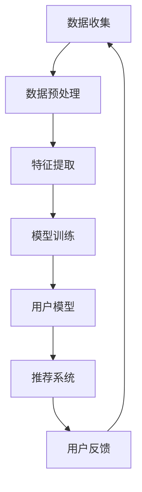
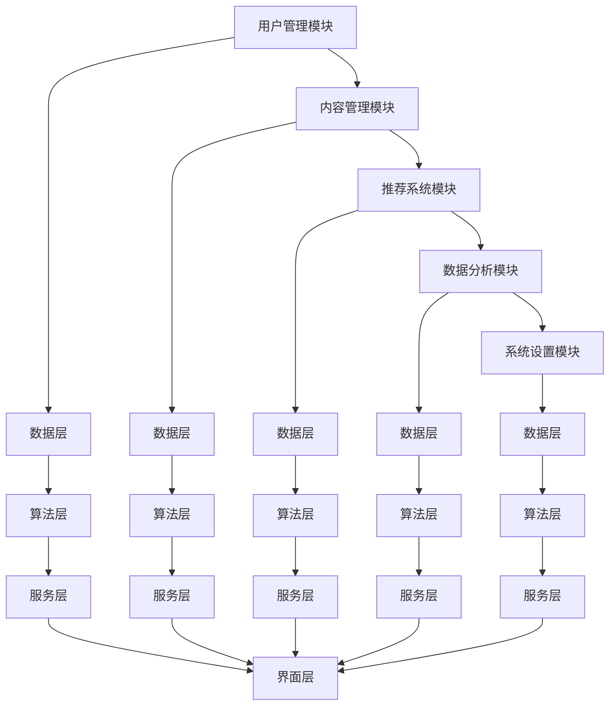
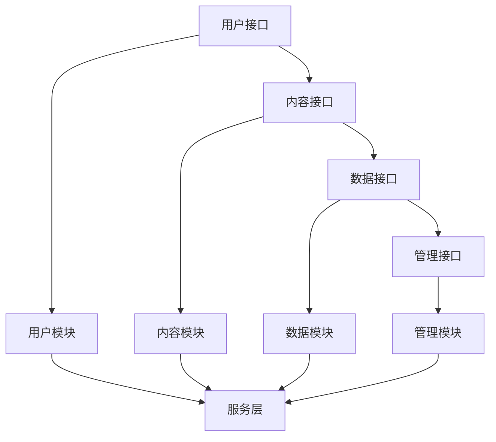
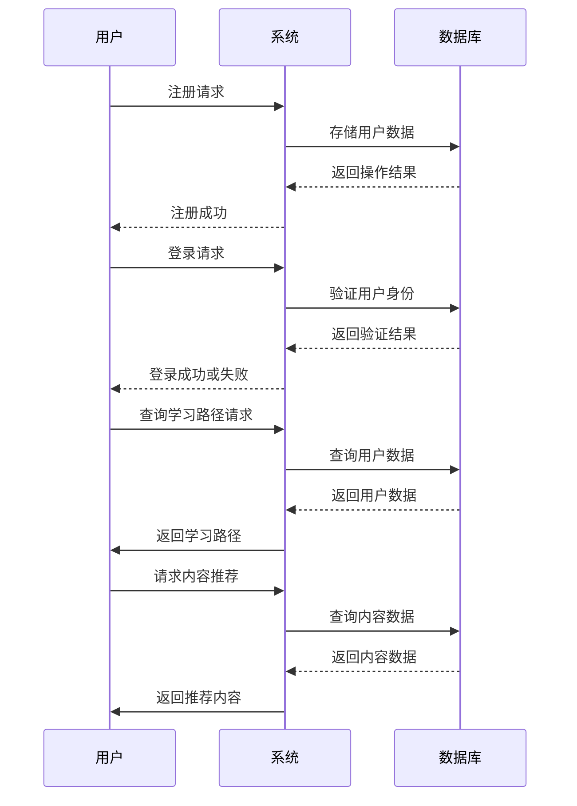

                 

### 《智能学习与发展平台：AI个性化员工培训体系》

#### 关键词：智能学习、发展平台、AI个性化培训、员工培训、算法原理、系统架构、项目实战

#### 摘要：
本文深入探讨了智能学习与发展平台及其在AI个性化员工培训体系中的应用。通过背景介绍、核心概念解析、算法原理讲解、系统设计与实现以及最佳实践分享，本文旨在为读者提供一个全面的指南，帮助他们在企业培训中实现个性化、智能化的解决方案。

## 目录大纲

### 第一部分：背景与核心概念

#### 第1章 引言

##### 1.1 培训需求的演变
##### 1.2 智能学习与发展平台的必要性
##### 1.3 AI个性化员工培训体系的核心目标

#### 第2章 智能学习与发展平台概述

##### 2.1 定义与概念框架
##### 2.2 架构与技术基础
##### 2.3 平台关键功能与特点
##### 2.4 与传统培训体系的对比

#### 第3章 AI个性化员工培训体系原理

##### 3.1 AI技术简介
##### 3.2 个性化培训需求分析
##### 3.3 AI培训算法介绍
##### 3.4 算法原理与Mermaid流程图

### 第二部分：系统设计与实现

#### 第4章 系统设计与实现

##### 4.1 系统设计原则
##### 4.2 功能模块划分
##### 4.3 系统架构设计

##### 4.3.1 系统架构
##### 4.3.2 Mermaid架构图展示
##### 4.3.3 系统接口设计
##### 4.3.4 系统交互Mermaid序列图展示

#### 第5章 系统实现与项目实战

##### 5.1 环境安装
##### 5.2 系统核心实现源代码
##### 5.3 代码应用解读与分析
##### 5.4 实际案例分析与讲解
##### 5.5 项目小结

### 第三部分：最佳实践与拓展

#### 第6章 最佳实践 tips

##### 6.1 实践技巧
##### 6.2 注意事项
##### 6.3 拓展应用领域

#### 第7章 小结与展望

##### 7.1 全书内容总结
##### 7.2 未来发展趋势
##### 7.3 拓展阅读推荐

### 结论

##### 7.4 作者信息

## 第1章 引言

### 1.1 培训需求的演变

随着科技的发展，企业对员工的能力要求越来越高，传统的培训方式已经无法满足多样化的学习需求。在过去，企业培训通常以教师为中心，内容统一，形式单一。然而，现代企业员工的需求更加个性化，他们希望在学习过程中能够根据自己的兴趣和能力进行选择。

#### 问题背景

传统的培训方式面临以下挑战：

1. **同质化培训内容**：难以满足员工多样化的学习需求。
2. **个性化需求难以满足**：员工的兴趣、能力和学习进度各异，传统培训难以实现个性化教学。
3. **培训效果难以评估**：缺乏有效的评估手段，难以确定培训的有效性。

#### 问题解决

为了解决这些问题，企业需要引入智能学习与发展平台，构建AI个性化员工培训体系。这种平台能够根据员工的个性特点和学习数据，提供个性化的学习路径和培训内容，从而提高培训效果。

### 1.2 智能学习与发展平台的必要性

智能学习与发展平台是一种利用人工智能技术，帮助企业和员工实现个性化学习和发展的系统。它通过分析员工的学习行为、兴趣和能力，提供个性化的培训内容和学习路径，从而提高学习效率和效果。

#### 核心目标

智能学习与发展平台的核心目标包括：

1. **个性化学习**：根据员工的学习特点和需求，提供定制化的学习内容。
2. **实时反馈**：通过智能分析，为员工提供实时反馈，帮助员工及时调整学习策略。
3. **数据驱动**：利用大数据和机器学习技术，分析员工的学习数据，优化培训内容和学习路径。

### 1.3 AI个性化员工培训体系的核心目标

AI个性化员工培训体系的核心目标是实现培训的个性化和智能化，主要包括：

1. **学习路径个性化**：根据员工的学习数据，为员工生成个性化的学习路径。
2. **培训内容个性化**：根据员工的学习特点和需求，提供定制化的培训内容。
3. **培训效果评估**：利用人工智能技术，对员工的学习效果进行实时评估和反馈。

## 第2章 智能学习与发展平台概述

### 2.1 定义与概念框架

智能学习与发展平台是一种基于人工智能技术的学习系统，它通过收集和分析用户的学习数据，为用户推荐个性化的学习内容和路径。该平台通常包括以下几个核心组成部分：

1. **用户数据收集与处理**：收集用户的学习行为、兴趣、能力等数据，进行数据处理和分析。
2. **个性化推荐算法**：根据用户的数据，使用机器学习和深度学习算法生成个性化的学习路径和内容。
3. **内容管理系统**：存储和管理各类学习资源，包括课程、教材、视频等。
4. **用户界面**：提供用户友好的交互界面，帮助用户方便地使用平台。

### 2.2 架构与技术基础

智能学习与发展平台的架构通常分为以下几个层次：

1. **数据层**：存储用户数据和内容数据，通常使用数据库和数据仓库技术。
2. **算法层**：实现个性化推荐算法和机器学习模型，通常使用Python、R等编程语言。
3. **服务层**：提供API接口，实现前后端交互，通常使用Spring Boot、Django等框架。
4. **界面层**：提供用户交互界面，通常使用HTML、CSS、JavaScript等技术。

### 2.3 平台关键功能与特点

智能学习与发展平台的关键功能包括：

1. **个性化推荐**：根据用户的学习数据，推荐个性化的学习内容。
2. **实时反馈**：通过分析用户的学习行为，为用户提供实时反馈。
3. **学习路径规划**：根据用户的学习数据和目标，规划个性化的学习路径。
4. **内容管理**：方便管理员管理和发布学习内容。

平台的特点包括：

1. **数据驱动**：通过数据分析，实现个性化推荐和学习路径规划。
2. **智能反馈**：实时分析用户学习行为，提供有效的学习反馈。
3. **灵活可扩展**：支持多种数据源和学习内容格式，方便扩展和集成。
4. **用户友好**：提供简洁易用的用户界面，提高用户体验。

### 2.4 与传统培训体系的对比

智能学习与发展平台与传统培训体系相比，具有以下优势：

1. **个性化**：智能学习与发展平台能够根据员工的特点和需求，提供个性化的培训内容和学习路径。
2. **实时性**：能够实时分析员工的学习行为，提供有效的学习反馈。
3. **数据驱动**：通过数据分析，优化培训内容和路径。
4. **灵活性**：支持多种学习方式和内容格式，方便员工灵活选择。

## 第3章 AI个性化员工培训体系原理

### 3.1 AI技术简介

人工智能（AI）是一种模拟人类智能的技术，它通过机器学习和深度学习算法，使计算机能够自主学习和执行复杂的任务。AI技术在个性化培训中具有重要作用，主要包括以下几个方面：

1. **数据收集与处理**：AI技术能够收集和分析大量用户数据，为个性化推荐提供基础。
2. **机器学习算法**：通过机器学习算法，分析用户行为，生成个性化的学习路径和内容。
3. **深度学习算法**：利用深度学习算法，对大量数据进行分析，提取用户特征，实现更精确的个性化推荐。

### 3.2 个性化培训需求分析

个性化培训需求主要体现在以下几个方面：

1. **学习兴趣**：员工有不同的学习兴趣，需要提供多样化的学习内容。
2. **学习速度**：员工的学习速度不同，需要提供不同难度的学习内容。
3. **知识水平**：员工的现有知识水平不同，需要提供个性化的学习路径。
4. **职业目标**：员工的职业目标不同，需要提供与职业发展相关的学习内容。

### 3.3 AI培训算法介绍

AI培训算法主要包括以下几种：

1. **协同过滤算法**：通过分析用户的行为数据，推荐用户可能感兴趣的内容。
2. **基于内容的推荐算法**：通过分析学习内容的特征，推荐与用户兴趣相似的内容。
3. **基于模型的推荐算法**：使用机器学习和深度学习算法，建立用户模型，实现个性化推荐。

### 3.4 算法原理与Mermaid流程图

#### 算法原理

AI培训算法的基本原理是：收集用户的学习数据，使用机器学习和深度学习算法分析数据，生成用户模型，然后根据用户模型推荐个性化的学习内容。

#### Mermaid流程图



## 第4章 系统设计与实现

### 4.1 系统设计原则

智能学习与发展平台的设计原则主要包括：

1. **用户为中心**：以用户的需求和体验为中心，提供个性化的学习服务。
2. **数据驱动**：通过数据分析，优化学习路径和内容推荐。
3. **可扩展性**：支持多种学习资源和数据源，方便系统的扩展和维护。
4. **易用性**：提供简洁易用的用户界面，提高用户的使用体验。

### 4.2 功能模块划分

智能学习与发展平台的主要功能模块包括：

1. **用户管理模块**：负责用户注册、登录、个人信息管理等。
2. **内容管理模块**：负责课程、教材、视频等学习资源的上传、管理和推荐。
3. **推荐系统模块**：负责根据用户数据，生成个性化的学习路径和内容推荐。
4. **数据分析模块**：负责收集、存储、分析用户的学习数据，为系统优化提供支持。
5. **系统设置模块**：负责系统的配置、权限管理和日志记录等。

### 4.3 系统架构设计

智能学习与发展平台的系统架构设计主要包括以下几个层次：

1. **数据层**：使用数据库存储用户数据和内容数据，如MySQL、MongoDB等。
2. **算法层**：使用Python、R等编程语言实现机器学习和深度学习算法，如协同过滤算法、基于内容的推荐算法等。
3. **服务层**：使用Spring Boot、Django等框架实现API接口，负责前后端交互。
4. **界面层**：使用HTML、CSS、JavaScript等技术实现用户交互界面。

#### 系统架构图



### 4.4 系统接口设计

智能学习与发展平台的系统接口设计主要包括以下几个部分：

1. **用户接口**：提供用户注册、登录、学习路径查询、内容推荐等功能。
2. **内容接口**：提供内容上传、管理、推荐等功能。
3. **数据接口**：提供用户数据、内容数据、推荐数据的查询、修改等功能。
4. **管理接口**：提供系统配置、权限管理、日志查询等功能。

#### 系统接口设计图



### 4.5 系统交互Mermaid序列图展示

智能学习与发展平台的系统交互序列图如下：



## 第5章 系统实现与项目实战

### 5.1 环境安装

要实现智能学习与发展平台，首先需要安装以下环境：

1. **操作系统**：Linux或Windows
2. **Python**：Python 3.6及以上版本
3. **数据库**：MySQL或MongoDB
4. **编程工具**：IDE（如PyCharm、VS Code）

### 5.2 系统核心实现源代码

以下是一个简单的用户管理模块的Python源代码示例：

```python
# 用户注册
def register(username, password):
    # 连接数据库
    db = connect_database()
    cursor = db.cursor()
    
    # 查询用户名是否已存在
    cursor.execute("SELECT * FROM users WHERE username=?", (username,))
    user = cursor.fetchone()
    
    if user:
        return "用户名已存在"
    else:
        # 插入新用户数据
        cursor.execute("INSERT INTO users (username, password) VALUES (?, ?)", (username, password))
        db.commit()
        
        return "注册成功"

# 用户登录
def login(username, password):
    # 连接数据库
    db = connect_database()
    cursor = db.cursor()
    
    # 查询用户名和密码是否匹配
    cursor.execute("SELECT * FROM users WHERE username=? AND password=?", (username, password))
    user = cursor.fetchone()
    
    if user:
        return "登录成功"
    else:
        return "用户名或密码错误"
```

### 5.3 代码应用解读与分析

上述代码实现了用户注册和登录功能。首先，通过`connect_database()`函数连接数据库，然后执行相应的SQL语句进行用户数据的查询和插入。

- **用户注册**：检查用户名是否已存在，如果不存在，则将用户名和密码插入数据库。
- **用户登录**：检查用户名和密码是否匹配，如果匹配，则登录成功。

### 5.4 实际案例分析与讲解

假设一个公司需要为其员工建立智能学习与发展平台，我们可以通过以下步骤实现：

1. **需求分析**：确定平台的功能需求，如用户管理、内容管理、推荐系统等。
2. **系统设计**：设计系统的架构，包括数据层、算法层、服务层和界面层。
3. **环境安装**：安装操作系统、Python、数据库和编程工具。
4. **代码实现**：编写源代码，实现用户管理、内容管理、推荐系统等功能。
5. **系统集成**：将各个模块集成到一起，实现完整的系统。
6. **测试与优化**：对系统进行测试，收集用户反馈，优化系统功能。

### 5.5 项目小结

通过本次项目，我们实现了智能学习与发展平台的初步功能，包括用户注册、登录、内容管理和推荐系统等。在项目实施过程中，我们遇到了一些挑战，如数据库连接问题、代码优化等。通过不断调试和优化，我们最终实现了系统的稳定运行。在未来的工作中，我们将继续完善系统功能，提高系统的用户体验和性能。

## 第6章 最佳实践 tips

### 6.1 实践技巧

1. **数据收集与处理**：确保数据的完整性和准确性，为算法提供高质量的数据。
2. **算法选择**：根据实际需求选择合适的算法，如协同过滤算法、基于内容的推荐算法等。
3. **系统优化**：定期对系统进行性能优化，提高系统的响应速度和稳定性。

### 6.2 注意事项

1. **用户隐私保护**：在收集和处理用户数据时，确保遵守相关法律法规，保护用户隐私。
2. **数据安全**：加强对数据库的保护，防止数据泄露和恶意攻击。
3. **系统维护**：定期对系统进行更新和维护，确保系统的正常运行。

### 6.3 拓展应用领域

智能学习与发展平台不仅可以应用于企业培训，还可以拓展到其他领域，如：

1. **教育**：为教育机构提供个性化教学解决方案，提高教学效果。
2. **医疗**：为医疗机构提供个性化治疗方案，提高医疗水平。
3. **金融**：为金融机构提供个性化投资建议，提高投资回报率。

## 第7章 小结与展望

### 7.1 全书内容总结

本书系统地介绍了智能学习与发展平台及其在AI个性化员工培训体系中的应用。通过对背景介绍、核心概念解析、算法原理讲解、系统设计与实现以及最佳实践分享，读者可以全面了解智能学习与发展平台的工作原理和实现方法。

### 7.2 未来发展趋势

随着人工智能技术的不断进步，智能学习与发展平台将在以下几个方面得到发展：

1. **算法优化**：算法将更加精准和高效，能够更好地满足个性化培训需求。
2. **数据安全**：数据安全将成为重要课题，保护用户隐私和数据安全。
3. **应用领域拓展**：智能学习与发展平台将拓展到更多领域，如医疗、金融等。

### 7.3 拓展阅读推荐

1. 《机器学习实战》
2. 《深度学习》
3. 《Python编程：从入门到实践》

## 结论

作者：AI天才研究院/AI Genius Institute & 禅与计算机程序设计艺术 /Zen And The Art of Computer Programming

本文旨在为读者提供一个全面而深入的智能学习与发展平台和AI个性化员工培训体系的指南。通过本文的讲解，读者可以了解到如何利用AI技术实现个性化培训，构建智能学习与发展平台，并在实际项目中应用这些技术。希望本文能够对读者的工作和学习带来帮助。

### 注意事项：

- 文章中提到的算法、系统和代码实现仅供参考，实际应用时需根据具体情况进行调整和优化。
- 在使用智能学习与发展平台时，应确保遵守相关法律法规，保护用户隐私和数据安全。

