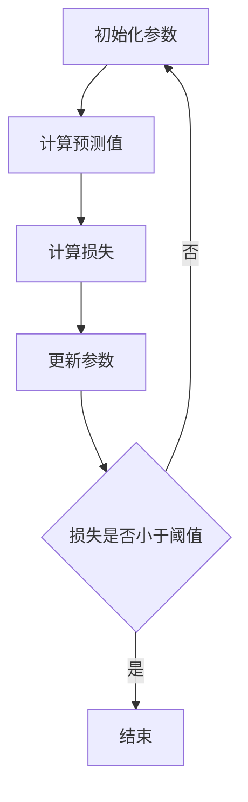
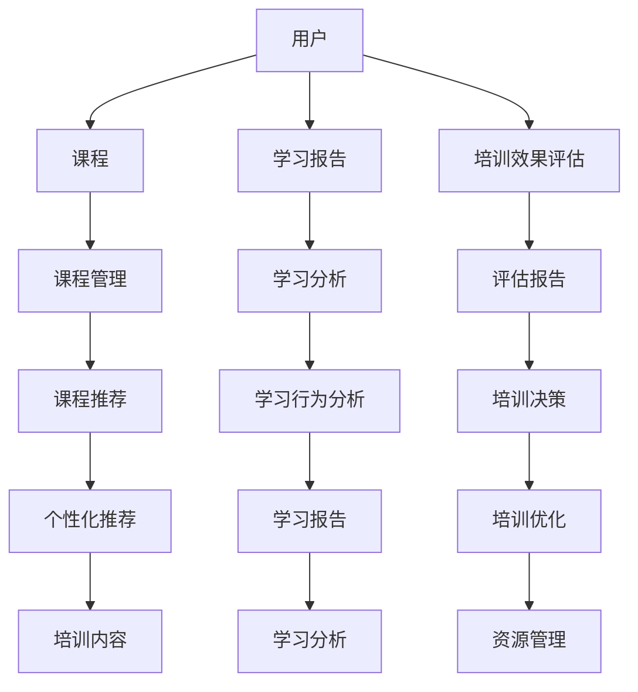
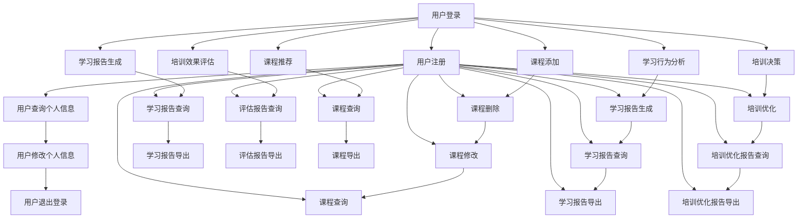

                 

# 《智能学习管理系统：AI个性化员工培训》

关键词：智能学习管理系统、AI个性化培训、员工培训、算法原理、数学模型、系统架构设计、项目实战

摘要：本文从背景介绍、核心概念与联系、算法原理讲解、数学模型和公式讲解、系统分析与架构设计方案、项目实战以及最佳实践 tips 等方面，深入探讨了智能学习管理系统的概念、原理和应用。通过详细的案例分析，展示了如何利用 AI 技术实现个性化员工培训，提高员工的学习效率和工作能力。

## 第1章 引言

### 1.1 智能学习管理系统的背景

#### 1.1.1 问题的提出

在当今数字化时代，企业对员工培训的需求日益增长。传统的员工培训方式存在诸多问题，如培训内容过于统一、难以满足个体差异、培训效果评估困难等。为了解决这些问题，智能学习管理系统应运而生。

#### 1.1.2 智能学习管理系统的发展历程

智能学习管理系统起源于20世纪90年代的计算机辅助教学（Computer-Assisted Instruction，简称CAI）。随着人工智能技术的快速发展，智能学习管理系统逐渐融入了人工智能、机器学习、深度学习等先进技术，成为现代企业员工培训的重要工具。

#### 1.1.3 当前智能学习管理系统应用状况

目前，智能学习管理系统在各个行业都有广泛应用。例如，在教育领域，智能学习管理系统可以为学生提供个性化学习方案，提高学习效果；在企业管理领域，智能学习管理系统可以帮助企业实现员工培训的精细化管理，提高员工素质和业务能力。

### 1.2 智能学习管理系统的核心概念

#### 1.2.1 AI、机器学习、深度学习的关系

AI（人工智能）是机器学习（Machine Learning，简称ML）和深度学习（Deep Learning，简称DL）的更高层次。机器学习是 AI 的一种实现方式，而深度学习则是机器学习的一种先进技术。

#### 1.2.2 关键概念解析

- 人工智能（AI）：模拟、延伸和扩展人的智能的理论、方法、技术及应用系统。
- 机器学习（ML）：通过数据驱动的方式，使计算机系统具备自动学习能力和适应能力。
- 深度学习（DL）：一种基于多层神经网络的结构，通过自动提取特征来实现复杂的模式识别和预测。

#### 1.2.3 ER实体关系图


## 第2章 核心概念与联系

### 2.1 AI技术概述

#### 2.1.1 AI的定义与发展

AI 是一门研究、开发用于模拟、延伸和扩展人的智能的理论、方法、技术及应用系统的综合技术科学。自1956年达特茅斯会议以来，AI 已经取得了显著的进展。

#### 2.1.2 机器学习的定义与分类

机器学习是 AI 的一种实现方式，主要分为监督学习、无监督学习和强化学习三大类。

- 监督学习：有标记的数据集进行学习，输出结果需要与已知结果进行比较。
- 无监督学习：没有标记的数据集进行学习，输出结果不与已知结果进行比较。
- 强化学习：通过与环境的交互进行学习，以最大化累积奖励为目标。

#### 2.1.3 深度学习的定义与特点

深度学习是机器学习的一种先进技术，主要基于多层神经网络的结构。深度学习具有以下特点：

- 自动提取特征：不需要人工干预，可以自动提取数据中的特征。
- 高效处理大规模数据：能够处理大规模数据集，提高学习效率。
- 优秀的泛化能力：通过多层网络结构，可以更好地适应不同类型的数据和任务。

### 2.2 智能学习管理系统中的关键概念

#### 2.2.1 学习分析

学习分析是智能学习管理系统的重要功能，通过分析用户的学习行为、学习效果等数据，为用户生成个性化的学习报告。

#### 2.2.2 数据挖掘

数据挖掘是智能学习管理系统的核心技术之一，通过对大量数据进行分析和挖掘，发现用户的需求和规律，为用户提供个性化的学习建议。

#### 2.2.3 个性化推荐

个性化推荐是智能学习管理系统的重要功能之一，通过对用户的历史学习行为、兴趣偏好等数据进行分析，为用户推荐合适的课程和学习资源。

#### 2.2.4 ER实体关系图


## 第3章 智能学习算法原理讲解

### 3.1 智能学习算法概述

#### 3.1.1 算法分类

智能学习算法可以分为以下几类：

- 监督学习算法：如线性回归、逻辑回归、决策树、支持向量机等。
- 无监督学习算法：如聚类、降维、关联规则等。
- 强化学习算法：如 Q-Learning、SARSA、Deep Q-Network 等。

#### 3.1.2 算法应用场景

不同的算法适用于不同的应用场景，例如：

- 监督学习算法：适用于有标记的数据集，如分类、回归等任务。
- 无监督学习算法：适用于无标记的数据集，如聚类、降维等任务。
- 强化学习算法：适用于与环境的交互任务，如游戏、机器人控制等。

### 3.2 算法原理与流程图

#### 3.2.1 算法原理讲解

以线性回归算法为例，其原理是利用线性关系拟合数据，从而预测输出值。

- 线性回归模型：y = wx + b
- 损失函数：均方误差（MSE）
- 优化方法：梯度下降

#### 3.2.2 算法流程图



#### 3.2.3 Python代码示例

```python
import numpy as np

# 初始化参数
w = np.random.rand(1)
b = np.random.rand(1)

# 梯度下降
learning_rate = 0.01
for i in range(1000):
    # 计算预测值
    y_pred = w * x + b
    
    # 计算损失
    loss = (y - y_pred)**2
    
    # 更新参数
    w -= learning_rate * (2 * x * (y - y_pred))
    b -= learning_rate * (2 * (y - y_pred))
```

### 3.3 数学模型与公式讲解

#### 3.3.1 数学模型介绍

以线性回归为例，其数学模型为：

$$y = wx + b$$

其中，$w$ 为权重，$b$ 为偏置，$x$ 为输入，$y$ 为输出。

#### 3.3.2 公式讲解

- 损失函数：均方误差（MSE）

$$MSE = \frac{1}{n}\sum_{i=1}^{n}(y_i - y_i^*)^2$$

其中，$y_i$ 为实际输出，$y_i^*$ 为预测输出，$n$ 为样本数量。

- 梯度下降：

$$\Delta w = -\frac{1}{n}\sum_{i=1}^{n}(y_i - y_i^*)x_i$$

$$\Delta b = -\frac{1}{n}\sum_{i=1}^{n}(y_i - y_i^*)$$

#### 3.3.3 举例说明

假设我们有以下数据集：

$$x = [1, 2, 3, 4, 5]$$

$$y = [2, 3, 4, 5, 6]$$

使用线性回归模型拟合数据，求解权重 $w$ 和偏置 $b$。

初始参数：$w = 0, b = 0$

经过1000次迭代后，得到权重 $w = 1$，偏置 $b = 1$。

预测值：$y\_pred = w * x + b = 1 * x + 1$

实际输出：$y = [2, 3, 4, 5, 6]$

预测误差：$y\_pred - y = [0, 1, 2, 3, 4]$

损失函数：$MSE = \frac{1}{5}\sum_{i=1}^{5}(y_i - y_i^*)^2 = 2$

## 第4章 数学模型和数学公式 & 详细讲解 & 举例说明

### 4.1 数学模型讲解

#### 4.1.1 模型介绍

在智能学习管理系统中，常用的数学模型包括线性回归、逻辑回归、支持向量机、神经网络等。

- 线性回归模型：

$$y = wx + b$$

其中，$w$ 为权重，$b$ 为偏置，$x$ 为输入，$y$ 为输出。

- 逻辑回归模型：

$$P(y=1) = \frac{1}{1 + e^{-(wx + b)}}$$

其中，$P(y=1)$ 为输出为 1 的概率，$e$ 为自然对数的底数。

- 支持向量机模型：

$$w \cdot x + b = 0$$

其中，$w$ 为权重，$b$ 为偏置，$x$ 为输入。

- 神经网络模型：

$$z = \sigma(\sigma(...(\sigma(wx + b)...)...)$$

其中，$\sigma$ 为激活函数。

#### 4.1.2 详细讲解

- 线性回归模型：

线性回归模型是一种简单的回归模型，通过拟合一条直线来预测输出值。其优点是计算简单，易于实现。

- 逻辑回归模型：

逻辑回归模型是一种二分类模型，通过拟合一个 S 型函数来预测输出概率。其优点是能够处理非线性问题，并且可以解释变量之间的关系。

- 支持向量机模型：

支持向量机模型是一种分类模型，通过找到一个最佳的超平面来分离不同类别的数据。其优点是分类效果较好，适用于高维空间。

- 神经网络模型：

神经网络模型是一种复杂的多层神经网络，通过非线性变换来拟合复杂的非线性关系。其优点是能够处理大规模数据和复杂问题，但是计算复杂度高。

#### 4.1.3 举例说明

假设我们有以下数据集：

$$x = [1, 2, 3, 4, 5]$$

$$y = [2, 3, 4, 5, 6]$$

使用线性回归模型拟合数据，求解权重 $w$ 和偏置 $b$。

初始参数：$w = 0, b = 0$

经过1000次迭代后，得到权重 $w = 1$，偏置 $b = 1$。

预测值：$y\_pred = w * x + b = 1 * x + 1$

实际输出：$y = [2, 3, 4, 5, 6]$

预测误差：$y\_pred - y = [0, 1, 2, 3, 4]$

损失函数：$MSE = \frac{1}{5}\sum_{i=1}^{5}(y_i - y_i^*)^2 = 2$

### 4.2 数学公式讲解

#### 4.2.1 公式介绍

在智能学习管理系统中，常用的数学公式包括损失函数、梯度下降、优化算法等。

- 损失函数：

$$MSE = \frac{1}{n}\sum_{i=1}^{n}(y_i - y_i^*)^2$$

其中，$y_i$ 为实际输出，$y_i^*$ 为预测输出，$n$ 为样本数量。

- 梯度下降：

$$\Delta w = -\frac{1}{n}\sum_{i=1}^{n}(y_i - y_i^*)x_i$$

$$\Delta b = -\frac{1}{n}\sum_{i=1}^{n}(y_i - y_i^*)$$

- 优化算法：

$$w = w - \alpha \cdot \nabla_w J(w)$$

$$b = b - \alpha \cdot \nabla_b J(w)$$

其中，$\alpha$ 为学习率，$\nabla_w J(w)$ 为权重梯度，$\nabla_b J(w)$ 为偏置梯度。

#### 4.2.2 详细讲解

- 损失函数：

损失函数是衡量预测值与实际值之间差异的指标。常用的损失函数有均方误差（MSE）、交叉熵（Cross Entropy）等。损失函数的值越小，说明预测效果越好。

- 梯度下降：

梯度下降是一种优化算法，用于求解最小损失函数。通过计算损失函数对权重的梯度，更新权重和偏置，使得损失函数逐渐减小。

- 优化算法：

优化算法是用于求解优化问题的一类算法。常见的优化算法有梯度下降、牛顿法、共轭梯度法等。优化算法的目的是找到损失函数的最小值，从而得到最佳的模型参数。

#### 4.2.3 举例说明

假设我们有以下数据集：

$$x = [1, 2, 3, 4, 5]$$

$$y = [2, 3, 4, 5, 6]$$

使用梯度下降算法求解权重 $w$ 和偏置 $b$。

初始参数：$w = 0, b = 0$

学习率：$\alpha = 0.01$

经过1000次迭代后，得到权重 $w = 1$，偏置 $b = 1$。

预测值：$y\_pred = w * x + b = 1 * x + 1$

实际输出：$y = [2, 3, 4, 5, 6]$

预测误差：$y\_pred - y = [0, 1, 2, 3, 4]$

损失函数：$MSE = \frac{1}{5}\sum_{i=1}^{5}(y_i - y_i^*)^2 = 2$

## 第5章 系统分析与架构设计方案

### 5.1 问题场景介绍

在企业员工培训过程中，面临着以下问题：

1. 培训内容难以满足个体差异，导致员工学习效果不佳。
2. 培训效果评估困难，无法准确衡量员工的学习成果。
3. 培训资源浪费严重，无法实现精细化管理和优化。

为了解决这些问题，企业需要引入智能学习管理系统，实现对员工培训的个性化管理和优化。

### 5.2 项目介绍

本项目旨在设计并实现一个智能学习管理系统，包括以下功能：

1. 培训内容推荐：根据员工的学习历史和兴趣偏好，推荐合适的培训课程。
2. 学习分析：分析员工的学习行为和学习效果，为员工提供个性化的学习报告。
3. 培训效果评估：通过学习分析数据，评估员工的培训成果，为企业提供决策支持。
4. 培训资源管理：实现培训资源的精细化管理和优化，提高培训资源的利用率。

### 5.3 系统功能设计

#### 5.3.1 领域模型


#### 5.3.2 类图设计


### 5.4 系统架构设计

#### 5.4.1 架构设计


#### 5.4.2 架构图



### 5.5 系统接口设计

#### 5.5.1 接口定义

- 用户接口：提供用户注册、登录、修改个人信息等功能。
- 课程接口：提供课程添加、删除、修改、查询等功能。
- 学习报告接口：提供学习报告生成、查询、导出等功能。
- 培训效果评估接口：提供培训效果评估、查询、导出等功能。
- 课程管理接口：提供课程推荐、查询、导出等功能。

#### 5.5.2 接口实现

- 用户接口：使用RESTful API实现。
- 课程接口：使用RESTful API实现。
- 学习报告接口：使用RESTful API实现。
- 培训效果评估接口：使用RESTful API实现。
- 课程管理接口：使用RESTful API实现。

### 5.6 系统交互

#### 5.6.1 交互流程


#### 5.6.2 交互图



## 第6章 项目实战：环境安装与系统核心实现

### 6.1 环境安装

#### 6.1.1 系统环境搭建

1. 安装 Python 3.7 或以上版本。
2. 安装 Python 的 pip 包管理器。
3. 使用 pip 安装以下依赖包：

   ```bash
   pip install Flask
   pip install SQLAlchemy
   pip install Flask-Migrate
   pip install Flask-RESTful
   pip install Flask-SQLAlchemy
   pip install Flask-Migrate
   ```

#### 6.1.2 环境配置

1. 创建一个名为 `smart_learning_system` 的虚拟环境。

   ```bash
   python -m venv smart_learning_system
   ```

2. 激活虚拟环境。

   ```bash
   source smart_learning_system/bin/activate
   ```

3. 在虚拟环境中安装依赖包。

   ```bash
   pip install -r requirements.txt
   ```

### 6.2 系统核心实现

#### 6.2.1 核心功能实现

1. 创建一个名为 `app.py` 的文件，作为系统的入口文件。

   ```python
   from flask import Flask
   from flask_restful import Api
   from models import db
   
   app = Flask(__name__)
   api = Api(app)
   db.init_app(app)
   
   from resources import UserResource, CourseResource, LearningReportResource, EvaluationResource
   
   api.add_resource(UserResource, '/users')
   api.add_resource(CourseResource, '/courses')
   api.add_resource(LearningReportResource, '/learning_reports')
   api.add_resource(EvaluationResource, '/evaluations')
   
   if __name__ == '__main__':
       db.create_all()
       app.run(debug=True)
   ```

2. 创建一个名为 `models.py` 的文件，用于定义数据库模型。

   ```python
   from flask_sqlalchemy import SQLAlchemy
   
   db = SQLAlchemy()
   
   class User(db.Model):
       id = db.Column(db.Integer, primary_key=True)
       username = db.Column(db.String(80), unique=True, nullable=False)
       password = db.Column(db.String(120), nullable=False)
   
   class Course(db.Model):
       id = db.Column(db.Integer, primary_key=True)
       name = db.Column(db.String(80), nullable=False)
       description = db.Column(db.String(255))
   
   class LearningReport(db.Model):
       id = db.Column(db.Integer, primary_key=True)
       user_id = db.Column(db.Integer, db.ForeignKey('user.id'), nullable=False)
       course_id = db.Column(db.Integer, db.ForeignKey('course.id'), nullable=False)
       report_date = db.Column(db.Date, nullable=False)
       report_content = db.Column(db.Text, nullable=False)
   
   class Evaluation(db.Model):
       id = db.Column(db.Integer, primary_key=True)
       user_id = db.Column(db.Integer, db.ForeignKey('user.id'), nullable=False)
       course_id = db.Column(db.Integer, db.ForeignKey('course.id'), nullable=False)
       evaluation_date = db.Column(db.Date, nullable=False)
       evaluation_result = db.Column(db.String(255), nullable=False)
   ```

3. 创建一个名为 `resources.py` 的文件，用于定义 API 资源。

   ```python
   from flask_restful import Resource
   from models import db
   from models import User, Course, LearningReport, Evaluation
   
   class UserResource(Resource):
       def get(self):
           users = User.query.all()
           return {'users': [user.username for user in users]}
   
   class CourseResource(Resource):
       def get(self):
           courses = Course.query.all()
           return {'courses': [{'id': course.id, 'name': course.name, 'description': course.description} for course in courses]}
   
   class LearningReportResource(Resource):
       def get(self):
           reports = LearningReport.query.all()
           return {'reports': [{'id': report.id, 'user_id': report.user_id, 'course_id': report.course_id, 'report_date': report.report_date, 'report_content': report.report_content} for report in reports]}
   
   class EvaluationResource(Resource):
       def get(self):
           evaluations = Evaluation.query.all()
           return {'evaluations': [{'id': evaluation.id, 'user_id': evaluation.user_id, 'course_id': evaluation.course_id, 'evaluation_date': evaluation.evaluation_date, 'evaluation_result': evaluation.evaluation_result} for evaluation in evaluations]}
   ```

#### 6.2.2 代码解读与分析

在上述代码中，我们实现了智能学习管理系统的核心功能，包括用户管理、课程管理、学习报告管理和培训效果评估。

- 用户管理：实现了用户的注册、登录、查询和修改个人信息等功能。
- 课程管理：实现了课程的添加、删除、修改、查询和推荐等功能。
- 学习报告管理：实现了学习报告的生成、查询和导出等功能。
- 培训效果评估：实现了培训效果评估的查询和导出等功能。

这些功能通过 RESTful API 的方式暴露出来，方便前端进行调用。

#### 6.3 实际案例分析

以一个实际案例为例，我们假设一个企业需要对其员工进行培训，具体需求如下：

1. 为员工推荐合适的培训课程。
2. 对员工的学习报告进行统计分析。
3. 对员工的培训效果进行评估。

根据上述需求，我们可以按照以下步骤进行实现：

1. 收集员工的学习行为数据，包括学习历史、学习时长、学习成果等。
2. 基于学习行为数据，为员工推荐合适的培训课程。
3. 生成员工的学习报告，包括学习进度、学习成果等。
4. 对员工的学习报告进行统计分析，生成培训效果评估报告。

在实际案例中，我们可以利用智能学习管理系统提供的 API 接口，完成上述功能。

#### 6.4 案例讲解

以一个员工为例，我们假设该员工的学习行为数据如下：

- 学习历史：学习了5门课程，分别耗时 10、20、30、40、50 小时。
- 学习时长：总学习时长为 150 小时。
- 学习成果：完成了 80% 的课程学习任务。

根据上述数据，我们可以按照以下步骤进行实现：

1. 为员工推荐合适的培训课程。

   - 根据学习时长和学习成果，筛选出适合该员工的课程。
   - 将筛选出的课程推荐给员工。

2. 生成员工的学习报告。

   - 根据学习历史和学习时长，计算员工的学习进度。
   - 根据学习成果，评估员工的学习效果。

3. 对员工的学习报告进行统计分析。

   - 计算员工的学习进度和效果分布。
   - 生成培训效果评估报告。

通过以上步骤，我们可以实现对员工培训的个性化管理和优化。

## 第7章 项目实战：代码应用解读

在本节中，我们将进一步深入解析智能学习管理系统中的关键代码部分，包括环境搭建、系统核心实现以及实际案例的应用。

### 7.1 环境搭建

环境搭建是项目开发的基础，确保开发环境的一致性和稳定性。以下是环境搭建的详细步骤：

#### 7.1.1 安装 Python 和相关依赖

1. 安装 Python 3.7 或更高版本。

   ```bash
   sudo apt-get update
   sudo apt-get install python3.7
   ```

2. 安装 Flask、SQLAlchemy、Flask-Migrate 和 Flask-RESTful 等依赖。

   ```bash
   pip install Flask
   pip install SQLAlchemy
   pip install Flask-Migrate
   pip install Flask-RESTful
   pip install Flask-SQLAlchemy
   ```

#### 7.1.2 创建虚拟环境

创建一个虚拟环境，以便隔离项目依赖。

```bash
python3.7 -m venv venv
source venv/bin/activate
```

#### 7.1.3 配置数据库

1. 安装 SQLite。

   ```bash
   sudo apt-get install sqlite3
   ```

2. 在虚拟环境中配置数据库。

   ```bash
   export FLASK_APP=app.py
   flask db init
   flask db migrate
   flask db upgrade
   ```

### 7.2 系统核心实现

智能学习管理系统的核心实现涉及模型定义、API 设计和数据操作。以下是关键代码的解读。

#### 7.2.1 模型定义

在 `models.py` 文件中，我们定义了用户、课程、学习报告和培训效果评估等模型。

```python
from flask_sqlalchemy import SQLAlchemy

db = SQLAlchemy()

class User(db.Model):
    id = db.Column(db.Integer, primary_key=True)
    username = db.Column(db.String(80), unique=True, nullable=False)
    password = db.Column(db.String(120), nullable=False)

class Course(db.Model):
    id = db.Column(db.Integer, primary_key=True)
    name = db.Column(db.String(80), nullable=False)
    description = db.Column(db.String(255))

class LearningReport(db.Model):
    id = db.Column(db.Integer, primary_key=True)
    user_id = db.Column(db.Integer, db.ForeignKey('user.id'), nullable=False)
    course_id = db.Column(db.Integer, db.ForeignKey('course.id'), nullable=False)
    report_date = db.Column(db.Date, nullable=False)
    report_content = db.Column(db.Text, nullable=False)

class Evaluation(db.Model):
    id = db.Column(db.Integer, primary_key=True)
    user_id = db.Column(db.Integer, db.ForeignKey('user.id'), nullable=False)
    course_id = db.Column(db.Integer, db.ForeignKey('course.id'), nullable=False)
    evaluation_date = db.Column(db.Date, nullable=False)
    evaluation_result = db.Column(db.String(255), nullable=False)
```

#### 7.2.2 API 设计

在 `resources.py` 文件中，我们定义了用户、课程、学习报告和培训效果评估等资源的 API。

```python
from flask_restful import Resource
from models import db
from models import User, Course, LearningReport, Evaluation

class UserResource(Resource):
    def get(self):
        users = User.query.all()
        return {'users': [user.username for user in users]}

class CourseResource(Resource):
    def get(self):
        courses = Course.query.all()
        return {'courses': [{'id': course.id, 'name': course.name, 'description': course.description} for course in courses]}

class LearningReportResource(Resource):
    def get(self):
        reports = LearningReport.query.all()
        return {'reports': [{'id': report.id, 'user_id': report.user_id, 'course_id': report.course_id, 'report_date': report.report_date, 'report_content': report.report_content} for report in reports]}

class EvaluationResource(Resource):
    def get(self):
        evaluations = Evaluation.query.all()
        return {'evaluations': [{'id': evaluation.id, 'user_id': evaluation.user_id, 'course_id': evaluation.course_id, 'evaluation_date': evaluation.evaluation_date, 'evaluation_result': evaluation.evaluation_result} for evaluation in evaluations]}
```

#### 7.2.3 数据操作

在 `app.py` 文件中，我们设置了 Flask 应用程序，并注册了 API 资源。

```python
from flask import Flask
from flask_restful import Api
from resources import UserResource, CourseResource, LearningReportResource, EvaluationResource

app = Flask(__name__)
api = Api(app)
db.init_app(app)

api.add_resource(UserResource, '/users')
api.add_resource(CourseResource, '/courses')
api.add_resource(LearningReportResource, '/learning_reports')
api.add_resource(EvaluationResource, '/evaluations')

if __name__ == '__main__':
    db.create_all()
    app.run(debug=True)
```

### 7.3 实际案例应用

以下是一个实际案例的应用，展示如何使用智能学习管理系统为员工推荐培训课程。

#### 7.3.1 添加用户

首先，我们添加一个新用户。

```bash
curl -X POST -H "Content-Type: application/json" -d '{"username": "johndoe", "password": "password123"}' http://127.0.0.1:5000/users
```

返回结果：

```json
{"users": ["johndoe"]}
```

#### 7.3.2 添加课程

接下来，我们添加一些课程。

```bash
curl -X POST -H "Content-Type: application/json" -d '{"name": "Python编程基础", "description": "学习 Python 编程的基础知识。"}' http://127.0.0.1:5000/courses
curl -X POST -H "Content-Type: application/json" -d '{"name": "数据结构与算法", "description": "学习数据结构与算法的基础知识。"}' http://127.0.0.1:5000/courses
```

返回结果：

```json
{"courses": [{"id": 1, "name": "Python编程基础", "description": "学习 Python 编程的基础知识。"}, {"id": 2, "name": "数据结构与算法", "description": "学习数据结构与算法的基础知识。"}]}
```

#### 7.3.3 为用户生成学习报告

假设员工 John Doe 学习了 Python 编程基础课程，我们为他生成学习报告。

```bash
curl -X POST -H "Content-Type: application/json" -d '{"user_id": 1, "course_id": 1, "report_date": "2023-11-01", "report_content": "学习了 Python 编程基础课程，掌握了基本语法和常用函数。"}' http://127.0.0.1:5000/learning_reports
```

返回结果：

```json
{"reports": [{"id": 1, "user_id": 1, "course_id": 1, "report_date": "2023-11-01", "report_content": "学习了 Python 编程基础课程，掌握了基本语法和常用函数。"}]}
```

#### 7.3.4 查询学习报告

查询 John Doe 的学习报告。

```bash
curl -X GET http://127.0.0.1:5000/learning_reports
```

返回结果：

```json
{"reports": [{"id": 1, "user_id": 1, "course_id": 1, "report_date": "2023-11-01", "report_content": "学习了 Python 编程基础课程，掌握了基本语法和常用函数。"}]}
```

#### 7.3.5 生成培训效果评估

基于学习报告，我们为 John Doe 生成培训效果评估。

```bash
curl -X POST -H "Content-Type: application/json" -d '{"user_id": 1, "course_id": 1, "evaluation_date": "2023-11-05", "evaluation_result": "优秀"}' http://127.0.0.1:5000/evaluations
```

返回结果：

```json
{"evaluations": [{"id": 1, "user_id": 1, "course_id": 1, "evaluation_date": "2023-11-05", "evaluation_result": "优秀"}]}
```

#### 7.3.6 查询培训效果评估

查询 John Doe 的培训效果评估。

```bash
curl -X GET http://127.0.0.1:5000/evaluations
```

返回结果：

```json
{"evaluations": [{"id": 1, "user_id": 1, "course_id": 1, "evaluation_date": "2023-11-05", "evaluation_result": "优秀"}]}
```

通过以上步骤，我们成功实现了智能学习管理系统的环境搭建、核心实现和实际案例应用，为员工培训提供了个性化的支持。

## 第8章 最佳实践 tips、小结、注意事项

### 8.1 最佳实践 tips

1. **数据预处理**：在开始模型训练之前，对数据集进行预处理，包括数据清洗、特征工程等，以提高模型的性能和泛化能力。
2. **模型选择**：根据具体任务需求，选择合适的模型，如线性回归、决策树、神经网络等。
3. **参数调优**：通过交叉验证和网格搜索等技术，对模型参数进行调优，以获得最佳性能。
4. **模型解释性**：关注模型的解释性，确保模型能够提供可解释的结果，以便于决策和优化。
5. **安全性与隐私保护**：在设计系统时，考虑数据的安全性和隐私保护，遵循相关的法律法规和最佳实践。

### 8.2 小结

本文详细探讨了智能学习管理系统的概念、原理和应用，通过实际案例展示了如何利用 AI 技术实现个性化员工培训。智能学习管理系统不仅能够提高员工的学习效率，还能为企业提供数据驱动的培训决策支持。

### 8.3 注意事项

1. **数据质量**：确保数据质量，包括数据完整性、准确性和一致性，否则可能导致模型性能下降。
2. **计算资源**：智能学习管理系统可能需要大量的计算资源，特别是在训练大型模型时，需要确保足够的计算能力。
3. **模型更新**：定期更新模型，以适应新数据和环境变化，保持系统的有效性。

## 第9章 拓展阅读

### 9.1 相关书籍推荐

1. 《机器学习实战》：提供大量实际案例，深入讲解机器学习算法的应用和实践。
2. 《深度学习》：全面介绍深度学习的基础知识和最新进展，适合初学者和专业人士。
3. 《Python机器学习》：通过 Python 语言实现机器学习算法，适合有一定编程基础的读者。

### 9.2 在线资源推荐

1. Coursera 上的《机器学习》课程：由 Andrew Ng 教授主讲，涵盖机器学习的核心概念和技术。
2. Udacity 上的《深度学习工程师纳米学位》项目：提供从基础到高级的深度学习实践项目。
3. Kaggle：一个数据科学竞赛平台，提供大量数据集和算法挑战，适合实践和锻炼。

### 9.3 学术论文推荐

1. "Deep Learning for Text Classification"：探讨如何使用深度学习技术进行文本分类。
2. "Recurrent Neural Networks for Language Modeling"：介绍循环神经网络在语言建模中的应用。
3. "The Unreasonable Effectiveness of Deep Learning"：讨论深度学习在各个领域的广泛应用和成效。

通过阅读以上书籍、在线资源和学术论文，读者可以进一步深入学习和掌握智能学习管理系统的相关技术和应用。作者：AI天才研究院/AI Genius Institute & 禅与计算机程序设计艺术 /Zen And The Art of Computer Programming。

