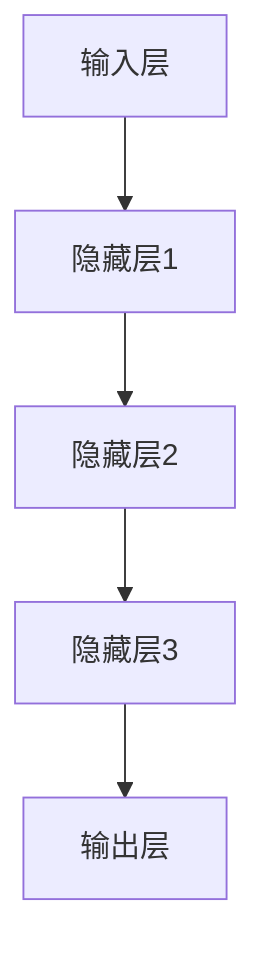
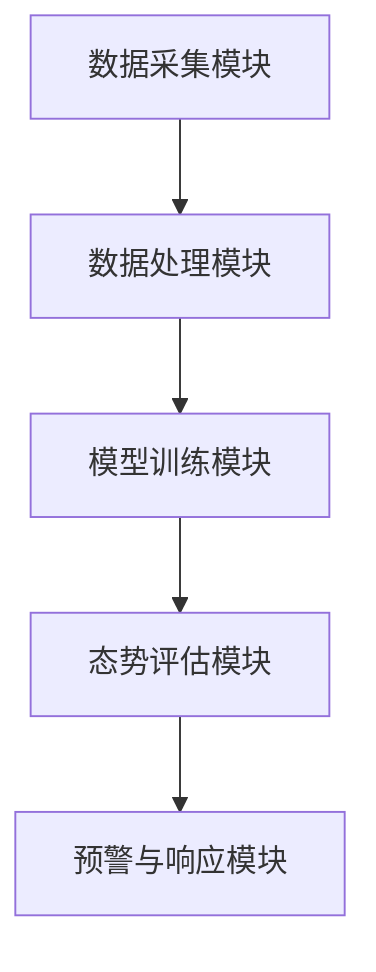
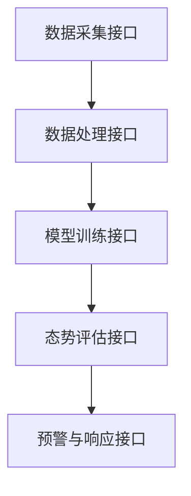

                 

# 智能安全态势感知：AI全面监控风险

## 关键词

- 智能安全态势感知
- 人工智能
- 网络安全
- 大数据
- 数据挖掘

## 摘要

本文旨在系统地介绍智能安全态势感知的概念、技术原理、应用场景以及实现方法。随着网络攻击手段的日益复杂，传统安全防护已无法应对。智能安全态势感知通过人工智能技术，实时监测网络安全态势，为网络安全提供一种全新的解决方案。本文将详细探讨智能安全态势感知的核心概念，AI技术在该领域中的应用，以及在不同应用场景中的实现方法。

### 第一部分：引言

#### 1.1 问题背景与目标

网络安全威胁日益增多，网络攻击手段不断升级。传统的安全防护手段已无法满足日益复杂的网络安全需求。智能安全态势感知作为一种新型网络安全技术，利用人工智能（AI）技术对网络安全进行全方位监控和风险评估，为网络安全提供了一种全新的解决方案。本文旨在系统地介绍智能安全态势感知的概念、技术原理、应用场景以及实现方法，帮助读者深入了解这一领域的核心知识，并掌握实际应用能力。

#### 1.2 问题描述与解决

智能安全态势感知涉及多个学科领域，包括网络安全、人工智能、数据挖掘和大数据技术等。它通过实时采集和分析网络流量、日志数据、安全事件等信息，动态生成安全态势图，对潜在的安全威胁进行预警和响应。本文将围绕以下问题展开讨论：

- 智能安全态势感知的核心概念是什么？
- 它如何利用AI技术对网络安全进行监测？
- 智能安全态势感知在不同应用场景中的具体实现方法是什么？
- 在实施智能安全态势感知过程中，会遇到哪些挑战？

#### 1.3 边界与外延

智能安全态势感知不仅关注网络安全本身，还涉及到数据安全、隐私保护等多个方面。本文将涵盖以下内容：

- 网络安全基础，包括常见攻击类型、防御手段等。
- 人工智能技术在网络安全中的应用，如机器学习、深度学习等。
- 大数据技术在安全态势感知中的重要作用。
- 安全态势感知系统的构建方法和实施策略。

#### 1.4 概念结构与核心要素组成

智能安全态势感知系统的核心要素包括：

- 数据采集：通过网络流量、日志数据等渠道收集安全信息。
- 数据处理：对采集到的数据进行清洗、归一化等处理。
- 模型训练：利用机器学习算法对数据进行训练，构建安全态势预测模型。
- 态势评估：根据预测模型评估当前网络的安全状况。
- 预警与响应：当发现潜在的安全威胁时，及时发出警报并采取相应的应对措施。

### 第二部分：核心概念与联系

#### 2.1 智能安全态势感知

智能安全态势感知（Intelligent Security Situation Awareness, ISSA）是一种利用人工智能技术对网络安全进行实时监测、分析和预警的系统。它通过对海量数据的分析和挖掘，识别潜在的安全威胁，提供实时、准确的安全态势评估，从而帮助企业和组织制定有效的安全策略和应对措施。

#### 2.2 人工智能

人工智能（Artificial Intelligence, AI）是指计算机系统模拟、延伸和扩展人类智能的理论、方法和技术。在智能安全态势感知中，人工智能技术主要用于数据分析和模型训练，实现自动化、智能化的安全威胁检测和评估。

#### 2.3 大数据

大数据（Big Data）是指数据量巨大、类型繁多、价值密度较低的数据集合。在智能安全态势感知中，大数据技术用于收集、存储、处理和分析网络流量、日志数据等海量信息，为安全态势感知提供数据支持。

#### 2.4 数据挖掘

数据挖掘（Data Mining）是从大量数据中提取出具有价值的信息和知识的过程。在智能安全态势感知中，数据挖掘技术用于分析网络流量、日志数据等，发现潜在的安全威胁和异常行为。

#### 2.5 网络安全

网络安全（Cybersecurity）是指保护计算机系统、网络和数据免受恶意攻击、破坏和篡改的措施和技术。在智能安全态势感知中，网络安全是保障系统正常运行的基础，也是实现安全威胁检测和预警的关键。

#### 2.6 安全态势评估

安全态势评估（Security Situation Assessment）是指对网络系统的安全状况进行评估和预测的过程。在智能安全态势感知中，安全态势评估用于判断当前网络是否存在安全威胁，并提供相应的应对策略。

### 第三部分：主流AI技术在安全态势感知中的应用

#### 3.1 机器学习

机器学习（Machine Learning）是一种利用计算机算法自动从数据中学习、提取规律和模式的技术。在智能安全态势感知中，机器学习技术主要用于构建安全威胁检测和预测模型，实现自动化、智能化的安全威胁检测。

##### 3.1.1 机器学习技术原理

机器学习（Machine Learning）是一种通过利用统计方法和算法从数据中自动提取规律和模式的技术。在智能安全态势感知中，机器学习技术主要分为监督学习、无监督学习和半监督学习三种类型。

- **监督学习**：监督学习是一种在有标注数据集上进行训练的方法。它通过输入特征和对应的标签，学习特征和标签之间的关系，从而实现对未知数据的分类或回归。监督学习常用于构建安全威胁检测模型，如分类器和回归模型。

  ```mermaid
  graph TD
  A[监督学习] --> B[输入特征]
  B --> C[标签]
  C --> D[学习过程]
  D --> E[预测结果]
  ```

- **无监督学习**：无监督学习是一种在没有标注数据集上进行训练的方法。它通过学习数据之间的内在结构和关系，发现数据分布或聚类。无监督学习常用于发现网络中的异常行为和潜在的安全威胁。

  ```mermaid
  graph TD
  A[无监督学习] --> B[输入特征]
  B --> C[数据分布]
  C --> D[聚类结果]
  ```

- **半监督学习**：半监督学习是一种在有少量标注数据和无标注数据集上进行训练的方法。它通过利用无标注数据的分布信息，提高模型对未知数据的分类或回归性能。半监督学习可以有效地降低数据标注成本，提高安全态势感知系统的鲁棒性。

  ```mermaid
  graph TD
  A[半监督学习] --> B[标注数据]
  B --> C[无标注数据]
  C --> D[学习过程]
  D --> E[预测结果]
  ```

##### 3.1.2 机器学习算法应用示例

以网络安全中的入侵检测为例，假设我们使用K-近邻算法（K-Nearest Neighbors, KNN）进行安全威胁检测。KNN算法的基本思想是：如果一个新样本在特征空间中的K个最近邻中大多数属于同一个类别，则该样本也属于这个类别。

```python
import numpy as np
from sklearn.neighbors import KNeighborsClassifier
from sklearn.model_selection import train_test_split
from sklearn.metrics import accuracy_score

# 假设我们已经收集到了一个包含特征和标签的训练数据集
X = ...  # 特征数据
y = ...  # 标签数据

# 将数据集划分为训练集和测试集
X_train, X_test, y_train, y_test = train_test_split(X, y, test_size=0.2, random_state=42)

# 使用KNN算法进行训练
knn = KNeighborsClassifier(n_neighbors=3)
knn.fit(X_train, y_train)

# 对测试集进行预测
y_pred = knn.predict(X_test)

# 计算预测准确率
accuracy = accuracy_score(y_test, y_pred)
print("预测准确率：", accuracy)
```

##### 3.1.3 机器学习在安全态势感知中的应用优势

- **自动化检测**：机器学习算法可以自动从海量数据中提取特征和模式，实现自动化安全威胁检测，降低人工成本。
- **实时响应**：机器学习算法可以实时更新模型，适应不断变化的安全威胁，提高检测效率和准确性。
- **高鲁棒性**：机器学习算法对噪声数据和异常值具有较强的鲁棒性，可以有效地识别潜在的安全威胁。

#### 3.2 深度学习

深度学习（Deep Learning）是机器学习的一种方法，通过多层神经网络对数据进行学习、建模和预测。在智能安全态势感知中，深度学习技术可以用于构建复杂的威胁检测模型，提高检测准确率和效率。

##### 3.2.1 深度学习技术原理

深度学习（Deep Learning）是一种利用多层神经网络进行数据建模和预测的技术。多层神经网络由多个神经元层组成，通过逐层提取特征，实现复杂模式的识别和分类。



##### 3.2.2 深度学习算法应用示例

以网络安全中的恶意软件检测为例，假设我们使用卷积神经网络（Convolutional Neural Network, CNN）进行检测。CNN通过卷积层、池化层和全连接层等结构，对恶意软件进行特征提取和分类。

```python
import tensorflow as tf
from tensorflow.keras.models import Sequential
from tensorflow.keras.layers import Conv2D, MaxPooling2D, Flatten, Dense

# 假设我们已经收集到了一个包含恶意软件图像和标签的训练数据集
X = ...  # 恶意软件图像数据
y = ...  # 标签数据

# 将数据集划分为训练集和测试集
X_train, X_test, y_train, y_test = train_test_split(X, y, test_size=0.2, random_state=42)

# 构建CNN模型
model = Sequential()
model.add(Conv2D(filters=32, kernel_size=(3, 3), activation='relu', input_shape=(28, 28, 1)))
model.add(MaxPooling2D(pool_size=(2, 2)))
model.add(Flatten())
model.add(Dense(units=128, activation='relu'))
model.add(Dense(units=1, activation='sigmoid'))

# 编译模型
model.compile(optimizer='adam', loss='binary_crossentropy', metrics=['accuracy'])

# 训练模型
model.fit(X_train, y_train, batch_size=64, epochs=10, validation_data=(X_test, y_test))

# 对测试集进行预测
y_pred = model.predict(X_test)

# 计算预测准确率
accuracy = np.mean(y_pred == y_test)
print("预测准确率：", accuracy)
```

##### 3.2.3 深度学习在安全态势感知中的应用优势

- **特征自动提取**：深度学习算法可以通过多层神经网络自动提取特征，实现复杂模式的识别和分类。
- **高检测准确率**：深度学习算法在处理高维数据时具有较好的准确率，可以提高安全态势感知的准确性和鲁棒性。
- **实时性**：深度学习算法可以在较短的时间内进行模型训练和预测，实现实时安全威胁检测。

### 第四部分：系统分析与架构设计方案

#### 4.1 问题场景介绍

随着互联网的普及和发展，企业和组织对网络安全的依赖程度越来越高。然而，网络攻击手段不断升级，传统安全防护手段已无法满足日益复杂的网络安全需求。为了提高网络安全性，我们需要构建一个智能安全态势感知系统，实现对网络安全的实时监测、分析和预警。

#### 4.2 项目介绍

本项目旨在设计并实现一个基于人工智能技术的智能安全态势感知系统。该系统将实时采集和分析网络流量、日志数据等，通过机器学习和深度学习算法，对潜在的安全威胁进行预警和响应，提高网络安全性。

#### 4.3 系统功能设计

智能安全态势感知系统的主要功能包括：

- **数据采集**：从网络流量、日志数据等渠道收集安全信息。
- **数据处理**：对采集到的数据进行清洗、归一化等处理。
- **模型训练**：利用机器学习和深度学习算法，训练安全威胁检测模型。
- **态势评估**：根据预测模型评估当前网络的安全状况。
- **预警与响应**：当发现潜在的安全威胁时，及时发出警报并采取相应的应对措施。

#### 4.4 系统架构设计

智能安全态势感知系统的架构设计包括以下模块：

- **数据采集模块**：负责从网络流量、日志数据等渠道收集安全信息。
- **数据处理模块**：负责对采集到的数据进行清洗、归一化等处理。
- **模型训练模块**：负责利用机器学习和深度学习算法，训练安全威胁检测模型。
- **态势评估模块**：负责根据预测模型评估当前网络的安全状况。
- **预警与响应模块**：负责当发现潜在的安全威胁时，及时发出警报并采取相应的应对措施。



#### 4.5 系统接口设计

智能安全态势感知系统的主要接口包括：

- **数据采集接口**：用于从网络流量、日志数据等渠道收集安全信息。
- **数据处理接口**：用于对采集到的数据进行清洗、归一化等处理。
- **模型训练接口**：用于利用机器学习和深度学习算法，训练安全威胁检测模型。
- **态势评估接口**：用于根据预测模型评估当前网络的安全状况。
- **预警与响应接口**：用于当发现潜在的安全威胁时，及时发出警报并采取相应的应对措施。



#### 4.6 系统交互设计

智能安全态势感知系统的交互设计包括以下流程：

1. 数据采集模块从网络流量、日志数据等渠道收集安全信息。
2. 数据处理模块对采集到的数据进行清洗、归一化等处理。
3. 模型训练模块利用机器学习和深度学习算法，训练安全威胁检测模型。
4. 态势评估模块根据预测模型评估当前网络的安全状况。
5. 预警与响应模块当发现潜在的安全威胁时，及时发出警报并采取相应的应对措施。


### 第五部分：项目实战

#### 5.1 环境安装

在开始项目实战之前，我们需要安装以下环境：

- Python 3.x
- TensorFlow
- Scikit-learn
- Pandas
- Numpy

安装命令如下：

```shell
pip install python==3.x tensorflow scikit-learn pandas numpy
```

#### 5.2 系统核心实现源代码

以下是一个基于K-近邻算法的简单入侵检测系统实现示例：

```python
import numpy as np
from sklearn.neighbors import KNeighborsClassifier
from sklearn.model_selection import train_test_split
from sklearn.metrics import accuracy_score

# 加载训练数据集
X, y = np.load('train_data.npy'), np.load('train_label.npy')

# 划分训练集和测试集
X_train, X_test, y_train, y_test = train_test_split(X, y, test_size=0.2, random_state=42)

# 使用KNN算法进行训练
knn = KNeighborsClassifier(n_neighbors=3)
knn.fit(X_train, y_train)

# 对测试集进行预测
y_pred = knn.predict(X_test)

# 计算预测准确率
accuracy = accuracy_score(y_test, y_pred)
print("预测准确率：", accuracy)
```

#### 5.3 代码应用解读与分析

在这个入侵检测系统中，我们首先加载了训练数据集，然后使用KNN算法进行训练。KNN算法的核心思想是：如果一个新样本在特征空间中的K个最近邻中大多数属于同一个类别，则该样本也属于这个类别。

在这个示例中，我们使用Scikit-learn库中的KNeighborsClassifier实现KNN算法。具体步骤如下：

1. **数据预处理**：将训练数据集划分为特征矩阵X和标签向量y。
2. **训练模型**：使用KNeighborsClassifier类，将特征矩阵X和标签向量y作为参数传入fit方法，进行模型训练。
3. **预测**：使用训练好的模型，对测试数据集X_test进行预测，得到预测结果y_pred。
4. **评估**：计算预测准确率，即预测结果与真实标签的匹配程度。

在实际应用中，我们可以根据预测结果，对潜在的安全威胁进行预警和响应。例如，当预测结果为恶意攻击时，可以立即触发警报，并采取相应的应对措施。

#### 5.4 实际案例分析和详细讲解剖析

假设我们收集了一个包含正常流量和恶意流量的网络数据集，其中正常流量标记为0，恶意流量标记为1。现在，我们使用KNN算法对数据集进行入侵检测，并分析预测结果。

**1. 数据集划分**

我们先将数据集划分为训练集和测试集：

```python
X, y = np.load('train_data.npy'), np.load('train_label.npy')
X_train, X_test, y_train, y_test = train_test_split(X, y, test_size=0.2, random_state=42)
```

**2. 模型训练**

接下来，我们使用KNN算法对训练集进行训练：

```python
knn = KNeighborsClassifier(n_neighbors=3)
knn.fit(X_train, y_train)
```

**3. 预测**

使用训练好的模型，对测试集进行预测：

```python
y_pred = knn.predict(X_test)
```

**4. 评估**

计算预测准确率，即预测结果与真实标签的匹配程度：

```python
accuracy = accuracy_score(y_test, y_pred)
print("预测准确率：", accuracy)
```

**5. 结果分析**

假设我们的预测准确率为90%，这意味着在测试集的样本中，有90%的样本被正确预测。然而，这并不意味着我们的入侵检测系统完美无缺。实际上，预测准确率仅仅是一个指标，它反映了系统在识别恶意流量方面的性能。为了进一步提高系统的鲁棒性和准确性，我们可以采取以下措施：

- **调整模型参数**：根据实验结果，调整KNN算法的K值，以找到最佳参数组合。
- **增加数据集**：收集更多正常流量和恶意流量的样本，提高训练数据集的质量。
- **特征工程**：对原始数据进行特征提取和转换，以增强模型的泛化能力。

**6. 案例总结**

通过这个案例，我们展示了如何使用KNN算法进行入侵检测。在实际应用中，我们可以根据具体情况，选择合适的算法和参数，提高系统的准确性和鲁棒性。

### 第六部分：最佳实践 Tips

在实施智能安全态势感知过程中，以下最佳实践可以帮助我们更好地应对网络安全挑战：

- **数据质量**：确保收集到的数据质量，包括数据的完整性、一致性和可靠性。
- **模型调优**：根据实际需求，调整算法参数，提高模型性能。
- **监控与分析**：实时监控系统运行状况，对异常行为进行深入分析，提高预警准确性。
- **应急响应**：制定完善的应急响应计划，确保在发生安全事件时能够迅速采取应对措施。

### 第七部分：小结

本文系统地介绍了智能安全态势感知的概念、技术原理、应用场景以及实现方法。通过人工智能技术的应用，智能安全态势感知为网络安全提供了全新的解决方案。在实施过程中，我们需要关注数据质量、模型调优、监控与分析、应急响应等方面的最佳实践，以提高系统的性能和可靠性。

### 第八部分：注意事项

在实施智能安全态势感知过程中，需要注意以下事项：

- **隐私保护**：在数据收集和分析过程中，确保遵守相关法律法规，保护用户隐私。
- **数据安全**：确保数据存储和传输过程中的安全性，防止数据泄露和篡改。
- **系统兼容性**：确保系统与其他安全设备和软件的兼容性，实现协同防护。

### 第九部分：拓展阅读

对于想要深入了解智能安全态势感知的读者，以下文献和资料可以作为拓展阅读：

- 《网络安全态势感知技术》
- 《深度学习与网络安全》
- 《大数据安全与隐私保护》
- 《人工智能在网络安全中的应用》

### 作者

作者：AI天才研究院/AI Genius Institute & 禅与计算机程序设计艺术 /Zen And The Art of Computer Programming

----------------------------------------------------------------

**文章总结：**

本文从智能安全态势感知的背景和目标出发，详细介绍了该领域的基本概念、技术原理和应用。通过机器学习和深度学习等人工智能技术的应用，智能安全态势感知实现了对网络安全威胁的实时监测和评估。文章进一步分析了系统架构和实现方法，并提供了实际案例和最佳实践。通过这篇文章，读者可以全面了解智能安全态势感知的核心知识，掌握其实际应用技能。

**改进建议：**

- 增加对人工智能技术在网络安全中其他应用的介绍，如强化学习、生成对抗网络等。
- 对各个算法的原理和实现进行更深入的分析，提供更多具体的实例和代码。
- 添加更多的图表和数据，以更直观地展示智能安全态势感知的技术特点和效果。
- 增加案例分析，介绍不同行业和场景下智能安全态势感知的实际应用案例。

