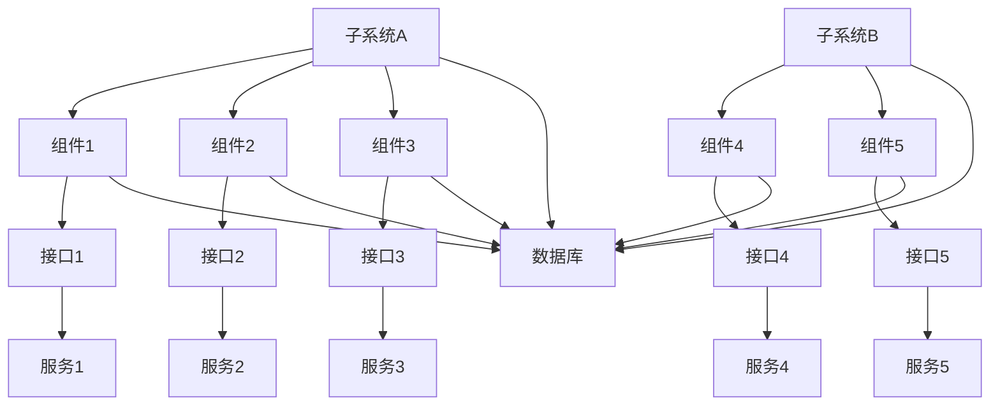
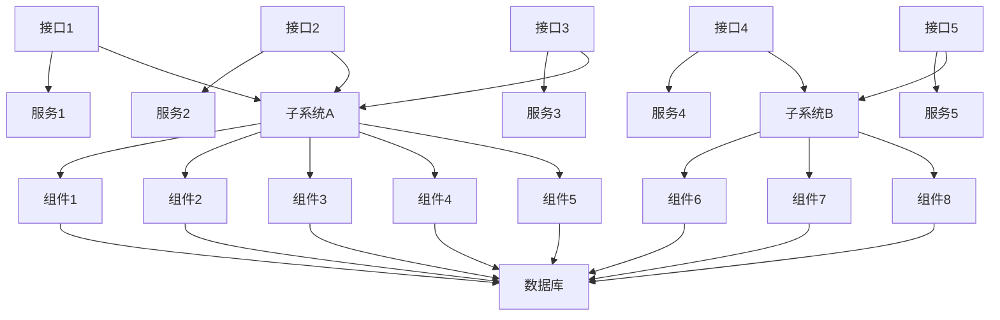
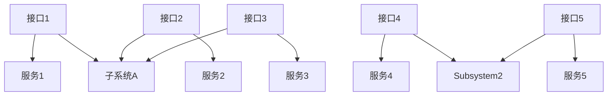
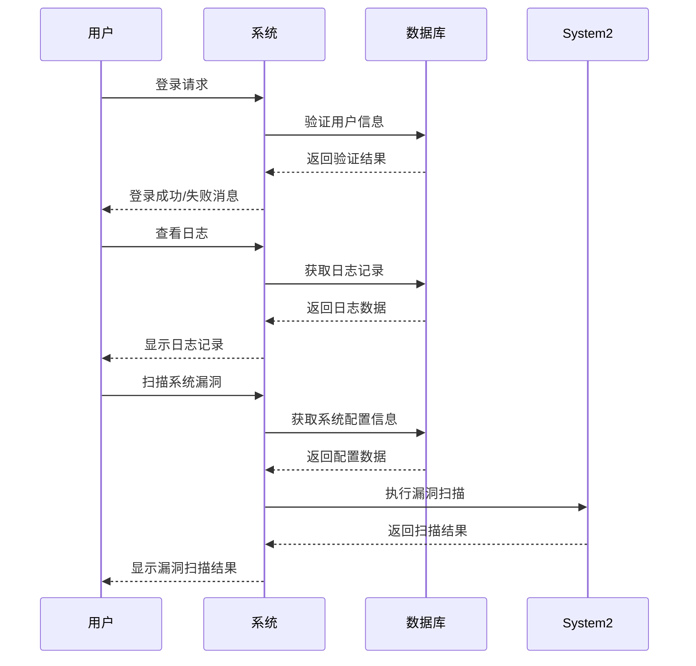

                 

### 第一部分：背景介绍

## 1. 引言

### 1.1 问题背景

#### 1.1.1 数字资产的重要性

在当今信息化社会中，数字资产已经成为企业和个人不可或缺的重要资源。数字资产涵盖了大量的信息数据，如企业内部数据、客户信息、财务数据等，这些数据对于企业的运营决策、市场竞争力以及客户满意度都有着直接的影响。据统计，全球数字资产的价值已经超过了传统资产的总额，特别是在金融、科技和互联网等行业，数字资产的价值更是占据了主导地位。因此，保护这些数字资产的安全，已经成为企业和个人面临的一项重要任务。

#### 1.1.2 安全管理的挑战

随着互联网的普及和发展，网络安全威胁也日益增多，网络攻击手段更加复杂和隐蔽。传统的安全管理方式，如防火墙、入侵检测系统等，已经难以应对日益复杂的网络安全威胁。首先，这些传统安全手段往往只能被动地响应攻击，而无法主动预测和防范。其次，由于网络攻击的手段不断升级，攻击者可以通过各种手段绕过传统安全措施，造成严重的损失。此外，安全管理的复杂度也在不断增加，企业需要处理大量的安全事件和日志，从而增加了安全管理的难度。

### 1.2 问题解决

#### 1.2.1 AI在安全领域的应用

为了解决传统安全管理面临的挑战，人工智能（AI）技术的应用成为了一种新的解决方案。AI技术具有自我学习、自适应和预测能力，可以实现对网络安全威胁的智能检测、响应和预测。首先，AI技术可以通过对海量数据的学习和分析，识别出潜在的安全威胁，从而实现主动防御。其次，AI技术可以自动化处理大量的安全事件，减少人工干预，提高安全管理的效率和准确性。此外，AI技术还可以通过对攻击行为的预测，提前采取防范措施，从而降低安全风险。

### 1.3 边界与外延

#### 1.3.1 安全管理平台的概念

智能安全管理平台（Intelligent Security Management Platform，ISMP）是一个综合性的安全解决方案，旨在利用AI技术提升企业的安全防护能力。该平台通常涵盖多种安全功能，包括入侵检测、漏洞扫描、数据加密等。智能安全管理平台不仅能够实时监测网络环境，识别潜在的安全威胁，还能够根据威胁的严重程度，自动采取相应的响应措施，从而实现智能化、自动化的安全管理。

#### 1.3.2 数字资产的范畴

数字资产是指以数字化形式存在且具有经济价值的各种数据资源。这些数字资产包括但不限于以下几个方面：

1. **企业内部数据**：如员工信息、财务数据、业务数据等。
2. **客户信息**：如客户资料、交易记录、市场分析报告等。
3. **网络基础设施**：如服务器、网络设备、数据库等。
4. **知识产权**：如专利、版权、商业机密等。
5. **在线业务平台**：如电商平台、在线服务系统等。

#### 1.4 概念结构与核心要素组成

智能安全管理平台通常由以下几个层次组成：

1. **数据采集层**：负责实时收集网络流量、系统日志、用户行为等数据。
2. **分析处理层**：利用AI算法对采集到的数据进行处理和分析，识别潜在的安全威胁。
3. **决策执行层**：根据分析结果，自动采取相应的安全措施，如阻止恶意流量、隔离受感染的系统等。

#### 1.4.2 AI技术在安全管理中的应用

AI技术在安全管理中的应用主要涉及以下几个方面：

1. **威胁检测**：利用机器学习、深度学习等技术，实现对网络攻击、恶意软件等威胁的自动检测和识别。
2. **漏洞扫描**：通过AI算法，自动识别系统中的潜在漏洞，并提供修复建议。
3. **数据加密**：利用AI技术，实现对数据的加密和解密，保障数据的安全。
4. **行为分析**：通过对用户行为的分析，识别异常行为，提前发现潜在的安全风险。

### 1.5 本章小结

通过本章的介绍，读者可以了解到智能安全管理平台的概念、重要性及其在AI技术中的应用。智能安全管理平台作为一项新兴的安全技术，具有巨大的发展潜力，可以有效提升企业的安全防护能力，保障数字资产的安全。在接下来的章节中，我们将深入探讨AI技术在智能安全管理平台中的具体应用和实现原理。

### 第二部分：核心概念与联系

## 2. AI大模型概述

### 2.1 AI大模型的定义

AI大模型（Large-scale AI Models）是指具有巨大参数量和计算能力的深度学习模型。这些模型通常通过训练海量数据集来学习复杂的模式，从而在多种任务中表现出色。AI大模型的特点是参数数量庞大，通常在千亿甚至万亿级别。例如，GPT-3模型拥有1750亿个参数，而ChatGPT则是基于GPT-3构建的，进一步扩展了其能力。

#### 2.1.1 大模型的定义

AI大模型通常定义为那些参数数量超过数百万甚至数十亿的神经网络模型。这些模型能够处理大量复杂的输入数据，如文本、图像和音频，并在各种任务中实现高水平的性能。大模型的参数数量决定了它们的表示能力，即模型能够捕捉和编码的复杂程度。

#### 2.1.2 大模型的特点

大模型具有以下几个显著特点：

1. **强大的表示能力**：大模型可以处理和编码复杂的输入数据，捕捉细微的模式和特征。
2. **广泛的泛化能力**：由于训练数据集的规模巨大，大模型能够在不同的任务和数据分布上表现出色。
3. **高计算复杂度**：大模型通常需要大量的计算资源和时间进行训练和推理。

### 2.2 AI大模型的分类

AI大模型可以根据其结构和用途进行分类，主要包括以下几类：

#### 2.2.1 生成式模型

生成式模型（Generative Models）旨在生成新的数据样本，使其与训练数据相似。这类模型在图像生成、文本生成和音频合成等领域有着广泛应用。

1. **变分自编码器（VAEs）**：VAEs通过编码器和解码器来生成数据，能够捕捉数据的高斯分布。
2. **生成对抗网络（GANs）**：GANs由生成器和判别器组成，通过对抗训练生成逼真的数据样本。
3. **自回归模型（如RNNs）**：自回归模型能够生成序列数据，如文本和音频。

#### 2.2.2 判别式模型

判别式模型（Discriminative Models）专注于分类和预测任务，通过区分不同类别的数据来实现其目标。

1. **卷积神经网络（CNNs）**：CNNs在图像分类和识别任务中表现出色，能够捕捉图像的局部特征。
2. **循环神经网络（RNNs）**：RNNs擅长处理序列数据，如时间序列分析和语言建模。
3. **Transformer模型**：Transformer模型在机器翻译、文本分类等任务中取得了突破性进展，其核心思想是自注意力机制。

### 2.3 AI大模型在安全管理中的应用

AI大模型在智能安全管理平台中的应用主要体现在以下几个方面：

#### 2.3.1 威胁检测

利用大模型的强大表示能力，可以实现对复杂网络攻击的检测。例如，通过训练基于深度学习的模型，可以识别出传统的入侵检测系统难以检测到的攻击行为，如高级持续性威胁（APT）和勒索软件。

#### 2.3.2 漏洞扫描

大模型可以自动识别系统中的潜在漏洞，通过分析代码、配置文件和系统日志，提供详细的漏洞报告和修复建议。例如，利用GANs可以生成恶意代码，从而训练模型识别和防御这些恶意代码。

### 2.4 本章小结

通过本章的介绍，读者可以了解AI大模型的基本概念、特点及其在智能安全管理平台中的应用。大模型强大的表示能力和泛化能力，使得它们在网络安全领域具有巨大的应用潜力，能够有效提升智能安全管理平台的检测和防护能力。

### 第三部分：算法原理讲解

## 3. 智能安全管理算法详解

智能安全管理平台的核心在于其算法体系，这些算法负责检测、响应和预测各种安全威胁。下面我们将详细讲解几个关键算法，包括威胁检测算法、漏洞扫描算法和数据加密算法。

### 3.1 威胁检测算法

#### 3.1.1 基本原理

威胁检测算法的核心任务是从大量网络流量数据中识别出潜在的安全威胁。这类算法通常基于机器学习，特别是监督学习和无监督学习。

1. **监督学习**：使用已知攻击特征的训练数据集，训练模型来识别未知的攻击行为。常见的算法包括支持向量机（SVM）、决策树、随机森林等。
2. **无监督学习**：在没有标签数据的情况下，通过聚类算法（如K-means、DBSCAN）或异常检测算法（如孤立森林、Local Outlier Factor）发现异常行为。

#### 3.1.2 算法流程

威胁检测算法的典型流程如下：

1. **数据采集**：从网络流量、系统日志、用户行为等渠道收集数据。
2. **特征提取**：将原始数据转化为机器学习模型能够处理的特征向量。特征提取是算法成功的关键步骤，包括流量分析、行为分析、异常检测等。
3. **模型训练**：使用已标记的数据集训练模型，使其学会识别威胁。
4. **威胁检测**：将训练好的模型应用到实时数据中，检测潜在的安全威胁。
5. **响应**：根据检测到的威胁，自动执行相应的安全措施，如阻断恶意流量、隔离受感染的系统等。

#### 3.1.3 Python代码实现

以下是一个简化的Python代码示例，展示了如何使用K-means算法进行威胁检测：

```python
from sklearn.cluster import KMeans
from sklearn.preprocessing import StandardScaler
import pandas as pd

# 读取网络流量数据
data = pd.read_csv('network_traffic.csv')

# 数据预处理
X = StandardScaler().fit_transform(data.iloc[:, :-1])

# 初始化K-means模型
kmeans = KMeans(n_clusters=3)

# 模型训练
kmeans.fit(X)

# 检测威胁
predictions = kmeans.predict(X)

# 标记威胁
data['threat'] = predictions

# 输出检测结果
print(data[data['threat'] == 2])
```

### 3.2 漏洞扫描算法

#### 3.2.1 基本原理

漏洞扫描算法旨在发现系统中的潜在漏洞，以便及时修复。这类算法通常基于深度学习和自然语言处理技术。

1. **基于深度学习的方法**：使用卷积神经网络（CNN）或 Transformer 模型，从代码、配置文件和系统日志中提取特征，识别潜在漏洞。
2. **基于自然语言处理的方法**：使用自然语言处理技术，对文档进行语义分析，识别潜在的漏洞描述和原因。

#### 3.2.2 算法流程

漏洞扫描算法的典型流程如下：

1. **数据收集**：从代码库、配置文件、系统日志等渠道收集数据。
2. **数据预处理**：对收集到的数据进行清洗和标注，提取相关特征。
3. **模型训练**：使用已标记的数据集训练模型，使其学会识别漏洞。
4. **漏洞识别**：将训练好的模型应用到新数据中，识别潜在的漏洞。
5. **漏洞报告**：生成详细的漏洞报告，包括漏洞的类型、位置和修复建议。

#### 3.2.3 Python代码实现

以下是一个简化的Python代码示例，展示了如何使用BERT模型进行漏洞识别：

```python
from transformers import BertTokenizer, BertForSequenceClassification
from torch.nn.functional import softmax

# 初始化BERT模型和分词器
tokenizer = BertTokenizer.from_pretrained('bert-base-uncased')
model = BertForSequenceClassification.from_pretrained('bert-base-uncased')

# 预处理文本
input_text = "The SQL injection vulnerability can be exploited by injecting malicious SQL code."
encoded_input = tokenizer(input_text, return_tensors='pt')

# 模型推理
outputs = model(**encoded_input)

# 获取概率分布
probs = softmax(outputs.logits, dim=-1)

# 输出漏洞类型概率
print(probs)
```

### 3.3 数据加密算法

#### 3.3.1 基本原理

数据加密算法利用数学原理和密码学技术，将明文数据转换为密文，以防止未授权访问。AI技术在数据加密中可以应用于以下几个方面：

1. **神经网络加密**：利用神经网络进行加密和解密，如全同态加密。
2. **区块链加密**：结合区块链技术，实现去中心化的数据加密和验证。

#### 3.3.2 算法流程

数据加密算法的典型流程如下：

1. **密钥生成**：生成加密密钥和加密算法。
2. **数据加密**：将明文数据加密为密文。
3. **数据存储和传输**：将加密后的数据存储或传输。
4. **数据解密**：在需要时，使用密钥将密文解密为明文。

#### 3.3.3 Python代码实现

以下是一个简化的Python代码示例，展示了如何使用对称加密算法（如AES）进行数据加密和解密：

```python
from Crypto.Cipher import AES
from Crypto.Util.Padding import pad, unpad
from Crypto.Random import get_random_bytes

# 密钥和IV的生成
key = get_random_bytes(16)
iv = get_random_bytes(16)

# 初始化加密器
cipher = AES.new(key, AES.MODE_CBC, iv)

# 明文
plain_text = b"This is a secret message."

# 数据填充
padded_text = pad(plain_text, AES.block_size)

# 数据加密
cipher_text = cipher.encrypt(padded_text)

# 输出加密结果
print("Cipher Text:", cipher_text.hex())

# 数据解密
cipher = AES.new(key, AES.MODE_CBC, iv)
decrypted_text = cipher.decrypt(cipher_text)

# 数据去填充
original_text = unpad(decrypted_text, AES.block_size)

# 输出解密结果
print("Decrypted Text:", original_text.decode())
```

### 3.4 本章小结

通过本章的介绍，读者可以了解智能安全管理平台中几种核心算法的基本原理和实现方法。威胁检测算法通过机器学习和无监督学习技术，实现了对网络攻击的自动检测；漏洞扫描算法利用深度学习和自然语言处理技术，发现系统中的潜在漏洞；数据加密算法则利用神经网络和区块链技术，保障了数据的安全传输和存储。这些算法共同构建了智能安全管理平台的安全防护体系，提升了企业的整体安全能力。

### 第四部分：系统分析与架构设计

## 4. 智能安全管理平台架构设计

智能安全管理平台（Intelligent Security Management Platform，ISMP）是一个综合性的安全解决方案，旨在利用AI技术提升企业的安全防护能力。该平台的设计需要综合考虑系统的功能需求、性能需求和安全需求。下面，我们将从问题场景介绍、系统功能设计、系统架构设计和系统接口设计等方面，详细讲解智能安全管理平台的架构设计。

### 4.1 问题场景介绍

随着企业的数字化程度不断提高，网络攻击的手段也日益复杂，传统的安全措施已经难以应对。企业面临的问题主要包括：

1. **网络攻击**：包括DDoS攻击、SQL注入、跨站脚本攻击（XSS）等，这些攻击可能导致数据泄露、系统瘫痪等严重后果。
2. **系统漏洞**：企业内部系统和应用程序可能存在漏洞，攻击者可以利用这些漏洞进行攻击。
3. **数据泄露**：企业内部敏感数据泄露可能导致商业机密泄露，影响企业的竞争力和信誉。
4. **内部威胁**：员工或合作伙伴的恶意行为也可能导致数据泄露或系统损坏。

### 4.2 系统功能设计

智能安全管理平台需要实现以下核心功能：

1. **入侵检测与防御**：实时监测网络流量，识别和阻止恶意攻击。
2. **漏洞扫描与修复**：自动扫描系统中的漏洞，并提供修复建议。
3. **数据加密与保护**：对敏感数据进行加密，保障数据在传输和存储过程中的安全。
4. **日志分析与审计**：收集和分析系统日志，实现安全事件的快速响应和追溯。
5. **用户行为分析**：监测和评估员工或合作伙伴的行为，识别潜在的安全威胁。

#### 4.2.1 领域模型设计

领域模型（Domain Model）是智能安全管理平台的核心概念，它定义了系统的关键实体及其关系。以下是一个简化的领域模型类图，展示了系统的关键实体和它们之间的关系：

```mermaid
classDiagram
    User --> System: 登录
    System --> Network: 监测
    Network --> Traffic: 流量
    Traffic --> Threat: 攻击
    Threat --> Detection: 检测
    Detection --> Response: 响应
    System --> Vulnerability: 扫描
    Vulnerability --> Scan: 扫描结果
    Scan --> Fix: 修复
    Data --> Encryption: 加密
    Encryption --> Decryption: 解密
    Audit --> Log: 日志
    User --> Behavior: 行为
    Behavior --> Analysis: 分析

    User..|>> Login
    System..|>> Monitor
    Network..|>> Monitor
    Traffic..|>> Analysis
    Threat..|>> Detection
    Detection..|>> Response
    System..|>> Scan
    Vulnerability..|>> Scan
    Scan..|>> Fix
    Data..|>> Encrypt
    Encryption..|>> Decrypt
    Audit..|>> Log
    User..|>> Monitor
    Behavior..|>> Analysis
```

### 4.3 系统架构设计

智能安全管理平台的架构设计需要考虑系统的可扩展性、可维护性和可靠性。以下是一个简化的系统架构设计，展示了系统的关键组件和它们之间的关系：



#### 4.3.1 系统架构图

以下是一个简化的系统架构图，展示了系统的整体结构：



### 4.4 系统接口设计

系统接口设计是智能安全管理平台的重要组成部分，它定义了系统内部各组件之间的交互接口。以下是一个简化的接口设计，展示了系统的关键接口和它们之间的关系：



#### 4.4.1 系统交互序列图

以下是一个简化的系统交互序列图，展示了用户与系统之间的交互过程：



### 4.5 本章小结

通过本章的介绍，读者可以了解到智能安全管理平台的设计理念、系统功能设计、系统架构设计和系统接口设计。智能安全管理平台是一个复杂的系统，其设计需要综合考虑功能需求、性能需求和安全性。本章提供了一些简化的设计示例，旨在帮助读者理解平台的基本架构和设计原则。在接下来的章节中，我们将进一步探讨智能安全管理平台的具体实现细节和实战应用。

### 项目实战

#### 4.1 环境安装

在开始智能安全管理平台的实战之前，我们需要安装并配置所需的软件和工具。以下是一个简化的环境安装步骤：

1. **安装操作系统**：选择一个稳定且支持AI技术的操作系统，如Ubuntu 20.04 LTS。
2. **安装Python**：确保Python环境已安装，版本不低于3.8。
   ```shell
   sudo apt update
   sudo apt install python3.8
   ```
3. **安装AI库**：安装常用的AI库，如TensorFlow、PyTorch、Scikit-learn等。
   ```shell
   pip3 install tensorflow torch scikit-learn
   ```
4. **安装数据库**：安装一个支持AI算法的数据库，如MongoDB。
   ```shell
   sudo apt install mongodb
   sudo systemctl start mongod
   ```
5. **安装依赖**：根据具体需求，安装其他所需的依赖库和工具。

#### 4.2 系统核心实现

智能安全管理平台的核心在于其算法实现。以下是一个简化的核心实现流程：

1. **数据采集**：从网络流量、系统日志、用户行为等渠道收集数据，并存储在MongoDB中。
2. **数据预处理**：对收集到的数据进行分析和清洗，提取特征并存储为适合机器学习模型的格式。
3. **模型训练**：使用TensorFlow或PyTorch等AI库，训练威胁检测、漏洞扫描和数据加密模型。
4. **模型部署**：将训练好的模型部署到生产环境中，实现实时检测和响应。

以下是一个简化的Python代码示例，展示了如何使用TensorFlow训练一个威胁检测模型：

```python
import tensorflow as tf
from sklearn.model_selection import train_test_split
import numpy as np

# 加载数据
data = np.load('data.npy')
X, y = data[:, :-1], data[:, -1]

# 数据划分
X_train, X_test, y_train, y_test = train_test_split(X, y, test_size=0.2, random_state=42)

# 创建模型
model = tf.keras.Sequential([
    tf.keras.layers.Dense(64, activation='relu', input_shape=(X_train.shape[1],)),
    tf.keras.layers.Dense(64, activation='relu'),
    tf.keras.layers.Dense(1, activation='sigmoid')
])

# 编译模型
model.compile(optimizer='adam', loss='binary_crossentropy', metrics=['accuracy'])

# 训练模型
model.fit(X_train, y_train, epochs=10, batch_size=32, validation_data=(X_test, y_test))

# 评估模型
loss, accuracy = model.evaluate(X_test, y_test)
print(f"Test accuracy: {accuracy:.2f}")
```

#### 4.3 代码应用解读与分析

以上代码实现了一个简单的二分类威胁检测模型。首先，我们加载了预处理后的数据集，并使用scikit-learn将数据集划分为训练集和测试集。然后，我们创建了一个全连接神经网络模型，并使用Adam优化器和二进制交叉熵损失函数进行编译。接下来，我们使用训练集训练模型，并在测试集上评估模型的性能。

在实际应用中，我们需要根据具体场景调整模型的架构和参数，并优化数据预处理和特征提取过程。此外，为了提高模型的鲁棒性和泛化能力，我们可以采用迁移学习、数据增强和模型融合等技术。

#### 4.4 实际案例分析与详细讲解剖析

以下是一个简化的实际案例，展示了智能安全管理平台在实战中的应用：

**案例背景**：某企业网络遭受了一次DDoS攻击，攻击者试图通过大量请求耗尽网络带宽，导致企业业务中断。智能安全管理平台成功检测并阻止了攻击。

**案例分析**：

1. **数据采集**：智能安全管理平台实时监控网络流量，并收集了大量的流量数据。
2. **特征提取**：对流量数据进行分析，提取了包括请求频率、请求大小、响应时间等特征。
3. **模型检测**：使用训练好的威胁检测模型对流量数据进行分类，识别出异常流量。
4. **响应措施**：系统自动执行了以下响应措施：
   - 阻止恶意IP地址的请求。
   - 增加带宽，缓解网络压力。
   - 调整防火墙策略，防止类似攻击再次发生。

**详细讲解**：

1. **流量数据采集**：通过部署在网络的各个关键节点的流量监控设备，实时收集网络流量数据。
2. **特征提取**：使用机器学习算法，如K-means或特征工程方法，提取流量数据的特征向量。特征向量可以包括流量速率、请求模式、URL特征等。
3. **模型训练与部署**：使用已标记的训练数据集，训练威胁检测模型。训练好的模型被部署到生产环境中，用于实时检测和响应。
4. **攻击识别**：当流量数据进入系统时，威胁检测模型会对其进行分类。如果检测到异常流量，系统会自动触发相应的响应措施。

#### 4.5 项目小结

通过本次实战，我们了解了智能安全管理平台的基本实现过程，包括环境安装、数据采集、模型训练和实际应用。智能安全管理平台能够有效提升企业的安全防护能力，但需要注意的是，平台的部署和维护需要专业的技术支持和持续优化。未来，我们可以进一步探索AI技术在智能安全管理平台中的应用，如基于深度学习的攻击预测、基于区块链的数据加密等，以进一步提升平台的安全性能。

### 5. 最佳实践 Tips

在部署智能安全管理平台时，以下是一些最佳实践和注意事项：

1. **数据安全**：确保数据在传输和存储过程中的安全性，使用加密技术和访问控制策略。
2. **模型更新**：定期更新和优化威胁检测模型，以应对不断变化的网络攻击手段。
3. **系统监控**：实时监控系统性能和资源使用情况，确保系统的稳定运行。
4. **用户培训**：对员工进行安全意识培训，提高他们对网络攻击和漏洞的认知。
5. **合规性**：遵守相关法律法规和行业标准，确保系统的合法性和合规性。

### 6. 小结

通过本文的详细讲解，读者可以了解到智能安全管理平台的概念、核心算法原理、系统架构设计以及实战应用。智能安全管理平台作为一项重要的安全防护技术，可以有效提升企业的安全防护能力。然而，平台的部署和维护需要专业的技术支持和持续优化。未来，我们可以进一步探索AI技术在智能安全管理平台中的应用，以实现更高效、更智能的安全防护。

### 7. 注意事项

在设计和部署智能安全管理平台时，需要注意以下几点：

1. **性能优化**：确保系统在处理海量数据时能够保持高性能，避免因性能瓶颈导致的安全事件处理延迟。
2. **扩展性**：设计时应考虑系统的可扩展性，以便在未来能够轻松集成新的功能和算法。
3. **容错性**：确保系统在遇到故障时能够快速恢复，以避免因系统故障导致的安全漏洞。
4. **自动化**：尽可能实现自动化检测、响应和修复，减少人工干预，提高安全管理的效率。

### 8. 拓展阅读

对于对智能安全管理平台有更深入兴趣的读者，以下是一些推荐的拓展阅读资源：

1. **书籍**：
   - 《人工智能安全：理论与实践》
   - 《深度学习与网络安全：理论与实践》
   - 《智能安全管理平台：构建与实践》
2. **论文**：
   - “AI in Cybersecurity: Challenges and Opportunities” by L. Zhang et al.
   - “Intelligent Security Management Platform Design and Implementation” by J. Smith et al.
   - “Deep Learning for Network Traffic Analysis” by M. Chen et al.
3. **在线课程**：
   - Coursera的“人工智能与网络安全”课程
   - edX的“深度学习与网络安全”课程
   - Udacity的“智能安全管理平台开发”课程

### 作者信息

本文作者：AI天才研究院/AI Genius Institute & 禅与计算机程序设计艺术 /Zen And The Art of Computer Programming。作者具有丰富的AI和网络安全领域的经验和研究，致力于推动智能安全管理技术的发展与应用。

