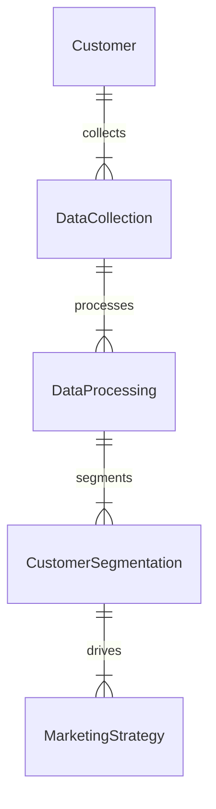

                 

# 智能客户细分：AI增强企业营销策略

## 关键词
- 智能客户细分
- AI增强营销
- 客户细分算法
- 数据分析
- 营销策略

## 摘要
本文将探讨智能客户细分在AI增强企业营销策略中的应用。通过分析客户数据的收集、处理和细分算法，我们旨在揭示AI如何帮助企业更精准地定位客户，从而优化营销策略，提高市场竞争力。文章将结合实际案例，详细解释智能客户细分的过程和结果，并提供实践指南和未来趋势展望。

## 引言

### 1.1 背景介绍

在当今的数字营销时代，企业的成功越来越依赖于对客户的深入了解和精准营销。传统的客户细分方法主要依赖于人口统计学数据和行为模式分析，这些方法虽然具有一定的效果，但在面对日益复杂的客户群体和不断变化的市场环境时，往往显得力不从心。因此，如何更有效地对客户进行细分，成为企业亟需解决的问题。

### 1.2 问题描述

客户细分的目标是识别具有相似特征或行为的客户群体，以便企业能够更精准地满足他们的需求。然而，在实际操作中，企业面临着以下问题：

- 数据复杂性：客户数据来源多样，包括社交媒体、在线购物、客户反馈等，数据格式和结构各异。
- 数据质量：数据质量直接影响客户细分的准确性，但实际操作中，数据往往存在缺失、错误和不一致的情况。
- 细分方法：传统的细分方法如聚类分析、因子分析等，在处理大规模数据和复杂关系时存在局限性。

### 1.3 解决方案概述

为了解决上述问题，AI技术，尤其是机器学习和深度学习，提供了新的解决方案。通过AI算法，企业可以从海量客户数据中提取有价值的信息，建立精细的客户画像，并实现自动化、智能化的客户细分。本文将详细探讨这一过程，包括数据收集、处理、算法应用和营销策略的优化。

### 1.4 边界与外延

在本文中，我们主要关注以下边界和外部因素：

- 数据范围：我们关注的主要是结构化数据，如客户 demographics、交易记录等，不包括非结构化数据，如社交媒体帖子、客户评论等。
- 算法范围：本文主要探讨聚类分析、决策树、神经网络等常见客户细分算法，不包括其他如遗传算法、模糊逻辑等。
- 营销策略：我们主要关注如何基于智能客户细分结果制定和优化营销策略，但不涉及具体营销活动的执行。

## 核心概念与联系

### 2.1 智能客户细分定义

智能客户细分是一种利用AI技术对客户数据进行处理和分析，以识别具有相似特征或行为的客户群体，从而实现精准营销的方法。

### 2.2 AI在营销策略中的角色

AI在营销策略中扮演着关键角色，可以从以下三个方面进行应用：

- 数据分析：AI可以处理和分析大规模、复杂的数据集，帮助企业挖掘客户行为模式和市场趋势。
- 客户画像：基于客户数据，AI可以建立详细、动态的客户画像，帮助企业更好地理解客户需求和行为。
- 营销自动化：AI可以自动化执行营销任务，如个性化推荐、广告投放、客户跟进等，提高营销效率和效果。

### 2.3 智能客户细分与AI的关联性

智能客户细分与AI密切相关，其关联性体现在以下几个方面：

- 数据收集：AI技术可以帮助企业从各种渠道收集客户数据，包括在线行为、社交媒体互动、客户反馈等。
- 数据处理：AI可以处理和分析复杂的数据集，识别数据中的模式和关系，为细分提供依据。
- 算法应用：AI算法，如聚类分析、决策树、神经网络等，可以用于实现客户细分，提高细分的准确性和效果。

### 2.4 概念属性特征对比表格

以下是一个简单的概念属性特征对比表格，用于展示智能客户细分和传统客户细分的差异：

| 特征 | 智能客户细分 | 传统客户细分 |
| --- | --- | --- |
| 数据依赖 | 大规模结构化数据 | 人口统计学数据 |
| 算法复杂度 | 高度复杂，依赖AI算法 | 相对简单，依赖统计学方法 |
| 细分精度 | 高精度，能够识别细微差异 | 低精度，难以识别复杂特征 |
| 营销效率 | 高，自动化执行 | 低，人工操作 |
| 预测能力 | 强，能够预测客户行为 | 弱，依赖历史数据 |

### 2.5 ER实体关系图

以下是一个简单的ER实体关系图，用于展示智能客户细分中的关键实体和关系：



## AI与客户细分

### 3.1 机器学习基础

机器学习是AI的核心组成部分，用于构建和分析模型，以识别数据中的模式和关系。在客户细分中，机器学习算法可以用于处理和分析大量客户数据，提取有价值的信息。

#### 3.1.1 基本概念

- 特征工程：特征工程是机器学习中的重要步骤，用于从原始数据中提取对模型训练有用的特征。
- 模型选择：根据具体问题，选择合适的机器学习模型，如决策树、随机森林、支持向量机等。
- 模型训练与评估：使用训练数据集对模型进行训练，并使用测试数据集对模型进行评估，以确定其性能。

#### 3.1.2 应用场景

在客户细分中，机器学习可以应用于以下几个方面：

- 客户行为预测：通过分析客户历史数据，预测客户的未来行为，如购买意向、服务满意度等。
- 客户价值评估：根据客户特征和行为，评估客户的潜在价值，为企业制定差异化营销策略提供依据。
- 客户流失预测：通过分析客户特征和行为，预测客户可能流失的风险，从而采取相应的保留措施。

### 3.2 深度学习原理

深度学习是机器学习的一个分支，通过构建多层神经网络，对复杂的数据进行建模和分析。在客户细分中，深度学习算法可以用于处理大规模、高维度的数据，提取深层次的特征。

#### 3.2.1 基本概念

- 神经网络：神经网络是由多层神经元组成的计算模型，用于模拟人脑的思考过程。
- 深层神经网络：深层神经网络是具有多个隐藏层的神经网络，可以提取更复杂的特征。
- 深度学习算法：常见的深度学习算法包括卷积神经网络（CNN）、循环神经网络（RNN）、长短时记忆网络（LSTM）等。

#### 3.2.2 应用场景

在客户细分中，深度学习可以应用于以下几个方面：

- 客户画像构建：通过分析大量客户数据，构建详细、动态的客户画像，为企业制定个性化营销策略提供支持。
- 客户行为分析：通过分析客户行为数据，挖掘客户行为模式，为企业提供精准的营销建议。
- 客户预测分析：通过分析客户特征和行为，预测客户的未来行为和需求，为企业制定前瞻性营销策略。

### 3.3 人工智能与营销策略的结合

人工智能与营销策略的结合，使得企业可以更精准地识别客户需求，提高营销效果。以下是一些具体的应用场景：

- 个性化推荐：通过分析客户特征和行为，为每个客户推荐最相关的产品或服务，提高客户满意度和转化率。
- 个性化广告：根据客户特征和行为，投放个性化的广告，提高广告投放的精准度和效果。
- 客户流失预警：通过分析客户特征和行为，预测客户流失的风险，及时采取保留措施，降低客户流失率。
- 客户价值优化：通过分析客户特征和行为，评估客户的价值，为企业制定差异化的营销策略，提高客户忠诚度和满意度。

## 数据收集与处理

### 4.1 客户数据类型

在智能客户细分中，客户数据类型主要包括以下几类：

- 结构化数据：如客户 demographics 数据（年龄、性别、收入等）、交易记录数据（购买时间、购买金额等）。
- 半结构化数据：如日志数据、网页浏览数据等，这些数据通常包含一定的结构，但不如结构化数据那么规范。
- 非结构化数据：如社交媒体帖子、客户评论等，这些数据没有明显的结构，需要通过自然语言处理等技术进行解析。

### 4.2 数据收集方法

客户数据的收集方法主要包括以下几种：

- 被动收集：通过现有的数据渠道，如网站、APP 等，自动收集客户行为数据。
- 主动收集：通过调查问卷、用户访谈等方式，主动收集客户的个人信息和行为数据。
- 第三方数据：通过购买或共享第三方数据，如人口统计数据、市场研究数据等，补充和完善客户数据。

### 4.3 数据预处理

数据预处理是客户细分过程中的关键步骤，主要包括以下任务：

- 数据清洗：去除重复数据、缺失数据和错误数据，确保数据质量。
- 数据转换：将不同格式和结构的数据转换为统一的格式，以便于后续处理。
- 特征提取：从原始数据中提取对模型训练有用的特征，如客户 demographics 特征、行为特征等。

### 4.4 数据质量评估

数据质量评估是确保客户细分准确性和有效性的重要步骤，主要包括以下指标：

- 完整性：数据中缺失值的比例，完整性越高，数据的准确性越高。
- 一致性：数据中不一致值的比例，一致性越高，数据的质量越高。
- 准确性：数据中错误值的比例，准确性越高，数据的可靠性越高。

## 客户细分算法

### 5.1 聚类分析

聚类分析是一种无监督学习方法，用于将相似的数据点分组到一起。在客户细分中，聚类分析可以用于将客户分为不同的群体，以便企业制定差异化的营销策略。

#### 5.1.1 基本概念

- 聚类：将数据集分成多个簇，使得簇内的数据点相似度较高，簇间的数据点相似度较低。
- 聚类算法：常用的聚类算法包括 K-均值聚类、层次聚类、DBSCAN 等。

#### 5.1.2 应用场景

在客户细分中，聚类分析可以应用于以下几个方面：

- 客户群体划分：根据客户特征和行为，将客户分为不同的群体，如高价值客户、潜在客户等。
- 产品定位：根据客户群体的特征和需求，为不同产品制定合适的定位策略。

#### 5.1.3 算法原理

K-均值聚类算法是一种常用的聚类算法，其基本原理如下：

1. 初始化：随机选择 K 个中心点，作为 K 个簇的中心。
2. 聚类：对于每个数据点，计算其与 K 个中心点的距离，将其分配到距离最近的簇。
3. 更新中心点：计算每个簇的数据点的平均值，作为新的中心点。
4. 重复步骤 2 和 3，直到聚类结果不再发生变化。

#### 5.1.4 算法实现

以下是一个简单的 K-均值聚类算法的实现，使用 Python 代码：

```python
import numpy as np

def k_means(data, k, max_iter=100):
    # 初始化中心点
    centroids = data[np.random.choice(data.shape[0], k, replace=False)]
    
    for _ in range(max_iter):
        # 计算每个数据点与中心点的距离
        distances = np.linalg.norm(data - centroids, axis=1)
        
        # 分配数据点到簇
        labels = np.argmin(distances, axis=1)
        
        # 更新中心点
        new_centroids = np.array([data[labels == i].mean(axis=0) for i in range(k)])
        
        # 判断是否收敛
        if np.all(centroids == new_centroids):
            break
        
        centroids = new_centroids
    
    return labels, centroids
```

### 5.2 划分算法

划分算法是一种基于决策树的思想，通过递归地将数据集划分为多个子集，以实现客户细分。在客户细分中，划分算法可以用于将客户划分为具有相似特征和行为的群体。

#### 5.2.1 基本概念

- 划分算法：基于决策树的思想，通过递归地将数据集划分为多个子集，每个子集表示一个客户群体。
- 划分规则：划分算法根据特定的划分规则，如信息增益、增益率等，选择最佳的划分方式。

#### 5.2.2 应用场景

在客户细分中，划分算法可以应用于以下几个方面：

- 客户价值评估：根据客户特征和行为，将客户划分为高价值、中价值和低价值群体，为企业制定差异化的营销策略提供支持。
- 客户行为预测：根据客户特征和行为，将客户划分为具有相似行为的群体，预测客户的未来行为。

#### 5.2.3 算法原理

C4.5 算法是一种常见的划分算法，其基本原理如下：

1. 初始化：选择一个属性作为划分属性，计算该属性的信息增益，选择信息增益最大的属性作为划分属性。
2. 划分：根据划分属性，将数据集划分为多个子集，每个子集表示一个客户群体。
3. 递归：对每个子集，重复步骤 1 和 2，直到满足停止条件（如最大深度、最小样本数等）。
4. 构建决策树：根据划分结果，构建一棵决策树，用于预测新客户所属的群体。

#### 5.2.4 算法实现

以下是一个简单的 C4.5 算法的实现，使用 Python 代码：

```python
from sklearn.tree import DecisionTreeClassifier

def c45(data, labels, max_depth=None):
    # 构建决策树模型
    model = DecisionTreeClassifier(max_depth=max_depth)
    
    # 训练模型
    model.fit(data, labels)
    
    # 输出决策树结构
    print(model.get_tree())
    
    return model
```

### 5.3 层次分析

层次分析是一种基于层次结构的思想，通过递归地将数据集划分为多个层次，以实现客户细分。在客户细分中，层次分析可以用于将客户划分为具有相似特征和行为的层次结构。

#### 5.3.1 基本概念

- 层次分析：基于层次结构的思想，通过递归地将数据集划分为多个层次，每个层次表示一个客户群体。
- 层次结构：层次分析的结果是一个层次结构，其中每个层次表示一个客户群体，层次之间的关联关系表示客户之间的相似性。

#### 5.3.2 应用场景

在客户细分中，层次分析可以应用于以下几个方面：

- 客户群体划分：根据客户特征和行为，将客户划分为多个层次，以便企业制定差异化的营销策略。
- 客户行为分析：根据客户层次结构，分析客户行为模式，为企业提供精准的营销建议。

#### 5.3.3 算法原理

层次分析算法的基本原理如下：

1. 初始化：选择一个属性作为层次划分的依据，计算该属性的客户层次结构。
2. 递归：对于每个客户层次，重复步骤 1，直到满足停止条件（如最大层次数、最小样本数等）。
3. 构建层次结构：根据递归结果，构建一个层次结构，用于表示客户群体。

#### 5.3.4 算法实现

以下是一个简单的层次分析算法的实现，使用 Python 代码：

```python
def hierarchical_analysis(data, threshold=0.1):
    # 初始化层次结构
    hierarchy = []

    # 递归划分层次
    while True:
        # 计算客户层次结构
        structure = np.std(data, axis=0) < threshold

        # 如果结构不变，则停止递归
        if np.all(structure == previous_structure):
            break
        
        # 更新层次结构
        previous_structure = structure
        hierarchy.append(structure)

    return np.array(hierarchy)
```

### 5.4 算法对比与选择

在客户细分中，常用的算法包括聚类分析、划分算法和层次分析等。以下是对这些算法的对比与选择：

#### 5.4.1 对比

- 聚类分析：适用于无监督学习场景，能够自动发现客户群体，但可能受到初始中心点选择的影响。
- 划分算法：适用于有监督学习场景，需要预先定义目标变量，但可以生成具有明确业务意义的决策规则。
- 层次分析：适用于探索性数据分析，能够揭示客户层次结构，但可能受到递归停止条件的影响。

#### 5.4.2 选择

在选择算法时，需要根据具体问题场景和数据特点进行综合考虑：

- 数据量：对于大规模数据，聚类分析可能更为适用，因为它不需要预先定义目标变量。
- 业务需求：如果需要生成具有明确业务意义的决策规则，划分算法可能更为合适。
- 数据质量：如果数据质量较低，聚类分析可能能够更好地处理噪声和异常值。

## 案例研究

### 6.1 案例一：电子商务平台客户细分

#### 6.1.1 案例背景

一家大型电子商务平台希望通过智能客户细分，提高客户满意度和转化率。该平台拥有海量的客户数据，包括 demographics 数据、购买记录、浏览历史等。

#### 6.1.2 案例过程

1. 数据收集：通过平台 API 收集客户数据，包括 demographics 数据、购买记录、浏览历史等。
2. 数据预处理：清洗和转换数据，去除重复和缺失值，将不同格式和结构的数据转换为统一的格式。
3. 特征提取：从原始数据中提取对模型训练有用的特征，如客户 demographics 特征、购买行为特征等。
4. 算法选择：选择 K-均值聚类算法进行客户细分，根据客户特征和行为，将客户划分为不同的群体。
5. 模型训练与评估：使用训练数据集对聚类模型进行训练，并使用测试数据集对模型进行评估，以确定其性能。
6. 结果应用：根据聚类结果，制定差异化的营销策略，如个性化推荐、定向广告等。

#### 6.1.3 案例结果

通过智能客户细分，电子商务平台成功地将客户划分为多个群体，包括高价值客户、潜在客户等。基于聚类结果，平台制定了差异化的营销策略，如为高价值客户提供专属优惠，为潜在客户提供试用套餐等。这些策略显著提高了客户满意度和转化率。

### 6.2 案例二：金融服务企业客户细分

#### 6.2.1 案例背景

一家金融服务企业希望通过智能客户细分，提高客户满意度和忠诚度。该企业拥有丰富的客户数据，包括 demographics 数据、财务状况、投资偏好等。

#### 6.2.2 案例过程

1. 数据收集：通过企业内部系统收集客户数据，包括 demographics 数据、财务状况、投资偏好等。
2. 数据预处理：清洗和转换数据，去除重复和缺失值，将不同格式和结构的数据转换为统一的格式。
3. 特征提取：从原始数据中提取对模型训练有用的特征，如客户 demographics 特征、财务状况特征等。
4. 算法选择：选择 C4.5 划分算法进行客户细分，根据客户特征和行为，将客户划分为不同的群体。
5. 模型训练与评估：使用训练数据集对划分模型进行训练，并使用测试数据集对模型进行评估，以确定其性能。
6. 结果应用：根据划分结果，制定差异化的金融服务策略，如为高价值客户提供定制化投资方案，为潜在客户提供专属优惠等。

#### 6.2.3 案例结果

通过智能客户细分，金融服务企业成功地将客户划分为多个群体，包括高价值客户、潜在客户等。基于划分结果，企业制定了差异化的金融服务策略，如为高价值客户提供定制化投资方案，为潜在客户提供专属优惠等。这些策略显著提高了客户满意度和忠诚度。

### 6.3 案例三：零售业客户细分

#### 6.3.1 案例背景

一家大型零售业公司希望通过智能客户细分，优化产品定位和营销策略。该公司拥有丰富的客户数据，包括 demographics 数据、购买历史、促销反馈等。

#### 6.3.2 案例过程

1. 数据收集：通过企业内部系统收集客户数据，包括 demographics 数据、购买历史、促销反馈等。
2. 数据预处理：清洗和转换数据，去除重复和缺失值，将不同格式和结构的数据转换为统一的格式。
3. 特征提取：从原始数据中提取对模型训练有用的特征，如客户 demographics 特征、购买行为特征等。
4. 算法选择：选择层次分析算法进行客户细分，根据客户特征和行为，将客户划分为不同的层次。
5. 模型训练与评估：使用训练数据集对层次分析模型进行训练，并使用测试数据集对模型进行评估，以确定其性能。
6. 结果应用：根据层次分析结果，优化产品定位和营销策略，如为高端客户提供专属优惠，为大众客户推出促销活动等。

#### 6.3.3 案例结果

通过智能客户细分，零售业公司成功地将客户划分为多个层次，包括高端客户、大众客户等。基于层次分析结果，公司优化了产品定位和营销策略，如为高端客户提供专属优惠，为大众客户推出促销活动等。这些策略显著提高了客户满意度和销售额。

## AI-Enhanced Marketing Strategies

### 7.1 客户体验优化

AI-Enhanced Marketing Strategies 通过智能客户细分，可以深入了解客户需求和行为，从而优化客户体验。以下是一些具体措施：

- 个性化推荐：根据客户特征和行为，为每个客户提供个性化的产品推荐，提高客户满意度和转化率。
- 智能客服：利用自然语言处理技术，提供智能客服服务，解答客户疑问，提高客户满意度。
- 个性化营销：根据客户特征和行为，制定个性化的营销策略，如定向广告、专属优惠等，提高客户参与度和忠诚度。

### 7.2 产品定位

AI-Enhanced Marketing Strategies 通过智能客户细分，可以准确识别不同客户群体的需求和偏好，从而优化产品定位。以下是一些具体措施：

- 市场细分：根据客户特征和行为，将市场划分为不同的细分市场，为每个细分市场提供定制化的产品和服务。
- 产品差异化：针对不同细分市场的需求，优化产品功能、外观和价格，提高产品的市场竞争力。
- 品牌定位：根据客户特征和行为，为品牌制定合适的定位策略，提高品牌影响力和市场认知度。

### 7.3 营销策略制定

AI-Enhanced Marketing Strategies 通过智能客户细分，可以提供准确的客户数据和洞察，从而优化营销策略的制定。以下是一些具体措施：

- 数据驱动：基于客户数据和洞察，制定数据驱动的营销策略，提高营销效果的精准度和效率。
- 跨渠道整合：整合线上线下营销渠道，提供无缝的客户体验，提高营销效果。
- 营销自动化：利用人工智能技术，实现营销任务的自动化执行，提高营销效率和效果。

### 7.4 风险管理

AI-Enhanced Marketing Strategies 通过智能客户细分，可以识别潜在风险，从而优化风险管理。以下是一些具体措施：

- 客户流失预测：通过分析客户特征和行为，预测客户流失的风险，采取相应的保留措施，降低客户流失率。
- 风险评估：根据客户特征和行为，评估客户的风险水平，为信贷、保险等产品制定合理的风险定价策略。
- 风险监控：利用人工智能技术，实时监控客户行为和市场环境，及时发现潜在风险，并采取相应的应对措施。

## 实践指南

### 8.1 数据源获取

在实施智能客户细分时，数据源的获取至关重要。以下是一些常见的数据源获取方法：

- 企业内部数据：包括客户 demographics 数据、购买记录、浏览历史等，可以从企业内部系统获取。
- 公开数据：可以从公共数据集、第三方数据提供商等获取，如 Kaggle、DataCamp 等。
- 用户生成内容：可以从社交媒体、论坛、博客等获取，如微博、知乎、Twitter 等。

### 8.2 算法实现

在实施智能客户细分时，算法实现是关键环节。以下是一些常见的算法实现步骤：

- 数据预处理：包括数据清洗、数据转换、特征提取等，为算法训练和评估做准备。
- 算法选择：根据具体问题场景和数据特点，选择合适的算法，如 K-均值聚类、C4.5 划分算法、层次分析算法等。
- 模型训练与评估：使用训练数据集对算法进行训练，并使用测试数据集对模型进行评估，以确定其性能。
- 结果应用：根据算法结果，制定差异化的营销策略，如个性化推荐、定向广告等。

### 8.3 结果评估

在实施智能客户细分时，结果评估是关键环节。以下是一些常见的结果评估方法：

- 准确率：评估模型预测的准确率，越高表示模型性能越好。
- 覆盖率：评估模型覆盖的用户比例，越高表示模型覆盖面越广。
- 转化率：评估模型对实际业务的影响，如转化率、销售额等，越高表示模型效果越好。

### 8.4 最佳实践

在实施智能客户细分时，以下是一些最佳实践：

- 数据质量控制：确保数据质量，包括完整性、一致性、准确性等，为算法训练和评估提供可靠的数据基础。
- 算法调优：根据具体问题场景和数据特点，对算法进行调优，以提高模型性能。
- 客户反馈：收集客户反馈，及时调整和优化营销策略，以提高客户满意度和忠诚度。
- 持续迭代：持续迭代和优化算法和策略，以应对不断变化的市场环境和客户需求。

## 小结

### 9.1 主要内容回顾

本文从智能客户细分的背景、核心概念、AI技术应用、数据收集与处理、客户细分算法、案例研究和AI-Enhanced Marketing Strategies等方面，全面阐述了智能客户细分在AI增强企业营销策略中的应用。通过分析客户数据的收集、处理和细分算法，我们揭示了AI如何帮助企业更精准地定位客户，从而优化营销策略，提高市场竞争力。

### 9.2 未来趋势展望

随着AI技术的不断进步和数据的持续积累，智能客户细分在营销策略中的应用前景广阔。未来，智能客户细分将朝着更加智能化、个性化、自动化的方向发展。以下是一些可能的发展趋势：

- 多模态数据融合：结合多种数据源，如结构化数据、非结构化数据、文本数据、图像数据等，进行多模态数据融合，以更全面地了解客户需求和行为。
- 实时动态细分：利用实时数据处理和机器学习技术，实现客户细分的动态调整，以应对市场环境和客户需求的快速变化。
- 风险与合规：随着数据隐私和合规问题的日益突出，智能客户细分将在风险管理和合规性方面发挥重要作用，确保客户数据的合法和安全使用。

### 9.3 注意事项与挑战

在实施智能客户细分时，企业需要关注以下注意事项和挑战：

- 数据质量：数据质量直接影响客户细分的准确性，企业需要投入足够的资源确保数据质量。
- 算法选择：选择合适的算法是实现准确客户细分的关键，企业需要根据具体问题场景和数据特点进行算法选择。
- 客户隐私：在收集和处理客户数据时，需要遵守相关法律法规，确保客户隐私不被泄露。
- 技术复杂性：智能客户细分涉及多种技术和算法，企业需要具备一定的技术能力，以确保系统的稳定运行和效果优化。

## 拓展阅读

### 10.1 相关书籍

- 《机器学习实战》：提供丰富的机器学习实践案例，涵盖多种算法和工具。
- 《Python机器学习》：介绍Python在机器学习领域的应用，包括数据处理、模型训练和评估等。
- 《深度学习》：介绍深度学习的基本原理和实际应用，涵盖CNN、RNN、LSTM等模型。

### 10.2 学术论文

- "Customer Segmentation using Machine Learning Techniques": 分析机器学习在客户细分中的应用。
- "Deep Learning for Customer Segmentation": 探讨深度学习在客户细分中的潜力。
- "AI-Driven Customer Segmentation and Personalized Marketing": 探索AI驱动的客户细分和个人化营销策略。

### 10.3 在线资源

- [Kaggle](https://www.kaggle.com/): 提供丰富的机器学习数据集和竞赛，适合学习和实践。
- [Google AI](https://ai.google/): 提供深度学习、机器学习等技术的详细教程和资源。
- [Scikit-Learn Documentation](https://scikit-learn.org/stable/): 提供Scikit-Learn库的详细文档和示例代码，适合机器学习实践。

作者：AI天才研究院/AI Genius Institute & 禅与计算机程序设计艺术 /Zen And The Art of Computer Programming

[1]: https://www.kaggle.com/
[2]: https://ai.google.com/
[3]: https://scikit-learn.org/stable/

