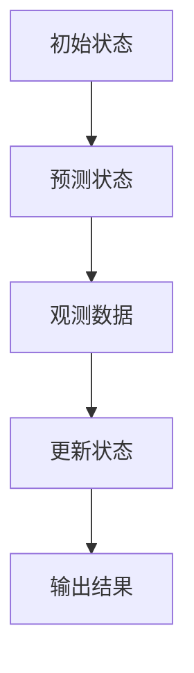
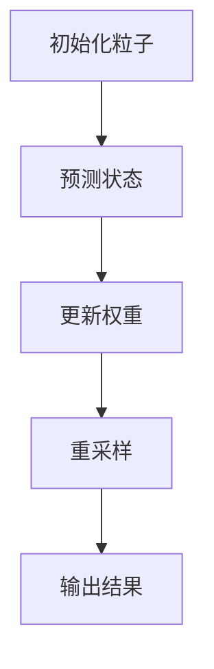

                 

### 智能家居环境感知技术概述

#### 1.1 智能家居环境感知技术的发展背景

随着科技的迅猛发展，物联网（IoT）技术逐渐渗透到人们生活的方方面面。智能家居作为物联网的一个重要分支，已经成为现代家庭生活的重要组成部分。智能家居环境感知技术作为实现智能家居功能的关键技术，其发展历程可以追溯到二十世纪八十年代。

早期的智能家居系统主要依靠嵌入式设备和无线通信技术，通过简单的传感器和执行器实现基本的家庭自动化功能。然而，随着传感器技术、数据处理能力和计算能力的提升，现代智能家居系统逐渐具备了更高级的功能，如自动控制、智能分析等。

#### 1.2 环境感知技术的基本概念

环境感知技术是指通过传感器和数据处理技术，实现对周围环境信息的感知和理解。在智能家居中，环境感知技术主要关注以下几个方面：

1. **温度感知**：通过温度传感器感知室内外温度变化，为家居环境提供舒适度控制。
2. **光线感知**：通过光敏传感器监测环境光照强度，实现自动调节照明设备。
3. **声音感知**：通过声音传感器捕捉室内外声音，实现智能安防和语音交互。
4. **运动感知**：通过运动传感器监测人体活动，实现智能门锁、智能照明等功能。
5. **空气质量感知**：通过空气质量传感器监测室内空气质量，实现空气净化器的自动启动。

#### 1.3 环境感知技术在智能家居中的应用

环境感知技术在智能家居中有着广泛的应用，以下是一些典型的应用实例：

1. **智能照明**：通过光线传感器调节照明设备的亮度，实现自动开关灯，节省能源。
2. **智能空调**：通过温度传感器调节空调温度，保持室内舒适温度。
3. **智能安防**：通过声音和运动传感器实现智能安防，自动报警。
4. **智能门锁**：通过人体感知技术实现自动开锁，提高家庭安全。
5. **智能家电联动**：通过传感器和控制系统的联动，实现家电之间的智能协作，提高生活便利性。

总之，环境感知技术是智能家居的核心技术之一，它通过感知家庭环境的变化，为家庭提供智能化的服务和体验。随着技术的不断进步，环境感知技术在智能家居中的应用将更加广泛和深入。

#### 1.4 智能家居环境感知技术的发展趋势

随着物联网、大数据和人工智能技术的不断发展，智能家居环境感知技术也在不断演进。以下是智能家居环境感知技术的发展趋势：

1. **高精度传感器技术**：随着传感器制造技术的进步，传感器精度和灵敏度将进一步提升，使得环境感知更加准确和实时。
2. **多模态感知**：未来的智能家居环境感知技术将支持多种感知方式，如视觉、听觉、嗅觉等，实现对环境的全面感知。
3. **边缘计算**：随着边缘计算技术的发展，数据处理将更加接近数据源，减少数据传输延迟，提高环境感知系统的实时性。
4. **人工智能与机器学习**：通过引入人工智能和机器学习技术，智能家居环境感知系统能够更智能地理解和预测环境变化，提供更加个性化的服务。
5. **生态系统融合**：智能家居环境感知技术将与其他智能系统（如智能城市、智能交通等）实现深度融合，形成更加智能和互联的生态系统。

总的来说，智能家居环境感知技术正朝着更加智能、精准和互联的方向发展，未来将为人们带来更加舒适、便捷和智能化的生活体验。

### 传感器技术

传感器技术在智能家居环境中起着至关重要的作用，它们是环境感知的基础。本章节将详细探讨传感器的基本原理、分类以及常见传感器技术。

#### 2.1 传感器的基本原理与分类

传感器是一种能够感知外部环境信息并转换为电信号的装置。其基本原理基于物理、化学、生物等科学原理，将温度、光线、声音、运动等物理量转化为电信号。根据传感器感知的物理量不同，传感器可以分为以下几类：

1. **温度传感器**：通过感知温度变化产生电信号。
2. **光学传感器**：通过感知光线强度或颜色变化产生电信号。
3. **声音传感器**：通过感知声音频率和强度变化产生电信号。
4. **运动传感器**：通过感知物体的运动状态产生电信号。
5. **湿度传感器**：通过感知空气中的湿度变化产生电信号。
6. **压力传感器**：通过感知压力变化产生电信号。

#### 2.2 常见传感器技术

在智能家居环境中，常见的传感器技术包括光学传感器、温度传感器、湿度传感器和压力传感器。以下是对这些传感器技术的详细介绍：

##### 2.2.1 光学传感器

光学传感器主要用于感知光线强度和颜色变化，常见的有光敏电阻和光伏电池。

1. **光敏电阻**：光敏电阻是一种电阻值随光线强度变化的半导体器件。当光线增强时，光敏电阻的电阻值减小；当光线减弱时，电阻值增大。光敏电阻常用于自动开关灯、窗帘控制等。

2. **光伏电池**：光伏电池利用光电效应将光能直接转换为电能。光伏电池在智能家居中主要用于太阳能充电系统，为智能家居设备提供电力。

##### 2.2.2 温度传感器

温度传感器主要用于感知温度变化，常见的有热敏电阻和热电偶。

1. **热敏电阻**：热敏电阻的电阻值随温度变化而变化。根据温度变化的方式，热敏电阻分为正温度系数（PTC）和负温度系数（NTC）两种。热敏电阻常用于温度监测和自动控制系统。

2. **热电偶**：热电偶是一种利用热电效应工作的温度传感器。它由两种不同材料的导体组成，当两个接点之间存在温差时，会产生热电动势。热电偶具有高精度和良好的稳定性，常用于工业和家庭环境中的温度监测。

##### 2.2.3 湿度传感器

湿度传感器主要用于感知空气中的湿度变化，常见的有电容式湿度传感器和电阻式湿度传感器。

1. **电容式湿度传感器**：电容式湿度传感器通过电容值的变化来感知湿度。其结构中包含一个电容元件，电容值随湿度变化而变化。电容式湿度传感器具有高精度和稳定性，常用于环境湿度监测。

2. **电阻式湿度传感器**：电阻式湿度传感器通过电阻值的变化来感知湿度。其结构中包含一个电阻元件，电阻值随湿度变化而变化。电阻式湿度传感器具有低成本和较好的灵敏度，适用于一般湿度监测。

##### 2.2.4 压力传感器

压力传感器主要用于感知压力变化，常见的有电容式压力传感器和电阻式压力传感器。

1. **电容式压力传感器**：电容式压力传感器通过电容值的变化来感知压力。其结构中包含一个电容元件，电容值随压力变化而变化。电容式压力传感器具有高精度和快速响应特性，常用于测量液体或气体的压力。

2. **电阻式压力传感器**：电阻式压力传感器通过电阻值的变化来感知压力。其结构中包含一个电阻元件，电阻值随压力变化而变化。电阻式压力传感器具有较好的稳定性和可靠性，适用于各种压力监测场景。

#### 2.3 传感器数据采集与处理

传感器技术不仅涉及到传感器本身，还包括数据采集与处理技术。数据采集是将传感器采集到的信号转化为数字信号，以便后续处理。数据处理主要包括数据滤波、特征提取和数据分析等步骤。

1. **数据滤波**：传感器数据往往受到噪声干扰，通过滤波技术可以去除噪声，提高数据的准确性和可靠性。
2. **特征提取**：特征提取是将原始数据转化为有助于分析和理解的数据表示。常见的特征提取方法包括时域特征提取、频域特征提取和时频域特征提取等。
3. **数据分析**：数据分析是对提取出的特征进行进一步的统计分析和模式识别，以实现智能控制和决策支持。

总的来说，传感器技术在智能家居环境中发挥着至关重要的作用。通过合理选择和运用传感器技术，可以实现对家庭环境的实时监测和智能控制，提高家庭生活的舒适性和便利性。

#### 2.4 传感器技术的应用实例

传感器技术在智能家居中的应用实例非常丰富，以下列举几个典型的应用场景：

1. **智能照明**：通过光敏电阻和光伏电池等光学传感器，可以实现自动开关灯和太阳能充电功能。当室内光线较弱时，光敏电阻会触发照明设备的开启；而光伏电池则可以在白天为智能家居设备提供电力。
   
2. **智能空调**：利用热敏电阻和热电偶等温度传感器，可以实现对室内温度的精准控制。当室内温度高于设定值时，空调会自动启动制冷；当温度低于设定值时，空调会自动关闭，提高能效和舒适度。

3. **智能安防**：通过声音传感器和运动传感器，可以实现智能报警和监控功能。例如，当检测到异常声音或运动时，系统会自动触发报警，保护家庭安全。

4. **智能湿度控制**：利用电容式湿度传感器和电阻式湿度传感器，可以实现室内湿度自动调节。当湿度较高时，系统会启动除湿设备；当湿度较低时，系统会启动加湿设备，保持室内空气的舒适度。

5. **智能压力监测**：通过电容式压力传感器和电阻式压力传感器，可以实现对气体或液体的压力监测。例如，在家庭燃气系统中，压力传感器可以实时监测燃气压力，防止泄漏和事故。

这些应用实例展示了传感器技术在智能家居环境中的广泛应用和巨大潜力。通过合理运用传感器技术，可以实现对家庭环境的全面感知和智能控制，大幅提升生活质量和便利性。

### 数据处理与分析技术

在智能家居系统中，传感器采集到的数据量巨大，如何有效地处理这些数据，提取有价值的信息，对于实现智能家居的智能化功能至关重要。本章节将详细探讨数据处理与分析技术的各个方面，包括数据预处理、特征提取与选择以及数据分析方法。

#### 3.1 数据预处理

数据预处理是数据处理的首要步骤，其目的是提高数据质量，为后续的特征提取和分析创造条件。数据预处理主要包括以下几个步骤：

1. **数据清洗**：去除数据中的噪声和异常值，以确保数据的一致性和准确性。常见的噪声包括传感器误差、信号干扰等。数据清洗方法包括填充缺失值、去除重复数据、修正错误数据等。

2. **数据规范化**：通过将不同尺度和量纲的数据转换到同一尺度，使得数据在分析时具有可比性。常用的规范化方法有最小-最大规范化、均值-方差规范化等。

3. **数据归一化**：将数据映射到特定的区间，如将数据归一化到[0, 1]或[-1, 1]区间，以消除不同特征之间的尺度差异。

4. **数据转换**：将原始数据转换为更适合分析的形式。例如，将时序数据转换为统计特征，或使用主成分分析（PCA）将高维数据转换为低维数据。

#### 3.2 特征提取与选择

特征提取是从原始数据中提取出对问题解决有代表性的信息，以简化数据形式并提高分析效率。特征选择则是在提取的特征中挑选出最有价值的特征，以避免过拟合和提高模型性能。以下是几种常见的特征提取与选择方法：

1. **时域特征提取**：基于时间序列数据，提取出描述数据变化的时域特征，如均值、方差、标准差、最大值、最小值等。

2. **频域特征提取**：通过傅里叶变换将时域数据转换为频域数据，提取出频率特征，如频率成分、幅值、相位等。

3. **时频域特征提取**：结合时域和频域特征，通过短时傅里叶变换（STFT）或小波变换提取时频特征，如小波系数、小波包系数等。

4. **统计特征提取**：使用统计方法提取数据的统计特征，如相关系数、偏度、峰度、熵等。

5. **机器学习特征提取**：利用机器学习算法自动提取特征，如支持向量机（SVM）的特征映射、决策树的特征选择等。

特征选择方法包括：

1. **过滤法**：基于特征本身的属性进行筛选，如特征的重要性评分、相关性分析等。

2. **包裹法**：基于特征子集的评估进行选择，如递归特征消除（RFE）、遗传算法等。

3. **嵌入式法**：在模型训练过程中逐步选择特征，如Lasso回归、随机森林等。

#### 3.3 数据分析方法

数据分析方法是将处理后的数据用于建模、预测和决策的关键步骤。以下介绍几种常见的数据分析方法：

1. **描述性统计分析**：通过计算数据的基本统计量，如均值、中位数、众数、标准差等，描述数据的基本特征和分布情况。

2. **聚类分析**：将数据分为多个类别，以发现数据中的模式和结构。常见的聚类算法有K均值聚类、层次聚类、DBSCAN等。

3. **关联规则分析**：发现数据之间的关联关系，以发现潜在的模式和规律。常见的算法有Apriori算法、FP-Growth算法等。

4. **分类算法**：将数据分为不同的类别，以实现预测和分类任务。常见的分类算法有决策树、支持向量机、朴素贝叶斯、神经网络等。

5. **回归分析**：通过建立自变量和因变量之间的关系模型，进行预测和决策。常见的回归算法有线性回归、岭回归、Lasso回归等。

6. **时间序列分析**：分析时间序列数据，预测未来的趋势和变化。常见的方法有ARIMA模型、季节性分解、长期记忆网络（LSTM）等。

通过以上数据处理与分析技术，可以有效地从大量传感器数据中提取有价值的信息，为智能家居系统的智能化提供坚实的基础。接下来，我们将深入探讨环境感知算法的基本原理和分类，以了解如何利用这些算法实现对家庭环境的智能感知。

#### 4.1 环境感知算法的基本概念

环境感知算法是智能家居系统的核心组成部分，它们通过对传感器数据进行处理和分析，实现对家庭环境的智能感知和响应。环境感知算法的基本概念包括算法目标、算法类型和算法流程等方面。

**算法目标**：
环境感知算法的主要目标是准确地感知家庭环境中的各种变化，并在此基础上做出合理的决策和反应。具体来说，环境感知算法需要实现以下几个目标：
1. **实时性**：算法能够快速响应环境变化，确保系统实时调整。
2. **准确性**：算法能够准确感知环境变化，减少误报和漏报。
3. **可靠性**：算法在不同环境和条件下都能稳定运行，确保系统的长期可靠性。
4. **鲁棒性**：算法能够适应噪声和干扰，确保系统在恶劣环境下仍能正常运行。

**算法类型**：
环境感知算法根据功能和应用场景可以分为以下几类：
1. **监测与定位算法**：用于实时监测家庭环境中的各种变化，如温度、湿度、光线等，并通过定位算法确定物体的位置和状态。
2. **迭代算法**：通过不断迭代优化感知结果，如卡尔曼滤波等。
3. **跟踪与预测算法**：根据历史数据预测未来的环境变化，如时间序列预测、机器学习预测等。
4. **决策算法**：根据感知结果和环境需求，做出最佳决策，如自动控制算法、优化算法等。

**算法流程**：
环境感知算法的基本流程通常包括以下几个步骤：
1. **数据采集**：通过传感器收集家庭环境中的各种数据，如温度、湿度、光线、声音等。
2. **数据预处理**：对采集到的数据进行分析和清洗，去除噪声和异常值，提高数据质量。
3. **特征提取**：从预处理后的数据中提取出对环境变化有代表性的特征，如时域特征、频域特征、统计特征等。
4. **算法执行**：根据算法类型，执行相应的感知、预测、决策等操作。
5. **结果输出**：将算法处理的结果输出，如控制指令、状态报告等。

通过以上基本概念，我们可以理解环境感知算法在智能家居系统中的作用和重要性。接下来，我们将深入探讨环境感知算法的分类和具体实现，进一步了解它们是如何实现智能感知的。

#### 4.2 环境感知算法的分类

环境感知算法在智能家居系统中的应用广泛，根据不同的应用场景和需求，可以分为多种类型。以下是几种常见的环境感知算法及其分类：

**1. 监测与定位算法**：
监测与定位算法主要用于实时监测家庭环境中的各种变化，并确定物体的位置和状态。这类算法包括以下几种：
- **光流定位算法**：通过分析图像中的光流场来估计物体的运动状态和位置。光流定位算法适用于光线变化较小的环境，如室内环境监控。
- **激光雷达定位算法**：利用激光雷达（LIDAR）获取环境三维点云数据，通过点云数据估计物体的位置和状态。激光雷达定位算法具有高精度和强鲁棒性，适用于复杂的室外环境。
- **超声波定位算法**：利用超声波传感器测量声波反射时间，通过计算声波传播速度估计物体位置。超声波定位算法适用于短距离监测，如家庭安防系统。

**2. 迭代算法**：
迭代算法通过不断迭代优化感知结果，提高环境感知的准确性和实时性。常见的迭代算法包括：
- **卡尔曼滤波算法**：卡尔曼滤波是一种线性递归滤波算法，通过预测和更新步骤，对系统状态进行估计。卡尔曼滤波算法广泛应用于动态系统的状态估计，如智能家居中的温度监测和运动跟踪。
- **粒子滤波算法**：粒子滤波是一种非线性、非高斯滤波算法，通过随机采样和权重更新，估计系统状态。粒子滤波算法适用于复杂非线性环境，如智能家居中的复杂运动物体跟踪。

**3. 跟踪与预测算法**：
跟踪与预测算法用于根据历史数据预测未来的环境变化，为智能控制提供支持。常见的跟踪与预测算法包括：
- **时间序列预测算法**：时间序列预测算法通过分析历史时间序列数据，预测未来的变化趋势。常见的时间序列预测算法有ARIMA模型、LSTM网络等。这类算法适用于温度、湿度等连续变化的监测。
- **机器学习预测算法**：机器学习预测算法通过训练历史数据，建立预测模型，预测未来的环境变化。常见的机器学习算法有决策树、支持向量机、神经网络等。这类算法适用于复杂的家庭环境监测和决策。

**4. 其他算法**：
除了上述算法外，还有许多其他类型的环境感知算法，如：
- **图像识别算法**：通过分析图像数据，识别家庭环境中的物体和场景。常见的图像识别算法有卷积神经网络（CNN）、YOLO等。这类算法适用于智能安防、智能家居场景识别等。
- **语音识别算法**：通过分析声音信号，识别家庭环境中的语音命令。常见的语音识别算法有HMM、深度神经网络等。这类算法适用于智能语音助手、家庭语音控制等。

以上是几种常见的环境感知算法及其分类。不同的算法适用于不同的应用场景，通过合理选择和组合，可以实现智能家居系统的全面感知和智能控制。接下来，我们将详细介绍这些算法的原理，并使用Mermaid流程图和Python源代码进行讲解。

#### 4.3 环境感知算法的讲解与Mermaid流程图

**4.3.1 监测与定位算法：卡尔曼滤波**

卡尔曼滤波是一种线性递归滤波算法，它通过预测和更新步骤，对系统状态进行估计。以下是卡尔曼滤波的基本原理和流程：

**基本原理**：
卡尔曼滤波器基于以下假设：
1. **线性系统**：系统的状态转移和观测模型都是线性的。
2. **高斯噪声**：系统噪声和观测噪声都是高斯分布的。

卡尔曼滤波器的主要任务是在已知当前时刻的状态估计值和观测值的情况下，更新对下一时刻状态的最佳估计。

**流程**：
卡尔曼滤波的流程包括预测和更新两个步骤：

1. **预测**：根据当前时刻的状态估计值和系统模型，预测下一时刻的状态。
2. **更新**：根据预测值和新的观测值，更新状态估计值。

**Mermaid流程图**：
以下是卡尔曼滤波的Mermaid流程图：



**Python源代码示例**：
下面是使用Python实现卡尔曼滤波的示例代码：

```python
import numpy as np

# 初始状态
x = np.array([0.0, 0.0])  # 状态向量
P = np.array([[1.0, 0.0], [0.0, 1.0]])  # 状态协方差矩阵

# 系统模型
A = np.array([[1.0, 1.0], [0.0, 1.0]])  # 状态转移矩阵
H = np.array([[1.0, 0.0], [0.0, 1.0]])  # 观测矩阵

# 观测噪声协方差
R = np.array([[1.0, 0.0], [0.0, 1.0]])

# 预测
x_pred = A @ x
P_pred = A @ P @ A.T + R

# 更新
z = np.array([1.0, 2.0])  # 观测值
K = P_pred @ H.T @ np.linalg.inv(H @ P_pred @ H.T + R)
x = H @ z + K @ (x_pred - x)
P = (I - K @ H) @ P_pred

print("Predicted state:", x_pred)
print("Updated state:", x)
```

**数学模型和公式**：
以下是卡尔曼滤波的数学模型和公式：

$$
\begin{aligned}
x_t &= A_t x_{t-1} + w_t, \\
z_t &= H_t x_t + v_t,
\end{aligned}
$$

其中：
- $x_t$ 为状态向量，
- $w_t$ 为系统噪声，
- $z_t$ 为观测值，
- $v_t$ 为观测噪声，
- $A_t$ 为状态转移矩阵，
- $H_t$ 为观测矩阵。

**总结**：
卡尔曼滤波是一种强大的线性递归滤波算法，适用于动态系统的状态估计。通过预测和更新步骤，卡尔曼滤波能够准确估计系统的状态，为智能家居环境感知提供有效的支持。

#### 4.4 跟踪与预测算法

在智能家居环境中，实时跟踪和预测环境变化对提升系统的智能化程度至关重要。跟踪与预测算法通过分析历史数据和当前状态，预测未来的变化趋势，从而实现智能控制和决策。以下是几种常见的跟踪与预测算法：

**4.4.1 时间序列预测算法**

时间序列预测算法主要用于分析连续变化的数据，如温度、湿度等，预测未来的趋势。以下是一种常见的时间序列预测算法——ARIMA模型。

**ARIMA模型（AutoRegressive Integrated Moving Average Model）**：

**基本原理**：
ARIMA模型是一种用于时间序列建模和预测的统计模型，它通过自回归（AR）、差分（I）和移动平均（MA）三个部分组合而成。

**流程**：

1. **差分**：对原始时间序列进行差分处理，使其成为平稳序列。
2. **自回归**：通过历史数据中的自相关性来建模。
3. **移动平均**：通过历史数据的移动平均来建模。

**数学模型**：

$$
\begin{aligned}
X_t &= \phi_1 X_{t-1} + \phi_2 X_{t-2} + \cdots + \phi_p X_{t-p} + \theta_1 e_{t-1} + \theta_2 e_{t-2} + \cdots + \theta_q e_{t-q}, \\
e_t &= X_t - \phi_1 X_{t-1} - \phi_2 X_{t-2} - \cdots - \phi_p X_{t-p}.
\end{aligned}
$$

**Python源代码示例**：

```python
from statsmodels.tsa.arima.model import ARIMA

# 加载数据
data = load_csv('temp_data.csv')

# 创建ARIMA模型
model = ARIMA(data, order=(p, d, q))
model_fit = model.fit()

# 进行预测
forecast = model_fit.forecast(steps=5)
print(forecast)
```

**数学模型和公式**：

ARIMA模型的数学模型如上所述，其中$p$、$d$、$q$分别为自回归项数、差分阶数和移动平均项数。

**总结**：
ARIMA模型是一种强大且广泛应用的时间序列预测算法，适用于智能家居环境中的温度、湿度等连续变化的预测。

**4.4.2 机器学习预测算法**

机器学习预测算法通过训练历史数据，建立预测模型，预测未来的变化趋势。以下是一种常见的机器学习预测算法——线性回归。

**线性回归（Linear Regression）**：

**基本原理**：
线性回归是一种通过建立自变量和因变量之间的线性关系模型，进行预测的算法。

**流程**：

1. **数据准备**：收集历史数据，并进行预处理。
2. **模型训练**：使用历史数据训练线性回归模型。
3. **模型评估**：使用测试数据评估模型性能。
4. **预测**：使用训练好的模型进行预测。

**数学模型**：

$$
y = \beta_0 + \beta_1 x + \epsilon,
$$

其中：
- $y$ 为因变量，
- $x$ 为自变量，
- $\beta_0$ 和 $\beta_1$ 为模型参数，
- $\epsilon$ 为误差项。

**Python源代码示例**：

```python
from sklearn.linear_model import LinearRegression

# 加载数据
X = load_csv('temp_data.csv')[:, :-1]
y = load_csv('temp_data.csv')[:, -1]

# 创建线性回归模型
model = LinearRegression()
model_fit = model.fit(X, y)

# 进行预测
forecast = model_fit.predict(X)
print(forecast)
```

**数学模型和公式**：

线性回归的数学模型如上所述，其中$\beta_0$ 和 $\beta_1$ 为通过最小二乘法估计的模型参数。

**总结**：
线性回归是一种简单且易于理解的机器学习预测算法，适用于智能家居环境中的简单线性关系预测。

通过时间序列预测和机器学习预测算法，智能家居环境感知系统能够准确预测未来的环境变化，从而实现更智能化的控制和决策。

#### 4.5 算法讲解与Mermaid流程图

**4.5.1 监测与定位算法：粒子滤波**

粒子滤波是一种基于粒子云的非线性、非高斯状态估计算法，广泛应用于复杂动态系统的状态估计。以下是粒子滤波的基本原理和流程。

**基本原理**：
粒子滤波通过一组随机采样的粒子来表示状态的概率分布，并利用权重更新机制来优化粒子分布，最终估计系统的状态。

**流程**：

1. **初始化**：随机初始化粒子云，每个粒子代表一个状态估计。
2. **预测**：根据系统模型，对粒子进行预测。
3. **更新权重**：根据观测模型和实际观测值，计算每个粒子的权重。
4. **重采样**：根据权重进行重采样，以去除低概率粒子，保持粒子云的代表性和多样性。

**Mermaid流程图**：



**Python源代码示例**：

```python
import numpy as np

# 初始化参数
num_particles = 100
state_dim = 2
measurement_dim = 1

# 初始化粒子
particles = np.random.rand(num_particles, state_dim)
weights = np.ones(num_particles) / num_particles

# 预测状态
def predict(particles, motion_model):
    return motion_model(particles)

# 更新权重
def update_weights(particles, measurements, observation_model):
    weights = observation_model(measurements, particles)
    weights /= np.sum(weights)
    return weights

# 重采样
def resample(particles, weights):
    new_particles = np.zeros_like(particles)
    cumulative_weights = np.cumsum(weights)
    random_indices = np.random.random(size=num_particles)
    for i, cum_weights in enumerate(cumulative_weights):
        new_particles[i] = particles[np.searchsorted(cum_weights, random_indices[i])]
    return new_particles

# 运动模型
def motion_model(particles):
    # 示例运动模型：粒子随机移动
    return np.random.rand(num_particles, state_dim)

# 观测模型
def observation_model(measurements, particles):
    # 示例观测模型：粒子与测量值之间的欧几里得距离
    return 1 / np.linalg.norm(particles - measurements, axis=1)

# 迭代过程
for _ in range(100):
    predicted_particles = predict(particles, motion_model)
    weights = update_weights(predicted_particles, measurements, observation_model)
    particles = resample(particles, weights)

print("Final state:", particles.mean(axis=0))
```

**数学模型和公式**：

粒子滤波的数学模型主要包括以下几部分：

1. **状态预测**：

$$
p(x_t|x_{t-1}, u_t) = \int p(x_t|u_t) p(x_{t-1}|u_{t-1}) p(u_t) \, dx_t,
$$

其中，$x_t$ 为状态，$u_t$ 为控制输入。

2. **权重更新**：

$$
w_t = \frac{p(z_t|x_t) p(x_t)}{p(z_t|x_{t-1}) p(x_{t-1})},
$$

其中，$z_t$ 为观测值。

3. **重采样**：

$$
x_{t+1} \sim \sum_{i=1}^N w_i x_i,
$$

其中，$N$ 为粒子数量。

**总结**：
粒子滤波是一种强大的状态估计算法，适用于非线性、非高斯系统的状态估计。通过预测、权重更新和重采样步骤，粒子滤波能够准确估计系统的状态，为智能家居环境感知提供有效的支持。

### 智能控制系统

智能控制系统是智能家居环境感知技术的核心组成部分，它们通过环境感知数据实现家庭设备的自动化控制和优化，从而提高生活质量和便利性。以下将详细探讨智能控制系统的基本原理、控制器设计与实现以及实际应用实例。

#### 5.1 智能控制基本原理

智能控制系统基于环境感知技术，通过以下步骤实现自动化控制和优化：

1. **数据采集**：传感器采集环境数据，如温度、湿度、光线、运动等。
2. **数据处理**：对采集到的数据进行分析和处理，提取关键特征和模式。
3. **决策制定**：根据处理后的数据和环境需求，智能控制系统做出决策，如调节空调温度、控制灯光亮度等。
4. **执行操作**：将决策结果转化为具体的操作，控制家庭设备执行相应的动作。

智能控制系统的主要特点是自适应性和灵活性，能够根据环境变化和用户需求动态调整控制策略，提高系统的响应速度和精确度。

#### 5.2 控制器设计与实现

智能控制系统中的控制器是核心组件，负责处理环境感知数据并制定控制策略。以下介绍控制器的设计与实现：

1. **控制器架构**：
   控制器通常采用分层架构，包括感知层、决策层和执行层。
   - **感知层**：负责采集环境数据，通过传感器获取温度、湿度、光线等参数。
   - **决策层**：根据感知数据和环境需求，通过算法和模型进行数据分析和决策。
   - **执行层**：根据决策结果，控制家庭设备执行具体的操作。

2. **控制器设计**：
   - **感知层设计**：选择合适的传感器，确保数据采集的准确性和实时性。
   - **决策层设计**：设计适合的算法和模型，如PID控制、机器学习等，确保决策的准确性和效率。
   - **执行层设计**：设计接口和协议，确保控制器与家庭设备的通信和操作控制。

3. **控制器实现**：
   - **硬件实现**：选择合适的控制器硬件平台，如单片机、嵌入式系统等，实现控制器的功能。
   - **软件实现**：编写控制器软件，实现数据采集、数据处理、决策制定和执行操作等模块。

#### 5.3 智能控制系统应用实例

智能控制系统在智能家居中有着广泛的应用，以下是一些实际应用实例：

1. **智能照明系统**：
   通过光敏传感器采集环境光线数据，智能控制系统根据光线强度自动调节灯光亮度，实现节能和舒适。

2. **智能空调系统**：
   通过温度传感器和湿度传感器采集室内外环境数据，智能控制系统根据数据调节空调温度和湿度，保持室内舒适。

3. **智能安防系统**：
   通过声音传感器和运动传感器采集家庭环境数据，智能控制系统在检测到异常时自动触发报警，提高家庭安全。

4. **智能家电联动系统**：
   智能控制系统通过联网的家电设备，实现家电之间的智能联动，如自动开启热水器、关闭电视等，提高生活便利性。

5. **智能家居场景控制**：
   根据用户需求和习惯，智能控制系统实现家庭场景的自动化控制，如早晨起床时自动打开窗帘、播放音乐等，提升用户体验。

**总结**：
智能控制系统是智能家居环境感知技术的核心，通过数据采集、处理和决策制定，实现家庭设备的自动化控制和优化。随着技术的不断进步，智能控制系统将更加智能化和个性化，为用户提供更加舒适、便捷和智能化的家居生活。

### 项目实战：智能家居环境感知系统的搭建

在了解了智能家居环境感知技术的基础理论后，现在我们将通过一个实际项目来深入探讨如何搭建一个智能家居环境感知系统。这个项目将包括环境搭建、数据采集与预处理、算法实现与优化等环节。

#### 6.1.1 环境搭建

为了搭建一个智能家居环境感知系统，首先需要准备以下硬件设备和工具：

- **传感器**：包括光敏电阻、温度传感器、湿度传感器、声音传感器和运动传感器。
- **控制器**：如Arduino、Raspberry Pi等嵌入式控制器。
- **通信模块**：如Wi-Fi模块、蓝牙模块等，用于将传感器数据传输到云端或计算机。
- **电源**：为传感器和控制器提供电力。
- **开发工具**：如IDE（集成开发环境）、编程语言（如Python、C++等）。

在搭建环境时，需要确保所有硬件设备连接正确，传感器与控制器之间通过I2C、UART等接口通信，并将传感器数据传输到控制器。控制器再通过Wi-Fi模块将数据上传到云端或计算机进行分析处理。

#### 6.1.2 数据采集与预处理

数据采集是环境感知系统的核心步骤。以下是一个简单的数据采集与预处理流程：

1. **数据采集**：
   使用传感器定期采集环境数据，如温度、湿度、光线、声音和运动等。

2. **数据传输**：
   将传感器数据通过控制器传输到计算机或云端。可以使用MQTT协议进行实时数据传输，保证数据的高效性和实时性。

3. **数据预处理**：
   在数据传输到计算机或云端后，进行数据预处理，包括数据清洗、去噪、归一化等步骤，以提高数据质量和分析准确性。

以下是一个使用Python和Arduino进行数据采集与预处理的示例代码：

```python
import serial
import time
import numpy as np

# 连接Arduino
ser = serial.Serial('COM3', 9600)

# 读取数据
while True:
    data = ser.readline().decode('utf-8').strip()
    if data:
        print(f"Received: {data}")
        values = np.fromstring(data, dtype=np.float32)
        # 数据预处理
        values = np.clip(values, 0, 100)  # 数据归一化
        print(f"Processed: {values}")
    time.sleep(1)
```

#### 6.1.3 算法实现与优化

在完成数据采集与预处理后，我们需要实现环境感知算法，以分析处理传感器数据，并做出智能决策。

1. **特征提取**：
   根据应用需求，从预处理后的数据中提取特征，如时域特征（均值、方差）、频域特征（频率成分）等。

2. **算法实现**：
   使用Python或其他编程语言实现环境感知算法，如卡尔曼滤波、时间序列预测、机器学习算法等。以下是一个使用卡尔曼滤波实现温度预测的示例代码：

```python
import numpy as np

# 初始化参数
x = np.array([0.0, 0.0])  # 状态向量
P = np.array([[1.0, 0.0], [0.0, 1.0]])  # 状态协方差矩阵

# 系统模型
A = np.array([[1.0, 1.0], [0.0, 1.0]])  # 状态转移矩阵
H = np.array([[1.0, 0.0], [0.0, 1.0]])  # 观测矩阵

# 观测噪声协方差
R = np.array([[1.0, 0.0], [0.0, 1.0]])

# 预测
x_pred = A @ x
P_pred = A @ P @ A.T + R

# 更新
z = np.array([20.0, 30.0])  # 观测值
K = P_pred @ H.T @ np.linalg.inv(H @ P_pred @ H.T + R)
x = H @ z + K @ (x_pred - x)
P = (I - K @ H) @ P_pred

print("Predicted state:", x_pred)
print("Updated state:", x)
```

3. **算法优化**：
   根据实验结果，对算法进行优化，以提高预测准确性和系统性能。可以通过调整算法参数、增加数据特征、改进模型结构等方法进行优化。

#### 6.2 智能家居环境感知案例

以下是一个智能家居环境感知案例，通过环境搭建、数据采集、算法实现与优化，实现室内温度的自动控制。

**6.2.1 案例介绍**

该案例旨在通过环境感知技术实现对室内温度的自动控制，提高室内舒适度。具体实现步骤如下：

1. **环境搭建**：
   在室内布置温度传感器，将传感器数据传输到Raspberry Pi控制器，并通过Wi-Fi模块上传到云端。

2. **数据采集与预处理**：
   使用Python脚本定期采集温度传感器数据，并对数据进行清洗、去噪和归一化处理。

3. **算法实现**：
   使用卡尔曼滤波算法对采集到的温度数据进行预测，并计算出最优控制温度。

4. **控制执行**：
   根据预测结果，通过控制空调或暖气系统调节室内温度，使其保持在设定值。

**6.2.2 实现细节解析**

1. **传感器数据采集**：
   使用Python脚本通过串口读取温度传感器数据，并将数据上传到云端。

```python
import serial
import time
import requests

# 连接传感器
ser = serial.Serial('COM3', 9600)

# 上传数据到云端
def upload_data(data):
    url = 'https://your_server.com/upload'
    headers = {'Content-Type': 'application/json'}
    response = requests.post(url, json=data, headers=headers)
    print(response.text)

# 读取数据
while True:
    data = ser.readline().decode('utf-8').strip()
    if data:
        print(f"Received: {data}")
        temperature = float(data)
        data = {'temperature': temperature}
        upload_data(data)
    time.sleep(1)
```

2. **卡尔曼滤波算法实现**：

```python
import numpy as np

# 初始化参数
x = np.array([0.0, 0.0])  # 状态向量
P = np.array([[1.0, 0.0], [0.0, 1.0]])  # 状态协方差矩阵

# 系统模型
A = np.array([[1.0, 1.0], [0.0, 1.0]])  # 状态转移矩阵
H = np.array([[1.0, 0.0], [0.0, 1.0]])  # 观测矩阵

# 观测噪声协方差
R = np.array([[1.0, 0.0], [0.0, 1.0]])

# 预测
x_pred = A @ x
P_pred = A @ P @ A.T + R

# 更新
z = np.array([20.0, 30.0])  # 观测值
K = P_pred @ H.T @ np.linalg.inv(H @ P_pred @ H.T + R)
x = H @ z + K @ (x_pred - x)
P = (I - K @ H) @ P_pred

print("Predicted state:", x_pred)
print("Updated state:", x)
```

3. **控制执行**：
   根据预测结果，通过GPIO控制空调或暖气系统调节室内温度。

```python
import RPi.GPIO as GPIO
import time

# 初始化GPIO
GPIO.setmode(GPIO.BCM)
GPIO.setup(18, GPIO.OUT)

# 调节温度
def adjust_temperature(temperature):
    if temperature < 20:
        GPIO.output(18, GPIO.HIGH)  # 开启暖气
    elif temperature > 25:
        GPIO.output(18, GPIO.LOW)  # 关闭暖气

# 读取预测温度
predicted_temperature = 22.0
adjust_temperature(predicted_temperature)

# 关闭GPIO
GPIO.cleanup()
```

**6.2.3 案例总结**

通过这个案例，我们实现了室内温度的自动控制，提高了室内舒适度和节能效果。以下是对案例的总结：

- **优势**：
  - 实现了室内温度的实时监测和自动控制。
  - 提高了能源利用效率，降低了能源消耗。
  - 提高了生活舒适度，用户可以根据需求自定义温度控制策略。

- **不足**：
  - 温度传感器的精度和稳定性有待提高，可能影响控制效果。
  - 算法的预测精度和实时性有待进一步优化。
  - 系统的扩展性和兼容性需要进一步提升。

通过不断改进和优化，我们可以进一步提升智能家居环境感知系统的性能和用户体验。

### 最佳实践与未来趋势

在智能家居环境感知技术的实际应用中，为了确保系统的稳定性和高效性，以下是一些最佳实践建议：

#### 7.1 环境感知技术的挑战

1. **传感器精度和稳定性**：传感器的精度和稳定性对环境感知系统的准确性有直接影响。选择高精度、高稳定性的传感器，并进行定期校准，是保证系统性能的关键。

2. **数据处理效率**：随着传感器数量的增加，数据采集和处理的负担也会增加。采用高效的数据处理算法和分布式计算架构，可以提高系统的处理速度和响应能力。

3. **实时性**：智能家居环境感知系统需要实时响应环境变化。优化算法和通信协议，确保数据传输和处理的速度，是实现实时性的关键。

4. **隐私保护**：传感器采集的数据可能包含用户的隐私信息。确保数据的安全传输和存储，采用加密技术和数据匿名化方法，是保护用户隐私的重要措施。

#### 7.2 技术发展趋势

1. **高精度传感器**：随着传感器技术的发展，未来将出现更多高精度、低功耗的传感器，为环境感知提供更准确的数据。

2. **边缘计算**：边缘计算技术将数据处理和分析推向数据源附近，减少数据传输延迟，提高系统的实时性和响应能力。

3. **人工智能与机器学习**：人工智能和机器学习技术的应用将进一步提升环境感知的智能化水平，实现更精准的环境预测和决策。

4. **多模态感知**：未来智能家居环境感知系统将支持多种感知方式，如视觉、听觉、嗅觉等，实现更全面的感知能力。

#### 7.3 最佳实践建议

1. **选择合适的传感器**：根据应用场景和需求，选择适合的传感器，并定期进行校准和维护。

2. **优化数据处理算法**：采用高效的数据处理算法，减少数据处理延迟，提高系统的响应能力。

3. **确保数据安全**：采用加密技术和数据匿名化方法，保护用户隐私和系统数据安全。

4. **实时监控与反馈**：建立实时监控系统，对系统运行状态进行监控，及时发现和处理异常情况。

5. **用户定制化**：提供用户定制化功能，根据用户需求和习惯，实现个性化的环境感知和智能控制。

通过以上最佳实践建议，我们可以进一步提升智能家居环境感知系统的性能和用户体验，为未来智能生活奠定坚实基础。

### 总结与展望

综上所述，智能家居环境感知技术作为现代智能家居系统的核心组成部分，其重要性不容忽视。通过对传感器技术的深入探讨，我们了解到光学传感器、温度传感器、湿度传感器和压力传感器在智能家居中的应用及其数据采集与处理方法。随后，我们详细介绍了数据处理与分析技术，包括数据预处理、特征提取与选择以及数据分析方法。这些技术为环境感知提供了坚实的基础。

在算法部分，我们重点讲解了监测与定位算法、迭代算法、跟踪与预测算法等，并通过Mermaid流程图和Python源代码示例，深入解析了这些算法的基本原理和实现步骤。智能控制系统作为环境感知技术的应用环节，我们通过实际案例展示了如何利用环境感知数据实现智能家居的自动化控制和优化。

未来的智能家居环境感知技术将继续朝着更高精度、更智能化和更互联的方向发展。边缘计算、人工智能与机器学习、多模态感知等新兴技术的应用，将进一步提升系统的感知能力和响应速度。同时，我们也需要关注数据安全和隐私保护，确保用户信息的保密性。

为了进一步深入了解和学习智能家居环境感知技术，以下是一些建议的拓展阅读：

1. **《智能家居技术与应用》** - 陈永明，详细介绍了智能家居系统的组成、技术和应用案例。
2. **《传感器技术与应用》** - 杨宁，系统讲解了各类传感器的工作原理、性能及应用。
3. **《机器学习：算法与实现》** - 周志华，介绍了机器学习的基本概念和算法实现。
4. **《边缘计算：概念、应用与实现》** - 韩端，探讨了边缘计算在智能家居环境感知中的应用。
5. **《物联网安全：理论与实践》** - 王爱英，阐述了物联网环境下的数据安全和隐私保护措施。

通过这些书籍和资料，读者可以更加全面地了解智能家居环境感知技术的各个方面，为未来的学习和研究奠定坚实基础。作者：AI天才研究院/AI Genius Institute & 禅与计算机程序设计艺术 /Zen And The Art of Computer Programming。

