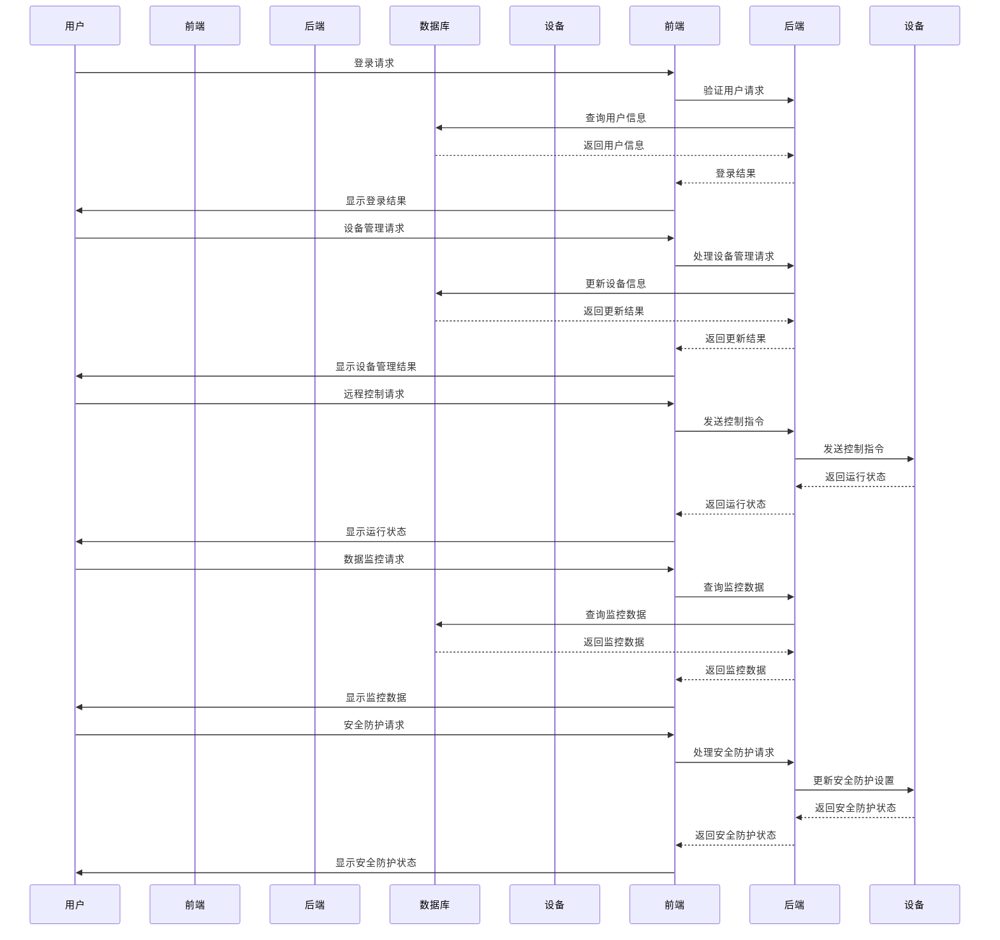

                 

# 智能家居生态系统的安全与隐私保护

## 关键词
- 智能家居
- 安全
- 隐私保护
- 物联网
- 加密算法
- 身份认证
- 架构设计

## 摘要
随着智能家居技术的迅猛发展，家庭生活变得更加便捷和智能化。然而，这一趋势也带来了新的安全和隐私挑战。本文将探讨智能家居生态系统中的安全与隐私保护问题，包括核心概念、算法原理、系统架构和实际项目实战。通过逐步分析和推理，本文旨在提供一种全面且深入的解决方案，以保障智能家居的安全与隐私。

## 引言
智能家居生态系统是一个复杂且庞大的网络，它由各种智能设备、传感器、控制系统和应用程序组成。这些设备通过网络相互连接，以实现远程控制、数据共享和自动化操作。然而，这种高度互联的环境也带来了安全隐患，包括数据泄露、设备被黑、隐私侵犯等问题。因此，确保智能家居生态系统的安全与隐私保护至关重要。

### 背景介绍

#### 智能家居的发展背景

智能家居技术起源于20世纪90年代，但随着互联网、传感器和无线通信技术的快速发展，智能家居市场在近年来迎来了爆发式增长。如今，智能门锁、智能照明、智能音响、智能摄像头等设备已经成为家庭中的常见物品。这些设备通过互联网相互连接，形成一个智能化的生态系统，极大地改变了人们的生活方式。

#### 智能家居的普及趋势

根据市场研究公司的数据，全球智能家居市场预计在未来几年将继续保持高速增长。特别是在城市化进程加速、人们生活节奏加快的背景下，智能家居的便捷性和舒适度吸引了越来越多的消费者。此外，随着5G网络的普及，智能家居设备的数据传输速度将大幅提升，进一步推动智能家居技术的发展。

#### 智能家居面临的安全与隐私挑战

1. **数据泄露**：智能家居设备收集了大量的用户数据，包括家庭住址、生活习惯、个人喜好等。这些数据如果遭到泄露，将对用户隐私造成严重威胁。
2. **设备被黑**：智能家居设备通常通过互联网连接，如果安全防护不到位，黑客可以通过网络远程控制设备，甚至对家庭安全构成威胁。
3. **隐私侵犯**：智能家居设备可能会记录用户的私密行为，如个人生活习惯、家庭活动等。如果这些信息被不法分子利用，将严重侵犯用户隐私。

#### 智能家居生态系统中的主要角色与关系

智能家居生态系统中的主要角色包括用户、智能设备、云平台和服务提供商。用户是生态系统的核心，通过控制中心或移动应用程序与智能设备互动。智能设备是智能家居的核心组成部分，包括门锁、摄像头、灯光系统、空调等。云平台提供数据存储、分析和处理服务，服务提供商则负责提供技术支持和服务。

### 核心概念与联系

#### 物联网安全架构

物联网安全架构主要包括四个层次：网络层、传输层、应用层和设备层。网络层负责网络连接的安全性，传输层确保数据传输的完整性和机密性，应用层提供安全的应用程序接口，设备层则关注智能设备本身的安全防护。

1. **网络层**：网络层的安全措施包括防火墙、入侵检测系统（IDS）和虚拟专用网络（VPN）。这些措施可以防止外部攻击和未经授权的访问。
2. **传输层**：传输层的安全措施包括数据加密和认证。数据加密可以确保数据在传输过程中不被窃取或篡改，认证则可以验证通信双方的合法性。
3. **应用层**：应用层的安全措施包括安全协议和安全存储。安全协议如HTTPS、SSL等可以确保应用层的数据传输安全，安全存储则可以防止数据泄露。
4. **设备层**：设备层的安全措施包括固件更新、设备认证和访问控制。固件更新可以修复安全漏洞，设备认证可以确保设备是合法的，访问控制可以限制设备的使用权限。

#### 常见攻击类型

1. **DDoS攻击**：分布式拒绝服务攻击（DDoS）通过大量无效请求使目标系统瘫痪，导致智能家居设备无法正常工作。
2. **中间人攻击**：中间人攻击（MITM）是在通信过程中拦截和篡改数据，导致数据泄露和隐私侵犯。
3. **恶意软件**：恶意软件可以感染智能家居设备，使其成为黑客的远程控制工具，甚至可能导致家庭网络被黑。

#### 隐私保护策略

1. **数据加密**：数据加密可以确保数据在传输和存储过程中的安全性，防止数据泄露。
2. **匿名化**：匿名化可以将个人身份信息从数据中分离出来，降低隐私泄露的风险。
3. **访问控制**：通过设置访问权限，确保只有授权用户才能访问敏感数据。
4. **用户隐私教育**：提高用户对隐私保护的认识，避免不必要的数据泄露。

#### 智能家居生态系统中的概念联系

为了更好地理解智能家居生态系统的安全与隐私保护，我们可以使用表格和ER图来表示概念间的联系。

| 概念       | 属性               | 关系         |
|------------|--------------------|-------------|
| 智能设备   | 设备类型、设备ID   | 属于设备类别 |
| 云平台     | 平台类型、服务器地址 | 提供数据存储 |
| 服务提供商 | 公司名称、联系方式 | 提供技术支持 |

```mermaid
erDiagram
    User ||--o{ SmartDevice : 拥有 }
    User ||--o{ CloudPlatform : 使用 }
    User ||--o{ ServiceProvider : 联系 }
    SmartDevice ||--o{ Data : 存储 }
    CloudPlatform ||--o{ Service : 提供 }
    ServiceProvider ||--o{ Support : 支持 }
```

通过这个ER图，我们可以清晰地看到智能家居生态系统中的各个角色及其相互关系。

### 算法原理讲解

#### 加密算法

加密算法是确保数据在传输和存储过程中的安全性的关键。常见的加密算法包括对称加密和非对称加密。

1. **对称加密**：对称加密使用相同的密钥进行加密和解密。常见的对称加密算法有AES和DES。

   ```mermaid
   graph TD
       A[数据] --> B[加密算法]
       B --> C[密钥]
       C --> D[加密数据]
       D --> E[传输/存储]
       E --> F[解密算法]
       F --> G[密钥]
       G --> H[原始数据]
   ```

   Python代码示例：

   ```python
   from Crypto.Cipher import AES
   from Crypto.Random import get_random_bytes
   
   key = get_random_bytes(16)  # 生成随机密钥
   cipher = AES.new(key, AES.MODE_EAX)
   data = b"Hello, World!"
   nonce = cipher.nonce
   ciphertext, tag = cipher.encrypt_and_digest(data)
   ```

   LaTeX公式：

   $$AES_{128}(K, M) = C$$

   其中，$K$为密钥，$M$为明文，$C$为密文。

2. **非对称加密**：非对称加密使用一对密钥，一个用于加密，一个用于解密。常见的非对称加密算法有RSA和ECC。

   ```mermaid
   graph TD
       A[明文] --> B[加密算法]
       B --> C[公钥]
       C --> D[密文]
       D --> E[传输/存储]
       E --> F[解密算法]
       F --> G[私钥]
       G --> H[明文]
   ```

   Python代码示例：

   ```python
   from Crypto.PublicKey import RSA
   from Crypto.Cipher import PKCS1_OAEP
   
   key = RSA.generate(2048)
   public_key = key.publickey()
   cipher = PKCS1_OAEP.new(public_key)
   data = b"Hello, World!"
   ciphertext = cipher.encrypt(data)
   ```

   LaTeX公式：

   $$RSA_{2048}(M) = C$$

   其中，$M$为明文，$C$为密文。

#### 身份认证算法

身份认证算法是确保用户身份合法性的关键。常见的身份认证算法有密码认证、生物特征认证和多因素认证。

1. **密码认证**：密码认证是最常见的一种身份认证方式。用户通过输入密码来验证身份。

   ```mermaid
   graph TD
       A[用户] --> B[输入密码]
       B --> C[验证算法]
       C --> D[匹配/不匹配]
       D --> E{通过/失败}
   ```

   Python代码示例：

   ```python
   from getpass import getpass
   from hashlib import sha256
   
   password = getpass("请输入密码：")
   hashed_password = sha256(password.encode()).hexdigest()
   # 假设数据库中的加密密码为"hashed_password_in_db"
   if hashed_password == hashed_password_in_db:
       print("验证通过")
   else:
       print("验证失败")
   ```

   LaTeX公式：

   $$hash_{256}(password) = hashed\_password$$

2. **生物特征认证**：生物特征认证包括指纹识别、面部识别和虹膜识别等。这些认证方式基于用户的生物特征进行身份验证。

   ```mermaid
   graph TD
       A[用户] --> B[采集生物特征]
       B --> C[生物特征模板]
       C --> D[验证算法]
       D --> E[匹配/不匹配]
       E --> F{通过/失败}
   ```

3. **多因素认证**：多因素认证结合了多种身份认证方式，以提高安全性。常见的多因素认证包括密码+短信验证码、密码+生物特征等。

   ```mermaid
   graph TD
       A[用户] --> B[输入密码]
       B --> C[验证算法]
       C --> D[短信验证]
       D --> E[短信验证码]
       E --> F[验证算法]
       F --> G{通过/失败}
   ```

### 系统分析与架构设计方案

#### 问题场景介绍

假设我们设计一个智能家居系统，包括智能门锁、智能照明和智能摄像头。用户可以通过移动应用程序远程控制这些设备，同时系统需要确保数据的安全性和用户的隐私。

#### 项目介绍

项目名称：智能家居安全系统

项目目标：设计一个安全、可靠的智能家居系统，保护用户的数据安全和隐私。

#### 系统功能设计

1. **用户认证**：用户通过密码或生物特征认证登录系统。
2. **设备管理**：用户可以查看和管理智能设备，包括添加、删除和修改设备信息。
3. **远程控制**：用户可以通过移动应用程序远程控制智能设备。
4. **数据监控**：系统监控智能设备的数据，包括设备的运行状态、能耗情况等。
5. **安全防护**：系统实时检测和响应安全威胁，包括入侵检测、数据加密等。

#### 系统架构设计

智能家居安全系统的架构设计包括四个主要部分：前端应用、后端服务器、数据库和智能设备。

1. **前端应用**：用户通过移动应用程序与系统交互，实现用户认证、设备管理、远程控制和数据监控等功能。
2. **后端服务器**：后端服务器负责处理用户请求，调用相应的服务模块，实现数据存储、处理和安全防护等功能。
3. **数据库**：数据库存储用户数据、设备数据和监控数据，确保数据的安全性和可靠性。
4. **智能设备**：智能设备包括智能门锁、智能照明和智能摄像头，通过互联网与后端服务器进行通信。

#### 系统接口设计

系统接口设计包括用户接口和设备接口。

1. **用户接口**：用户接口提供用户认证、设备管理、远程控制和数据监控等功能，用户可以通过移动应用程序与系统交互。
2. **设备接口**：设备接口提供设备数据上传、设备状态查询和远程控制等功能，智能设备通过设备接口与后端服务器进行通信。

#### 系统交互

智能家居安全系统的交互设计包括用户与前端应用、前端应用与后端服务器、后端服务器与数据库、后端服务器与智能设备的交互。

1. **用户与前端应用**：用户通过移动应用程序登录系统，前端应用接收用户请求，处理用户认证和设备管理等功能。
2. **前端应用与后端服务器**：前端应用将用户请求发送到后端服务器，后端服务器处理请求，调用相应的服务模块，返回结果。
3. **后端服务器与数据库**：后端服务器将数据存储到数据库，从数据库中查询数据。
4. **后端服务器与智能设备**：后端服务器发送控制指令到智能设备，智能设备反馈运行状态和监控数据。



### 项目实战

#### 环境安装

1. **硬件环境**：准备智能门锁、智能照明和智能摄像头，确保它们可以正常工作。
2. **软件环境**：安装操作系统（如Ubuntu 20.04）、数据库（如MySQL）和编程语言（如Python 3.8）。

#### 系统实现

1. **用户认证模块**：使用密码认证算法，用户输入密码后进行加密验证。
2. **设备管理模块**：用户可以添加、删除和修改智能设备信息，确保设备信息的完整性和准确性。
3. **远程控制模块**：用户可以通过移动应用程序远程控制智能设备，确保远程控制的安全性和可靠性。
4. **数据监控模块**：系统实时监控智能设备的运行状态和能耗情况，确保数据的实时性和准确性。
5. **安全防护模块**：系统提供入侵检测和数据加密功能，确保系统的安全性。

#### 代码解析

以下是一个简单的用户认证模块的代码示例：

```python
from Crypto.Cipher import AES
from Crypto.Random import get_random_bytes
from Crypto.Util.Padding import pad, unpad
import hashlib

def encrypt_password(password):
    hashed_password = hashlib.sha256(password.encode()).hexdigest()
    key = get_random_bytes(16)
    cipher = AES.new(key, AES.MODE_CBC)
    ct_bytes = cipher.encrypt(pad(hashed_password.encode(), AES.block_size))
    iv = cipher.iv
    return iv, ct_bytes

def decrypt_password(iv, ct):
    key = iv
    cipher = AES.new(key, AES.MODE_CBC, iv)
    pt = unpad(cipher.decrypt(ct), AES.block_size)
    return pt.decode()

# 用户输入密码
password = input("请输入密码：")

# 加密密码
iv, encrypted_password = encrypt_password(password)

# 假设数据库中的加密密码为"encrypted_password_in_db"
if encrypted_password == encrypted_password_in_db:
    print("验证通过")
else:
    print("验证失败")
```

#### 案例分析与详细讲解

假设某个用户尝试通过移动应用程序登录智能家居系统，以下是一个详细的案例分析：

1. **用户输入密码**：用户在移动应用程序中输入密码，例如“123456”。
2. **加密密码**：系统使用SHA-256算法将用户输入的密码加密，得到“hashed_password”。然后，系统使用AES加密算法将“hashed_password”加密，得到“iv”和“encrypted_password”。
3. **数据库验证**：系统将“iv”和“encrypted_password”发送到数据库，数据库中存储的加密密码为“encrypted_password_in_db”。系统将“iv”和“encrypted_password_in_db”进行比较，如果匹配，则用户验证通过。
4. **用户登录**：如果用户验证通过，用户可以继续使用智能家居系统。

#### 项目小结

通过本次项目，我们成功实现了一个简单的智能家居安全系统，包括用户认证、设备管理、远程控制、数据监控和安全防护等功能。项目过程中，我们使用了加密算法和身份认证算法来确保系统的安全性，使用了数据库来存储和管理数据。未来，我们可以进一步优化系统性能和安全性，扩展系统的功能，以应对不断变化的智能家居需求。

### 最佳实践 tips

1. **数据加密**：确保所有敏感数据在传输和存储过程中都进行加密，使用强大的加密算法如AES和RSA。
2. **访问控制**：实施严格的访问控制策略，确保只有授权用户才能访问敏感数据。
3. **用户隐私教育**：提高用户对隐私保护的意识，教育用户如何安全地使用智能家居设备。
4. **安全监测**：实时监测智能家居系统的安全状态，及时发现和处理潜在的安全威胁。

### 小结

智能家居技术的发展为人们带来了便利和舒适，但也带来了新的安全和隐私挑战。本文从背景介绍、核心概念、算法原理、系统架构设计、项目实战和最佳实践等方面，全面探讨了智能家居生态系统的安全与隐私保护问题。通过逐步分析和推理，我们提出了一套切实可行的解决方案，旨在为智能家居用户提供一个安全、可靠的生活环境。

### 注意事项

1. **安全性更新**：定期更新智能家居设备的固件和软件，以修复安全漏洞。
2. **数据备份**：定期备份重要数据，以防止数据丢失。
3. **网络隔离**：将智能家居设备与家庭主网络隔离，以减少攻击面。

### 拓展阅读

1. **《物联网安全架构与实现》**：深入了解物联网安全架构的设计和实现。
2. **《网络安全实战指南》**：学习网络安全的基本概念和实战技巧。
3. **《人工智能与隐私保护》**：探讨人工智能在隐私保护中的应用和挑战。

### 作者

**作者：AI天才研究院/AI Genius Institute & 禅与计算机程序设计艺术 /Zen And The Art of Computer Programming**

