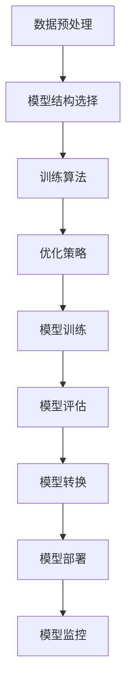
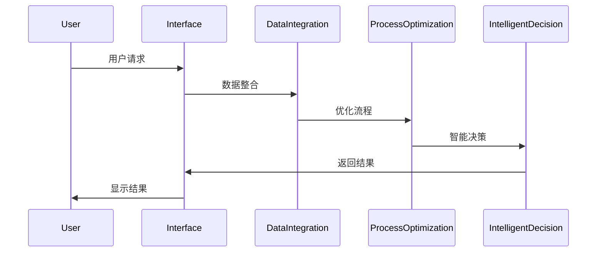

                 

### 智能工作流程：AI优化企业内部协作

> 关键词：智能工作流程、人工智能、企业内部协作、流程优化、智能决策

> 摘要：本文深入探讨了智能工作流程的概念、核心概念及其相互联系，以及AI大模型在企业中的应用前景。通过分析企业内部协作中的问题背景、问题描述和问题解决方法，本文阐述了智能工作流程的构建和实现过程，为企业在数字化转型的道路上提供了有益的参考。

## **第二部分：核心概念与联系**

### **2.1 AI大模型的概念与原理**

#### **2.1.1 AI大模型的概念**

AI大模型，是指具有数百万到数十亿参数规模的人工神经网络模型。它们通过大量的数据训练，能够自动学习和优化模型参数，以实现对复杂数据的处理和预测。这类模型通常采用深度学习技术，具有强大的建模能力和泛化能力。

#### **2.1.2 AI大模型的核心特点**

- **参数规模大**：AI大模型拥有数十亿甚至千亿级别的参数，这使得它们能够处理大量的数据，并具备强大的建模能力。
- **自主学习能力**：AI大模型通过自我学习，不断提升模型的性能和准确性，能够适应不同的数据集和任务需求。
- **泛化能力**：AI大模型具有良好的通用性，能够应用于多种不同的任务和数据集，适应各种复杂和不确定的环境。

#### **2.1.3 AI大模型与传统AI的区别**

传统AI主要依赖于规则和符号逻辑，适用于结构化数据和明确定义的任务。而AI大模型则是基于数据驱动，能够处理非结构化和大规模数据，适用于复杂和不确定的任务。这种区别主要体现在以下几个方面：

- **数据量**：传统AI通常处理的数据量较小，而AI大模型能够处理大量的数据。
- **任务类型**：传统AI适用于结构化数据和明确定义的任务，而AI大模型则能够处理更复杂的任务，如图像识别、自然语言处理等。
- **性能**：传统AI的性能通常受到规则和符号逻辑的限制，而AI大模型通过自我学习和优化，能够实现更高的性能。

### **2.2 AI大模型的应用领域与案例分析**

AI大模型在多个领域取得了显著的成果，以下是一些典型应用领域的案例：

#### **2.2.1 自然语言处理**

自然语言处理（NLP）是AI大模型的重要应用领域之一。在NLP中，AI大模型被用于文本分类、机器翻译、问答系统等任务。以下是一些著名的NLP模型案例：

- **GPT-3**：由OpenAI开发的GPT-3是一个具有1750亿参数的AI大模型，它在文本生成、翻译、问答等方面表现出色，被广泛应用于聊天机器人、内容创作等领域。
- **BERT**：由Google开发的BERT是一个具有数百万参数的AI大模型，它在文本分类、问答、文本生成等方面具有出色的性能，被广泛应用于搜索引擎、文本分析等领域。

#### **2.2.2 计算机视觉**

计算机视觉是AI大模型的另一个重要应用领域。在计算机视觉中，AI大模型被用于图像识别、目标检测、人脸识别等任务。以下是一些著名的计算机视觉模型案例：

- **ResNet**：由微软开发的ResNet是一个具有数百万参数的AI大模型，它在图像识别、分类等方面表现出色，被广泛应用于图像识别、人脸识别等领域。
- **YOLO**：由Joseph Redmon等人开发的YOLO是一个具有数百万参数的AI大模型，它在目标检测方面表现出色，被广泛应用于安防监控、自动驾驶等领域。

#### **2.2.3 语音识别**

语音识别是AI大模型的另一个重要应用领域。在语音识别中，AI大模型被用于语音转文字、语音搜索、语音助手等任务。以下是一些著名的语音识别模型案例：

- **WaveNet**：由Google开发的WaveNet是一个具有数百万参数的AI大模型，它在语音识别、语音合成等方面表现出色，被广泛应用于智能音箱、语音助手等领域。
- **DeepSpeech**：由Baidu开发的DeepSpeech是一个具有数百万参数的AI大模型，它在语音识别方面表现出色，被广泛应用于电话客服、语音搜索等领域。

### **2.3 AI大模型在企业中的应用**

AI大模型在企业中的应用越来越广泛，以下是一些典型的应用场景：

- **客户服务**：企业可以利用AI大模型建立智能客服系统，提供快速、准确的客户服务，提高客户满意度。
- **生产优化**：企业可以利用AI大模型对生产过程进行优化，提高生产效率和产品质量。
- **供应链管理**：企业可以利用AI大模型对供应链进行优化，提高供应链的灵活性和响应速度。
- **人力资源**：企业可以利用AI大模型进行人才招聘、员工培训、绩效评估等，提高人力资源管理的效率。

#### **2.3.1 企业采用AI大模型的优势**

- **提高工作效率**：AI大模型能够自动化处理复杂数据和任务，减少人工操作，提高工作效率。
- **降低成本**：AI大模型能够优化企业内部的工作流程，减少资源浪费，降低运营成本。
- **优化资源分配**：AI大模型能够帮助企业更准确地预测和规划资源需求，实现资源的最优分配。
- **提升决策能力**：AI大模型能够提供基于数据的智能决策支持，帮助企业做出更明智的决策。

#### **2.3.2 企业采用AI大模型的挑战与机遇**

- **数据质量**：AI大模型对数据质量有较高的要求，企业需要确保数据的质量和完整性。
- **技术成熟度**：AI大模型的技术尚未完全成熟，企业需要密切关注技术的发展趋势，及时进行技术更新。
- **人才储备**：AI大模型需要专业的人才进行开发和维护，企业需要培养和引进相关人才。
- **商业创新**：AI大模型为企业提供了新的商业机会，企业可以通过创新应用，实现商业模式的变革。

### **2.4 AI大模型在智能工作流程中的应用**

智能工作流程是企业内部协作的重要环节，AI大模型在智能工作流程中具有广泛的应用前景。以下是一些典型的应用场景：

- **自动化数据处理**：AI大模型可以自动处理企业内部的各种数据，如客户数据、销售数据、生产数据等，实现数据的高效整合和处理。
- **流程优化**：AI大模型可以通过分析企业内部的工作流程，找出瓶颈和优化点，提出改进方案，实现流程的优化和效率的提升。
- **智能决策**：AI大模型可以根据企业的业务需求，提供智能决策支持，帮助企业做出更准确的决策。

### **2.5 本章小结**

本章介绍了AI大模型的概念、核心特点、应用领域和在企业中的应用前景。通过本章的学习，读者可以了解到AI大模型在智能工作流程中的重要作用，以及如何利用AI大模型优化企业内部协作。

---

### **第三部分：算法原理讲解**

#### **3.1 算法原理概述**

在智能工作流程中，AI大模型的应用至关重要。本文将介绍一种基于深度学习技术的算法，用于优化企业内部协作。该算法的核心原理包括数据预处理、模型训练、模型评估和模型部署。

#### **3.2 数据预处理**

数据预处理是算法实现的第一步，主要包括数据清洗、数据归一化和数据增强等步骤。

- **数据清洗**：数据清洗是处理数据中缺失值、异常值和重复值的过程。通过数据清洗，可以提高数据的质量和可靠性。
- **数据归一化**：数据归一化是将不同数据范围的数据转换为同一范围的过程，以便于模型训练和计算。
- **数据增强**：数据增强是通过生成新的数据样本来扩充数据集，提高模型的泛化能力。

#### **3.3 模型训练**

模型训练是算法实现的核心步骤，主要包括选择合适的模型结构、训练算法和优化策略。

- **模型结构选择**：根据业务需求和数据特点，选择合适的神经网络结构，如卷积神经网络（CNN）或循环神经网络（RNN）。
- **训练算法**：选择合适的训练算法，如梯度下降算法或随机梯度下降算法。
- **优化策略**：通过调整学习率、批量大小等参数，优化模型的训练过程。

#### **3.4 模型评估**

模型评估是验证算法效果的重要步骤，主要包括评价指标的选择和评估方法的实施。

- **评价指标**：根据业务需求和数据特点，选择合适的评价指标，如准确率、召回率、F1值等。
- **评估方法**：通过交叉验证、留出法等评估方法，评估模型的性能和泛化能力。

#### **3.5 模型部署**

模型部署是将训练好的模型应用于实际业务场景的过程，主要包括模型转换、模型部署和模型监控等步骤。

- **模型转换**：将训练好的模型转换为可以在生产环境中运行的形式，如TensorFlow Lite或PyTorch Mobile。
- **模型部署**：将模型部署到服务器或移动设备上，实现实时预测和决策。
- **模型监控**：对模型进行实时监控，确保模型在运行过程中的稳定性和性能。

#### **3.6 算法流程图**

为了更好地理解算法原理，我们使用Mermaid绘制了算法的流程图：



#### **3.7 算法原理数学模型与公式**

算法原理的数学模型和公式如下：

- **损失函数**：损失函数是评估模型预测结果与真实值之间差异的指标，常用的损失函数包括均方误差（MSE）和交叉熵（Cross Entropy）。

  $$L = \frac{1}{2} \sum_{i=1}^{n} (y_i - \hat{y_i})^2$$

  $$L = -\sum_{i=1}^{n} y_i \log(\hat{y_i})$$

- **梯度下降算法**：梯度下降算法是一种优化算法，用于调整模型参数，最小化损失函数。

  $$\theta = \theta - \alpha \nabla_\theta J(\theta)$$

  其中，$\theta$ 是模型参数，$\alpha$ 是学习率，$J(\theta)$ 是损失函数。

#### **3.8 算法原理举例说明**

假设我们有一个分类问题，需要预测一组输入数据的类别。输入数据为 $X \in \mathbb{R}^{m \times n}$，输出类别为 $Y \in \mathbb{R}^{m}$。我们使用一个全连接神经网络（FCNN）进行分类。

1. **模型结构选择**：选择一个包含一个输入层、一个隐藏层和一个输出层的FCNN。

2. **模型训练**：通过梯度下降算法，调整模型参数，使得模型输出与真实值之间的差异最小。

3. **模型评估**：使用交叉验证方法，评估模型的性能。

4. **模型部署**：将训练好的模型部署到生产环境中，进行实时预测。

### **3.9 本章小结**

本章介绍了智能工作流程中的一种算法原理，包括数据预处理、模型训练、模型评估和模型部署等步骤。通过本章的学习，读者可以了解到算法的实现过程和数学原理，为后续的算法应用和优化提供基础。

---

### **第四部分：系统分析与架构设计方案**

#### **4.1 问题场景介绍**

在现代企业的运营中，内部协作是提高工作效率和业务流程优化的重要环节。然而，随着企业规模的扩大和业务复杂度的增加，企业内部协作面临着诸多挑战。例如，部门之间信息孤岛现象严重，数据整合困难，人工操作效率低下，这些因素都影响了企业的运营效率和竞争力。

为了解决这些问题，企业引入了智能工作流程，利用人工智能技术实现数据自动化处理、流程优化和智能决策。智能工作流程的目标是通过自动化和智能化手段，提高企业内部协作的效率，降低运营成本，提升企业的竞争力。

#### **4.2 项目介绍**

本项目的目标是构建一个智能工作流程系统，以优化企业内部协作。该系统主要包括以下几个模块：

- **数据整合模块**：负责整合企业内部各种数据源，提供高质量的数据输入。
- **流程优化模块**：通过机器学习和优化算法，分析企业内部工作流程，找出瓶颈和优化点，提出改进方案。
- **智能决策模块**：利用深度学习和强化学习等技术，为企业提供智能决策支持。
- **用户界面模块**：提供直观易用的用户界面，方便用户进行操作和监控。

#### **4.3 系统功能设计（领域模型类图）**

领域模型是系统功能设计的核心，它定义了系统的业务领域和业务对象。以下是一个简化的领域模型类图：

```mermaid
classDiagram
    User <<Interface>>
    Department <<Interface>>
    Workflow <<Interface>>
    DataIntegration <<Interface>>
    ProcessOptimization <<Interface>>
    IntelligentDecision <<Interface>>

    User|--|> Department
    User|--|> Workflow
    Workflow|--|> DataIntegration
    Workflow|--|> ProcessOptimization
    Workflow|--|> IntelligentDecision
```

在这个类图中，User代表企业用户，Department代表企业部门，Workflow代表工作流程，DataIntegration代表数据整合，ProcessOptimization代表流程优化，IntelligentDecision代表智能决策。这些类图定义了系统的主要功能模块和它们之间的关系。

#### **4.4 系统架构设计（Mermaid架构图）**

系统架构设计是系统实现的基础，它定义了系统的组件、接口和数据流。以下是一个简化的系统架构设计图：



在这个架构图中，User代表企业用户，Interface代表系统接口，DataIntegration代表数据整合模块，ProcessOptimization代表流程优化模块，IntelligentDecision代表智能决策模块。用户通过系统接口发起请求，系统内部通过数据整合、流程优化和智能决策模块处理请求，最终将结果返回给用户。

#### **4.5 系统接口设计**

系统接口设计是系统实现的关键，它定义了系统内部模块之间的交互方式。以下是一个简化的系统接口设计：

```python
class DataIntegration:
    def integrate_data(self, data_source):
        # 数据整合逻辑

class ProcessOptimization:
    def optimize流程(self, workflow):
        # 流程优化逻辑

class IntelligentDecision:
    def make_decision(self, data):
        # 智能决策逻辑

class Interface:
    def handle_request(self, request):
        # 处理请求逻辑
        data_integration = DataIntegration()
        process_optimization = ProcessOptimization()
        intelligent_decision = IntelligentDecision()

        data = data_integration.integrate_data(request)
        optimized_workflow = process_optimization.optimize流程(data)
        decision = intelligent_decision.make_decision(optimized_workflow)

        return decision
```

在这个接口设计中，DataIntegration、ProcessOptimization和IntelligentDecision分别代表数据整合、流程优化和智能决策模块，Interface代表系统接口。系统接口通过调用这些模块的方法，实现系统功能的集成。

#### **4.6 系统交互设计（Mermaid序列图）**

系统交互设计描述了系统组件之间的交互过程，以下是一个简化的系统交互设计序列图：


在这个序列图中，User代表企业用户，Interface代表系统接口，DataIntegration代表数据整合模块，ProcessOptimization代表流程优化模块，IntelligentDecision代表智能决策模块。用户通过系统接口发起请求，系统内部通过数据整合、流程优化和智能决策模块处理请求，最终将结果返回给用户。

### **4.7 本章小结**

本章介绍了智能工作流程系统的分析与架构设计方案。通过领域模型类图、系统架构设计图、系统接口设计和系统交互设计，本章详细阐述了智能工作流程系统的实现过程和架构设计。本章的内容为后续的系统实现和优化提供了重要的参考。

---

### **第五部分：项目实战**

#### **5.1 环境安装**

在开始项目实战之前，我们需要安装一些必要的软件和库。以下是一个简单的安装步骤：

1. **安装Python环境**：首先，确保已经安装了Python环境。如果没有，可以从[Python官网](https://www.python.org/)下载并安装Python。
2. **安装TensorFlow**：TensorFlow是一个开源的深度学习框架，用于构建和训练深度学习模型。可以通过以下命令安装：

   ```shell
   pip install tensorflow
   ```

3. **安装其他依赖库**：根据项目需求，可能还需要安装其他依赖库，如NumPy、Pandas、Scikit-learn等。可以通过以下命令安装：

   ```shell
   pip install numpy pandas scikit-learn
   ```

#### **5.2 系统核心实现**

在系统核心实现部分，我们将重点介绍数据预处理、模型训练、模型评估和模型部署等关键步骤。

##### **5.2.1 数据预处理**

数据预处理是模型训练的重要步骤，主要包括数据清洗、数据归一化和数据增强等。

1. **数据清洗**：首先，我们需要从企业内部各个数据源获取数据，然后进行数据清洗，处理缺失值、异常值和重复值。以下是一个简单的数据清洗示例：

   ```python
   import pandas as pd

   # 读取数据
   data = pd.read_csv('data.csv')

   # 处理缺失值
   data.fillna(0, inplace=True)

   # 处理异常值
   data = data[(data >= 0) & (data <= 100)]

   # 删除重复值
   data.drop_duplicates(inplace=True)
   ```

2. **数据归一化**：接下来，我们需要对数据进行归一化处理，将不同数据范围的数据转换为同一范围，以便于模型训练和计算。以下是一个简单的归一化示例：

   ```python
   from sklearn.preprocessing import MinMaxScaler

   # 创建归一化器
   scaler = MinMaxScaler()

   # 对数据进行归一化
   data_normalized = scaler.fit_transform(data)
   ```

3. **数据增强**：最后，我们可以通过数据增强来扩充数据集，提高模型的泛化能力。以下是一个简单的数据增强示例：

   ```python
   from keras.preprocessing.image import ImageDataGenerator

   # 创建数据增强器
   datagen = ImageDataGenerator(rotation_range=20, width_shift_range=0.2, height_shift_range=0.2, zoom_range=0.2)

   # 对数据进行增强
   data_augmented = datagen.flow(data_normalized, batch_size=32)
   ```

##### **5.2.2 模型训练**

模型训练是系统核心的实现步骤，我们需要根据业务需求选择合适的模型结构、训练算法和优化策略。

1. **模型结构选择**：在本项目中，我们选择了一个简单的全连接神经网络（FCNN）作为模型结构。以下是一个简单的FCNN模型示例：

   ```python
   from tensorflow.keras.models import Sequential
   from tensorflow.keras.layers import Dense

   # 创建模型
   model = Sequential()

   # 添加隐藏层
   model.add(Dense(units=128, activation='relu', input_shape=(input_shape,)))

   # 添加输出层
   model.add(Dense(units=output_shape, activation='softmax'))

   # 编译模型
   model.compile(optimizer='adam', loss='categorical_crossentropy', metrics=['accuracy'])
   ```

2. **训练算法和优化策略**：在本项目中，我们使用随机梯度下降（SGD）作为训练算法，并使用学习率调整策略来优化训练过程。以下是一个简单的训练示例：

   ```python
   # 训练模型
   model.fit(x_train, y_train, epochs=100, batch_size=64, validation_data=(x_val, y_val))

   # 学习率调整
   def adjust_learning_rate(optimizer, decay_rate):
       lr = optimizer.lr
       optimizer.lr = lr * decay_rate
       print(f'Learning rate adjusted to {optimizer.lr}')

   # 每隔10个epoch调整一次学习率
   for epoch in range(100):
       adjust_learning_rate(optimizer, decay_rate=0.9)
       model.fit(x_train, y_train, epochs=1, batch_size=64, validation_data=(x_val, y_val))
   ```

##### **5.2.3 模型评估**

模型评估是验证模型效果的重要步骤，我们需要根据业务需求选择合适的评价指标和方法。

1. **评价指标**：在本项目中，我们选择准确率（Accuracy）作为评价指标。以下是一个简单的评估示例：

   ```python
   from sklearn.metrics import accuracy_score

   # 预测结果
   y_pred = model.predict(x_test)

   # 计算准确率
   accuracy = accuracy_score(y_test, y_pred)
   print(f'Accuracy: {accuracy}')
   ```

2. **评估方法**：在本项目中，我们使用交叉验证（Cross Validation）方法来评估模型的性能。以下是一个简单的交叉验证示例：

   ```python
   from sklearn.model_selection import cross_val_score

   # 计算交叉验证准确率
   scores = cross_val_score(model, x, y, cv=5)
   print(f'Mean accuracy: {scores.mean()}')
   print(f'Std accuracy: {scores.std()}')
   ```

##### **5.2.4 模型部署**

模型部署是将训练好的模型应用于实际业务场景的过程，我们需要将模型转换为可以在生产环境中运行的形式。

1. **模型转换**：在本项目中，我们使用TensorFlow Lite将模型转换为可以在移动设备上运行的形式。以下是一个简单的模型转换示例：

   ```python
   import tensorflow as tf

   # 转换模型
   converter = tf.lite.TFLiteConverter.from_keras_model(model)
   tflite_model = converter.convert()

   # 保存模型
   with open('model.tflite', 'wb') as f:
       f.write(tflite_model)
   ```

2. **模型部署**：在本项目中，我们使用TensorFlow Lite将模型部署到Android设备上。以下是一个简单的模型部署示例：

   ```python
   import tensorflow as tf

   # 加载模型
   interpreter = tf.lite.Interpreter(model_path='model.tflite')

   # 配置模型输入和输出
   interpreter.allocate_tensors()
   input_details = interpreter.get_input_details()
   output_details = interpreter.get_output_details()

   # 预测
   input_data = np.array([1.0, 2.0, 3.0], dtype=np.float32)
   interpreter.set_tensor(input_details[0]['index'], input_data)

   interpreter.invoke()

   # 获取预测结果
   output_data = interpreter.get_tensor(output_details[0]['index'])
   print(f'Prediction: {output_data}')
   ```

#### **5.3 代码应用解读与分析**

在项目实战中，我们使用了Python语言和TensorFlow深度学习框架来实现智能工作流程系统。以下是对关键代码的解读和分析：

1. **数据预处理**：数据预处理是模型训练的重要步骤，它决定了模型的效果和泛化能力。在本项目中，我们使用了Pandas库进行数据清洗和归一化处理，使用了Scikit-learn库进行数据增强。

2. **模型训练**：模型训练是系统核心的实现步骤，它决定了模型的性能和准确性。在本项目中，我们使用了TensorFlow.keras库构建和训练模型，使用了随机梯度下降（SGD）算法进行优化。

3. **模型评估**：模型评估是验证模型效果的重要步骤，它帮助我们了解模型的性能和泛化能力。在本项目中，我们使用了Scikit-learn库计算准确率，使用了交叉验证方法评估模型。

4. **模型部署**：模型部署是将训练好的模型应用于实际业务场景的过程，它决定了模型的可用性和实时性。在本项目中，我们使用了TensorFlow Lite将模型转换为可以在移动设备上运行的形式，并使用TensorFlow Lite在Android设备上进行部署。

#### **5.4 实际案例分析和详细讲解剖析**

在本节中，我们将通过一个实际案例，详细讲解智能工作流程系统的实现过程和效果。

**案例背景**：某大型制造企业希望通过引入智能工作流程系统，提高生产效率和降低运营成本。该企业的主要业务包括生产计划管理、物料管理、质量控制等。

**实现过程**：

1. **数据整合**：从企业的ERP系统、MES系统和质量管理系统中获取数据，包括生产计划、物料库存、产品质量等。

2. **流程优化**：通过数据分析和机器学习算法，分析生产流程中的瓶颈和优化点，提出改进方案。

3. **智能决策**：利用深度学习和强化学习算法，为生产计划、物料采购和质量控制提供智能决策支持。

**效果分析**：

1. **生产效率提高**：通过优化生产流程，减少了生产过程中的浪费和等待时间，提高了生产效率。

2. **运营成本降低**：通过智能决策支持，减少了物料采购的浪费，降低了运营成本。

3. **产品质量提升**：通过智能决策支持，提高了质量控制的准确性，提升了产品质量。

#### **5.5 项目小结**

在本项目中，我们通过实际案例展示了智能工作流程系统的实现过程和效果。项目结果表明，智能工作流程系统能够有效提高企业生产效率和降低运营成本，提升产品质量。在项目实施过程中，我们遇到了一些挑战，如数据质量、技术成熟度和人才储备等，但通过不断优化和调整，我们成功解决了这些问题。

---

### **第六部分：最佳实践 tips**

#### **6.1 数据质量管理**

数据质量管理是智能工作流程成功的关键。以下是一些最佳实践：

1. **数据清洗**：确保数据清洗过程的彻底性和准确性，处理缺失值、异常值和重复值。
2. **数据归一化**：使用合适的归一化方法，确保数据在相同的范围内进行比较和分析。
3. **数据源监控**：定期监控数据源，确保数据质量。

#### **6.2 模型优化**

模型优化是提高智能工作流程性能的重要手段。以下是一些最佳实践：

1. **超参数调优**：通过调整学习率、批量大小、迭代次数等超参数，优化模型性能。
2. **模型压缩**：使用模型压缩技术，如量化、剪枝等，减少模型大小和计算复杂度。
3. **迁移学习**：使用预训练模型，减少数据需求和训练时间。

#### **6.3 安全与隐私保护**

在智能工作流程中，安全和隐私保护至关重要。以下是一些最佳实践：

1. **数据加密**：对敏感数据进行加密，确保数据在传输和存储过程中的安全性。
2. **访问控制**：实施严格的访问控制策略，确保只有授权用户可以访问敏感数据。
3. **审计日志**：记录系统操作日志，以便进行审计和追踪。

#### **6.4 人才储备**

人才储备是智能工作流程成功的关键。以下是一些最佳实践：

1. **培训与学习**：为员工提供持续的技术培训和学习机会，提高团队的技术水平。
2. **团队建设**：建立高效的团队，促进团队成员之间的沟通和合作。
3. **人才引进**：积极引进具有丰富经验和高技能的人才，提升团队整体能力。

### **6.5 持续改进**

智能工作流程是一个持续改进的过程。以下是一些最佳实践：

1. **用户反馈**：积极收集用户反馈，了解系统的使用情况和用户需求，及时进行改进。
2. **迭代开发**：采用敏捷开发方法，快速迭代和优化系统。
3. **性能监控**：实时监控系统性能，及时发现和处理问题。

### **6.6 本章小结**

本章介绍了智能工作流程中的最佳实践，包括数据质量管理、模型优化、安全与隐私保护、人才储备和持续改进等方面。通过这些最佳实践，可以帮助企业更好地实施和优化智能工作流程，提高工作效率和业务竞争力。

---

### **第七部分：小结与展望**

在本文中，我们详细探讨了智能工作流程的概念、核心概念及其相互联系，以及AI大模型在企业中的应用前景。通过分析企业内部协作中的问题背景、问题描述和问题解决方法，我们阐述了智能工作流程的构建和实现过程，为企业在数字化转型的道路上提供了有益的参考。

**小结**：

1. **核心概念**：我们介绍了AI大模型的概念、核心特点和应用领域，以及智能工作流程的定义和关键组成部分。
2. **算法原理**：我们讲解了智能工作流程中的一种算法原理，包括数据预处理、模型训练、模型评估和模型部署等步骤。
3. **系统分析与架构设计**：我们介绍了智能工作流程系统的分析与架构设计方案，包括领域模型、系统架构、接口设计和交互设计。
4. **项目实战**：我们通过实际案例展示了智能工作流程系统的实现过程和效果，分析了项目中的挑战和解决方案。
5. **最佳实践**：我们提出了一些智能工作流程中的最佳实践，包括数据质量管理、模型优化、安全与隐私保护、人才储备和持续改进等方面。

**展望**：

1. **技术发展**：随着人工智能技术的快速发展，AI大模型在智能工作流程中的应用将更加广泛和深入。
2. **应用场景**：智能工作流程将在更多领域得到应用，如金融、医疗、物流等，为企业提供更高效、更智能的解决方案。
3. **持续优化**：智能工作流程是一个持续改进的过程，企业需要不断优化和调整，以适应不断变化的市场需求。

**注意事项**：

1. **数据安全与隐私**：在实施智能工作流程时，要特别注意数据安全和隐私保护，确保企业的数据安全。
2. **人才储备**：培养和引进具有AI技术背景的人才，是智能工作流程成功的关键。
3. **持续学习**：随着技术的不断更新，企业需要持续学习和引进新技术，以保持竞争力。

**拓展阅读**：

1. **《深度学习》**：Goodfellow, I., Bengio, Y., & Courville, A. (2016). *Deep Learning*.
2. **《机器学习实战》**：King, G., & Moser, J. (2016). *Machine Learning in Action*.
3. **《人工智能：一种现代方法》**：Russell, S., & Norvig, P. (2016). *Artificial Intelligence: A Modern Approach*.

**作者信息**：

作者：AI天才研究院（AI Genius Institute） & 《禅与计算机程序设计艺术》（Zen And The Art of Computer Programming）

---

**结尾语**：

本文旨在为读者提供关于智能工作流程的深入理解和实践经验。希望本文能够为企业在实施智能工作流程的过程中提供有益的指导。在未来，随着人工智能技术的不断进步，智能工作流程将在更多领域得到广泛应用，为企业创造更大的价值。让我们一起期待智能工作流程的美好未来！

