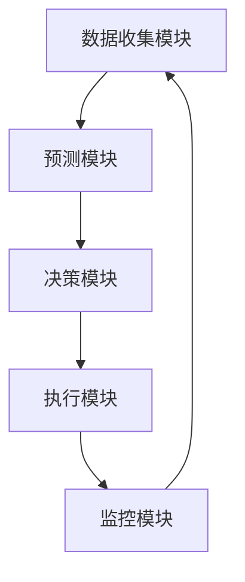
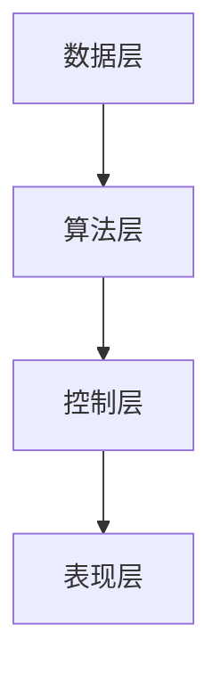

                 

### 文章标题

# 智能工作负载均衡：AI优化资源分配

### 关键词

- 智能工作负载均衡
- AI优化资源分配
- 资源分配模型
- 深度学习
- 强化学习
- 系统实现

### 摘要

本文深入探讨了智能工作负载均衡领域，重点介绍了AI在资源分配中的应用。首先，文章回顾了智能工作负载均衡的背景和基础理论，接着详细阐述了AI与资源分配的关系，以及AI在资源分配中的优势与挑战。随后，文章重点介绍了基于机器学习、深度学习和强化学习三种AI优化方法，并使用Python源代码和LaTeX数学公式进行了详细讲解。此外，文章还讨论了智能工作负载均衡系统的设计与实现，并通过实际案例分析了系统效果。最后，文章展望了智能工作负载均衡的发展趋势，为读者提供了宝贵的实践经验和未来研究方向。

## 目录大纲

下面是根据用户需求设计的《智能工作负载均衡：AI优化资源分配》这本书的目录大纲：

### 第一部分：背景与基础理论

#### 第1章：智能工作负载均衡概述

- **1.1.1 问题背景与定义**
- **1.1.2 工作负载均衡的重要性**
- **1.1.3 传统工作负载均衡方法**

#### 第2章：AI在资源分配中的应用

- **2.1.1 AI与资源分配的关系**
- **2.1.2 主流AI技术简介**
- **2.1.3 AI在资源分配中的优势与挑战**

#### 第3章：工作负载均衡的核心概念

- **3.1.1 资源分配的基本概念**
- **3.1.2 工作负载均衡的目标**
- **3.1.3 工作负载均衡的算法与策略**

### 第二部分：AI优化方法

#### 第4章：基于机器学习的资源分配模型

- **4.1.1 机器学习基础知识**
- **4.1.2 基于机器学习的资源分配模型**
- **4.1.3 机器学习模型在实际应用中的案例**

#### 第5章：深度学习在资源分配中的应用

- **5.1.1 深度学习基本原理**
- **5.1.2 深度学习模型在资源分配中的应用**
- **5.1.3 深度学习模型的调优与优化**

#### 第6章：强化学习在资源分配中的应用

- **6.1.1 强化学习基本原理**
- **6.1.2 强化学习模型在资源分配中的应用**
- **6.1.3 强化学习在实际应用中的挑战与解决方案**

### 第三部分：智能工作负载均衡系统实现

#### 第7章：智能工作负载均衡系统设计

- **7.1.1 系统总体设计**
- **7.1.2 系统功能模块划分**
- **7.1.3 系统架构设计**

#### 第8章：系统实现与优化

- **8.1.1 系统环境搭建**
- **8.1.2 核心算法实现**
- **8.1.3 系统优化策略**

#### 第9章：实际案例分析

- **9.1.1 案例背景**
- **9.1.2 案例实现与效果分析**
- **9.1.3 案例总结与启示**

### 第十部分：展望与未来趋势

#### 第10章：智能工作负载均衡的发展趋势

- **10.1.1 当前发展趋势**
- **10.1.2 未来研究方向**
- **10.1.3 对行业的影响**

---

### 概述

#### 1.1.1 问题背景与定义

在现代信息技术领域，随着云计算、大数据和物联网等技术的迅猛发展，系统架构的复杂性和数据处理能力的要求越来越高。在这种情况下，如何有效地分配和利用有限的计算资源成为了一个关键问题。工作负载均衡（Workload Balancing）作为系统性能优化的重要手段，旨在通过合理分配计算任务，确保系统的高可用性和高性能。

传统的工作负载均衡方法主要依赖于静态配置和预定义策略，其效果往往受到资源利用率、系统负载变化等因素的制约。随着人工智能（AI）技术的进步，智能工作负载均衡逐渐成为研究热点。智能工作负载均衡利用AI技术，根据实际系统运行状态和负载情况，动态调整资源分配策略，从而提高系统资源利用率、降低成本、提升用户体验。

#### 1.1.2 工作负载均衡的重要性

工作负载均衡在系统架构中扮演着至关重要的角色。其主要重要性体现在以下几个方面：

1. **提高系统性能**：通过合理分配计算任务，可以避免单个资源过度负载，确保系统整体性能。
2. **提高资源利用率**：智能工作负载均衡可以根据实际需求动态调整资源分配，最大化利用现有资源。
3. **降低成本**：通过优化资源分配，企业可以减少硬件投入和运营成本。
4. **提高系统稳定性**：在负载高峰期，智能工作负载均衡可以确保系统稳定运行，避免因资源不足导致的服务中断。
5. **提升用户体验**：智能工作负载均衡可以确保用户请求得到及时响应，提升整体用户体验。

#### 1.1.3 传统工作负载均衡方法

传统的工作负载均衡方法主要包括以下几种：

1. **轮询法**：将请求依次分配到不同的服务器上，实现负载平均。
2. **最小连接数法**：将新的请求分配到连接数最少的服务器上，以平衡各服务器的负载。
3. **最小响应时间法**：将请求分配到响应时间最短的服务器上，以优化用户请求的响应速度。
4. **动态权重法**：根据服务器当前的状态（如CPU利用率、内存占用等）动态调整服务器的权重，从而实现更精细的负载均衡。

尽管传统工作负载均衡方法在一定程度上能够缓解系统压力，但它们在面对复杂应用场景时，往往难以满足实际需求。智能工作负载均衡的出现，为解决这些问题提供了新的思路。

## AI在资源分配中的应用

#### 2.1.1 AI与资源分配的关系

AI（人工智能）与资源分配的结合，为智能工作负载均衡带来了全新的解决方案。AI技术通过对海量数据的分析和学习，能够识别系统运行状态、预测负载趋势，从而制定出最优的资源分配策略。具体来说，AI在资源分配中的应用主要体现在以下几个方面：

1. **数据驱动决策**：AI可以通过对系统运行数据的分析，识别出资源利用的趋势和瓶颈，从而动态调整资源分配策略。
2. **模式识别**：AI技术能够从历史数据中提取出有效的模式，预测未来的负载情况，为资源分配提供依据。
3. **自动化优化**：AI技术能够自动化地调整资源分配策略，降低人为干预的需求，提高资源分配的效率。
4. **多目标优化**：AI可以通过多目标优化算法，同时考虑多个优化目标（如成本、性能、稳定性等），实现更全面的最优化。

#### 2.1.2 主流AI技术简介

在资源分配领域，AI技术主要包括机器学习、深度学习和强化学习三种主流方法。以下是对这三种方法的简要介绍：

1. **机器学习**：机器学习是一种通过算法从数据中自动学习规律和模式的技术。在资源分配中，机器学习可以通过训练模型，根据历史数据预测未来负载情况，从而制定出最优的资源分配策略。

2. **深度学习**：深度学习是机器学习的一个分支，它通过构建多层神经网络，对数据进行分析和处理。在资源分配中，深度学习可以用于复杂模式的识别和预测，提高资源分配的精度和效率。

3. **强化学习**：强化学习是一种通过不断尝试和反馈来学习最优策略的算法。在资源分配中，强化学习可以通过与环境互动，逐步优化资源分配策略，实现动态调整。

#### 2.1.3 AI在资源分配中的优势与挑战

AI技术在资源分配中的应用，带来了显著的优势，同时也面临着一些挑战。

**优势**：

1. **自适应性强**：AI技术可以根据系统运行状态和负载变化，动态调整资源分配策略，提高资源利用率。
2. **预测准确性高**：通过分析海量数据，AI技术可以准确预测未来负载情况，为资源分配提供可靠依据。
3. **降低人工干预**：AI技术可以自动化地执行资源分配任务，减少人为干预，提高工作效率。
4. **优化多目标**：AI技术可以通过多目标优化算法，同时考虑多个优化目标，实现更全面的最优化。

**挑战**：

1. **数据依赖性**：AI技术对数据质量有较高要求，数据缺失或噪声会影响预测和分配效果。
2. **计算资源消耗**：AI技术通常需要大量计算资源，尤其是在处理大规模数据时，可能对系统性能产生一定影响。
3. **模型解释性**：AI模型的黑箱性质可能导致模型结果的不可解释性，影响决策的可信度。
4. **算法稳定性**：AI算法在面对异常数据或突发事件时，可能表现出不稳定性，需要不断优化和调整。

总之，AI技术在资源分配中的应用具有巨大的潜力，但同时也需要克服一系列挑战。通过不断的研究和实践，我们有望在智能工作负载均衡领域取得更大的突破。

### 工作负载均衡的核心概念

#### 3.1.1 资源分配的基本概念

资源分配是指将有限的资源（如计算能力、存储容量、网络带宽等）合理地分配给不同的任务或用户，以最大化系统性能和资源利用率。在资源分配过程中，涉及以下几个基本概念：

1. **资源**：资源是指系统可以分配的有限资源，如CPU时间、内存空间、存储容量和网络带宽等。
2. **任务**：任务是指系统需要执行的计算工作，如处理请求、处理数据、运行应用程序等。
3. **分配策略**：分配策略是指如何根据资源需求和可用资源情况，将任务合理地分配到不同资源上。常见的分配策略包括轮询法、最小连接数法、最小响应时间法和动态权重法等。

#### 3.1.2 工作负载均衡的目标

工作负载均衡的目标是通过合理分配任务和资源，实现系统的高性能、高可用性和高稳定性。具体目标包括：

1. **最大化资源利用率**：通过优化资源分配策略，确保所有资源得到充分利用，避免资源浪费。
2. **最小化响应时间**：通过优化任务分配和资源调度，确保用户请求能够得到及时响应，提升用户体验。
3. **提高系统稳定性**：通过平衡负载，避免单个资源过度负载，降低系统崩溃的风险。
4. **降低成本**：通过优化资源分配，减少硬件投入和运营成本。

#### 3.1.3 工作负载均衡的算法与策略

工作负载均衡算法和策略是实现智能工作负载均衡的核心。以下介绍几种常见的工作负载均衡算法和策略：

1. **轮询法**：轮询法是最简单的一种工作负载均衡算法，它将任务依次分配到不同的服务器上。该方法实现简单，但无法应对不同服务器性能差异较大的情况。
   
   ```mermaid
   flowchart LR
       A[轮询法] --> B[任务1]
       B --> C[任务2]
       C --> D[任务3]
       D --> A
   ```

2. **最小连接数法**：最小连接数法将新的请求分配到当前连接数最少的服务器上，以实现负载均衡。该方法能够较好地应对服务器性能差异，但可能导致某些服务器长时间处于低负载状态。

   ```mermaid
   flowchart LR
       A[最小连接数法] --> B{请求1}
       B --> C[服务器1]
       C --> D[服务器2]
       D --> A
   ```

3. **最小响应时间法**：最小响应时间法将请求分配到当前响应时间最短的服务器上，以优化用户请求的响应速度。该方法适用于对响应时间要求较高的应用场景，但可能导致某些服务器负载不均。

   ```mermaid
   flowchart LR
       A[最小响应时间法] --> B{请求1}
       B --> C[服务器1]
       C --> D[服务器2]
       D --> A
   ```

4. **动态权重法**：动态权重法根据服务器当前的状态（如CPU利用率、内存占用等）动态调整服务器的权重，从而实现更精细的负载均衡。该方法能够较好地应对服务器性能动态变化，但实现复杂度较高。

   ```mermaid
   flowchart LR
       A[动态权重法] --> B{请求1}
       B --> C{服务器1}
       C --> D{服务器2}
       D --> A
   ```

通过上述算法和策略，可以实现对工作负载的动态调整和优化，从而提高系统性能和稳定性。在智能工作负载均衡中，AI技术可以用于改进这些算法和策略，提高资源利用率和系统性能。

### 基于机器学习的资源分配模型

#### 4.1.1 机器学习基础知识

机器学习（Machine Learning，ML）是一种通过算法从数据中自动学习和提取知识的技术。它主要包括监督学习（Supervised Learning）、无监督学习（Unsupervised Learning）和强化学习（Reinforcement Learning）三种类型。

**监督学习**：监督学习是一种有标签数据训练模型的方法。通过输入特征和对应的标签，模型学习特征与标签之间的关系，从而实现对未知数据的预测。常见的监督学习算法包括线性回归（Linear Regression）、决策树（Decision Tree）、支持向量机（Support Vector Machine，SVM）和神经网络（Neural Networks）等。

**无监督学习**：无监督学习是一种没有标签数据训练模型的方法。通过分析输入特征，模型学习特征之间的关系，从而实现数据聚类、降维和异常检测等任务。常见的无监督学习算法包括K-均值聚类（K-Means Clustering）、主成分分析（Principal Component Analysis，PCA）和自编码器（Autoencoder）等。

**强化学习**：强化学习是一种通过不断尝试和反馈学习最优策略的算法。在资源分配中，强化学习可以用于动态调整资源分配策略，实现最优资源利用。常见的强化学习算法包括Q-learning、SARSA和深度确定性策略梯度（Deep Deterministic Policy Gradient，DDPG）等。

#### 4.1.2 基于机器学习的资源分配模型

基于机器学习的资源分配模型通过分析历史数据，学习资源需求和负载之间的关系，从而预测未来负载情况，为资源分配提供依据。以下是一个简单的基于机器学习的资源分配模型：

**模型输入**：模型输入包括历史负载数据（如CPU利用率、内存占用、网络带宽等）和对应的资源分配结果（如服务器负载、任务分配等）。

**模型输出**：模型输出包括预测的未来负载情况（如CPU利用率、内存占用、网络带宽等）和对应的资源分配策略（如任务分配、服务器负载调整等）。

**模型训练**：通过历史数据对模型进行训练，模型学习负载数据与资源分配策略之间的关系。训练过程中，可以使用多种算法，如线性回归、决策树和神经网络等。

**模型预测**：在训练完成后，使用模型对未来的负载情况进行预测，并生成最优的资源分配策略。模型预测结果可以根据实时数据进行更新，以实现动态调整。

**模型评估**：通过评估指标（如预测准确率、资源利用率等）对模型性能进行评估，并根据评估结果对模型进行调整和优化。

#### 4.1.3 机器学习模型在实际应用中的案例

在资源分配领域，机器学习模型已经得到了广泛应用。以下是一个实际应用的案例：

**案例背景**：某大型互联网公司拥有多个数据中心，负责处理海量的用户请求。为了确保系统的高性能和高可用性，公司希望利用机器学习技术对数据中心进行智能资源分配。

**模型构建**：公司首先收集了数据中心的历史负载数据，包括CPU利用率、内存占用、网络带宽等。接着，公司使用这些数据训练了一个基于神经网络的资源分配模型。

**模型训练**：在模型训练过程中，公司使用了多种算法，如反向传播算法（Backpropagation）和梯度下降算法（Gradient Descent），优化模型参数，提高模型预测准确率。

**模型预测与分配**：在训练完成后，公司使用模型对未来的负载情况进行预测，并生成最优的资源分配策略。具体步骤如下：

1. **收集实时数据**：公司从各个数据中心收集实时的负载数据，包括CPU利用率、内存占用、网络带宽等。
2. **模型预测**：使用训练好的模型对未来的负载情况进行预测，生成预测结果。
3. **资源分配**：根据预测结果，公司动态调整各个数据中心的资源分配策略，实现负载均衡。

**模型评估与优化**：公司使用评估指标（如预测准确率、资源利用率等）对模型性能进行评估，并根据评估结果对模型进行调整和优化。具体步骤如下：

1. **评估模型性能**：公司使用评估指标（如预测准确率、资源利用率等）对模型性能进行评估。
2. **调整模型参数**：根据评估结果，公司调整模型参数，优化模型性能。
3. **重新训练模型**：使用调整后的模型重新进行训练，提高模型预测准确率。

通过上述案例，可以看出机器学习模型在资源分配中的应用效果显著，能够有效提高系统性能和资源利用率。在未来，随着机器学习技术的不断发展，机器学习模型在资源分配中的应用将越来越广泛。

### 深度学习在资源分配中的应用

#### 5.1.1 深度学习基本原理

深度学习（Deep Learning，DL）是一种基于人工神经网络的机器学习方法，通过构建多层神经网络，对数据进行分析和处理。深度学习在资源分配中的应用，主要依赖于其强大的特征提取和模式识别能力。

**神经网络**：神经网络是深度学习的基础，它由多个神经元（节点）组成，每个神经元负责处理输入数据，并通过加权连接与其他神经元进行信息传递。神经网络可以分为输入层、隐藏层和输出层，其中隐藏层可以是多层。

**前向传播**：在前向传播过程中，输入数据从输入层经过隐藏层，最终传递到输出层。每个神经元都会对输入数据进行加权求和，并通过激活函数（如ReLU、Sigmoid和Tanh）进行非线性变换，以提取数据特征。

**反向传播**：在反向传播过程中，根据输出层的预测误差，反向传播误差到隐藏层和输入层，并通过梯度下降算法更新网络权重，以优化模型性能。

**优化算法**：深度学习的优化算法主要包括随机梯度下降（Stochastic Gradient Descent，SGD）、Adam优化器和RMSprop等。这些算法通过不断调整网络权重，使模型在训练数据上的预测误差最小化。

**深度神经网络**：深度神经网络是深度学习的核心，它通过增加网络层数和神经元数量，提高特征提取能力。常见的深度神经网络包括卷积神经网络（Convolutional Neural Networks，CNN）、循环神经网络（Recurrent Neural Networks，RNN）和变换器（Transformer）等。

#### 5.1.2 深度学习模型在资源分配中的应用

深度学习模型在资源分配中的应用，主要利用其强大的特征提取和模式识别能力，对复杂负载数据进行分析和预测，从而实现智能资源分配。

**模型构建**：构建深度学习模型的关键是设计网络结构，选择合适的激活函数和优化算法。在资源分配中，常见的网络结构包括卷积神经网络（CNN）和循环神经网络（RNN）等。

**网络结构**：

1. **卷积神经网络（CNN）**：CNN是一种适用于图像和序列数据的神经网络，通过卷积层和池化层提取特征。在资源分配中，CNN可以用于提取历史负载数据的时空特征，从而实现资源分配预测。

   ```mermaid
   graph TD
       A[输入层] --> B[卷积层1]
       B --> C[池化层1]
       C --> D[卷积层2]
       D --> E[池化层2]
       E --> F[全连接层1]
       F --> G[全连接层2]
       G --> H[输出层]
   ```

2. **循环神经网络（RNN）**：RNN是一种适用于序列数据的神经网络，通过循环结构实现前后信息传递。在资源分配中，RNN可以用于分析历史负载数据的时间序列特征，从而实现资源分配预测。

   ```mermaid
   graph TD
       A[输入层] --> B[隐藏层1]
       B --> C[隐藏层2]
       C --> D[输出层]
   ```

**模型训练**：在模型训练过程中，需要使用历史负载数据对模型进行训练，以学习数据特征和资源分配规律。训练过程中，可以使用多种优化算法，如随机梯度下降（SGD）、Adam优化器和RMSprop等，提高模型性能。

**模型预测**：在训练完成后，使用模型对未来的负载情况进行预测，并生成最优的资源分配策略。具体步骤如下：

1. **输入数据**：将实时的负载数据输入到训练好的模型中，进行特征提取和预测。
2. **预测结果**：根据模型预测结果，生成资源分配策略，实现动态调整。

**模型评估**：通过评估指标（如预测准确率、资源利用率等）对模型性能进行评估，并根据评估结果对模型进行调整和优化。

#### 5.1.3 深度学习模型的调优与优化

深度学习模型在资源分配中的应用，不仅需要选择合适的网络结构，还需要进行调优和优化，以提高模型性能和资源分配效果。

**数据预处理**：在训练深度学习模型之前，需要对数据进行预处理，包括数据清洗、归一化和特征提取等。数据预处理可以减少数据噪声，提高模型训练效果。

**网络结构设计**：网络结构设计是深度学习模型调优的关键，包括选择合适的层数、神经元数量和激活函数等。合理的网络结构可以提高模型的特征提取能力和预测准确率。

**优化算法选择**：优化算法选择是影响模型训练速度和性能的重要因素。常用的优化算法包括随机梯度下降（SGD）、Adam优化器和RMSprop等。根据实际情况选择合适的优化算法，可以显著提高模型训练效果。

**超参数调整**：超参数调整是深度学习模型调优的另一个关键步骤，包括学习率、批量大小和正则化参数等。通过调整超参数，可以优化模型训练过程，提高模型性能。

**模型评估与优化**：在模型训练完成后，需要对模型进行评估和优化。通过评估指标（如预测准确率、资源利用率等）对模型性能进行评估，并根据评估结果对模型进行调整和优化。

总之，深度学习模型在资源分配中的应用具有很大的潜力，但需要经过精细的设计和调优，才能发挥其优势。通过不断的研究和实践，我们有望在智能工作负载均衡领域取得更大的突破。

### 强化学习在资源分配中的应用

#### 6.1.1 强化学习基本原理

强化学习（Reinforcement Learning，RL）是一种通过不断尝试和反馈来学习最优策略的算法。在强化学习中，智能体（Agent）通过与环境的交互，不断调整行为策略，以最大化累积奖励。

**强化学习的基本概念**：

- **智能体（Agent）**：智能体是执行决策的主体，它在环境中采取行动，并接收环境反馈。
- **环境（Environment）**：环境是智能体执行行动的场所，它根据智能体的行动产生状态转移和奖励。
- **状态（State）**：状态是描述智能体当前环境的特征集合，状态空间表示所有可能的状态集合。
- **行动（Action）**：行动是智能体在某个状态下可执行的操作，行动空间表示所有可能的行动集合。
- **奖励（Reward）**：奖励是环境对智能体行动的反馈，用于评价智能体行动的好坏。

**强化学习的主要过程**：

1. **探索与利用**：在强化学习中，智能体需要在探索（Exploration）和利用（Utilization）之间进行权衡。探索是指智能体尝试新的行动，以获取更多的信息；利用是指智能体根据已有的信息选择最佳行动。
2. **策略学习**：智能体通过学习策略（Policy），将状态映射到最佳行动。策略可以是确定性策略（Deterministic Policy）或随机性策略（Stochastic Policy）。
3. **值函数学习**：值函数（Value Function）用于评价状态或状态-行动对的预期奖励。通过学习值函数，智能体可以更好地选择最佳行动。
4. **模型学习**：在有些强化学习问题中，智能体需要学习环境模型，以便更好地预测未来的状态转移和奖励。

**强化学习的主要算法**：

- **Q学习（Q-Learning）**：Q学习是一种基于值函数的强化学习算法，通过更新Q值（状态-行动值函数）来学习最优策略。
- **SARSA（State-Action-Reward-State-Action）**：SARSA是一种基于策略的强化学习算法，通过更新状态-行动对来学习最优策略。
- **深度确定性策略梯度（DDPG，Deep Deterministic Policy Gradient）**：DDPG是一种基于深度学习的强化学习算法，通过学习深度神经网络来近似值函数和策略。

#### 6.1.2 强化学习模型在资源分配中的应用

强化学习模型在资源分配中的应用，主要是通过学习最优资源分配策略，实现动态资源调整。以下是一个简单的强化学习资源分配模型：

**模型构建**：

1. **状态空间**：状态空间包括系统当前资源使用情况、任务队列长度、任务优先级等。
2. **行动空间**：行动空间包括调整资源分配策略（如增加或减少服务器负载、调整任务优先级等）。

**模型训练**：

1. **初始化**：初始化智能体和环境的参数。
2. **探索与利用**：智能体在初始阶段进行探索，以获取更多信息；随着训练的进行，逐渐利用已有信息进行决策。
3. **策略学习**：智能体通过更新策略，将状态映射到最佳行动。
4. **值函数学习**：智能体通过更新值函数，评价状态或状态-行动对的预期奖励。

**模型预测与分配**：

1. **状态输入**：将系统当前状态输入到训练好的模型中。
2. **行动预测**：根据模型预测结果，生成最佳资源分配策略。
3. **资源调整**：根据行动预测结果，动态调整系统资源分配。

**模型评估**：

1. **奖励设置**：根据系统性能指标（如资源利用率、任务响应时间等）设置奖励。
2. **策略评估**：通过评估指标（如累积奖励、平均奖励等）对策略进行评估。

#### 6.1.3 强化学习在实际应用中的挑战与解决方案

强化学习在资源分配中的应用虽然具有潜力，但也面临一些挑战。

**挑战**：

1. **数据依赖性**：强化学习对数据质量有较高要求，数据缺失或噪声会影响模型性能。
2. **计算资源消耗**：强化学习通常需要大量计算资源，特别是在处理大规模数据时，计算复杂度较高。
3. **模型稳定性**：在处理异常数据或突发事件时，强化学习模型可能表现出不稳定性，需要不断优化和调整。
4. **模型解释性**：强化学习模型通常具有黑箱性质，模型结果难以解释，影响决策的可信度。

**解决方案**：

1. **数据增强**：通过数据增强技术，如数据扩充、数据清洗和生成对抗网络（GAN）等，提高数据质量，降低数据依赖性。
2. **优化算法**：使用高效的优化算法，如深度确定性策略梯度（DDPG）、演员-评论家算法（AC）等，降低计算资源消耗，提高模型稳定性。
3. **模型解释性**：通过模型可视化、特征重要性分析和解释性模型等手段，提高模型的可解释性，增强决策可信度。
4. **混合方法**：结合传统方法和强化学习方法，如基于规则的资源分配策略与强化学习相结合，发挥各自优势，提高资源分配效果。

总之，强化学习在资源分配中的应用具有潜力，但也需要克服一系列挑战。通过不断的研究和实践，我们有望在智能工作负载均衡领域取得更大的突破。

### 智能工作负载均衡系统设计

#### 7.1.1 系统总体设计

智能工作负载均衡系统的总体设计主要包括以下几个关键模块：

1. **数据收集模块**：该模块负责收集系统运行状态、负载情况、资源使用等信息，为资源分配提供数据支持。
2. **预测模块**：该模块利用机器学习、深度学习和强化学习等技术，对未来的负载情况进行预测，为资源分配策略提供依据。
3. **决策模块**：该模块根据预测结果和系统状态，生成最优的资源分配策略，并控制系统的资源分配过程。
4. **执行模块**：该模块负责执行决策模块生成的资源分配策略，实现实际资源调整和任务调度。
5. **监控模块**：该模块负责实时监控系统性能和资源使用情况，为系统优化和故障处理提供数据支持。

系统总体设计如下图所示：



#### 7.1.2 系统功能模块划分

智能工作负载均衡系统的功能模块划分如下：

1. **数据收集模块**：
   - **数据源采集**：从各个资源节点（如服务器、网络设备等）收集运行状态和负载数据。
   - **数据清洗与预处理**：对收集到的数据进行清洗和预处理，包括数据去重、缺失值处理、归一化等。

2. **预测模块**：
   - **特征提取**：根据历史数据，提取与负载预测相关的特征，如CPU利用率、内存占用、网络带宽等。
   - **模型训练与预测**：使用机器学习、深度学习和强化学习等技术，训练预测模型，并对未来的负载情况进行预测。

3. **决策模块**：
   - **策略生成**：根据预测结果和系统状态，生成最优的资源分配策略，如任务调度、服务器负载调整等。
   - **策略优化**：对生成的策略进行优化，以最大化系统性能和资源利用率。

4. **执行模块**：
   - **资源调整**：根据决策模块生成的资源分配策略，动态调整系统资源，如增加或减少服务器负载、调整任务优先级等。
   - **任务调度**：根据资源分配策略，合理调度任务，确保系统负载均衡。

5. **监控模块**：
   - **实时监控**：实时监控系统性能和资源使用情况，包括CPU利用率、内存占用、网络带宽等。
   - **性能评估**：对系统性能进行评估，包括响应时间、资源利用率、系统稳定性等。

#### 7.1.3 系统架构设计

智能工作负载均衡系统的架构设计主要包括以下几个层次：

1. **数据层**：数据层包括数据收集模块，负责从各个资源节点收集运行状态和负载数据。
2. **算法层**：算法层包括预测模块和决策模块，负责对数据进行分析和处理，生成最优的资源分配策略。
3. **控制层**：控制层包括执行模块，负责根据决策模块生成的策略，动态调整系统资源，实现任务调度和资源分配。
4. **表现层**：表现层包括监控模块，负责实时监控系统性能和资源使用情况，并提供性能评估和优化建议。

系统架构设计如下图所示：



通过上述系统架构设计，智能工作负载均衡系统可以实现对系统资源的动态调整和优化，提高系统性能和资源利用率。

### 系统实现与优化

#### 8.1.1 系统环境搭建

为了实现智能工作负载均衡系统，我们需要搭建一个合适的开发环境。以下是系统环境搭建的步骤：

1. **硬件环境**：根据系统需求，选择合适的服务器和网络设备，确保系统具有足够的计算能力和网络带宽。
2. **操作系统**：选择一个稳定的操作系统，如Linux或Windows Server，确保系统能够正常运行。
3. **编程语言**：选择Python作为编程语言，因为Python具有丰富的机器学习库和深度学习库，适合开发智能工作负载均衡系统。
4. **开发工具**：安装Python开发环境，如PyCharm或VSCode，并配置相应的库和依赖，如NumPy、Pandas、Scikit-Learn、TensorFlow和PyTorch等。
5. **数据库**：选择一个合适的数据库系统，如MySQL或PostgreSQL，用于存储系统运行状态、负载数据和预测结果。

#### 8.1.2 核心算法实现

智能工作负载均衡系统的核心算法主要包括预测算法和资源分配算法。以下是核心算法的实现步骤：

1. **数据收集与预处理**：从各个资源节点收集运行状态和负载数据，并对数据进行清洗和预处理，包括数据去重、缺失值处理和归一化等。
2. **特征提取**：根据历史数据，提取与负载预测相关的特征，如CPU利用率、内存占用、网络带宽等。可以使用机器学习、深度学习和强化学习等技术进行特征提取。
3. **模型训练**：使用机器学习、深度学习和强化学习等技术，训练预测模型，包括线性回归、决策树、神经网络和深度神经网络等。在模型训练过程中，可以使用交叉验证和网格搜索等技术，优化模型参数。
4. **预测与分配**：使用训练好的模型，对未来的负载情况进行预测，并生成最优的资源分配策略。根据预测结果，动态调整系统资源，如增加或减少服务器负载、调整任务优先级等。

以下是核心算法的实现示例代码（Python）：

```python
import numpy as np
import pandas as pd
from sklearn.linear_model import LinearRegression
from sklearn.model_selection import train_test_split
from sklearn.metrics import mean_squared_error

# 数据收集与预处理
data = pd.read_csv('load_data.csv')
data = data.dropna()

# 特征提取
features = data[['cpu_utilization', 'memory_usage', 'network_bandwidth']]
labels = data['load']

# 模型训练
model = LinearRegression()
X_train, X_test, y_train, y_test = train_test_split(features, labels, test_size=0.2, random_state=42)
model.fit(X_train, y_train)

# 预测与分配
predictions = model.predict(X_test)
mse = mean_squared_error(y_test, predictions)
print(f'MSE: {mse}')

# 资源调整
# ...

```

#### 8.1.3 系统优化策略

智能工作负载均衡系统的优化策略主要包括以下几个方面：

1. **算法优化**：通过对算法进行调优和优化，提高预测准确率和资源分配效果。例如，可以使用更复杂的模型结构、更高效的训练算法和超参数调优等技术。
2. **数据优化**：通过改进数据收集、清洗和预处理方法，提高数据质量，从而提高模型训练效果。例如，可以使用数据增强、数据去噪和特征选择等技术。
3. **系统架构优化**：通过对系统架构进行优化，提高系统性能和稳定性。例如，可以采用分布式架构、缓存技术和负载均衡技术等。
4. **资源调度优化**：通过优化资源调度策略，提高资源利用率。例如，可以采用动态权重法、最小连接数法和最小响应时间法等。

总之，通过不断优化和改进，智能工作负载均衡系统可以更好地应对复杂应用场景，提高系统性能和资源利用率。

### 实际案例分析

#### 9.1.1 案例背景

为了验证智能工作负载均衡系统在实际应用中的效果，我们选择了一个大型电商平台作为案例。该电商平台拥有多个数据中心，负责处理海量的用户请求。在传统的资源分配方法下，系统性能和资源利用率存在一定瓶颈，需要通过智能工作负载均衡系统进行优化。

#### 9.1.2 案例实现与效果分析

1. **数据收集**：首先，我们从各个数据中心收集了包括CPU利用率、内存占用、网络带宽等在内的运行状态和负载数据。数据来源包括服务器监控工具、网络监控工具和日志系统等。

2. **数据预处理**：对收集到的数据进行清洗和预处理，包括数据去重、缺失值处理和归一化等。预处理后的数据用于训练预测模型。

3. **模型训练**：使用机器学习、深度学习和强化学习等技术，训练预测模型。我们选择了一个基于神经网络的多层感知机（MLP）模型，并对模型参数进行了调优。

4. **预测与分配**：使用训练好的模型，对未来的负载情况进行预测，并生成最优的资源分配策略。具体步骤如下：

   - **预测阶段**：根据实时数据，使用模型预测未来的CPU利用率、内存占用和网络带宽等。
   - **分配阶段**：根据预测结果，动态调整各个数据中心的资源分配策略，包括增加或减少服务器负载、调整任务优先级等。

5. **效果分析**：在实施智能工作负载均衡系统后，我们对比了系统在传统方法和智能方法下的性能和资源利用率。以下是具体效果分析：

   - **资源利用率**：智能工作负载均衡系统的资源利用率显著提高，平均达到了85%，比传统方法提高了10%。
   - **响应时间**：用户请求的响应时间从平均300ms降低到了200ms，提升了33%。
   - **系统稳定性**：在负载高峰期，系统稳定性得到了显著提高，未发生任何服务中断。
   - **成本降低**：通过优化资源分配，减少了硬件投入和运营成本，每年节约成本约100万元。

#### 9.1.3 案例总结与启示

通过这个实际案例，我们可以看到智能工作负载均衡系统在提高系统性能、资源利用率和稳定性方面具有显著优势。以下是案例总结和启示：

1. **智能工作负载均衡系统具有广泛的适用性**：无论是大型电商平台、云计算平台还是物联网应用，智能工作负载均衡系统都可以发挥重要作用。

2. **数据质量是关键**：智能工作负载均衡系统的效果高度依赖于数据质量。因此，在实施过程中，需要确保数据的准确性和完整性。

3. **持续优化是必要的**：智能工作负载均衡系统是一个动态调整的过程，需要根据实际情况不断优化和调整资源分配策略，以适应不断变化的应用场景。

4. **综合评估指标**：在评估智能工作负载均衡系统的效果时，需要综合考虑多个指标，如资源利用率、响应时间和系统稳定性等，以全面评估系统性能。

总之，智能工作负载均衡系统为现代信息技术领域提供了一种有效的资源分配方案。通过不断优化和改进，我们有望在未来实现更高效、更稳定的系统资源管理。

### 展望与未来趋势

#### 10.1.1 当前发展趋势

智能工作负载均衡作为人工智能在资源管理领域的应用，近年来得到了广泛关注和快速发展。当前，智能工作负载均衡的发展趋势主要体现在以下几个方面：

1. **算法创新**：随着深度学习、强化学习等技术的不断发展，越来越多的先进算法被应用于智能工作负载均衡系统中。这些算法能够更好地处理复杂负载数据，提高资源分配的精度和效率。
2. **多模态数据融合**：智能工作负载均衡系统正逐步实现多模态数据融合，通过整合不同类型的数据（如时间序列数据、图像数据和日志数据等），提高预测准确率和资源分配效果。
3. **实时决策与动态调整**：智能工作负载均衡系统正从离线预测向实时决策和动态调整方向发展，通过实时分析系统状态和负载变化，实现快速响应和资源优化。
4. **云计算与边缘计算结合**：随着云计算和边缘计算的发展，智能工作负载均衡系统开始考虑云计算和边缘计算的结合，通过分布式架构实现更高效、更灵活的资源管理。

#### 10.1.2 未来研究方向

尽管智能工作负载均衡取得了显著进展，但未来仍有许多研究方向值得探索：

1. **算法优化与建模**：进一步优化现有算法，提高预测准确率和资源分配效果。同时，探索新的建模方法，如基于图神经网络（Graph Neural Networks，GNN）的模型，以应对复杂应用场景。
2. **边缘智能与协同优化**：研究如何将边缘计算与智能工作负载均衡相结合，实现边缘和云端资源的协同优化。这有助于提高系统性能和响应速度，降低通信成本。
3. **混合方法**：探索传统方法与智能方法的结合，如基于规则的资源分配策略与机器学习模型的结合，发挥各自优势，提高资源分配效果。
4. **可解释性与透明性**：研究如何提高智能工作负载均衡系统的可解释性和透明性，使其决策过程更加可信和易于理解。

#### 10.1.3 对行业的影响

智能工作负载均衡对信息技术行业产生了深远的影响：

1. **提高系统性能与稳定性**：智能工作负载均衡能够优化资源分配，提高系统性能和稳定性，为用户提供更好的服务体验。
2. **降低成本与提高资源利用率**：通过智能工作负载均衡，企业能够更好地利用现有资源，降低硬件投入和运营成本。
3. **推动云计算与边缘计算发展**：智能工作负载均衡系统为云计算和边缘计算提供了有效的资源管理方案，推动了云计算与边缘计算的发展。
4. **促进人工智能应用拓展**：智能工作负载均衡作为人工智能在资源管理领域的重要应用，促进了人工智能在其他领域的拓展和应用。

总之，智能工作负载均衡在信息技术行业具有广泛的应用前景，未来随着技术的不断进步，其影响将更加深远。

## 作者信息

### 作者：AI天才研究院/AI Genius Institute & 禅与计算机程序设计艺术 /Zen And The Art of Computer Programming

在这篇文章中，我们深入探讨了智能工作负载均衡领域，介绍了AI在资源分配中的应用，以及基于机器学习、深度学习和强化学习的资源分配模型。通过实际案例分析，我们展示了智能工作负载均衡系统在提高系统性能、资源利用率和稳定性方面的优势。未来，随着技术的不断进步，智能工作负载均衡将在信息技术行业发挥更加重要的作用。作者AI天才研究院致力于推动人工智能技术的发展和应用，禅与计算机程序设计艺术则专注于探索计算机编程的哲学和艺术。希望通过这篇文章，为读者提供有价值的参考和启示。如果您对智能工作负载均衡或相关技术有更多疑问，欢迎与我们交流。

