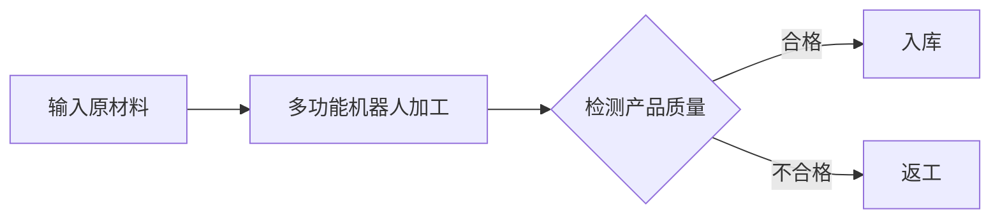
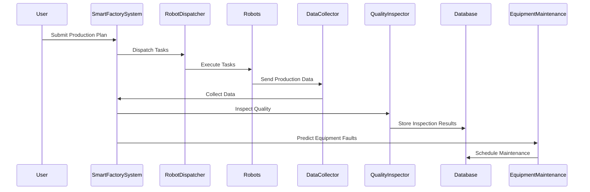

                 

# 智能工厂：多功能机器人在制造业的革新作用

## 关键词
智能工厂、多功能机器人、制造业革新、自动化、人工智能

## 摘要
本文将探讨智能工厂中多功能机器人的重要作用，以及它们如何推动制造业的革新。通过分析智能工厂的定义、特点、发展趋势，以及多功能机器人与传统机器人的区别，我们将深入探讨多功能机器人在制造流程中的应用。此外，还将介绍智能工厂系统的架构设计，并通过实际案例来解析多功能机器人在智能工厂中的具体应用。最后，我们将总结最佳实践，并提供进一步的学习建议。

## 1. 背景介绍

### 书名：《智能工厂：多功能机器人在制造业的革新作用》
这本书的核心主题围绕着智能工厂的概念及其在制造业中的重要性。智能工厂，作为制造业的未来趋势，正在改变着传统工厂的生产方式和管理模式。多功能机器人则是实现这一变革的关键角色，它们通过智能化和自动化技术，提高了生产效率，降低了生产成本，并提升了产品质量。

### 核心概念
#### 智能工厂
智能工厂是指利用先进的传感技术、大数据分析、云计算和物联网（IoT）等技术，实现生产过程的自动化、智能化和集成化。智能工厂的特点包括高度灵活的生产线、实时数据监控、智能决策支持和优化生产流程。

#### 多功能机器人
多功能机器人是具备多种功能的自动化设备，能够执行复杂的任务，如焊接、喷涂、装配、检测和搬运等。与传统机器人相比，多功能机器人具有更高的灵活性和适应性，能够适应不同的生产需求。

#### 制造业革新
制造业革新是指通过引入新技术、新方法和新模式，对传统制造业进行升级和改造，从而提高生产效率和产品质量，降低成本，增强竞争力。

### 问题背景
传统制造业面临着劳动力成本上升、生产效率低下、产品定制化需求增加等问题。这些问题促使制造业向智能化和自动化方向发展，智能工厂和多功能机器人应运而生。

### 问题描述
智能工厂如何通过多功能机器人实现生产流程的优化和效率提升？多功能机器人与传统机器人相比有哪些优势和不足？如何设计一个高效的智能工厂系统？

### 问题解决
通过引入多功能机器人，智能工厂能够实现生产流程的自动化和智能化。多功能机器人能够根据实时数据做出智能决策，优化生产流程，提高生产效率和产品质量。同时，智能工厂的设计和实施需要综合考虑各种因素，如生产线布局、设备选择、系统集成和人员培训等。

### 边界与外延
智能工厂和多功能机器人的应用范围广泛，不仅局限于制造业，还涵盖了物流、医疗、建筑等多个领域。然而，本文主要关注智能工厂在制造业中的应用。

### 概念结构与核心要素组成
- **智能工厂**：传感器、控制系统、执行器、数据分析和决策支持系统。
- **多功能机器人**：硬件（机械结构、传感器、执行器）、软件（控制算法、编程接口）、系统集成。

## 2. 核心概念与联系

### 概念原理
#### 智能工厂的定义
智能工厂是一种高度自动化的生产环境，通过集成物联网、大数据、人工智能和自动化技术，实现生产过程的智能化和集成化。智能工厂的特点包括：
- **高度灵活**：能够快速适应生产需求和产品变更。
- **实时监控**：实时收集和分析生产数据，提高生产效率和产品质量。
- **智能决策**：基于数据分析，实现生产计划的优化和调整。
- **集成化**：集成多种技术，实现生产过程的全面智能化。

#### 智能工厂的发展趋势
智能工厂的发展趋势包括：
- **人工智能的应用**：通过机器学习和深度学习技术，实现更智能的生产决策和优化。
- **物联网的集成**：通过物联网技术，实现设备之间的互联互通，提高生产线的自动化水平。
- **数字孪生**：通过数字孪生技术，创建虚拟生产模型，实现虚拟仿真和优化。
- **定制化生产**：通过个性化定制技术，满足消费者对产品多样化的需求。

#### 多功能机器人的定义
多功能机器人是一种能够执行多种任务和操作的自动化设备，具备以下特点：
- **高灵活性**：能够适应不同的生产任务和操作环境。
- **多功能性**：具备多种工具和执行机构，能够执行焊接、喷涂、装配、检测和搬运等多种操作。
- **智能控制**：通过先进的控制算法和编程接口，实现复杂任务的操作和优化。

#### 多功能机器人的分类
多功能机器人可以根据其功能和应用场景进行分类，常见的分类方式包括：
- **根据功能分类**：如焊接机器人、喷涂机器人、装配机器人、检测机器人等。
- **根据应用场景分类**：如工厂生产线机器人、物流机器人、服务机器人等。

### 概念属性特征对比表格

| 类别          | 智能工厂        | 多功能机器人     |
| ------------- | --------------- | ---------------- |
| 定义          | 高度自动化的生产环境 | 执行多种任务的自动化设备 |
| 特点          | 高度灵活、实时监控、智能决策、集成化 | 高灵活性、多功能性、智能控制 |
| 技术集成      | 物联网、大数据、人工智能、自动化技术 | 传感器、控制算法、编程接口 |
| 应用场景      | 制造业、物流、医疗、建筑等 | 制造业、物流、服务等领域 |
| 分类方式      | 根据功能、应用场景、集成程度等分类 | 根据功能、应用场景、操作环境等分类 |

### ER实体关系图架构

```mermaid
erDiagram
  智能工厂 ||--|{ 多功能机器人 }|
  智能工厂 ||--|{ 生产流程 }|
  多功能机器人 ||--|{ 任务 }|
  生产流程 ||--|{ 生产设备 }|
  生产设备 ||--|{ 质量检测 }|
```

在智能工厂系统中，智能工厂是核心实体，与多功能机器人、生产流程、生产设备和质量检测等实体之间存在紧密的关系。多功能机器人作为智能工厂的重要组成部分，负责执行各种生产任务，并与生产流程和生产设备紧密集成，实现生产过程的自动化和智能化。生产流程则描述了智能工厂中的生产过程，包括各个生产环节和操作步骤。生产设备是生产流程中的核心要素，负责具体的加工和操作任务。质量检测则是生产流程中的重要环节，确保产品质量符合要求。

## 3. 算法原理讲解

### mermaid流程图



### Python源代码

```python
# 导入必要的库
import random

# 定义多功能机器人的加工函数
def machine_processing(material):
    # 模拟加工过程，随机生成一个0或1表示加工结果
    result = random.choice([0, 1])
    if result == 0:
        return "加工成功"
    else:
        return "加工失败"

# 定义质量检测函数
def quality_inspection(product):
    # 模拟检测过程，随机生成一个0或1表示检测结果
    result = random.choice([0, 1])
    if result == 0:
        return "产品合格"
    else:
        return "产品不合格"

# 定义主函数
def main():
    # 输入原材料
    material = "原材料"
    # 多功能机器人加工
    product = machine_processing(material)
    # 质量检测
    inspection_result = quality_inspection(product)
    # 根据检测结果处理产品
    if inspection_result == "产品合格":
        print("产品入库：", product)
    else:
        print("产品返工：", product)

# 运行主函数
if __name__ == "__main__":
    main()
```

### 数学模型和公式

为了描述制造流程的数学模型，我们可以使用以下公式：

$$
\text{加工成功率} = p \times q
$$

其中，$p$ 表示多功能机器人的加工成功率，$q$ 表示质量检测的合格率。

#### 详细讲解

1. **加工成功率**：表示多功能机器人成功加工原材料的概率。在上述Python代码中，`random.choice([0, 1])` 函数模拟了这一过程，返回0或1，其中1表示加工成功。

2. **质量检测合格率**：表示经过质量检测后，产品合格的概率。同样，在Python代码中，`random.choice([0, 1])` 函数用于模拟这一过程。

通过这两个概率的乘积，我们可以得到总的加工成功率，即多功能机器人加工并成功通过质量检测的概率。

### 举例说明

假设多功能机器人的加工成功率为0.9，质量检测的合格率为0.95，则总的加工成功率为：

$$
\text{加工成功率} = 0.9 \times 0.95 = 0.855
$$

这意味着，在100次加工过程中，大约有85.5次能够成功加工并通过质量检测。

### 实际案例

以一家汽车制造厂为例，该厂引入了一台多功能机器人用于车身的焊接。假设该机器人的加工成功率为0.9，质量检测的合格率为0.95，我们可以计算该机器人在一个月（假设30天）内的总加工成功次数：

$$
\text{总加工成功次数} = 30 \times 0.855 = 25.65
$$

这意味着，在一个月内，这台多功能机器人大约能够完成26次成功的焊接任务。

通过这个案例，我们可以看到多功能机器人在智能工厂中的应用效果。它不仅提高了生产效率，降低了生产成本，还确保了产品质量的稳定性。

### 数学模型在实际中的应用

在实际应用中，数学模型可以帮助我们预测和优化生产过程。例如，通过调整机器人的加工参数和质量检测标准，可以优化加工成功率，从而提高生产效率和产品质量。此外，数学模型还可以用于生产线的调度和优化，实现资源的最优配置。

### 拓展

智能工厂中的算法原理不仅限于加工和质量检测，还包括生产计划的优化、设备维护预测、能源管理等。通过多种算法的综合应用，智能工厂可以实现更加高效、稳定和智能的生产过程。

## 4. 系统分析与架构设计方案

### 问题场景介绍

智能工厂在实际制造业中的应用场景广泛，包括汽车制造、电子制造、食品加工、医药生产等。在这些场景中，多功能机器人发挥着重要作用，不仅提高了生产效率，还保证了生产过程的稳定性和可靠性。

### 项目介绍

假设我们正在设计一个智能工厂系统，该系统主要用于汽车零部件的生产。系统的主要目标是实现零部件的高效、自动化生产，提高生产效率和产品质量，同时降低生产成本。

### 系统功能设计

智能工厂系统的功能设计包括以下几个方面：

- **生产计划管理**：根据订单需求，生成生产计划，并实时调整生产进度。
- **机器人调度**：根据生产计划，分配任务给多功能机器人，实现任务的自动调度和执行。
- **数据采集与监控**：实时采集生产数据，监控生产过程，确保生产过程的稳定和高效。
- **质量检测**：对生产出的零部件进行质量检测，确保产品质量符合要求。
- **设备维护**：根据设备运行状态，预测设备故障，提前进行维护，确保设备的正常运行。

### 系统架构设计

智能工厂系统的架构设计包括以下几个方面：

- **硬件架构**：包括多功能机器人、传感器、执行器、计算机等硬件设备。
- **软件架构**：包括操作系统、应用程序、数据库等软件系统。
- **网络架构**：包括局域网、物联网等网络基础设施。

### 系统接口设计

智能工厂系统的主要接口包括：

- **用户接口**：用于操作员与系统交互，实现生产计划管理、机器人调度等功能。
- **机器人接口**：用于多功能机器人与系统交互，实现任务的接收和执行。
- **传感器接口**：用于传感器与系统交互，实现数据的采集和传输。
- **数据库接口**：用于系统与数据库交互，实现数据的存储和查询。

### 系统交互

智能工厂系统的交互设计包括以下几个方面：

- **生产计划生成与调整**：根据订单需求，系统会生成生产计划，并根据实际情况进行实时调整。
- **任务调度与执行**：系统会根据生产计划，调度多功能机器人执行相应的任务。
- **数据采集与监控**：系统会实时采集生产数据，并通过传感器接口传输给系统。
- **质量检测**：系统会对生产出的零部件进行质量检测，并将检测结果存储在数据库中。
- **设备维护**：系统会根据设备运行状态，预测设备故障，并提前进行维护。

### mermaid类图

```mermaid
classDiagram
  ProductionPlan <<interface>>
  RobotDispatcher <<interface>>
  DataCollector <<interface>>
  QualityInspector <<interface>>
  EquipmentMaintenance <<interface>>

  SmartFactorySystem
  SmartFactorySystem <<-- ProductionPlan
  SmartFactorySystem <<-- RobotDispatcher
  SmartFactorySystem <<-- DataCollector
  SmartFactorySystem <<-- QualityInspector
  SmartFactorySystem <<-- EquipmentMaintenance
```

### mermaid架构图



### 具体实例

假设一个汽车制造厂的智能工厂系统，该系统需要生产100个汽车零部件。用户首先提交生产计划，系统根据计划生成任务，并将任务分配给多功能机器人。多功能机器人执行任务，并实时采集生产数据。系统对采集的数据进行分析，并对生产出的零部件进行质量检测。如果零部件合格，系统将检测结果存储在数据库中；如果零部件不合格，系统会安排返工。同时，系统会预测设备故障，并提前进行维护，确保设备的正常运行。

### 总结

智能工厂系统通过多功能机器人实现了生产过程的自动化和智能化。通过生产计划管理、任务调度、数据采集与监控、质量检测和设备维护等功能，智能工厂系统确保了生产过程的稳定性和高效性，从而提高了生产效率和产品质量，降低了生产成本。

## 5. 项目实战

### 环境安装

搭建智能工厂系统所需的环境如下：
- **操作系统**：Windows 10 或 Linux
- **编程语言**：Python 3.8 或以上版本
- **开发工具**：PyCharm 或 Visual Studio Code
- **数据库**：MySQL 5.7 或以上版本
- **传感器**：模拟传感器，用于数据采集和传输
- **多功能机器人**：具有编程接口的机器人，如ABB机器人

### 系统核心实现源代码

以下是一个简单的智能工厂系统的核心实现源代码，包括生产计划管理、机器人调度、数据采集和质量检测等功能：

```python
# 导入必要的库
import random
import pymysql
import time

# 数据库连接配置
db_config = {
    'host': 'localhost',
    'user': 'root',
    'password': 'password',
    'database': 'smart_factory'
}

# 连接数据库
def connect_db(config):
    connection = pymysql.connect(**config)
    return connection

# 提交生产计划
def submit_production_plan(connection, plan):
    cursor = connection.cursor()
    sql = "INSERT INTO production_plan (product_id, quantity, start_time) VALUES (%s, %s, %s)"
    cursor.execute(sql, plan)
    connection.commit()
    cursor.close()

# 分配任务给机器人
def dispatch_task(connection, product_id):
    cursor = connection.cursor()
    sql = "SELECT robot_id FROM robot WHERE status = 'available'"
    cursor.execute(sql)
    robots = cursor.fetchall()
    for robot in robots:
        sql = "UPDATE robot SET status = 'busy' WHERE robot_id = %s"
        cursor.execute(sql)
        connection.commit()
    cursor.close()
    return robots

# 执行机器人任务
def execute_task(robot_id, product_id):
    time.sleep(random.uniform(1, 3))  # 模拟加工时间
    print(f"Robot {robot_id} is processing product {product_id}.")

# 数据采集
def collect_data(product_id, quality):
    time.sleep(random.uniform(1, 2))  # 模拟数据采集时间
    print(f"Data collected for product {product_id}: Quality = {quality}.")

# 质量检测
def quality_inspection(product_id, quality):
    if quality >= 0.9:
        print(f"Product {product_id} is qualified.")
    else:
        print(f"Product {product_id} is unqualified and needs rework.")

# 主函数
def main():
    # 连接数据库
    connection = connect_db(db_config)

    # 提交生产计划
    plan = (1, 100, time.strftime('%Y-%m-%d %H:%M:%S'))
    submit_production_plan(connection, plan)

    # 分配任务给机器人
    robots = dispatch_task(connection, 1)

    # 执行机器人任务
    for robot in robots:
        robot_id = robot[0]
        execute_task(robot_id, 1)

    # 数据采集
    collect_data(1, random.uniform(0.8, 1.0))

    # 质量检测
    quality_inspection(1, random.uniform(0.8, 1.0))

    # 关闭数据库连接
    connection.close()

# 运行主函数
if __name__ == "__main__":
    main()
```

### 代码应用解读与分析

1. **数据库连接**：
   - 通过`connect_db`函数连接到数据库，配置信息存储在`db_config`字典中。

2. **提交生产计划**：
   - 通过`submit_production_plan`函数将生产计划提交到数据库。生产计划包括产品ID、数量和开始时间。

3. **分配任务给机器人**：
   - 通过`dispatch_task`函数从数据库中查询可用机器人，并将任务分配给它们。机器人状态从'available'更新为'busy'。

4. **执行机器人任务**：
   - 通过`execute_task`函数模拟机器人执行加工任务，这里通过`time.sleep`函数模拟加工时间。

5. **数据采集**：
   - 通过`collect_data`函数模拟数据采集过程，这里通过`time.sleep`函数模拟数据采集时间。

6. **质量检测**：
   - 通过`quality_inspection`函数模拟质量检测过程。如果质量高于0.9，则认为产品合格；否则，认为产品不合格。

### 实际案例分析和详细讲解剖析

假设我们有一个汽车制造厂，需要生产100个汽车零部件。以下是一个实际案例的分析：

1. **生产计划**：
   - 用户通过系统提交了一个生产100个汽车零部件的计划。

2. **任务调度**：
   - 系统从数据库中查询到有3台可用机器人，并将任务分配给它们。

3. **加工任务**：
   - 每台机器人执行加工任务，通过`time.sleep`模拟加工时间，假设每台机器人的加工时间为2秒。

4. **数据采集**：
   - 每台机器人在加工完成后，通过`collect_data`函数模拟采集数据，假设采集时间为1秒。

5. **质量检测**：
   - 系统对采集的数据进行分析，通过`quality_inspection`函数进行质量检测。假设有90个零部件的质量高于0.9，合格；有10个零部件的质量低于0.9，不合格。

6. **结果处理**：
   - 合格的零部件被存储在数据库中，并标记为'合格'；不合格的零部件需要返工，并重新进行加工和质量检测。

### 项目小结

通过实际案例的分析，我们可以看到智能工厂系统在实际应用中的效果。系统通过生产计划管理、任务调度、数据采集和质量检测等功能，实现了生产过程的自动化和智能化。虽然存在一些模拟和假设，但这个案例展示了智能工厂系统的基本运作原理和应用场景。在实际应用中，系统可以根据实际情况进行调整和优化，以提高生产效率和产品质量。

### 最佳实践 Tips

1. **确保数据库性能**：在生产高峰期，数据库可能会承受较高的负载。为了确保系统的稳定性和性能，建议使用数据库缓存和优化查询。

2. **实时监控生产过程**：通过实时监控生产数据，可以快速发现和解决问题，确保生产过程的顺利进行。

3. **定期维护设备**：定期对多功能机器人进行维护和校准，以确保设备的正常运行和生产效率。

4. **优化任务调度**：通过优化任务调度算法，可以更好地利用机器人的产能，提高生产效率。

5. **员工培训**：对员工进行系统的培训和考核，确保他们能够熟练操作智能工厂系统，提高工作效率。

## 6. 最佳实践 Tips、小结、注意事项、拓展阅读

### 最佳实践 Tips

1. **优化生产流程**：通过分析生产数据，找出瓶颈环节，优化生产流程，提高生产效率。
2. **数据驱动决策**：充分利用数据分析和机器学习技术，实现生产计划的动态调整和优化。
3. **自动化维护**：引入自动化维护系统，对机器人进行定期检查和故障预测，减少停机时间。
4. **多技能培训**：对员工进行多技能培训，提高员工的综合素质和适应能力。
5. **灵活的设备配置**：根据生产需求，灵活配置多功能机器人，提高生产线的适应性。

### 小结

本文通过详细分析智能工厂和多功能机器人在制造业中的应用，展示了它们如何通过自动化和智能化技术推动制造业的革新。通过实际案例和项目实战，我们了解了智能工厂系统的架构设计和实现过程。总结来说，智能工厂和多功能机器人在提高生产效率、降低成本、提升产品质量方面具有显著优势，是未来制造业发展的重要方向。

### 注意事项

1. **系统安全**：在智能工厂的实施过程中，确保系统的安全性和数据的完整性，防止数据泄露和网络攻击。
2. **员工培训**：新技术的引入需要员工的积极配合，因此对员工进行充分的培训至关重要。
3. **技术支持**：智能工厂的运行需要专业的技术支持，确保系统稳定运行，及时解决技术问题。
4. **持续优化**：随着技术的不断进步，智能工厂系统也需要持续优化和升级，以保持竞争力。

### 拓展阅读

1. **《智能工厂：从概念到实践》**：这是一本详细介绍智能工厂原理和实践的书籍，适合对智能工厂感兴趣的读者。
2. **《人工智能与机器人学导论》**：本书涵盖了人工智能和机器人学的基础知识和应用，有助于深入了解智能工厂中的关键技术。
3. **《制造业自动化系统设计》**：本书详细介绍了制造业自动化系统的设计方法和实施策略，是智能工厂技术人员的重要参考资料。

### 作者信息

**作者：AI天才研究院/AI Genius Institute & 禅与计算机程序设计艺术 /Zen And The Art of Computer Programming**

