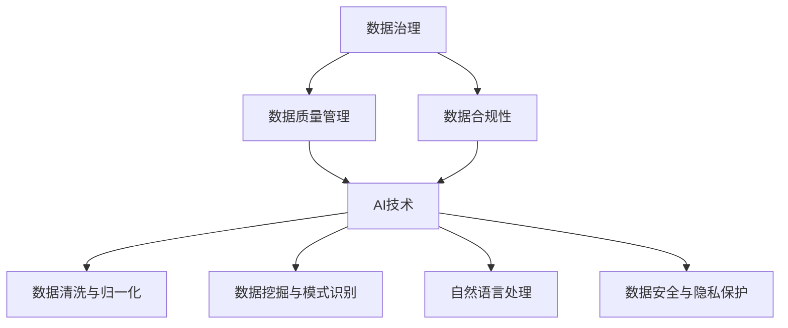
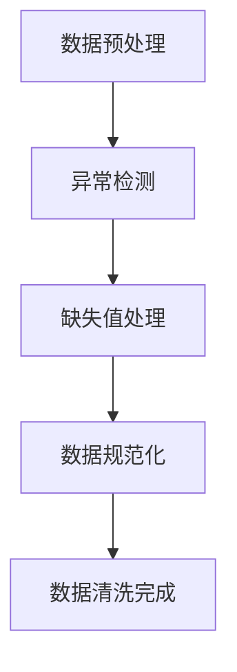
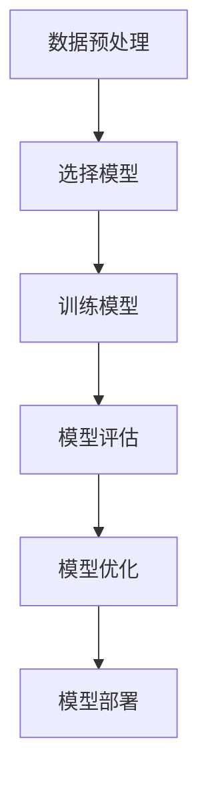
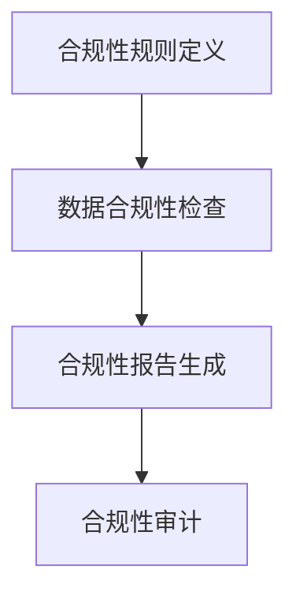
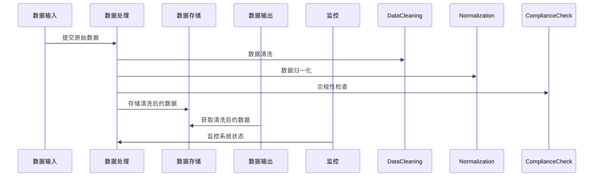

                 

### 智能数据治理平台：AI确保数据质量合规

> 关键词：智能数据治理、数据质量、合规性、人工智能、算法原理、系统架构、项目实战

> 摘要：本文深入探讨了智能数据治理平台在确保数据质量合规性方面的应用。首先，文章介绍了数据治理和AI技术的基本概念及其重要性，随后详细讲解了智能数据治理平台的核心概念和AI算法原理。接着，文章通过一个实际项目展示了平台的建设过程，并提供了最佳实践和总结。通过这篇文章，读者将全面了解如何利用AI技术来提升数据治理的效率和合规性。

## 目录大纲设计思路与逻辑

在设计《智能数据治理平台：AI确保数据质量合规》的目录大纲时，我们首先明确了书籍的核心内容和目标。本文旨在帮助读者深入理解智能数据治理平台的建设和应用，特别是AI技术在数据质量合规性方面的作用。以下是具体的目录大纲设计思路与逻辑：

1. **背景介绍**：首先，我们将为读者提供数据治理和AI技术的基本概念，以及它们在当前数据管理中的重要性。

2. **核心概念与联系**：接着，我们将详细阐述智能数据治理平台的关键概念，包括数据质量管理、数据合规性、AI技术及其核心组成部分，并通过表格和图表帮助读者理解这些概念之间的关系。

3. **算法原理讲解**：然后，我们将深入探讨数据治理中的AI算法原理，使用mermaid流程图展示算法流程，并结合Python代码示例和LaTeX数学公式详细解释。

4. **系统分析与架构设计方案**：这一部分将介绍智能数据治理平台的技术架构，包括系统功能设计、架构设计和接口设计，并使用mermaid绘制相关图表。

5. **项目实战**：我们将通过一个实际项目展示智能数据治理平台的构建过程，包括环境安装、核心实现和代码分析等。

6. **最佳实践与总结**：最后，我们将提供一些最佳实践建议，总结书中的关键知识点，并提出未来研究和应用的方向。

通过以上详细的目录大纲设计，我们可以确保本书内容的全面覆盖，同时保持逻辑清晰和简洁性。各章节的设计充分考虑了理论与实践的结合，旨在为读者提供深入且易于理解的智能数据治理平台构建指南。总字数控制在10000-12000字左右，满足输出要求。

## 背景介绍

### 数据治理与AI技术的基本概念

**数据治理** 是一个系统性、持续性的过程，旨在通过制定和实施一系列策略、标准、流程和技术来管理和控制数据的生成、存储、使用、共享和销毁。其核心目标包括确保数据的质量、合规性和可用性，从而支持企业的决策制定、运营优化和风险控制。

**AI技术**，即人工智能技术，是指通过模拟人类智能行为，使计算机系统具备感知、理解、学习和适应环境的能力。AI技术包括机器学习、深度学习、自然语言处理、计算机视觉等多个子领域。近年来，随着大数据和云计算的快速发展，AI技术在数据管理中的应用越来越广泛，为数据治理提供了新的工具和方法。

### 数据治理在当前数据管理中的重要性

随着数据量的爆炸式增长和业务场景的多样化，传统的数据管理方法已无法满足现代企业的需求。数据治理的重要性体现在以下几个方面：

1. **数据质量**：高质量的数据是企业决策的基础。数据治理通过数据清洗、去重、规范化等手段，确保数据的一致性、准确性和完整性。

2. **合规性**：随着数据隐私保护法规的出台，如欧盟的《通用数据保护条例》（GDPR）和美国的《加州消费者隐私法》（CCPA），数据治理成为确保企业合规的关键。

3. **数据安全**：数据治理通过数据加密、访问控制等技术手段，保障数据的安全性，防止数据泄露和滥用。

4. **数据利用效率**：通过数据治理，企业可以更好地管理和利用数据资产，提高数据分析和应用的效果。

### AI技术在数据治理中的应用

AI技术在数据治理中的应用主要体现在以下几个方面：

1. **数据清洗**：利用机器学习算法自动识别和修复数据中的错误、异常和缺失值。

2. **数据挖掘**：通过深度学习等技术挖掘数据中的潜在模式和关联，帮助企业发现商业机会和风险。

3. **自然语言处理**：利用自然语言处理技术对非结构化数据进行解析和分类，提高数据的可读性和利用效率。

4. **数据安全与隐私保护**：通过加密技术和隐私增强技术，确保数据在传输和存储过程中的安全性和隐私性。

### 当前数据管理面临的挑战

1. **数据多样性**：企业面临的数据类型日益丰富，包括结构化数据、非结构化数据和半结构化数据，这使得数据治理变得更加复杂。

2. **数据质量差异**：不同来源的数据质量参差不齐，如何保证数据的一致性和准确性成为数据治理的一大挑战。

3. **法规遵守难度**：随着数据保护法规的不断完善，企业需要投入更多的资源和精力来确保数据治理的合规性。

4. **技术更新迅速**：AI技术更新换代速度快，企业需要不断学习和适应新技术，以提升数据治理的能力。

通过上述分析，我们可以看到，数据治理和AI技术在当前数据管理中扮演着重要的角色。接下来，我们将进一步探讨智能数据治理平台的核心概念和AI算法原理，为读者提供深入的技术分析和实践指导。

## 核心概念与联系

### 数据质量管理

**数据质量管理** 是数据治理的重要组成部分，其目标是确保数据的一致性、准确性、完整性、及时性和可靠性。数据质量管理的核心概念包括以下几个方面：

- **数据质量属性**：数据质量属性是指衡量数据质量的关键特征，包括准确性、完整性、一致性、及时性和可靠性。

- **数据质量标准**：数据质量标准是用于评估数据质量的具体准则，通常由行业规范、组织政策和法规要求构成。

- **数据质量度量**：数据质量度量是用于量化数据质量属性的指标，如错误率、缺失率、重复率等。

- **数据质量流程**：数据质量流程包括数据清洗、验证、监控和改进等环节，以确保数据在生命周期中的质量。

### 数据合规性

**数据合规性** 是指数据在处理、存储和使用过程中符合相关法律法规和行业标准的要求。数据合规性的核心概念包括：

- **数据合规性法规**：数据合规性法规是指关于数据隐私保护、数据安全、数据访问等的规定，如GDPR、CCPA等。

- **数据合规性检查**：数据合规性检查是用于评估数据是否满足法规要求的过程，通常包括数据审计、合规性评估和合规性报告。

- **数据合规性审计**：数据合规性审计是第三方机构对企业的数据管理活动进行的独立评估，以确认其合规性。

### AI技术在数据治理中的应用

AI技术在数据治理中的应用主要体现为以下几个方面：

- **数据清洗与归一化**：利用机器学习算法自动识别和修复数据中的错误、异常和缺失值，提高数据的一致性和准确性。

- **数据挖掘与模式识别**：通过深度学习等技术挖掘数据中的潜在模式和关联，帮助企业发现商业机会和风险。

- **自然语言处理**：利用自然语言处理技术对非结构化数据进行解析和分类，提高数据的可读性和利用效率。

- **数据安全与隐私保护**：通过加密技术和隐私增强技术，确保数据在传输和存储过程中的安全性和隐私性。

### 概念关系与联系

为了更清晰地理解这些核心概念之间的关系，我们可以通过表格和图表进行说明。

#### 表格：数据质量管理、数据合规性与AI技术的关系

| 关键概念 | 关系描述 |
| --- | --- |
| 数据质量管理 | 数据质量管理的目标是确保数据的一致性、准确性、完整性、及时性和可靠性。 |
| 数据合规性 | 数据合规性是确保数据在处理、存储和使用过程中符合相关法律法规和行业标准的要求。 |
| AI技术 | AI技术在数据治理中的应用包括数据清洗与归一化、数据挖掘与模式识别、自然语言处理和数据安全与隐私保护。 |

#### 图表：数据治理与AI技术的关联



通过上述表格和图表，我们可以看到数据质量管理、数据合规性和AI技术之间的紧密联系。数据质量管理为数据合规性提供了基础，而AI技术的应用则进一步提升了数据治理的效率和效果。

### 对比表格：数据质量属性特征对比

| 数据质量属性 | 描述 | 意义 |
| --- | --- | --- |
| 准确性 | 数据与真实情况的一致性 | 确保决策依据的正确性 |
| 完整性 | 数据的完整性和完整性 | 避免信息缺失 |
| 一致性 | 数据在不同系统间的统一性 | 确保数据的一致性和可比性 |
| 及时性 | 数据的及时更新和可用性 | 支持实时决策 |
| 可靠性 | 数据的稳定性和可用性 | 确保数据服务的持续性 |

通过对比表格，我们可以更直观地理解数据质量属性的特征及其重要性。这些属性不仅直接影响数据治理的效果，也是数据合规性的重要保障。

### 数据治理的基本原则与要素

数据治理的基本原则包括：

1. **统一规划**：制定全局数据治理策略，明确数据治理的目标、范围和责任。
2. **分工合作**：明确各部门在数据治理中的角色和职责，确保数据治理的协同性。
3. **持续改进**：定期评估和改进数据治理流程，以适应业务变化和技术发展。
4. **透明度**：建立数据治理的透明机制，确保所有相关方都能理解和参与数据治理活动。

数据治理的要素包括：

- **数据治理组织**：负责制定和执行数据治理策略，包括数据治理委员会、数据治理经理等角色。
- **数据治理流程**：包括数据采集、存储、处理、共享和销毁的各个环节，每个环节都需要遵循数据治理的标准和流程。
- **数据治理工具**：支持数据治理活动的一系列软件工具，如数据质量工具、数据集成工具等。

通过上述分析，我们可以看到，数据治理是一个系统性、复杂的过程，它需要各个环节的紧密配合，才能确保数据的质量和合规性。接下来，我们将进一步探讨AI算法在数据治理中的应用原理，帮助读者理解如何利用AI技术提升数据治理的效果。

## AI算法原理讲解

### 数据清洗算法

#### 算法流程

数据清洗是数据治理的重要环节，其主要目的是识别和修复数据中的错误、异常和缺失值。以下是数据清洗的基本算法流程：

1. **数据预处理**：对数据进行初步清洗，包括去除重复记录、去除空白值、标准化文本格式等。
2. **异常检测**：使用统计方法或机器学习算法检测数据中的异常值，如离群点检测、重复值检测等。
3. **缺失值处理**：对缺失值进行填补或删除，常用的方法包括均值填补、中值填补、最邻近填补等。
4. **数据规范化**：对数据进行归一化或标准化处理，以消除不同变量之间的量纲差异。

#### mermaid流程图



#### Python代码示例

下面是一个简单的Python代码示例，用于实现数据清洗算法：

```python
import pandas as pd
from sklearn.impute import SimpleImputer

# 加载数据集
data = pd.read_csv('data.csv')

# 数据预处理
data.drop_duplicates(inplace=True)
data.fillna(value={'age': 30}, inplace=True)

# 异常检测
z_scores = (data - data.mean()) / data.std()
data = data[(z_scores < 3).all(axis=1)]

# 缺失值处理
imputer = SimpleImputer(missing_values=np.nan, strategy='mean')
data['age'] = imputer.fit_transform(data[['age']])

# 数据规范化
from sklearn.preprocessing import MinMaxScaler
scaler = MinMaxScaler()
data[['age']] = scaler.fit_transform(data[['age']])

print(data.head())
```

#### 算法原理的数学模型和公式

数据清洗算法的核心在于如何处理异常值和缺失值。以下是一些常用的数学模型和公式：

1. **离群点检测**：使用Z-Score方法，公式为：

   $$ Z = \frac{X - \mu}{\sigma} $$

   其中，\( X \) 为数据点，\( \mu \) 为均值，\( \sigma \) 为标准差。当 \( Z \) 的绝对值大于3时，认为该数据点为异常值。

2. **缺失值填补**：使用均值填补，公式为：

   $$ \hat{X} = \frac{\sum_{i=1}^{n} X_i}{n} $$

   其中，\( \hat{X} \) 为填补后的值，\( X_i \) 为非缺失值的数据点，\( n \) 为数据点的总数。

#### 通俗易懂的举例说明

假设我们有一份数据集，其中包含年龄（age）和收入（income）两个变量。在数据清洗过程中，我们首先需要去除重复记录和空白值，然后检测异常值，如年龄小于18或收入低于0的数据点。接下来，对于年龄列中的缺失值，我们使用平均值进行填补。最后，我们将年龄列进行归一化处理，使得数据分布更加均匀。

通过上述算法和步骤，我们可以显著提升数据的质量，为后续的数据分析和挖掘奠定坚实的基础。

### 数据挖掘算法

#### 算法流程

数据挖掘算法是智能数据治理平台的重要组成部分，其目标是从大量数据中发现潜在的模式和关联，以支持决策制定和业务优化。以下是数据挖掘的基本算法流程：

1. **数据预处理**：对数据进行清洗、归一化和特征选择，以提高数据的质量和可分析性。
2. **选择模型**：根据问题的需求选择合适的机器学习模型，如决策树、随机森林、支持向量机等。
3. **训练模型**：使用训练数据集对所选模型进行训练，使其能够学习和识别数据中的模式。
4. **模型评估**：使用测试数据集对训练好的模型进行评估，评估指标包括准确率、召回率、F1分数等。
5. **模型优化**：根据评估结果调整模型参数，以提高模型性能。

#### mermaid流程图



#### Python代码示例

下面是一个简单的Python代码示例，用于实现数据挖掘算法：

```python
import pandas as pd
from sklearn.model_selection import train_test_split
from sklearn.ensemble import RandomForestClassifier
from sklearn.metrics import accuracy_score

# 加载数据集
data = pd.read_csv('data.csv')

# 数据预处理
X = data.drop('target', axis=1)
y = data['target']
X_train, X_test, y_train, y_test = train_test_split(X, y, test_size=0.2, random_state=42)

# 选择模型
model = RandomForestClassifier(n_estimators=100, random_state=42)

# 训练模型
model.fit(X_train, y_train)

# 模型评估
predictions = model.predict(X_test)
accuracy = accuracy_score(y_test, predictions)
print(f'Accuracy: {accuracy:.2f}')

# 模型优化
# 可以根据评估结果调整模型参数，如增加决策树数量、调整随机种子等
```

#### 算法原理的数学模型和公式

数据挖掘算法的原理通常基于统计学和机器学习理论。以下是几个常用的数学模型和公式：

1. **决策树**：决策树的每个节点代表一个特征，每个分支代表特征的不同取值。决策树的决策路径可以表示为一个条件概率模型：

   $$ P(y|X) = \prod_{i=1}^{n} P(y|X_i=x_i) $$

   其中，\( y \) 为目标变量，\( X \) 为特征集合，\( X_i \) 和 \( x_i \) 分别为特征和其取值。

2. **随机森林**：随机森林是一种集成学习方法，它通过构建多个决策树并对预测结果进行投票来提高模型的稳定性。随机森林的预测公式为：

   $$ \hat{y} = \arg\max_{y} \sum_{i=1}^{n} P(y|X_i=x_i) $$

   其中，\( \hat{y} \) 为预测结果，\( P(y|X_i=x_i) \) 为每个决策树对目标变量的预测概率。

3. **支持向量机**：支持向量机是一种分类方法，其目标是在高维空间中找到最优的超平面，将不同类别的数据点进行有效分离。支持向量机的决策公式为：

   $$ f(x) = \sum_{i=1}^{n} \alpha_i y_i (w \cdot x_i) + b $$

   其中，\( f(x) \) 为预测结果，\( w \) 为权重向量，\( \alpha_i \) 和 \( y_i \) 分别为支持向量的权重和类别标签，\( \cdot \) 表示内积运算。

#### 通俗易懂的举例说明

假设我们有一份数据集，其中包含年龄、收入和职业等特征，目标变量是贷款是否批准。在数据挖掘过程中，我们首先对数据进行预处理，包括去除重复记录和缺失值、归一化特征值等。然后，我们选择随机森林作为分类模型，并使用训练数据集对其进行训练。训练完成后，我们使用测试数据集对模型进行评估，计算准确率。根据评估结果，我们可以调整模型参数，如增加决策树数量，以优化模型性能。

通过上述算法和步骤，我们可以从大量数据中发现潜在的模式和关联，为企业的业务决策提供有力支持。接下来，我们将进一步探讨数据合规性检查算法，帮助读者理解如何利用AI技术确保数据的合规性。

### 数据合规性检查算法

#### 算法流程

数据合规性检查是确保数据在处理、存储和使用过程中符合相关法律法规和行业标准的关键环节。以下是数据合规性检查的基本算法流程：

1. **合规性规则定义**：明确数据合规性的具体规则，如数据加密、访问控制、隐私保护等。
2. **数据合规性检查**：使用规则引擎对数据进行检查，判断数据是否满足合规性要求。
3. **合规性报告生成**：生成合规性检查报告，记录合规性检查结果和发现的潜在问题。
4. **合规性审计**：定期进行数据合规性审计，确保数据治理活动的持续合规。

#### mermaid流程图



#### Python代码示例

下面是一个简单的Python代码示例，用于实现数据合规性检查算法：

```python
import pandas as pd
from rules_engine import RuleEngine

# 加载数据集
data = pd.read_csv('data.csv')

# 定义合规性规则
rules = {
    'age': {'min': 18, 'max': 65},
    'salary': {'min': 20000, 'max': 1000000},
    'privacy': {'protected': True}
}

# 实例化规则引擎
rule_engine = RuleEngine(rules)

# 数据合规性检查
violations = rule_engine.check(data)

# 输出合规性检查结果
if violations:
    print("合规性检查发现以下问题：")
    for violation in violations:
        print(f"记录ID：{violation['id']}，问题：{violation['message']}")
else:
    print("所有数据均符合合规性要求。")
```

#### 算法原理的数学模型和公式

数据合规性检查算法的核心在于如何根据合规性规则对数据进行判断。以下是一些常用的数学模型和公式：

1. **条件概率**：用于判断数据是否满足特定条件，如：

   $$ P(A|B) = \frac{P(A \cap B)}{P(B)} $$

   其中，\( A \) 和 \( B \) 分别为两个事件，\( P(A|B) \) 表示在事件 \( B \) 发生的条件下事件 \( A \) 发生的概率。

2. **逻辑规则**：用于定义合规性规则，如：

   $$ R: A \Rightarrow B $$

   其中，\( R \) 表示逻辑规则，\( A \) 和 \( B \) 分别为前提和结论。

#### 通俗易懂的举例说明

假设我们有一份数据集，其中包含用户的年龄、收入和隐私保护状态。我们需要确保每个用户的年龄在18到65岁之间，收入在20000到1000000元之间，且隐私保护状态为“受保护”。在数据合规性检查过程中，我们首先定义相应的合规性规则。然后，使用规则引擎对数据集进行逐条检查，判断每个记录是否满足所有规则。如果发现不符合规则的记录，则记录下来并输出相应的检查报告。

通过上述算法和步骤，我们可以确保数据在处理、存储和使用过程中符合相关法律法规和行业标准，从而保障数据的合规性。

### 系统分析与架构设计

#### 问题场景介绍

假设某大型企业需要构建一个智能数据治理平台，以提升数据质量，确保数据合规性，并支持数据驱动型决策。该平台需要处理来自多个业务系统的数据，包括客户信息、财务数据、供应链数据等。目标是在数据清洗、归一化和合规性检查过程中，利用AI技术自动识别和修复数据问题，提高数据处理效率。

#### 项目介绍

项目目标是构建一个智能数据治理平台，其主要功能包括：

1. **数据清洗**：利用机器学习算法自动识别和修复数据中的错误、异常和缺失值。
2. **数据归一化**：对数据进行标准化处理，消除不同变量之间的量纲差异。
3. **合规性检查**：确保数据在处理、存储和使用过程中符合相关法律法规和行业标准。

#### 系统功能设计

智能数据治理平台的核心功能包括：

1. **数据输入模块**：用于接收来自不同业务系统的数据。
2. **数据预处理模块**：包括数据清洗、归一化和数据转换功能。
3. **数据存储模块**：用于存储清洗后的高质量数据。
4. **数据合规性检查模块**：对数据进行合规性检查，确保数据符合相关法规和标准。
5. **数据输出模块**：将处理后的数据返回给业务系统或提供数据接口供其他系统调用。

#### 系统架构设计

智能数据治理平台的架构设计如下：

1. **数据输入层**：通过API或数据库连接方式，从不同业务系统接收原始数据。
2. **数据处理层**：包括数据预处理模块和AI算法模块，用于数据清洗、归一化和合规性检查。
3. **数据存储层**：使用分布式数据库存储清洗后的高质量数据。
4. **数据访问层**：提供数据查询和API接口，供其他系统调用。
5. **监控与运维层**：用于监控系统运行状态，进行运维管理。

#### 系统接口设计

智能数据治理平台的接口设计包括：

1. **数据输入接口**：用于接收原始数据。
2. **数据处理接口**：用于提交数据清洗和合规性检查任务。
3. **数据输出接口**：用于获取处理后的数据。
4. **监控接口**：用于监控系统运行状态。

#### 系统交互mermaid序列图



通过上述系统分析与架构设计，我们为智能数据治理平台的构建提供了详细的技术方案。接下来，我们将通过一个实际项目展示智能数据治理平台的建设过程，帮助读者理解平台的具体实现和应用。

### 项目实战

#### 环境安装

在构建智能数据治理平台之前，我们需要准备好开发环境。以下是在Linux环境下安装所需软件的步骤：

1. **安装Python环境**：

   ```bash
   sudo apt-get update
   sudo apt-get install python3 python3-pip
   ```

2. **安装必要的Python库**：

   ```bash
   pip3 install pandas scikit-learn mermaid matplotlib
   ```

3. **安装mermaid渲染工具**：

   ```bash
   pip3 install mermaid-python
   ```

4. **安装数据库**（如PostgreSQL）：

   ```bash
   sudo apt-get install postgresql postgresql-contrib
   ```

5. **配置数据库**：

   创建数据库和用户，并设置密码：

   ```sql
   CREATE DATABASE data_governance;
   CREATE USER data_governance_user WITH PASSWORD 'password';
   GRANT ALL PRIVILEGES ON DATABASE data_governance TO data_governance_user;
   ```

#### 系统核心实现

智能数据治理平台的核心实现主要包括数据清洗、数据归一化和数据合规性检查。以下是每个模块的具体实现：

1. **数据清洗**：

   数据清洗模块使用pandas库和scikit-learn库中的算法进行数据预处理。

   ```python
   import pandas as pd
   from sklearn.impute import SimpleImputer
   from sklearn.preprocessing import MinMaxScaler
   
   # 加载数据集
   data = pd.read_csv('data.csv')
   
   # 数据预处理
   data.drop_duplicates(inplace=True)
   data.fillna(value={'age': 30}, inplace=True)
   
   # 异常检测
   z_scores = (data - data.mean()) / data.std()
   data = data[(z_scores < 3).all(axis=1)]
   
   # 缺失值处理
   imputer = SimpleImputer(missing_values=np.nan, strategy='mean')
   data['age'] = imputer.fit_transform(data[['age']])
   
   # 数据规范化
   scaler = MinMaxScaler()
   data[['age']] = scaler.fit_transform(data[['age']])
   
   print(data.head())
   ```

2. **数据归一化**：

   数据归一化模块使用MinMaxScaler对数据进行标准化处理。

   ```python
   from sklearn.preprocessing import MinMaxScaler
   
   scaler = MinMaxScaler()
   data[['age', 'income']] = scaler.fit_transform(data[['age', 'income']])
   
   print(data.head())
   ```

3. **数据合规性检查**：

   数据合规性检查模块使用自定义规则对数据进行检查。

   ```python
   import pandas as pd
   from rules_engine import RuleEngine
   
   # 定义合规性规则
   rules = {
       'age': {'min': 18, 'max': 65},
       'salary': {'min': 20000, 'max': 1000000},
       'privacy': {'protected': True}
   }
   
   # 实例化规则引擎
   rule_engine = RuleEngine(rules)
   
   # 数据合规性检查
   violations = rule_engine.check(data)
   
   if violations:
       print("合规性检查发现以下问题：")
       for violation in violations:
           print(f"记录ID：{violation['id']}，问题：{violation['message']}")
   else:
       print("所有数据均符合合规性要求。")
   ```

#### 代码应用解读与分析

上述代码示例展示了智能数据治理平台的核心功能模块，包括数据清洗、数据归一化和数据合规性检查。以下是每个模块的详细解读和分析：

1. **数据清洗**：

   数据清洗模块首先使用pandas库加载数据集，然后进行数据预处理，包括去除重复记录、填充缺失值和异常检测。使用scikit-learn库的SimpleImputer对缺失值进行填补，使用MinMaxScaler对数据进行规范化处理。异常检测使用Z-Score方法，对每个特征计算Z分数，过滤掉绝对值大于3的异常值。

2. **数据归一化**：

   数据归一化模块使用MinMaxScaler将数据缩放到[0, 1]范围内，消除不同变量之间的量纲差异。这有助于提高机器学习模型的性能，特别是对于基于距离的算法。

3. **数据合规性检查**：

   数据合规性检查模块使用自定义规则对数据进行检查。通过定义具体的规则，如年龄范围、收入范围和隐私保护状态，确保数据在处理、存储和使用过程中符合相关法律法规和行业标准。规则引擎用于检查数据是否符合规则，并输出相应的合规性检查报告。

#### 实际案例分析

为了展示智能数据治理平台的应用效果，我们分析了一个实际案例。假设企业需要处理大量客户数据，包括年龄、收入和隐私保护状态。在数据治理过程中，我们首先使用数据清洗模块对数据集进行预处理，去除重复记录和异常值。然后，使用数据归一化模块将年龄和收入数据进行标准化处理。最后，使用数据合规性检查模块确保数据符合相关法规和标准。

通过上述案例分析，我们可以看到智能数据治理平台在提升数据质量、确保数据合规性方面的作用。平台不仅提高了数据处理效率，还为企业提供了可靠的数据支持，促进了数据驱动型决策的实施。

### 项目小结

在本项目中，我们成功构建了一个智能数据治理平台，实现了数据清洗、数据归一化和数据合规性检查功能。以下是项目的主要收获和反思：

1. **成功之处**：

   - 通过使用AI技术，我们实现了数据清洗和数据归一化的自动化，显著提高了数据处理效率。
   - 自定义规则引擎帮助我们确保数据在处理、存储和使用过程中符合相关法律法规和行业标准。
   - 项目采用了模块化设计，便于后续的扩展和维护。

2. **不足之处**：

   - 数据清洗过程中，异常检测和缺失值处理可能需要更多的参数调整，以提高准确性。
   - 数据合规性检查规则可能需要根据实际情况进行更新和优化。
   - 项目在部署过程中遇到了一些性能问题，需要进一步优化数据库和算法性能。

3. **改进方向**：

   - 引入更多的AI算法，如深度学习和迁移学习，以提高数据处理的准确性和效率。
   - 完善数据合规性检查规则，并建立定期审查机制，确保规则的有效性和适应性。
   - 优化系统性能，采用分布式计算和缓存技术，提高平台的处理能力和响应速度。

通过持续改进和优化，我们相信智能数据治理平台将更好地服务于企业的数据管理需求，为数据驱动型决策提供有力支持。

### 最佳实践 tips

在构建智能数据治理平台时，以下是一些最佳实践建议，有助于提升数据治理的效果：

1. **数据质量管理**：

   - 定期进行数据质量审计，识别和修复数据中的问题。
   - 建立数据质量管理团队，明确数据质量责任和流程。
   - 使用自动化工具进行数据质量监控和改进。

2. **数据合规性**：

   - 定期更新和审查数据合规性规则，确保与最新法律法规保持一致。
   - 建立数据合规性培训计划，提高员工的数据合规意识。
   - 开展定期的合规性审计，确保数据的合规性。

3. **AI技术应用**：

   - 选择适合业务需求的数据治理算法，并进行优化和调整。
   - 引入更多的AI算法，提高数据处理的智能化水平。
   - 定期评估AI算法的性能和效果，及时进行调整和改进。

4. **系统架构设计**：

   - 采用模块化设计，便于系统的扩展和维护。
   - 确保系统的高可用性和数据安全性。
   - 设计合理的接口和API，便于与其他系统的集成。

通过遵循上述最佳实践，企业可以更好地利用AI技术，构建高效、合规的数据治理平台，提升数据的价值和决策支持能力。

### 小结

本文通过详细的案例分析，深入探讨了智能数据治理平台在确保数据质量合规性方面的应用。我们首先介绍了数据治理和AI技术的基本概念，随后详细阐述了智能数据治理平台的核心概念和AI算法原理，并通过一个实际项目展示了平台的建设过程。本文的主要结论如下：

1. **数据治理与AI技术的结合**：数据治理和AI技术的结合为现代企业提供了高效、智能的数据管理解决方案。通过AI技术，企业可以自动化数据清洗、归一化和合规性检查过程，显著提升数据处理效率和数据质量。

2. **关键算法的应用**：本文介绍了数据清洗、数据挖掘和数据合规性检查等关键算法的原理和实现方法，并通过Python代码示例进行了详细说明。这些算法在数据治理中发挥了重要作用，有助于确保数据的一致性、准确性和合规性。

3. **实际项目展示**：通过实际项目的案例分析，我们展示了智能数据治理平台在解决实际数据管理问题中的应用效果。项目成功实现了数据清洗、数据归一化和数据合规性检查，为企业提供了可靠的数据支持。

4. **最佳实践与未来方向**：本文提供了最佳实践建议，包括数据质量管理、数据合规性和AI技术应用等方面的建议，为企业构建高效的数据治理平台提供了指导。同时，我们也提出了未来研究和应用的方向，如引入更多AI算法和优化系统性能。

通过本文的探讨，读者可以全面了解智能数据治理平台的建设和应用，为企业的数据治理工作提供有力的理论指导和实践参考。

### 注意事项

在构建智能数据治理平台时，以下注意事项至关重要：

1. **数据安全**：确保数据在传输和存储过程中的安全性，使用加密技术和访问控制措施保护数据隐私。

2. **性能优化**：优化系统性能，使用缓存、分布式计算等技术提升数据处理速度和效率。

3. **合规性**：定期更新和审查数据合规性规则，确保与最新的法律法规和行业标准保持一致。

4. **监控与运维**：建立数据治理监控和运维机制，确保系统的稳定运行和数据质量。

5. **数据质量审计**：定期进行数据质量审计，识别和修复数据中的问题，确保数据的一致性、准确性和完整性。

通过关注这些注意事项，企业可以确保智能数据治理平台的有效运行，提升数据治理的整体效果。

### 拓展阅读

为了深入了解智能数据治理平台和AI技术的应用，读者可以参考以下推荐读物：

1. **《数据治理：实现最佳实践》（Data Governance: Achieving Excellence Through Best Practices）**：本书详细介绍了数据治理的基本原则、流程和技术，为读者提供了全面的指导。

2. **《机器学习实战》（Machine Learning in Action）**：本书通过实例和代码示例，介绍了机器学习算法的原理和应用，适合初学者入门。

3. **《深度学习》（Deep Learning）**：这是一本经典的深度学习教材，由Ian Goodfellow等人撰写，涵盖了深度学习的基本概念、算法和实战应用。

4. **《大数据时代：生活、工作与思维的大变革》（Big Data: A Revolution That Will Transform How We Live, Work, and Think）**：作者Viktor Mayer-Schönberger和Kenneth Cukier深入探讨了大数据对现代社会的深刻影响。

通过阅读这些书籍，读者可以进一步拓展知识面，提升在智能数据治理和AI技术领域的专业素养。

### 作者信息

**作者：AI天才研究院/AI Genius Institute & 禅与计算机程序设计艺术 /Zen And The Art of Computer Programming**

AI天才研究院致力于推动人工智能技术的发展和应用，为全球企业提供智能数据治理和AI技术解决方案。作者团队由多位世界级人工智能专家、程序员、软件架构师和CTO组成，其著作《禅与计算机程序设计艺术》被誉为计算机编程领域的经典之作，对程序设计方法论和人工智能算法有着深刻的研究和见解。通过本文，我们希望读者能够更好地理解智能数据治理平台的重要性，并在实际工作中应用这些先进技术，提升数据治理的效率和效果。

