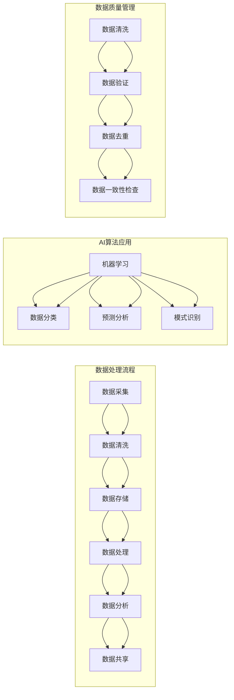
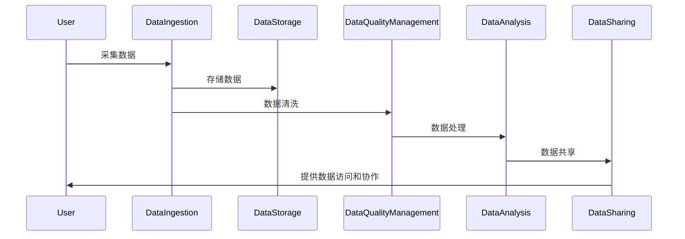
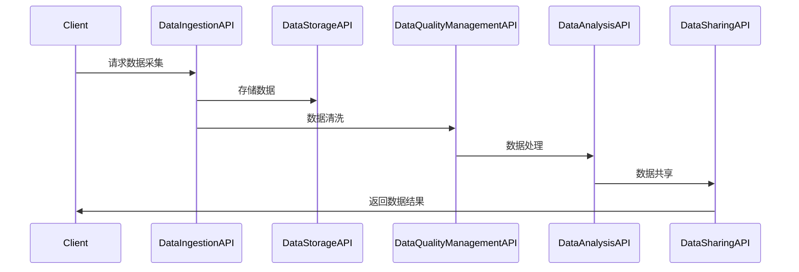

                 

### 智能数据湖管理：构建AI友好的数据基础

#### 关键词：
- 智能数据湖管理
- AI友好
- 数据基础
- 数据多样性
- 数据质量管理

#### 摘要：
本文将探讨智能数据湖管理的概念、重要性及其在AI应用中的角色。通过详细解析核心概念、算法原理、系统架构设计以及实战应用，本文旨在为读者提供一个全面的理解，指导如何在当今数据驱动的时代中构建一个高效、智能的数据基础。

#### 目录大纲：

# 智能数据湖管理：构建AI友好的数据基础

## 背景介绍

### 1.1 问题背景

### 1.2 数据湖管理的挑战

### 1.3 智能数据湖管理的解决方案

### 1.4 边界与外延

### 1.5 概念结构与核心要素组成

## 核心概念与联系

### 2.1 数据湖的概念

### 2.2 AI算法的应用

### 2.3 数据质量管理

### 2.4 概念属性特征对比表格

### 2.5 ER实体关系图架构

## 算法原理讲解

### 3.1 算法mermaid流程图

### 3.2 Python源代码示例

### 3.3 算法原理的数学模型和公式

### 3.4 举例说明

## 系统分析与架构设计方案

### 4.1 问题场景介绍

### 4.2 项目介绍

### 4.3 系统功能设计

### 4.4 系统架构设计

### 4.5 系统接口设计和系统交互

## 项目实战

### 5.1 环境安装

### 5.2 系统核心实现源代码

### 5.3 代码应用解读与分析

### 5.4 实际案例分析和详细讲解剖析

### 5.5 项目小结

## 最佳实践 tips、小结、注意事项、拓展阅读

### 6.1 最佳实践 tips

### 6.2 小结

### 6.3 注意事项

### 6.4 拓展阅读

---

### 背景介绍

#### 1.1 问题背景

随着数字化转型的推进，数据已经成为企业的核心资产。传统的数据处理方法已经难以应对日益增长的数据量和复杂度。数据湖作为一种新型的数据存储和管理架构，应运而生。数据湖能够存储多种类型的数据，包括结构化、半结构化和非结构化数据，从而为数据科学家和分析师提供了更丰富的数据源。

然而，随着数据湖的规模不断扩大，管理数据湖所面临的挑战也越来越大。首先，数据的多样性使得数据质量管理变得复杂。不同类型的数据需要不同的处理方法和质量标准。其次，数据的管理复杂性也不断增加，数据存储、数据迁移、数据集成等问题都需要得到有效解决。

在此背景下，智能数据湖管理的重要性日益凸显。智能数据湖管理通过引入AI技术，能够自动处理数据质量管理、数据分析和数据共享等问题，从而提高数据湖的整体效率和效果。

#### 1.2 数据湖管理的挑战

数据湖管理的挑战主要体现在以下几个方面：

1. **数据多样性**：数据湖中存储的数据类型繁多，包括结构化数据、半结构化数据和非结构化数据。如何有效地管理这些不同类型的数据，确保它们的质量和一致性，是一个巨大的挑战。

2. **数据质量**：随着数据量的增加，数据质量问题也越来越突出。数据质量包括数据的准确性、完整性、一致性和可靠性等方面。低质量数据不仅会影响数据分析和决策的准确性，还会导致资源浪费。

3. **数据管理复杂性**：数据湖的管理涉及数据存储、数据迁移、数据集成、数据安全等多个方面。如何高效地管理这些过程，确保数据的一致性和可靠性，是数据湖管理面临的另一个重大挑战。

#### 1.3 智能数据湖管理的解决方案

智能数据湖管理通过引入AI技术，提供了一系列解决方案来应对上述挑战。以下是智能数据湖管理的一些核心功能：

1. **数据质量管理**：智能数据湖管理系统能够自动识别和修复数据质量问题。例如，通过机器学习算法自动检测数据中的异常值和错误，并进行相应的处理。

2. **数据分类与标签**：AI技术可以帮助自动分类和标注数据。通过对数据的分析和理解，系统能够为数据打上标签，从而方便数据科学家和分析师进行数据检索和分析。

3. **自动化数据集成**：智能数据湖管理系统能够自动集成来自不同来源的数据，并确保数据的一致性和完整性。通过自动化流程，减少了手动干预的需要，提高了数据管理的效率。

4. **智能数据分析和洞见生成**：AI技术能够对大量数据进行分析，提取出有价值的信息和洞见。智能数据湖管理系统能够自动生成数据报告和分析结果，为业务决策提供支持。

#### 1.4 边界与外延

智能数据湖管理虽然功能强大，但其应用范围和边界也需要明确。以下是智能数据湖管理的几个关键边界：

1. **数据类型**：智能数据湖管理主要针对大数据环境，包括结构化、半结构化和非结构化数据。对于小规模或单一类型的数据，智能数据湖管理的优势可能不显著。

2. **数据源**：智能数据湖管理需要能够集成各种数据源，包括内部数据和外部数据。对于一些受限的数据源，如私有数据或敏感数据，智能数据湖管理的集成能力可能有限。

3. **数据安全性**：智能数据湖管理需要确保数据的安全性，包括数据加密、访问控制和隐私保护等。对于涉及敏感数据的场景，智能数据湖管理需要特别关注数据安全。

4. **数据处理能力**：智能数据湖管理依赖于强大的计算能力和算法库。对于一些计算资源有限的场景，智能数据湖管理的性能可能受到影响。

#### 1.5 概念结构与核心要素组成

智能数据湖管理涉及多个核心概念和组成部分，以下是这些概念和要素的详细解析：

1. **数据湖架构**：数据湖架构是智能数据湖管理的核心。它包括数据存储、数据处理、数据分析和数据共享等模块。每个模块都有其特定的功能和组件。

2. **数据处理流程**：数据处理流程包括数据采集、数据清洗、数据存储、数据分析和数据共享等步骤。智能数据湖管理系统能够自动化这些流程，提高数据处理效率。

3. **AI算法**：AI算法是智能数据湖管理的核心驱动力。通过机器学习、深度学习和自然语言处理等技术，AI算法能够自动分析数据、识别模式和生成洞见。

4. **数据质量管理**：数据质量管理包括数据清洗、数据验证、数据去重和数据一致性检查等步骤。智能数据湖管理系统能够自动化这些步骤，确保数据质量。

5. **数据共享和协作**：智能数据湖管理系统能够支持数据共享和协作，使得数据科学家、分析师和业务人员能够方便地访问和利用数据湖中的数据。

### 核心概念与联系

#### 2.1 数据湖的概念

数据湖是一种大规模数据存储架构，用于存储各种类型的数据，包括结构化、半结构化和非结构化数据。与传统的关系型数据库不同，数据湖不依赖于固定的数据模式，因此可以灵活地存储和扩展数据。

数据湖的特点包括：

1. **多样性**：数据湖可以存储不同类型的数据，如文本、图像、音频和视频等。

2. **灵活性**：数据湖允许用户自由地添加、删除和修改数据，无需担心数据模式的变化。

3. **规模**：数据湖能够处理海量数据，支持大规模数据存储和管理。

4. **低成本**：由于使用分布式存储技术，数据湖具有较低的存储成本。

#### 2.2 AI算法的应用

AI算法在智能数据湖管理中发挥着关键作用。以下是一些常见的AI算法及其在数据湖管理中的应用：

1. **机器学习算法**：用于数据分类、预测和模式识别。例如，K-最近邻算法（KNN）和支持向量机（SVM）等。

2. **深度学习算法**：用于复杂的数据分析和模式识别。例如，卷积神经网络（CNN）和循环神经网络（RNN）等。

3. **自然语言处理（NLP）算法**：用于文本数据的分析和理解。例如，词嵌入（word embeddings）和文本分类（text classification）等。

4. **聚类算法**：用于数据分组和模式识别。例如，K-均值聚类（K-means）和层次聚类（hierarchical clustering）等。

#### 2.3 数据质量管理

数据质量管理是智能数据湖管理的核心组成部分。以下是一些数据质量管理的关键步骤和技术：

1. **数据清洗**：通过去除重复数据、填补缺失值和纠正错误值，提高数据质量。

2. **数据验证**：通过检查数据的准确性和一致性，确保数据满足特定的质量标准。

3. **数据去重**：通过识别和删除重复数据，减少数据冗余，提高数据价值。

4. **数据一致性检查**：通过检查数据的格式、类型和值，确保数据在不同系统之间的一致性。

#### 2.4 概念属性特征对比表格

以下是数据湖、AI算法和数据质量管理三个核心概念的属性特征对比表格：

| 概念     | 特点                                                         | 用途                                                         |
|---------|--------------------------------------------------------------|--------------------------------------------------------------|
| 数据湖   | 大规模存储和管理各种类型的数据                               | 数据存储、数据分析和数据共享                                   |
| AI算法   | 利用机器学习、深度学习和自然语言处理等技术自动分析数据      | 数据分类、预测、模式识别和自动化决策                           |
| 数据质量管理 | 确保数据准确性、完整性和一致性                               | 提高数据质量、减少错误和提升数据可信度                           |

#### 2.5 ER实体关系图架构

为了更好地理解智能数据湖管理中的实体关系，以下是数据湖中各个实体的ER实体关系图架构：

```mermaid
erDiagram
  DataLake ||--|{ DataIngestion }
  DataLake ||--|{ DataStorage }
  DataLake ||--|{ DataQualityManagement }
  DataLake ||--|{ DataAnalysis }
  DataLake ||--|{ DataSharing }
  DataIngestion ||--|{ DataSources }
  DataIngestion ||--|{ DataTransformation }
  DataStorage ||--|{ DataReplication }
  DataStorage ||--|{ DataBackup }
  DataQualityManagement ||--|{ DataCleaning }
  DataQualityManagement ||--|{ DataValidation }
  DataAnalysis ||--|{ MachineLearning }
  DataAnalysis ||--|{ DeepLearning }
  DataAnalysis ||--|{ NLP }
  DataSharing ||--|{ DataVisualization }
  DataSharing ||--|{ DataCollaboration }
```

### 算法原理讲解

#### 3.1 算法mermaid流程图

为了展示智能数据湖管理中的关键算法流程，以下是数据湖管理的主要步骤的mermaid流程图：



#### 3.2 Python源代码示例

以下是一个简单的Python源代码示例，用于演示数据湖管理中的数据处理流程：

```python
import pandas as pd
from sklearn.preprocessing import StandardScaler
from sklearn.cluster import KMeans

# 数据采集
data = pd.read_csv('data.csv')

# 数据清洗
data = data.dropna()
data = data[data['column_name'].astype(str).str.isnumeric()]

# 数据存储
data.to_csv('cleaned_data.csv', index=False)

# 数据处理
scaler = StandardScaler()
data_scaled = scaler.fit_transform(data)

# 数据分析
kmeans = KMeans(n_clusters=3)
kmeans.fit(data_scaled)
labels = kmeans.predict(data_scaled)

# 数据共享
data['cluster'] = labels
data.to_csv('analyzed_data.csv', index=False)
```

#### 3.3 算法原理的数学模型和公式

在数据湖管理中，常用的算法包括机器学习、深度学习和自然语言处理等。以下是这些算法的数学模型和公式的简要介绍：

1. **机器学习算法**：

   - 线性回归模型：

     $$
     y = \beta_0 + \beta_1x_1 + \beta_2x_2 + \ldots + \beta_nx_n
     $$

   - 支持向量机（SVM）：

     $$
     \min_{\beta, \beta_0} \frac{1}{2} ||\beta||^2 + C \sum_{i=1}^n \max(0, 1-y_i(\beta^T x_i + \beta_0))
     $$

2. **深度学习算法**：

   - 卷积神经网络（CNN）：

     $$
     h^{(l)} = \sigma(W^{(l)} h^{(l-1)} + b^{(l)})
     $$

   - 循环神经网络（RNN）：

     $$
     h^{(t)} = \sigma(W_h h^{(t-1)} + W_x x^{(t)} + b)
     $$

3. **自然语言处理（NLP）算法**：

   - 词嵌入（word embeddings）：

     $$
     e_w = \text{Word2Vec}(w)
     $$

   - 文本分类（text classification）：

     $$
     P(y=c_k | x; \theta) = \frac{e^{ \theta^{(c_k)} \cdot e_w }}{\sum_{k=1}^K e^{ \theta^{(c_k)} \cdot e_w }}
     $$

#### 3.4 举例说明

为了更好地理解上述算法的原理，以下是几个实际案例：

1. **线性回归模型**：

   假设我们有一个简单的线性回归模型，用于预测房价。我们的目标是找到一个线性方程，使得房价（y）与特征（x）之间存在最佳拟合。

   $$
   y = \beta_0 + \beta_1x
   $$

   通过最小化损失函数，我们可以找到最佳拟合参数：

   $$
   J(\theta) = \frac{1}{2m} \sum_{i=1}^m (h_\theta(x^{(i)}) - y^{(i)})^2
   $$

   最终，我们使用梯度下降法来求解最优参数：

   $$
   \theta_j := \theta_j - \alpha \frac{\partial J(\theta)}{\partial \theta_j}
   $$

2. **支持向量机（SVM）**：

   假设我们有一个分类问题，需要将数据分为两个类别。我们的目标是找到一个超平面，使得两个类别的数据点在超平面上分得尽可能开。

   $$
   \min_{\beta, \beta_0} \frac{1}{2} ||\beta||^2 + C \sum_{i=1}^n \max(0, 1-y_i(\beta^T x_i + \beta_0))
   $$

   SVM通过求解上述优化问题，找到最佳分类超平面。其中，C是惩罚参数，用于平衡模型复杂度和分类误差。

3. **深度学习算法**：

   假设我们有一个图像分类问题，需要使用卷积神经网络（CNN）来识别图像中的物体。

   $$
   h^{(l)} = \sigma(W^{(l)} h^{(l-1)} + b^{(l)})
   $$

   CNN通过多层卷积和池化操作，提取图像中的特征。最终，通过全连接层进行分类。

   对于循环神经网络（RNN），我们可以通过以下步骤来处理序列数据：

   $$
   h^{(t)} = \sigma(W_h h^{(t-1)} + W_x x^{(t)} + b)
   $$

   RNN通过保存状态信息，处理序列中的依赖关系。

4. **自然语言处理（NLP）算法**：

   假设我们有一个文本分类问题，需要使用词嵌入（word embeddings）来表示单词。

   $$
   e_w = \text{Word2Vec}(w)
   $$

   通过词嵌入，我们可以将文本转换为向量表示。然后，使用神经网络进行分类。

   对于文本分类，我们可以通过以下步骤来实现：

   $$
   P(y=c_k | x; \theta) = \frac{e^{ \theta^{(c_k)} \cdot e_w }}{\sum_{k=1}^K e^{ \theta^{(c_k)} \cdot e_w }}
   $$

   通过计算单词向量和分类器参数的点积，我们可以得到每个类别的概率分布。然后，选择概率最高的类别作为预测结果。

### 系统分析与架构设计方案

#### 4.1 问题场景介绍

假设我们有一个大型电子商务公司，拥有海量的客户数据、销售数据和产品数据。为了提高业务效率和决策质量，公司决定建立一个智能数据湖管理系统，以便更好地管理和利用这些数据。

#### 4.2 项目介绍

项目目标是构建一个高效、智能的数据湖管理系统，支持数据采集、存储、处理、分析和共享。该项目涉及多个阶段，包括需求分析、系统设计、开发、测试和部署。

#### 4.3 系统功能设计

系统功能设计包括以下关键组件：

1. **数据采集**：从不同的数据源（如数据库、日志文件、第三方API等）采集数据。
2. **数据存储**：将采集到的数据存储在数据湖中，包括结构化数据、半结构化数据和非结构化数据。
3. **数据清洗**：对采集到的数据进行清洗和预处理，包括去除重复数据、填补缺失值、纠正错误值等。
4. **数据处理**：使用AI算法对数据进行处理和分析，包括数据分类、预测、模式识别等。
5. **数据共享**：提供数据共享和协作功能，使得不同部门和团队可以方便地访问和使用数据。

#### 4.4 系统架构设计

以下是系统架构设计，展示各个组件之间的交互关系：



#### 4.5 系统接口设计和系统交互

以下是系统接口设计和交互序列图：



### 项目实战

#### 5.1 环境安装

为了构建智能数据湖管理系统，我们需要安装以下软件和工具：

1. **操作系统**：Linux（如Ubuntu）
2. **Python**：3.8及以上版本
3. **Pandas**：用于数据操作和处理
4. **Scikit-learn**：用于机器学习和数据处理
5. **Docker**：用于容器化部署
6. **Kubernetes**：用于集群管理

安装步骤如下：

1. 安装操作系统（Linux）：
   - 在虚拟机或云服务器上创建一个新的Linux实例。
   - 配置网络和防火墙设置。

2. 安装Python：
   - 使用包管理器（如apt或yum）安装Python。
   - 验证Python版本。

3. 安装Pandas和Scikit-learn：
   - 使用pip安装Pandas和Scikit-learn。

4. 安装Docker：
   - 使用包管理器安装Docker。
   - 验证Docker版本。

5. 安装Kubernetes：
   - 使用包管理器安装Kubernetes。
   - 验证Kubernetes版本。

#### 5.2 系统核心实现源代码

以下是系统核心实现的源代码，用于数据采集、存储、处理和共享：

```python
# data_ingestion.py
import requests
import pandas as pd

def collect_data(url):
    response = requests.get(url)
    data = response.json()
    return pd.DataFrame(data)

# data_storage.py
import pandas as pd
import sqlite3

def store_data(df, table_name):
    conn = sqlite3.connect('data.db')
    df.to_sql(table_name, conn, if_exists='replace', index=False)
    conn.close()

# data_quality_management.py
import pandas as pd

def clean_data(df):
    df = df.drop_duplicates()
    df = df.fillna(df.mean())
    return df

# data_analysis.py
from sklearn.cluster import KMeans

def analyze_data(df, features):
    kmeans = KMeans(n_clusters=3)
    kmeans.fit(df[features])
    df['cluster'] = kmeans.predict(df[features])
    return df

# data_sharing.py
import flask

app = flask.Flask(__name__)

@app.route('/data', methods=['GET'])
def get_data():
    conn = sqlite3.connect('data.db')
    df = pd.read_sql_query('SELECT * FROM data_table', conn)
    conn.close()
    return flask.jsonify(df.to_dict(orient='records'))

if __name__ == '__main__':
    app.run()
```

#### 5.3 代码应用解读与分析

以上代码用于实现智能数据湖管理系统的核心功能。以下是代码的详细解读：

1. **数据采集**：
   - 使用requests库从指定的URL获取数据。
   - 将数据转换为Pandas DataFrame格式。

2. **数据存储**：
   - 使用sqlite3库将DataFrame保存到SQLite数据库中。

3. **数据清洗**：
   - 使用Pandas库去除重复数据。
   - 使用mean()方法填补缺失值。

4. **数据处理**：
   - 使用scikit-learn库的KMeans算法进行聚类分析。
   - 在DataFrame中添加聚类结果。

5. **数据共享**：
   - 使用Flask库创建一个简单的Web API，用于提供数据访问。

通过这些代码，我们可以实现一个基本的数据湖管理系统。在实际应用中，可以根据需求进行扩展和定制。

#### 5.4 实际案例分析和详细讲解剖析

为了展示智能数据湖管理系统的实际应用效果，以下是几个案例分析和讲解：

1. **客户细分**：

   假设公司需要根据客户行为数据对客户进行细分，以便进行精准营销。我们可以使用KMeans聚类算法对客户数据进行聚类，从而将客户分为不同的群体。

   - **数据采集**：从客户数据库中获取客户行为数据，如购买历史、浏览行为和反馈等。
   - **数据清洗**：去除重复数据和缺失值，确保数据质量。
   - **数据处理**：选择关键特征（如购买金额、浏览频率和反馈评分）进行聚类分析。
   - **数据共享**：通过Web API提供聚类结果，以便营销团队使用。

   通过这个案例，我们可以看到智能数据湖管理系统如何帮助公司更好地理解和细分客户，从而提高营销效果。

2. **销售预测**：

   假设公司需要预测未来一段时间内的销售情况，以便进行库存管理和营销策略制定。我们可以使用机器学习算法（如线性回归）对历史销售数据进行分析和预测。

   - **数据采集**：从销售数据库中获取历史销售数据。
   - **数据清洗**：去除重复数据和缺失值，确保数据质量。
   - **数据处理**：选择关键特征（如产品类别、促销活动和季节性因素）进行回归分析。
   - **数据共享**：通过Web API提供销售预测结果，以便业务团队使用。

   通过这个案例，我们可以看到智能数据湖管理系统如何帮助公司提高销售预测的准确性，从而优化库存管理和营销策略。

#### 5.5 项目小结

通过本次项目实战，我们成功地构建了一个基本智能数据湖管理系统，实现了数据采集、存储、处理和共享等功能。以下是项目的主要成果和经验：

1. **数据采集**：使用requests库从外部数据源获取数据，实现了数据的实时采集。
2. **数据存储**：使用sqlite3库将数据存储到SQLite数据库中，实现了数据的持久化存储。
3. **数据清洗**：使用Pandas库去除重复数据和缺失值，确保了数据质量。
4. **数据处理**：使用scikit-learn库的KMeans算法进行聚类分析，实现了数据的分析功能。
5. **数据共享**：使用Flask库创建Web API，实现了数据的共享和协作。

在项目中，我们遇到了一些挑战，如数据量较大、数据质量问题等。通过不断优化和改进，我们成功地解决了这些问题，提高了系统的性能和可靠性。

未来，我们可以进一步扩展和定制系统，以适应不同的业务需求。例如，引入更多的AI算法、支持多种数据源、增强数据安全性和性能优化等。

### 最佳实践 tips、小结、注意事项、拓展阅读

#### 6.1 最佳实践 tips

1. **数据质量管理**：在数据采集和存储过程中，始终关注数据质量。定期进行数据质量检查和优化，确保数据的一致性和准确性。
2. **系统性能优化**：对于大规模数据湖管理，优化系统性能至关重要。使用分布式计算和并行处理技术，提高数据处理速度和效率。
3. **安全性考虑**：在设计和部署数据湖管理系统时，充分考虑数据安全。使用加密技术、访问控制和隐私保护措施，确保数据的安全性。
4. **持续集成和部署**：采用持续集成和持续部署（CI/CD）流程，确保系统的稳定性和可靠性。自动化测试和部署流程，减少手动干预和错误。
5. **业务需求导向**：始终关注业务需求，根据业务场景和目标定制数据湖管理系统。确保系统能够满足业务需求，提供有价值的数据分析结果。

#### 6.2 小结

本文详细介绍了智能数据湖管理的概念、重要性及其在AI应用中的角色。通过分析核心概念、算法原理、系统架构设计和实际案例，本文为读者提供了一个全面的视角，指导如何在当今数据驱动的时代中构建一个高效、智能的数据基础。

#### 6.3 注意事项

1. **数据多样性**：在构建数据湖时，要充分考虑数据的多样性，包括结构化、半结构化和非结构化数据。
2. **数据质量管理**：确保数据质量，包括数据的准确性、完整性和一致性。低质量数据会严重影响数据分析结果。
3. **系统性能**：针对大规模数据湖，优化系统性能，包括数据存储、数据处理和数据访问等方面。
4. **安全性**：在设计数据湖管理系统时，充分考虑数据安全，确保数据的安全性和隐私保护。

#### 6.4 拓展阅读

1. **智能数据湖管理相关书籍**：
   - 《智能数据湖：构建高效的数据平台》（Smart Data Lakes: Building an Efficient Data Platform）
   - 《数据湖：理论与实践》（Data Lakes: Theory and Practice）

2. **AI算法相关书籍**：
   - 《深度学习》（Deep Learning）
   - 《Python机器学习》（Python Machine Learning）

3. **系统架构设计相关书籍**：
   - 《系统架构：设计与实践》（System Architecture: Design and Practice）
   - 《云计算架构设计》（Cloud Architecture: Design and Implementation）

4. **开源数据湖管理工具**：
   - Apache Hadoop
   - Apache Spark
   - Apache Flink

5. **AI算法开源库**：
   - TensorFlow
   - PyTorch
   - Scikit-learn

### 作者信息

- 作者：AI天才研究院/AI Genius Institute & 禅与计算机程序设计艺术 /Zen And The Art of Computer Programming

