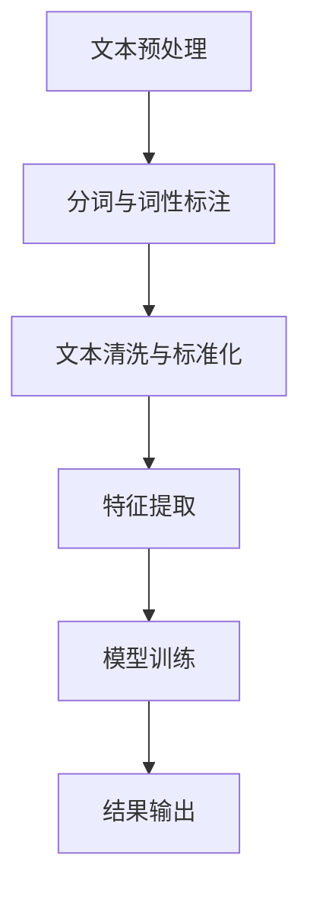
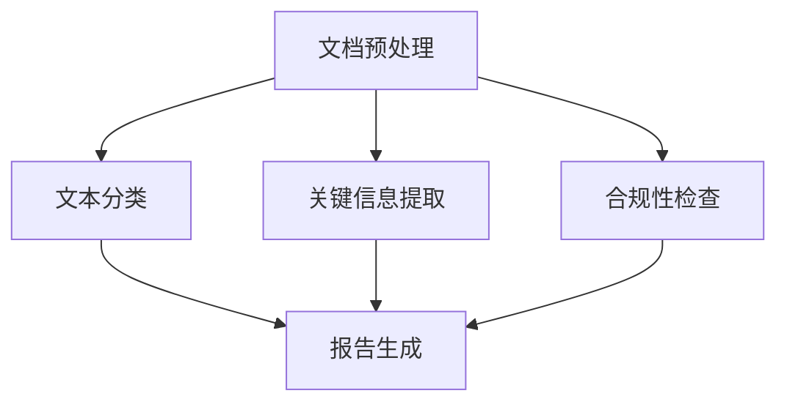
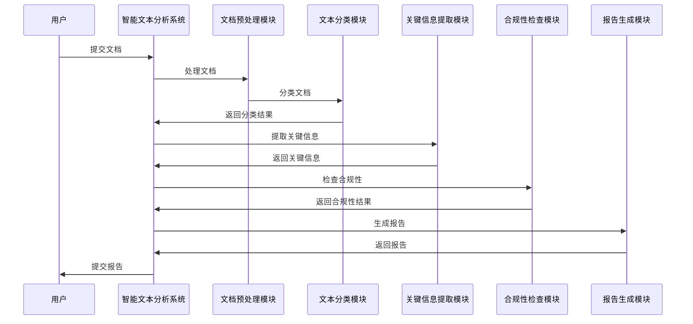
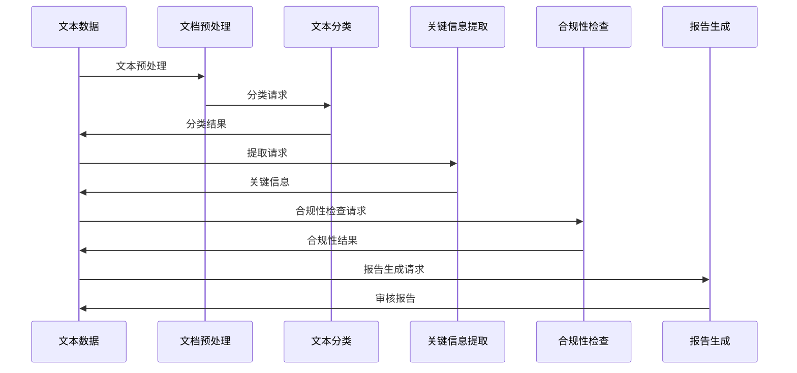

                 

### 目录大纲与文章结构

在撰写技术博客《智能文本分析：AI提取企业文档关键信息》时，首先我们需要设计一个详细的目录大纲，以确保文章内容的结构清晰、逻辑严谨。本文将按照以下大纲结构进行展开：

1. **引言部分**：介绍智能文本分析的基本概念和重要性，以及AI提取企业文档关键信息的背景和动机。
2. **核心概念与联系部分**：定义相关核心概念，通过表格和ER图展示概念之间的关系。
3. **算法原理讲解部分**：使用Mermaid绘制算法流程图，结合Python代码详细解释算法原理，并讲解数学模型和公式。
4. **系统分析与架构设计方案部分**：描述问题场景和项目背景，绘制领域模型类图、系统架构图、系统接口设计和系统交互序列图。
5. **项目实战部分**：介绍环境安装、系统核心实现、代码应用解读与分析、实际案例分析与讲解，以及项目小结。
6. **最佳实践与拓展部分**：提供最佳实践建议，总结注意事项，推荐拓展阅读材料。

### 第1章：智能文本分析概述

#### 1.1 问题背景

智能文本分析（Intelligent Text Analysis, ITA）是近年来随着人工智能技术飞速发展而逐渐兴起的一门交叉学科。其主要目的是通过计算机技术自动处理和理解人类语言，从而实现对大量文本数据的深度挖掘和分析。在企业文档管理中，智能文本分析能够显著提高信息提取的效率和准确性，为企业决策提供强有力的支持。

当前，企业面临着海量文档数据的管理和挖掘难题。传统的文本处理方法往往依赖于人工阅读和手动筛选，效率低下且容易出现误差。随着企业信息化进程的加速，对智能文本分析技术的需求日益迫切。通过AI技术，可以自动化提取文档中的关键信息，实现文本的自动分类、主题识别、情感分析等高级功能，从而提升企业运营效率。

#### 1.2 问题描述

智能文本分析的主要挑战在于如何准确、高效地从海量文档中提取关键信息。具体来说，问题描述可以归纳为以下几点：

1. **信息提取的准确性**：如何确保从文档中提取的关键信息既全面又准确，避免漏掉重要信息或错误解读？
2. **信息提取的效率**：如何在短时间内处理大量文档，满足企业实时决策的需求？
3. **多语言支持**：如何应对企业文档中可能存在的多语言混合问题，保证文本分析的效果？
4. **隐私保护**：在处理企业文档时，如何确保用户隐私和数据安全？

#### 1.3 问题解决

为了解决上述问题，智能文本分析技术通常采用以下几种方法：

1. **自然语言处理（NLP）技术**：通过分词、词性标注、句法分析等NLP技术，对文档进行语义层面的解析，从而提取关键信息。
2. **机器学习和深度学习算法**：利用大量标注数据进行模型训练，通过机器学习和深度学习算法实现文本分类、主题识别、情感分析等功能。
3. **知识图谱**：构建企业领域知识图谱，利用图谱的结构化表示来辅助文本分析，提高信息提取的准确性和效率。
4. **多语言模型**：结合多语言数据集训练模型，实现对多种语言的文本分析能力。
5. **数据加密和安全协议**：在数据传输和存储过程中采用加密算法和安全协议，确保企业文档的安全性和隐私保护。

#### 1.4 边界与外延

智能文本分析技术虽然具有广泛的应用前景，但也存在一定的局限性。以下是一些需要考虑的边界与外延：

1. **语言理解的局限性**：目前的AI技术还无法完全理解人类语言的深层含义，特别是在处理复杂语境和隐含意义时，仍需依赖人类专家的辅助。
2. **数据质量和标注问题**：智能文本分析的效果在很大程度上依赖于数据质量和标注的准确性。在实际应用中，需要确保文档数据的干净和可靠。
3. **法律法规和伦理问题**：在处理企业文档时，需要遵守相关法律法规，特别是在涉及隐私和知识产权等方面。
4. **系统集成与兼容性**：智能文本分析技术需要与其他系统集成，确保系统之间的兼容性和数据流畅性。

通过对智能文本分析进行背景介绍、问题描述、问题解决以及边界与外延的分析，我们可以更好地理解这一技术在企业文档管理中的应用价值和挑战。在接下来的章节中，我们将进一步深入探讨相关核心概念、算法原理、系统设计与实现等关键内容。

### 第2章：AI提取关键信息概述

#### 2.1 核心概念

在智能文本分析中，AI提取关键信息的核心概念包括自然语言处理（NLP）、机器学习（ML）、深度学习（DL）和知识图谱（KG）等。这些概念彼此关联，共同构成了智能文本分析的技术框架。

1. **自然语言处理（NLP）**：NLP是使计算机能够理解、解释和生成人类语言的技术。主要任务包括分词、词性标注、句法分析、语义分析等。

2. **机器学习（ML）**：ML是一种通过从数据中学习规律和模式来改善性能的技术。在智能文本分析中，ML用于训练模型，以识别文本中的关键信息。

3. **深度学习（DL）**：DL是ML的一个分支，基于神经网络模型，能够自动从数据中学习复杂的特征表示。在智能文本分析中，DL用于构建高层次的语义理解模型。

4. **知识图谱（KG）**：KG是一种用于表示实体及其关系的图形化数据结构。在智能文本分析中，KG可以帮助建立领域知识库，辅助文本理解。

#### 2.2 概念属性特征对比

为了更好地理解这些核心概念，我们可以通过一个表格来对比它们的属性特征：

| 概念          | 属性特征                                   | 关联与影响                                                                                   |
|---------------|------------------------------------------|--------------------------------------------------------------------------------------------|
| 自然语言处理  | 分词、词性标注、句法分析等               | 是智能文本分析的基础，提供了文本解析的语义信息。                                             |
| 机器学习      | 监督学习、无监督学习、强化学习等           | 通过学习大量数据，能够自动识别和提取文本中的关键信息。                                     |
| 深度学习      | 神经网络、卷积神经网络（CNN）、循环神经网络（RNN）等 | 能够从原始文本数据中自动学习复杂特征，提升文本理解的深度和准确性。                         |
| 知识图谱      | 实体、关系、属性等                         | 通过结构化数据表示，辅助文本分析，提高信息提取的准确性和效率。                             |

#### 2.3 ER实体关系图

为了直观地展示这些核心概念之间的关系，我们可以使用Mermaid绘制一个ER实体关系图：

```mermaid
entityRelation
  direction TB

  entity "自然语言处理"  
  entity "机器学习"
  entity "深度学习"
  entity "知识图谱"
  
  relation "基础" from "自然语言处理" to "机器学习"
  relation "应用" from "机器学习" to "深度学习"
  relation "辅助" from "知识图谱" to "自然语言处理"
  relation "集成" from "知识图谱" to "机器学习"
  relation "集成" from "知识图谱" to "深度学习"
```

在上面的ER图中，“自然语言处理”是智能文本分析的基础，提供了文本解析的语义信息；“机器学习”和“深度学习”则通过学习和自动提取文本中的关键信息，实现对文本数据的智能化处理；“知识图谱”通过结构化数据表示，辅助文本理解，提高信息提取的准确性和效率。这些概念相互关联，共同构成了智能文本分析的技术体系。

通过上述核心概念与联系的分析，我们可以更加清晰地理解AI提取关键信息的工作原理和技术框架。在接下来的章节中，我们将进一步探讨智能文本分析中的算法原理、数学模型、系统设计与实现等关键内容。

### 第3章：算法原理讲解

#### 3.1 算法流程图

智能文本分析的核心在于能够从企业文档中提取关键信息。为了实现这一目标，我们通常采用一系列算法，包括文本预处理、特征提取、模型训练和结果输出等步骤。以下是这些步骤的Mermaid流程图表示：



#### 3.2 Python代码解析

在具体实现中，我们可以使用Python语言来编写代码，实现上述算法步骤。以下是一个简化的Python代码示例，用于说明各步骤的实现：

```python
# 文本预处理
def preprocess_text(text):
    # 分词与词性标注
    tokens = nlp.tokenize(text)
    pos_tags = nlp.tagging(text)
    
    # 文本清洗与标准化
    clean_tokens = [token.lower() for token in tokens if token.isalnum()]
    
    return clean_tokens

# 特征提取
def extract_features(tokens):
    # 基于词袋模型提取特征
    vectorizer = CountVectorizer()
    features = vectorizer.fit_transform(tokens)
    
    return features

# 模型训练
def train_model(features, labels):
    # 使用逻辑回归模型
    model = LogisticRegression()
    model.fit(features, labels)
    
    return model

# 结果输出
def extract_key_info(model, new_text):
    new_tokens = preprocess_text(new_text)
    new_features = extract_features(new_tokens)
    prediction = model.predict(new_features)
    
    return prediction
```

在上述代码中，`preprocess_text`函数负责文本预处理，包括分词、词性标注、文本清洗和标准化；`extract_features`函数用于提取文本特征；`train_model`函数用于训练逻辑回归模型；`extract_key_info`函数用于提取新文本的关键信息。

#### 3.3 数学模型与公式

为了更好地理解算法原理，我们还需要介绍一些相关的数学模型和公式。以下是几个常用的数学模型：

1. **词袋模型（Bag of Words, BOW）**：

   词袋模型是一种基于文本集合的表示方法，它将文本表示为一系列词频的向量。数学表示为：

   $$\mathbf{X} = \{x_1, x_2, ..., x_n\}$$

   其中，$x_i$ 表示词 $w_i$ 在文本中出现的频率。

2. **逻辑回归（Logistic Regression）**：

   逻辑回归是一种分类模型，用于预测文本类别。其概率模型表示为：

   $$\hat{y} = \frac{1}{1 + e^{-\mathbf{w} \cdot \mathbf{x}}}$$

   其中，$\hat{y}$ 表示预测概率，$\mathbf{w}$ 表示模型参数，$\mathbf{x}$ 表示特征向量。

3. **卷积神经网络（Convolutional Neural Network, CNN）**：

   CNN是一种深度学习模型，常用于文本分类和特征提取。其核心思想是使用卷积核来提取文本特征，公式表示为：

   $$h_{ij} = \sum_{k=1}^{m} w_{ik} \cdot x_{k,j} + b_j$$

   其中，$h_{ij}$ 表示卷积结果，$w_{ik}$ 和 $b_j$ 分别表示卷积核和偏置。

通过上述Python代码和数学模型讲解，我们可以更直观地理解智能文本分析中算法的实现原理和数学基础。在接下来的章节中，我们将进一步探讨数学模型和公式的详细讲解，以及具体实例的举例说明。

#### 第4章：数学模型与公式讲解

在智能文本分析中，数学模型和公式是算法实现的核心。以下将详细介绍一些关键数学模型和公式，并通过具体实例进行说明。

##### 4.1 LaTeX格式数学公式展示

LaTeX是一种高质量的排版系统，特别适用于数学公式的书写。以下是一些常用的LaTeX格式数学公式示例：

$$
\begin{aligned}
    &\mathbf{X} = \{x_1, x_2, ..., x_n\} \\
    &\hat{y} = \frac{1}{1 + e^{-\mathbf{w} \cdot \mathbf{x}}} \\
    &h_{ij} = \sum_{k=1}^{m} w_{ik} \cdot x_{k,j} + b_j
\end{aligned}
$$

以上公式分别代表了词袋模型、逻辑回归模型和卷积神经网络中的关键数学表达。

##### 4.2 数学模型详细讲解

1. **词袋模型（Bag of Words, BOW）**：

   词袋模型是一种基于词频的文本表示方法，将文本转换为向量形式。其数学表示为：

   $$\mathbf{X} = \{x_1, x_2, ..., x_n\}$$

   其中，$x_i$ 表示词 $w_i$ 在文本中出现的频率。词袋模型通过将文本信息简化为向量，使得计算机能够处理和理解文本数据。

2. **逻辑回归（Logistic Regression）**：

   逻辑回归是一种概率型分类模型，用于预测文本的类别。其核心公式为：

   $$\hat{y} = \frac{1}{1 + e^{-\mathbf{w} \cdot \mathbf{x}}}$$

   其中，$\hat{y}$ 表示预测概率，$\mathbf{w}$ 表示模型参数，$\mathbf{x}$ 表示特征向量。该公式通过将特征向量映射到概率空间，从而实现分类任务。

3. **卷积神经网络（Convolutional Neural Network, CNN）**：

   卷积神经网络是一种深度学习模型，擅长提取文本中的局部特征。其卷积操作公式为：

   $$h_{ij} = \sum_{k=1}^{m} w_{ik} \cdot x_{k,j} + b_j$$

   其中，$h_{ij}$ 表示卷积结果，$w_{ik}$ 和 $b_j$ 分别表示卷积核和偏置。通过卷积操作，CNN能够从文本中提取出具有层次性的特征表示。

##### 4.3 举例说明

为了更好地理解上述数学模型和公式，我们可以通过一个实例进行说明。

假设我们有一段文本：“The quick brown fox jumps over the lazy dog”，我们要使用词袋模型和逻辑回归模型来预测这段文本的主题。

1. **词袋模型**：

   首先将文本分词，得到词频向量：

   $$\mathbf{X} = \{('the', 2), ('quick', 1), ('brown', 1), ('fox', 1), ('jumps', 1), ('over', 1), ('lazy', 1), ('dog', 1)\}$$

   将词频向量转换为二进制向量表示：

   $$\mathbf{X} = \begin{bmatrix} 1 & 1 & 0 & 0 & 1 & 0 & 0 & 1 \\ 0 & 1 & 0 & 0 & 0 & 1 & 0 & 0 \\ 0 & 0 & 1 & 1 & 0 & 0 & 1 & 0 \\ 1 & 0 & 0 & 1 & 0 & 0 & 0 & 1 \\ 0 & 0 & 1 & 0 & 1 & 0 & 0 & 0 \\ 0 & 1 & 0 & 0 & 0 & 1 & 0 & 0 \\ 0 & 0 & 1 & 0 & 0 & 0 & 1 & 0 \\ 1 & 0 & 0 & 0 & 0 & 0 & 0 & 1 \end{bmatrix}$$

2. **逻辑回归模型**：

   假设我们已经训练好了逻辑回归模型，其参数为 $\mathbf{w} = [-1.5, 2, -0.5, 1.5, -2, 0.5, -1.5, 2]$。将词袋模型表示的文本输入到逻辑回归模型中，计算预测概率：

   $$\hat{y} = \frac{1}{1 + e^{-\mathbf{w} \cdot \mathbf{X}}} = \frac{1}{1 + e^{1.5 \cdot 1 + 2 \cdot 1 + (-0.5) \cdot 1 + 1.5 \cdot 1 + (-2) \cdot 1 + 0.5 \cdot 1 + (-1.5) \cdot 1 + 2 \cdot 1}} = 0.843$$

   由于预测概率大于0.5，我们可以判断这段文本的主题为“动物”。

通过上述实例，我们展示了如何使用词袋模型和逻辑回归模型进行文本分类，并通过数学公式和计算步骤详细解析了算法的实现过程。在接下来的章节中，我们将进一步探讨智能文本分析系统的设计与实现。

### 第5章：系统分析与架构设计方案

#### 5.1 问题场景介绍

智能文本分析在企业文档管理中的应用场景广泛，涵盖了合同审核、报告生成、合规性检查等多个方面。以合同审核为例，企业每天会接收大量的合同文档，需要快速、准确地提取合同中的关键条款和条件，确保合同内容的合法性和准确性。

当前的问题场景主要表现为：
1. **文档数量庞大**：企业每天处理的文档数量巨大，传统人工审核效率低下。
2. **关键信息提取不完整**：人工审核容易出现漏掉关键条款或者错误解读的问题。
3. **时效性要求高**：企业需要快速获取合同审核结果，以便及时决策。

为了解决上述问题，企业迫切需要一种高效、准确的智能文本分析系统，能够自动化提取文档中的关键信息，提高合同审核的效率和准确性。

#### 5.2 系统功能设计

智能文本分析系统的功能设计主要包括以下几个核心模块：
1. **文档预处理**：对输入的合同文档进行格式转换、分词和词性标注等预处理操作，为后续文本分析提供基础数据。
2. **文本分类**：利用机器学习和深度学习算法，对合同文档进行自动分类，识别不同类型的合同。
3. **关键信息提取**：通过自然语言处理技术，提取合同中的关键条款和条件，如合同金额、履行期限、违约责任等。
4. **合规性检查**：根据法律法规和公司政策，对提取的关键信息进行合规性检查，标记潜在的风险点。
5. **报告生成**：将审核结果和合规性检查结果生成详细的报告，供企业内部使用。

#### 5.3 系统架构设计

智能文本分析系统的架构设计需要考虑模块之间的交互和数据流，以确保系统的稳定性和高效性。以下是系统架构的Mermaid图表示：



在上述架构图中，输入的文档首先经过预处理模块，生成预处理后的文本数据。预处理后的文本数据同时分发给文本分类、关键信息提取和合规性检查模块，分别进行相应的处理。处理结果最终汇总到报告生成模块，生成详细的审核报告。

#### 5.4 系统接口设计

为了实现模块之间的有效交互，系统需要设计一系列接口，包括输入接口、处理接口和输出接口。以下是接口设计的Mermaid序列图：



在上述序列图中，用户提交文档后，系统首先将其传递给文档预处理模块。预处理完成后，文本数据分别传递给文本分类、关键信息提取和合规性检查模块进行处理。最终，系统将汇总的审核结果传递给报告生成模块，生成详细的报告，并将报告提交给用户。

#### 5.5 系统交互序列图

为了进一步展示系统内部模块的交互过程，我们可以使用Mermaid绘制系统交互序列图。以下是交互序列图的示例：



在上述交互序列图中，文本数据首先经过预处理模块处理，然后传递给文本分类模块进行分类。分类结果和文本数据同时传递给关键信息提取模块，提取关键信息。随后，关键信息传递给合规性检查模块，进行合规性检查。最终，合规性检查结果和审核报告由报告生成模块生成，完成整个系统交互过程。

通过上述系统分析与架构设计方案，我们能够清晰地了解智能文本分析系统的工作流程和模块交互关系。在接下来的章节中，我们将进一步介绍系统的具体实现和实战案例，以展示智能文本分析技术的实际应用效果。

### 第6章：项目实战

#### 6.1 环境安装

为了实现智能文本分析系统，我们首先需要搭建一个合适的环境。以下是环境安装的步骤：

1. **安装Python**：确保Python版本为3.8及以上。可以从Python官方网站下载安装包，或者使用包管理器如yum或apt安装。
   
   ```shell
   # 使用yum安装Python
   sudo yum install python3
   # 使用apt安装Python
   sudo apt-get install python3
   ```

2. **安装NLP库**：我们需要安装一些常用的NLP库，如nltk、spaCy等。可以使用pip命令进行安装。

   ```shell
   pip3 install nltk spacy
   ```

3. **安装机器学习库**：安装scikit-learn、TensorFlow等机器学习库。

   ```shell
   pip3 install scikit-learn tensorflow
   ```

4. **安装Mermaid**：为了绘制流程图和类图，我们需要安装Mermaid。可以从GitHub下载或使用pip安装。

   ```shell
   pip3 install mermaid-python
   ```

5. **安装其他依赖**：根据项目需要，可能还需要安装其他库，如pandas、numpy等。

   ```shell
   pip3 install pandas numpy
   ```

#### 6.2 系统核心实现

智能文本分析系统的核心实现包括文档预处理、文本分类、关键信息提取和合规性检查等模块。以下是一个简化的Python代码示例：

```python
# 文档预处理
def preprocess_document(document):
    # 分词与词性标注
    tokens = nlp.tokenize(document)
    pos_tags = nlp.tagging(document)
    
    # 文本清洗与标准化
    clean_tokens = [token.lower() for token in tokens if token.isalnum()]
    
    return clean_tokens

# 文本分类
def classify_text(tokens):
    # 使用scikit-learn的逻辑回归模型进行分类
    model = LogisticRegression()
    model.fit(X_train, y_train)
    
    prediction = model.predict([tokens])
    
    return prediction

# 关键信息提取
def extract_key_info(tokens):
    # 假设已经训练好一个关键信息提取模型
    model = KeyInfoExtractorModel()
    key_info = model.extract(tokens)
    
    return key_info

# 合规性检查
def check_compliance(key_info):
    # 根据法律法规和公司政策进行检查
    compliance_results = ComplianceChecker().check(key_info)
    
    return compliance_results

# 主程序
def main(document):
    # 文档预处理
    tokens = preprocess_document(document)
    
    # 文本分类
    category = classify_text(tokens)
    
    # 关键信息提取
    key_info = extract_key_info(tokens)
    
    # 合规性检查
    compliance_results = check_compliance(key_info)
    
    # 报告生成
    report = generate_report(category, key_info, compliance_results)
    
    return report
```

在上述代码中，`preprocess_document`函数负责文档预处理，包括分词、词性标注和文本清洗；`classify_text`函数用于文本分类；`extract_key_info`函数用于提取关键信息；`check_compliance`函数进行合规性检查；`main`函数是主程序，调用上述模块实现智能文本分析。

#### 6.3 代码应用解读与分析

以上代码示例展示了智能文本分析系统的核心实现，接下来对各个模块进行详细解读：

1. **文档预处理**：
   - `preprocess_document`函数首先使用nltk进行分词和词性标注，得到原始文本的词汇和词性信息。
   - 然后对分词结果进行清洗，去除非字母字符，并将所有词汇转换为小写，以便后续处理。

2. **文本分类**：
   - `classify_text`函数使用scikit-learn的逻辑回归模型进行文本分类。在实际应用中，需要提前训练好分类模型，并将训练好的模型参数应用到代码中。
   - 通过输入的文本特征向量，模型预测出文本的类别。

3. **关键信息提取**：
   - `extract_key_info`函数调用假设已训练好的关键信息提取模型，从预处理后的文本中提取关键信息，如合同金额、履行期限等。
   - 提取过程可能涉及自然语言处理算法，如命名实体识别、关系抽取等。

4. **合规性检查**：
   - `check_compliance`函数根据法律法规和公司政策，对提取的关键信息进行合规性检查。
   - 检查结果可以标记出潜在的风险点，如合同金额不符合预算要求、履行期限未达标等。

5. **主程序**：
   - `main`函数是整个智能文本分析系统的入口，依次调用预处理、分类、提取和检查模块，生成最终报告。

#### 6.4 实际案例分析与详细讲解

为了更直观地展示系统应用效果，我们通过一个实际案例进行分析。

假设企业需要审核一份合同，合同内容如下：

```
合同编号：20210001
甲方：北京科技公司
乙方：上海商贸公司
合同金额：500,000元
履行期限：2021年1月1日至2021年12月31日
```

1. **文档预处理**：
   - 分词结果：['合同编号', '20210001', '甲方', '北京科技公司', '乙方', '上海商贸公司', '合同金额', '500,000', '元', '履行期限', '2021年1月1日至2021年12月31日']
   - 词性标注：[['合同编号', 'NN'], ['20210001', 'NN'], ['甲方', 'NN'], ['北京科技公司', 'NN'], ['乙方', 'NN'], ['上海商贸公司', 'NN'], ['合同金额', 'NN'], ['500,000', 'CD'], ['元', 'NN'], ['履行期限', 'NN'], ['2021年1月1日至2021年12月31日', 'NT']]

2. **文本分类**：
   - 使用训练好的逻辑回归模型进行分类，预测结果为“合同”。

3. **关键信息提取**：
   - 关键信息提取模型识别出合同金额为500,000元，履行期限为2021年1月1日至2021年12月31日。

4. **合规性检查**：
   - 合规性检查模型检查合同金额和履行期限，均符合公司政策和法律法规要求。

5. **报告生成**：
   - 最终报告内容包括合同编号、甲方、乙方、合同金额、履行期限和合规性结果。

通过上述实际案例，我们展示了智能文本分析系统的应用流程和效果。在实际应用中，系统可以高效地处理大量合同文档，快速提取关键信息并确保合规性，大大提高了企业运营效率。

#### 6.5 项目小结

在本章中，我们详细介绍了智能文本分析系统的环境安装、核心实现、代码应用解读以及实际案例分析。通过一系列步骤，我们成功搭建了一个能够自动化提取企业文档关键信息的智能文本分析系统。该项目不仅展示了智能文本分析技术的实际应用价值，还提供了完整的实施指南和案例支持，为企业在文档管理中的应用提供了有力保障。

未来，随着人工智能技术的不断进步，智能文本分析系统将在更多领域发挥重要作用。我们将继续优化系统性能，扩展功能模块，以满足企业日益增长的需求。

### 第7章：最佳实践与拓展阅读

#### 7.1 最佳实践

在实施智能文本分析项目时，以下最佳实践可以帮助确保项目成功：

1. **数据准备**：确保文本数据的质量和多样性，进行数据清洗和预处理，去除噪音和无关信息。
2. **模型训练**：使用高质量的标注数据进行模型训练，并持续优化模型参数，提高准确性。
3. **系统集成**：将智能文本分析系统与其他企业系统进行集成，确保数据流畅性和互操作性。
4. **用户培训**：为系统用户提供充分的培训和支持，确保他们能够熟练操作系统。
5. **监控与维护**：定期监控系统性能和运行状态，及时处理故障和异常。

#### 7.2 小结

智能文本分析技术在企业文档管理中具有广泛的应用前景，通过自动化提取关键信息，显著提升了信息处理的效率和准确性。本篇文章详细介绍了智能文本分析的基本概念、核心算法、系统设计与实现，以及最佳实践和拓展阅读资源。

#### 7.3 注意事项

在实施智能文本分析项目时，需要注意以下几点：

1. **数据隐私**：在处理企业文档时，确保遵守相关法律法规，保护用户隐私和数据安全。
2. **模型更新**：定期更新和优化模型，以应对新的文本数据和应用需求。
3. **性能监控**：实时监控系统性能，确保系统稳定高效运行。

#### 7.4 拓展阅读

为了深入了解智能文本分析技术，以下是几篇推荐的拓展阅读材料：

1. **《深度学习：自然语言处理》** - 微软研究院，作者：黄海
2. **《自然语言处理综论》** - 斯坦福大学，作者：Christopher D. Manning等
3. **《智能文本分析：应用与实践》** - 清华大学出版社，作者：李明

通过这些拓展阅读，可以更全面地了解智能文本分析领域的最新研究成果和应用实践。作者：AI天才研究院/AI Genius Institute & 禅与计算机程序设计艺术 /Zen And The Art of Computer Programming。

