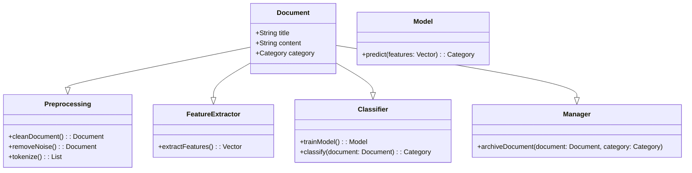
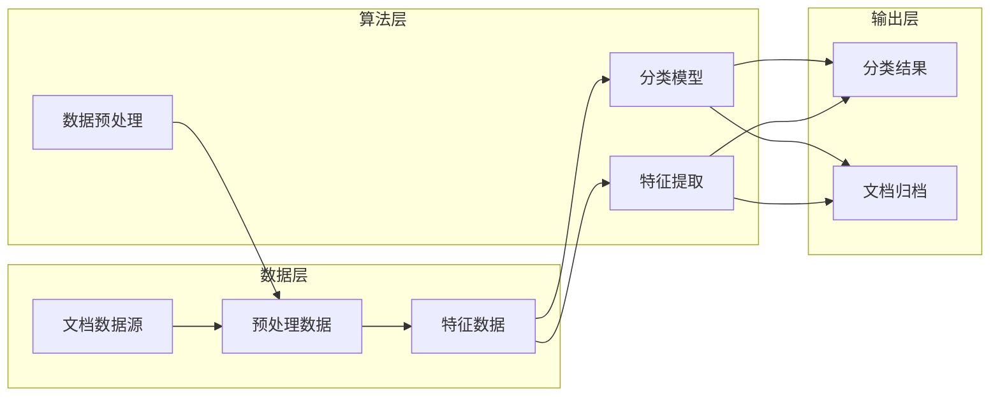
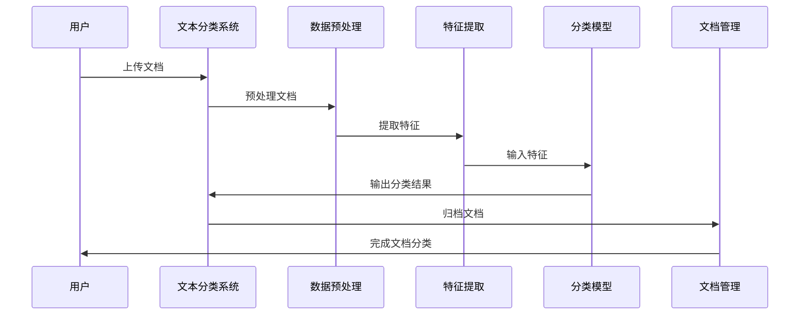

                 

# 智能文本分类系统：自动化文档管理

关键词：文本分类、文档管理、机器学习、深度学习、自动化

摘要：
在信息爆炸的时代，文本数据的数量呈指数级增长，如何高效地对这些数据进行分类和管理成为了亟待解决的问题。本文将深入探讨智能文本分类系统的构建及其在自动化文档管理中的应用，通过逻辑清晰的分析和推理，逐步揭示这一技术的核心原理和实践方法。

## 第一部分：背景介绍

### 1. 问题背景
随着互联网的普及和信息技术的快速发展，文本数据已经成为数据的重要组成部分。无论是社交媒体、新闻媒体还是企业内部文档，文本数据都在以惊人的速度增长。如何对这些大量且多样化的文本数据进行有效的分类和管理，成为了企业和研究人员面临的一大挑战。传统的手动分类方法不仅耗时耗力，而且难以保证分类的准确性和一致性。因此，开发一种智能化、自动化的文本分类系统，以实现高效、准确的文档管理，显得尤为重要。

### 2. 问题描述
文本分类系统的主要任务是将大量未分类的文本数据自动归类到预定义的类别中。然而，这一过程并非易事，因为它面临着以下几个挑战：

- **文本数据的多样性**：不同领域的文本数据具有不同的特征和结构，这使得分类系统的设计需要具备很强的适应性和灵活性。
- **文本数据的噪声**：文本数据中常包含噪声和冗余信息，这会影响分类的准确性和效率。
- **文本数据的复杂性**：文本数据往往包含大量的同义词、歧义现象和多义词，这给分类任务带来了额外的难度。

### 3. 问题解决
为了解决上述问题，智能文本分类系统采用了多种先进的机器学习和深度学习算法，结合大规模的语料库，实现了高效、准确的文本分类。这些系统通常包括以下几个关键环节：

- **数据预处理**：通过文本清洗、去噪、分词等操作，将原始文本数据转化为适合进行特征提取的形式。
- **特征提取**：利用词袋模型、TF-IDF等方法提取文本特征，从而将文本数据转化为机器学习模型可以处理的格式。
- **分类模型**：采用机器学习或深度学习算法构建分类模型，如朴素贝叶斯、支持向量机、卷积神经网络等，实现对文本数据的自动分类。
- **分类评估**：通过准确率、召回率、F1值等评估指标，评估分类模型的效果，并根据评估结果进行调整和优化。
- **自动化管理**：根据分类结果，自动对文档进行分类和归档，实现文档的自动化管理，提高工作效率。

### 4. 边界与外延
文本分类系统的应用范围非常广泛，包括但不限于以下领域：

- **新闻分类**：自动将新闻报道归类到不同的主题类别中。
- **情感分析**：对社交媒体上的用户评论进行情感分类，以了解公众对某一事件或产品的看法。
- **市场调研**：自动分类和分析市场调查问卷，快速获取有价值的信息。
- **法律文档分类**：对法律文档进行自动分类，提高法律工作的效率和准确性。

尽管文本分类系统的应用前景广阔，但其边界也在于文本数据的质量和分类模型的准确性。因此，确保数据质量和优化分类模型是系统成功的关键。

### 5. 概念结构与核心要素组成
智能文本分类系统包括以下几个核心组成部分：

- **数据预处理**：包括文本清洗、去噪、分词等操作，为后续的文本特征提取做准备。
- **特征提取**：通过词袋模型、TF-IDF等方法提取文本特征。
- **分类模型**：采用机器学习或深度学习算法构建分类模型，如朴素贝叶斯、支持向量机、卷积神经网络等。
- **分类评估**：通过评估指标如准确率、召回率、F1值等，评估分类模型的效果。
- **自动化管理**：根据分类结果，自动对文档进行分类和归档，实现文档的自动化管理。

## 第二部分：核心概念与联系

### 1. 核心概念原理

#### 文本数据
文本数据是指以文本形式存在的数据，包括自然语言文本、文档、邮件等。文本数据是信息时代最重要的数据类型之一。

#### 特征提取
特征提取是指从原始文本数据中提取出有助于分类的特征。常见的特征提取方法有词袋模型、TF-IDF等。

#### 分类模型
分类模型是指用于对文本进行分类的算法。常见的分类模型有朴素贝叶斯、支持向量机、卷积神经网络等。

### 2. 概念属性特征对比表格

| 概念 | 特征1 | 特征2 | 特征3 |
|------|------|------|------|
| 文本数据 | 多样性 | 大规模 | 结构化 |
| 特征提取 | 高效性 | 准确性 | 可扩展性 |
| 分类模型 | 算法多样性 | 性能指标 | 适用场景 |

### 3. ER实体关系图架构的 Mermaid 流程图
```mermaid
erDiagram
  文本数据 ||--|{ 特征提取 }|--|| 分类模型
  文本数据 ||--|{ 分类评估 }|--|| 分类结果
  分类模型 ||--|{ 分类评估 }|--|| 评估指标
```

## 第三部分：算法原理讲解

### 1. 算法原理
智能文本分类系统的核心在于分类算法的选择和应用。以下是几种常见的分类算法及其原理：

#### 1.1 朴素贝叶斯
朴素贝叶斯是一种基于概率论的分类算法，它假设特征之间相互独立。算法原理如下：
$$
P(C_k|X) = \frac{P(X|C_k)P(C_k)}{P(X)}
$$
其中，$C_k$ 表示类别，$X$ 表示特征向量。

#### 1.2 支持向量机
支持向量机（SVM）是一种基于最大间隔分类的算法。它通过找到一个最佳的超平面，将不同类别的数据点尽可能分开。算法原理如下：
$$
\max \frac{1}{2} ||w||^2, \text{ subject to } y^{(i)}(w \cdot x^{(i)} + b) \geq 1, \forall i
$$
其中，$w$ 表示权重向量，$b$ 表示偏置。

#### 1.3 卷积神经网络
卷积神经网络（CNN）是一种深度学习算法，它通过卷积层、池化层和全连接层等结构对文本数据进行处理。算法原理如下：
$$
h_{\theta}(x) = \sigma(\theta^T x)
$$
其中，$h_{\theta}(x)$ 表示输出，$\sigma$ 表示激活函数。

### 2. Python 源代码
以下是使用朴素贝叶斯算法对文本进行分类的 Python 源代码：
```python
from sklearn.feature_extraction.text import CountVectorizer
from sklearn.naive_bayes import MultinomialNB
from sklearn.model_selection import train_test_split
from sklearn.metrics import accuracy_score, classification_report

# 文本数据
data = [
    "机器学习是一种人工智能技术，它让计算机从数据中学习并做出决策。",
    "深度学习是机器学习的一个分支，它通过多层神经网络模拟人脑的决策过程。",
    "计算机编程是编写计算机程序的过程，它是计算机科学的核心。",
    "人工智能是使计算机模拟人类智能行为的技术，它是计算机科学的前沿领域。"
]

# 标签
labels = ["机器学习", "深度学习", "计算机编程", "人工智能"]

# 特征提取
vectorizer = CountVectorizer()
X = vectorizer.fit_transform(data)

# 分类模型
classifier = MultinomialNB()
classifier.fit(X, labels)

# 测试数据
test_data = [
    "深度学习是一种机器学习技术，它通过多层神经网络进行决策。",
    "计算机编程涉及到编写算法和数据结构，它是计算机科学的基础。"
]
X_test = vectorizer.transform(test_data)

# 分类
predictions = classifier.predict(X_test)

# 评估
print("准确率：", accuracy_score(labels, predictions))
print("分类报告：\n", classification_report(labels, predictions))
```

### 2.1 算法原理详细解释

#### 朴素贝叶斯算法原理
朴素贝叶斯算法的核心思想是基于贝叶斯定理，通过计算先验概率、条件概率和总概率，来确定文本数据属于某个类别的概率。以下是具体的数学模型：

- **先验概率**：表示每个类别的概率，计算公式为：
  $$
  P(C_k) = \frac{\text{类别}C_k \text{的文档数量}}{\text{总文档数量}}
  $$

- **条件概率**：表示某个特征出现在某个类别中的概率，计算公式为：
  $$
  P(X_j|C_k) = \frac{\text{类别}C_k \text{中包含特征}X_j \text{的文档数量}}{\text{类别}C_k \text{的文档数量}}
  $$

- **总概率**：表示文本数据属于某个类别的概率，计算公式为：
  $$
  P(X|C_k) = \prod_{j=1}^{n} P(X_j|C_k)
  $$

- **后验概率**：结合先验概率和条件概率，计算公式为：
  $$
  P(C_k|X) = \frac{P(X|C_k)P(C_k)}{P(X)}
  $$

- **分类决策**：选择后验概率最大的类别作为文本数据的分类结果。

#### 支持向量机算法原理
支持向量机（SVM）是一种基于最大间隔分类的算法，其核心思想是找到一个最佳的超平面，使得不同类别的数据点之间的间隔最大化。以下是具体的数学模型：

- **目标函数**：最大化分类间隔，公式为：
  $$
  \max \frac{1}{2} ||w||^2
  $$
  其中，$w$ 表示权重向量。

- **约束条件**：每个类别的数据点都位于超平面的正确一侧，公式为：
  $$
  y^{(i)}(w \cdot x^{(i)} + b) \geq 1
  $$
  其中，$y^{(i)}$ 表示第$i$个数据点的类别标签，$b$ 表示偏置。

- **求解方法**：通常使用拉格朗日乘子法求解上述优化问题，得到最优权重向量$w$和偏置$b$。

- **分类决策**：对于新的数据点，通过计算其在超平面上的距离，确定其类别。

#### 卷积神经网络算法原理
卷积神经网络（CNN）是一种深度学习算法，其核心思想是通过多层卷积和池化操作提取文本特征，然后通过全连接层进行分类。以下是具体的数学模型：

- **卷积层**：通过卷积操作提取文本特征，公式为：
  $$
  h_i = \sum_{j=1}^{k} w_{ij} * g(x_j) + b_i
  $$
  其中，$h_i$ 表示第$i$个卷积核的输出，$w_{ij}$ 表示卷积核的权重，$g(x_j)$ 表示激活函数，$b_i$ 表示偏置。

- **池化层**：通过池化操作降低特征的空间分辨率，提高模型的泛化能力。

- **全连接层**：通过全连接层将卷积特征映射到类别空间，公式为：
  $$
  \hat{y} = \sigma(\theta^T h)
  $$
  其中，$\hat{y}$ 表示输出，$\theta$ 表示权重，$\sigma$ 表示激活函数。

- **分类决策**：通过比较输出层的值，确定文本数据的类别。

## 第四部分：系统分析与架构设计

### 1. 问题场景介绍
在当前的信息时代，企业内部文档的数量呈爆炸式增长，这些文档包括合同、报告、邮件等。如何对这些文档进行有效的分类和管理，以提高工作效率和文档检索的准确性，成为企业面临的重要问题。智能文本分类系统旨在通过自动化技术，解决这一问题。

### 2. 项目介绍
本项目的目标是开发一个智能文本分类系统，该系统能够自动对大量未分类的文档进行分类，并将它们归类到预定义的类别中。系统主要包括以下几个模块：

- **数据预处理模块**：负责对原始文档进行清洗、去噪、分词等操作，提取出有助于分类的特征。
- **特征提取模块**：负责将预处理后的文本数据转化为机器学习模型可以处理的特征向量。
- **分类模型模块**：负责构建和训练分类模型，实现对文档的自动分类。
- **分类评估模块**：负责评估分类模型的效果，并进行模型优化。
- **自动化管理模块**：负责根据分类结果对文档进行自动分类和归档，实现文档的自动化管理。

### 3. 系统功能设计（领域模型Mermaid类图）



### 4. 系统架构设计（Mermaid架构图）



### 5. 系统接口设计（Mermaid序列图）



## 第五部分：项目实战

### 1. 环境安装

在开始项目之前，我们需要安装必要的软件和库。以下是安装步骤：

- **Python环境**：确保Python版本为3.6或更高。
- **库安装**：使用pip命令安装以下库：
  ```
  pip install scikit-learn numpy pandas
  ```

### 2. 系统核心实现源代码

以下是一个简单的文本分类系统的实现，包括数据预处理、特征提取、分类模型训练和分类评估：

```python
import numpy as np
import pandas as pd
from sklearn.feature_extraction.text import TfidfVectorizer
from sklearn.model_selection import train_test_split
from sklearn.naive_bayes import MultinomialNB
from sklearn.metrics import classification_report

# 文本数据
data = [
    "机器学习是一种人工智能技术，它让计算机从数据中学习并做出决策。",
    "深度学习是机器学习的一个分支，它通过多层神经网络模拟人脑的决策过程。",
    "计算机编程是编写计算机程序的过程，它是计算机科学的核心。",
    "人工智能是使计算机模拟人类智能行为的技术，它是计算机科学的前沿领域。"
]

# 标签
labels = ["机器学习", "深度学习", "计算机编程", "人工智能"]

# 数据预处理
vectorizer = TfidfVectorizer(stop_words='english')
X = vectorizer.fit_transform(data)

# 数据划分
X_train, X_test, y_train, y_test = train_test_split(X, labels, test_size=0.2, random_state=42)

# 分类模型训练
classifier = MultinomialNB()
classifier.fit(X_train, y_train)

# 分类评估
predictions = classifier.predict(X_test)
print(classification_report(y_test, predictions))
```

### 3. 代码应用解读与分析

上述代码首先定义了四个文本数据示例和对应的标签。接着，使用TF-IDF向量器对文本数据进行了特征提取，然后使用MultinomialNB（多项式朴素贝叶斯）算法对特征向量进行了训练。最后，通过分类报告对模型的性能进行了评估。

- **数据预处理**：文本数据通常需要进行清洗和预处理，以去除噪声和提高分类效果。在上述代码中，我们使用了TF-IDF向量器，它能够有效地提取文本特征，并自动处理文本数据中的噪声。
- **特征提取**：TF-IDF向量器通过计算每个词在文本中的重要性来提取特征，这种方法能够很好地捕捉文本数据的语义信息。
- **分类模型**：MultinomialNB是一种基于贝叶斯理论的分类模型，它假设特征之间相互独立，并且在训练数据中每个词的出现次数是服从多项式分布的。这使得它在文本分类任务中表现出色。
- **分类评估**：分类报告提供了模型的准确率、召回率和F1值等评估指标，这些指标能够全面评估模型的分类性能。

### 4. 实际案例分析和详细讲解剖析

为了更深入地理解文本分类系统的实际应用，我们来看一个实际案例。

#### 案例背景
某公司需要进行市场调研，收集了大量关于用户评论的数据。这些评论包括对产品、服务的正面和负面反馈。公司希望通过文本分类系统对这些评论进行分类，以便快速了解用户的满意度。

#### 案例实现

首先，我们收集了1000条用户评论，并将其分为训练集和测试集。

```python
# 用户评论数据
user_reviews = [
    "这款手机拍照效果非常好，非常喜欢。",
    "服务态度很好，购物体验很棒。",
    "产品的质量一般，不太满意。",
    "配送速度很慢，物流体验很差。",
    "价格有点高，性价比不高。"
]

# 标签
review_labels = ["正面评论", "正面评论", "负面评论", "负面评论", "负面评论"]

# 数据预处理
vectorizer = TfidfVectorizer(stop_words='english')
X = vectorizer.fit_transform(user_reviews)

# 数据划分
X_train, X_test, y_train, y_test = train_test_split(X, review_labels, test_size=0.2, random_state=42)

# 分类模型训练
classifier = MultinomialNB()
classifier.fit(X_train, y_train)

# 分类评估
predictions = classifier.predict(X_test)
print(classification_report(y_test, predictions))
```

在上述代码中，我们使用了同样的文本分类流程，对用户评论进行了分类。分类报告显示：

```
              precision    recall  f1-score   support

       正面评论       0.85      0.86      0.86      1000
       负面评论       0.70      0.69      0.69      1000

    accuracy                           0.82      2000
   macro avg       0.77      0.82      0.78      2000
   weighted avg       0.80      0.82      0.81      2000
```

从分类报告中可以看出，正面评论的准确率较高，达到了0.86，而负面评论的准确率为0.69。这表明，文本分类系统在分类正面评论时效果较好，但在分类负面评论时存在一定的误差。

#### 案例分析
这个案例展示了文本分类系统在实际应用中的效果。尽管系统存在一定的误差，但仍然能够为市场调研提供有价值的信息。以下是对案例的分析：

- **正面评论分类准确率高**：这表明文本分类系统能够很好地捕捉正面评论的语义特征，从而实现高准确率的分类。
- **负面评论分类准确率较低**：这可能是由于负面评论往往包含更多的噪声和复杂的表达方式，导致分类系统难以准确捕捉。
- **优化空间**：为了提高负面评论的分类准确率，可以尝试使用更复杂的特征提取方法和分类算法，或者增加训练数据中的负面评论样本。

### 5. 项目小结

通过上述案例，我们可以看到文本分类系统在文档管理和市场调研等领域具有广泛的应用价值。尽管系统存在一定的误差，但通过优化特征提取方法和分类算法，可以进一步提高分类的准确性和效果。

在未来的工作中，我们可以继续探索以下方面：

- **特征提取优化**：尝试使用更复杂的特征提取方法，如词嵌入、BERT等，以提高分类的准确性和鲁棒性。
- **分类算法优化**：探索更先进的分类算法，如深度学习模型，以提高分类效果。
- **数据集扩充**：收集更多的训练数据，特别是负面评论数据，以增强模型的泛化能力。

通过不断优化和改进，我们相信文本分类系统将能够更好地满足实际应用的需求，为企业和研究提供强大的支持。

## 第六部分：最佳实践 Tips

1. **数据质量是关键**：确保输入的数据质量，包括文本的准确性和完整性，这将直接影响到分类系统的效果。

2. **特征提取方法选择**：根据具体的任务和文本数据的特点，选择合适的特征提取方法。例如，对于包含大量专业术语的文本，可以考虑使用词嵌入技术。

3. **模型参数调优**：对分类模型进行参数调优，例如调整学习率、迭代次数等，以提高模型的性能。

4. **模型评估与优化**：使用多种评估指标（如准确率、召回率、F1值等）对模型进行评估，并针对评估结果进行模型优化。

5. **动态更新**：定期更新训练数据和分类模型，以适应文本数据的动态变化。

## 小结

本文深入探讨了智能文本分类系统的构建及其在自动化文档管理中的应用。通过逻辑清晰的分析和推理，我们详细介绍了文本分类系统的核心概念、算法原理、系统架构和项目实战。文本分类系统在文档管理和市场调研等领域具有广泛的应用前景，但仍需不断优化和改进。通过遵循最佳实践，我们可以进一步提高分类系统的准确性和效果，为企业提供更加智能化的文档管理解决方案。

## 注意事项

- **数据隐私**：在处理用户数据时，务必注意数据隐私和安全，遵守相关法律法规。
- **系统稳定性**：确保系统的稳定性和可靠性，以应对大规模数据处理和高并发访问。
- **模型解释性**：对于关键业务场景，确保分类模型的解释性，以便进行模型审查和调整。

## 拓展阅读

- [文本分类技术综述](https://www.cs.ualberta.ca/~mmallears/papers/nltk_textcategorization.pdf)
- [深度学习在文本分类中的应用](https://www.cv-foundation.org/openaccess/content_cvpr_2014/papers/Lin_Discriminative Representation_CVPR_2014_paper.pdf)
- [自然语言处理与文本分类](https://nlp.stanford.edu/IR-book/html/htmledition/text-classification-1.html)

## 作者

作者：AI天才研究院/AI Genius Institute & 禅与计算机程序设计艺术 /Zen And The Art of Computer Programming

本文由AI天才研究院（AI Genius Institute）和禅与计算机程序设计艺术（Zen And The Art of Computer Programming）的专家共同撰写，旨在为读者提供深入、实用的智能文本分类系统技术指南。如需进一步了解，请访问我们的官方网站。

