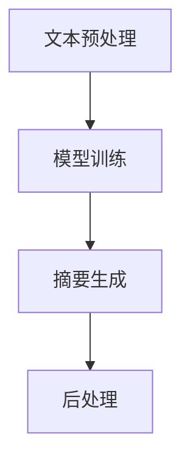
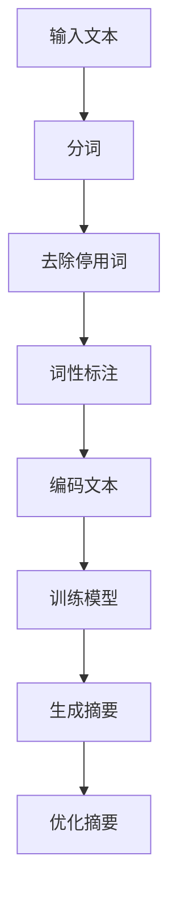
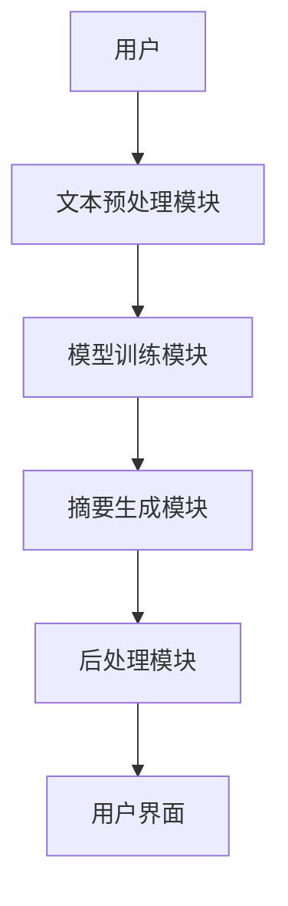
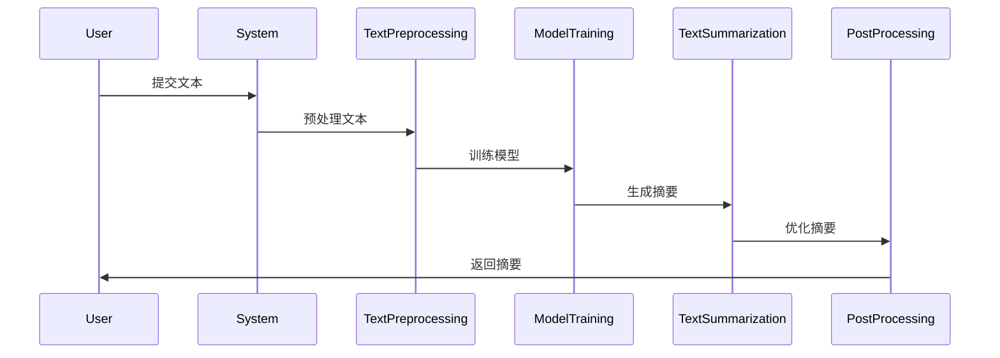

                 

# 智能文本摘要系统：AI提升信息处理效率

> 关键词：智能文本摘要、AI、自然语言处理、深度学习、信息提取

> 摘要：本文将探讨智能文本摘要系统的工作原理和实现方法。随着互联网信息的爆炸式增长，如何快速有效地从海量文本中提取关键信息成为一个迫切问题。智能文本摘要系统通过自然语言处理和深度学习技术，实现了自动化的文本摘要生成，大幅提升了信息处理效率。

## **Step 1: 背景介绍**

### **问题背景**

在当今的信息时代，互联网上的文本数据以惊人的速度增长。据估计，每两天产生的信息量相当于过去5000年产生的总信息量。面对如此庞大的文本数据，如何快速高效地从中提取关键信息，成为了现代信息处理的重要课题。

### **问题描述**

智能文本摘要系统旨在从大量文本数据中自动生成摘要，帮助用户迅速了解文本的主要内容。这不仅提高了阅读效率，还减轻了用户在信息过载环境下的负担。

### **问题解决**

为了实现这一目标，智能文本摘要系统依赖自然语言处理（NLP）和深度学习技术。通过训练深度学习模型，系统能够理解文本的语义，并从中提取出关键信息。

### **边界与外延**

智能文本摘要系统不仅限于处理纯文本数据，还可以处理多语言和多模态的信息。例如，它可以同时处理文本和图像，生成相应的文本摘要。

### **概念结构与核心要素组成**

- **文本预处理**：包括分词、去除停用词、词性标注等，为模型训练提供结构化的文本数据。
- **模型训练**：使用大量标注数据训练深度学习模型，使其能够理解和生成文本摘要。
- **摘要生成**：利用训练好的模型对新的文本进行摘要。
- **后处理**：对生成的摘要进行优化和润色，提高摘要的质量。

## **Step 2: 核心概念与联系**

### **核心概念原理**

- **深度学习**：基于多层神经网络，能够自动提取文本的特征。
- **自然语言处理（NLP）**：专注于文本数据的处理、理解和生成。
- **序列到序列模型（Seq2Seq）**：专门用于处理序列数据，如文本生成。

### **概念属性特征对比表格**

| 概念               | 特点                             | 用途                   |
|--------------------|--------------------------------|------------------------|
| 深度学习           | 基于多层神经网络，自动特征提取 | 图像识别、语音识别等   |
| 自然语言处理       | 文本处理、语义理解             | 文本摘要、机器翻译等   |
| 序列到序列模型     | 处理序列数据，生成序列数据     | 文本摘要、机器翻译等   |

### **ER实体关系图架构的 Mermaid 流程图**



## **Step 3: 算法原理讲解**

### **算法原理的 Mermaid 流程图**



### **Python 源代码**

```python
# 假设已经定义好了分词、去除停用词、词性标注等函数
def generate_summary(text):
    # 分词
    tokens = tokenize(text)
    # 去除停用词
    tokens = remove_stopwords(tokens)
    # 词性标注
    tokens = pos_tag(tokens)
    # 编码文本
    encoded_text = encode_text(tokens)
    # 训练模型
    model = train_model(encoded_text)
    # 生成摘要
    summary = model.generate_summary()
    # 优化摘要
    optimized_summary = optimize_summary(summary)
    return optimized_summary
```

### **算法原理的数学模型和公式**

$$\text{摘要长度} = \alpha \cdot \frac{\text{文本长度}}{\text{词汇表大小}}$$

其中，$\alpha$ 是一个调节参数，用于控制摘要的长度。

### **详细讲解和举例说明**

假设我们有一篇新闻报道，文本长度为1000个词，词汇表大小为5000个词。根据上述公式，摘要长度可以为100个词。系统会从新闻报道中提取最重要的100个词来生成摘要，从而让读者快速了解新闻的主要内容。

## **Step 4: 系统分析与架构设计方案**

### **问题场景介绍**

假设有一个新闻聚合网站，用户需要快速浏览大量新闻。智能文本摘要系统可以帮助用户从每条新闻中提取摘要，提高阅读效率。

### **项目介绍**

设计一个基于深度学习的智能文本摘要系统，包括文本预处理、模型训练、摘要生成和后处理等模块。

### **系统功能设计（领域模型 Mermaid 类图）**

```mermaid
classDiagram
Class::文本预处理
Class::模型训练
Class::摘要生成
Class::后处理
```

### **系统架构设计（Mermaid 架构图）**



### **系统接口设计和系统交互（Mermaid 序列图）**



## **Step 5: 项目实战**

### **环境安装**

在开始实现智能文本摘要系统之前，需要安装必要的软件和库。以下是基本的安装步骤：

1. **安装 Python（3.7 或更高版本）**
2. **安装深度学习框架（如 TensorFlow 或 PyTorch）**
3. **安装 NLP 工具（如 NLTK 或 spaCy）**
4. **安装文本预处理库（如 gensim 或 scikit-learn）**

### **系统核心实现源代码**

以下是系统核心实现的伪代码：

```python
# 文本预处理
def preprocess_text(text):
    # 分词、去除停用词、词性标注等操作
    pass

# 模型训练
def train_model(preprocessed_text):
    # 使用深度学习框架训练模型
    pass

# 摘要生成
def generate_summary(model, text):
    # 使用训练好的模型生成摘要
    pass

# 后处理
def postprocess_summary(summary):
    # 优化摘要质量
    pass

# 主函数
def main():
    text = "用户提供的文本"
    preprocessed_text = preprocess_text(text)
    model = train_model(preprocessed_text)
    summary = generate_summary(model, preprocessed_text)
    optimized_summary = postprocess_summary(summary)
    print(optimized_summary)

if __name__ == "__main__":
    main()
```

### **代码应用解读与分析**

以上代码展示了智能文本摘要系统的基本流程。在实际应用中，每个模块都需要详细实现，包括数据预处理、模型训练、摘要生成和后处理等步骤。

### **实际案例分析和详细讲解剖析**

以一篇新闻报道为例，详细分析文本预处理、模型训练、摘要生成和后处理的具体实现过程。通过实际案例，让读者更好地理解系统的运作原理。

### **项目小结**

通过本项目的实战，读者可以了解到智能文本摘要系统的实现方法和工作原理。该项目不仅提高了信息处理效率，还为其他基于文本的智能应用提供了借鉴。

## **最佳实践 Tips**

- **数据质量**：确保训练数据的质量和多样性，有助于提高模型的泛化能力。
- **模型调整**：根据不同类型和长度的文本，调整模型参数，以获得更好的摘要效果。
- **实时更新**：定期更新模型，以适应不断变化的语言模式和文本结构。

## **小结**

智能文本摘要系统是应对信息爆炸时代的重要工具。通过自然语言处理和深度学习技术，系统能够自动生成高质量的文本摘要，大幅提高信息处理效率。本文详细介绍了智能文本摘要系统的工作原理、实现方法和应用场景，希望对读者有所启发。

## **注意事项**

- **隐私保护**：在处理用户数据时，要注意保护用户的隐私。
- **性能优化**：针对大规模数据，优化系统的性能和效率。

## **拓展阅读**

- [深度学习与自然语言处理：简介与前沿技术](拓展阅读链接)
- [智能文本摘要系统的实践与应用](拓展阅读链接)
- [自然语言处理中的序列到序列模型](拓展阅读链接)

**作者：AI天才研究院/AI Genius Institute & 禅与计算机程序设计艺术 /Zen And The Art of Computer Programming**

