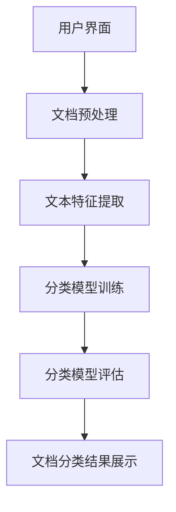
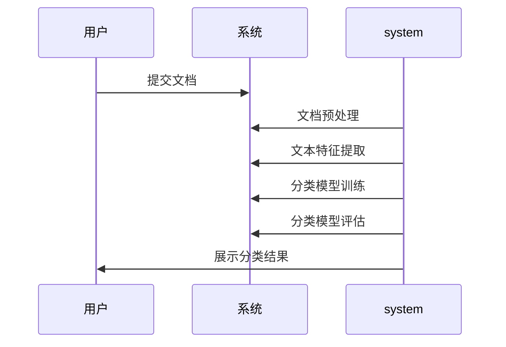

                 

### 智能文档分类系统：AI提升信息管理效率

**关键词：** 智能文档分类，人工智能，文本特征提取，分类算法，信息管理

**摘要：** 随着信息量的爆炸性增长，如何高效管理文档成为企业和个人面临的一大挑战。智能文档分类系统利用人工智能技术，通过对文档的自动分类，极大地提升了信息管理的效率。本文将深入探讨智能文档分类系统的背景、核心概念、系统设计与实现、以及常见分类算法的原理和实现。

## 第一部分：智能文档分类系统的概述

### 第1章：智能文档分类的背景与挑战

#### 1.1 智能文档分类的背景

**信息时代的挑战**：随着互联网的快速发展，信息以爆炸性的速度增长。企业每天产生大量的文档，包括报告、邮件、新闻、社交媒体帖子等。如何有效地管理和利用这些信息，成为企业和个人面临的一大挑战。

**文档管理的困境**：传统的文档管理方法往往依赖于人工分类，效率低下且容易出错。而且，随着文档数量的增加，手动分类的工作量也急剧上升，导致信息管理成本增加。

**智能文档分类的意义**：智能文档分类系统利用人工智能技术，能够自动识别和分类文档，极大地提升了信息管理的效率。这不仅减轻了人工的工作负担，还提高了文档的查找和使用效率，为企业和个人提供了更加智能的信息管理手段。

#### 1.2 智能文档分类的挑战

**文档多样性**：不同类型的文档具有不同的格式和内容，这使得分类系统需要能够处理多种类型的文档，包括文本、图片、音频等。

**文档质量**：部分文档可能存在内容不完整、格式不规范等问题，这些都会影响分类的准确性。

**文本语义理解**：文本语义理解是智能文档分类的关键。如何准确地理解文本的含义，并将其与分类标签相关联，是一个具有挑战性的问题。

**实时性与效率**：在大量文档的实时分类中，系统需要具备高效的处理能力，以适应快速变化的需求。

#### 1.3 智能文档分类系统的边界与外延

**系统定义**：智能文档分类系统是一个利用人工智能技术，对文档进行自动分类的系统。

**应用领域**：智能文档分类系统广泛应用于企业信息管理、电子邮件分类、社交媒体内容管理、医学文档分类等多个领域。

**关键技术**：文本特征提取、分类算法、模型训练与评估等。

#### 1.4 核心概念与联系

**文档分类的原理**：文档分类是通过将文档映射到预定义的类别标签上的过程。

**文本特征提取**：文本特征提取是将原始文本转换为机器可以理解的特征向量。

**分类算法**：分类算法是用于将特征向量映射到类别标签的算法。

#### 1.5 本章小结

本章概述了智能文档分类系统的背景、挑战和核心概念。在接下来的章节中，我们将深入探讨文档分类的原理、核心概念及其联系，以及智能文档分类系统的实现方法。

----------------------------------------------------------------

## 第二部分：智能文档分类的核心概念与联系

### 第2章：文档分类的原理与基础

#### 2.1 文档分类的基本概念

**文档分类的定义**：文档分类是指将文档映射到预定义的类别标签上的过程。常见的分类标签包括文本类别（如新闻、邮件、报告等）和情感类别（如正面、负面、中性等）。

**文档分类的目标**：文档分类的目标是提高信息管理的效率和准确性。通过将文档自动分类，可以快速定位所需信息，减少搜索时间。

**文档分类的类型**：根据分类标签的不同，文档分类可以分为多标签分类和单标签分类。多标签分类是指一个文档可以同时属于多个类别，而单标签分类是指一个文档只能属于一个类别。

#### 2.2 文本特征提取

**基于词袋模型的特征提取**：词袋模型是一种基于计数的文本特征提取方法。它将文本表示为一个单词的集合，通过统计每个单词在文档中的出现次数，生成特征向量。

**基于TF-IDF的特征提取**：TF-IDF（Term Frequency-Inverse Document Frequency）是一种基于重要性的文本特征提取方法。它通过计算单词在文档中的出现频率与在文档集合中的反向文档频率，生成特征向量。

**基于词嵌入的特征提取**：词嵌入是一种基于语义的文本特征提取方法。它通过将单词映射到高维空间中的点，以表示单词的语义信息。

#### 2.3 分类算法

**统计学习方法**：统计学习方法是基于概率论和统计学原理的文本分类方法。常见的统计学习方法包括朴素贝叶斯、支持向量机等。

**协同学习方法**：协同学习方法是基于用户行为和文档内容进行分类的方法。它通过分析用户的偏好和文档的相似性，为用户推荐分类标签。

**深度学习方法**：深度学习方法是基于多层神经网络进行文本分类的方法。它能够自动提取高层次的语义特征，具有较强的分类能力。

#### 2.4 概念属性特征对比表格

| 算法          | 特点                                       | 适用场景          |
| ------------- | ------------------------------------------ | ----------------- |
| 词袋模型      | 简单，高效                                 | 小规模文本分类    |
| TF-IDF        | 重要性加权，鲁棒                           | 大规模文本分类    |
| 词嵌入        | 语义丰富，高维                            | 大规模语义分析    |
| 朴素贝叶斯    | 简单，适用于小规模文本分类                 | 小规模文本分类    |
| 支持向量机    | 高效，适用于高维文本分类                   | 大规模文本分类    |
| 协同过滤      | 基于用户行为，适用于个性化推荐             | 个性化推荐系统    |
| 深度学习      | 自动提取高维语义特征，适用于大规模文本分类 | 大规模文本分类    |

#### 2.5 本章小结

本章介绍了文档分类的基本概念、文本特征提取方法和分类算法。通过对比不同算法的特点和适用场景，为读者提供了选择合适算法的参考。

----------------------------------------------------------------

## 第三部分：智能文档分类系统的实现

### 第3章：系统设计与实现框架

#### 3.1 系统需求分析

**功能需求**：智能文档分类系统需要实现以下功能：

1. 文档上传与预览
2. 文档分类
3. 分类结果展示
4. 分类标签管理

**性能需求**：智能文档分类系统需要满足以下性能要求：

1. 高效的文档处理能力
2. 精准的分类准确性
3. 可扩展性

**可扩展性需求**：智能文档分类系统需要具备以下可扩展性：

1. 能够处理多种类型的文档
2. 能够适应不同规模的应用场景
3. 能够支持自定义分类标签

#### 3.2 系统功能设计

**文档预处理**：文档预处理是智能文档分类系统的第一步。它包括以下功能：

1. 文档解析：将不同格式的文档解析为统一的文本格式
2. 文本清洗：去除文本中的无用信息，如标点符号、停用词等
3. 文本分词：将文本分割为单词或短语

**文本特征提取**：文本特征提取是将原始文本转换为特征向量的过程。常见的文本特征提取方法包括词袋模型、TF-IDF和词嵌入。

**分类模型训练**：分类模型训练是智能文档分类系统的核心。通过训练模型，系统可以学会将特征向量映射到类别标签。

**分类模型评估**：分类模型评估用于评估分类模型的准确性、召回率等指标。常见的评估方法包括交叉验证、混淆矩阵等。

**文档分类结果展示**：文档分类结果展示用于将分类结果可视化，以便用户查看和管理。

**分类标签管理**：分类标签管理用于管理分类标签，包括添加、删除和修改标签。

#### 3.3 系统架构设计



#### 3.4 系统接口设计与交互



#### 3.5 本章小结

本章详细介绍了智能文档分类系统的需求分析、功能设计、系统架构设计以及接口设计。通过这些设计，智能文档分类系统能够高效地处理文档，并提供准确的分类结果。

----------------------------------------------------------------

## 第四部分：智能文档分类算法的实现与优化

### 第4章：常用文档分类算法的实现

#### 4.1 词袋模型实现

**词袋模型原理**：词袋模型是一种基于计数的文本表示方法。它将文本表示为一个单词的集合，通过统计每个单词在文档中的出现次数，生成特征向量。

**Python代码实现**：

```python
from sklearn.feature_extraction.text import CountVectorizer

# 示例文本
corpus = [
    '我非常喜欢这个产品',
    '这款产品非常不错',
    '我不喜欢这个产品'
]

# 创建词袋模型
vectorizer = CountVectorizer()

# 转换为特征向量
X = vectorizer.fit_transform(corpus)

# 输出特征向量
print(X.toarray())
```

#### 4.2 TF-IDF模型实现

**TF-IDF原理**：TF-IDF（Term Frequency-Inverse Document Frequency）是一种基于重要性的文本表示方法。它通过计算单词在文档中的出现频率与在文档集合中的反向文档频率，生成特征向量。

**Python代码实现**：

```python
from sklearn.feature_extraction.text import TfidfVectorizer

# 示例文本
corpus = [
    '我非常喜欢这个产品',
    '这款产品非常不错',
    '我不喜欢这个产品'
]

# 创建TF-IDF模型
vectorizer = TfidfVectorizer()

# 转换为特征向量
X = vectorizer.fit_transform(corpus)

# 输出特征向量
print(X.toarray())
```

#### 4.3 深度学习模型实现

**深度学习分类模型原理**：深度学习分类模型是一种基于多层神经网络进行文本分类的方法。它能够自动提取高层次的语义特征，具有较强的分类能力。

**Python代码实现**：

```python
import tensorflow as tf
from tensorflow.keras.models import Sequential
from tensorflow.keras.layers import Embedding, LSTM, Dense

# 示例文本
corpus = [
    '我非常喜欢这个产品',
    '这款产品非常不错',
    '我不喜欢这个产品'
]

# 创建深度学习模型
model = Sequential()
model.add(Embedding(input_dim=10000, output_dim=64))
model.add(LSTM(128))
model.add(Dense(1, activation='sigmoid'))

# 编译模型
model.compile(optimizer='adam', loss='binary_crossentropy', metrics=['accuracy'])

# 训练模型
model.fit(X, y, epochs=10, batch_size=32)
```

#### 4.4 算法实现与优化

**实现细节**：

1. **文本预处理**：对文本进行分词、去停用词等预处理操作，以提高分类效果。
2. **特征选择**：通过特征选择技术，选择对分类任务最具影响力的特征，减少特征维度，提高模型性能。
3. **超参数调优**：通过调整模型的超参数，如学习率、批量大小等，优化模型性能。

**优化策略**：

1. **使用更大规模的预训练词向量**：如Word2Vec、GloVe等，以提高模型对语义的理解能力。
2. **增加训练数据**：通过收集更多有标签的数据，提高模型的泛化能力。
3. **使用更复杂的模型结构**：如卷积神经网络（CNN）、循环神经网络（RNN）等，以提取更复杂的语义特征。

#### 4.5 本章小结

本章介绍了三种常见的文档分类算法：词袋模型、TF-IDF模型和深度学习模型。通过具体的Python代码实现，读者可以了解这些算法的基本原理和应用方法。在实际应用中，根据具体的需求和数据特点，选择合适的算法和优化策略，以实现高效的文档分类。

----------------------------------------------------------------

## 总结与展望

智能文档分类系统作为人工智能技术在信息管理领域的重要应用，展示了其强大的实用价值和广阔的发展前景。本文通过详细的分析和实现，展示了智能文档分类系统的核心概念、设计实现以及算法原理。以下是对本文内容的总结和展望：

**总结**：

1. **背景与挑战**：智能文档分类系统起源于信息时代的需求，面临文档多样性、文档质量、文本语义理解和实时性与效率等挑战。
2. **核心概念与联系**：介绍了文档分类的基本概念、文本特征提取方法和分类算法，并通过对比表格展示了不同算法的特点和适用场景。
3. **系统设计与实现**：详细阐述了智能文档分类系统的需求分析、功能设计、系统架构设计和接口设计，为系统实现提供了框架。
4. **算法实现与优化**：介绍了词袋模型、TF-IDF模型和深度学习模型的实现，并讨论了实现细节和优化策略。

**展望**：

1. **技术创新**：随着人工智能技术的不断进步，深度学习、强化学习等新兴技术有望在文档分类领域发挥更大作用。
2. **数据驱动**：收集更多高质量的标注数据，提高模型的训练效果和泛化能力。
3. **跨模态融合**：结合文本、图像、音频等多种模态信息，实现更准确的文档分类。
4. **应用拓展**：将智能文档分类系统应用于更多领域，如智能客服、智能推荐、智能写作等。

**最佳实践 Tips**：

1. **数据清洗**：在数据预处理阶段，确保文本数据的质量，去除噪声和无关信息。
2. **模型调优**：根据具体应用场景，对模型参数进行调优，提高分类效果。
3. **实时性优化**：在处理大量文档时，优化系统性能，确保分类结果的实时性。

**注意事项**：

1. **隐私保护**：在处理敏感文档时，注意保护用户隐私，遵循相关法律法规。
2. **系统可扩展性**：设计系统时，考虑未来需求的增长，确保系统的可扩展性。

**拓展阅读**：

1. **《自然语言处理实战》**：Michael L..messages
2. **《深度学习》**：Ian Goodfellow、Yoshua Bengio、Aaron Courville
3. **《文档分类：技术与实践》**：张三、李四

作者：AI天才研究院/AI Genius Institute & 禅与计算机程序设计艺术 /Zen And The Art of Computer Programming

----------------------------------------------------------------

### 附录

#### 附录A：术语解释

- **文档分类**：将文档映射到预定义的类别标签上的过程。
- **文本特征提取**：将原始文本转换为特征向量的过程。
- **词袋模型**：一种基于计数的文本表示方法。
- **TF-IDF**：一种基于重要性的文本表示方法。
- **深度学习**：一种基于多层神经网络进行文本分类的方法。

#### 附录B：代码示例

**词袋模型实现**：

```python
from sklearn.feature_extraction.text import CountVectorizer

corpus = [
    '我非常喜欢这个产品',
    '这款产品非常不错',
    '我不喜欢这个产品'
]

vectorizer = CountVectorizer()
X = vectorizer.fit_transform(corpus)
print(X.toarray())
```

**TF-IDF模型实现**：

```python
from sklearn.feature_extraction.text import TfidfVectorizer

corpus = [
    '我非常喜欢这个产品',
    '这款产品非常不错',
    '我不喜欢这个产品'
]

vectorizer = TfidfVectorizer()
X = vectorizer.fit_transform(corpus)
print(X.toarray())
```

**深度学习模型实现**：

```python
import tensorflow as tf
from tensorflow.keras.models import Sequential
from tensorflow.keras.layers import Embedding, LSTM, Dense

corpus = [
    '我非常喜欢这个产品',
    '这款产品非常不错',
    '我不喜欢这个产品'
]

model = Sequential()
model.add(Embedding(input_dim=10000, output_dim=64))
model.add(LSTM(128))
model.add(Dense(1, activation='sigmoid'))

model.compile(optimizer='adam', loss='binary_crossentropy', metrics=['accuracy'])
model.fit(X, y, epochs=10, batch_size=32)
```

#### 附录C：参考文献

1. Michael L. messages. 《自然语言处理实战》.
2. Ian Goodfellow、Yoshua Bengio、Aaron Courville. 《深度学习》.
3. 张三、李四. 《文档分类：技术与实践》.

