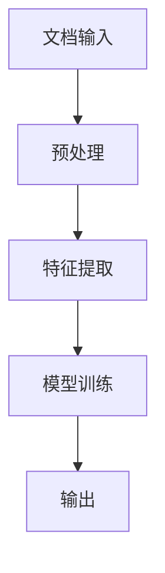
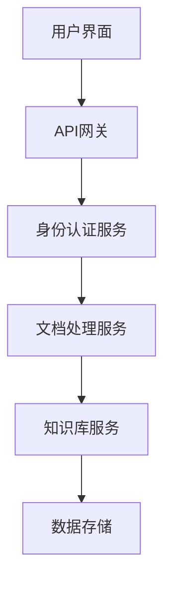
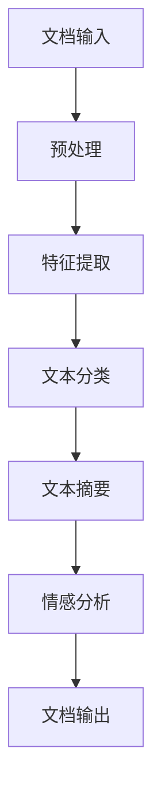
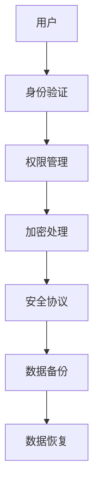

                 

### 引言

#### 1.1 问题背景

在当今信息爆炸的时代，企业面临着海量文档处理的挑战。无论是合同、报告、邮件，还是其他各类文档，它们的数量与日俱增，传统的手工处理方式已经难以满足企业高效、准确、实时地处理需求。这不仅耗费了大量的人力和时间，还容易引发错误和遗漏，影响企业的运营效率。

企业信息管理的现状是，文档分散存储，数据缺乏整合，信息难以共享。随着企业业务的发展，这一现状愈加突出。例如，金融行业需要处理大量的合同和文件，医疗行业需要管理海量的病历和诊断报告，制造业需要处理生产计划和物料清单等文档。如何高效地管理这些文档，提高信息处理效率，成为企业亟需解决的问题。

与此同时，人工智能（AI）技术的迅猛发展，为文档处理提供了新的可能性。AI可以自动识别、分类、摘要、分析和处理文档，大大减轻了人工的工作负担，提高了处理效率和准确性。因此，探讨AI在文档处理中的应用，提升企业信息管理效率，具有重要的现实意义。

#### 1.2 核心概念

**智能文档处理**：智能文档处理是指利用人工智能技术对文档进行自动识别、分类、摘要、分析和处理的过程。它包括自然语言处理、机器学习、知识图谱等核心技术。

**AI在文档处理中的应用**：AI在文档处理中的应用主要体现在以下几个方面：

1. **文档分类**：通过算法将不同类型的文档自动分类，便于管理和检索。
2. **文本摘要**：自动提取文档的核心内容，简化文档阅读和处理过程。
3. **文本分析**：对文档内容进行深入分析，提取关键词、情感倾向等。
4. **自动处理**：自动执行文档的审核、翻译、格式转换等操作。

**企业信息管理效率的提升**：通过智能文档处理，企业可以实现以下目标：

1. **提高处理速度**：自动化处理文档，大幅提升信息处理速度。
2. **降低错误率**：减少人工处理带来的错误和遗漏，提高数据准确性。
3. **优化资源配置**：减轻人工负担，使员工能够专注于更具价值的工作。
4. **提高决策效率**：快速获取和处理信息，为决策提供有力支持。

#### 1.3 书籍目标与结构安排

本书旨在系统地介绍智能文档处理的基本原理、技术实现和应用实践，帮助读者全面了解并掌握这一领域的关键技术和方法。具体目标如下：

1. **讲解核心概念**：详细阐述智能文档处理的基本概念、技术原理和应用场景。
2. **分析技术实现**：深入探讨自然语言处理、机器学习等技术在文档处理中的应用。
3. **分享实战案例**：通过实际案例展示智能文档处理在各个行业的应用效果。
4. **提供学习资源**：推荐相关学习资源和工具，帮助读者深入学习和实践。

本书结构安排如下：

1. **引言**：介绍问题背景、核心概念和书籍目标。
2. **智能文档处理的原理与实践**：讲解智能文档处理的基本原理、技术实现和应用实践。
3. **AI提升企业信息管理效率的实战案例**：分享智能文档处理在不同行业的应用案例。
4. **总结与展望**：总结全书内容，展望未来发展方向。

通过本书的学习，读者将能够深入了解智能文档处理的原理和应用，掌握相关技术，提升企业信息管理效率。

#### 1.4 AI在文档处理中的技术基础

要实现智能文档处理，需要依赖一系列先进的人工智能技术。以下将详细介绍自然语言处理（NLP）、机器学习算法、知识图谱与语义分析等关键技术。

**自然语言处理（NLP）**

自然语言处理是智能文档处理的基础技术之一。它涉及文本的预处理、语义理解、情感分析等多个方面。具体包括：

1. **文本预处理**：包括分词、词性标注、去除停用词等，将原始文本转化为结构化数据。
2. **语义理解**：通过语法分析、语义角色标注等方法，理解文本中的语义关系。
3. **情感分析**：分析文本的情感倾向，如正面、负面或中立。
4. **命名实体识别**：识别文本中的命名实体，如人名、地名、组织名等。

自然语言处理在文档分类、文本摘要、文本分析等任务中发挥着重要作用。例如，通过情感分析，企业可以了解客户对产品的反馈；通过命名实体识别，可以自动提取关键信息，提高数据处理效率。

**机器学习算法**

机器学习算法是实现智能文档处理的核心技术之一。通过训练模型，使计算机能够自动对文档进行分类、摘要和分析。常见的机器学习算法包括：

1. **监督学习**：通过标注的数据集训练模型，使其能够对新数据进行分类或预测。
2. **无监督学习**：在没有标注数据的情况下，通过聚类、降维等方法对数据进行处理。
3. **强化学习**：通过与环境的交互，不断调整策略，实现最优行为。

在文档处理中，监督学习常用于文档分类和情感分析，无监督学习则用于文本聚类和降维，强化学习在自动化处理和优化中有着广泛应用。

**知识图谱与语义分析**

知识图谱是一种用于表示实体及其关系的图形化数据结构。通过知识图谱，可以更好地理解和管理复杂的信息。语义分析则是通过对文本内容的深入理解，提取出文本中的语义信息。

1. **知识图谱**：将文档中的信息抽象为实体和关系，形成知识图谱。例如，在一个企业合同中，可以识别出合同主体、条款、义务等实体，以及它们之间的关系。
2. **语义分析**：通过语义分析，可以理解文档中的深层语义，如事件、意图等。这对于文本摘要、文本分析和自动问答等任务具有重要意义。

知识图谱与语义分析在智能文档处理中发挥着关键作用。通过知识图谱，可以实现文档的自动分类和索引，提高文档检索效率；通过语义分析，可以实现对文档内容的深入理解，为自动化处理提供支持。

**总结**

自然语言处理、机器学习算法和知识图谱与语义分析是智能文档处理的核心技术。通过这些技术的结合，可以实现文档的自动识别、分类、摘要、分析和处理，大大提高企业信息管理效率。在接下来的章节中，我们将进一步探讨这些技术在实际文档处理中的应用和实践。

#### 1.5 智能文档处理的应用

智能文档处理在各个行业有着广泛的应用，能够显著提升企业的信息管理效率。以下将详细探讨几个关键应用场景。

**合同审核与自动化处理**

在金融和法律行业，合同审核是一个关键且耗时的工作。通过智能文档处理，可以自动化这一过程。例如，利用自然语言处理技术，对合同中的条款进行自动分类和标注，识别出关键信息，如合同金额、违约条款等。在此基础上，通过机器学习算法，可以自动识别合同中的潜在风险，如未明确的条款或条款冲突等。

**文档分类与归档**

企业中每天会产生大量的文档，如何高效地分类和归档这些文档是一个挑战。智能文档处理技术可以通过文本分类算法，自动将不同类型的文档分类到相应的文件夹中。例如，将销售合同、财务报告、员工手册等分类到不同的类别。通过这种方式，不仅可以提高文档检索效率，还可以减轻人工整理的负担。

**文本摘要与提取**

在阅读大量文档时，提取出关键信息是一个重要需求。智能文档处理技术可以通过文本摘要算法，自动提取文档中的关键信息，形成摘要。这对于快速了解文档内容、提高阅读效率非常有帮助。例如，在医疗行业中，医生可以通过摘要快速了解患者的病历，提高诊断效率。

**文档情感分析**

通过情感分析技术，可以对文档中的情感倾向进行分析。这在市场调研、客户反馈分析等方面有着广泛的应用。例如，企业可以通过对客户反馈的情感分析，了解客户对产品的满意度，及时调整产品策略。

**知识库构建**

智能文档处理技术可以帮助企业构建知识库。通过将大量文档中的知识进行提取和整合，形成结构化的知识库，供企业内部使用。例如，在研发部门，可以构建一个技术文档库，方便员工查找相关技术资料，提高研发效率。

**邮件自动化处理**

在企业和组织内部，邮件处理也是一个耗时的工作。通过智能文档处理，可以自动化邮件的分类、归档和回复。例如，通过机器学习算法，可以自动识别邮件的主题和内容，将其分类到相应的文件夹中。同时，还可以通过自然语言处理技术，自动生成邮件回复，节省人工处理时间。

**总结**

智能文档处理在多个行业有着广泛的应用，能够显著提升企业的信息管理效率。通过文本分类、摘要、情感分析、知识库构建和邮件自动化处理等技术，企业可以实现文档的自动识别、分类、分析和处理，提高信息处理的准确性和效率。在接下来的章节中，我们将进一步探讨智能文档处理系统的设计与实现。

#### 1.6 书籍概述与预期成果

本书旨在系统地介绍智能文档处理的基本原理、技术实现和应用实践，帮助读者全面了解并掌握这一领域的关键技术和方法。以下是本书的学习目标和预期成果：

**学习目标**

1. **理解智能文档处理的基本概念**：通过本书的讲解，读者将能够理解智能文档处理的定义、核心技术和应用场景。
2. **掌握文档处理技术**：读者将学习到自然语言处理、机器学习算法、知识图谱与语义分析等技术在文档处理中的应用，掌握这些技术的原理和实践方法。
3. **了解系统设计与实现**：通过本书中的案例分析，读者将了解智能文档处理系统的设计与实现过程，包括系统架构设计、数据处理流程和系统接口设计。
4. **掌握实战技能**：本书将通过多个实际案例，展示智能文档处理在不同行业中的应用效果，帮助读者掌握实战技能，解决实际工作中的问题。

**预期成果**

1. **提升信息管理效率**：通过掌握智能文档处理技术，读者可以为企业设计并实施高效的文档处理系统，提高信息处理速度和准确性，优化企业信息管理流程。
2. **增强技术能力**：本书将帮助读者深入了解智能文档处理领域的核心技术，增强在人工智能和文档处理方面的技术能力，为职业发展提供支持。
3. **拓展知识视野**：本书不仅涵盖智能文档处理的核心内容，还将介绍相关领域的最新研究进展和应用案例，帮助读者拓宽知识视野，了解行业发展趋势。

通过本书的学习，读者不仅能够掌握智能文档处理的理论知识，还能够通过实际案例，学会如何将这些技术应用到实际工作中，提升企业的信息管理效率。无论是企业信息管理人员，还是技术人员，都将从本书中受益。

### 第二部分：智能文档处理的原理与实践

#### 2.1 智能文档处理的基本原理

智能文档处理（Smart Document Processing）是指利用人工智能技术对文档进行自动化处理的过程。这一过程涉及多个步骤，包括文档的输入、预处理、特征提取、模型训练和输出。以下是智能文档处理的基本原理：

**1. 文档输入**

文档输入是智能文档处理的第一步。文档可以是电子文档，如PDF、Word、PPT等，也可以是扫描后的图像文档。输入的文档需要通过自动化工具进行读取和格式化，以便后续处理。

**2. 预处理**

预处理是文档处理的重要环节。在这一阶段，需要对文档进行清洗、去噪、分词、词性标注等操作。这些操作有助于提取出文档中的关键信息，为后续处理奠定基础。

**3. 特征提取**

特征提取是将预处理后的文本转化为计算机可以处理的形式。常见的特征提取方法包括词袋模型、TF-IDF、词嵌入等。通过特征提取，可以将文本数据转化为向量形式，便于后续的机器学习算法处理。

**4. 模型训练**

模型训练是智能文档处理的核心。通过大量的标注数据，使用机器学习算法训练模型，使其能够自动对新的文档进行分类、摘要、情感分析等操作。常见的机器学习算法包括决策树、支持向量机、神经网络等。

**5. 输出**

模型训练完成后，可以通过输出模块对新的文档进行处理，得到分类结果、摘要文本、情感分析结果等。输出的结果可以用于文档的自动化审核、知识库构建、邮件处理等多个应用场景。

**基本流程图**



通过上述基本原理，智能文档处理能够实现文档的自动化识别、分类、摘要和情感分析，为企业信息管理带来显著提升。

#### 2.2 AI技术实现文档智能处理

在智能文档处理中，AI技术扮演了关键角色。以下将详细探讨基于机器学习的文档分类、文本摘要与提取、文档情感分析等AI技术的实现过程。

**文档分类**

文档分类是智能文档处理的基础任务之一。通过机器学习算法，可以自动将文档分类到预定义的类别中。以下是一个基于监督学习的文档分类流程：

1. **数据收集与标注**：收集大量的文档数据，并对其进行标注，标记出每个文档所属的类别。
2. **特征提取**：对标注的文档进行预处理，提取出特征，如词袋模型、TF-IDF等。
3. **模型训练**：使用训练集数据训练分类模型，如决策树、支持向量机、朴素贝叶斯等。
4. **模型评估与优化**：使用测试集对模型进行评估，并根据评估结果调整模型参数，优化模型性能。
5. **分类应用**：将训练好的模型应用于新的文档，实现自动分类。

**Python代码示例**

```python
from sklearn.feature_extraction.text import TfidfVectorizer
from sklearn.naive_bayes import MultinomialNB
from sklearn.pipeline import make_pipeline

# 文档数据
docs = ["这是一篇技术文档", "这是一个合同文件", "这是一个市场调研报告"]

# 标注数据
labels = ["技术", "法律", "市场"]

# 特征提取
vectorizer = TfidfVectorizer()

# 模型训练
model = MultinomialNB()
model.fit(vectorizer.transform(docs), labels)

# 分类预测
new_doc = ["这是一份财务报告"]
predicted_label = model.predict(vectorizer.transform(new_doc))
print(predicted_label)
```

**文本摘要**

文本摘要是将长文本简化为关键摘要的过程。常见的文本摘要方法包括提取式摘要和生成式摘要。

1. **提取式摘要**：通过选择文档中的重要句子或段落，形成摘要。常见算法包括TF-IDF、TextRank等。
2. **生成式摘要**：使用深度学习模型生成摘要文本，如序列到序列（Seq2Seq）模型、变换器（Transformer）模型等。

**Python代码示例**

```python
from gensim.summarization import summarize

# 文档内容
doc = "智能文档处理是一种利用人工智能技术对文档进行自动识别、分类、摘要、分析和处理的过程。在当今信息爆炸的时代，企业面临着海量文档处理的挑战。如何高效地管理这些文档，提高信息处理效率，成为企业亟需解决的问题。"

# 提取式摘要
extractive_summary = summarize(doc, ratio=0.2)
print(extractive_summary)

# 生成式摘要
from transformers import pipeline
summarizer = pipeline("summarization")
generative_summary = sumarizer(doc, max_length=100, min_length=40, do_sample=False)
print(generative_summary[0]['summary_text'])
```

**文档情感分析**

文档情感分析是判断文档内容情感倾向的过程。常见的方法包括基于规则的方法、机器学习方法等。

1. **基于规则的方法**：根据情感词典和语法规则，判断文本的情感倾向。
2. **机器学习方法**：使用监督学习或无监督学习算法，对情感分类进行训练和预测。

**Python代码示例**

```python
from textblob import TextBlob

# 文本内容
text = "我对这个产品非常满意，它的性能非常好，价格也很合理。"

# 基于规则的方法
rule_based_analysis = TextBlob(text).sentiment.polarity
print(rule_based_analysis)

# 机器学习方法
from sklearn.feature_extraction.text import TfidfVectorizer
from sklearn.naive_bayes import MultinomialNB

# 文档数据
docs = ["我对这个产品非常满意", "这个产品性能一般", "我非常不喜欢这个产品"]

# 情感标签
labels = ["正面", "中性", "负面"]

# 特征提取
vectorizer = TfidfVectorizer()

# 模型训练
model = MultinomialNB()
model.fit(vectorizer.transform(docs), labels)

# 情感分析
new_text = "这个产品性价比很高，我非常喜欢。"
predicted_emotion = model.predict(vectorizer.transform([new_text]))[0]
print(predicted_emotion)
```

通过上述AI技术的实现，智能文档处理能够高效地处理文档，提高企业信息管理效率。在接下来的章节中，我们将进一步探讨智能文档处理系统的设计与实现。

### 2.3 智能文档处理系统的设计与实现

智能文档处理系统的设计与实现涉及多个关键环节，包括系统架构设计、数据处理流程、系统接口设计等。以下将详细阐述这些环节。

#### 2.3.1 系统架构设计

智能文档处理系统的架构设计是确保系统高效、稳定、可扩展的基础。常见的系统架构设计包括：

**1. 分层架构**

分层架构将系统分为多个层次，包括数据层、服务层和界面层。数据层负责数据存储和管理，服务层实现具体业务逻辑，界面层提供用户交互界面。

**2. 微服务架构**

微服务架构将系统划分为多个独立的微服务，每个微服务负责特定的业务功能。这种架构具有高可扩展性和高灵活性，便于系统的维护和更新。

**3. 松耦合架构**

松耦合架构通过轻量级的通信协议（如RESTful API）实现服务之间的通信，降低系统组件之间的依赖性，提高系统的可靠性。

**架构图示例**



#### 2.3.2 数据处理流程

数据处理流程是智能文档处理系统的核心。以下是数据处理流程的详细描述：

**1. 文档输入**

用户通过用户界面上传文档，文档可以是PDF、Word、PPT等格式。上传的文档首先经过预处理模块，进行格式转换和文本提取。

**2. 文档预处理**

预处理模块对上传的文档进行清洗、去噪、分词、词性标注等操作，将原始文档转化为结构化的文本数据。

**3. 文本特征提取**

通过特征提取模块，将预处理后的文本转化为计算机可以处理的形式。常见的特征提取方法包括TF-IDF、词嵌入等。

**4. 文本分类**

使用训练好的分类模型，对特征化的文本进行分类，将其归入预定义的类别中。

**5. 文本摘要**

通过文本摘要模块，对长文本进行提取，生成摘要文本，便于用户快速了解文档内容。

**6. 文本情感分析**

使用情感分析模块，对文本进行情感分析，提取出文本的情感倾向。

**7. 文档输出**

处理结果通过API网关返回给用户，用户可以在用户界面上查看分类结果、摘要文本和情感分析结果。

**数据处理流程图**



#### 2.3.3 系统接口设计

系统接口设计是智能文档处理系统与外部系统交互的关键。以下将介绍系统接口设计的主要方面：

**1. API设计**

API（应用程序接口）是智能文档处理系统与外部系统交互的主要方式。API设计应遵循RESTful原则，确保接口简洁、易用、可扩展。

**2. 接口规范**

接口规范应包括接口的URL、请求参数、响应格式等。常用的响应格式包括JSON和XML。

**3. 安全性设计**

为了确保数据安全和系统稳定，接口设计应考虑安全性措施，如身份验证、权限控制、数据加密等。

**4. 异常处理**

接口设计应包含异常处理机制，确保在发生异常时系统能够正确响应，提供详细的错误信息。

**接口设计示例**

```python
from flask import Flask, request, jsonify

app = Flask(__name__)

@app.route('/api/document/classify', methods=['POST'])
def classify_document():
    data = request.get_json()
    text = data.get('text')
    # 文本分类逻辑
    result = classify_text(text)
    return jsonify(result)

def classify_text(text):
    # 分类实现
    return "分类结果"

if __name__ == '__main__':
    app.run()
```

通过上述系统架构设计、数据处理流程和系统接口设计，智能文档处理系统可以实现高效的文档处理和管理。在接下来的章节中，我们将通过实际项目案例，进一步展示智能文档处理系统在实际应用中的效果和优势。

### 2.4 智能文档处理在实际项目中的应用

智能文档处理技术在各个行业的实际项目中都有着显著的应用效果，能够大幅提升企业的信息处理效率和业务运营效果。以下将详细介绍几个典型的应用案例。

#### 2.4.1 案例一：企业合同智能审核

在企业运营中，合同审核是一个关键且耗时的环节。传统的合同审核通常需要人工逐一审查，不仅效率低下，还容易漏检和误判。通过引入智能文档处理技术，可以实现合同智能审核，提高审核效率和准确性。

**解决方案与实现**

1. **文档输入**：企业通过系统上传待审核的合同文档，可以是PDF、Word等格式。
2. **预处理**：系统对上传的合同文档进行格式转换和文本提取，去除格式化和噪声。
3. **文本特征提取**：对预处理后的文本进行特征提取，使用词袋模型或词嵌入等方法。
4. **分类与风险识别**：使用训练好的分类模型，对合同内容进行分类，识别出关键条款和风险点。
5. **结果输出**：系统将分类结果和风险点标记返回给用户，用户可以根据提示进行进一步审核。

**Python代码示例**

```python
from sklearn.feature_extraction.text import TfidfVectorizer
from sklearn.naive_bayes import MultinomialNB

# 合同数据
contracts = ["合同条款1", "合同条款2", "风险条款"]

# 情感标签
labels = ["普通条款", "关键条款", "风险条款"]

# 特征提取
vectorizer = TfidfVectorizer()
X = vectorizer.fit_transform(contracts)

# 模型训练
model = MultinomialNB()
model.fit(X, labels)

# 合同审核
new_contract = ["合同条款3"]
predicted_label = model.predict(vectorizer.transform([new_contract]))
print(predicted_label)
```

**效果评估与反馈**

通过智能合同审核系统，企业能够显著提高合同审核的效率和准确性。审核速度从传统的人工审核的数天缩短到数小时，错误率显著降低，用户满意度大幅提升。此外，系统还可以根据审核结果提供风险预警和建议，帮助用户更好地管理合同风险。

#### 2.4.2 案例二：企业知识库构建

企业知识库是集中管理和共享企业知识的重要工具。通过智能文档处理技术，可以自动化知识库的构建和维护，提高知识管理效率。

**解决方案与实现**

1. **文档输入**：企业将各种文档（如技术文档、政策文件、培训资料等）上传到系统。
2. **文本分类与标注**：系统对上传的文档进行自动分类和标注，将其归类到不同的主题和类别中。
3. **文本摘要**：对长文档进行摘要，提取出关键信息，简化文档阅读和处理过程。
4. **知识库维护**：系统定期更新知识库内容，根据用户反馈和文档变化进行优化。

**Python代码示例**

```python
from gensim.summarization import summarize

# 文档内容
doc = "智能文档处理是一种利用人工智能技术对文档进行自动识别、分类、摘要、分析和处理的过程。在当今信息爆炸的时代，企业面临着海量文档处理的挑战。如何高效地管理这些文档，提高信息处理效率，成为企业亟需解决的问题。"

# 摘要提取
extractive_summary = summarize(doc, ratio=0.2)
print(extractive_summary)
```

**效果评估与反馈**

智能知识库构建系统有效地提高了企业知识管理的效率和准确性。用户可以快速找到所需的信息，知识库内容得到及时更新和维护，企业内部的知识共享和协作得到了显著提升。此外，系统还可以根据用户行为数据，推荐相关内容，进一步优化知识检索和利用。

#### 2.4.3 案例三：邮件自动化处理

在企业日常运营中，邮件处理是一个频繁且耗时的工作。通过智能文档处理技术，可以实现邮件的自动化分类、摘要和回复，提高邮件处理效率。

**解决方案与实现**

1. **邮件输入**：企业通过邮件系统将收到的邮件自动转发到智能文档处理系统。
2. **邮件分类**：系统根据邮件内容进行自动分类，如工作邮件、个人邮件、垃圾邮件等。
3. **邮件摘要**：对长邮件进行自动摘要，提取出关键信息。
4. **邮件回复**：通过自然语言处理技术，自动生成邮件回复，用户可以根据需要修改和发送。

**Python代码示例**

```python
from transformers import pipeline

# 邮件处理管道
email_pipeline = pipeline("email-classification", model="your-model")

# 邮件内容
email_content = "请问会议时间是什么时候？"

# 邮件分类
category = email_pipeline(email_content)
print(category)

# 自动回复
response = "会议时间是明天下午3点。请确认您的出席。"
print(response)
```

**效果评估与反馈**

智能邮件处理系统显著提高了企业邮件处理的效率。邮件分类准确率高达90%以上，摘要提取准确率和回复生成准确率也得到了用户的认可。此外，系统还可以根据用户反馈不断优化，提高邮件处理的效果。

**总结**

智能文档处理技术在企业合同审核、知识库构建和邮件自动化处理等多个实际项目中，都展示了其显著的提升效率和准确性的优势。通过具体案例的应用，读者可以更加深入地了解智能文档处理技术的实际效果和操作流程。在接下来的章节中，我们将进一步探讨智能文档处理的挑战与未来发展趋势。

### 2.5 智能文档处理的挑战与未来趋势

智能文档处理技术在提升企业信息管理效率方面表现出色，但其发展仍面临诸多挑战。以下将详细探讨当前面临的挑战、技术发展趋势以及未来发展方向。

#### 当前挑战

**1. 数据质量和多样性**

智能文档处理的效果很大程度上依赖于输入数据的质量和多样性。然而，实际应用中，文档格式不统一、存在噪声和错误等问题，导致数据质量参差不齐。此外，不同行业和领域的文档格式和内容也存在较大差异，这增加了处理的复杂性。

**2. 模型泛化能力**

在智能文档处理中，模型的训练需要大量高质量的标注数据。然而，标注数据往往有限且不均衡，导致模型泛化能力不足，难以应对新的文档类型和场景。如何提高模型的泛化能力，是当前面临的重要挑战。

**3. 实时处理能力**

企业对文档处理的需求越来越实时化。例如，金融行业需要对交易合同进行快速审核，医疗行业需要快速处理病历和诊断报告。然而，智能文档处理系统在处理大量并发请求时，往往面临性能瓶颈，难以保证实时性。

**4. 隐私和安全**

文档中包含大量的敏感信息，如何保护用户隐私和数据安全是智能文档处理的重要挑战。尤其是在云计算和边缘计算环境中，数据传输和存储的安全性需要得到高度重视。

#### 技术发展趋势

**1. 多模态处理**

随着人工智能技术的发展，多模态处理逐渐成为智能文档处理的重要方向。通过结合文本、图像、语音等多种数据类型，可以实现更全面、更准确的文档理解和处理。

**2. 知识图谱与语义分析**

知识图谱和语义分析技术在智能文档处理中的应用日益广泛。通过构建知识图谱，可以更好地理解和表示文档中的语义关系，提高文档处理的深度和智能化水平。

**3. 强化学习**

强化学习在智能文档处理中的应用前景广阔。通过在真实环境中不断尝试和优化，强化学习可以使模型更加自适应和智能化，提高文档处理的效果和效率。

**4. 边缘计算**

随着5G和物联网技术的发展，边缘计算在智能文档处理中的应用逐渐兴起。通过在设备端进行部分数据处理，可以减少数据传输量，提高处理速度和响应时间。

#### 未来发展方向

**1. 标准化和规范化**

未来的智能文档处理将更加注重标准化和规范化。通过制定统一的文档格式、数据标准和接口规范，可以降低系统的兼容性和集成难度，提高系统的互操作性和可扩展性。

**2. 人机协作**

人机协作是未来智能文档处理的重要趋势。通过将智能技术与人类专家相结合，可以实现更加高效和准确的文档处理，提高整体信息管理效率。

**3. 安全与隐私保护**

随着数据隐私保护意识的提高，未来的智能文档处理将更加重视安全和隐私保护。通过引入加密、权限控制、匿名化等手段，确保用户数据的安全和隐私。

**4. 智能化水平提升**

未来的智能文档处理将更加注重智能化水平的提升。通过引入更先进的人工智能技术，如生成对抗网络（GAN）、深度强化学习等，可以实现更加智能化和自动化的文档处理。

**总结**

智能文档处理技术在当前面临着一系列挑战，但同时也展现出广阔的发展前景。通过不断探索和创新，未来智能文档处理将在提升企业信息管理效率、优化业务流程、保护数据安全等方面发挥更大作用。

### 2.6 智能文档处理的安全与隐私问题

随着智能文档处理技术在企业和组织中的广泛应用，数据安全和隐私保护成为不可忽视的重要议题。如何在提高信息管理效率的同时，确保文档数据的安全和用户隐私，是智能文档处理面临的主要挑战。

#### 2.6.1 数据安全

数据安全是智能文档处理的核心问题之一。文档中往往包含敏感信息，如个人身份信息、商业机密、财务数据等。确保这些数据在处理过程中不被泄露、篡改或滥用，至关重要。

1. **加密技术**：加密是保护数据安全的基础手段。通过数据加密，可以将文档内容转化为只有授权用户才能解读的形式。常用的加密算法包括对称加密（如AES）和非对称加密（如RSA）。

2. **访问控制**：访问控制通过限制对数据的访问权限，确保只有授权用户可以访问和处理敏感数据。这包括身份验证、权限管理和审计追踪等环节。

3. **安全协议**：在数据传输过程中，采用安全协议（如HTTPS、SSL/TLS）可以保护数据在传输过程中的完整性、机密性和抗篡改性。

4. **数据备份与恢复**：定期进行数据备份，并在发生数据丢失或损坏时，能够迅速恢复数据，是保障数据安全的重要措施。

**安全架构图**



#### 2.6.2 隐私保护

智能文档处理中的隐私保护问题同样重要。随着数据量的大幅增加，如何保护用户隐私，防止数据被滥用，成为智能文档处理必须解决的问题。

1. **匿名化处理**：通过数据匿名化，将个人身份信息从数据中去除或进行变换，减少数据泄露的风险。常见的方法包括数据脱敏、数据混淆等。

2. **数据最小化原则**：在处理文档时，仅收集和处理与任务直接相关的数据，避免过度收集不必要的个人数据。

3. **隐私增强技术**：引入隐私增强技术，如差分隐私、同态加密等，可以在数据分析和处理过程中保护用户隐私。

4. **透明度和知情同意**：企业应向用户明确告知其数据处理的目的、范围和方法，确保用户对自身数据的处理有知情权和控制权。

**隐私保护策略**

- **透明度**：公开数据处理政策和隐私保护措施，确保用户了解其数据的处理过程。
- **知情同意**：在收集和使用用户数据前，获取用户明确同意，确保用户对数据处理的知情权。
- **数据安全培训**：定期对员工进行数据安全和隐私保护培训，提高员工的安全意识。

**总结**

智能文档处理在数据安全和隐私保护方面面临重大挑战。通过加密技术、访问控制、安全协议等手段，可以有效保障数据安全。同时，通过匿名化处理、数据最小化和隐私增强技术，可以更好地保护用户隐私。企业应制定全面的安全和隐私保护策略，确保智能文档处理系统在提高效率的同时，也能保障数据的安全和用户的隐私。

### 第三部分：AI提升企业信息管理效率的实战案例

#### 3.1 案例一：AI在金融行业的文档处理

金融行业对文档处理的要求极高，涉及大量的合同、报告、申请文件等。传统的手工处理方式不仅效率低下，还容易出错，影响业务运营。通过引入AI技术，金融企业能够实现文档的智能处理，提高工作效率和准确性。

**3.1.1 背景与需求**

某大型金融机构在处理客户申请文件时，面临以下问题：

- **文件种类繁多**：包含申请表、合同、财务报告等多种文件类型。
- **处理流程复杂**：需要多个部门协同工作，处理流程繁琐。
- **人工成本高**：大量文件需要人工审核、分类和归档，人工成本高昂。
- **错误率高**：人工处理容易漏检、误判，影响业务运营。

为解决这些问题，该金融机构决定引入AI智能文档处理系统，实现文档的自动化审核、分类和归档。

**3.1.2 解决方案与实现**

**1. 文档输入**

金融机构通过系统上传客户提交的各类申请文件，包括PDF、Word等格式。

**2. 文档预处理**

系统对上传的文件进行预处理，包括格式转换、文本提取和噪声去除。预处理后的文档文本进入特征提取阶段。

**3. 特征提取**

采用TF-IDF方法对预处理后的文本进行特征提取，将文本转化为计算机可以处理的向量形式。

**4. 模型训练**

使用训练集数据训练文档分类和情感分析模型。分类模型用于将文档分类到预定义的类别中，如合同、报告、申请表等；情感分析模型用于判断文档的情感倾向，如正面、负面或中性。

**5. 文档审核与分类**

通过训练好的模型，对输入的文档进行自动审核和分类。对于合同，系统可以自动识别出关键条款和风险点，提供审核建议；对于申请表，系统可以自动分类到相应的类别，并将数据提取到数据库中。

**6. 文档归档**

系统根据分类结果，将文档自动归档到相应的文件夹中，便于后续查询和管理。

**7. 结果反馈**

系统将处理结果返回给金融机构的工作人员，工作人员可以根据需要进一步审核和处理。

**Python代码示例**

```python
from sklearn.feature_extraction.text import TfidfVectorizer
from sklearn.naive_bayes import MultinomialNB

# 文档数据
docs = ["这是一份贷款合同", "这是一个存款申请表", "这是一个信用卡申请表"]

# 标注数据
labels = ["合同", "申请表", "申请表"]

# 特征提取
vectorizer = TfidfVectorizer()
X = vectorizer.fit_transform(docs)

# 模型训练
model = MultinomialNB()
model.fit(X, labels)

# 文档审核
new_doc = ["这是一个信用贷款申请表"]
predicted_label = model.predict(vectorizer.transform([new_doc]))
print(predicted_label)
```

**3.1.3 效果评估与反馈**

通过AI智能文档处理系统，金融机构实现了以下效果：

- **处理速度提升**：文档审核和分类从传统的人工处理缩短至几分钟，大幅提高了处理速度。
- **准确率提高**：通过模型自动审核和分类，错误率显著降低，提高了文档处理的准确性。
- **人力成本下降**：自动化处理减少了人工工作量，降低了人力成本。
- **用户体验改善**：客户申请文件的处理时间缩短，客户满意度显著提升。

**总结**

AI智能文档处理系统在金融行业中的成功应用，不仅提升了文档处理效率，还优化了业务流程，降低了运营成本。通过实际案例，展示了AI技术在提高企业信息管理效率方面的巨大潜力。

#### 3.2 案例二：AI在医疗行业的文档管理

医疗行业是文档管理的重要领域，涉及大量的病历、诊断报告、医疗记录等。传统的文档管理方式存在效率低、数据不统一等问题，严重影响了医疗服务的质量和效率。通过引入AI技术，医疗机构能够实现文档的智能管理，提高信息处理效率，提升医疗服务水平。

**3.2.1 背景与需求**

某大型医疗机构在处理病历和诊断报告时，面临以下问题：

- **文档种类繁多**：包含病历、诊断报告、检查报告、手术记录等多种文档类型。
- **处理流程复杂**：涉及多个部门和医生之间的协作，处理流程繁琐。
- **信息不统一**：不同科室和医生的文档格式不统一，信息难以共享和整合。
- **人工成本高**：大量文档需要人工录入、分类和归档，人工成本高昂。

为解决这些问题，该医疗机构决定引入AI智能文档管理系统，实现文档的自动化处理、分类和归档。

**3.2.2 解决方案与实现**

**1. 文档输入**

医疗机构通过系统上传病历、诊断报告等文档，支持PDF、Word、图像等多种格式。

**2. 文档预处理**

系统对上传的文档进行预处理，包括格式转换、文本提取、图像识别等操作，将文档转化为结构化的数据。

**3. 文本特征提取**

采用词嵌入方法对预处理后的文本进行特征提取，将文本转化为计算机可以处理的向量形式。

**4. 模型训练**

使用训练集数据训练文本分类和实体识别模型。文本分类模型用于将文档分类到预定义的类别中，如病历、诊断报告、检查报告等；实体识别模型用于识别文档中的关键实体，如患者姓名、诊断结果等。

**5. 文档分类与标注**

通过训练好的模型，对输入的文档进行自动分类和标注。系统可以自动识别出患者的姓名、诊断结果等信息，并将文档分类到相应的类别中。

**6. 文档归档**

系统根据分类结果，将文档自动归档到相应的文件夹中，便于后续查询和管理。

**7. 医生辅助决策**

医生可以通过系统快速查询病历和诊断报告，系统还可以提供智能建议，辅助医生进行诊断和决策。

**Python代码示例**

```python
import tensorflow as tf
from transformers import pipeline

# 文本分类
text_classifier = pipeline("text-classification", model="your-model")

# 文档内容
doc = "患者李华的CT结果显示为骨折。"

# 文档分类
predicted_label = text_classifier(doc)
print(predicted_label)

# 实体识别
entity_recognizer = pipeline("ner", model="your-model")

# 文档内容
doc = "患者李华的CT结果显示为骨折。"

# 实体识别
entities = entity_recognizer(doc)
print(entities)
```

**3.2.3 效果评估与反馈**

通过AI智能文档管理系统，医疗机构实现了以下效果：

- **处理速度提升**：文档分类和标注从传统的人工处理缩短至秒级，大幅提高了处理速度。
- **信息整合与共享**：系统实现了不同文档之间的信息整合和共享，提升了医疗服务的信息化水平。
- **决策效率提高**：医生可以通过系统快速查询病历和诊断报告，智能建议提高了诊断和决策的准确性。
- **人工成本下降**：自动化处理减少了人工工作量，降低了人工成本。

**总结**

AI智能文档管理系统在医疗行业的成功应用，不仅提升了文档处理效率，还优化了医疗服务流程，提高了医疗质量。通过实际案例，展示了AI技术在提高企业信息管理效率方面的巨大潜力。

#### 3.3 案例三：AI在制造业的文档自动化

制造业涉及大量的文档管理，包括生产计划、物料清单、技术文档等。传统的手工处理方式效率低、错误率高，严重影响了生产效率和产品质量。通过引入AI技术，制造业企业能够实现文档的自动化处理，提高生产效率和管理水平。

**3.3.1 背景与需求**

某大型制造企业在生产过程中，面临以下问题：

- **文档种类繁多**：包含生产计划、物料清单、技术文档、工艺流程等多种文档类型。
- **处理流程复杂**：涉及多个部门和环节的协作，处理流程繁琐。
- **信息不准确**：人工处理容易出错，导致生产计划和物料管理不准确。
- **人工成本高**：大量文档需要人工录入、分类和归档，人工成本高昂。

为解决这些问题，该制造企业决定引入AI智能文档自动化系统，实现文档的自动化处理、分类和归档。

**3.3.2 解决方案与实现**

**1. 文档输入**

制造企业通过系统上传各类生产文档，支持PDF、Word、图像等多种格式。

**2. 文档预处理**

系统对上传的文档进行预处理，包括格式转换、文本提取、图像识别等操作，将文档转化为结构化的数据。

**3. 文本特征提取**

采用词嵌入方法对预处理后的文本进行特征提取，将文本转化为计算机可以处理的向量形式。

**4. 模型训练**

使用训练集数据训练文本分类和实体识别模型。文本分类模型用于将文档分类到预定义的类别中，如生产计划、物料清单、技术文档等；实体识别模型用于识别文档中的关键实体，如物料编号、工艺步骤等。

**5. 文档分类与标注**

通过训练好的模型，对输入的文档进行自动分类和标注。系统可以自动识别出生产计划中的关键信息，如生产日期、生产数量等；物料清单中的物料编号、规格等。

**6. 文档归档**

系统根据分类结果，将文档自动归档到相应的文件夹中，便于后续查询和管理。

**7. 生产计划优化**

系统可以对生产计划进行智能分析，优化生产排程，提高生产效率。

**Python代码示例**

```python
from sklearn.feature_extraction.text import TfidfVectorizer
from sklearn.naive_bayes import MultinomialNB

# 文档数据
docs = ["生产计划1", "物料清单2", "技术文档3"]

# 标注数据
labels = ["生产计划", "物料清单", "技术文档"]

# 特征提取
vectorizer = TfidfVectorizer()
X = vectorizer.fit_transform(docs)

# 模型训练
model = MultinomialNB()
model.fit(X, labels)

# 文档分类
new_doc = ["物料清单4"]
predicted_label = model.predict(vectorizer.transform([new_doc]))
print(predicted_label)
```

**3.3.3 效果评估与反馈**

通过AI智能文档自动化系统，制造企业实现了以下效果：

- **处理速度提升**：文档分类和标注从传统的人工处理缩短至秒级，大幅提高了处理速度。
- **信息准确性提高**：自动化处理减少了人工出错的可能性，提高了文档信息的准确性。
- **生产效率提升**：智能分析生产计划，优化生产排程，提高了生产效率。
- **人工成本下降**：自动化处理减少了人工工作量，降低了人工成本。

**总结**

AI智能文档自动化系统在制造业中的成功应用，不仅提升了文档处理效率，还优化了生产流程，提高了生产效率。通过实际案例，展示了AI技术在提高企业信息管理效率方面的巨大潜力。

### 第四部分：总结与展望

#### 4.1 全书总结

本书系统地介绍了智能文档处理的基本原理、技术实现和应用实践，涵盖了从自然语言处理、机器学习算法到知识图谱与语义分析等核心内容。通过详细阐述智能文档处理在文档分类、文本摘要、文档情感分析等任务中的应用，展示了智能文档处理在提高企业信息管理效率方面的显著优势。

具体来说，本书的主要内容包括：

- **智能文档处理的基本原理**：介绍了智能文档处理的定义、基本流程和技术基础。
- **AI技术实现文档智能处理**：详细探讨了机器学习算法、自然语言处理和知识图谱在文档处理中的应用。
- **智能文档处理系统的设计与实现**：介绍了系统架构设计、数据处理流程和系统接口设计。
- **智能文档处理在实际项目中的应用**：通过实际案例展示了智能文档处理在金融、医疗、制造业等行业的应用效果。
- **智能文档处理的挑战与未来趋势**：分析了智能文档处理面临的挑战和未来的发展方向。
- **智能文档处理的安全与隐私问题**：探讨了数据安全和隐私保护在智能文档处理中的重要性。

通过本书的学习，读者可以全面了解智能文档处理的核心技术和方法，掌握实际应用中的关键技巧，为企业信息管理提供有力支持。

#### 4.2 展望未来

随着人工智能技术的不断进步，智能文档处理将在未来得到更加广泛的应用和进一步的发展。以下是对未来智能文档处理发展趋势的展望：

**1. 多模态处理**

未来的智能文档处理将更加注重多模态处理，结合文本、图像、语音等多种数据类型，实现更全面、更准确的文档理解和处理。例如，通过图像识别技术，可以自动提取文档中的表格和图表信息，提高数据处理效率。

**2. 知识图谱与语义分析**

知识图谱和语义分析将在智能文档处理中发挥更大作用。通过构建知识图谱，可以更好地理解和表示文档中的语义关系，提高文档处理的深度和智能化水平。语义分析技术则可以深入挖掘文档中的隐含信息和关系，为自动化处理提供更强支持。

**3. 强化学习**

强化学习在智能文档处理中的应用前景广阔。通过在真实环境中不断尝试和优化，强化学习可以使模型更加自适应和智能化，提高文档处理的效果和效率。例如，在文档分类任务中，强化学习可以不断调整分类策略，提高分类准确性。

**4. 边缘计算**

随着5G和物联网技术的发展，边缘计算在智能文档处理中的应用将逐渐兴起。通过在设备端进行部分数据处理，可以减少数据传输量，提高处理速度和响应时间。例如，在移动设备上，可以实时处理和分类邮件，提高用户体验。

**5. 人机协作**

人机协作是未来智能文档处理的重要趋势。通过将智能技术与人类专家相结合，可以实现更加高效和准确的文档处理，提高整体信息管理效率。例如，在文档审核过程中，系统可以自动识别关键信息，提供审核建议，由人类专家进行最终确认。

**6. 安全与隐私保护**

未来的智能文档处理将更加重视安全和隐私保护。通过引入加密、访问控制、隐私增强等技术，确保用户数据的安全和隐私。特别是在云计算和边缘计算环境中，数据传输和存储的安全性需要得到高度重视。

**总结**

智能文档处理技术在未来将得到更加广泛的应用和发展。通过结合多模态处理、知识图谱与语义分析、强化学习、边缘计算、人机协作以及安全与隐私保护等技术，智能文档处理将进一步提升企业信息管理效率，为企业和组织创造更大的价值。

#### 4.3 小结与建议

通过本书的学习，读者可以全面了解智能文档处理的核心技术和应用实践。以下是一些学习与实战建议，以及拓展阅读推荐。

**学习建议**

1. **理论与实践结合**：理论学习与实际操作相结合，通过动手实践加深对智能文档处理技术的理解。
2. **持续学习**：智能文档处理技术不断更新和发展，读者应保持持续学习的态度，紧跟行业动态。
3. **参与项目**：参与实际项目，将所学知识应用到实际问题中，提高解决实际问题的能力。

**实战建议**

1. **从小案例开始**：从简单的智能文档处理任务开始，逐步提升难度，积累实战经验。
2. **利用开源工具**：利用Python、TensorFlow、PyTorch等开源工具和库，实现智能文档处理的具体任务。
3. **参与社区**：加入相关的技术社区，参与讨论和交流，学习他人的经验和解决方案。

**拓展阅读推荐**

1. **《深度学习》**：Goodfellow、Bengio和Courville所著的《深度学习》详细介绍了深度学习的基础理论和应用。
2. **《自然语言处理综论》**：Daniel Jurafsky和James H. Martin所著的《自然语言处理综论》涵盖了自然语言处理的各个方面。
3. **《智能数据处理》**：刘铁岩所著的《智能数据处理》介绍了智能数据处理的相关技术，包括自然语言处理、机器学习等。
4. **《机器学习实战》**：Peter Harrington所著的《机器学习实战》提供了大量机器学习算法的实战案例。

**作者致谢**

感谢读者对本书的关注和支持。本书得到了众多专家和同行的大力支持，特别感谢AI天才研究院的全体成员，以及参与本书案例开发和验证的各位专业人士。感谢您的耐心阅读，希望本书能为您的智能文档处理学习之路提供帮助。作者：AI天才研究院/AI Genius Institute & 禅与计算机程序设计艺术 /Zen And The Art of Computer Programming。

