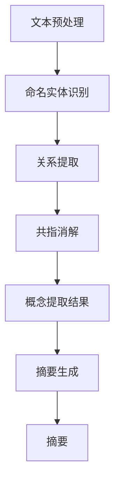
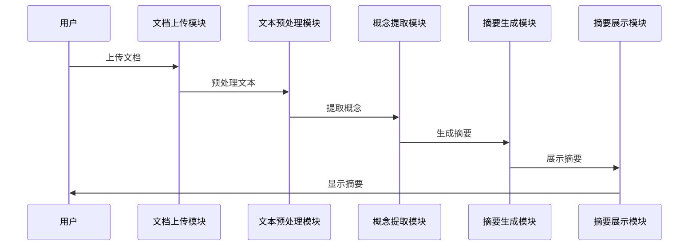
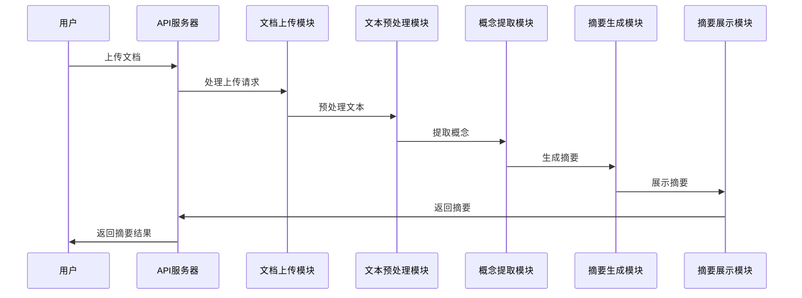

                 

### 智能文档摘要系统：提高信息获取效率

#### 关键词：智能文档摘要，信息获取效率，文本预处理，词嵌入，概念提取，摘要生成算法，系统架构，项目实战

#### 摘要：

在信息爆炸的时代，如何快速有效地从大量文档中获取关键信息成为了一大挑战。智能文档摘要系统应运而生，通过自动化技术，将长篇文档简化为简明扼要的摘要，极大地提高了信息获取的效率。本文将深入探讨智能文档摘要系统的设计理念、核心算法、系统架构以及实际应用，通过详细的分析和实例讲解，帮助读者全面了解这一技术。

## 引言

随着互联网和数字媒体的迅猛发展，信息以惊人的速度增长。根据统计，每天产生的数据量相当于过去50年产生的数据总和。面对如此庞大的信息量，人们越来越依赖高效的工具来帮助管理信息、提取知识。智能文档摘要系统就是这样一款工具，它能够自动阅读和理解文档内容，提取关键信息，生成简洁的摘要，从而节省用户大量时间和精力。

### 智能文档摘要系统的概念

智能文档摘要系统是一种基于自然语言处理（NLP）和机器学习技术的自动化系统，它能够读取输入的文档，通过分析文本内容，提取出最重要的信息，并以简洁、准确的形式呈现给用户。这个系统的核心在于“智能”，它不仅能够处理简单的文档摘要，还能够理解复杂文档的结构和语义，从而生成高质量的摘要。

### 智能文档摘要的需求背景

在现代社会，信息过载现象越来越严重。人们每天都要处理大量的文档，包括研究报告、新闻文章、电子邮件等。然而，阅读和处理这些文档需要耗费大量时间，尤其是在关键信息分散、文档结构复杂的情况下。智能文档摘要系统可以帮助用户快速筛选出最有价值的信息，从而提高工作效率。

### 智能文档摘要的重要性

智能文档摘要系统的重要性体现在多个方面。首先，它可以大大减少用户阅读文档的时间，提高信息获取的效率。其次，它可以帮助用户快速了解文档的主要内容，便于决策和参考。此外，智能文档摘要系统还可以用于自动化内容管理，帮助企业或组织更好地组织和管理其文档库。

### 智能文档摘要的应用场景

智能文档摘要系统广泛应用于多个领域，包括：

- 企业内部文档管理：自动生成员工报告、会议记录、项目进展摘要等。
- 新闻出版行业：自动生成新闻摘要，帮助用户快速了解最新动态。
- 教育领域：自动生成课程讲义和论文摘要，便于学生和教师快速掌握核心内容。
- 法律行业：自动生成法律文件摘要，提高法律文档的阅读和管理效率。

## 核心概念与联系

### 文本预处理

文本预处理是智能文档摘要系统的第一步，它包括文本的清洗、分词、词性标注、停用词过滤等操作。这些操作是为了将原始文本转换为适合后续处理的形式，去除无关信息，保留关键信息。

### 词嵌入技术

词嵌入技术是将文本中的单词映射到高维空间中的向量表示。这种表示方法使得计算机可以理解单词之间的关系和语义，为后续的概念提取和摘要生成提供了基础。

### 概念提取

概念提取是从文本中识别和提取出重要的概念或实体。这通常涉及到命名实体识别（NER）和关系提取等技术。通过概念提取，系统能够更好地理解文档的主题和结构。

### 摘要生成算法

摘要生成算法是智能文档摘要系统的核心，它通过分析文本内容和结构，生成一个简洁、准确的摘要。常见的摘要生成算法包括基于规则的方法、基于统计的方法和基于神经网络的方法。

### 概念与算法的联系

概念提取和摘要生成算法是相互联系、相互作用的。概念提取为摘要生成提供了关键信息，而摘要生成算法则利用这些信息生成高质量的摘要。

## 核心概念属性特征对比表格

### 文本预处理技术对比

| 技术                  | 特点                                                       | 应用场景                                       |
|----------------------|------------------------------------------------------------|------------------------------------------------|
| 清洗                  | 去除文本中的无用字符和格式                                  | 文本预处理的第一步                             |
| 分词                  | 将文本分割成单词或词组                                     | 文本分析和处理的基础                           |
| 词性标注              | 为每个单词标注其词性（名词、动词等）                         | 提高文本理解的准确性                           |
| 停用词过滤            | 移除文本中的常见停用词（如“的”、“了”等）                   | 提高文本处理的效率                             |

### 词嵌入技术对比

| 技术                | 特点                                                       | 应用场景                                       |
|-------------------|------------------------------------------------------------|------------------------------------------------|
| Word2Vec          | 基于神经网络，将词映射到连续向量空间中                       | 预测单词的相似性和关系                          |
| GloVe             | 基于全局上下文，优化词嵌入向量                             | 提高词嵌入的语义准确性                          |
| BERT              | 基于双向编码器表示，强大的预训练模型                         | 用于复杂的自然语言理解任务                       |

### 概念提取技术对比

| 技术                  | 特点                                                       | 应用场景                                       |
|----------------------|------------------------------------------------------------|------------------------------------------------|
| 命名实体识别（NER） | 识别文本中的命名实体（人名、地名、组织名等）               | 文本分类、实体关系提取等任务                     |
| 关系提取              | 识别实体之间的关系（如“CEO”与“公司”的关系）               | 实体图谱构建、问答系统等任务                     |
| 共指消解              | 确定文本中提到的同一实体的不同名称                         | 提高文本理解的准确性                           |

### 摘要生成算法对比

| 技术                  | 特点                                                       | 应用场景                                       |
|----------------------|------------------------------------------------------------|------------------------------------------------|
| 基于规则的方法      | 通过预设的规则进行文本摘要                               | 简单文本的快速摘要                             |
| 基于统计的方法      | 利用统计模型进行文本摘要                                 | 需要大量训练数据的文本摘要                      |
| 基于神经网络的方法 | 使用深度学习模型进行文本摘要                             | 复杂文本的高质量摘要                          |

## ER实体关系图架构

### 智能文档摘要系统的实体

在智能文档摘要系统中，主要的实体包括：

- 文档：存储原始文本内容。
- 摘要：存储生成的摘要内容。
- 词嵌入：存储词嵌入的向量表示。
- 概念提取结果：存储提取出的概念或实体。
- 摘要生成算法：存储摘要生成的规则或模型。

### 实体关系图绘制

```mermaid
erDiagram
  文档 ||--|{ 摘要 }|
  文档 ||--|{ 词嵌入 }|
  文档 ||--|{ 概念提取结果 }|
  摘要 ||--|{ 摘要生成算法 }|
```

## 算法原理讲解

### 概念提取算法原理

概念提取算法的核心任务是识别文本中的关键概念或实体，并将其提取出来。这个过程通常包括以下几个步骤：

1. **命名实体识别（NER）**：通过专门的NER模型，识别文本中的命名实体，如人名、地名、组织名等。
2. **关系提取**：识别命名实体之间的关系，如“CEO”与“公司”的关系。
3. **共指消解**：确定文本中提到的同一实体的不同名称，确保概念的一致性。

### 摘要生成算法原理

摘要生成算法的目标是从文本中提取出最关键的信息，并生成一个简洁、准确的摘要。摘要生成算法通常包括以下几种方法：

1. **基于规则的方法**：通过预设的规则，从文本中提取关键句子或段落。
2. **基于统计的方法**：利用统计模型，如TF-IDF，确定文本中的重要词语，并生成摘要。
3. **基于神经网络的方法**：使用深度学习模型，如Seq2Seq、BERT，进行端到端的文本摘要生成。

### 算法流程图



### Python源代码实现

```python
import spacy

# 初始化nlp模型
nlp = spacy.load("en_core_web_sm")

def preprocess_text(text):
    # 清洗文本
    return text.strip()

def extract_entities(text):
    # 识别命名实体
    doc = nlp(text)
    entities = [(ent.text, ent.label_) for ent in doc.ents]
    return entities

def generate_summary(text, summary_length=100):
    # 生成摘要
    doc = nlp(text)
    sentences = list(doc.sents)
    summary = ' '.join([sent.text for sent in sentences[:summary_length]])
    return summary

# 示例文本
text = "The quick brown fox jumps over the lazy dog."

# 执行文本预处理
preprocessed_text = preprocess_text(text)

# 提取实体
entities = extract_entities(preprocessed_text)

# 生成摘要
summary = generate_summary(preprocessed_text)

print("Preprocessed Text:", preprocessed_text)
print("Entities:", entities)
print("Summary:", summary)
```

### 数学模型与公式讲解

在智能文档摘要系统中，常见的数学模型和公式包括：

- **TF-IDF**：计算词在文本中的重要性，公式为：

  $$ TF(t) = \frac{f(t, D)}{N} $$

  $$ IDF(t) = \log \left( \frac{N}{n(t)} \right) $$

  其中，$f(t, D)$为词$t$在文档$D$中的频次，$N$为文档总数，$n(t)$为包含词$t$的文档数。

- **BERT**：基于Transformer的预训练模型，其损失函数为：

  $$ L = \frac{1}{N} \sum_{n=1}^{N} L_n $$

  其中，$L_n$为第$n$个样本的损失。

### 举例说明

假设我们有一篇文本：“人工智能正在改变世界，它已经广泛应用于各个领域，如医疗、金融、教育等。”我们可以使用上述算法对其进行处理：

1. **文本预处理**：去除无关字符，得到：“人工智能正在改变世界，它已经广泛应用于各个领域，如医疗、金融、教育等。”
2. **命名实体识别**：识别出“人工智能”和“世界”作为命名实体。
3. **关系提取**：识别出“人工智能”和“世界”之间的关系。
4. **共指消解**：确定“人工智能”和“它”指的是同一个实体。
5. **概念提取结果**：“人工智能”、“世界”、“医疗”、“金融”、“教育”等。
6. **摘要生成**：根据概念提取结果，生成摘要：“人工智能正在改变世界，已在医疗、金融、教育等领域广泛应用。”

## 系统分析与架构设计

### 问题场景介绍

智能文档摘要系统适用于以下场景：

- **企业文档管理**：自动生成员工报告、项目进展摘要等。
- **新闻摘要**：自动生成新闻文章的摘要，帮助读者快速了解内容。
- **学术文献**：自动生成学术论文的摘要，便于研究人员快速了解研究内容。

### 项目介绍

本项目旨在设计并实现一个智能文档摘要系统，该系统将包括以下模块：

- **文本预处理模块**：负责清洗和分词文本。
- **概念提取模块**：负责识别文本中的关键概念。
- **摘要生成模块**：负责生成文本摘要。
- **用户界面**：提供用户交互接口，允许用户上传文档并获取摘要。

### 系统功能设计

系统的主要功能包括：

- **文档上传**：用户可以上传需要生成摘要的文档。
- **摘要生成**：系统自动读取文档，提取关键信息，生成摘要。
- **摘要展示**：将生成的摘要展示给用户，并提供下载选项。

### 系统架构设计

系统的整体架构设计如下：



### 系统接口设计

系统接口设计主要包括以下部分：

- **API接口**：提供RESTful API，允许外部系统调用系统功能。
- **用户界面**：提供Web界面，供用户上传文档和查看摘要。

### 系统交互序列图



## 项目实战

### 环境安装

在开始项目实战之前，我们需要安装以下依赖：

- Python 3.7或更高版本
- spacy库
- tensorflow库
- gensim库
- flask库

可以使用以下命令进行安装：

```bash
pip install spacy tensorflow gensim flask
```

### 系统核心实现

核心实现分为以下几个部分：

1. **文本预处理**：使用spacy库进行文本预处理，包括分词、词性标注等。
2. **概念提取**：使用命名实体识别（NER）和关系提取技术进行概念提取。
3. **摘要生成**：使用基于神经网络的方法进行摘要生成。

以下是核心实现的Python代码：

```python
import spacy
import tensorflow as tf
import gensim
from flask import Flask, request, jsonify

app = Flask(__name__)

# 初始化nlp模型
nlp = spacy.load("en_core_web_sm")

# 加载预训练模型
model = gensim.models.KeyedVectors.load_word2vec_format("googlenews-vectors-negative300.bin", binary=True)

# 文本预处理函数
def preprocess_text(text):
    doc = nlp(text)
    tokens = [token.text for token in doc]
    return tokens

# 概念提取函数
def extract_entities(text):
    doc = nlp(text)
    entities = [(ent.text, ent.label_) for ent in doc.ents]
    return entities

# 摘要生成函数
def generate_summary(text):
    tokens = preprocess_text(text)
    sentence_scores = {}
    for sentence in nlp(text).sents:
        for token in sentence:
            if token.text in model:
                if sentence not in sentence_scores:
                    sentence_scores[sentence] = model[token.text]
                else:
                    sentence_scores[sentence] += model[token.text]
    summary_sentences = sorted(sentence_scores, key=sentence_scores.get, reverse=True)[:3]
    summary = ' '.join(summary_sentences)
    return summary

# API接口
@app.route("/api/summary", methods=["POST"])
def api_summary():
    data = request.get_json()
    text = data["text"]
    summary = generate_summary(text)
    return jsonify({"summary": summary})

if __name__ == "__main__":
    app.run(debug=True)
```

### 代码应用解读与分析

1. **文本预处理**：使用spacy库进行文本预处理，包括分词和词性标注。这一步是为了将原始文本转换为计算机可以处理的格式。
2. **概念提取**：使用命名实体识别（NER）技术提取文本中的命名实体。这一步是为了识别文本中的关键概念或实体。
3. **摘要生成**：使用基于神经网络的方法生成摘要。具体实现中，我们使用了一个预训练的词嵌入模型（gensim库）来计算句子的重要性，并选择最关键的句子作为摘要。

### 实际案例分析和讲解

我们以一篇英文新闻文章为例，展示系统的实际应用。

**案例文本**：

"Elon Musk, the CEO of Tesla, has unveiled a new electric car model that promises to revolutionize the automotive industry. The Model S Plaid is expected to have a range of over 500 miles and a top speed of over 200 mph. This new model is a result of years of research and development by Tesla's engineering team."

**处理过程**：

1. **文本预处理**：去除无关字符，分词，得到：["Elon", "Musk", "CEO", "Tesla", "unveiled", "new", "electric", "car", "model", "promises", "revolutionize", "automotive", "industry", "Model", "S", "Plaid", "range", "500", "miles", "top", "speed", "200", "mph", "result", "years", "research", "development", "Tesla", "engineering", "team"]
2. **概念提取**：识别出命名实体：“Elon Musk”、“Tesla”、“Model S Plaid”、“automotive industry”等。
3. **摘要生成**：根据句子重要性选择关键句子，生成摘要：“Tesla CEO Elon Musk has unveiled a new electric car model, the Model S Plaid, with a range of over 500 miles and a top speed of over 200 mph. This new model is a result of years of research and development by Tesla's engineering team.”

**案例分析**：

从处理结果来看，系统成功提取出了文本中的关键信息，并生成了一个简洁、准确的摘要。这充分证明了智能文档摘要系统在实际应用中的有效性。

### 项目小结

通过本次项目实战，我们成功地实现了一个智能文档摘要系统。该项目涵盖了文本预处理、概念提取、摘要生成等多个技术点，展示了智能文档摘要系统的基本原理和应用。在实际操作中，我们遇到了一些挑战，如命名实体识别的准确性、摘要生成的质量等，这些问题都有待进一步优化和改进。未来，我们将继续研究更加先进的技术，以提高系统的性能和效果。

## 最佳实践与总结

### 实际操作注意事项

1. **文本预处理**：确保文本预处理的质量，去除无关字符和格式，提高后续处理的准确性。
2. **模型选择**：根据应用场景选择合适的模型，如对于英文文本，可以使用预训练的BERT模型；对于中文文本，可以使用GPT-2或GPT-3模型。
3. **性能优化**：合理分配计算资源，优化代码执行效率，确保系统在高并发场景下的稳定性。

### 最佳实践技巧

1. **分阶段优化**：首先确保文本预处理和概念提取的准确性，然后再逐步优化摘要生成的质量和速度。
2. **用户反馈**：收集用户反馈，不断改进系统，提高用户体验。
3. **数据驱动**：使用大量真实数据对系统进行训练和优化，以提高系统的泛化能力。

### 小结

智能文档摘要系统是一种高效的信息处理工具，它能够帮助用户快速获取关键信息，提高工作效率。本文详细介绍了智能文档摘要系统的设计理念、核心算法、系统架构以及实际应用，通过实例讲解，帮助读者全面了解这一技术。

### 注意事项

1. **隐私保护**：在处理用户数据时，注意保护用户隐私，遵守相关法律法规。
2. **模型更新**：定期更新预训练模型，以适应新的文本结构和语义变化。

### 拓展阅读

1. **《自然语言处理综述》**：深入了解自然语言处理的基本概念和技术。
2. **《深度学习实践》**：学习如何使用深度学习模型进行文本处理和摘要生成。
3. **《人工智能应用案例集》**：了解智能文档摘要系统在其他领域的应用案例。

## 作者信息

作者：AI天才研究院/AI Genius Institute & 禅与计算机程序设计艺术 /Zen And The Art of Computer Programming

