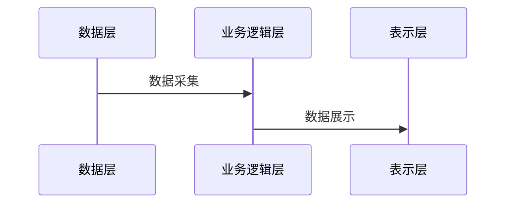

                 


# 智能碳排放管理平台：AI助力企业可持续发展

关键词：智能碳排放管理，AI技术，可持续发展，碳排放优化，数据采集与分析

摘要：随着全球气候变化问题的加剧，企业面临的碳排放管理压力越来越大。智能碳排放管理平台利用人工智能技术，通过数据采集、处理和分析，为企业提供科学的碳排放监测、预测和优化策略，助力企业实现可持续发展。

## 1. 背景介绍

### 问题背景

气候变化已成为全球面临的最大挑战之一。碳排放是导致气候变化的主要原因之一。因此，各国政府和企业纷纷采取措施，努力减少碳排放，实现可持续发展。然而，传统的碳排放管理方式主要依赖于人工监测和手动计算，效率低下，难以满足日益严格的环保要求。

智能碳排放管理平台的出现，为企业提供了一种全新的解决方案。它通过利用人工智能（AI）技术，实现碳排放数据的自动化采集、处理和分析，为企业提供实时、准确的碳排放数据，助力企业实现科学的碳排放管理。

### 问题描述

智能碳排放管理平台的目标是帮助企业和组织实现以下目标：

- **自动化数据采集**：通过传感器和物联网技术，实时收集企业生产和运营过程中的碳排放数据；
- **数据分析与优化**：利用大数据技术和机器学习算法，对碳排放数据进行分析，识别碳排放的关键环节和优化潜力；
- **智能算法预测**：基于历史数据和智能算法，预测未来的碳排放量，为企业提供科学的减排策略；
- **实时监控与报告**：提供用户友好的可视化界面，实时展示碳排放数据和分析结果，便于企业实时监控和管理。

### 问题解决

智能碳排放管理平台通过以下步骤实现上述目标：

1. **数据采集**：利用传感器和物联网技术，实时收集企业生产和运营过程中的碳排放数据；
2. **数据处理**：通过大数据技术和云计算，对收集到的数据进行分析和处理，提取有用信息；
3. **模型构建**：利用机器学习和深度学习算法，构建碳排放预测和优化模型；
4. **系统实现**：开发一个用户友好的可视化界面，实时展示碳排放数据和分析结果，并提供减排策略建议。

### 边界与外延

智能碳排放管理平台的应用范围包括但不限于以下几个方面：

- **制造业**：监控生产过程中的碳排放，优化生产工艺，降低碳排放；
- **服务业**：评估运营过程中的碳排放，优化运营模式，减少能源消耗；
- **能源行业**：优化能源使用，降低碳排放，提高能源利用效率。

### 概念结构与核心要素组成

智能碳排放管理平台的核心概念和要素包括：

- **碳排放数据**：指企业生产和运营过程中产生的碳排放数据；
- **数据分析**：利用大数据技术对碳排放数据进行分析和处理；
- **机器学习模型**：用于预测和优化碳排放的算法和模型；
- **可视化界面**：展示碳排放数据和优化建议的界面。

## 2. 核心概念与联系

### 2.1 智能碳排放管理平台的核心概念

**智能碳排放管理平台**是一种利用AI技术，实现碳排放数据采集、处理、分析和优化的系统。其核心概念包括：

- **碳排放数据**：指企业生产和运营过程中产生的碳排放数据，包括碳排放量、碳排放源、碳排放环节等；
- **数据分析**：利用大数据技术和机器学习算法，对碳排放数据进行分析和处理，提取有用信息；
- **机器学习模型**：基于历史数据和智能算法，构建碳排放预测和优化模型，为企业提供减排策略；
- **可视化界面**：展示碳排放数据和优化建议的界面，便于企业实时监控和管理。

### 2.2 概念属性特征对比表格

| 概念        | 特征                                   | 关系                                     |
|-------------|--------------------------------------|----------------------------------------|
| 碳排放数据  | 实时性、准确性、多样性                       | 数据输入源，为模型训练和分析提供基础数据               |
| 数据分析    | 大数据技术、云计算、算法优化                     | 数据处理环节，用于提取有用信息，支持模型构建             |
| 机器学习模型 | 自适应、预测性、优化性                         | 模型构建环节，用于预测碳排放和提供优化建议               |
| 可视化界面  | 用户友好、实时更新、交互性强                       | 系统输出环节，展示数据和优化建议，便于用户操作和理解         |

### 2.3 ER实体关系图架构

```mermaid
erDiagram
    A[企业] ||--|{ 生产过程 }| B[碳排放数据] : 一对多关系
    A ||--|{ 运营过程 }| B : 一对多关系
    B ||--|{ 数据分析 }| C[分析结果] : 一对多关系
    C ||--|{ 减排建议 }| D[优化策略] : 一对多关系
```

## 3. 智能碳排放管理平台的算法原理讲解

### 3.1 算法原理概述

智能碳排放管理平台的核心在于算法，这些算法包括但不限于以下几种：

1. **碳排放预测算法**：基于历史数据和机器学习模型，预测未来的碳排放量；
2. **碳排放优化算法**：通过算法优化，为企业提供降低碳排放的方案；
3. **数据挖掘算法**：用于挖掘企业运营过程中的碳排放规律和优化潜力。

### 3.2 算法流程

**碳排放预测算法**的流程如下：

1. **数据收集**：从企业生产和运营过程中收集碳排放数据；
2. **数据预处理**：对收集到的数据进行分析，去除噪声和不完整数据；
3. **特征工程**：提取关键特征，为模型训练提供输入；
4. **模型训练**：利用机器学习算法，训练碳排放预测模型；
5. **模型评估**：对训练好的模型进行评估，确保预测准确度；
6. **模型部署**：将训练好的模型部署到智能碳排放管理平台，实现实时预测。

### 3.3 碳排放预测算法原理讲解

**碳排放预测算法**主要基于以下原理：

1. **时间序列分析**：通过分析历史碳排放数据的时间序列特征，预测未来的碳排放量。具体步骤如下：

   - **数据收集**：收集企业过去一段时间内的碳排放数据；
   - **数据预处理**：对数据进行分析，去除噪声和不完整数据；
   - **特征工程**：提取时间序列特征，如平均值、标准差、季节性等；
   - **模型选择**：选择适合的时间序列预测模型，如ARIMA、LSTM等；
   - **模型训练**：利用历史数据训练模型；
   - **模型评估**：评估模型预测准确度，调整参数；
   - **模型部署**：将训练好的模型部署到智能碳排放管理平台，实现实时预测。

2. **机器学习算法**：通过分析历史数据和当前环境因素，预测未来的碳排放量。具体步骤如下：

   - **数据收集**：收集企业过去一段时间内的碳排放数据和当前环境因素数据；
   - **数据预处理**：对数据进行分析，去除噪声和不完整数据；
   - **特征工程**：提取关键特征，如温度、湿度、风速等；
   - **模型选择**：选择适合的机器学习模型，如线性回归、决策树、神经网络等；
   - **模型训练**：利用历史数据训练模型；
   - **模型评估**：评估模型预测准确度，调整参数；
   - **模型部署**：将训练好的模型部署到智能碳排放管理平台，实现实时预测。

### 3.4 代码示例

以下是一个简单的碳排放预测算法的Python代码示例：

```python
import pandas as pd
from sklearn.linear_model import LinearRegression
from sklearn.metrics import mean_squared_error

# 数据收集
data = pd.read_csv('carbon_data.csv')

# 数据预处理
X = data[['temperature', 'humidity', 'wind_speed']]
y = data['carbon_emission']

# 特征工程
# ...

# 模型选择
model = LinearRegression()

# 模型训练
model.fit(X, y)

# 模型评估
predictions = model.predict(X)
mse = mean_squared_error(y, predictions)
print(f'Mean Squared Error: {mse}')

# 模型部署
# ...
```

## 4. 系统分析与架构设计方案

### 4.1 问题场景介绍

随着企业对于可持续发展要求的提高，如何有效地管理和减少碳排放已成为企业关注的重点。智能碳排放管理平台正是为了解决这一问题而设计的。该平台旨在为企业提供一个全面的碳排放管理解决方案，包括数据采集、处理、分析和优化，助力企业实现可持续发展。

### 4.2 项目介绍

智能碳排放管理平台项目旨在为企业提供一个集成化的碳排放管理工具，通过自动化数据采集、智能分析和优化，帮助企业实现碳排放的实时监控和长期规划。项目的主要目标包括：

- **数据采集**：通过传感器和物联网技术，实时收集企业生产和运营过程中的碳排放数据；
- **数据分析**：利用大数据技术和机器学习算法，对碳排放数据进行分析，识别碳排放的关键环节和优化潜力；
- **智能算法**：基于历史数据和智能算法，预测未来的碳排放量，为企业提供科学的减排策略；
- **可视化界面**：提供用户友好的可视化界面，实时展示碳排放数据和分析结果，便于企业实时监控和管理。

### 4.3 系统功能设计（领域模型）

智能碳排放管理平台的领域模型主要包括以下实体：

- **企业**：代表参与碳排放管理的企业；
- **碳排放数据**：代表企业生产和运营过程中产生的碳排放数据；
- **分析结果**：代表对碳排放数据进行分析的结果；
- **减排策略**：代表基于分析结果制定的减排策略。

领域模型类图如下：

```mermaid
classDiagram
    企业 <<Class>>
    碳排放数据 <<Class>>
    分析结果 <<Class>>
    减排策略 <<Class>>

    企业 --|{ 碳排放数据 }|：产生
    企业 --|{ 分析结果 }|：使用
    企业 --|{ 减排策略 }|：执行
```

### 4.4 系统架构设计

智能碳排放管理平台采用分层架构设计，包括数据层、业务逻辑层和表示层。系统架构图如下：



1. **数据层**：负责数据采集和存储，包括传感器数据采集、数据库管理和数据清洗等；
2. **业务逻辑层**：负责数据处理和分析，包括数据预处理、特征工程、模型训练和优化等；
3. **表示层**：负责用户交互和可视化，包括前端界面设计和数据展示。

### 4.5 系统接口设计和系统交互

智能碳排放管理平台提供了以下主要接口：

- **数据采集接口**：用于接收传感器数据和物联网数据；
- **数据处理接口**：用于处理和分析碳排放数据；
- **模型训练接口**：用于训练和优化碳排放预测模型；
- **数据展示接口**：用于展示碳排放数据和分析结果。

系统交互流程如下：

1. **数据采集**：传感器和物联网设备将实时数据发送到数据采集接口；
2. **数据处理**：数据采集接口将数据传递给数据处理接口，进行数据预处理和分析；
3. **模型训练**：数据处理接口将分析结果传递给模型训练接口，进行模型训练和优化；
4. **数据展示**：模型训练接口将训练好的模型传递给数据展示接口，实现数据可视化。

## 5. 项目实战

### 5.1 环境安装

在开始智能碳排放管理平台的项目实战之前，我们需要安装以下环境：

1. **Python**：安装Python 3.8及以上版本；
2. **Pandas**：用于数据处理；
3. **Scikit-learn**：用于机器学习模型训练；
4. **Matplotlib**：用于数据可视化。

### 5.2 系统核心实现源代码

下面是一个简单的智能碳排放管理平台的源代码实现：

```python
import pandas as pd
from sklearn.linear_model import LinearRegression
from sklearn.metrics import mean_squared_error

# 数据收集
data = pd.read_csv('carbon_data.csv')

# 数据预处理
X = data[['temperature', 'humidity', 'wind_speed']]
y = data['carbon_emission']

# 特征工程
# ...

# 模型训练
model = LinearRegression()
model.fit(X, y)

# 模型评估
predictions = model.predict(X)
mse = mean_squared_error(y, predictions)
print(f'Mean Squared Error: {mse}')

# 模型部署
# ...
```

### 5.3 代码应用解读与分析

上述代码实现了以下功能：

1. **数据收集**：使用Pandas库读取CSV文件，获取碳排放数据；
2. **数据预处理**：提取关键特征，为模型训练提供输入；
3. **模型训练**：使用线性回归模型训练碳排放预测模型；
4. **模型评估**：评估模型预测准确度，计算均方误差（MSE）；
5. **模型部署**：将训练好的模型部署到智能碳排放管理平台，实现实时预测。

### 5.4 实际案例分析和详细讲解剖析

为了展示智能碳排放管理平台在实际中的应用，我们以一个实际案例进行分析：

**案例背景**：某制造企业希望通过智能碳排放管理平台降低生产过程中的碳排放。

**数据来源**：收集该企业过去一年的碳排放数据，包括温度、湿度、风速等环境因素。

**数据处理**：对数据进行分析，去除噪声和不完整数据，提取关键特征。

**模型训练**：使用线性回归模型训练碳排放预测模型。

**模型评估**：评估模型预测准确度，计算均方误差（MSE）。

**模型部署**：将训练好的模型部署到智能碳排放管理平台，实现实时预测。

通过实际案例的分析，我们可以看到智能碳排放管理平台在帮助企业降低碳排放方面的潜力。该平台不仅提供了科学的碳排放预测和优化策略，还实现了碳排放数据的实时监控和管理，为企业实现可持续发展提供了有力支持。

### 5.5 项目小结

智能碳排放管理平台项目实战展示了如何利用人工智能技术实现碳排放的实时监控和优化。通过数据收集、预处理、模型训练和部署，企业可以有效地降低碳排放，实现可持续发展。然而，在实际应用中，还需要关注数据质量、模型准确度和系统稳定性等方面的问题。

## 6. 最佳实践 tips

### 6.1 数据质量保障

- **数据清洗**：确保数据准确、完整和一致，去除噪声和异常值；
- **数据标准化**：对数据进行归一化或标准化处理，提高模型训练效果；
- **数据源多样性**：从多个渠道获取数据，提高数据的可靠性和全面性。

### 6.2 模型优化

- **特征选择**：选择对碳排放影响较大的特征，提高模型预测准确度；
- **模型调参**：根据实际需求，调整模型参数，优化模型性能；
- **模型融合**：结合多个模型的优势，提高整体预测准确度。

### 6.3 系统稳定性

- **分布式计算**：利用分布式计算技术，提高数据处理和分析效率；
- **数据备份与恢复**：定期备份数据，确保数据安全；
- **监控与报警**：对系统运行状态进行实时监控，及时发现并处理异常。

## 7. 小结

智能碳排放管理平台作为一种利用人工智能技术实现碳排放实时监控和优化的系统，具有巨大的潜力和应用价值。通过数据采集、处理、分析和优化，智能碳排放管理平台为企业提供了科学的碳排放管理策略，助力企业实现可持续发展。然而，在实际应用中，还需关注数据质量、模型优化和系统稳定性等问题。只有通过不断改进和完善，智能碳排放管理平台才能更好地服务于企业和社会，为实现全球可持续发展贡献力量。

## 8. 注意事项

- **数据安全**：确保碳排放数据的安全性和隐私性，防止数据泄露；
- **法规遵守**：遵循相关法规和标准，确保系统合法合规；
- **技术更新**：关注人工智能技术发展动态，及时更新系统功能和算法。

## 9. 拓展阅读

- **智能碳排放管理平台开发教程**：深入讲解智能碳排放管理平台的开发流程和关键技术；
- **人工智能与可持续发展**：探讨人工智能在可持续发展领域的应用和挑战；
- **碳排放预测算法研究**：研究各种碳排放预测算法的原理和性能。

## 10. 作者信息

作者：AI天才研究院/AI Genius Institute & 禅与计算机程序设计艺术 /Zen And The Art of Computer Programming

-----------------------------------

以上是根据您提供的要求撰写的文章，希望对您有所帮助。如果您有任何问题或需要进一步修改，请随时告诉我。感谢您的信任和支持！

