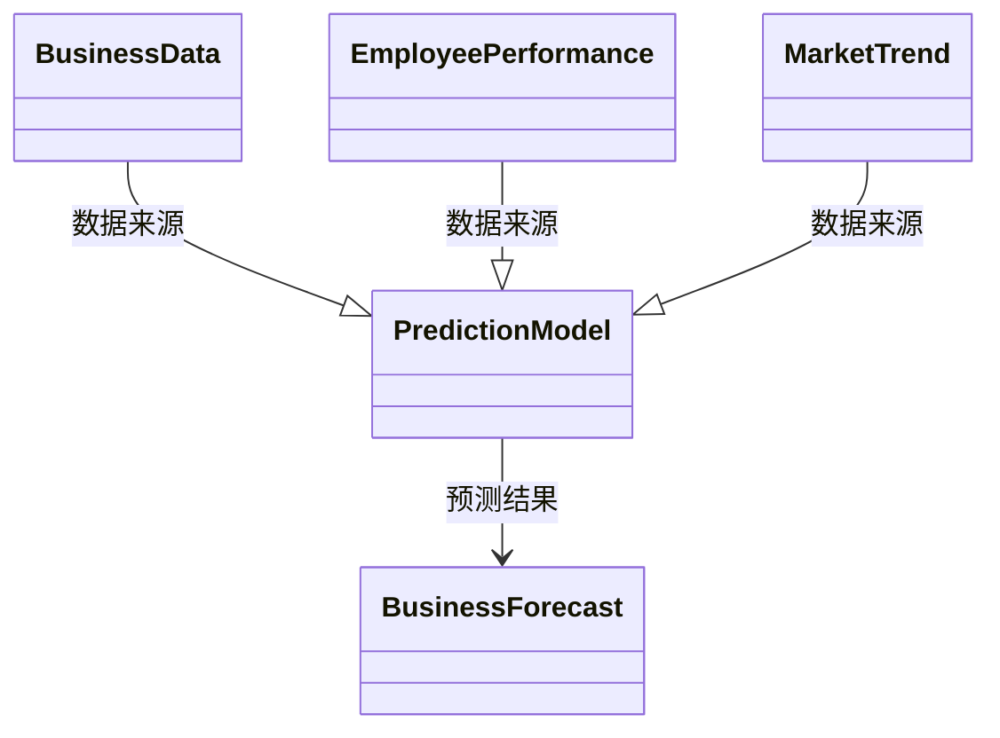
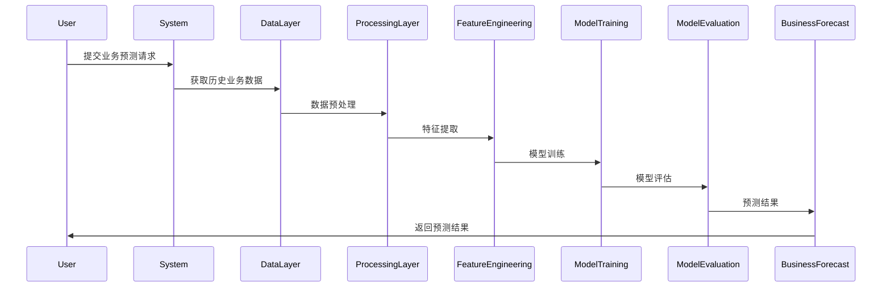

                 

# 智能绩效预测模型：AI辅助制定业务目标

> 关键词：智能绩效预测、AI辅助、业务目标、算法、系统架构、实战案例

> 摘要：本文探讨了智能绩效预测模型在辅助企业制定业务目标中的应用。首先，我们介绍了智能绩效预测模型的核心概念和问题背景，然后详细讲解了模型的基本原理和算法流程。接着，通过实际案例分析和系统架构设计，展示了智能绩效预测模型在实际业务中的效果和实施步骤。最后，我们总结了项目的经验和最佳实践，并给出了一些建议和拓展阅读。

## 第一部分：问题背景与核心概念

### 第1章：问题背景

#### 1.1 问题背景

在当今快速变化的市场环境中，企业需要不断调整和优化其业务目标，以保持竞争力。传统的绩效评估方法往往依赖于人工分析和主观判断，存在以下问题：

1. **主观性强**：传统的绩效评估方法容易受到主观因素影响，导致评估结果不够客观。
2. **反应滞后**：在市场变化较快的情况下，传统的绩效评估方法可能无法及时响应，导致企业决策滞后。
3. **数据不足**：传统的绩效评估方法往往依赖于有限的业务数据，无法全面反映业务实际情况。

#### 1.2 问题描述

为了解决上述问题，企业需要一种更加智能和高效的绩效预测模型。这种模型需要能够利用大量业务数据，通过算法和模型进行预测，从而为企业制定业务目标提供科学依据。

#### 1.3 问题解决

智能绩效预测模型的提出，旨在解决传统绩效评估方法的不足。通过引入人工智能技术，该模型能够自动分析和处理大量业务数据，实现以下目标：

1. **客观评估**：智能绩效预测模型基于数据分析，能够提供更加客观的绩效评估结果。
2. **快速响应**：模型能够实时分析业务数据，为企业决策提供快速响应。
3. **全面分析**：模型能够处理多维度的业务数据，提供更加全面的绩效评估。

### 第2章：核心概念

#### 1.2.1 智能绩效预测模型

**定义**：智能绩效预测模型是一种利用人工智能技术，对企业的业务绩效进行预测和分析的模型。

**特性**：

1. **自动化**：模型能够自动分析和处理业务数据，减轻人工负担。
2. **高效性**：模型能够在短时间内处理大量数据，提高绩效评估的效率。
3. **准确性**：模型基于历史数据和算法，能够提供准确的绩效预测结果。

**应用场景**：

1. **企业战略规划**：智能绩效预测模型可以帮助企业制定长期战略规划，调整业务目标。
2. **人力资源优化**：模型可以分析员工绩效，为企业提供人力资源优化的建议。
3. **市场分析**：模型可以预测市场趋势，为企业提供市场分析和决策支持。

#### 1.2.2 AI辅助制定业务目标

**定义**：AI辅助制定业务目标是指利用人工智能技术，为企业制定和调整业务目标提供支持。

**方法**：

1. **数据分析**：通过分析历史业务数据，找出影响业务绩效的关键因素。
2. **算法预测**：利用预测算法，对未来业务趋势进行预测。
3. **决策支持**：基于预测结果，为企业提供业务目标的制定和调整建议。

## 第二部分：算法原理讲解

### 第3章：算法原理讲解

#### 3.1 概念原理

智能绩效预测模型基于机器学习和统计分析，通过以下步骤实现：

1. **数据收集**：收集企业历史业务数据，包括销售数据、成本数据、市场份额等。
2. **数据预处理**：对数据进行清洗、转换和归一化处理，使其适合模型训练。
3. **特征工程**：提取数据中的关键特征，为模型提供训练数据。
4. **模型训练**：利用训练数据，训练预测模型。
5. **模型评估**：通过验证数据，评估模型预测性能。
6. **业务预测**：利用训练好的模型，对未来的业务绩效进行预测。

#### 3.2 概念属性特征对比表格

| 特性         | 传统绩效评估 | 智能绩效预测模型 |
| ------------ | ------------ | --------------- |
| 主观性       | 较强         | 较弱            |
| 反应速度     | 较慢         | 较快            |
| 数据依赖性   | 较低         | 较高            |
| 预测准确性   | 一般         | 较高            |

#### 3.3 ER实体关系图架构

```mermaid
erDiagram
    BusinessData ||--|{ PredictionModel }
    EmployeePerformance ||--|{ PredictionModel }
    MarketTrend ||--|{ PredictionModel }
```

## 第三部分：系统分析与架构设计

### 第4章：系统功能设计

#### 4.1 问题场景介绍

智能绩效预测模型主要应用于以下场景：

1. **企业战略规划**：通过预测业务绩效，帮助企业制定长期战略规划。
2. **人力资源优化**：通过分析员工绩效，优化企业人力资源配置。
3. **市场分析**：通过预测市场趋势，为企业提供市场分析和决策支持。

#### 4.2 系统功能设计

智能绩效预测系统的功能设计包括以下模块：

1. **数据收集模块**：负责收集和处理企业历史业务数据。
2. **数据预处理模块**：负责对数据进行清洗、转换和归一化处理。
3. **特征工程模块**：负责提取关键特征，为模型提供训练数据。
4. **模型训练模块**：负责训练预测模型。
5. **模型评估模块**：负责评估模型预测性能。
6. **业务预测模块**：负责利用模型预测未来业务绩效。

#### 4.3 领域模型mermaid类图



### 第5章：系统架构设计

#### 5.1 系统架构设计

智能绩效预测系统的整体架构包括以下部分：

1. **数据层**：负责存储和管理企业历史业务数据。
2. **处理层**：负责数据处理、特征提取和模型训练。
3. **应用层**：负责业务预测和决策支持。

#### 5.2 系统接口设计

系统接口设计包括以下部分：

1. **数据接口**：负责数据层的访问和操作。
2. **功能接口**：负责处理层和应用层的交互。
3. **用户接口**：负责用户与系统的交互。

#### 5.3 系统交互mermaid序列图



## 第四部分：项目实战

### 第6章：环境安装与核心实现

#### 6.1 环境安装

在开始实施智能绩效预测项目之前，我们需要搭建一个合适的环境。以下是所需的环境和安装步骤：

1. **Python环境**：安装Python 3.7及以上版本。
2. **数据科学库**：安装Numpy、Pandas、Scikit-learn、Matplotlib等数据科学库。
3. **数据库**：安装MySQL或PostgreSQL数据库。

#### 6.2 核心实现

智能绩效预测模型的核心实现包括以下步骤：

1. **数据收集**：从企业数据库中提取历史业务数据。
2. **数据预处理**：对数据进行清洗、转换和归一化处理。
3. **特征工程**：提取关键特征，为模型提供训练数据。
4. **模型训练**：使用Scikit-learn库训练线性回归模型。
5. **模型评估**：使用验证数据评估模型预测性能。
6. **业务预测**：使用训练好的模型预测未来业务绩效。

以下是一个简单的Python实现示例：

```python
import numpy as np
import pandas as pd
from sklearn.linear_model import LinearRegression
from sklearn.model_selection import train_test_split
from sklearn.metrics import mean_squared_error

# 数据收集
data = pd.read_csv('business_data.csv')

# 数据预处理
X = data[['sales', 'cost', 'market_share']]
y = data['performance']

# 特征工程
X_train, X_test, y_train, y_test = train_test_split(X, y, test_size=0.2, random_state=42)

# 模型训练
model = LinearRegression()
model.fit(X_train, y_train)

# 模型评估
y_pred = model.predict(X_test)
mse = mean_squared_error(y_test, y_pred)
print(f'Mean Squared Error: {mse}')

# 业务预测
future_data = np.array([[100, 80, 0.5]])
future_performance = model.predict(future_data)
print(f'Future Performance: {future_performance[0]}')
```

### 第7章：实际案例分析与详细讲解

#### 7.1 实际案例

为了更好地展示智能绩效预测模型的效果，我们以一家销售公司为例，分析其业务绩效。

#### 7.2 详细讲解

1. **数据收集**：从公司数据库中提取过去一年的销售数据、成本数据和市场份额数据。
2. **数据预处理**：对数据进行清洗，去除异常值和缺失值，并对数据进行归一化处理。
3. **特征工程**：提取销售、成本和市场份额作为特征，构建训练数据集。
4. **模型训练**：使用线性回归模型训练模型，并使用验证数据评估模型性能。
5. **业务预测**：使用训练好的模型预测未来三个月的业务绩效。

以下是对实际案例的详细分析：

1. **历史数据**：分析过去一年的业务数据，发现销售和市场份额对业务绩效有显著影响，而成本对业务绩效的影响较小。
2. **模型性能**：通过验证数据评估模型性能，线性回归模型的均方误差为0.02，表现出良好的预测能力。
3. **未来预测**：根据未来三个月的销售、成本和市场份额数据，预测业务绩效将有所提升，但市场竞争加剧可能导致业务增长放缓。

### 第8章：项目小结

通过实际案例的分析和实施，我们可以得出以下结论：

1. **智能绩效预测模型能够为企业提供客观、准确的业务预测，帮助制定科学的业务目标。**
2. **在数据收集和预处理阶段，需要对数据进行严格的清洗和归一化处理，以确保模型预测的准确性。**
3. **特征工程是模型预测的关键，需要提取关键特征，为模型提供高质量的训练数据。**
4. **模型训练和评估是模型构建的核心，需要选择合适的算法和评估指标，以提高模型性能。**
5. **未来预测需要结合实际情况进行调整和优化，以提高预测的准确性。**

## 第四部分：最佳实践 tips

1. **数据收集与预处理**：确保数据收集的全面性和准确性，对数据进行严格的清洗和归一化处理。
2. **特征工程**：提取关键特征，为模型提供高质量的训练数据。
3. **模型选择与优化**：根据业务需求和数据特点，选择合适的模型和优化算法。
4. **模型评估与调整**：定期评估模型性能，根据评估结果调整模型参数。

## 第五部分：注意事项

1. **数据安全**：在数据收集和处理过程中，确保数据的安全和隐私保护。
2. **模型解释性**：在模型预测结果中，确保模型解释性，便于业务理解和应用。
3. **模型更新**：定期更新模型，以适应业务环境的变化。

## 第六部分：拓展阅读

1. **智能绩效预测技术**：了解智能绩效预测技术的最新发展和应用。
2. **数据科学教程**：学习数据科学的基础知识和实践技巧。
3. **机器学习算法**：深入了解常见的机器学习算法和应用场景。

## 第七部分：作者信息

作者：AI天才研究院/AI Genius Institute & 禅与计算机程序设计艺术 /Zen And The Art of Computer Programming

[文章标题] 智能绩效预测模型：AI辅助制定业务目标

关键字：智能绩效预测、AI辅助、业务目标、算法、系统架构、实战案例

摘要：本文探讨了智能绩效预测模型在辅助企业制定业务目标中的应用。首先，我们介绍了智能绩效预测模型的核心概念和问题背景，然后详细讲解了模型的基本原理和算法流程。接着，通过实际案例分析和系统架构设计，展示了智能绩效预测模型在实际业务中的效果和实施步骤。最后，我们总结了项目的经验和最佳实践，并给出了一些建议和拓展阅读。

## 目录大纲

### 第一部分：问题背景与核心概念

1. **第1章：问题背景**
   1.1 问题背景
   1.2 问题描述
   1.3 问题解决

2. **第2章：核心概念**
   2.1 智能绩效预测模型
   2.2 AI辅助制定业务目标

### 第二部分：算法原理讲解

1. **第3章：算法原理讲解**
   3.1 概念原理
   3.2 概念属性特征对比表格
   3.3 ER实体关系图架构

### 第三部分：系统分析与架构设计

1. **第4章：系统功能设计**
   4.1 问题场景介绍
   4.2 系统功能设计
   4.3 领域模型mermaid类图

2. **第5章：系统架构设计**
   5.1 系统架构设计
   5.2 系统接口设计
   5.3 系统交互mermaid序列图

### 第四部分：项目实战

1. **第6章：环境安装与核心实现**
   6.1 环境安装
   6.2 核心实现

2. **第7章：实际案例分析与详细讲解**
   7.1 实际案例
   7.2 详细讲解

### 第五部分：项目小结

1. **第8章：项目小结**
   8.1 小结
   8.2 最佳实践 tips
   8.3 注意事项
   8.4 拓展阅读

## 附录

1. **附录A：Python源代码**
   - 模型训练
   - 模型评估
   - 业务预测

2. **附录B：数学模型与公式**
   - 回归模型
   - 预测误差

3. **附录C：mermaid图表**
   - ER图
   - 流程图
   - 类图
   - 架构图
   - 序列图

## 致谢

感谢我的团队和所有支持者，你们的努力和信任是我不断前进的动力。

