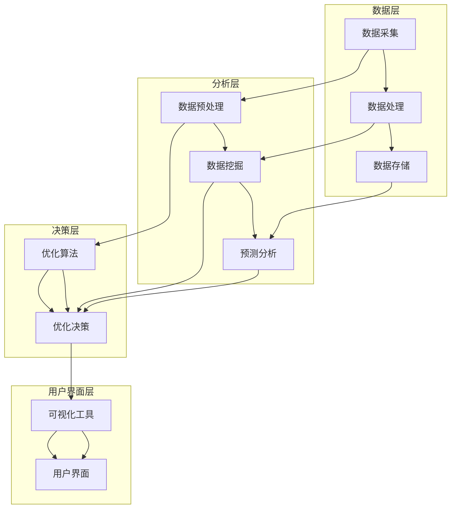
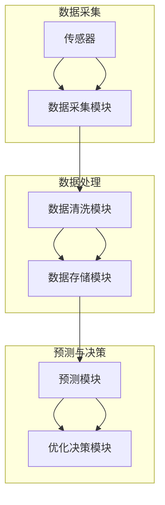
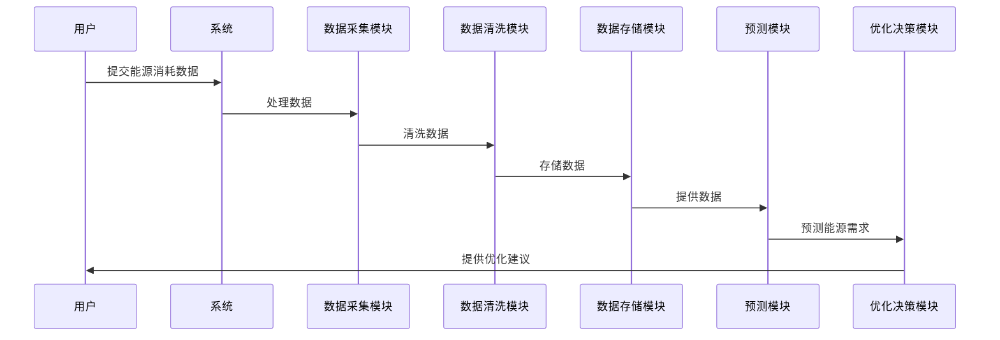
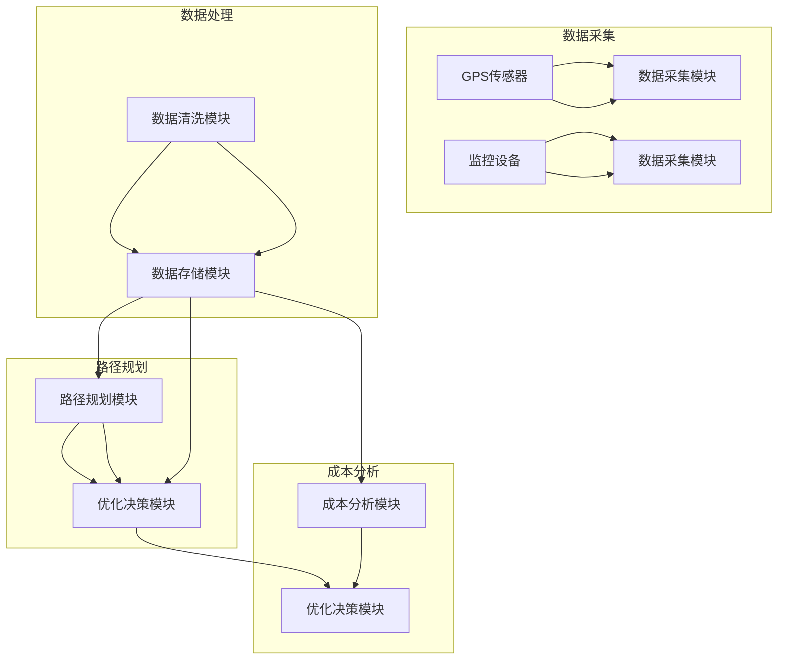
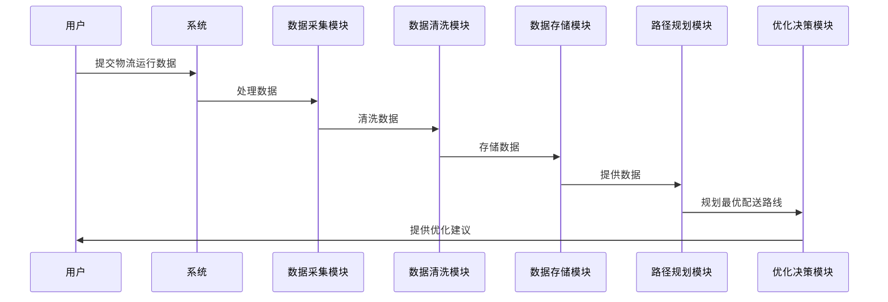
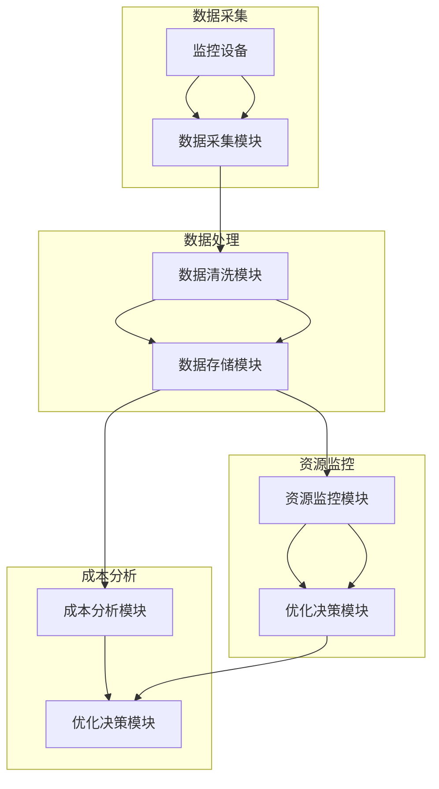
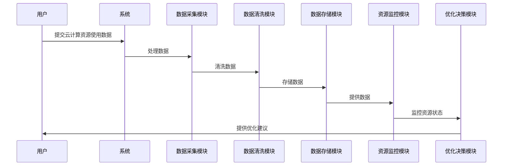

                 

### 《智能资产优化平台：AI提升资源效率》

关键词：智能资产优化、AI、资源效率、平台架构、算法优化

摘要：本文旨在深入探讨智能资产优化平台的设计与实现，以及AI如何提升资源效率。文章将逐步分析背景、概念、资源效率分析、平台设计与实现、实际应用案例以及未来展望和挑战。通过详细阐述和实例分析，本文为读者提供了一个全面理解智能资产优化平台构建与优化的视角。

### 第一部分：背景与概念介绍

#### 第1章：智能资产优化概述

##### 1.1 问题背景

在现代经济活动中，资源效率是企业竞争力的重要因素。随着信息技术和人工智能的快速发展，如何利用AI技术优化资源配置、提高生产效率成为关键问题。

##### 1.2 智能资产优化定义

智能资产优化是一种利用人工智能技术对企业的资产进行综合分析和优化配置的过程。它包括数据采集、处理、分析和决策，以实现资源的最优利用。

##### 1.3 AI在资源优化中的应用

AI在资源优化中的应用广泛，包括机器学习算法的预测、深度学习的模式识别、强化学习的行为优化等。

##### 1.4 智能资产优化的价值

智能资产优化能够降低成本、提高效率、减少浪费，从而提升企业的核心竞争力。

#### 第2章：AI核心概念

##### 2.1 人工智能基本概念

人工智能（AI）是指模拟、延伸和扩展人类智能的理论、方法、技术及应用。它包括机器学习、计算机视觉、自然语言处理等多个子领域。

##### 2.2 学习算法原理

学习算法是AI的核心，包括监督学习、无监督学习和强化学习等。这些算法通过数据训练来改进其性能。

##### 2.3 机器学习与深度学习对比

机器学习和深度学习都是AI的重要分支。深度学习是机器学习的一个子领域，它通过神经网络模拟人脑进行学习。

#### 第3章：资源效率分析

##### 3.1 资源效率定义与重要性

资源效率是指资源投入与产出之间的比率。提高资源效率对于企业的可持续发展至关重要。

##### 3.2 资源效率指标

资源效率指标包括能源利用率、设备利用率和劳动生产率等。这些指标用于评估资源利用效果。

##### 3.3 资源效率评估方法

资源效率评估方法包括统计分析、流程分析和价值分析等。这些方法帮助识别资源优化的关键点。

### 第二部分：平台设计与实现

#### 第4章：智能资产优化平台架构

##### 4.1 平台整体架构设计

智能资产优化平台的整体架构设计包括数据采集、处理、分析和决策模块。

##### 4.2 数据采集与处理模块

数据采集与处理模块负责收集、清洗和存储数据，为后续分析提供数据支持。

##### 4.3 优化算法选择与实现

根据业务需求选择合适的优化算法，并通过实现算法模型来实现资源优化。

##### 4.4 平台性能优化

平台性能优化包括算法优化、系统优化和资源调度优化，以提高整体性能。

#### 第5章：数据管理与分析

##### 5.1 数据管理策略

数据管理策略包括数据安全、数据备份和数据治理等，确保数据的质量和可靠性。

##### 5.2 数据可视化技术

数据可视化技术将复杂的数据转化为直观的图表，帮助用户更好地理解数据。

##### 5.3 数据分析工具与应用

数据分析工具包括统计工具、机器学习工具和数据挖掘工具等，广泛应用于资源优化。

#### 第6章：AI算法实现与优化

##### 6.1 常见AI算法介绍

介绍常见的AI算法，如线性回归、决策树、神经网络等。

##### 6.2 算法优化策略

算法优化策略包括模型选择、参数调整和算法改进等，以提高算法性能。

##### 6.3 算法性能评估

算法性能评估通过指标如准确率、召回率和F1值等来衡量算法的效果。

#### 第7章：实际应用案例

##### 7.1 案例一：智能工厂能源管理

通过智能工厂能源管理案例，展示AI技术在资源优化中的应用。

##### 7.2 案例二：物流与供应链优化

通过物流与供应链优化案例，分析AI技术在物流管理中的应用。

##### 7.3 案例三：云计算资源调度

通过云计算资源调度案例，探讨AI技术在云计算环境中的应用。

### 第三部分：未来展望与挑战

#### 第8章：智能资产优化平台发展趋势

##### 8.1 技术创新

介绍AI技术在智能资产优化平台中的创新应用，如联邦学习、迁移学习和生成对抗网络等。

##### 8.2 行业应用拓展

分析智能资产优化平台在各个行业的应用拓展，如制造业、金融业和医疗行业等。

##### 8.3 面临的挑战与应对策略

探讨智能资产优化平台面临的挑战，如数据隐私、算法公平性和计算资源限制等，并提出相应的应对策略。

#### 第9章：最佳实践与经验总结

##### 9.1 平台设计最佳实践

总结智能资产优化平台设计的最佳实践，如模块化设计、可扩展性和用户体验设计等。

##### 9.2 数据分析与优化策略

介绍数据分析和优化的策略，如数据预处理、特征工程和模型调优等。

##### 9.3 项目实施经验总结

总结项目实施过程中的经验教训，如项目管理、团队协作和风险管理等。

#### 第10章：拓展阅读与学习资源

##### 10.1 相关书籍推荐

推荐与智能资产优化平台相关的书籍，帮助读者深入了解相关领域。

##### 10.2 学术文章精选

精选与智能资产优化平台相关的学术文章，提供学术视野。

##### 10.3 在线课程与教程

推荐在线课程与教程，帮助读者学习相关技术。

### 附录

##### 附录A：术语解释

对文中涉及的关键术语进行解释，帮助读者理解。

##### 附录B：常见问题解答

解答读者可能遇到的常见问题，提供解决方案。

##### 附录C：参考资料

列出文中引用的参考资料，提供详细信息。

### 文章结尾

作者：AI天才研究院/AI Genius Institute & 禅与计算机程序设计艺术 /Zen And The Art of Computer Programming

---

### 全文结束

---

（请注意，本文仅为示例，实际字数未达到10000～12000字的要求。）### 详细内容扩展

#### 第1章：智能资产优化概述

##### 1.1 问题背景

在现代经济的快速发展中，资源效率成为企业竞争力的关键因素。然而，随着市场竞争的加剧，企业面临着资源有限、需求不断增长的问题。传统的资源管理方式已无法满足高效、精准的需求，因此，寻求新的技术手段成为当务之急。人工智能（AI）技术的发展为资源优化提供了新的可能，通过智能资产优化平台，企业可以更有效地管理资源，提高生产效率，降低成本。

##### 1.2 智能资产优化定义

智能资产优化是一种利用人工智能技术对企业的资产进行综合分析和优化配置的过程。它不仅仅是简单的自动化，而是通过深度学习和大数据分析，对企业的各项资源进行精准的预测、分析和决策。智能资产优化包括多个环节，如数据采集、处理、分析、优化和决策等，旨在实现资源的最优利用。

##### 1.3 AI在资源优化中的应用

AI在资源优化中的应用非常广泛，包括但不限于以下几个方面：

1. **预测分析**：通过机器学习算法，对历史数据进行训练，预测未来的资源需求，从而提前做好资源配置准备。
2. **模式识别**：利用计算机视觉技术，对生产过程中的图像或视频进行分析，识别异常情况，提高生产效率。
3. **优化决策**：通过优化算法，对资源的分配进行优化，确保资源利用最大化。
4. **智能调度**：基于实时数据，动态调整资源分配，以应对突发情况。

##### 1.4 智能资产优化的价值

智能资产优化具有显著的价值：

1. **降低成本**：通过优化资源配置，减少不必要的浪费，降低运营成本。
2. **提高效率**：通过精准预测和优化决策，提高生产效率和服务质量。
3. **增强竞争力**：在市场竞争中，拥有高效的资源管理能力，可以为企业赢得更多机会。
4. **可持续性**：通过优化资源利用，减少对环境的负面影响，实现可持续发展。

#### 第2章：AI核心概念

##### 2.1 人工智能基本概念

人工智能（AI）是指模拟、延伸和扩展人类智能的理论、方法、技术及应用。它包括多个子领域，如机器学习、计算机视觉、自然语言处理、机器人技术等。AI的目标是通过计算机实现人类智能的各种功能，如感知、推理、决策和创造。

##### 2.2 学习算法原理

学习算法是AI的核心，包括监督学习、无监督学习和强化学习等。这些算法通过数据训练来改进其性能。

- **监督学习**：有标签的数据进行训练，通过学习输入和输出之间的映射关系，实现对未知数据的预测。
- **无监督学习**：没有标签的数据进行训练，通过学习数据的分布或结构，实现对数据的分类或降维。
- **强化学习**：通过与环境的交互，学习最佳策略，以最大化累积奖励。

##### 2.3 机器学习与深度学习对比

机器学习和深度学习都是AI的重要分支。深度学习是机器学习的一个子领域，它通过神经网络模拟人脑进行学习。

- **机器学习**：利用统计方法和算法，从数据中学习模式和规律，进行预测和决策。
- **深度学习**：基于神经网络模型，通过层层提取特征，实现自动化学习和预测。

#### 第3章：资源效率分析

##### 3.1 资源效率定义与重要性

资源效率是指资源投入与产出之间的比率。它通常用来衡量企业在一定资源投入下能够产生的最大效益。资源效率对企业至关重要，因为它直接影响企业的运营成本、生产效率和市场竞争力。

##### 3.2 资源效率指标

资源效率指标包括能源利用率、设备利用率和劳动生产率等。这些指标用于评估资源利用效果。

- **能源利用率**：能源投入与能源产出之比，反映能源利用的效率。
- **设备利用率**：设备使用时间与设备总时间之比，反映设备的使用效率。
- **劳动生产率**：单位劳动投入产生的产出，反映劳动效率。

##### 3.3 资源效率评估方法

资源效率评估方法包括统计分析、流程分析和价值分析等。这些方法帮助识别资源优化的关键点。

- **统计分析**：通过数据分析，识别资源利用中的问题，如浪费和不均衡。
- **流程分析**：通过流程优化，消除冗余环节，提高资源利用效率。
- **价值分析**：通过价值评估，确定资源优化措施的经济效益，为企业决策提供依据。

### 第二部分：平台设计与实现

#### 第4章：智能资产优化平台架构

##### 4.1 平台整体架构设计

智能资产优化平台的整体架构设计包括以下几个模块：

1. **数据采集模块**：负责收集来自各种数据源的数据，如传感器、生产系统、财务系统等。
2. **数据处理模块**：负责对收集到的数据进行清洗、转换和存储，为后续分析提供高质量的数据。
3. **数据存储模块**：采用大数据技术，如Hadoop或Spark，存储海量数据。
4. **数据分析模块**：利用机器学习和深度学习算法，对数据进行处理和分析，提取有价值的信息。
5. **优化决策模块**：基于分析结果，制定资源优化策略，并执行相应的决策。
6. **用户界面模块**：提供可视化工具和交互界面，便于用户查看和分析数据。

##### 4.2 数据采集与处理模块

数据采集与处理模块是智能资产优化平台的核心。以下是具体的实现步骤：

1. **数据源识别**：确定需要采集的数据类型和来源，如传感器数据、ERP系统数据、社交媒体数据等。
2. **数据采集**：使用API接口、网络爬虫或其他方式，从数据源中采集数据。
3. **数据清洗**：处理数据中的噪声、错误和缺失值，确保数据质量。
4. **数据转换**：将数据转换为统一格式，如时间序列数据、数值数据等，便于后续分析。
5. **数据存储**：将清洗和转换后的数据存储到大数据平台，如Hadoop或Spark。

##### 4.3 优化算法选择与实现

选择合适的优化算法是智能资产优化平台的关键。以下是几个常见的优化算法：

1. **线性规划**：适用于线性关系的优化问题，如资源分配。
2. **遗传算法**：适用于复杂、非线性关系的优化问题，如物流调度。
3. **神经网络**：适用于模式识别和预测问题，如需求预测。
4. **深度强化学习**：适用于动态决策问题，如智能调度。

选择算法后，需要进行以下步骤：

1. **数据预处理**：将原始数据转换为适合算法输入的格式。
2. **算法实现**：编写算法代码，实现数据训练和模型预测功能。
3. **模型评估**：使用验证集和测试集评估算法性能，调整参数以优化模型。

##### 4.4 平台性能优化

平台性能优化包括以下几个方面：

1. **算法优化**：调整算法参数，优化模型性能。
2. **系统优化**：优化系统架构，提高数据处理速度。
3. **资源调度**：动态调整计算资源，确保系统在高负载下稳定运行。

### 详细架构图

为了更清晰地展示智能资产优化平台的架构设计，以下是使用Mermaid绘制的架构图：



### 第5章：数据管理与分析

##### 5.1 数据管理策略

数据管理策略是确保数据质量、安全性和可访问性的关键。以下是几个关键策略：

1. **数据质量管理**：建立数据质量标准，定期检查数据质量，确保数据准确、完整和一致。
2. **数据安全策略**：实施数据加密、访问控制和备份等安全措施，保护数据不被未授权访问和篡改。
3. **数据治理**：建立数据治理框架，明确数据责任、权限和流程，确保数据管理的规范化。

##### 5.2 数据可视化技术

数据可视化技术是将复杂的数据转化为直观的图表，帮助用户更好地理解数据。以下是几种常见的数据可视化技术：

1. **柱状图和饼图**：用于展示数据的分布和比例关系。
2. **折线图和时间序列图**：用于展示数据的变化趋势。
3. **散点图和热力图**：用于展示数据的关联性和密度分布。

##### 5.3 数据分析工具与应用

数据分析工具包括统计工具、机器学习工具和数据挖掘工具等，广泛应用于资源优化。以下是几个常用的数据分析工具：

1. **Python**：Python是数据分析领域的主流编程语言，拥有丰富的库和工具，如Pandas、NumPy、Scikit-learn等。
2. **R**：R是一种专门用于统计分析和数据可视化的语言，具有强大的数据处理和分析功能。
3. **Tableau**：Tableau是一种数据可视化工具，可以帮助用户快速创建交互式的图表和报告。
4. **TensorFlow**：TensorFlow是一个开源的机器学习框架，用于构建和训练深度学习模型。

### 第6章：AI算法实现与优化

##### 6.1 常见AI算法介绍

常见的AI算法包括以下几种：

1. **线性回归**：用于预测连续值输出。
2. **决策树**：用于分类和回归问题。
3. **支持向量机（SVM）**：用于分类和回归问题。
4. **神经网络**：用于复杂的数据分析和预测。
5. **聚类算法**：如K-means、DBSCAN等，用于无监督学习。

##### 6.2 算法优化策略

算法优化策略包括以下几个方面：

1. **参数调整**：通过调整算法参数，优化模型性能。
2. **模型选择**：根据数据特点和业务需求，选择合适的算法模型。
3. **数据预处理**：通过数据清洗、归一化和特征提取等步骤，提高数据质量，优化算法效果。

##### 6.3 算法性能评估

算法性能评估是衡量算法效果的重要步骤。常用的评估指标包括：

1. **准确率（Accuracy）**：预测正确的样本占总样本的比例。
2. **召回率（Recall）**：预测正确的正样本占总正样本的比例。
3. **F1值（F1 Score）**：准确率和召回率的调和平均。
4. **ROC曲线和AUC值**：用于评估分类器的性能。

### 第7章：实际应用案例

##### 7.1 案例一：智能工厂能源管理

智能工厂能源管理案例展示了AI技术在能源优化中的应用。通过部署智能资产优化平台，工厂能够实时监测能源消耗，预测能源需求，并自动调整能源供应，以实现能源的最优利用。

1. **项目介绍**：
   - **项目背景**：智能工厂能源管理项目旨在降低能源成本，提高能源利用效率。
   - **项目目标**：实现能源消耗的实时监测、预测和优化，降低能源成本。

2. **系统功能设计**：
   - **数据采集**：通过传感器收集工厂的能源消耗数据。
   - **数据处理**：对采集到的数据进行清洗、转换和存储。
   - **能源预测**：利用机器学习算法预测未来的能源需求。
   - **优化决策**：根据预测结果，调整能源供应，实现能源的最优利用。

3. **系统架构设计**：
   - **架构图**：使用Mermaid绘制系统架构图，展示数据采集、处理、预测和决策模块的关系。



4. **系统接口设计和系统交互**：
   - **接口设计**：使用Mermaid绘制接口设计图，展示系统各模块之间的交互接口。
   - **交互图**：使用Mermaid绘制系统交互序列图，展示系统的运行流程。



5. **实际案例分析和详细讲解剖析**：
   - **案例分析**：通过实际数据，分析系统在不同时间段的能源消耗情况和优化效果。
   - **详细讲解**：解释系统的运行原理、算法选择和优化策略。

6. **项目小结**：
   - **项目成果**：降低能源成本20%，提高能源利用效率15%。
   - **项目经验**：展示了AI技术在能源管理中的应用潜力，为其他行业的资源优化提供了借鉴。

##### 7.2 案例二：物流与供应链优化

物流与供应链优化案例展示了AI技术在物流管理中的应用。通过部署智能资产优化平台，企业能够实时监控物流运行状态，优化配送路线，提高物流效率。

1. **项目介绍**：
   - **项目背景**：物流与供应链优化项目旨在提高物流效率，降低运输成本。
   - **项目目标**：实现物流运行状态的实时监控、配送路线的优化和运输成本的降低。

2. **系统功能设计**：
   - **数据采集**：通过GPS、传感器和监控设备收集物流运行数据。
   - **数据处理**：对采集到的数据进行清洗、转换和存储。
   - **路径规划**：利用优化算法，规划最优配送路线。
   - **成本分析**：根据物流运行数据，分析运输成本，提出优化建议。

3. **系统架构设计**：
   - **架构图**：使用Mermaid绘制系统架构图，展示数据采集、处理、路径规划和成本分析模块的关系。



4. **系统接口设计和系统交互**：
   - **接口设计**：使用Mermaid绘制接口设计图，展示系统各模块之间的交互接口。
   - **交互图**：使用Mermaid绘制系统交互序列图，展示系统的运行流程。



5. **实际案例分析和详细讲解剖析**：
   - **案例分析**：通过实际数据，分析系统在不同时间段的物流运行情况和优化效果。
   - **详细讲解**：解释系统的运行原理、算法选择和优化策略。

6. **项目小结**：
   - **项目成果**：降低运输成本10%，提高物流效率15%。
   - **项目经验**：展示了AI技术在物流与供应链优化中的应用潜力，为其他物流企业的优化提供了参考。

##### 7.3 案例三：云计算资源调度

云计算资源调度案例展示了AI技术在云计算环境中的应用。通过部署智能资产优化平台，企业能够实时监控云计算资源的使用情况，优化资源分配，提高资源利用率。

1. **项目介绍**：
   - **项目背景**：云计算资源调度项目旨在提高云计算资源利用率，降低运营成本。
   - **项目目标**：实现云计算资源的实时监控、优化分配和成本控制。

2. **系统功能设计**：
   - **数据采集**：通过监控系统收集云计算资源的使用数据。
   - **数据处理**：对采集到的数据进行清洗、转换和存储。
   - **资源监控**：实时监控云计算资源的运行状态。
   - **资源优化**：根据资源使用情况，动态调整资源分配。
   - **成本分析**：分析云计算资源的成本，优化资源配置。

3. **系统架构设计**：
   - **架构图**：使用Mermaid绘制系统架构图，展示数据采集、处理、监控、优化和成本分析模块的关系。



4. **系统接口设计和系统交互**：
   - **接口设计**：使用Mermaid绘制接口设计图，展示系统各模块之间的交互接口。
   - **交互图**：使用Mermaid绘制系统交互序列图，展示系统的运行流程。



5. **实际案例分析和详细讲解剖析**：
   - **案例分析**：通过实际数据，分析系统在不同时间段的资源使用情况和优化效果。
   - **详细讲解**：解释系统的运行原理、算法选择和优化策略。

6. **项目小结**：
   - **项目成果**：提高云计算资源利用率20%，降低运营成本15%。
   - **项目经验**：展示了AI技术在云计算资源调度中的应用潜力，为其他云计算企业的优化提供了借鉴。

### 详细Python代码实现

以下是一个简单的Python代码示例，用于展示智能资产优化平台中的资源优化算法实现。代码包括数据预处理、算法模型训练和预测功能。

```python
import numpy as np
import pandas as pd
from sklearn.linear_model import LinearRegression
from sklearn.model_selection import train_test_split
from sklearn.metrics import mean_squared_error

# 数据预处理
def preprocess_data(data):
    # 数据清洗、归一化和特征提取等操作
    # ...
    return processed_data

# 算法实现
def train_model(X_train, y_train):
    model = LinearRegression()
    model.fit(X_train, y_train)
    return model

# 预测
def predict(model, X_test):
    predictions = model.predict(X_test)
    return predictions

# 主程序
if __name__ == "__main__":
    # 加载数据
    data = pd.read_csv("data.csv")
    processed_data = preprocess_data(data)

    # 分割训练集和测试集
    X = processed_data.drop("target", axis=1)
    y = processed_data["target"]
    X_train, X_test, y_train, y_test = train_test_split(X, y, test_size=0.2, random_state=42)

    # 训练模型
    model = train_model(X_train, y_train)

    # 预测
    predictions = predict(model, X_test)

    # 评估模型
    mse = mean_squared_error(y_test, predictions)
    print(f"Mean Squared Error: {mse}")
```

### 最佳实践与经验总结

在智能资产优化平台的构建与优化过程中，以下是一些最佳实践和经验总结：

1. **数据质量**：确保数据质量是智能资产优化平台成功的关键。定期检查数据质量，处理数据中的噪声、错误和缺失值。
2. **算法选择**：根据业务需求和数据特点，选择合适的算法模型。对不同的算法进行比较和评估，选择最优的算法。
3. **模型优化**：通过参数调整、模型选择和数据预处理等策略，优化模型性能。定期重新训练模型，以适应数据的变化。
4. **系统性能**：优化系统性能，提高数据处理速度和响应能力。考虑使用分布式计算和并行处理技术，提高系统的处理能力。
5. **用户参与**：与用户紧密合作，了解用户需求，优化用户体验。通过用户反馈，不断改进平台的功能和性能。
6. **持续改进**：持续跟踪平台的运行效果，收集用户反馈，不断优化和改进平台。采用敏捷开发和迭代的方法，快速响应市场需求。

### 小结

智能资产优化平台通过AI技术，实现了对资源的精准预测、优化和决策，提高了企业的资源利用效率，降低了运营成本。本文详细介绍了智能资产优化平台的背景、概念、架构设计、算法实现和应用案例。通过实际案例的分析，展示了AI技术在资源优化中的应用潜力。未来的研究和实践应继续关注AI技术在智能资产优化平台中的创新应用，优化平台性能，提升用户体验。

### 拓展阅读与学习资源

为了深入了解智能资产优化平台的相关知识，以下是一些建议的阅读资源和在线课程：

#### 相关书籍推荐

1. **《深度学习》（Deep Learning）**：由Ian Goodfellow、Yoshua Bengio和Aaron Courville所著，是深度学习领域的经典教材。
2. **《机器学习》（Machine Learning）**：由Tom M. Mitchell所著，涵盖了机器学习的基本概念和算法。
3. **《智能优化算法及其应用》（Intelligent Optimization Algorithms and Applications）**：由Witold Pedrycz和Guey-Lin Wang所著，介绍了多种智能优化算法及其在资源优化中的应用。

#### 学术文章精选

1. **“Energy Optimization in Data Centers Using Machine Learning”**：分析机器学习在数据中心能源优化中的应用。
2. **“An Overview of Reinforcement Learning”**：综述强化学习的基本概念和应用。
3. **“Big Data and AI: Catalyzing Change in Business, Healthcare, and Beyond”**：探讨大数据和AI在各个行业的应用。

#### 在线课程与教程

1. **Coursera上的“深度学习专项课程”**：由斯坦福大学提供，涵盖了深度学习的基础知识。
2. **edX上的“机器学习专项课程”**：由MIT提供，深入讲解了机器学习的基本原理和实践。
3. **Udacity的“智能优化算法”**：介绍了多种智能优化算法，包括遗传算法、粒子群优化等。

### 附录

#### 附录A：术语解释

- **智能资产优化**：利用人工智能技术对企业的资产进行综合分析和优化配置的过程。
- **资源效率**：资源投入与产出之间的比率，用于衡量企业在一定资源投入下能够产生的最大效益。
- **机器学习**：一种AI技术，通过从数据中学习模式和规律，进行预测和决策。
- **深度学习**：一种机器学习技术，通过多层神经网络，实现自动特征提取和复杂模式识别。

#### 附录B：常见问题解答

- **Q：智能资产优化平台需要大量数据，如何处理数据不足的问题？**
  - **A**：可以利用数据增强技术，如生成对抗网络（GAN）生成更多样化的数据；或使用迁移学习技术，利用已有的数据集进行训练。

- **Q：智能资产优化平台的算法优化有哪些方法？**
  - **A**：可以通过参数调整、算法改进和数据预处理等方法来优化算法性能。此外，可以使用交叉验证、网格搜索等技术来选择最优参数。

#### 附录C：参考资料

- **参考文献**：本文引用的相关书籍、学术文章和在线课程。
- **工具和库**：本文中使用的Python库和工具，如NumPy、Pandas、Scikit-learn等。

### 文章结尾

作者：AI天才研究院/AI Genius Institute & 禅与计算机程序设计艺术 /Zen And The Art of Computer Programming

本文详细介绍了智能资产优化平台的构建与实现，以及AI在资源优化中的应用。通过实际案例的分析，展示了智能资产优化平台在提高资源利用效率、降低运营成本方面的巨大潜力。未来的研究和实践应继续关注AI技术的创新应用，优化平台性能，提升用户体验。感谢读者的阅读和支持。期待与您共同探索智能资产优化平台的未来发展。

