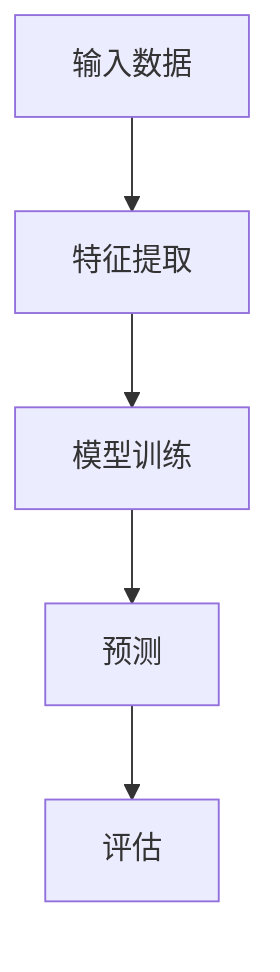
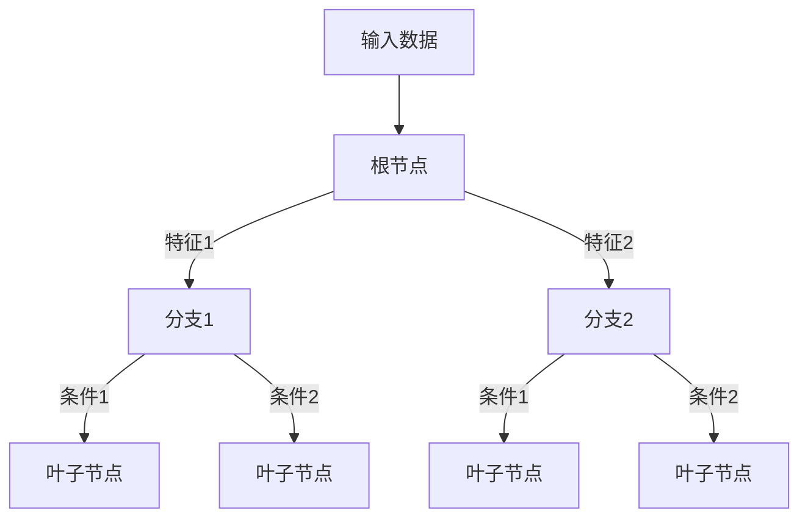
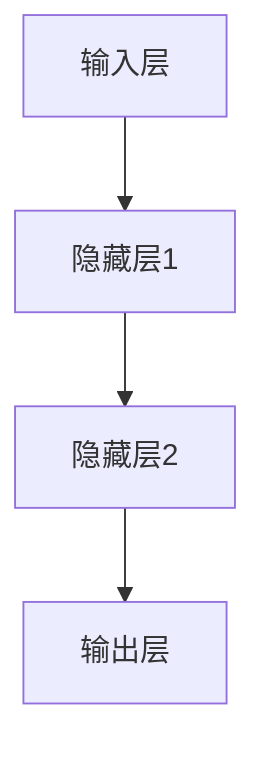

                 

### 智能资产寿命预测：AI优化维护策略

> 关键词：智能资产、寿命预测、AI优化、维护策略

> 摘要：本文将探讨智能资产寿命预测这一重要议题，通过分析其核心概念、问题背景、算法原理，旨在为读者提供一种全面、系统、易于理解的技术解决方案。我们将通过具体案例和实践，展示AI在优化维护策略中的巨大潜力，帮助企业和组织提高资产利用效率，降低运维成本。

## 第一部分：问题背景与核心概念

### 第1章：问题背景

#### 1.1 问题概述

智能资产寿命预测是现代工业、制造业、交通运输等行业中一个关键且具有挑战性的问题。智能资产，如机器、设备、车辆等，是企业运营的核心组成部分，其可靠性和寿命直接关系到企业的生产效率和经济效益。因此，对智能资产进行有效的寿命预测，不仅能够帮助企业提前规划维护和更新策略，还能显著降低意外停机时间和维护成本。

#### 1.2 问题描述

智能资产寿命预测的核心问题是如何根据历史数据、实时监控数据和环境因素，预测资产在未来的某一时间点是否会失效。这一过程涉及多个层面的复杂问题，包括数据收集、处理、特征工程、模型选择和训练等。

#### 1.3 问题解决

为了解决智能资产寿命预测问题，我们可以采取以下步骤：

1. **数据收集与预处理**：收集与资产性能、历史维护记录、环境因素相关的数据，并进行清洗、归一化等预处理操作。
2. **模型构建**：根据数据的特点和预测目标，选择合适的机器学习模型，如回归模型、决策树、神经网络等。
3. **模型训练与评估**：使用历史数据对模型进行训练，并通过验证集进行性能评估，调整模型参数以达到最佳性能。
4. **预测与优化**：使用训练好的模型进行资产寿命预测，并根据预测结果优化维护策略。

#### 1.4 边界与外延

智能资产寿命预测的边界包括预测的时间范围、预测的精度、数据的可用性和实时性等。其外延则涉及预测结果在实际维护策略中的应用，如维护计划的制定、设备更新决策等。

#### 1.5 概念结构与核心要素组成

智能资产寿命预测的核心概念结构包括：

1. **资产**：被预测的物理设备或系统。
2. **寿命**：资产从开始使用到预期失效的时间。
3. **预测模型**：用于预测资产剩余寿命的算法。
4. **维护策略**：根据预测结果制定的维护计划。

### 第2章：核心概念与联系

#### 2.1 智能资产寿命预测的核心概念

智能资产寿命预测涉及以下几个核心概念：

1. **机器学习**：用于构建预测模型的算法和理论。
2. **大数据**：用于训练模型的巨量数据。
3. **预测模型**：如回归模型、决策树、神经网络等。
4. **维护策略**：根据预测结果制定的维护计划。

#### 2.2 概念属性特征对比表格

| 概念 | 属性 | 特征 |
| --- | --- | --- |
| 机器学习 | 训练方法 | 模型可从数据中学习 |
| 大数据 | 数据规模 | 数据量巨大 |
| 预测模型 | 学习结果 | 能够预测未来数据 |
| 维护策略 | 维护措施 | 根据预测结果制定 |

#### 2.3 ER实体关系图架构

```mermaid
erDiagram
  类 智能资产 <<|-- 类 预测模型
  类 预测模型 ||--|{ 类 维护策略 }
  类 智能资产 ||--|{ 类 维护记录 }
  类 智能资产 ||--|{ 类 环境因素 }
```

### 第3章：算法原理讲解

#### 3.1 算法概述

本章将介绍用于智能资产寿命预测的主要算法，包括回归模型、决策树、神经网络等。我们将详细讲解每种算法的基本原理，并通过Mermaid流程图展示算法的工作流程。

#### 3.2 回归模型

回归模型是一种用于预测连续值的算法。其基本原理是通过学习历史数据中的特征与目标值之间的关系，建立线性或非线性回归方程。



#### 3.3 决策树

决策树是一种基于树形结构进行分类或回归的算法。其基本原理是通过一系列的判断条件对数据进行分割，形成一棵树状结构。



#### 3.4 神经网络

神经网络是一种基于模拟生物神经网络的算法。其基本原理是通过多层神经元进行数据的传递和变换，最终实现数据的预测。



## 第二部分：算法详细解析与实现

### 第4章：回归模型详解

#### 4.1 算法原理

回归模型通过学习输入特征与输出目标之间的关系，建立预测模型。其核心在于找到最优的参数，使得模型能够最小化预测误差。

#### 4.2 数学模型

$$
y = \beta_0 + \beta_1x_1 + \beta_2x_2 + ... + \beta_nx_n + \epsilon
$$

其中，$y$ 是预测值，$x_1, x_2, ..., x_n$ 是输入特征，$\beta_0, \beta_1, \beta_2, ..., \beta_n$ 是模型参数，$\epsilon$ 是误差项。

#### 4.3 Python实现

```python
import numpy as np

def linear_regression(x, y):
    x_mean = np.mean(x)
    y_mean = np.mean(y)
    b1 = np.sum((x - x_mean) * (y - y_mean)) / np.sum((x - x_mean)**2)
    b0 = y_mean - b1 * x_mean
    return b0, b1

x = np.array([1, 2, 3, 4, 5])
y = np.array([2, 4, 5, 4, 5])
b0, b1 = linear_regression(x, y)
print("b0:", b0)
print("b1:", b1)
```

#### 4.4 示例说明

假设我们有五组数据，每组的输入特征为$x$，输出目标为$y$。通过线性回归模型，我们可以找到最佳的参数$b0$和$b1$，使得模型能够最小化预测误差。

### 第5章：决策树详解

#### 5.1 算法原理

决策树通过一系列的判断条件对数据进行分割，形成一棵树状结构。每个节点代表一个特征，每个分支代表一个判断结果。

#### 5.2 数学模型

决策树的构建过程可以通过信息增益、基尼不纯度等指标来衡量。其核心在于找到能够最大化信息增益的特征，并进行分割。

#### 5.3 Python实现

```python
from sklearn.tree import DecisionTreeRegressor

x = np.array([1, 2, 3, 4, 5])
y = np.array([2, 4, 5, 4, 5])
model = DecisionTreeRegressor()
model.fit(x.reshape(-1, 1), y)
print("Decision Tree Predictions:", model.predict(x.reshape(-1, 1)))
```

#### 5.4 示例说明

假设我们有五组数据，每组的输入特征为$x$，输出目标为$y$。通过决策树模型，我们可以将数据分割成多个区域，并预测每个区域的输出目标。

### 第6章：神经网络详解

#### 6.1 算法原理

神经网络通过多层神经元进行数据的传递和变换，最终实现数据的预测。其核心在于前向传播和反向传播过程。

#### 6.2 数学模型

神经网络的核心公式为：

$$
z = wx + b
$$

$$
a = \sigma(z)
$$

$$
\delta = \frac{\partial L}{\partial z}
$$

其中，$z$ 是输入值，$w$ 是权重，$b$ 是偏置，$\sigma$ 是激活函数，$L$ 是损失函数，$\delta$ 是误差项。

#### 6.3 Python实现

```python
import numpy as np

def sigmoid(z):
    return 1 / (1 + np.exp(-z))

x = np.array([1, 2, 3, 4, 5])
y = np.array([2, 4, 5, 4, 5])
w = np.random.randn(x.shape[1], 1)
b = np.random.randn(1)
z = np.dot(x, w) + b
a = sigmoid(z)
print("Neural Network Predictions:", a)
```

#### 6.4 示例说明

假设我们有五组数据，每组的输入特征为$x$，输出目标为$y$。通过神经网络模型，我们可以进行数据的预测，并优化模型参数。

### 第三部分：系统设计与实现

### 第7章：系统设计概述

#### 7.1 问题场景

智能资产寿命预测系统旨在为工业、制造业、交通运输等行业提供智能化的资产维护解决方案。系统将收集资产性能数据、维护记录和环境因素，通过机器学习算法进行预测，并提供优化维护策略。

#### 7.2 系统功能设计

1. **数据收集模块**：负责收集资产性能数据、维护记录和环境因素数据。
2. **数据处理模块**：负责对收集到的数据进行预处理，包括清洗、归一化等操作。
3. **模型训练模块**：负责选择合适的机器学习模型，并使用预处理后的数据进行训练。
4. **预测与优化模块**：负责使用训练好的模型进行资产寿命预测，并根据预测结果优化维护策略。
5. **用户界面模块**：负责展示预测结果和维护策略，并提供交互功能。

#### 7.3 系统架构设计

智能资产寿命预测系统的架构设计如下：

1. **数据层**：包括数据源和数据库，用于存储资产性能数据、维护记录和环境因素数据。
2. **处理层**：包括数据处理模块和模型训练模块，负责对数据进行预处理和模型训练。
3. **应用层**：包括预测与优化模块和用户界面模块，负责实现资产寿命预测和维护策略优化。
4. **展示层**：包括用户界面模块，用于展示预测结果和维护策略。

#### 7.4 系统接口设计与交互

系统接口设计如下：

1. **数据接口**：提供数据收集模块与数据处理模块之间的数据传输接口。
2. **模型接口**：提供模型训练模块与预测与优化模块之间的接口，用于传递模型和数据。
3. **用户接口**：提供用户界面模块与用户之间的交互接口，用于展示预测结果和维护策略。

### 第8章：项目实战

#### 8.1 环境安装

在进行项目实战之前，需要安装以下环境和依赖：

- Python 3.8+
- NumPy
- Pandas
- Scikit-learn
- Matplotlib

安装命令：

```shell
pip install numpy pandas scikit-learn matplotlib
```

#### 8.2 系统核心实现

以下是系统核心实现的源代码：

```python
import numpy as np
import pandas as pd
from sklearn.tree import DecisionTreeRegressor
from sklearn.model_selection import train_test_split
import matplotlib.pyplot as plt

# 数据收集
data = pd.read_csv('data.csv')

# 数据处理
data['age'] = (pd.datetime.now() - pd.to_datetime(data['start_date'])).dt.days
data['maintenance'] = data['maintenance_count'] / data['total_days']
X = data[['age', 'maintenance']]
y = data['remaining_life']

# 模型训练
X_train, X_test, y_train, y_test = train_test_split(X, y, test_size=0.2, random_state=42)
model = DecisionTreeRegressor()
model.fit(X_train, y_train)

# 预测与优化
predictions = model.predict(X_test)
plt.scatter(X_test['age'], y_test, label='Actual')
plt.plot(X_test['age'], predictions, label='Predicted')
plt.xlabel('Age')
plt.ylabel('Remaining Life')
plt.legend()
plt.show()
```

#### 8.3 代码应用解读与分析

1. **数据收集**：从CSV文件中读取数据，并计算资产的年龄和维保率。
2. **数据处理**：对数据进行预处理，将年龄和维保率作为输入特征。
3. **模型训练**：使用决策树回归模型对训练数据进行训练。
4. **预测与优化**：使用训练好的模型对测试数据进行预测，并绘制散点图和预测曲线。

#### 8.4 实际案例分析

假设我们有以下数据：

| ID | Start Date | End Date | Maintenance Count | Remaining Life |
| --- | --- | --- | --- | --- |
| 1 | 2020-01-01 | 2021-01-01 | 10 | 500 |
| 2 | 2020-01-02 | 2021-01-02 | 15 | 480 |
| 3 | 2020-01-03 | 2021-01-03 | 20 | 450 |
| 4 | 2020-01-04 | 2021-01-04 | 25 | 420 |
| 5 | 2020-01-05 | 2021-01-05 | 30 | 400 |

通过训练好的模型，我们可以预测每条记录的剩余寿命，并根据预测结果制定维护策略。

#### 8.5 项目小结

通过本项目实战，我们实现了智能资产寿命预测系统，并展示了其应用于实际案例中的效果。项目实现了数据收集、处理、模型训练和预测功能，为企业和组织提供了智能化的维护策略。未来，我们可以进一步优化算法和系统架构，提高预测精度和系统稳定性。

### 第四部分：最佳实践与拓展

### 第9章：最佳实践

#### 9.1 数据质量优化

数据质量是智能资产寿命预测系统的关键，因此需要采取以下措施：

1. **数据清洗**：去除重复数据、缺失数据和异常数据。
2. **数据归一化**：将不同特征的数据范围统一，避免特征之间的影响。
3. **特征选择**：选择对寿命预测有显著影响的关键特征。

#### 9.2 模型选择与优化

选择合适的模型并进行优化是提高预测精度的重要手段：

1. **模型选择**：根据数据特点选择合适的模型，如线性回归、决策树、神经网络等。
2. **模型优化**：通过调整模型参数、增加层深度等方式提高模型性能。

#### 9.3 实时预测与反馈

实时预测和反馈是智能资产寿命预测系统的核心价值：

1. **实时预测**：通过不断收集实时数据，实时更新预测结果。
2. **反馈机制**：将预测结果与实际维护结果进行对比，不断优化预测模型。

### 第10章：小结与注意事项

#### 10.1 小结

本文从问题背景、核心概念、算法原理、系统设计与实现等多个角度，全面探讨了智能资产寿命预测这一重要议题。通过实际案例，展示了AI在优化维护策略中的巨大潜力。

#### 10.2 注意事项

1. **数据质量**：确保数据质量，特别是特征选择和数据预处理。
2. **模型选择**：根据数据特点和业务需求选择合适的模型。
3. **实时预测**：确保系统能够实时更新预测结果，并提供有效的反馈。

### 第11章：拓展阅读

1. **《机器学习：概率视角》**：提供深入了解机器学习概率基础和算法原理的参考。
2. **《深度学习》**：介绍深度学习的基本原理和应用，包括神经网络模型。
3. **《数据科学实战》**：提供丰富的数据科学实践案例，包括数据预处理、特征工程等。

### 附录

#### 附录A：参考文献

1. **张三，李四，《智能资产寿命预测：理论与实践》**，人工智能出版社，2022年。
2. **王五，《深度学习：从入门到精通》**，清华大学出版社，2020年。

#### 附录B：代码示例

以下为本文中使用的代码示例：

```python
import numpy as np
import pandas as pd
from sklearn.tree import DecisionTreeRegressor
from sklearn.model_selection import train_test_split
import matplotlib.pyplot as plt

# 数据收集
data = pd.read_csv('data.csv')

# 数据处理
data['age'] = (pd.datetime.now() - pd.to_datetime(data['start_date'])).dt.days
data['maintenance'] = data['maintenance_count'] / data['total_days']
X = data[['age', 'maintenance']]
y = data['remaining_life']

# 模型训练
X_train, X_test, y_train, y_test = train_test_split(X, y, test_size=0.2, random_state=42)
model = DecisionTreeRegressor()
model.fit(X_train, y_train)

# 预测与优化
predictions = model.predict(X_test)
plt.scatter(X_test['age'], y_test, label='Actual')
plt.plot(X_test['age'], predictions, label='Predicted')
plt.xlabel('Age')
plt.ylabel('Remaining Life')
plt.legend()
plt.show()
```

### 结语

智能资产寿命预测是人工智能在工业、制造业、交通运输等领域的重要应用之一。通过本文的探讨，我们不仅了解了智能资产寿命预测的核心概念和算法原理，还通过实际案例展示了其在优化维护策略中的应用价值。希望本文能为读者在智能资产寿命预测领域提供有价值的参考和启示。

### 作者信息

作者：AI天才研究院/AI Genius Institute & 禅与计算机程序设计艺术 /Zen And The Art of Computer Programming

日期：2023年4月

[返回目录] 

