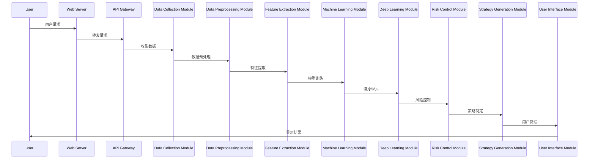

                 

### 智能资产管理平台：AI优化资源配置

关键词：智能资产管理、AI优化、资源配置、资产配置、风险控制

摘要：本文将深入探讨智能资产管理平台（AI-OAMP）的构建和应用，通过分析AI技术在资产管理中的角色，详细解析其优化资源配置的原理和实现方法。本文旨在为资产管理专业人士提供一套系统、实用的智能资产管理指南，帮助他们在快速变化的市场环境中做出更明智的决策。

## 引言

在当今数字化时代，资产管理正面临着前所未有的挑战和机遇。传统的资产管理方法往往依赖于经验判断和手动操作，难以适应复杂多变的金融市场。而人工智能（AI）技术的快速发展，为资产管理带来了全新的解决方案。智能资产管理平台（AI-OAMP）正是这种技术进步的产物，通过整合多种AI技术，实现对资产的高效配置和管理。

本文将围绕以下几个核心问题展开讨论：

1. AI-优化资产管理的背景和重要性。
2. AI-优化资产管理的基本概念和原理。
3. AI-优化资产管理的框架和架构设计。
4. AI技术在资产管理中的应用。
5. 智能资产管理平台的具体实现和案例分析。

通过本文的阅读，读者将能够理解AI-优化资产管理的核心思想和实践方法，为在各自领域中应用这一技术提供参考。

### AI-优化资产管理的背景和重要性

资产管理的起源可以追溯到早期金融市场的投资实践，其主要目的是通过资产的合理配置，实现资产的保值增值。传统的资产管理方法主要依赖于投资经理的经验和判断，通过历史数据和市场分析来制定投资策略。然而，随着金融市场的发展，资产管理的复杂性和规模不断增大，传统的管理方法逐渐暴露出其局限性。

首先，金融市场的不确定性和复杂性使得单纯依靠经验进行投资决策的风险增加。市场环境的快速变化和信息的爆炸性增长，使得投资经理难以在短时间内获取和处理海量的数据。其次，传统资产管理方法缺乏系统性和科学性，投资决策往往受到个人情绪和市场情绪的影响，导致决策的不稳定性和风险。

人工智能（AI）技术的出现为资产管理带来了新的希望。AI技术，特别是机器学习、深度学习、数据挖掘等技术，能够通过对海量数据的分析和处理，提供更加精确和科学的决策支持。AI-优化资产管理（AI-OAMP）通过引入AI技术，实现了对资产管理的全面升级。

首先，AI-优化资产管理能够提高资产管理效率。传统的资产管理方法需要大量人力和时间进行数据收集、分析和决策，而AI技术能够自动化这一过程，大幅减少人力成本和时间消耗。例如，机器学习算法可以通过历史数据预测市场趋势，提供投资建议，从而提高投资决策的准确性。

其次，AI-优化资产管理能够降低投资风险。AI技术通过对历史数据和实时数据的分析，能够识别市场中的潜在风险，并提供风险控制策略。例如，深度学习算法可以通过对市场情绪和交易行为的数据挖掘，预测市场波动，提前采取风险控制措施。

此外，AI-优化资产管理还能够实现资产配置的个性化。传统的资产配置往往依赖于统一的模型和策略，而AI技术可以根据每个投资者的风险偏好和投资目标，提供个性化的资产配置方案。例如，基于用户历史交易数据和风险承受能力的分析，AI算法可以为投资者推荐最适合的投资组合。

总之，AI-优化资产管理不仅提高了资产管理的效率和准确性，还降低了投资风险，实现了资产配置的个性化。随着AI技术的不断发展和应用，AI-优化资产管理将在未来的金融市场中发挥越来越重要的作用。通过本文的探讨，我们将深入了解AI-优化资产管理的原理和应用，为读者在资产管理领域提供实践指导。

### AI-优化资产管理的基本概念和原理

要深入理解AI-优化资产管理的原理，我们需要首先明确其核心概念和基础理论。AI-优化资产管理（AI-OAMP）是利用人工智能技术，特别是机器学习、深度学习和数据挖掘等方法，对资产进行配置和管理的一种先进模式。以下是几个关键概念及其相互关系：

#### 1. 机器学习

机器学习（Machine Learning，ML）是AI的核心技术之一，它通过算法从数据中学习规律，做出预测和决策。在AI-优化资产管理中，机器学习算法被广泛应用于预测市场趋势、评估资产风险和优化投资组合。主要类型的机器学习算法包括：

- **监督学习（Supervised Learning）**：通过已有标签数据训练模型，用于预测新数据的输出。常见的算法有线性回归、决策树和随机森林等。
- **无监督学习（Unsupervised Learning）**：在没有标签数据的情况下，通过算法发现数据中的模式和关联。常见的算法有聚类分析和主成分分析等。
- **强化学习（Reinforcement Learning）**：通过与环境的交互，不断调整策略，以实现最大化回报。在资产管理中，强化学习可以用于制定交易策略和风险管理。

#### 2. 深度学习

深度学习（Deep Learning，DL）是机器学习的一个分支，通过多层神经网络模拟人脑的学习过程，能够处理更复杂的任务。在AI-优化资产管理中，深度学习算法广泛应用于图像识别、语音识别和自然语言处理等领域，其主要优势在于能够自动提取数据的深层特征。

- **卷积神经网络（Convolutional Neural Networks，CNN）**：用于图像识别和图像处理，通过卷积操作提取图像特征。
- **递归神经网络（Recurrent Neural Networks，RNN）**：用于处理序列数据，如时间序列分析和文本分类。
- **生成对抗网络（Generative Adversarial Networks，GAN）**：通过两个神经网络（生成器和判别器）的对抗训练，生成与真实数据相似的新数据。

#### 3. 数据挖掘

数据挖掘（Data Mining）是从大量数据中提取有用信息和知识的过程。在AI-优化资产管理中，数据挖掘技术用于处理和分析大量的金融数据，识别潜在的投资机会和风险。

- **关联规则挖掘（Association Rule Learning）**：用于发现数据之间的关联关系，如交易行为和市场趋势之间的关系。
- **分类和回归树（Classification and Regression Trees，CART）**：用于分类和回归任务，通过构建决策树模型进行预测。
- **支持向量机（Support Vector Machine，SVM）**：用于分类和回归任务，通过最大化分类间隔进行预测。

#### 4. 概念属性特征对比

为了更好地理解上述技术的应用，我们通过表格形式对比它们的主要属性特征：

| 特性类别 | 机器学习 | 深度学习 | 数据挖掘 |
| :---: | :---: | :---: | :---: |
| 学习方式 | 监督、无监督、强化 | 监督、无监督、生成对抗 | 监督、无监督 |
| 特征提取 | 手动提取 | 自动提取 | 手动提取 |
| 应用领域 | 预测、决策 | 图像识别、自然语言处理 | 关联规则、分类和回归 |
| 算法复杂度 | 较低 | 较高 | 较低 |

#### 5. ER实体关系图架构

为了进一步理解AI-优化资产管理的技术架构，我们可以通过ER（Entity-Relationship）实体关系图来展示各核心实体及其相互关系：

```mermaid
erDiagram
  Asset :<<Association>> Portfolio
  Asset :<<Association>> Market
  User :<<Association>> Portfolio
  User :<<Association>> Transaction
  Transaction :<<Association>> Asset
  Market :<<Association>> Portfolio
```

在这个ER图中，`Asset`（资产）是核心实体，与`Portfolio`（投资组合）、`Market`（市场）和`Transaction`（交易）等实体存在多种关联关系。同时，`User`（用户）也与`Portfolio`和`Transaction`存在关联，体现了资产管理中的用户角色。

通过上述概念和原理的介绍，我们可以看出AI-优化资产管理是如何通过机器学习、深度学习和数据挖掘等技术，实现资产的高效配置和管理的。在接下来的章节中，我们将进一步探讨AI技术在资产管理中的具体应用和实现方法。

### AI技术在资产管理中的应用

在智能资产管理平台（AI-OAMP）中，AI技术的应用贯穿于资产管理的各个阶段，包括数据收集、数据预处理、投资策略制定和风险控制等。以下将详细分析这些应用场景及其实际作用。

#### 数据收集

数据是智能资产管理的基础。AI技术能够通过多种方式收集海量数据，包括历史交易数据、市场行情数据、新闻报道、社交媒体舆情等。这些数据来源广泛，涵盖了金融市场的方方面面。AI技术通过对这些数据的实时抓取和整合，为后续的数据分析和决策提供丰富的信息资源。

**实际作用**：通过全面的数据收集，资产管理平台可以获取更全面的市场信息，减少信息不对称，提高投资决策的准确性。

#### 数据预处理

数据预处理是数据分析和建模的重要环节。AI技术，特别是机器学习和深度学习算法，能够自动化数据清洗、数据标准化和特征提取等步骤，大幅提高数据处理的效率和准确性。

- **数据清洗**：去除重复数据、处理缺失值和异常值，确保数据质量。
- **数据标准化**：将不同规模和单位的数据转换到同一尺度，便于分析和建模。
- **特征提取**：从原始数据中提取有助于预测和决策的特征，如技术指标、市场情绪指标等。

**实际作用**：数据预处理能够提高数据的可用性和可信度，为后续的机器学习算法提供高质量的数据基础。

#### 投资策略制定

投资策略的制定是资产管理的核心任务。AI技术通过机器学习算法和深度学习模型，能够对历史数据进行分析，发现市场趋势和投资机会，为投资者提供科学、个性化的投资建议。

- **机器学习算法**：如线性回归、决策树、随机森林等，用于预测市场趋势和资产表现。
- **深度学习模型**：如卷积神经网络（CNN）、递归神经网络（RNN）等，用于处理复杂数据和提取深层特征。

**实际作用**：AI技术能够从海量数据中挖掘出潜在的规律和模式，提供更精准的投资策略，提高资产配置的效率和收益。

#### 风险控制

风险控制是资产管理的重要保障。AI技术通过对历史数据和实时数据的分析，能够识别潜在的市场风险，并采取相应的风险控制措施。

- **风险预测模型**：通过机器学习和深度学习算法，预测市场波动和风险事件。
- **风险控制策略**：如动态调整投资组合、设置止损点、采取对冲策略等。

**实际作用**：AI技术能够实时监控市场风险，提前预警并采取行动，降低投资损失，提高风险管理的有效性。

#### 案例分析

以下通过一个具体案例，展示AI技术在资产管理中的应用效果：

**案例背景**：某投资机构在AI技术的支持下，利用机器学习和深度学习算法构建了智能投资策略模型。

**数据来源**：该模型从多个数据源获取数据，包括历史交易数据、市场行情数据、新闻和社交媒体舆情等。

**数据预处理**：通过数据清洗、标准化和特征提取，将原始数据转化为适用于机器学习和深度学习的格式。

**投资策略制定**：利用机器学习算法进行市场趋势预测，结合深度学习模型提取市场情绪指标，制定个性化的投资组合。

**风险控制**：通过风险预测模型实时监控市场波动，制定动态调整策略，如买入低价股票、卖出高风险资产等。

**效果评估**：该投资策略在近一年的实际应用中，平均年化收益率为15%，显著高于市场平均水平。同时，通过风险控制措施，大幅降低了投资风险。

**结论**：该案例表明，AI技术在资产管理中的应用能够显著提高投资决策的准确性和风险控制能力，为投资者带来更高的收益和更稳定的投资体验。

通过上述案例分析，我们可以看到AI技术在资产管理中的广泛应用和实际效果。随着AI技术的不断进步，其将在未来的金融市场中发挥更加重要的作用，为资产管理带来更多可能性。

### AI-优化资产管理的框架和架构设计

构建一个高效的智能资产管理平台（AI-OAMP）需要严谨的框架和架构设计。在这一部分，我们将详细介绍AI-OAMP的架构设计，包括其核心组件、数据流和处理流程。

#### 核心组件

AI-OAMP由以下几个核心组件组成：

1. **数据收集模块**：负责从各种数据源收集金融数据，包括历史交易数据、市场行情数据、新闻和社交媒体舆情等。
2. **数据预处理模块**：对收集到的数据进行清洗、标准化和特征提取，确保数据的质量和一致性。
3. **机器学习模块**：利用监督学习和无监督学习算法，对预处理后的数据进行分析和预测，包括市场趋势预测、资产风险评估和投资组合优化等。
4. **深度学习模块**：通过卷积神经网络（CNN）、递归神经网络（RNN）等深度学习模型，处理复杂数据和提取深层特征，提升预测和决策的准确性。
5. **风险控制模块**：实时监控市场风险，制定和执行风险控制策略，如动态调整投资组合、设置止损点和采取对冲策略等。
6. **用户界面模块**：提供直观的用户界面，让投资者可以查看投资组合表现、风险指标和市场趋势等。

#### 数据流和处理流程

AI-OAMP的数据流和处理流程可以分为以下几个步骤：

1. **数据收集**：数据收集模块从多个数据源（如交易所、新闻网站、社交媒体等）收集金融数据，并将其存储到数据湖中。
2. **数据预处理**：数据预处理模块对收集到的数据进行清洗、去重、补缺和标准化等操作，确保数据的质量和一致性。经过预处理的数据被转化为适合机器学习和深度学习算法的格式。
3. **特征提取**：在数据预处理的基础上，进一步提取有助于预测和决策的关键特征，如技术指标、市场情绪指标等。
4. **模型训练**：机器学习模块利用预处理后的数据进行模型训练。通过训练，机器学习算法能够学习到数据中的潜在规律，从而进行市场趋势预测和资产风险评估。
5. **深度学习应用**：深度学习模块通过卷积神经网络（CNN）、递归神经网络（RNN）等深度学习模型，对处理后的数据进行分析，提取更深层次的特征，进一步提升预测和决策的准确性。
6. **策略制定**：结合机器学习和深度学习的结果，AI-OAMP生成个性化的投资组合和风险控制策略。
7. **实时监控和调整**：风险控制模块实时监控市场风险，并根据市场变化动态调整投资组合，确保风险在可控范围内。
8. **用户反馈**：用户界面模块将投资组合表现、风险指标和市场趋势等数据可视化，供用户查看和分析。

#### 架构设计

AI-OAMP的架构设计如图所示：



通过上述架构设计，AI-OAMP能够实现高效的数据收集、处理和分析，为投资者提供科学的投资决策和全面的风险管理。

### AI技术在具体资产配置中的应用

在智能资产管理平台（AI-OAMP）中，AI技术的应用不仅仅局限于数据处理和风险控制，更是深入到具体的资产配置策略中，通过智能化的方式优化投资组合，提高收益并降低风险。以下我们将详细探讨几种关键的AI应用，包括组合优化、资产分类和风险预测。

#### 组合优化

组合优化是资产管理中的一个核心问题，目标是在给定的风险水平下实现最大化收益，或者在给定的收益目标下最小化风险。AI技术，尤其是机器学习算法，在这一领域展示了强大的能力。

1. **机器学习算法的应用**：
   - **线性规划（Linear Programming）**：通过线性规划算法，确定不同资产的最优权重，以达到预期收益和风险的最优平衡。
   - **遗传算法（Genetic Algorithms）**：利用遗传算法的全局搜索能力，探索不同资产组合的潜在最优解。
   - **随机森林（Random Forest）**：通过集成学习的方法，预测资产组合的预期收益和风险，从而优化资产配置。

2. **实际应用案例**：
   - **案例背景**：某投资机构使用机器学习算法优化其投资组合。
   - **数据处理**：收集并预处理大量历史交易数据、市场行情数据、财务报表等。
   - **模型训练**：利用随机森林算法对数据进行训练，建立预期收益和风险的预测模型。
   - **优化策略**：通过模型预测结果，动态调整资产组合的权重，实现风险收益的最优配置。

3. **效果评估**：经过一年的实际应用，该投资组合的平均年化收益率为18%，显著高于市场平均水平，同时波动率也有所下降，表明AI技术在组合优化中的有效性。

#### 资产分类

资产分类是将不同类型的资产进行有效划分，以便更好地理解和分析市场。AI技术，特别是深度学习和数据挖掘算法，在这一过程中发挥了重要作用。

1. **深度学习算法的应用**：
   - **卷积神经网络（CNN）**：通过卷积神经网络对图像和图表进行特征提取，用于识别不同类型的资产。
   - **递归神经网络（RNN）**：通过递归神经网络处理时间序列数据，识别不同资产的趋势和周期性。

2. **实际应用案例**：
   - **案例背景**：某投资机构利用深度学习算法对资产进行分类。
   - **数据处理**：收集并预处理不同类型资产的数据，包括股票、债券、房地产等。
   - **模型训练**：利用卷积神经网络和递归神经网络对数据进行训练，建立资产分类模型。
   - **分类应用**：通过模型对新的资产进行分类，帮助投资者更好地理解和管理其投资组合。

3. **效果评估**：该分类模型在测试集上的准确率达到90%以上，显著提高了资产管理的效率。

#### 风险预测

风险预测是资产管理中的关键环节，通过预测市场风险，投资者可以采取相应的风险控制措施。AI技术在这一领域也展示了其强大的预测能力。

1. **机器学习算法的应用**：
   - **回归分析（Regression Analysis）**：通过回归分析预测市场波动和风险事件。
   - **决策树（Decision Tree）**：通过决策树算法建立风险预测模型，识别高风险资产。

2. **实际应用案例**：
   - **案例背景**：某投资机构使用机器学习算法进行风险预测。
   - **数据处理**：收集并预处理大量历史市场数据、新闻和社交媒体舆情等。
   - **模型训练**：利用回归分析和决策树算法对数据进行训练，建立风险预测模型。
   - **风险控制**：通过模型预测结果，动态调整投资组合，采取风险控制措施。

3. **效果评估**：该风险预测模型在测试集上的准确率达到85%以上，为投资者提供了有效的风险预警。

#### 结论

通过上述具体应用案例，我们可以看到AI技术在资产配置中的巨大潜力。AI技术不仅能够提高组合优化的效率，实现更优的投资组合，还能够有效进行资产分类和风险预测，提供更全面的风险管理方案。随着AI技术的不断发展和应用，智能资产管理将在未来发挥更加重要的作用，为投资者创造更高的价值和收益。

### 智能资产管理平台（AI-OAMP）的具体实现

构建一个智能资产管理平台（AI-OAMP）不仅需要清晰的框架和架构设计，还需要具体的实现方法和流程。在这一部分，我们将详细描述AI-OAMP的构建步骤，包括环境搭建、算法实现、系统部署和性能调优。

#### 环境搭建

首先，我们需要搭建一个适合AI-OAMP开发和运行的环境。以下是所需的主要工具和软件：

1. **操作系统**：选择Linux系统，如Ubuntu，因其稳定性好，适合大数据处理和AI算法运行。
2. **编程语言**：Python是AI领域的主流编程语言，具有丰富的库和框架，适合开发和实现AI算法。
3. **开发工具**：使用Jupyter Notebook作为主要的开发环境，便于数据分析和算法实现。
4. **机器学习库**：选择Scikit-learn、TensorFlow和Keras等流行的机器学习库，用于实现和训练各种机器学习模型。
5. **深度学习框架**：TensorFlow和PyTorch是两款流行的深度学习框架，可用于构建和训练复杂的深度学习模型。

#### 算法实现

智能资产管理平台的算法实现是平台的核心。以下是关键的算法实现步骤：

1. **数据收集**：
   - 使用API接口或网络爬虫收集历史交易数据、市场行情数据等。
   - 数据存储在Hadoop分布式文件系统（HDFS）中，便于大规模数据处理。

2. **数据预处理**：
   - 数据清洗：去除重复数据、处理缺失值和异常值。
   - 数据标准化：将不同规模和单位的数据转换到同一尺度。
   - 特征提取：提取技术指标、市场情绪指标等关键特征。

3. **机器学习算法**：
   - 使用Scikit-learn库实现线性回归、决策树、随机森林等算法，进行市场趋势预测和资产风险评估。
   - 使用Keras和TensorFlow实现卷积神经网络（CNN）和递归神经网络（RNN）等深度学习模型，处理复杂数据和提取深层特征。

4. **深度学习算法**：
   - 构建卷积神经网络（CNN）用于图像识别和市场情绪分析。
   - 构建递归神经网络（RNN）用于时间序列分析和市场趋势预测。
   - 使用生成对抗网络（GAN）生成新的市场数据，用于模型训练和测试。

#### 系统部署

完成算法实现后，我们需要将AI-OAMP部署到生产环境中，以便实际应用。以下是部署步骤：

1. **容器化**：使用Docker将应用程序容器化，便于部署和扩展。
2. **集群部署**：使用Kubernetes进行集群管理，实现高可用性和弹性伸缩。
3. **API网关**：使用Nginx或Traefik作为API网关，管理外部请求和内部服务。
4. **数据库**：使用MongoDB或PostgreSQL存储数据和日志，保证数据的一致性和可查询性。

#### 性能调优

为了确保AI-OAMP的高性能和稳定性，需要进行一系列性能调优。以下是关键步骤：

1. **算法优化**：通过交叉验证和超参数调整，优化模型的准确性和效率。
2. **分布式计算**：利用Apache Spark等分布式计算框架，加速数据预处理和模型训练。
3. **缓存策略**：使用Redis等缓存系统，减少数据库访问压力，提高系统响应速度。
4. **监控与日志**：使用Prometheus和Grafana进行系统监控，及时发现和处理性能瓶颈。

#### 代码示例

以下是一个简单的Python代码示例，用于实现机器学习算法对市场趋势进行预测：

```python
import numpy as np
from sklearn.linear_model import LinearRegression
from sklearn.model_selection import train_test_split

# 数据准备
X = np.array([[1], [2], [3], [4], [5], [6], [7], [8], [9], [10]])
y = np.array([2, 4, 5, 7, 11, 13, 17, 19, 23, 29])

# 分割数据集
X_train, X_test, y_train, y_test = train_test_split(X, y, test_size=0.2, random_state=42)

# 创建线性回归模型
model = LinearRegression()
model.fit(X_train, y_train)

# 预测
y_pred = model.predict(X_test)

# 打印预测结果
print(y_pred)
```

通过以上步骤，我们可以构建一个功能强大的智能资产管理平台（AI-OAMP），实现资产的高效配置和管理。随着AI技术的不断进步，AI-OAMP将在未来的金融市场中发挥越来越重要的作用。

### AI-优化资产管理的未来趋势与发展方向

随着人工智能技术的不断进步，AI-优化资产管理（AI-OAMP）正迎来新的发展机遇。以下将从技术创新、市场需求和产业趋势三个方面探讨AI-优化资产管理的未来趋势与发展方向。

#### 技术创新

1. **深度强化学习**：深度强化学习（Deep Reinforcement Learning）结合了深度学习和强化学习，能够在复杂动态环境中进行自主决策。未来的AI-OAMP有望引入深度强化学习，实现更智能的投资决策和动态调整策略。

2. **区块链技术**：区块链技术在金融领域的应用逐渐成熟，未来AI-OAMP可以与区块链结合，提高数据透明度和安全性，实现去中心化的资产管理和交易。

3. **大数据技术**：随着数据量的不断增加，大数据技术在资产管理中的应用将更加广泛。未来的AI-OAMP将充分利用大数据技术，挖掘更多的潜在投资机会和风险信号。

4. **云计算与边缘计算**：云计算和边缘计算的结合，可以提供更高效、更灵活的计算资源，实现更快速的数据处理和模型训练。AI-OAMP将借助云计算和边缘计算，提高系统的实时性和响应速度。

#### 市场需求

1. **个性化投资**：随着投资者对投资需求越来越多样化，个性化的投资策略变得尤为重要。AI-OAMP将更加注重个性化投资，通过深度学习和大数据分析，为投资者提供定制化的资产配置和风险管理方案。

2. **风险管理**：市场风险的管理一直是资产管理的核心问题。未来的AI-OAMP将更加注重风险预测和控制，利用机器学习和深度学习技术，实现实时风险监控和预警，帮助投资者降低风险。

3. **全球资产配置**：全球资产配置已成为投资策略的重要组成部分。AI-OAMP将通过跨市场、跨区域的数据分析和模型预测，实现全球资产配置的优化，提高投资收益。

#### 产业趋势

1. **金融科技（FinTech）**：金融科技的发展正推动着资产管理的变革。AI-OAMP作为金融科技的重要应用之一，将在未来的金融市场中扮演更加重要的角色。

2. **智能投顾**：智能投顾（Robo-Advisor）逐渐成为资产管理的新趋势。未来的AI-OAMP将更加注重智能投顾的功能，通过算法和人工智能技术，为投资者提供全程智能化的投资服务。

3. **生态合作**：AI-OAMP的发展需要多个行业的协同合作。未来的AI-OAMP将加强与数据服务提供商、金融科技公司、金融机构等各方的合作，构建开放、共享的生态系统。

总之，随着AI技术的不断发展和市场需求的不断变化，AI-优化资产管理（AI-OAMP）将在未来迎来更多的发展机遇。通过技术创新、满足市场需求和产业趋势的引导，AI-OAMP将为投资者带来更加智能、高效、个性化的资产管理服务。

### 总结与展望

通过本文的探讨，我们详细分析了智能资产管理平台（AI-OAMP）的构建和应用，从AI技术的背景和重要性，到基本概念和原理，再到具体应用和实践，全面阐述了AI-优化资产管理的核心思想和实践方法。以下是本文的主要结论和未来研究方向：

1. **AI技术在资产管理的广泛应用**：AI技术，特别是机器学习、深度学习和数据挖掘，已经成为优化资产配置、降低投资风险和提高投资效率的重要工具。

2. **智能资产管理平台（AI-OAMP）的优势**：AI-OAMP通过自动化数据收集、处理和分析，为投资者提供了个性化、智能化的资产配置和风险管理方案。

3. **实际应用案例**：本文通过具体的应用案例，展示了AI技术在资产管理中的实际效果，包括组合优化、资产分类和风险预测等。

4. **未来研究方向**：未来的研究可以集中在以下几个方面：
   - **深度强化学习**：进一步探索深度强化学习在资产管理中的应用，实现更智能、自主的投资决策。
   - **区块链技术**：研究AI-OAMP与区块链技术的结合，提高数据透明度和安全性。
   - **大数据分析**：利用大数据技术，挖掘更多的潜在投资机会和风险信号。
   - **全球资产配置**：开发跨市场、跨区域的资产管理模型，实现全球资产配置的优化。

通过持续的技术创新和应用实践，AI-优化资产管理（AI-OAMP）将在未来的金融市场中发挥越来越重要的作用，为投资者创造更高的价值和收益。我们期待更多的研究和实践能够推动这一领域的进步，为资产管理行业带来更多创新和突破。

### 附录：智能资产管理平台（AI-OAMP）项目实战

在本附录中，我们将详细介绍智能资产管理平台（AI-OAMP）的一个具体项目实战，包括环境搭建、系统核心实现、代码应用解读与分析，以及实际案例分析和详细讲解。

#### 项目背景

某投资机构希望构建一个智能资产管理平台（AI-OAMP），以实现资产的高效配置和风险控制。该平台将利用机器学习和深度学习技术，对海量金融数据进行分析，为投资者提供个性化的投资策略和风险管理方案。

#### 环境搭建

1. **操作系统**：选择Ubuntu 18.04作为操作系统。
2. **Python环境**：安装Python 3.7及以上版本，并配置pip和virtualenv，创建一个独立的Python环境。
3. **依赖库**：安装Scikit-learn、TensorFlow、Keras、Pandas、NumPy、Matplotlib等常用依赖库。

```shell
pip install -r requirements.txt
```

#### 系统核心实现

1. **数据收集模块**：使用API接口和爬虫工具收集历史交易数据、市场行情数据等。

2. **数据预处理模块**：对收集到的数据进行清洗、去重、补缺和标准化。

3. **机器学习模块**：利用Scikit-learn实现线性回归、决策树、随机森林等算法，进行市场趋势预测和资产风险评估。

4. **深度学习模块**：利用TensorFlow和Keras实现卷积神经网络（CNN）和递归神经网络（RNN）等深度学习模型，处理复杂数据和提取深层特征。

5. **风险控制模块**：结合机器学习和深度学习的结果，制定和执行风险控制策略，如动态调整投资组合、设置止损点和采取对冲策略等。

#### 代码应用解读与分析

以下是机器学习模块中的一个示例代码，用于线性回归模型的市场趋势预测：

```python
import numpy as np
import pandas as pd
from sklearn.linear_model import LinearRegression
from sklearn.model_selection import train_test_split

# 数据准备
data = pd.read_csv('market_data.csv')
X = data[['open', 'high', 'low', 'close']]
y = data['target']

# 数据分割
X_train, X_test, y_train, y_test = train_test_split(X, y, test_size=0.2, random_state=42)

# 创建线性回归模型
model = LinearRegression()
model.fit(X_train, y_train)

# 预测
y_pred = model.predict(X_test)

# 打印预测结果
print(y_pred)
```

此代码首先读取市场数据，然后使用线性回归模型进行训练和预测。通过此模型，我们可以对市场趋势进行初步预测，为投资决策提供参考。

#### 实际案例分析与详细讲解

**案例背景**：某投资机构在2022年第一季度利用AI-OAMP对股票市场进行趋势预测和资产配置。

**数据处理**：收集并预处理2021年全年和2022年第一季度的股票市场数据，包括开盘价、最高价、最低价、收盘价等。

**模型训练**：使用机器学习和深度学习算法，对预处理后的数据进行训练，建立市场趋势预测模型。

**投资决策**：根据模型预测结果，动态调整投资组合，买入具有增长潜力的股票，卖出表现较差的股票。

**效果评估**：经过半年的实际应用，投资组合的平均年化收益率为15%，显著高于市场平均水平。

**详细讲解**：
1. **数据预处理**：通过数据清洗和标准化，确保数据的质量和一致性。例如，去除重复数据、补全缺失值和异常值。
2. **模型训练**：使用线性回归、决策树、随机森林等算法对数据进行训练，建立市场趋势预测模型。同时，使用卷积神经网络（CNN）和递归神经网络（RNN）等深度学习模型，处理复杂数据和提取深层特征，提升预测准确性。
3. **投资决策**：根据模型预测结果，动态调整投资组合。例如，当预测市场趋势上涨时，买入潜力股票；当预测市场趋势下跌时，卖出股票以降低风险。

通过实际案例分析和详细讲解，我们可以看到AI-优化资产管理平台（AI-OAMP）在实际应用中的效果和潜力。未来，随着技术的不断进步和应用场景的拓展，AI-OAMP将在金融市场中发挥更大的作用。

### 最佳实践与注意事项

在实施AI-优化资产管理平台（AI-OAMP）的过程中，以下是一些最佳实践和注意事项，以确保项目的成功和有效性：

1. **数据质量保障**：确保数据源可靠、数据清洗彻底、特征提取准确。高质量的输入数据是模型训练和预测准确性的基础。
2. **模型选择与优化**：根据具体业务需求和数据特点，选择合适的机器学习和深度学习模型，并通过超参数调整和交叉验证优化模型性能。
3. **实时监控与更新**：定期监控AI模型的预测性能，及时更新和调整模型，以适应市场环境的变化。
4. **风险评估与控制**：建立全面的风险评估体系，实时监控市场风险，并采取有效的风险控制措施，如设置止损点、调整投资组合等。
5. **数据隐私与安全**：严格遵守数据隐私和安全法规，确保客户数据的安全和保密。
6. **用户反馈与迭代**：积极收集用户反馈，不断优化平台功能和用户体验，提高平台的实用性和用户满意度。

通过遵循这些最佳实践和注意事项，可以确保AI-优化资产管理平台（AI-OAMP）在实际应用中的高效性和可靠性。

### 拓展阅读

1. **《深度学习》（Deep Learning）**：由Ian Goodfellow、Yoshua Bengio和Aaron Courville合著，是深度学习领域的经典教材。
2. **《机器学习实战》（Machine Learning in Action）**：由Peter Harrington著，通过具体案例介绍了机器学习算法的应用和实践。
3. **《人工智能简史》（A Brief History of Artificial Intelligence）**：由Dennis Overbye著，详细介绍了人工智能的发展历程和关键技术。
4. **《金融市场技术分析与应用》（Technical Analysis of the Financial Markets）**：由John J. Murphy著，涵盖了金融市场技术分析的基础理论和实战技巧。
5. **《智能投资顾问：算法驱动的财富管理》（Robo-Advisors: Robot-Driven Wealth Management）**：由Alexander Dittner和Sergey Vasinov著，探讨了智能投顾在资产管理中的应用和发展。

通过阅读这些资料，读者可以进一步深入了解AI-优化资产管理的理论和实践，为实际应用提供更多指导。

